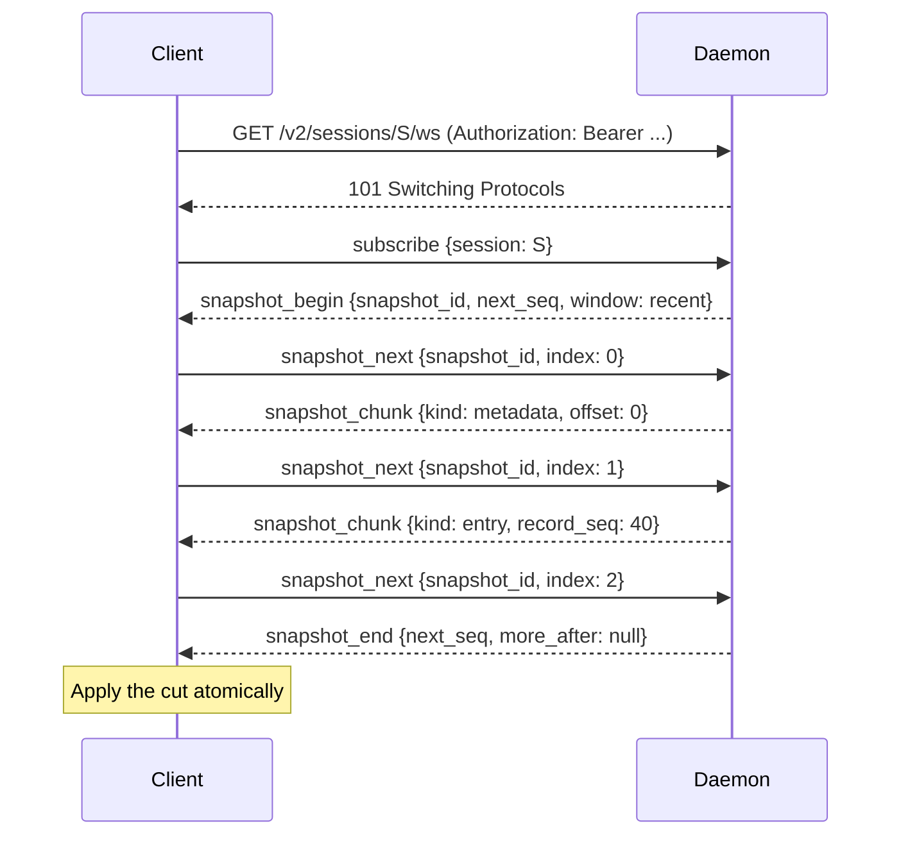
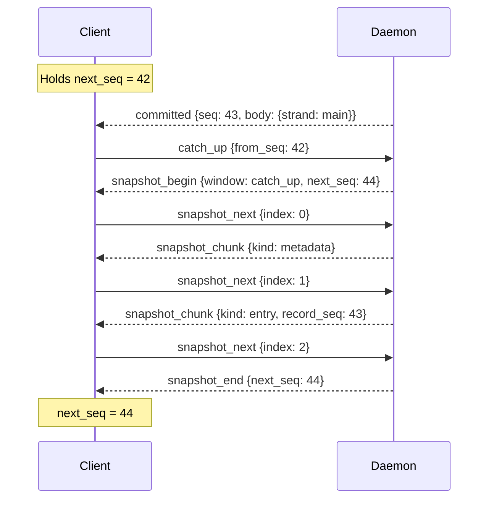
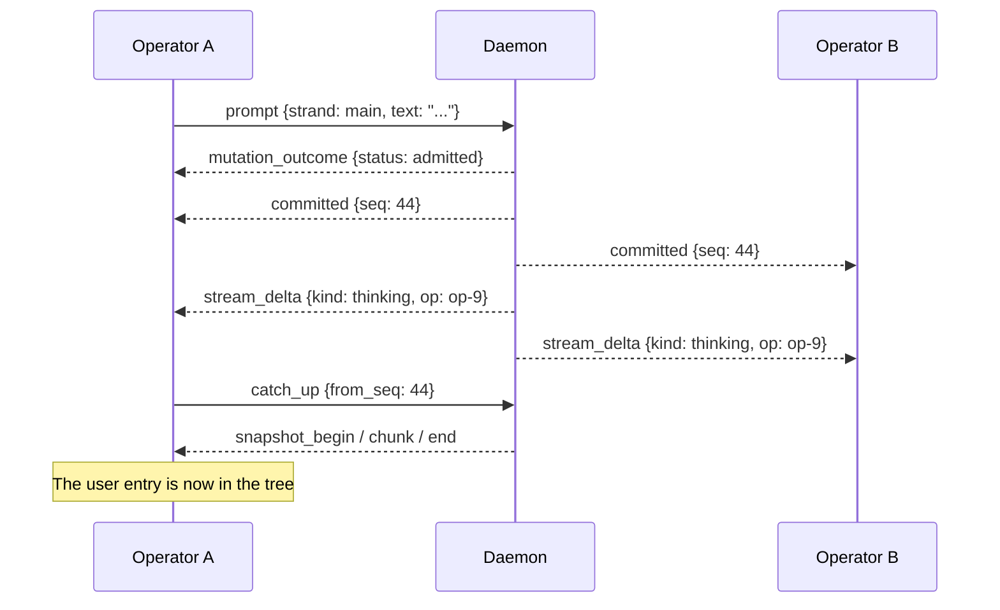
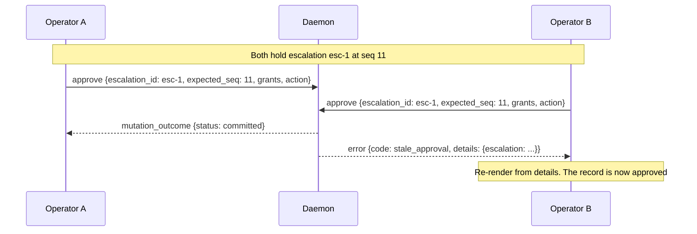
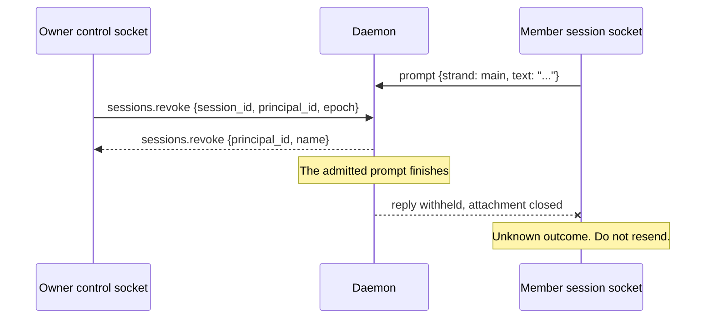
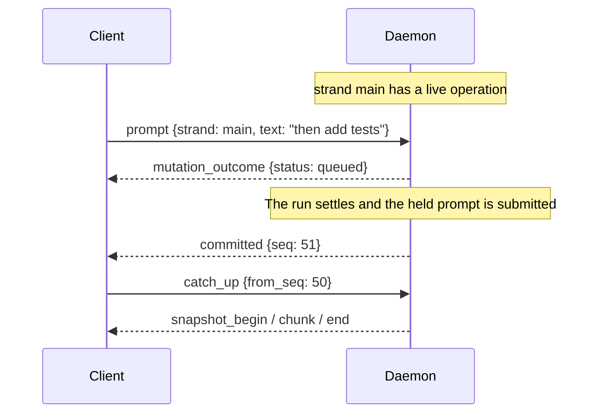

# Loom client protocol, version 2

This document defines the WebSocket protocol a Loom client speaks to a
Loom daemon. It is complete enough to write a new frontend against
without reading the server sources.

The key words MUST, MUST NOT, SHOULD, SHOULD NOT and MAY are to be
interpreted as described in RFC 2119. A MUST on the client side is an
obligation; a MUST on the server side is a guarantee a client may rely
on.

Every claim below cites the source that fixes it, in the repository's
`path.gleam:line` form. Where an existing Loom document disagrees with
the source, this document follows the source and records the
disagreement in section 11.

---

## 1. Scope and conventions

### 1.1 Transport

The transport is WebSocket over HTTP. Every frame is a text frame
carrying exactly one JSON object. Binary frames are not part of the
protocol: a server that receives one closes the connection.
Source: (`client/daemon/session_socket.gleam:165-171`).

Per-message compression is disabled on both endpoints.
Source: (`client/daemon/server.gleam:250`).

### 1.2 Envelopes

A client sends command envelopes. A server sends event envelopes.

Command envelope:

```json
{"v": 2, "id": 7, "cmd": "catch_up", "body": {"from_seq": 42}}
```

| Field | Type | Presence | Meaning |
|---|---|---|---|
| `v` | integer | required | Protocol version. MUST be `2`. |
| `id` | integer | required | Client-assigned correlation id. MUST be greater than zero and unique among the commands in flight on this connection. |
| `cmd` | string | required | Command name. |
| `body` | object | required in practice | Command body. An absent `body` decodes as `{}` on the session endpoint and is a refusal on the control endpoint. |

Source: (`client/protocol.gleam:685-714`) and
(`client/daemon/protocol.gleam:124-160`).

Event envelope:

```json
{"v": 2, "reply_to": 7, "event": "snapshot", "seq": 12, "body": {"mode": "resume", "next_seq": 57}}
```

| Field | Type | Presence | Meaning |
|---|---|---|---|
| `v` | integer | required | Always `2`. |
| `reply_to` | integer | optional | The `id` of the command this frame answers. Absent on a frame the server sent on its own initiative. |
| `event` | string | required | Event name. |
| `seq` | integer | optional | Storage sequence of the durable write this event reports. Present only on durable-stream events. |
| `body` | object | required | Event body. |

Source: (`client/protocol.gleam:918-927`).

Field order in an encoded envelope is `v`, `reply_to`, `event`, `seq`,
`body`. A client MUST NOT depend on that order; JSON object key order
carries no meaning here.

### 1.3 Correlation

Every command a client sends receives exactly one reply on the same
connection: an event carrying `reply_to` equal to that command's `id`,
or an `error` event carrying that `reply_to`. A client MUST match
replies by `id` and MUST NOT infer a reply from the event name alone.

A frame with no `reply_to` answers no command. Such frames are described
in section 6. A client MUST accept an uncorrelated frame in any phase
of the connection and MUST NOT treat it as the answer to an outstanding
request. Source: (`client/protocol.gleam:475-485`).

The reference terminal enforces the rule directly: a frame whose
`reply_to` names anything other than the outstanding request is a
protocol failure that closes the socket, while an absent `reply_to`
routes to the pushed path. Source: (`tui/session_wire.gleam:188-192`).

### 1.4 Sequence numbers

`seq` is the storage sequence of the write that produced the event. All
writes in one session share a single increasing sequence space, so
sequence numbers are sparse from any one event stream's point of view. A
numeric gap does not by itself mean an event was lost.
Source: (`client/gateway.gleam:103-108`).

`snapshot`, `snapshot_begin`, `snapshot_chunk`, `snapshot_end`,
`stream_delta`, `mutation_outcome`, `presence` and `error` carry no
`seq`.

### 1.5 Forward compatibility

Within version 2:

- A receiver MUST ignore unknown fields inside a body it otherwise
  understands.
- A client MUST ignore an event whose name it does not know rather than
  closing the connection. Source: (`client/protocol.gleam:1338`).
- A server answers an unknown command name with an `error` event whose
  code is `unsupported`.
  Source: (`client/gateway.gleam:2855-2863`).

A server MUST NOT remove a field or change the meaning of one within
version 2.

Both sides keep an unrecognised name as data rather than failing on it.
A command name this server does not know decodes to `UnknownCommand`,
which carries the raw body so the refusal can name it
(`client/protocol.gleam:185`). An event name a client does not know
decodes to `UnknownEvent` with its body kept
(`client/protocol.gleam:465`).

### 1.6 Nested durable values

Some bodies embed values that already have a durable JSON form inside
the harness: conversation entries, agent messages and usage rows. Those
are carried verbatim in the durable codec's own vocabulary, which uses
camelCase field names. Every field the protocol itself defines uses
snake_case. Source: (`client/protocol.gleam:12-18`).

Two details of the wire form differ from the harness's internal
rendering, and the wire form is normative:

- An assistant `toolCall` content block nests the call under a
  `toolCall` key, where the internal codec inlines its fields.
  Source: (`client/protocol.gleam:2028-2041`).
- A `thinking` content block always carries `redacted`, where the
  internal codec omits the default `false`.
  Source: (`client/protocol.gleam:2043-2050`).

Floats are printed positionally for decimal exponents between -7 and 21
(`0.00027`), and in scientific notation outside that range.
Source: (`client/protocol.gleam:2105-2125`).

---

## 2. Connecting

### 2.1 Endpoints

One listener serves two endpoints.

| Path | Purpose |
|---|---|
| `/v2/control` | Daemon metadata, membership and lifecycle. |
| `/v2/sessions/<session-id>/ws` | One resident session's conversation. |

Any other path returns HTTP 404.
Source: (`client/daemon/server.gleam:99-104`).

`<session-id>` MUST be the canonical session identifier the control
endpoint reported. A path segment that is not a canonical session id is
refused with HTTP 409. Source: (`client/daemon/server.gleam:167-169`).

### 2.2 The upgrade request

The upgrade request MUST carry an `Authorization` header of the form
`Bearer <token>`. The header MUST be at most 4096 bytes and the token
part MUST be non-empty. The server hashes the token with SHA-256 and
matches the lowercase hexadecimal digest against its durable credential
catalogue; the plaintext token is never stored.
Source: (`client/daemon/server.gleam:129-148`).

An upgrade with no header, a header that is not a bearer, a token that
authenticates nothing, or a daemon that has stopped accepting
attachments, returns HTTP 401 with the body `unauthorized or
unavailable`. The response does not distinguish those cases.
Source: (`client/daemon/server.gleam:106-127`).

Session upgrades have three further outcomes:

| Status | Body | Cause |
|---|---|---|
| 409 | `session unavailable` | The session id is not canonical, the credential has no membership in it, or the session is not currently resident. |
| 503 | `connection capacity unavailable` | The daemon holds no free connection reservation. |
| 101 | (upgrade) | Admitted. |

Source: (`client/daemon/server.gleam:184-215`).

A session route resolves an already resident session only. It never
opens a saved one; opening is the separate `sessions.open` control
command. Source: (`client/daemon/server.gleam:219-227`).

### 2.3 Obtaining a bearer

There are two kinds of credential.

**The owner token.** The daemon mints one 256-bit token on first start
and writes it, as 64 lowercase hexadecimal characters with no trailing
newline, to `owner.token` inside its private state directory. The
directory defaults to `$HOME/.loom` and is overridden by the daemon's
`--state-dir` flag; the file's path is therefore `$HOME/.loom/owner.token`
by default. Source: (`client/daemon/root.gleam:819-836`) and
(`client/daemon/main.gleam:191-197`).

A client discovering a running daemon reads the same file, rejecting
anything that is not exactly 64 hexadecimal characters after trimming.
Source: (`tui/daemon/bootstrap.gleam:241-260`).

The daemon prints the endpoint and the token file path on startup.
Source: (`client/daemon/main.gleam:465-477`).

**Per-principal credentials.** The owner issues these over the control
endpoint. `sessions.invite` creates a member identity, its first
credential and one session membership in a single durable transaction,
and its successful reply is the only place the fresh bearer appears.
`credentials.rotate` replaces every credential of an existing member and
likewise returns the replacement bearer. Section 3 gives both bodies.
Source: (`client/daemon/server.gleam:515-552`).

A client MUST NOT log a bearer, place it in a URL, or send it anywhere
but the `Authorization` header of an upgrade request.

### 2.4 Transport security

The daemon binds loopback only. Its `--bind` flag accepts `127.0.0.1:port`
or `[::1]:port` and refuses anything else, so there is no cleartext
listener on a routable address to protect.
Source: (`client/daemon/main.gleam:260-272`).

The daemon terminates no TLS of its own. A client reaching a daemon from
another host MUST do so through a trusted TLS endpoint or an
authenticated tunnel, and MUST NOT send a bearer over unprotected TCP.

### 2.5 Roles

Authentication resolves a principal; authorization resolves that
principal's authority over the target session. Three authorities exist.

| Authority | Origin | Session commands allowed |
|---|---|---|
| `owner` | The owner token. | All. |
| `operator` | A membership with role `operator`. | All. |
| `observer` | A membership with role `observer`. | Read-only commands only. |

Source: (`client/gateway.gleam:1892-1898`).

The read-only set is `subscribe`, `catch_up`, `snapshot_next`,
`history`, `escalations_get`, `models` and `schedules`. Every other
command from an observer is refused with the code `forbidden` before any
durable write or effect dispatch.
Source: (`client/gateway.gleam:1957-1981`) and
(`client/gateway.gleam:2834-2846`).

On the control endpoint, owner authority is required for
`sessions.create`, `sessions.default`, `sessions.set_default`,
`sessions.stop`, `sessions.invite`, `credentials.rotate` and
`daemon.shutdown`; a member principal receives `forbidden`.
Source: (`client/daemon/server.gleam:472-477`).

### 2.6 Revocation while attached

Authority is resolved fresh on every frame rather than cached at
attachment. The server re-resolves it when it admits a command and again
immediately before it writes the answer, and closes the attachment if
the answer changed. A command already admitted may finish; its reply
does not reach a peer that has lost the right to it, and no further
command from that socket is admitted.
Source: (`client/gateway.gleam:37-48`) and
(`client/gateway.gleam:1741-1750`).

Three refusals close an attached socket:

| Refusal | Meaning |
|---|---|
| `stale epoch` | The attachment names a previous daemon lifetime. |
| `stale incarnation` | The session's resident instance is no longer the admitted one. |
| `unauthorized` | The credential is revoked, or is no longer a member of this session. |

Source: (`client/daemon/session_socket.gleam:348-355`) and
(`client/daemon/manager.gleam:401-413`).

A client MUST treat a closed socket as an unknown outcome for any
command whose reply it did not receive, and MUST NOT resend that
command. Section 6.5 states the rule in full.

---

## 3. The control endpoint

### 3.1 The `hello` event

Immediately after admission the server sends one `hello` event with no
`reply_to`. A client MUST read it before issuing any command, because it
carries the daemon epoch that most control commands must echo.

```json
{"v":2,"event":"hello","body":{"protocol":2,"epoch":"ep-7f3a","principal":"owner-1a2b","limits":{"control_bytes":65536,"observer_bytes":65536,"operator_bytes":33554432,"connections":64,"reserved_message_bytes":167772160}}}
```

| Field | Type | Presence | Meaning |
|---|---|---|---|
| `protocol` | integer | required | Always `2`. |
| `epoch` | string | required | This daemon lifetime's identity. |
| `principal` | string | required | The authenticated principal's id. |
| `limits.control_bytes` | integer | required | Maximum control message size, in bytes. |
| `limits.observer_bytes` | integer | required | Maximum session message size for an observer. |
| `limits.operator_bytes` | integer | required | Maximum session message size for an operator or owner. |
| `limits.connections` | integer | required | Maximum simultaneous reservations and admitted sockets. |
| `limits.reserved_message_bytes` | integer | required | Aggregate admission budget across all connections. |

Source: (`client/daemon/server.gleam:270-296`).

The epoch changes when the daemon restarts. A client MUST discard
ephemeral state and re-select a session on reconnecting to a different
epoch.

### 3.2 Envelope rules on this endpoint

A control message MUST be at most 65536 bytes, in both directions. The
size check precedes parsing. Source:
(`client/daemon/protocol.gleam:21`) and
(`client/daemon/protocol.gleam:366-372`).

The JSON parser refuses duplicate keys and excessive nesting, so field
lookup has one interpretation. Source:
(`client/daemon/protocol.gleam:113-117`).

`body` is required on this endpoint; an absent one is
`bad_request`.
Source: (`client/daemon/protocol.gleam:157-166`).

Every text field is bounded. The bound is stated per command below, and
an empty string never satisfies a required text field.
Source: (`client/daemon/protocol.gleam:288-303`).

A successful reply's `event` name is the command name. A failure is an
`error` event carrying `{"code": ..., "message": ...}` with the same
`reply_to`.
Source: (`client/daemon/server.gleam:403-435`).

Every failure the dispatcher itself produces carries the fixed message
`request refused`; the code is the machine-readable part and the message
never quotes the request or a private path.
Source: (`client/daemon/server.gleam:429-433`).

### 3.3 `status`

Reads daemon readiness and capacity. Body is `{}`. Requires no epoch and
no particular authority.

```json
{"v":2,"id":1,"cmd":"status","body":{}}
```

Reply:

```json
{"v":2,"reply_to":1,"event":"status","body":{"ready":true,"epoch":"ep-7f3a","capacity":8,"occupied":1,"opening":0,"resident":1,"stopping":0,"blocked":0,"domain_capacity":8,"domain_occupied":1,"domain_blocked":0}}
```

| Field | Type | Presence | Meaning |
|---|---|---|---|
| `ready` | boolean | required | Whether the daemon is accepting new work. |
| `epoch` | string | required | This daemon lifetime. |
| `capacity` | integer | required | Maximum simultaneous resident sessions. |
| `occupied` | integer | required | Session slots held. |
| `opening` | integer | required | Sessions currently opening. |
| `resident` | integer | required | Sessions currently resident. |
| `stopping` | integer | required | Sessions currently draining. |
| `blocked` | integer | required | Sessions whose recovery is blocked. |
| `domain_capacity` | integer | required | Maximum simultaneous retained domains. |
| `domain_occupied` | integer | required | Domain slots held, including a retired domain whose sessions have not yet retired. |
| `domain_blocked` | integer | required | Domain slots with a reported failure or lost cleanup proof. |

Source: (`client/daemon/server.gleam:580-600`).

Errors: `unavailable`, `not_initialized`, `capacity`, `not_found`,
`conflict`, `bad_request` (all through the shared mapping in
`client/daemon/server.gleam:839-851`).

### 3.4 `sessions.list`

Lists the sessions this credential may see, in one bounded page.

| Field | Type | Presence | Meaning |
|---|---|---|---|
| `after` | string | required | Continuation cursor. The empty string starts a listing; otherwise a canonical session id. |
| `revision` | integer | optional | Catalogue revision the client is paging over. A mismatch is refused. |

Source: (`client/daemon/protocol.gleam:214-218`) and
(`client/daemon/protocol.gleam:316-332`).

```json
{"v":2,"id":2,"cmd":"sessions.list","body":{"after":""}}
```

Reply:

```json
{"v":2,"reply_to":2,"event":"sessions.list","body":{"revision":19,"sessions":[{"session_id":"0198c0de-0000-7000-8000-000000000001","workspace":"/src/loom","name":"retry work","created_at":1756000000000,"status":{"state":"resident","incarnation":"ep-7f3a:op-4"}}],"after":"0198c0de-0000-7000-8000-000000000001"}}
```

| Field | Type | Presence | Meaning |
|---|---|---|---|
| `revision` | integer | required | The catalogue revision this page was read at. |
| `sessions` | array | required | Session records, in cursor order. |
| `after` | string or null | required | The last record's id, to pass as the next `after`; `null` when the page is empty. |

Source: (`client/daemon/server.gleam:777-787`).

Each session record:

| Field | Type | Presence | Meaning |
|---|---|---|---|
| `session_id` | string | required | Canonical session identity. |
| `workspace` | string | required | Server-canonicalized workspace directory. |
| `name` | string | required | Display name chosen at creation. |
| `created_at` | integer | required | Creation time in milliseconds. |
| `status` | object | required | Lifecycle status, described below. |

Source: (`client/daemon/server.gleam:806-814`).

A status object is discriminated by `state`:

| `state` | Extra fields | Meaning |
|---|---|---|
| `saved` | none | Not resident. |
| `opening` | `operation` | An open is in progress under that operation id. |
| `resident` | `incarnation` | Resident under that runtime incarnation. |
| `stopping` | `operation` | Draining under that operation id. |
| `recovery_blocked` | none | Retained after a failure; not openable. |

Source: (`client/daemon/server.gleam:816-837`).

A page stops on an authorized record boundary once its encoded size
would exceed 60000 bytes. The next request resumes after the last
emitted id. A single record too large for that budget is refused with
`metadata_too_large`. Source: (`client/daemon/server.gleam:791-804`).

Errors: `revision_changed` when `revision` was supplied and differs from
the catalogue's current one; `metadata_too_large`; `unavailable`.
Source: (`client/daemon/server.gleam:601-609`) and
(`client/daemon/server.gleam:769-775`).

### 3.5 `sessions.get`

| Field | Type | Presence | Meaning |
|---|---|---|---|
| `session_id` | string | required | Canonical session id, at most 64 bytes. |

Source: (`client/daemon/protocol.gleam:219`) and
(`client/daemon/protocol.gleam:305-314`).

```json
{"v":2,"id":3,"cmd":"sessions.get","body":{"session_id":"0198c0de-0000-7000-8000-000000000001"}}
```

The reply body is a session record. For the owner it carries one extra
field, `domain_scope`, whose value is `workspace_private` or
`session_only`; a member principal receives the plain record.
Source: (`client/daemon/server.gleam:736-767`).

Errors: `forbidden` when the credential has no membership,
`not_found`, `unavailable`.

### 3.6 `sessions.default` and `sessions.set_default`

Both are owner-only and neither opens a session.

`sessions.default` body:

| Field | Type | Presence | Meaning |
|---|---|---|---|
| `workspace` | string | required | Workspace path, at most 4096 bytes. |

`sessions.set_default` body:

| Field | Type | Presence | Meaning |
|---|---|---|---|
| `workspace` | string | required | Workspace path, at most 4096 bytes. |
| `session_id` | string | required | Canonical session id to make default. |

Source: (`client/daemon/protocol.gleam:220-226`).

```json
{"v":2,"id":4,"cmd":"sessions.set_default","body":{"workspace":"/src/loom","session_id":"0198c0de-0000-7000-8000-000000000001"}}
```

The reply body of each is a session record.
Source: (`client/daemon/server.gleam:619-630`).

Errors: `forbidden`, `not_found`, `unavailable`.

### 3.7 `sessions.create`

Owner-only. Reserves a durable identity and initializes the session.

| Field | Type | Presence | Meaning |
|---|---|---|---|
| `request_key` | string | required | Idempotency key, at most 256 bytes. Retrying with the same key recovers the original identity. |
| `workspace` | string | required | Workspace directory, at most 4096 bytes. Canonicalized by the server. |
| `name` | string | required | Display name, at most 256 bytes. Never becomes a filename. |
| `configuration` | string | required | Configuration file path, at most 4096 bytes. Canonicalized by the server. |
| `domain_scope` | string | optional | `workspace_private` (the default) or `session_only`. |

Source: (`client/daemon/protocol.gleam:227-234`) and
(`client/daemon/protocol.gleam:256-263`).

```json
{"v":2,"id":5,"cmd":"sessions.create","body":{"request_key":"tui-9c1","workspace":"/src/loom","name":"retry work","configuration":"/src/loom/loom.toml","domain_scope":"session_only"}}
```

The reply body is a session record.
Source: (`client/daemon/server.gleam:631-651`).

Errors: `forbidden`; `invalid_workspace` and `invalid_configuration`
when a path cannot be canonicalized; `conflict` when the key was reused
with different metadata; `unavailable`.
Source: (`client/daemon/server.gleam:634-641`).

The server assigns the database path beneath its own private session
directory. A client MUST NOT expect its `name` to appear in any path.

### 3.8 `sessions.open`

| Field | Type | Presence | Meaning |
|---|---|---|---|
| `session_id` | string | required | Canonical session id. |
| `epoch` | string | required | The epoch from `hello`, at most 256 bytes. |

Source: (`client/daemon/protocol.gleam:235-239`).

```json
{"v":2,"id":6,"cmd":"sessions.open","body":{"session_id":"0198c0de-0000-7000-8000-000000000001","epoch":"ep-7f3a"}}
```

The reply body is a status object (section 3.4). Concurrent opens share
one operation, so two clients opening the same session receive the same
operation id. Source: (`client/daemon/server.gleam:652-659`).

Requires operator authority or better on the target session.
Errors: `stale_epoch`, `forbidden`, `not_found`, `capacity`,
`unavailable`.

A client MUST wait for `status.state` to become `resident` before
attempting the session upgrade. `operations.get` is how it polls.

### 3.9 `sessions.stop`

Owner-only. Requests ordered cleanup; the conversation database is
preserved.

| Field | Type | Presence | Meaning |
|---|---|---|---|
| `session_id` | string | required | Canonical session id. |
| `epoch` | string | required | Current daemon epoch. |

Source: (`client/daemon/protocol.gleam:240-244`).

```json
{"v":2,"id":7,"cmd":"sessions.stop","body":{"session_id":"0198c0de-0000-7000-8000-000000000001","epoch":"ep-7f3a"}}
```

The reply body is a status object. A caller's timeout does not cancel
cleanup and does not free the slot.
Source: (`client/daemon/server.gleam:660-666`).

Errors: `forbidden`, `stale_epoch`, `not_found`, `unavailable`.

### 3.10 `operations.get`

| Field | Type | Presence | Meaning |
|---|---|---|---|
| `session_id` | string | required | Canonical session id. |
| `operation` | string | required | Operation id, at most 512 bytes. |
| `epoch` | string | required | Current daemon epoch. |

Source: (`client/daemon/protocol.gleam:245-250`).

```json
{"v":2,"id":8,"cmd":"operations.get","body":{"session_id":"0198c0de-0000-7000-8000-000000000001","operation":"ep-7f3a:op-4","epoch":"ep-7f3a"}}
```

The reply body is a session record whose `status` reflects that
operation. Source: (`client/daemon/server.gleam:667-673`).

Operation ids contain the daemon epoch and an opening nonce, so a
request for an old operation cannot observe a replacement as though it
were the old one. Errors: `stale_operation`, `stale_epoch`, `forbidden`,
`not_found`, `unavailable`.

### 3.11 `sessions.invite`

Owner-only, and the only command besides `credentials.rotate` whose
reply contains a bearer.

| Field | Type | Presence | Meaning |
|---|---|---|---|
| `session_id` | string | required | Session the membership is created in. |
| `principal_id` | string | required | Caller-chosen member id, at most 128 bytes. Reserved permanently. |
| `name` | string | required | Display name, at most 256 bytes. |
| `role` | string | required | `operator` or `observer`. Never `owner`. |
| `epoch` | string | required | Current daemon epoch. |

Source: (`client/daemon/protocol.gleam:182-189`) and
(`client/daemon/protocol.gleam:265-272`).

```json
{"v":2,"id":9,"cmd":"sessions.invite","body":{"session_id":"0198c0de-0000-7000-8000-000000000001","principal_id":"reviewer-1","name":"Reviewer","role":"operator","epoch":"ep-7f3a"}}
```

Reply:

```json
{"v":2,"reply_to":9,"event":"sessions.invite","body":{"bearer":"2f1c...9a","principal_id":"reviewer-1","name":"Reviewer"}}
```

| Field | Type | Presence | Meaning |
|---|---|---|---|
| `bearer` | string | required here | The new credential, in plaintext. Returned once and never again. |
| `principal_id` | string | required | The member id. |
| `name` | string | required | The member's display name. |

Source: (`client/daemon/server.gleam:703-724`).

The target session's domain scope MUST be `session_only`; a
workspace-private session is refused with `isolation_required`.
Source: (`client/daemon/server.gleam:726-734`).

Errors: `forbidden`, `stale_epoch`, `isolation_required`, `conflict`
when the principal id was already used, `unavailable`.

A client MUST NOT retry an invitation automatically after a timeout.
The outcome is unknown, and the caller recovers the known identity with
`credentials.rotate` instead.

### 3.12 `sessions.set_role` and `sessions.revoke`

`sessions.set_role` body:

| Field | Type | Presence | Meaning |
|---|---|---|---|
| `session_id` | string | required | Session whose membership changes. |
| `principal_id` | string | required | Member id. |
| `role` | string | required | `operator` or `observer`. |
| `epoch` | string | required | Current daemon epoch. |

`sessions.revoke` body:

| Field | Type | Presence | Meaning |
|---|---|---|---|
| `session_id` | string | required | Session whose membership is removed. |
| `principal_id` | string | required | Member id. |
| `epoch` | string | required | Current daemon epoch. |

Source: (`client/daemon/protocol.gleam:190-202`).

```json
{"v":2,"id":10,"cmd":"sessions.set_role","body":{"session_id":"0198c0de-0000-7000-8000-000000000001","principal_id":"reviewer-1","role":"observer","epoch":"ep-7f3a"}}
```

Each reply body carries `principal_id` and `name` and no bearer.
Source: (`client/daemon/server.gleam:553-570`).

A `sessions.set_role` that creates a membership requires
`session_only` scope and is otherwise refused with
`isolation_required`. Revoking a membership does not.
Errors also include `forbidden`, `stale_epoch`, `not_found`,
`unavailable`.

Revocation takes effect at the target's next command, transfer
continuation, or delivery check, which closes that attachment.

### 3.13 `credentials.rotate` and `credentials.revoke`

Both take one body shape:

| Field | Type | Presence | Meaning |
|---|---|---|---|
| `principal_id` | string | required | Member id, at most 128 bytes. |
| `epoch` | string | required | Current daemon epoch. |

Source: (`client/daemon/protocol.gleam:203-212`).

```json
{"v":2,"id":11,"cmd":"credentials.rotate","body":{"principal_id":"reviewer-1","epoch":"ep-7f3a"}}
```

`credentials.rotate` revokes every active credential of that member and
inserts one replacement in the same transaction; its reply carries the
fresh `bearer` alongside `principal_id` and `name`.
`credentials.revoke` revokes without replacement and returns no bearer.
Source: (`client/daemon/server.gleam:534-579`).

Owner credentials are outside these commands: the owner token file has
its own lifetime.

Errors: `forbidden`, `stale_epoch`, `not_found`, `unavailable`.

### 3.14 `sessions.isolate`

Owner-only. Gives a session its own domain so that it can be shared.

| Field | Type | Presence | Meaning |
|---|---|---|---|
| `session_id` | string | required | Canonical session id. |
| `transcript` | string | required | MUST be exactly `share_existing`. Any other value is `bad_request`. |
| `epoch` | string | required | Current daemon epoch. |

Source: (`client/daemon/protocol.gleam:169-181`).

```json
{"v":2,"id":12,"cmd":"sessions.isolate","body":{"session_id":"0198c0de-0000-7000-8000-000000000001","transcript":"share_existing","epoch":"ep-7f3a"}}
```

Reply:

```json
{"v":2,"reply_to":12,"event":"sessions.isolate","body":{"session_id":"0198c0de-0000-7000-8000-000000000001","domain_scope":"session_only"}}
```

Source: (`client/daemon/server.gleam:502-514`).

The acknowledgement is required because isolation is prospective. It
creates fresh domain metadata and copies no aggregate memory or index
files, but the existing transcript may already contain private recalled
text. A client MUST present that consequence to the person before
sending the command.

Errors: `forbidden`, `stale_epoch`, `conflict` when a runtime slot is
still retained, `unavailable`.

### 3.15 `daemon.shutdown`

Owner-only.

| Field | Type | Presence | Meaning |
|---|---|---|---|
| `epoch` | string | required | Current daemon epoch. |

Source: (`client/daemon/protocol.gleam:251`).

```json
{"v":2,"id":13,"cmd":"daemon.shutdown","body":{"epoch":"ep-7f3a"}}
```

Reply:

```json
{"v":2,"reply_to":13,"event":"daemon.shutdown","body":{"state":"draining"}}
```

The acknowledgement is written before the drain begins, so a client
receives it. Source: (`client/daemon/server.gleam:300-310`) and
(`client/daemon/server.gleam:674-681`).

Errors: `forbidden`, `stale_epoch`.

### 3.16 Reads during a drain

While the daemon is draining, an existing control socket may still issue
the read commands `status`, `sessions.list`, `sessions.get`,
`sessions.default` and `operations.get`. Every mutating control command
is refused. Source: (`client/daemon/server.gleam:440-459`).

---

## 4. The session endpoint

### 4.1 Attachment and admission

The upgrade resolves an immutable attachment: session id, daemon epoch,
resident incarnation, principal, role, credential digest and a fresh
connection id. Nothing a client sends can change any of them.
Source: (`client/daemon/server.gleam:47-75`).

The socket sends no `hello`. A client's first command MUST be
`subscribe`; every other command before it is refused with
`bad_request` and the message `subscribe before sending commands`.
Source: (`client/gateway.gleam:2877-2886`).

A second `subscribe` on the same connection is refused with `conflict`.
Source: (`client/gateway.gleam:2867-2876`).

### 4.2 Stop-and-wait credit

A client MUST have at most one command in flight. The server admits one
frame, computes one bounded reply, writes it, and only then reads the
next frame from that socket. Source:
(`client/daemon/session_socket.gleam:276-298`).

A reply is bounded at 65536 encoded bytes. The server sizes the encoded
envelope before serializing it; an envelope that would exceed the bound
fails, and the failure closes the attachment rather than truncating.
Source: (`client/gateway.gleam:2635-2646`).

Inbound frames are bounded per role: 65536 bytes for an observer, and
33554432 bytes for an operator or owner. The bound applies to a complete
message, fragmented or not.
Source: (`client/daemon/root.gleam:372-377`) and
(`client/daemon/session_socket.gleam:99-112`).

The server answers one command within six seconds. A client that
receives no reply in that window MUST treat the outcome as unknown.
Source: (`client/gateway.gleam:723-733`).

### 4.3 The bounded snapshot transfer

Conversation state does not arrive in one frame. It arrives as a
transfer: one header, then a fragment per credit, then a terminator.

Four commands begin a transfer: `subscribe`, `catch_up`, `history` and
`escalations_get`.
Source: (`client/gateway.gleam:1234-1264`).

A connection holds at most one transfer. Beginning a second while one is
open is refused with `stale_snapshot` and the message `finish the
current transfer or subscribe first`.
Source: (`client/gateway.gleam:1340-1352`).

A transfer expires 30000 milliseconds after its capture. The deadline is
absolute: a fragment does not extend it.
Source: (`client/daemon/transfer.gleam:33-34`) and
(`client/daemon/transfer.gleam:165-167`).

#### 4.3.1 The procedure

1. Send `subscribe`, `catch_up`, `history` or `escalations_get`.
2. Receive `snapshot_begin`. Validate its identity fields against the
   attachment the client selected, and record `snapshot_id`,
   `next_seq`, `record_bytes_limit` and `fragment_bytes_limit`. Set the
   local continuation index to `0`.
3. Send `snapshot_next` with that `snapshot_id` and index.
4. Receive one frame. It is either `snapshot_chunk` or `snapshot_end`.
   - On `snapshot_chunk`: verify `snapshot_id` and that `index` equals
     the index last sent. Base64-decode `data`. Verify that `offset`
     equals the number of bytes already accumulated for `record_id`, and
     that `offset + len(data) <= total_bytes`. Append. Increment the
     local index by one and return to step 3.
   - On `snapshot_end`: verify `snapshot_id`, that `next_seq` equals the
     value from `snapshot_begin`, and that no record is partially
     accumulated. The transfer is complete.
5. Apply the assembled state atomically. A client MUST NOT show a
   partial transfer as a new view.

Source: (`client/daemon/transfer.gleam:195-202`),
(`client/daemon/transfer.gleam:245-269`) and
(`tui/snapshot.gleam:296-345`).

The first record of every transfer is the metadata document, carried
under `record_id` `metadata` with `record_seq` `null`. Entry records
follow, in ascending `record_seq`. A client MUST reject an entry
fragment that arrives before metadata is complete.
Source: (`tui/snapshot.gleam:352-372`).

Records are contiguous: a client MUST NOT interleave two `record_id`
values. A fragment naming a different record while one is incomplete is
a protocol violation. Source: (`tui/snapshot.gleam:340-350`).

#### 4.3.2 `snapshot_begin`

```json
{"v":2,"reply_to":1,"event":"snapshot_begin","body":{"snapshot_id":"3:0","next_seq":42,"window":"recent","complete_history":false,"record_bytes_limit":33554432,"fragment_bytes_limit":24576,"oldest_seq":11,"session_id":"0198c0de-0000-7000-8000-000000000001","epoch":"ep-7f3a","incarnation":"ep-7f3a:op-4","connection_id":"op-91","origin":{"principal":"owner-1a2b","name":"Owner"},"role":"owner"}}
```

| Field | Type | Presence | Meaning |
|---|---|---|---|
| `snapshot_id` | string | required | Transfer identity, 1 to 256 bytes. |
| `next_seq` | integer | required | First sequence after this cut. Nothing in the transfer has a sequence at or above it. |
| `window` | string | required | `recent`, `catch_up`, `history` or `escalations`. |
| `complete_history` | boolean | required | Always `false`. The window is explicitly partial. |
| `record_bytes_limit` | integer | required | Largest single record, in bytes. Always `33554432`. |
| `fragment_bytes_limit` | integer | required | Largest decoded fragment, in bytes. Always `24576`. |
| `oldest_seq` | integer or null | required | Sequence of the earliest descriptor in this window; `null` when there is none. |
| `session_id` | string | required | Canonical session id of this attachment. |
| `epoch` | string | required | Daemon lifetime of this attachment. |
| `incarnation` | string | required | Resident instance of this attachment. |
| `connection_id` | string | required | This attachment's own identity, distinct from the session id. |
| `origin` | object or null | required | `{principal, name}` of the authenticated peer. |
| `role` | string | required | `owner`, `operator` or `observer`. |

Source: (`client/gateway.gleam:1451-1487`) and
(`client/protocol.gleam:1344-1378`).

A client MUST check `session_id`, `epoch` and `incarnation` against the
attachment it selected, MUST check that `complete_history`
is `false`, and MUST refuse a transfer whose declared limits exceed the
values it is prepared to buffer.
Source: (`tui/snapshot.gleam:236-283`).

A client SHOULD refuse a transfer whose identity differs from an earlier
transfer on the same socket. The attachment identity cannot change
during a connection, so a change is evidence of a fault.
Source: (`tui/snapshot.gleam:244-249`).

#### 4.3.3 `snapshot_chunk`

```json
{"v":2,"reply_to":2,"event":"snapshot_chunk","body":{"snapshot_id":"3:0","index":0,"kind":"metadata","record_id":"metadata","record_seq":null,"total_bytes":4096,"offset":0,"data":"eyJtaXNzaW5nIjpbXSwiY2VsbHMiOlt..."}}
```

| Field | Type | Presence | Meaning |
|---|---|---|---|
| `snapshot_id` | string | required | Transfer identity. MUST equal the one from `snapshot_begin`. |
| `index` | integer | required | Continuation index this frame answers. |
| `kind` | string | required | `metadata` or `entry`. |
| `record_id` | string | required | `metadata` for the metadata document; otherwise the canonical entry id. |
| `record_seq` | integer or null | required | `null` for metadata; the entry's durable storage sequence otherwise. |
| `total_bytes` | integer | required | Full byte length of the record being fragmented. |
| `offset` | integer | required | Byte offset of this fragment within the record. |
| `data` | string | required | Base64 of this fragment, at most 32768 encoded bytes. |

Source: (`client/daemon/transfer.gleam:323-344`).

The decoded fragment is at least one byte and at most 24576 bytes;
`offset + len(data)` never exceeds `total_bytes`; `total_bytes` never
exceeds 33554432. A metadata record's `total_bytes` never exceeds
2097152. Source: (`client/protocol.gleam:1388-1420`).

A record whose `total_bytes` exceeds what a client is willing to decode
MAY be drained and retained as a placeholder carrying its id, sequence
and size, rather than materialized. The reference terminal does this
above 4194304 bytes. Source: (`tui/snapshot.gleam:415-420`).

#### 4.3.4 `snapshot_end`

```json
{"v":2,"reply_to":9,"event":"snapshot_end","body":{"snapshot_id":"3:0","index":7,"next_seq":42,"more_after":null}}
```

| Field | Type | Presence | Meaning |
|---|---|---|---|
| `snapshot_id` | string | required | Transfer identity. |
| `index` | integer | required | The final continuation index. |
| `next_seq` | integer | required | Same value the header carried. |
| `more_after` | integer or null | required | For a `history` window, the sequence to pass as the next request's `after_seq`; `null` when the window is exhausted. |

Source: (`client/daemon/transfer.gleam:253-263`) and
(`client/protocol.gleam:1423-1430`).

`more_after` is non-null only for a `history` window, and only when the
descriptor page came back full.
Source: (`client/daemon/transfer.gleam:378-386`).

#### 4.3.5 The metadata document

The metadata record is a JSON object. It is the coherent cut of session
state: everything a client needs besides the entries themselves.

| Field | Type | Presence | Meaning |
|---|---|---|---|
| `missing` | array of string | required | For an `escalations` window, the requested ids that had no cell. Empty for every other window. |
| `cells` | array | required | Register cells in the cut. |
| `usage` | object | required | Session running total, in the durable usage shape (section 5.9). |
| `message_count` | integer | required | Messages in the session. |
| `host_run_settings` | object | required | The host's effective run defaults. |
| `peers` | array | required | Presence roster at capture time; same shape as the `presence` event's entries. |
| `stream_preview` | object or null | required | A bounded, discontinuous sample of a live answer, or `null`. |

Source: (`client/gateway.gleam:1393-1437`).

Each cell:

| Field | Type | Presence | Meaning |
|---|---|---|---|
| `namespace` | string | required | Register namespace. |
| `key` | string | required | Register key. |
| `seq` | integer | required | Sequence of the write that set this cell. |
| `value` | any | required | The cell's payload, verbatim. |

Source: (`client/gateway.gleam:1414-1423`).

For a `recent`, `catch_up` or `history` window, the cells cover strand
configuration, strand leaves, strand state, each strand's last result,
the client fact prefix, pending escalations, and the open operation's
state and metadata. Source: (`client/gateway.gleam:1291-1323`).

For an `escalations` window, the cells are exactly the requested
escalation records, and nothing else.
Source: (`client/gateway.gleam:1358-1369`).

`stream_preview`, when present, carries `revision`, `operation`, `text`
and `discontinuous: true`. Because it is discontinuous, a client MUST
render it as a standalone sample and MUST NOT concatenate two samples.
Source: (`client/gateway.gleam:1849-1857`).

### 4.4 `subscribe`

| Field | Type | Presence | Meaning |
|---|---|---|---|
| `session` | string | required | Canonical session id. MUST equal the one in the route. |
| `from_seq` | integer | optional | Ignored by the authenticated transport. |

Source: (`client/protocol.gleam:754-758`).

```json
{"v":2,"id":1,"cmd":"subscribe","body":{"session":"0198c0de-0000-7000-8000-000000000001"}}
```

The reply is `snapshot_begin` with `window` `recent`. The window is at
most 100 of the newest entry descriptors, and it is not the parent
closure of anything: a client MUST expect entries whose parents it does
not hold, and MUST index entries by id and parent rather than assuming a
single strand's chain. Source: (`client/gateway.gleam:1353-1356`) and
(`storage/snapshot.gleam:42`).

A `session` that is not this attachment's own is refused with the code
`wrong_session`. Source: (`client/gateway.gleam:1245-1254`).

`from_seq` exists in the command's decoder for the in-process host
fixture, where it selects a resume reply. Over the authenticated
transport it is not read: the reply is always a fresh `recent`
transfer, and reconciliation is `catch_up`.
Source: (`client/gateway.gleam:1235-1244`).

### 4.5 `catch_up`

| Field | Type | Presence | Meaning |
|---|---|---|---|
| `from_seq` | integer | required | Lower bound of the reconciliation interval. |

Source: (`client/protocol.gleam:760-763`).

```json
{"v":2,"id":7,"cmd":"catch_up","body":{"from_seq":42}}
```

The reply is `snapshot_begin` with `window` `catch_up`, followed by a
transfer carrying fresh metadata and every entry in the interval.

The interval is `[from_seq, new_next_seq)`. The server converts
`from_seq` into the reader's exclusive lower bound by subtracting one,
so a client passes the `next_seq` of the cut it last adopted.
Source: (`client/daemon/transfer.gleam:134-137`).

A `catch_up` whose interval is empty still costs a metadata capture and
still returns a complete transfer. That is deliberate: metadata-only
changes, such as a configuration change or a strand's leaf moving,
matter even when no entry was written. A client MUST reconcile on a
schedule rather than only when it has evidence that an entry exists.

A client MUST deduplicate entries by storage sequence. Overlapping
catch-up intervals are legal.

### 4.6 `history`

| Field | Type | Presence | Meaning |
|---|---|---|---|
| `after_seq` | integer | required | Exclusive lower bound. |
| `before_seq` | integer | required | Exclusive upper bound. |

Both MUST be non-negative. Source: (`client/protocol.gleam:748-752`).

```json
{"v":2,"id":14,"cmd":"history","body":{"after_seq":0,"before_seq":11}}
```

The reply is `snapshot_begin` with `window` `history`, then metadata,
then one ascending page of at most 100 entry descriptors between the
bounds. Source: (`client/daemon/transfer.gleam:138-140`) and
(`storage/snapshot.gleam:42`).

When the page came back full, `snapshot_end` carries `more_after` set to
the last sequence delivered. A client requesting the next page passes
that value as `after_seq` and keeps the same `before_seq`.
Source: (`client/daemon/transfer.gleam:378-386`).

`history` does not move the client's adopted history cursor. It fills in
older entries beside the window a `subscribe` or `catch_up` established.

### 4.7 `escalations_get`

| Field | Type | Presence | Meaning |
|---|---|---|---|
| `ids` | array of string | required | One to eight escalation ids. Each is non-empty and at most 256 bytes. |

An empty array, more than eight ids, or a non-string element refuses the
command with `bad_request`. Duplicate ids are collapsed.
Source: (`client/protocol.gleam:721-741`).

```json
{"v":2,"id":15,"cmd":"escalations_get","body":{"ids":["esc-1","esc-2"]}}
```

The reply is `snapshot_begin` with `window` `escalations`, followed by a
metadata-only transfer: the found cells, each with its current register
sequence and resolution origin, plus a `missing` array naming the ids
that had no cell. No entry descriptors follow.
Source: (`client/gateway.gleam:1396-1411`).

A client applies the result to those questions only. It MUST NOT replace
its history cursor or its pending-escalation projection from an
escalations transfer. A missing record names no author.

### 4.8 `snapshot_next`

| Field | Type | Presence | Meaning |
|---|---|---|---|
| `snapshot_id` | string | required | The transfer this credit belongs to. |
| `index` | integer | required | The continuation index being granted. |

Source: (`client/protocol.gleam:742-747`).

```json
{"v":2,"id":2,"cmd":"snapshot_next","body":{"snapshot_id":"3:0","index":0}}
```

Each accepted `snapshot_next` yields exactly one `snapshot_chunk` or one
`snapshot_end`. A mismatched `snapshot_id`, a mismatched `index`, or an
expired transfer is refused with `stale_snapshot`.
Source: (`client/gateway.gleam:1503-1518`) and
(`client/gateway.gleam:1531-1540`).

On `stale_snapshot` a client MUST discard the partial transfer and begin
a new one. The server has already dropped its own state.

### 4.9 Mutating commands

Over the authenticated transport, a mutation's reply is a
`mutation_outcome` rather than the durable record it produced. The
record itself travels the credited transfer path, which is the one place
the size bound and the retention window are enforced.
Source: (`client/gateway.gleam:2635-2646`).

Three statuses exist.

| Status | Meaning | Commands |
|---|---|---|
| `admitted` | The command was accepted and its durable write is under way. Not proof that it committed. | `prompt`, `prompt_content`, `steer`, `follow_up`, `abort`, `compact` |
| `committed` | The durable transition has landed. | `approve`, `deny`, `fork`, `create_strand`, `navigate`, `set_config` |
| `queued` | The server holds the message in memory and will submit it when the strand goes idle. | `prompt`, `prompt_content` on a busy strand |

Source: (`client/gateway.gleam:2636-2642`),
(`client/gateway.gleam:4119-4127`),
(`client/gateway.gleam:4305-4308`) and
(`client/gateway.gleam:3511-3518`).

`queued` is not a durable acknowledgement. A client MUST NOT render it
as one, and MUST clear its own queued state when the socket closes,
because the server's queue is process memory that a restart drops.
Source: (`client/gateway.gleam:503-512`).

#### 4.9.1 `prompt`

| Field | Type | Presence | Meaning |
|---|---|---|---|
| `strand` | string | required | Target strand name. |
| `text` | string | required | The user turn's text. |

Source: (`client/protocol.gleam:765`) and
(`client/protocol.gleam:880-888`).

```json
{"v":2,"id":3,"cmd":"prompt","body":{"strand":"main","text":"add a retry to the fetcher"}}
```

Reply: `mutation_outcome` with status `admitted` on an idle strand, or
`queued` on a busy one.

A strand may hold at most four queued prompts. A fifth is refused with
`conflict` and the message `the strand is busy and its queue is full`.
Source: (`client/gateway.gleam:532`) and
(`client/gateway.gleam:3500-3510`).

Errors: `unknown_strand`; `conflict`; `bad_request` for an invalid
message; `internal`.

#### 4.9.2 `prompt_content`

| Field | Type | Presence | Meaning |
|---|---|---|---|
| `strand` | string | required | Target strand name. |
| `content` | array | required | One or more user content blocks, in order. |

Source: (`client/protocol.gleam:766-778`).

```json
{"v":2,"id":18,"cmd":"prompt_content","body":{"strand":"main","content":[{"type":"text","text":"inspect this"},{"type":"image","data":"iVBORw0KGgo=","mimeType":"image/png"}]}}
```

A block is either `{"type":"text","text":...}` with an optional
`textSignature`, or `{"type":"image","data":...,"mimeType":...}` where
`data` is base64. An empty array, an unknown block type, invalid base64,
an empty media type, or a field of the wrong type refuses the whole
command with `bad_request`; no partial message is admitted.
Source: (`client/protocol.gleam:864-878`).

The server appends exactly one user message, preserving block order. A
server that predates this command answers `unsupported`.

#### 4.9.3 `steer`

| Field | Type | Presence | Meaning |
|---|---|---|---|
| `strand` | string | required | Target strand name. |
| `text` | string | required | Text to inject into the live run. |

Source: (`client/protocol.gleam:779`).

```json
{"v":2,"id":4,"cmd":"steer","body":{"strand":"main","text":"prefer exponential backoff"}}
```

The text is picked up at the run's next checkpoint. A strand with no
live operation refuses with `conflict` and the message `strand <name>
has no live operation to steer`.
Source: (`client/gateway.gleam:3713-3721`).

The item becomes durable as a pending register, not yet a placed entry.
It is placed, under the same entry id, when the run consumes it. A
client MUST treat the acknowledgement as a pending marker and MUST NOT
assume the placed entry will arrive: an abort, or a run that settles
without reaching the item, drops it.

#### 4.9.4 `follow_up`

Body is identical to `steer`. Source: (`client/protocol.gleam:780`).

```json
{"v":2,"id":5,"cmd":"follow_up","body":{"strand":"main","text":"now add tests"}}
```

The turn runs after the live operation settles. On an idle strand it
starts a run, behaving as `prompt`.
Source: (`client/gateway.gleam:3755-3778`).

#### 4.9.5 `abort`

| Field | Type | Presence | Meaning |
|---|---|---|---|
| `strand` | string | required | Target strand name. |

Source: (`client/protocol.gleam:781-785`).

```json
{"v":2,"id":6,"cmd":"abort","body":{"strand":"main"}}
```

The server marks the operation cancelled and sweeps the effect plane, so
that a background job the operation started also stops. A strand with no
live operation refuses with `conflict`.
Source: (`client/gateway.gleam:3780-3823`).

The durable `cancel_requested` transition reaches every subscriber
through the notice path; the reply itself is `mutation_outcome` with
status `admitted`.

#### 4.9.6 `approve`

| Field | Type | Presence | Meaning |
|---|---|---|---|
| `escalation_id` | string | required | The escalation being answered. |
| `grants` | array | required | The exact policy diff the client displayed. |
| `action` | string | required | The action digest the client displayed. The empty string when the record names no action. |
| `expected_seq` | integer | required | The record's register sequence as displayed. |

Source: (`client/protocol.gleam:786-803`).

```json
{"v":2,"id":16,"cmd":"approve","body":{"escalation_id":"esc-1","grants":[{"type":"network","network":{"mode":"proxy","allow":["registry.npmjs.org"],"proxy":"127.0.0.1:3128"}}],"action":"9f2c1a7b4e0d63859ac41d2f7b6e8035","expected_seq":11}}
```

All four fields are required. The server reads the record once, checks
the three echoes against it, and commits the approval guarded at that
same sequence, so a competing claim landing in between loses the commit
rather than passing unseen.
Source: (`client/gateway.gleam:3858-3890`).

Three checks, in order:

1. `expected_seq` MUST equal the record's current sequence. A mismatch
   is `stale_approval`. Source: (`client/gateway.gleam:3909-3915`).
2. The record MUST still be pending. Otherwise the code is
   `not_pending`.
   Source: (`client/gateway.gleam:3916-3927`).
3. `action` MUST equal the record's action, and `grants` MUST be a
   subset of the denial's `wanted` diff. Narrowing is legal; widening is
   not. A failure of either is `stale_approval`.
   Source: (`client/gateway.gleam:3957-3984`).

A `stale_approval` reply carries the record as the server now holds it,
under `details.escalation`, in exactly the `escalation` event's body
shape. The command had no effect. A client re-renders its prompt from
those details and issues the command again; it needs no `catch_up` to
recover.
Source: (`client/protocol.gleam:1143-1145`).

A client MUST NOT reconstruct `grants` or `action` from anything but the
record it actually displayed to the person answering. The echo is what
makes consent a statement about a specific widening of a specific
action.

Reply on success: `mutation_outcome` with status `committed`.
Errors: `unknown_escalation`, `not_pending`, `stale_approval`,
`conflict`, `internal`.

#### 4.9.7 `deny`

| Field | Type | Presence | Meaning |
|---|---|---|---|
| `escalation_id` | string | required | The escalation being answered. |
| `expected_seq` | integer | required | The record's register sequence as displayed. |

Source: (`client/protocol.gleam:804-809`).

```json
{"v":2,"id":17,"cmd":"deny","body":{"escalation_id":"esc-1","expected_seq":11}}
```

`deny` runs the same sequence check as `approve` and carries the same
`stale_approval` recovery. It echoes no diff, because a refusal
authorizes nothing. Source: (`client/gateway.gleam:4068-4103`).

Reply: `mutation_outcome` with status `committed`.

#### 4.9.8 `fork`

| Field | Type | Presence | Meaning |
|---|---|---|---|
| `strand` | string | required | Source strand. |
| `scope` | string | required | `branch` or `tree`. |
| `name` | string | optional | Requested name for the new strand. |

Source: (`client/protocol.gleam:810-821`).

```json
{"v":2,"id":19,"cmd":"fork","body":{"strand":"main","scope":"branch","name":"alt-approach"}}
```

Both scopes fork in place: the new strand's leaf is the source strand's
current leaf, in the same session. `scope` is accepted and validated but
does not change the result today.
Source: (`client/gateway.gleam:2928-2929`) and
(`client/gateway.gleam:4129-4160`).

An absent `name` produces `<strand>-fork`. A name already in use is
given a numeric suffix rather than refused.
Source: (`client/gateway.gleam:4201-4215`).

Reply: `mutation_outcome` with status `committed`. The new strand
appears in the next transfer's metadata cells.

Errors: `unknown_strand`, `internal`.

#### 4.9.9 `create_strand`

| Field | Type | Presence | Meaning |
|---|---|---|---|
| `name` | string | optional | Requested name. Defaults to `strand-<n>`. |

Source: (`client/protocol.gleam:834-838`).

```json
{"v":2,"id":20,"cmd":"create_strand","body":{"name":"research"}}
```

The new strand is idle and copies its configuration from `main`, or from
the first existing strand when there is no `main`. Its per-turn thinking
level comes from the catalogue entry its model identity names rather
than from the copied strand's current level.
Source: (`client/gateway.gleam:4163-4198`) and
(`client/gateway.gleam:4283-4295`).

Reply: `mutation_outcome` with status `committed`.
Errors: `conflict` when the name exists, `internal`.

#### 4.9.10 `navigate`

| Field | Type | Presence | Meaning |
|---|---|---|---|
| `strand` | string | required | Strand whose leaf moves. |
| `to_entry` | string | required | Canonical entry id to move the leaf to. |

Source: (`client/protocol.gleam:822-827`).

```json
{"v":2,"id":21,"cmd":"navigate","body":{"strand":"main","to_entry":"0198c0de-0000-7000-8000-000000000004"}}
```

A `to_entry` that is not a canonical entry id is `bad_request`; one that
does not exist is `bad_request` with the message `the navigation target
does not exist`.
Source: (`client/gateway.gleam:4326-4334`) and
(`client/gateway.gleam:4434-4437`).

Reply: `mutation_outcome` with status `committed`.

#### 4.9.11 `compact`

| Field | Type | Presence | Meaning |
|---|---|---|---|
| `strand` | string | required | Strand to compact. |
| `instructions` | string | optional | Extra summarization instructions. |

Source: (`client/protocol.gleam:828-833`).

```json
{"v":2,"id":22,"cmd":"compact","body":{"strand":"main","instructions":"keep the API decisions"}}
```

The compaction cuts where an automatic one would cut and keeps what an
automatic one would keep. Source: (`client/gateway.gleam:4397-4414`).

Reply: `mutation_outcome` with status `admitted`.
Errors: `conflict` when the strand is busy or there is nothing to
compact, `unknown_strand`, `internal`.

#### 4.9.12 `set_config`

| Field | Type | Presence | Meaning |
|---|---|---|---|
| `strand` | string | optional | The strand to change. Required for per-strand keys. |
| `config` | object | required | The keys to set. |

Source: (`client/protocol.gleam:842-850`).

The accepted keys:

| Key | Value | Scope |
|---|---|---|
| `queue_mode` | `consume_all` or `one_at_a_time` | Session-wide run setting. |
| `tool_execution` | `sequential` or `parallel` | Session-wide run setting. |
| `model_name` | A catalogue name from the `models` listing | The named strand, or every strand when `strand` is absent. |
| `model` | `{provider, model_id}` | Requires `strand`. |
| `thinking_level` | A thinking level name | Requires `strand`. |
| `active_tools` | Array of tool names | Requires `strand`. Validated against the server's tool registry. |

Source: (`client/gateway.gleam:4605-4615`).

```json
{"v":2,"id":23,"cmd":"set_config","body":{"strand":"main","config":{"model_name":"baseten-oss"}}}
```

An unknown key is refused with `bad_request` and nothing is applied. An
unknown `model_name` is refused rather than resolved.
Source: (`client/gateway.gleam:4623-4632`).

Reply to the issuing connection: `mutation_outcome` with status
`committed`. Every other subscribed connection receives an uncorrelated
`snapshot` event with mode `config` carrying the authoritative new
value, so that shared settings converge without a round trip.
Source: (`client/gateway.gleam:4639-4648`).

#### 4.9.13 `models`

Body is `{}`. Read-only, so an observer MAY send it.
Source: (`client/protocol.gleam:841`).

```json
{"v":2,"id":24,"cmd":"models","body":{}}
```

Reply: a `snapshot` event with mode `models` (section 5.4). A server
with no configured catalogue answers an empty list rather than an error.
Source: (`client/gateway.gleam:4451-4463`).

#### 4.9.14 `schedules`

Body is `{}`. Read-only. Source: (`client/protocol.gleam:853`).

```json
{"v":2,"id":25,"cmd":"schedules","body":{}}
```

Reply: a `snapshot` event with mode `schedules` (section 5.5). The body
is deliberately empty because there is nothing to scope: an operator
watching a session is watching all of it. A server with no scheduling
plane answers an empty list.
Source: (`client/gateway.gleam:4488-4498`).

#### 4.9.15 `schedule_cancel`

| Field | Type | Presence | Meaning |
|---|---|---|---|
| `target` | string | required | The strand the schedule fires onto. |
| `name` | string | required | The schedule's own name. |

Source: (`client/protocol.gleam:854-859`).

```json
{"v":2,"id":26,"cmd":"schedule_cancel","body":{"target":"sub:main/reviewer-abc123","name":"heartbeat"}}
```

Both fields are required because the pair is the schedule's durable
identity; a cancel that guessed a target would name a different clock.

Only a schedule a strand created can be cancelled here. On success the
reply is the `schedules` listing as it stands after the cancellation, so
one round trip both acts and re-renders.
Source: (`client/gateway.gleam:4543-4545`).

Errors:

| Code | Cause |
|---|---|
| `bad_request` | No such schedule fires onto that target. A name never used and a name already cancelled are the same absence. |
| `conflict` | The named schedule is an operator `[[schedule]]` table. Those are edited in the configuration file and take effect on restart. |
| `unsupported` | The server has no scheduling plane. |
| `internal` | The scheduling store could not be read. |

Source: (`client/gateway.gleam:4525-4582`).

---

## 5. Events

### 5.1 Which events reach which client

Over the authenticated session transport a client sees:

- transfer frames: `snapshot_begin`, `snapshot_chunk`, `snapshot_end`;
- mutation replies: `mutation_outcome`;
- listing replies: `snapshot` with mode `models` or `schedules`;
- pushed frames: `committed`, `stream_delta`, `presence`, `snapshot`
  with mode `config`, and `error`;
- refusals: `error` with `reply_to`.

`snapshot` with mode `full`, `resume` or `strands`, and the durable
events `entry`, `op_transition`, `usage`, `escalation` and
`strand_result`, are produced by the in-process host fixture stream and
do not reach a network client. Their bodies are documented here because
they are the shapes carried by the register cells and entry records a
transfer delivers, and because the `escalation` shape is what a
`stale_approval` error carries back.
Source: (`client/gateway.gleam:1991-2009`) and
(`client/gateway.gleam:2636-2642`).

### 5.2 `snapshot`

One body, discriminated by `mode`.

| Field | Type | Presence | Meaning |
|---|---|---|---|
| `mode` | string | required | `full`, `resume`, `strands`, `config`, `models` or `schedules`. |

Source: (`client/protocol.gleam:1448-1517`).

Mode `full` carries `session`, `next_seq`, `strands`, `entries`,
`escalations` (pending only, omitted when empty) and `usage`.
Mode `resume` carries `next_seq` only. Mode `strands` carries a full
replacement `strands` list. Mode `config` carries `config`. Mode
`models` carries `models`. Mode `schedules` carries `schedules`.
Source: (`client/protocol.gleam:1013-1050`).

```json
{"v":2,"reply_to":1,"event":"snapshot","body":{"mode":"full","session":"sess-01","next_seq":5,"strands":[{"id":"main","name":"main","leaf":"0198c0de-0000-7000-8000-000000000004","live_op":{"op":"op-1","phase":"assistant"}},{"id":"research","name":"research"}],"entries":[{"strand":"main","entry":{"id":"0198c0de-0000-7000-8000-000000000003","parentId":null,"seq":1,"timestamp":1756000000000,"type":"message","message":{"role":"user","content":[{"type":"text","text":"hello"}],"timestamp":1756000000000,"origin":null}}}],"usage":{"input":1200,"output":300,"cacheRead":900,"cacheWrite":0,"totalTokens":1500,"cost":{"input":0.0036,"output":0.0045,"cacheRead":0.00027,"cacheWrite":0.0,"total":0.00837}}}}
```

A strand:

| Field | Type | Presence | Meaning |
|---|---|---|---|
| `id` | string | required | Durable strand name. |
| `name` | string | optional | Display name. |
| `leaf` | string | optional | Entry id of the strand's current leaf. |
| `live_op` | object | optional | `{op, phase}` of the open operation. |

Source: (`client/protocol.gleam:1086-1101`).

### 5.3 `snapshot` mode `config`

```json
{"v":2,"event":"snapshot","body":{"mode":"config","config":{"queue_mode":"consume_all","tool_execution":"parallel","model_name":"baseten-oss"}}}
```

`config` is the effective configuration object. It carries the defined
`set_config` keys, plus `model_name` when the strand's model identity is
one the catalogue lists.
Source: (`client/gateway.gleam:5090-5115`).

### 5.4 `snapshot` mode `models`

```json
{"v":2,"reply_to":24,"event":"snapshot","body":{"mode":"models","models":[{"name":"anthropic-opus","dialect":"anthropic","model_id":"claude-opus-5","roles":["main"],"active":["main"]},{"name":"baseten-oss","dialect":"openai","model_id":"openai/gpt-oss-120b","roles":["main","summarize"],"active":["summarize"]}]}}
```

| Field | Type | Presence | Meaning |
|---|---|---|---|
| `name` | string | required | Catalogue name. This is what `set_config`'s `model_name` accepts. |
| `dialect` | string | required | `anthropic` or `openai`. The set is open; a client displays an unknown value verbatim. |
| `model_id` | string | required | The provider's own model identifier. |
| `roles` | array of string | required | Roles whose fallback chain lists this entry. May be empty. |
| `active` | array of string | required | Roles this entry currently resolves for. May be empty. |

Source: (`client/protocol.gleam:1076-1084`) and
(`client/gateway.gleam:4468-4478`).

### 5.5 `snapshot` mode `schedules`

```json
{"v":2,"reply_to":25,"event":"snapshot","body":{"mode":"schedules","schedules":[{"name":"nightly","target":"main","owner":"operator","when":"every 3600s, at most 24 times","wake":true,"fired":7,"body":"summarize what changed today"},{"name":"heartbeat","target":"sub:main/reviewer-abc123","owner":"main","when":"every 300s, at most 20 times","wake":false,"fired":2,"body":"report where the review has got to"}]}}
```

| Field | Type | Presence | Meaning |
|---|---|---|---|
| `name` | string | required | Schedule name. Half of its durable identity. |
| `target` | string | required | Strand the schedule fires onto. The other half. |
| `owner` | string | required | `operator` for a configuration table, otherwise the creating strand's name. |
| `when` | string | required | The server's own rendering of the timing. An open string: display it verbatim, never parse it. |
| `wake` | boolean | required | `true` when a fire may start a fresh run on an idle target; `false` when it may only steer a run already open. |
| `fired` | integer | required | Occurrences already spent. |
| `body` | string | required | The text one fire injects. |

Every field is always present. Source:
(`client/protocol.gleam:1056-1066`).

Rows are ordered: every operator schedule first, then every
model-created one.

A schedule a model created is model-controlled data. A client MUST
sanitize `body`, and SHOULD sanitize `name` and `when`, before they
reach a terminal, using the rules in section 5.10.

### 5.6 `entry`

```json
{"v":2,"event":"entry","seq":5,"body":{"strand":"main","entry":{"id":"0198c0de-0000-7000-8000-000000000005","parentId":"0198c0de-0000-7000-8000-000000000004","seq":5,"timestamp":1756000010000,"type":"message","message":{"role":"user","content":[{"type":"text","text":"add a retry to the fetcher"}],"timestamp":1756000010000,"origin":null}}}}
```

| Field | Type | Presence | Meaning |
|---|---|---|---|
| `strand` | string | required | Strand this entry is attributed to. |
| `entry` | object | required | The durable entry record, verbatim. |

Source: (`client/protocol.gleam:1103-1108`).

The nested `seq` is the entry's storage sequence. On a durable-stream
event the envelope's `seq` equals it; on the acknowledgement of a queued
`steer` or `follow_up` the nested `seq` is `0`, `parentId` is `null`,
and the envelope carries no `seq`.
Source: (`client/gateway.gleam:3726-3742`).

### 5.7 Durable entry shapes

Every entry carries five common fields and then per-type fields.

| Field | Type | Presence | Meaning |
|---|---|---|---|
| `id` | string | required | Canonical entry id. |
| `parentId` | string or null | required | Parent entry id; `null` at a root. |
| `seq` | integer | required | Storage sequence. |
| `timestamp` | integer | required | Milliseconds since the epoch. |
| `type` | string | required | `message`, `compaction`, `branch_summary` or `custom`. |

Source: (`core/codec.gleam:657-728`).

The type set is closed. A client MUST treat an unknown `type` as
corruption rather than ignoring it.
Source: (`core/codec.gleam:738-742`).

#### 5.7.1 `type: "message"`

| Field | Type | Presence | Meaning |
|---|---|---|---|
| `message` | object | required | The agent message, discriminated by `role`. |
| `terminate` | boolean | optional | Omitted when `false`. Marks a terminal turn. |

Source: (`core/codec.gleam:658-666`).

`role` is `user`, `assistant`, `toolResult` or `custom`.
Source: (`core/codec.gleam:227-238`).

**`role: "user"`**

| Field | Type | Presence | Meaning |
|---|---|---|---|
| `content` | array | required | User content blocks: `text` or `image`. |
| `timestamp` | integer | required | Milliseconds. |
| `origin` | object or null | required | `{principal, name}` of the human who submitted the turn, or `null`. |

Source: (`core/codec.gleam:130-136`).

```json
{"role":"user","content":[{"type":"text","text":"add a retry to the fetcher"}],"timestamp":1756000010000,"origin":{"principal":"reviewer-1","name":"Reviewer"}}
```

`origin` is durable attribution, and a client MUST NOT derive any
authority from it. Authority is decided server-side from the
authenticated principal.
Source: (`core/origin.gleam:6-19`).

**`role: "assistant"`**

| Field | Type | Presence | Meaning |
|---|---|---|---|
| `content` | array | required | Assistant blocks: `text`, `thinking` or `toolCall`. |
| `api` | string | required | Provider API used. |
| `provider` | string | required | Provider name. |
| `model` | string | required | Model requested. |
| `responseModel` | string | optional | Model the provider reported. |
| `responseId` | string | optional | Provider response id. |
| `diagnostics` | any | optional | Provider diagnostics, opaque. |
| `usage` | object | required | Usage for this turn. |
| `stopReason` | string | required | Normalized stop reason. |
| `deferred` | object | optional | Deferred-response handle. |
| `errorMessage` | string | optional | Provider error text. |
| `rawStopReason` | string | optional | The provider's own stop reason. |
| `endTurn` | boolean | optional | Whether the provider marked the turn ended. |
| `timestamp` | integer | required | Milliseconds. |

Source: (`core/codec.gleam:137-171`).

```json
{"role":"assistant","content":[{"type":"thinking","thinking":"The fetcher lives in fetch.go.","redacted":false},{"type":"text","text":"I will wrap the call in a bounded retry."},{"type":"toolCall","toolCall":{"id":"call-1","name":"bash","arguments":{"command":"go test ./..."}}}],"api":"anthropic-messages","provider":"anthropic","model":"orpheus-4","usage":{"input":1200,"output":300,"cacheRead":900,"cacheWrite":0,"totalTokens":1500,"cost":{"input":0.0036,"output":0.0045,"cacheRead":0.00027,"cacheWrite":0.0,"total":0.00837}},"stopReason":"toolUse","timestamp":1756000012000}
```

A `toolCall` block nests `{id, name, arguments}` under `toolCall`, with
optional `thoughtSignature` and `namespace`.
Source: (`core/codec.gleam:550-558`).

**`role: "toolResult"`**

| Field | Type | Presence | Meaning |
|---|---|---|---|
| `toolCallId` | string | required | The call this answers. |
| `toolName` | string | required | The tool's name. |
| `content` | array | required | Result blocks: `text` or `image`. |
| `details` | any | optional | Structured detail, opaque to the protocol. |
| `usage` | object | optional | Usage attributed to the tool. |
| `addedToolNames` | array of string | optional | Tools this result made available. |
| `isError` | boolean | required | Whether the tool failed. |
| `timestamp` | integer | required | Milliseconds. |

Source: (`core/codec.gleam:172-198`).

```json
{"role":"toolResult","toolCallId":"call-1","toolName":"bash","content":[{"type":"text","text":"ok  \tloom/fetch\t0.31s"}],"details":{"exitCode":0},"isError":false,"timestamp":1756000015000}
```

**`role: "custom"`**

| Field | Type | Presence | Meaning |
|---|---|---|---|
| `schema` | string | required | Registered schema name. |
| `payload` | any | required | Schema-defined payload. |

Source: (`core/codec.gleam:199-204`).

```json
{"role":"custom","schema":"loom.note.v1","payload":{"note":"resumed after restart"}}
```

#### 5.7.2 `type: "compaction"`

| Field | Type | Presence | Meaning |
|---|---|---|---|
| `summary` | string | required | The summary that replaces the compacted span. |
| `retainedTail` | array | required | Messages kept verbatim after the summary. |
| `tokensBefore` | integer | required | Context size before the compaction. |
| `fromHook` | boolean | required | Whether an automatic hook triggered it. |
| `usage` | object | optional | Usage spent summarizing. |

Source: (`core/codec.gleam:667-694`).

```json
{"id":"0198c0de-0000-7000-8000-000000000008","parentId":"0198c0de-0000-7000-8000-000000000007","seq":8,"timestamp":1756000020000,"type":"compaction","summary":"Added bounded retry to the fetcher; tests pass.","retainedTail":[],"tokensBefore":41000,"fromHook":false}
```

#### 5.7.3 `type: "branch_summary"`

| Field | Type | Presence | Meaning |
|---|---|---|---|
| `fromId` | string or null | required | Entry the summarized branch was taken from. |
| `summary` | string | required | The branch summary text. |
| `fromHook` | boolean | required | Whether an automatic hook triggered it. |
| `usage` | object | optional | Usage spent summarizing. |

Source: (`core/codec.gleam:695-717`).

```json
{"id":"0198c0de-0000-7000-8000-000000000009","parentId":"0198c0de-0000-7000-8000-000000000004","seq":9,"timestamp":1756000030000,"type":"branch_summary","fromId":"0198c0de-0000-7000-8000-000000000008","summary":"Explored a channel-based retry and abandoned it.","fromHook":false}
```

#### 5.7.4 `type: "custom"`

| Field | Type | Presence | Meaning |
|---|---|---|---|
| `customType` | string | required | Registered custom entry type. |
| `data` | any | required | Type-defined payload. |

Source: (`core/codec.gleam:718-727`).

```json
{"id":"0198c0de-0000-7000-8000-00000000000a","parentId":"0198c0de-0000-7000-8000-000000000009","seq":10,"timestamp":1756000040000,"type":"custom","customType":"loom.marker.v1","data":{"label":"release cut"}}
```

### 5.8 `op_transition`

```json
{"v":2,"event":"op_transition","seq":9,"body":{"op":"op-1","strand":"main","phase":"tools"}}
```

| Field | Type | Presence | Meaning |
|---|---|---|---|
| `op` | string | required | Operation id. |
| `strand` | string | required | Strand the operation runs on. |
| `phase` | string | required | Display phase label. |

Source: (`client/protocol.gleam:1254-1260`).

The phases the server emits are `starting`, `checkpoint`, `assistant`,
`tools`, `compacting`, `awaiting_deferred`, `failure_drain`,
`navigating`, `cancel_requested` and `done`.
Source: (`client/gateway.gleam:2517-2541`).

The set is open. A client MUST display an unknown phase verbatim rather
than refusing the frame. The phase is a display label; the operation's
own durable state register is the truth.

### 5.9 `usage`

```json
{"v":2,"event":"usage","seq":10,"body":{"strand":"main","op":"op-1","usage":{"input":1200,"output":300,"cacheRead":900,"cacheWrite":0,"totalTokens":1500,"cost":{"input":0.0036,"output":0.0045,"cacheRead":0.00027,"cacheWrite":0.0,"total":0.00837}}}}
```

| Field | Type | Presence | Meaning |
|---|---|---|---|
| `strand` | string | required | Strand the usage is attributed to. |
| `op` | string | optional | Operation, when the row names one. |
| `usage` | object | required | One usage-ledger append. |

Source: (`client/protocol.gleam:1294-1307`).

The usage object:

| Field | Type | Presence | Meaning |
|---|---|---|---|
| `input` | integer | required | Input tokens. |
| `output` | integer | required | Output tokens. |
| `cacheRead` | integer | required | Tokens read from cache. |
| `cacheWrite` | integer | required | Tokens written to cache. |
| `cacheWrite1h` | integer | optional | Tokens written to a one-hour cache. |
| `reasoning` | integer | optional | Reasoning tokens. |
| `totalTokens` | integer | required | Total tokens. |
| `cost` | object | required | `{input, output, cacheRead, cacheWrite, total}`, all floats. |

Source: (`core/codec.gleam:51-71`) and (`core/codec.gleam:96-104`).

A client accumulates ledger appends onto the running total the metadata
document's `usage` field carries.

### 5.10 `escalation`

```json
{"v":2,"event":"escalation","seq":11,"body":{"seq":11,"origin":null,"escalation_id":"esc-1","op":"op-1","strand":"main","status":"pending","tool":"bash","action":"9f2c1a7b4e0d63859ac41d2f7b6e8035","preview":"{\"command\":\"npm install left-pad\"}","asked":1,"denial":{"reason":"connect to registry.npmjs.org:443 blocked by policy","source":"policy","wanted":[{"type":"network","network":{"mode":"proxy","allow":["registry.npmjs.org"],"proxy":"127.0.0.1:3128"}}]}}}
```

| Field | Type | Presence | Meaning |
|---|---|---|---|
| `seq` | integer | required | The record's register sequence. This is what `approve` and `deny` echo as `expected_seq`. |
| `origin` | object or null | required | Author of the winning decision, once one exists. |
| `escalation_id` | string | required | Record identity. |
| `op` | string | required | Operation the denial was raised for. Empty when the record names no call. |
| `strand` | string | required | Strand the denial was raised for. Empty together with `op`. |
| `status` | string | required | `pending`, `approved`, `rejected` or `consumed`. |
| `tool` | string | optional | The tool an approval would authorize. Absent means the empty string. |
| `action` | string | optional | Digest of the call's effective arguments. Absent means the empty string. |
| `preview` | string | optional | Bounded rendering of those arguments. Absent means the empty string. |
| `asked` | integer | optional | How many questions this record has put to a human. Absent means `0`. |
| `denial` | object | optional | Present when `status` is `pending`. |

Source: (`client/protocol.gleam:1112-1129`) and
(`client/gateway.gleam:2417-2440`).

`op` and `strand` come off the record's own call scope and are never
inferred from which strand happens to be busy.
Source: (`client/gateway.gleam:2450-2457`).

A field that is absent reads as the empty string or zero; a field that
is present with the wrong type is a malformed body. A record with no
`tool`, `action` or `preview` MUST still render and MUST still be
approvable, with `action: ""` as its echo.

The denial:

| Field | Type | Presence | Meaning |
|---|---|---|---|
| `reason` | string | required | Why the call was denied. |
| `source` | string | required | `policy` or `execution`. |
| `enforcement` | array of string | optional | Enforcement layers involved. The current server never sets it. |
| `wanted` | array | required | The exact widening that would satisfy the denial. |

Source: (`client/protocol.gleam:1154-1166`) and
(`client/gateway.gleam:2468-2481`).

A grant, discriminated by `type`:

| `type` | Fields |
|---|---|
| `writable_root` | `path` |
| `readable_root` | `path` |
| `network` | `network`: `{mode: "off"\|"proxy"\|"full", allow?: [host glob], proxy?: string}` |
| `env` | `name` |
| `limit` | `field`: one of `cpu_seconds`, `wall_seconds`, `mem_bytes`, `pids`, `fsize_bytes`, `output_bytes`; `value`: integer |
| `scratch` | `scratch`: `{mode: "tmpfs"\|"path", path?: string}` |

Source: (`client/protocol.gleam:1707-1741`) and
(`client/protocol.gleam:1864-1873`).

A client shows `wanted` verbatim. An approval answers that diff and
nothing wider.

**Rendering the preview.** `preview` is model-controlled untrusted
display data, shown inside the one prompt whose purpose is to be
answered truthfully. A client that prints it raw gives the model a
forgery primitive: a command line carrying terminal control sequences
can clear the screen, address the cursor over the client's own words,
and repaint a different question above the approve and deny it is about
to be answered with. The rules below bind any client.

1. A client MUST escape, rather than delete, every C0 control
   (`U+0000` to `U+001F`, above all ESC), `U+007F`, every C1 control
   (`U+0080` to `U+009F`), and the bidirectional formatting characters
   (`U+200E`, `U+200F`, `U+202A` to `U+202E`, `U+2066` to `U+2069`).
   Deleting a byte hides that it was there: `npm install left-pad` and
   `npm install\b\b\b\b evil` MUST NOT print identically. Invalid UTF-8
   becomes `U+FFFD`.
2. A client MUST render the preview in a block visually separated from
   its own words, so nothing inside it reads as chrome.
3. A client MUST bound the preview on screen. An unbounded block of
   model-authored text pushes the wanted lines and the decision keys out
   of the viewport, which forges a prompt as effectively as a cursor
   move does.
4. A client MUST print `tool` even when it is empty, and MUST state that
   the preview is a window onto a larger action. The approval binds the
   whole action through `action`, while the screen shows at most a 2 KiB
   sample of it.

The server bounds `preview` at 2 KiB and appends its own truncation
marker, of the form `… [2,048 of 41,203 bytes]`, when the arguments did
not fit. A client renders that marker when it is present and states the
size it holds regardless.

`action` is compared for equality and MUST never be interpreted.

### 5.11 `strand_result`

```json
{"v":2,"event":"strand_result","seq":14,"body":{"strand":"main","op":"op-1","status":"failed","error":{"code":"provider_error","message":"stream disconnected after 3 attempts"}}}
```

| Field | Type | Presence | Meaning |
|---|---|---|---|
| `strand` | string | required | Strand whose operation settled. |
| `op` | string | required | Operation id. |
| `status` | string | required | `done`, `aborted` or `failed`. |
| `error` | object | optional | `{code, message}`. Present when `status` is `failed`. |

Source: (`client/protocol.gleam:1312-1327`).

A result is emitted for every operation kind: runs, compactions and
navigations. Source: (`client/gateway.gleam:2545-2583`).

### 5.12 `committed`

```json
{"v":2,"event":"committed","seq":41,"body":{"strand":"main"}}
```

| Field | Type | Presence | Meaning |
|---|---|---|---|
| `strand` | string | required | Strand the durable write landed on. |

Source: (`client/protocol.gleam:1261-1265`).

The envelope's `seq` is the storage sequence of that write. The notice
carries no record: the record travels the credited transfer path.

One notice is pushed per newly committed durable emit the server
observes, to every subscribed connection.
Source: (`client/gateway.gleam:1999-2008`).

A notice is idempotent and order-free. A client that already holds that
sequence ignores it. A client with a request in flight defers acting on
it. A client that missed one entirely is repaired by any later
`catch_up`.

### 5.13 `stream_delta`

```json
{"v":2,"event":"stream_delta","body":{"strand":"main","op":"op-1","ephemeral":true,"kind":"text","text":"I will wrap the call"}}
```

| Field | Type | Presence | Meaning |
|---|---|---|---|
| `strand` | string | required | Strand receiving the fragment. |
| `op` | string | required | Operation the fragment belongs to. |
| `ephemeral` | boolean | required | Always `true`. |
| `kind` | string | required | `text`, `thinking` or `tool_call`. |
| `text` | string | optional | Carries `text` and `thinking` fragments. |
| `call_id` | string | optional | Carries `tool_call` fragments. |
| `tool_name` | string | optional | Carries `tool_call` fragments. |
| `arguments_fragment` | string | optional | A fragment of the arguments JSON. Not necessarily parseable alone. |

Source: (`client/protocol.gleam:1266-1293`).

```json
{"v":2,"event":"stream_delta","body":{"strand":"main","op":"op-1","ephemeral":true,"kind":"tool_call","call_id":"call-1","tool_name":"bash","arguments_fragment":"{\"command\":\"go te"}}
```

Deltas are never persisted, never sequenced and never replayed. The
settled `entry` for the same operation wholly supersedes them, so a
client discards its accumulated deltas for an operation once that
operation's entries arrive.

Each fragment is clipped to 24576 bytes before encoding, which is what
keeps a pushed frame under the reply ceiling.
Source: (`client/gateway.gleam:2687-2692`).

Deltas reach every subscribed connection, including one that did not
issue the prompt. Source: (`client/gateway.gleam:2740-2745`).

`op` is what tells a continuing answer from the first fragment of the
next one. A client MUST group deltas by `op` and MUST NOT concatenate
across a change of `op`.

### 5.14 `mutation_outcome`

```json
{"v":2,"reply_to":7,"event":"mutation_outcome","body":{"status":"queued"}}
```

| Field | Type | Presence | Meaning |
|---|---|---|---|
| `status` | string | required | `admitted`, `committed` or `queued`. |

A status outside those three is a malformed body.
Source: (`client/protocol.gleam:1226-1237`).

Section 4.9 gives which command produces which status, and what each one
promises.

### 5.15 `presence`

```json
{"v":2,"event":"presence","body":{"peers":[{"connection_id":"op-91","origin":{"principal":"owner-1a2b","name":"Owner"},"role":"owner"},{"connection_id":"op-92","origin":{"principal":"reviewer-1","name":"Reviewer"},"role":"observer"}]}}
```

| Field | Type | Presence | Meaning |
|---|---|---|---|
| `peers` | array | required | The complete roster. Not a delta. |

Each peer:

| Field | Type | Presence | Meaning |
|---|---|---|---|
| `connection_id` | string | required | The peer's attachment identity. |
| `origin` | object or null | required | `{principal, name}`. |
| `role` | string | required | `owner`, `operator` or `observer`. |

Source: (`client/protocol.gleam:936-939`) and
(`client/gateway.gleam:1904-1922`).

Only an authenticated and subscribed connection is a peer.
Source: (`client/gateway.gleam:1906-1921`).

Presence is transient. It never writes conversation entries, and a
client MUST replace its whole roster on each frame rather than merging.

A departure pushes a `presence` frame. A join does not: every pushed
frame costs one authority check per peer, and a joining client's own
transfer metadata already carries the roster.
Source: (`client/gateway.gleam:1876-1890`).

### 5.16 `attachment`

```json
{"v":2,"event":"attachment","body":{"session_id":"sess-01","epoch":"ep-7f3a","incarnation":"ep-7f3a:op-4","connection_id":"op-91","origin":{"principal":"owner-1a2b","name":"Owner"},"role":"owner","peers":[]}}
```

| Field | Type | Presence | Meaning |
|---|---|---|---|
| `session_id` | string | required | Canonical session id. |
| `epoch` | string | required | Daemon lifetime. |
| `incarnation` | string | required | Resident instance. |
| `connection_id` | string | required | This attachment's identity. |
| `origin` | object or null | required | The authenticated peer. |
| `role` | string | required | `owner`, `operator` or `observer`. |
| `peers` | array | required | Roster at attachment time. |

Source: (`client/gateway.gleam:2979-2989`).

The authenticated transport does not emit this event: it routes
`subscribe` straight to a transfer, and `snapshot_begin` carries the
same identity fields. A client MUST read its attachment identity from
`snapshot_begin` (section 4.3.2), and MAY accept an `attachment` frame
for compatibility. Section 11 records the discrepancy.
Source: (`client/gateway.gleam:1235-1244`).

### 5.17 `error`

```json
{"v":2,"reply_to":3,"event":"error","body":{"code":"conflict","message":"strand main has no live operation to steer"}}
```

| Field | Type | Presence | Meaning |
|---|---|---|---|
| `code` | string | required | Machine-readable refusal category. |
| `message` | string | required | Human-readable diagnostic. |
| `details` | any | optional | Code-specific structured detail. |

Source: (`client/protocol.gleam:1328-1337`).

With `reply_to`: the named command failed and had no effect. Without
`reply_to`: a connection-scoped fault, described in section 6.4.

The code set is open. A client MUST display an unknown code rather than
closing the connection. Section 7 lists every code the current server
produces.

---

## 6. Pushed frames and client obligations

### 6.1 What may arrive uncorrelated

On the session endpoint: `committed`, `stream_delta`, `presence`,
`snapshot` with mode `config`, and `error`.
Source: (`client/protocol.gleam:475-482`).

On the control endpoint: `hello`, once, before anything else.

A client MUST accept these in any phase, including while a request is
outstanding and during a snapshot transfer. They consume no credit and
allocate no request identity.
Source: (`tui/session_channel.gleam:8-11`).

The server writes replies and pushes from a single process, so a push
never interleaves inside a reply frame and a notice for a sequence is
never written before a reply computed after that sequence committed. A
client MUST NOT depend on that ordering: a different server would be
conformant without it.
Source: (`client/daemon/session_socket.gleam:13-25`).

### 6.2 Acting on a notice

A `committed` notice is a hint that a durable write landed. It is
idempotent and order-free, and the correct response is to reconcile.

A client SHOULD, on receiving a notice whose `seq` is at or above its
own `next_seq`, issue a `catch_up` from its current `next_seq`, either
immediately or when its outstanding request finishes. A client MUST NOT
acknowledge, buffer or reorder notices.

### 6.3 The idle refresh is the recovery path

A client SHOULD issue a `catch_up` on an idle timer even when no notice
arrived. The reference terminal uses 250 milliseconds.
Source: (`tui/session_channel.gleam:645-655`).

The refresh is what makes a lost notice harmless, and it is the only
path on a server that pushes nothing. It also picks up metadata-only
changes, which produce no entry and therefore no notice a client could
key on.

### 6.4 Uncorrelated errors

An `error` with no `reply_to` is a fault about the connection rather
than about a command. The server emits one when a held prompt fails at
drain time, long after the command that queued it was answered.
Source: (`client/gateway.gleam:3568-3578`).

A client SHOULD surface such an error against the strand it names in its
message and MUST NOT correlate it with any outstanding request.

### 6.5 Lost replies

A command whose reply never arrives has an unknown outcome. A client
MUST NOT resend it automatically. This applies to `prompt`,
`prompt_content`, `steer`, `follow_up`, `fork`, `approve`, `deny`,
`navigate`, `compact`, `create_strand` and `set_config`, and to the
control commands `sessions.invite` and `credentials.rotate`.

`sessions.create` is the exception: its `request_key` is durable, so a
retry with the same key recovers the original identity rather than
creating a second session.

The correct recovery for a session mutation is to reconcile durable
state with `catch_up` and let the person decide. The correct recovery
for a lost invitation is `credentials.rotate` against the principal id
the caller chose.

No claim of exactly-once external execution follows from either rule.

### 6.6 One transfer at a time

A client MUST hold at most one open transfer per connection, MUST send
exactly one `snapshot_next` per received chunk, and MUST NOT begin a
second transfer before the first ends or is refused.
Source: (`client/gateway.gleam:1340-1352`).

A client MUST NOT apply a partial transfer to its view. It adopts a cut
only after `snapshot_end`.
Source: (`tui/snapshot.gleam:448-462`).

### 6.7 Reconnect procedure

1. Read the endpoint record and owner token, or use the credential the
   owner issued.
2. Open `/v2/control` and read `hello`.
3. If `hello.epoch` differs from the epoch held before the drop, discard
   every piece of ephemeral state, including transfer state, queued
   prompts and the strand selection, and re-select a session.
4. `sessions.get` the target. If its `status.state` is not `resident`,
   send `sessions.open` and poll `operations.get` until it is.
5. Open `/v2/sessions/<id>/ws`.
6. Send `subscribe`. Complete the `recent` transfer.
7. If the client retained a `next_seq` from before the drop and that
   value is below the new cut's `next_seq`, send `catch_up` from it to
   fill the gap; otherwise page backwards with `history` as the person
   scrolls.

A client MUST NOT carry an unsent command across a reconnect, and MUST
NOT move one to a replacement connection.
Source: (`docs/architecture/client.md:111-115`).

---

## 7. Errors

### 7.1 Session endpoint codes

| Code | Returned by | What a client does |
|---|---|---|
| `bad_request` | Any command with a malformed body; a command before `subscribe`; `set_config` with an unknown key; `navigate` with a bad target; `schedule_cancel` naming nothing live. | Fix the request. Do not retry unchanged. |
| `unknown_session` | `subscribe` on the host-fixture stream when the name does not match. | Re-select the session. |
| `wrong_session` | `subscribe` over the authenticated transport when `session` is not the attachment's own. | Close and reattach to the right route. |
| `unknown_strand` | Any strand-scoped command naming a strand with no registers. | Refresh the strand list from a transfer. |
| `unknown_escalation` | `approve`, `deny` on an id with no record. | Refresh with `escalations_get`. |
| `not_pending` | `approve`, `deny` on a record already resolved. | Refresh and stop asking. |
| `stale_approval` | `approve`, `deny` when `expected_seq`, `action` or `grants` do not match. | Re-render from `details.escalation` and ask again. |
| `conflict` | A busy strand with a full queue; `steer` or `abort` with no live operation; nothing to compact; a duplicate strand name; an operator `[[schedule]]`; a lost write lease. | Reconcile, then decide. |
| `unsupported` | An unknown command name; a bounded-transfer command on the host fixture; `schedule_cancel` with no scheduling plane. | Stop offering the feature. |
| `forbidden` | Any mutation from an observer. | Disable the control. |
| `internal` | A server-side failure. The command's effect is unspecified. | Reconcile with `catch_up`. |
| `stale_snapshot` | `snapshot_next` with a wrong id or index; an expired transfer; beginning a second transfer. | Discard the partial transfer and begin a new one. |
| `snapshot_limit` | A metadata document that exceeds its encoded budget. | Report; retry later. |
| `snapshot_failed` | A bounded storage read that did not answer inside this request, or was refused. | Retry the transfer. |
| `closed` | The attachment is gone. | Reconnect. |

Sources: (`client/protocol.gleam:489-517`),
(`client/gateway.gleam:1245-1254`),
(`client/gateway.gleam:1331-1352`),
(`client/gateway.gleam:1711-1735`),
(`client/gateway.gleam:2834-2846`) and
(`client/gateway.gleam:2896-2903`).

### 7.2 Control endpoint codes

| Code | Cause | What a client does |
|---|---|---|
| `malformed` | The frame is not valid JSON. | Fix the encoder. |
| `bad_envelope` | Not an object, or no positive `id`. | Fix the encoder. |
| `unsupported_version` | `v` is not `2`. | Speak version 2. |
| `bad_request` | An unknown command name, a missing field, a field over its byte bound, or a bad enumerated value. | Fix the request. |
| `too_large` | The message exceeds 65536 bytes, in either direction. | Page the request, or read a smaller listing. |
| `forbidden` | An owner-only command from a member, or an observer opening a session. | Disable the control. |
| `stale_epoch` | The supplied epoch is not the daemon's current one. | Re-read `hello` and retry with the new epoch. |
| `stale_operation` | `operations.get` named an operation from a replaced incarnation. | Re-read the session's status. |
| `revision_changed` | `sessions.list` supplied a revision that no longer holds. | Restart the listing from the empty cursor. |
| `metadata_too_large` | A single session record exceeds the page budget. | Report; nothing to page around. |
| `isolation_required` | `sessions.invite` or a membership-creating `sessions.set_role` on a workspace-private session. | Offer `sessions.isolate` first. |
| `not_found` | No such session, principal or operation. | Refresh the listing. |
| `conflict` | A reused `request_key` with different metadata; a repeated invitation; an isolation with a retained slot. | Inspect, then decide. |
| `capacity` | No free session slot. | Retry later, or stop a session. |
| `not_initialized` | The registry has no durable identity yet. | Report. |
| `unavailable` | The daemon is draining, or a durable read failed. | Retry later. |
| `invalid_workspace` | `sessions.create` could not canonicalize the workspace path. | Fix the path. |
| `invalid_configuration` | `sessions.create` could not canonicalize the configuration path. | Fix the path. |

Sources: (`client/daemon/protocol.gleam:124-160`),
(`client/daemon/server.gleam:726-734`),
(`client/daemon/server.gleam:769-775`) and
(`client/daemon/server.gleam:839-851`).

---

## 8. Limits and timeouts

| Limit | Value | Applies to |
|---|---|---|
| Control message, either direction | 65536 bytes | `/v2/control` |
| Session inbound message, observer | 65536 bytes | `/v2/sessions/<id>/ws` |
| Session inbound message, operator or owner | 33554432 bytes | `/v2/sessions/<id>/ws` |
| Session reply, encoded | 65536 bytes | Every correlated reply |
| Snapshot fragment, decoded | 24576 bytes | `snapshot_chunk.data` |
| Snapshot fragment, base64 | 32768 bytes | `snapshot_chunk.data` |
| Snapshot record | 33554432 bytes | `snapshot_chunk.total_bytes` |
| Metadata record | 2097152 bytes | The metadata document |
| Descriptor page | 100 entries | `subscribe`, `catch_up`, `history` |
| Recent window | 100 entries | `subscribe` |
| Escalation lookup | 8 ids | `escalations_get` |
| Held prompts per strand | 4 | `prompt`, `prompt_content` |
| Stream delta text | 24576 bytes | `stream_delta` |
| Escalation preview | 2048 bytes | `escalation.preview` |
| Session listing page | 60000 bytes | `sessions.list` |
| Simultaneous connections | 64 | The daemon |
| Aggregate admission budget | 167772160 bytes | The daemon |

| Timeout | Value | Meaning |
|---|---|---|
| Transfer lifetime | 30000 ms | Absolute, from capture. A fragment does not extend it. |
| Command reply | 6000 ms | The server answers one command within this. |
| Continuation wall | 5000 ms | The budget one `snapshot_next` may spend on storage reads. |
| Reader exchange, maximum | 5000 ms | Longest a single bounded storage read may wait. |
| Reader exchange, minimum | 1000 ms | Below this no read is issued; the transfer is refused instead. |
| Idle refresh | 250 ms | Recommended client reconciliation cadence. |

Sources: (`client/daemon/protocol.gleam:21`),
(`client/daemon/root.gleam:92-96`),
(`client/daemon/root.gleam:372-377`),
(`client/daemon/transfer.gleam:28-47`),
(`client/gateway.gleam:532`),
(`client/gateway.gleam:723-733`),
(`client/gateway.gleam:1529`),
(`client/gateway.gleam:2635-2646`),
(`storage/snapshot.gleam:42-48`) and
(`tui/session_channel.gleam:645-655`).

A client MUST reject a `snapshot_begin` whose `record_bytes_limit` or
`fragment_bytes_limit` exceeds what it is prepared to buffer, rather
than trusting the server's figure.
Source: (`tui/snapshot.gleam:266-283`).

---

## 9. Sequence diagrams

### 9.1 Attach and initial transfer



### 9.2 Catch-up after a notice



### 9.3 A prompt from submission to entry delivery



### 9.4 An approval race between two operators



### 9.5 Revocation of an attached member



### 9.6 A queued prompt



---

## 10. A worked session

One complete exchange, from connecting to leaving. Lines beginning `>`
are client to server; lines beginning `<` are server to client. The
transcript omits nothing except the WebSocket handshake bytes.

```text
# Control socket: GET /v2/control
#   Authorization: Bearer 4f1c9a2e...  (from $HOME/.loom/owner.token)

< {"v":2,"event":"hello","body":{"protocol":2,"epoch":"ep-7f3a","principal":"owner-1a2b","limits":{"control_bytes":65536,"observer_bytes":65536,"operator_bytes":33554432,"connections":64,"reserved_message_bytes":167772160}}}

> {"v":2,"id":1,"cmd":"sessions.list","body":{"after":""}}
< {"v":2,"reply_to":1,"event":"sessions.list","body":{"revision":19,"sessions":[{"session_id":"0198c0de-0000-7000-8000-000000000001","workspace":"/src/loom","name":"retry work","created_at":1756000000000,"status":{"state":"saved"}}],"after":"0198c0de-0000-7000-8000-000000000001"}}

> {"v":2,"id":2,"cmd":"sessions.open","body":{"session_id":"0198c0de-0000-7000-8000-000000000001","epoch":"ep-7f3a"}}
< {"v":2,"reply_to":2,"event":"sessions.open","body":{"state":"opening","operation":"ep-7f3a:op-4"}}

> {"v":2,"id":3,"cmd":"operations.get","body":{"session_id":"0198c0de-0000-7000-8000-000000000001","operation":"ep-7f3a:op-4","epoch":"ep-7f3a"}}
< {"v":2,"reply_to":3,"event":"operations.get","body":{"session_id":"0198c0de-0000-7000-8000-000000000001","workspace":"/src/loom","name":"retry work","created_at":1756000000000,"status":{"state":"resident","incarnation":"ep-7f3a:op-4"}}}

# Session socket: GET /v2/sessions/0198c0de-0000-7000-8000-000000000001/ws
#   Authorization: Bearer 4f1c9a2e...

> {"v":2,"id":1,"cmd":"subscribe","body":{"session":"0198c0de-0000-7000-8000-000000000001"}}
< {"v":2,"reply_to":1,"event":"snapshot_begin","body":{"snapshot_id":"3:0","next_seq":42,"window":"recent","complete_history":false,"record_bytes_limit":33554432,"fragment_bytes_limit":24576,"oldest_seq":40,"session_id":"0198c0de-0000-7000-8000-000000000001","epoch":"ep-7f3a","incarnation":"ep-7f3a:op-4","connection_id":"op-91","origin":{"principal":"owner-1a2b","name":"Owner"},"role":"owner"}}

> {"v":2,"id":2,"cmd":"snapshot_next","body":{"snapshot_id":"3:0","index":0}}
< {"v":2,"reply_to":2,"event":"snapshot_chunk","body":{"snapshot_id":"3:0","index":0,"kind":"metadata","record_id":"metadata","record_seq":null,"total_bytes":812,"offset":0,"data":"eyJtaXNzaW5nIjpbXSwiY2VsbHMiOltdLCJ1c2FnZSI6e30sIm1lc3NhZ2VfY291bnQiOjIsInBlZXJzIjpbXX0="}}

> {"v":2,"id":3,"cmd":"snapshot_next","body":{"snapshot_id":"3:0","index":1}}
< {"v":2,"reply_to":3,"event":"snapshot_chunk","body":{"snapshot_id":"3:0","index":1,"kind":"entry","record_id":"0198c0de-0000-7000-8000-000000000041","record_seq":41,"total_bytes":214,"offset":0,"data":"eyJpZCI6IjAxOThjMGRlLTAwMDAtNzAwMC04MDAwLTAwMDAwMDAwMDA0MSJ9"}}

> {"v":2,"id":4,"cmd":"snapshot_next","body":{"snapshot_id":"3:0","index":2}}
< {"v":2,"reply_to":4,"event":"snapshot_end","body":{"snapshot_id":"3:0","index":2,"next_seq":42,"more_after":null}}

# The cut is adopted. next_seq = 42.

> {"v":2,"id":5,"cmd":"prompt","body":{"strand":"main","text":"add a retry to the fetcher"}}
< {"v":2,"reply_to":5,"event":"mutation_outcome","body":{"status":"admitted"}}

< {"v":2,"event":"committed","seq":42,"body":{"strand":"main"}}

< {"v":2,"event":"stream_delta","body":{"strand":"main","op":"op-9","ephemeral":true,"kind":"thinking","text":"The fetcher lives in"}}
< {"v":2,"event":"stream_delta","body":{"strand":"main","op":"op-9","ephemeral":true,"kind":"text","text":"I will wrap the call"}}

> {"v":2,"id":6,"cmd":"catch_up","body":{"from_seq":42}}
< {"v":2,"reply_to":6,"event":"snapshot_begin","body":{"snapshot_id":"3:1","next_seq":43,"window":"catch_up","complete_history":false,"record_bytes_limit":33554432,"fragment_bytes_limit":24576,"oldest_seq":null,"session_id":"0198c0de-0000-7000-8000-000000000001","epoch":"ep-7f3a","incarnation":"ep-7f3a:op-4","connection_id":"op-91","origin":{"principal":"owner-1a2b","name":"Owner"},"role":"owner"}}

> {"v":2,"id":7,"cmd":"snapshot_next","body":{"snapshot_id":"3:1","index":0}}
< {"v":2,"reply_to":7,"event":"snapshot_chunk","body":{"snapshot_id":"3:1","index":0,"kind":"metadata","record_id":"metadata","record_seq":null,"total_bytes":790,"offset":0,"data":"eyJtaXNzaW5nIjpbXSwiY2VsbHMiOltdfQ=="}}

> {"v":2,"id":8,"cmd":"snapshot_next","body":{"snapshot_id":"3:1","index":1}}
< {"v":2,"reply_to":8,"event":"snapshot_chunk","body":{"snapshot_id":"3:1","index":1,"kind":"entry","record_id":"0198c0de-0000-7000-8000-000000000042","record_seq":42,"total_bytes":268,"offset":0,"data":"eyJpZCI6IjAxOThjMGRlLTAwMDAtNzAwMC04MDAwLTAwMDAwMDAwMDA0MiJ9"}}

> {"v":2,"id":9,"cmd":"snapshot_next","body":{"snapshot_id":"3:1","index":2}}
< {"v":2,"reply_to":9,"event":"snapshot_end","body":{"snapshot_id":"3:1","index":2,"next_seq":43,"more_after":null}}

# The user entry is now in the tree. next_seq = 43.

< {"v":2,"event":"presence","body":{"peers":[{"connection_id":"op-91","origin":{"principal":"owner-1a2b","name":"Owner"},"role":"owner"}]}}

# The client closes the session socket, then the control socket.
```

---

## 11. Discrepancies

Each item names a document that disagrees with the code as of this
writing, and states what the code does. The code wins; the documents
below have not been edited.

1. **`packages/client/protocol.md` is a version 1 document.** It
   specifies `v: 1`, the endpoint `/v1/ws`, and a reply table in which
   `subscribe` answers with a `snapshot` event. The code speaks version
   2 on `/v2/control` and `/v2/sessions/<id>/ws`
   (`client/protocol.gleam:61`, `client/daemon/server.gleam:99-104`). It
   also omits `history`, `escalations_get`, `snapshot_next`, the three
   transfer events, `mutation_outcome`, `committed`, `presence`,
   `attachment`, and `approve`'s `expected_seq` field
   (`client/protocol.gleam:142-147`).

2. **`protocol-change/015` states an outbound chunk limit of 256 KiB.**
   The code advertises and enforces 24576 bytes per decoded fragment and
   32768 bytes per base64 payload
   (`client/daemon/transfer.gleam:28`, `client/protocol.gleam:1388-1391`).

3. **`protocol-change/015`'s body sketch for the transfer events is
   superseded by its own addendum.** The sketch shows
   `snapshot_chunk {snapshot_id, index, entries:[...]}` and
   `snapshot_end {snapshot_id, chunks}`. The code emits the
   fragment shape of the addendum
   (`client/daemon/transfer.gleam:323-344`) and a terminator carrying
   `index`, `next_seq` and `more_after`
   (`client/daemon/transfer.gleam:253-263`).

4. **`protocol-change/015` says a cleartext listener binds only
   loopback and that remote deployment requires TLS at a trusted
   endpoint.** The code accepts no non-loopback bind at all, so there is
   no cleartext remote listener to protect, and the daemon terminates no
   TLS itself (`client/daemon/main.gleam:260-272`).

5. **The `attachment` event is unreachable over the authenticated
   transport.** It is built and sent on the in-process fixture path
   (`client/gateway.gleam:2971-2992`), while the network path routes
   `subscribe` straight to a transfer
   (`client/gateway.gleam:1235-1244`). Its identity fields are carried
   by `snapshot_begin` instead. `protocol-change/018` lists `attachment`
   among the frames that may arrive unsolicited.

6. **`subscribe`'s `from_seq` is decoded but not read over the
   authenticated transport.** The decoder accepts it
   (`client/protocol.gleam:757`) and the fixture path uses it, but the
   network path always begins a `recent` transfer
   (`client/gateway.gleam:1235-1244`). `packages/client/protocol.md`
   documents resume semantics for it.

7. **`denial.enforcement` is documented but never emitted.** The wire
   codec supports it (`client/protocol.gleam:1158-1163`), and the
   server's view constructor always sets it to absent
   (`client/gateway.gleam:2478`).

8. **Two operation phases are missing from the documented label set.**
   `packages/client/protocol.md` lists eight labels. The code also emits
   `checkpoint` (`client/gateway.gleam:2523`) and `navigating`
   (`client/gateway.gleam:2538`).

9. **The spec's control command list is incomplete.**
   `docs/loom-implementation-spec.md` §1.6 names ten control commands.
   The code implements six more: `sessions.isolate`, `sessions.invite`,
   `sessions.set_role`, `sessions.revoke`, `credentials.rotate` and
   `credentials.revoke` (`client/daemon/protocol.gleam:169-212`). The
   six are specified in `protocol-change/015`'s addenda, so the gap is
   in the spec's summary rather than in the decision record.

10. **`protocol-change/003`, `011` and `013` were written against
    `v: 1`.** Each shows a `v:1` envelope in its proposal text.
    `protocol-change/015` bumped the envelope to `v: 2` afterwards
    (`client/protocol.gleam:61`), so the command and event shapes those
    three define are current while their envelope examples are not.

11. **A malformed command frame is answered with `reply_to: 0`.** The
    network dispatcher replies with id `0` when it cannot read an id
    (`client/gateway.gleam:1213-1221`). No document states this, and a
    client that matches replies strictly by outstanding id will treat
    such a frame as a correlation failure.
