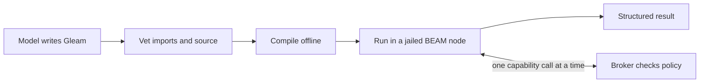

# Code mode at a glance

In code mode, the model writes a short Gleam program instead of issuing a
sequence of tool calls. Loom vets the program, compiles it offline, runs it
in a jailed BEAM node, and returns one structured result. Every effect the
program has (a file read, a command, a child agent) goes through the same
broker that checks the model's direct tool calls.



This page is the overview: what code mode is for, what a program can do,
and why running model-written code is safe. The
[architecture document](architecture/code-mode.md) has the mechanics.

## Why a program instead of tool calls

A tool call is a round trip. The model emits one call, the harness runs it,
and the result returns as context for the next turn. A program changes four
things:

| | Tool calls | A code-mode program |
|---|---|---|
| Ten dependent steps | Ten model turns | One execution |
| Intermediate data | Every payload lands in the context | Stays inside the program; only the result returns |
| Concurrency | Whatever the provider batches in one turn | Bounded parallel maps, races with cancellation, actors |
| A malformed call | Found at runtime, costs a turn | Found by the type checker before anything runs |

The program is also an artifact. The model can save it to a file and run it
again with `program_path`, and the same source can grow into an installed
extension later (see [the promotion ladder](#where-code-mode-is-going)).

## How this differs from other code modes

Cloudflare named the pattern in
[Code Mode](https://blog.cloudflare.com/code-mode/), and other harnesses
have since adopted it. Armin Ronacher's "What is Codemode" (October 2026)
describes Pi's version: the model writes JavaScript that runs in QuickJS
inside a WASM runtime on the harness host, with no network, no filesystem
and no timers, and whose only way to act is to call more tools. That is the
common shape: a dynamic language in an in-process interpreter, with the
tool surface handed to it as functions.

Loom keeps the idea of composing tool calls in code and changes the
language and the boundary:

| | Typical code mode (JavaScript) | Loom |
|---|---|---|
| Language | Dynamic; errors surface while the program runs | Statically typed Gleam; a wrong argument or an unhandled result shape fails at compile time |
| What a program may do | Whatever the injected `tools` object exposes, decided at runtime | The transitive closure of its imports, checked from the source before it runs |
| Where it runs | An interpreter sandbox inside the harness process | A separate, kernel-jailed BEAM node; model-written code never runs in the harness VM |
| MCP servers | Discovered by a tool search inside the program; payloads are often JSON text, and some servers nest their own code mode inside it | One generated, typed Gleam module per configured server; the import list names which servers a program can reach |
| Concurrency | `Promise.all`, with a harness-wide queue | Structured tasks, races whose losers' effects are cancelled, typed actors, and one pooled budget per execution |
| State between calls | Values stored into the transcript | Notes on the session blackboard, readable by every agent, plus `cap/workflow` steps that a later launch recovers |
| Lifetime | One call | One call, or a launched execution that keeps actors alive across turns |

The static language is the larger of the two changes. Because Gleam has no
`eval`, reflection or dynamic module lookup, a program's imports bound
everything it can do, so vetting can refuse a program before anything
runs. The types also carry the tool contracts: the model reads
`cap://fs` for a signature instead of probing a few results to learn their
shape, and a mismatch costs a compile rather than a failed run halfway
through its side effects.

The trade-off is fluency. Models have seen far more JavaScript than Gleam,
and every run pays for a compile. Loom offsets this in three ways: the
compiler's diagnostics go back to the model as an ordinary result, a build
that fails only on unused imports, arguments or bindings is rewritten and retried once
automatically, and the tool description carries the admitted modules'
types so the model starts from the real surface.

Armin also names durability as an open problem and suggests ideas from
durable workflow engines. Loom's answer so far is partial: notes and
`cap/workflow` steps are durable session state, so a restarted launch
recovers its children and their results, but the satellite's own process
state is lost and Loom reports the loss rather than replaying effects.

## A first program

This program counts the lines in three files concurrently and returns a
map from path to count:

```gleam
import cap/fs
import cap/report
import cap/task
import gleam/list
import gleam/result
import gleam/string

pub fn main() -> report.Outcome {
  let paths = ["README.md", "docs/loom-design.md", "docs/code-mode.md"]
  case task.parallel_map(paths, max_concurrency: 3, with: line_count) {
    Ok(counts) ->
      list.zip(paths, counts)
      |> list.map(fn(pair) { #(pair.0, report.int(pair.1)) })
      |> report.object
      |> report.value
    Error(failures) -> report.failure(string.inspect(failures))
  }
}

fn line_count(path: String) -> Result(Int, fs.FsError) {
  use text <- result.map(fs.read(path))
  list.length(string.split(text, "\n"))
}
```

Three things to notice:

- **The imports are the permissions.** This program imported `cap/fs`, so
  it can read files. It did not import `cap/proc` or `cap/net`, so it cannot
  run a command or open a connection, whatever its logic computes.
- **`main` returns a `report.Outcome`**, not text on stdout. The model
  receives a structured value.
- **`parallel_map` keeps input order** and reports every failure, not just
  the first. `parallel_map_fail_fast` stops at the first error instead.

The model submits it through the `code_mode` tool:

```json
{"program": "import cap/fs\n...", "seam": "workspace"}
```

### Saving a program and running it again

A program is an ordinary `.gleam` file, so it can live in the repository
next to the code it works on. Instead of inline `program`, pass
`program_path`:

```json
{"program_path": "scripts/agent/line_counts.gleam", "seam": "workspace"}
```

The path can be workspace-relative or absolute. Loom reads it with the same
`fs_read` authority and approval rules as any other file read, then vets,
compiles and runs it exactly as if the source had been inline. A few rules
follow from that:

- **Each run reads the file again**, so an edit takes effect on the next
  call. A retry inside one call, after an approval, keeps the text it
  already loaded.
- **Saving a program saves source only.** It carries no grants, no compiled
  binary and no captured LSP facts; each run is vetted, compiled and
  authorized fresh, and reads its inputs again.
- **Launch mode accepts it too.** A saved program can be started as a
  background execution with `"mode": "launch"`.

A program that proved useful once can therefore be committed and rerun by
any agent in any later session. The programs in
[`docs/examples/`](examples/) are saved programs of this kind, and tests
run them verbatim.
[Protocol 063](../protocol-change/063-saved-code-mode-programs.md) has the
input contract.

## What a program can import

A program may import the capability modules below and a fixed, pure subset
of the standard library: `gleam/list`, `string`, `string_tree`, `int`,
`float`, `bool`, `result`, `option`, `dict`, `set`, `order`, `pair`,
`function`, `json`, `dynamic` and `dynamic/decode`. Nothing else compiles.

| Module | What it gives a program |
|---|---|
| `cap/fs` | Read, write, list and edit files inside the workspace. |
| `cap/search` | Glob, grep, stat and line-range reads, with no write arm. A reviewer that imports only this module cannot change a file. |
| `cap/proc` | Run a command in its own kernel sandbox. A non-zero exit is data, not an error. |
| `cap/git` | Typed git status, diff and log, built on `cap/proc`. |
| `cap/job` | Start, poll, feed and kill background jobs that outlive the program. |
| `cap/net` | Outbound HTTP through a harness-owned proxy. Denied unless an operator approved the host. |
| `cap/task` | Structured concurrency: `parallel_map`, `race`, `both`, `all`. |
| `cap/actor` | Typed, program-scoped actors with bounded mailboxes. |
| `cap/report` | The result value, JSON conversion, and durable artifacts through `emit`. |
| `cap/kv` | A scratch key/value store for the session. It can be evicted at any time. |
| `cap/notes` | Durable notes on the session blackboard (below). |
| `cap/strand` | Start, wait on and message child agents (below). |
| `cap/workflow` | Named child steps that a later launch can recover. |
| `cap/peer` | Read the inbox and send messages over granted peer links. |
| `cap/execution` | Typed input endpoints and progress for a background launch. |
| `cap/schedule` | Heartbeats that inject text into this strand's context on a timer. |
| `cap/lsp` | Language-server queries: definition, references, hover, call hierarchy, rename. Admitted where a server is configured. |
| `cap/lsp_sql` | Capture LSP facts once, then join and aggregate them with read-only SQL. |
| `cap/mcp/<server>` | Typed functions for each tool of a configured MCP server, generated at boot. |

The model has no autocomplete, so the `code_mode` tool description lists
each admitted module and its public types. For full signatures, the model
calls `fs_read` on `cap://<module>`; a bare `cap://` lists the modules.

A strand's tool list also bounds its programs. `proc.run` needs the `bash`
tool, `fs.write` needs `fs_write`, `strand.spawn` needs `agent_spawn`, and
so on. A reviewer whose parent withheld `bash` cannot run commands from a
program either.

## State that outlives a program: notes and the blackboard

A satellite is destroyed when its program returns, so anything worth
keeping has to be written somewhere else. Loom offers three places, each
for a different lifetime:

| Store | Lifetime | Use it for |
|---|---|---|
| `cap/kv` | Until evicted, at most the session | A cache. A program must tolerate a missing key. |
| `cap/notes` | The session, across satellite exits, restarts and compaction | Analysis results and small structured findings that later programs and other agents read. |
| Workspace files and `report.emit` artifacts | Beyond the session | Large or binary output. Store a small reference to it in a note. |

**Notes are cells on the session blackboard.** The blackboard is the one
register namespace every strand in a session can read. A program writes
with `notes.put("analysis", value)`, which lands under its own
`agent/<strand>/` prefix. Any agent in the session reads it back with
`notes.get("main/analysis")` or lists a prefix with `notes.list`. The
model's own `agent_note` tool and `strand.note` write the same cells, so a
note left by a program is visible to every agent and every later program.
A program can also read one as JSON through
`fs.read("note://main/analysis")`.

Four rules shape how notes behave:

- **Writes notify nobody.** A reader sees a note at its next read. To make
  another agent act on one, pair the write with `strand.send`.
- **Concurrent writes to one cell are last-write-wins.** Each agent writes
  only its own prefix, so this is rare in practice.
- **Notes are session memory, not repository memory.** They do not carry
  into a new session.
- **The harness reserves some prefixes.** Approval, lineage and result
  cells are hidden from the blackboard API, so a program cannot forge an
  approval or overwrite another operation's result.

[`notes_analysis.gleam`](examples/notes_analysis.gleam) saves an analysis
without returning the payload to the model, and
[`notes_reuse.gleam`](examples/notes_reuse.gleam) reads it from a fresh
program.

## Orchestrating other agents

`cap/strand` lets a program start child agents and collect their results,
using the same Agency rules as the model's `agent_*` tools. A child is
described by an assignment, can be asked for a structured result, and is
joined with a deadline:

```gleam
let assignments =
  list.map(["core", "client"], fn(name) {
    strand.assignment(purpose: "review " <> name, brief: "Inspect packages/" <> name)
    |> strand.expecting([strand.required("count", strand.IntegerField)])
  })

strand.map(assignments, max_concurrency: 2, within_ms: 20_000)
```

`strand.map` starts one batch, joins it, and only then admits the next.
[`strand_map.gleam`](examples/strand_map.gleam) is the complete program, and
[`fan_out_review.gleam`](examples/fan_out_review.gleam) is a larger review
fan-out.

A loop pays nothing per spawn, unlike a model turn, so the host replaces
that implicit throttle with explicit ones:

- A per-execution ceiling on spawn admissions.
- Agency's existing depth, fan-out and session-wide strand limits.
- Addressing limited to the parent and descendants. Peer messages need an
  explicit, directional grant.

## Two ways to run: one-shot and launch

| | One-shot (default) | Launch (`"mode": "launch"`) |
|---|---|---|
| Lifetime | One tool call | Spans model turns, until it returns, is cancelled or hits its deadline |
| Returns | The program's result | An execution handle |
| Later interaction | None | `send`, `check`, `join`, `cancel` on the handle |
| Typical use | Batch reads, checks, one fan-out | A reviewer that waits for more commits, a watcher, a long orchestration |

A launched program registers named, typed input endpoints with
`cap/execution`, publishes progress, and keeps its `cap/actor` actors alive
between turns. When it finishes, the harness notifies the launching strand
and wakes it if idle. Data sent later cannot widen the program's grants or
extend its deadline.

Background orchestration can use `cap/workflow.step` to give each child a
stable name. After a restart, the same step name returns the same child and
its result instead of spawning a duplicate. The satellite and its actor
state do not survive a restart; Loom reports that loss and replays no
effects.

The [async collaboration guide](async-collaboration.md) has the full launch
protocol and its limits: eight live executions per session, 32 launches per
initiating operation, and a 128-entry input journal.

## Concurrency and budgets

The satellite is a full BEAM, so programs get real parallelism. They get it
through `cap/task` and `cap/actor` only. Raw `spawn` is absent, because it
would allow unbounded processes and messages to arbitrary registered names.

- **`race` cancels the losers for real.** Killing a losing task cancels its
  in-flight capability call; the broker then kills the sandboxed process
  group behind it.
- **Actors have bounded mailboxes.** `send` waits for room instead of
  growing the queue.
- **The budget is pooled per execution.** A program that fans out cannot
  multiply its footprint. One execution shares a cap on outstanding effects
  (six by default) and one wall-clock deadline (five minutes by default,
  fifteen at most). Each `proc.run` still gets its own sandbox and cgroup.

## The safety model

Loom's design starts from Rule Zero: model-influenced code never runs in
the harness VM. The four stages below form two independent layers: the
lint in the harness, and the kernel jail around the build and the run. An
escape needs a bypass of both.

1. **Vetting (in the harness).** A lint over the parsed source rejects any
   `@external` or other attribute, which is Gleam's only bridge to
   arbitrary Erlang. It also rejects any import outside the allowlist,
   including look-alike Unicode module names. A token-level scan backs up
   the parser.
2. **A hermetic build (in the jail).** `gleam build --warnings-as-errors`
   runs offline against a pinned, vendored prelude. The program is written
   to a fixed module path, so it cannot shadow `cap/fs` with its own.
3. **The satellite (in the jail).** The node starts with Erlang
   distribution disabled, so it cannot reach or join another node. It has
   no network, enforced by seccomp and an empty network namespace. A
   cgroup, a CPU limit and a wall deadline bound it, and it dies as a unit
   when the program returns.
4. **The broker (in the harness).** The node's only link out is one
   Unix socket that carries capability calls. Each call is checked against
   the execution's token, the session policy and the strand's tools. The
   broker owns network denial, so a program has no setting it could flip
   to widen its own access.

The rejection at each stage returns to the model as a value it can fix: a
vetting refusal, compiler diagnostics, or a runtime failure.

## Why Gleam and the BEAM

**Gleam makes the capability set readable from the source.** It has no
`eval`, no reflection, no macros and no dynamic module lookup. Every effect
enters through an import that eventually reaches an `@external`. So the
transitive closure of a program's imports is the most it can ever do, and
vetting can check it without running anything. Python, JavaScript and
Erlang itself cannot offer that bound, because each can reach the whole
runtime through a string at runtime.

**The types catch bad calls early.** A capability called with the wrong
arguments fails at compile time, before any sandbox starts.

**The BEAM gives programs cheap processes.** Fan-out, races and stateful
actors use the same runtime and the same language as the harness, which
also lets a program's actor later become a supervised process in an
extension without a rewrite.

## In development: distributed execution

Work on [issue #697](https://github.com/Roasbeef/loom/issues/697) separates
the session owner from the machine that holds the checkout. It is not on
`main` yet. The session's conversation, notes and approvals stay with an
owning orchestrator. Files, builds, language servers and commands run on a
registered remote executor beside the checkout. Trusted orchestrators and
executors join one cluster over TLS-protected BEAM distribution.

For code mode, the owner still vets the program. The executor compiles it
beside the checkout and runs the satellite there, in the same native jail
with distribution disabled. The satellite never joins the cluster. Its
local capability socket reaches an executor-owned forwarder, which sends
bounded frames back to the owner's broker:

- Filesystem and LSP calls run against the executor's workspace.
- Notes, strand operations and reports keep the owner's session authority.
- Provider secrets and cluster credentials never enter the satellite's
  environment, mounts or handles.

From the program's side nothing changes: the same imports, served from
wherever the checkout lives.

## Where code mode is going

A code-mode program is the lowest rung of a trust ladder:

| Level | What it is | Status |
|---|---|---|
| L0 | A code-mode program: jailed, ephemeral | Built |
| L1 | A session skill: a saved program, named and reused at L0 privileges | Design; `program_path` already reruns a saved file |
| L2 | An extension candidate, tested in the sandbox | Design |
| L3 | An installed extension, after explicit human approval | Built: `loomd ext install`, with a satellite kept open across calls |
| L4 | A change to Loom itself, through ordinary review | Always available |

Nothing promotes itself: each step up needs a recorded human decision.
[`loom-design.md`](loom-design.md) §7 has the ladder in full.

## Where to go next

| To learn about | Read |
|---|---|
| Vetting, the hermetic build, the satellite and the broker routing | [Architecture: code mode](architecture/code-mode.md) |
| Launch mode, endpoints, workflows and peer links | [Async collaboration guide](async-collaboration.md) |
| Typed results from the peer and other capability modules | [Typed capability results](capability-types.md) |
| SQL over language-server facts | [LSP SQL guide](lsp-sql.md) |
| MCP servers as generated modules | [Architecture: MCP](architecture/mcp.md) |
| Worked programs that tests run verbatim | [`docs/examples/`](examples/) |
| The harness side of the pipeline, for contributors | [`packages/codemode`](../packages/codemode/README.md) |
