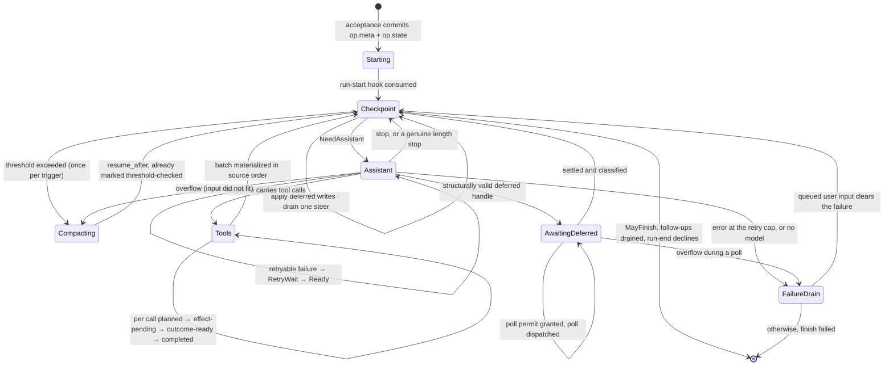
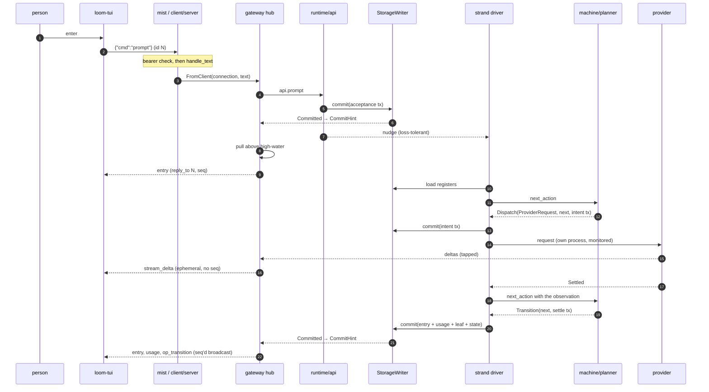

# A tour of the code

Someone types `fix the flaky test in auth_test.gleam` into `loom-tui` and
presses enter. Between that key press and an answer appearing on their
screen, the request crosses a Go binary, a websocket, a Gleam actor, a
pure state machine, a SQLite file, an HTTP stream, a second Go binary
inside a kernel jail, and all the way back. Every major piece of Loom
sits somewhere on that path.

Following it once, in order, with a file and line for every step, is the
cheapest way to learn where everything lives. The plane documents beside
this one — `docs/architecture/durability.md`, `orchestration.md`,
`effects.md` and their siblings — go deep on what each layer *is*; this
one is about how a request moves through them, and where a step deserves
more depth the cross-reference is the depth.

Paths follow the convention those docs use: a Gleam path is relative to
its package's source root, so `runtime/api.gleam:251` is
`packages/runtime/src/runtime/api.gleam` line 251; a Go path is relative
to its module, so `internal/ui/model.go:367` is under `packages/tui` and
`internal/jail/stage2.go:43` under `packages/sandbox`.

## The shape of the thing

Sixteen packages, fourteen Gleam and two Go, split across three planes.

**The durability plane** stores rows and answers queries and decides
nothing: `core` (ids, the four write-once entry shapes, transactions, the
two total codecs), `storage` (two interchangeable backends behind one
record of functions), `session` (typed register access and the context
projection), `events` (read models and a `pg` bus).

**The orchestration plane** decides what happens next: `machine`, a pure
package whose whole surface is one total function, and `runtime`, the OTP
tree that carries out what that function returns.

**The effect plane** touches the world: `provider` (the model SDK),
`broker` (the one door), `sandbox` (the Go jailer), `tools` (the tool
set), plus `codemode` and `cap` for programs the model writes.

`client` hosts all of it — the protocol, the hub, the websocket server,
the production wiring, and the `loom-server` entry point — and `tui` is
the Go terminal client on the far side of the wire. `prompt` renders the
system prompt from a data pack, `conformance` holds the suites that
define correct, and `cap` is compiled *into* the jail rather than linked
into the harness.

Purity is layered on purpose. `core`, `machine`, and `prompt` perform no
I/O and declare no FFI; that is what makes the operation state space
property-testable with no processes involved and the system prompt
byte-stable for a whole session.

## Before the key press

By the time anyone can type, `client/serve.boot` has already assembled
the whole stack in one function, and its order is the dependency graph
made executable.

One clock function is built first and threaded into the session, the
broker, the tools, and the provider. That is not tidiness: budget
deadlines are computed on the tool-side clock and checked against the
broker-side clock, and the M2 integration found that misaligned eras made
the broker refuse every call as already expired. One clock, one era.

Then the session file opens under a fenced writer lease
(`session.open_sqlite`, 60-second TTL), a pool of two `loom-exec` helpers
starts, and the broker starts over that pool. Then the two hub
composition seams are created *before* the runtime, because both need to
be addressable by name before the process they talk to exists: a commit
forwarder actor whose subject goes into `api.open`'s `subscribers`, and a
provider tap that wraps the effect record's provider field. The Agency —
the messaging plane behind the `agent_*` tools — has the same knot and
the same solution: `api.open` takes the effects record and returns the
runtime, and the runtime *contains* the effects, so a closure over the
live runtime would be a value cycle rather than an ordering problem. The
seam closes over a process name and the holder starts under that name
after the open.

The system prompt is assembled once and pinned into a reserved `prompt/`
cell, read straight off the store before the open (nothing owns it yet)
and written back through the writer after it. Every later boot sends the
pinned bytes rather than deriving them again, because the prompt sits
inside a one-hour cache breakpoint and a single changed byte costs a full
cache write on every strand for the rest of the session.

Last come `api.open`, the Agency holder, the gateway hub, and the
websocket listener. The token file is written `0600` before the listener
binds.

## 1. The key press

`loom-tui` is a bubbletea program, and bubbletea hands every key press to
`Update` as a `tea.KeyMsg`. `Update` dispatches to `onKey`
(`internal/ui/model.go:244`), which passes anything that is not a modal
key or a navigation key to the text input — until enter, which routes to
`onEnter` (`internal/ui/model.go:367`).

`onEnter` makes one decision, and it makes it from state the client
already holds:

```go
	if op := m.liveOp(strand); op != "" {
		m.statusNote = "steering live run on " + strand
		return m.refresh(), m.send(proto.CmdSteer, proto.SteerBody{Strand: strand, Text: text})
	}
	return m.refresh(), m.send(proto.CmdPrompt, proto.PromptBody{Strand: strand, Text: text})
```

Typed text on an idle strand is a `prompt`; typed text while the strand
has a live operation is a `steer`. A `:` prefix opens the palette
instead (`:fork`, `:compact`, `:abort`, `:strand`, `:models`, `:quit`).

`Update` never touches the socket. `send` returns a `tea.Cmd` closure and
bubbletea runs it (`internal/ui/model.go:152`), which is what keeps the
entire interaction surface table-testable without a terminal. The closure
calls `Client.Send` (`internal/client/client.go:205`), which stamps a
monotonic command id, marshals the envelope, and drops it on a bounded
outbound channel. A full queue is an error rather than a stall.

## 2. The frame, and the fence at the door

The frame on the wire is one JSON envelope, text frames only, at
`/v1/ws`:

```
c→s  {"v":1, "id":<uint>, "cmd":<name>, "body":{...}}
s→c  {"v":1, "reply_to":<uint>?, "event":<name>, "seq":<uint>?, "body":{...}}
```

Both implementations build to
`packages/tui/internal/proto/protocol.md` and are pinned to each other by
thirty-five golden fixtures under `internal/proto/testdata/`, which the
Gleam side decodes and re-encodes byte for byte. Drift fails a test
rather than a session. `docs/architecture/client.md` covers the envelope,
the reply table, and the three places the fixtures deliberately differ
from `core/codec`.

The connection was authenticated long before this frame: `route`
(`client/server.gleam:238`) runs the bearer check ahead of the upgrade,
so a `401` is emitted with no websocket state in existence.
`authorized` (`client/server.gleam:257`) branches only on the public
`Bearer ` prefix and then hands both operands to `crypto:hash_equals`
through a shim that hashes each side first — the presented string is
attacker-controlled, so a plain length-mismatch fast path would leak the
token's length.

Once upgraded, the transport is one module thick. The socket handler
registers a sink with the hub and forwards text:

```gleam
        mist.Text(frame) -> {
          gateway.handle_text(gateway, state.connection, frame)
          mist.continue(state)
        }
```

Nothing else in the client package knows what a socket is. A connection
*is* a `fn(String) -> Nil`, handed to `gateway.attach`
(`client/server.gleam:296`), which returns an integer id.

## 3. The hub

The hub is one actor per served session (`client/gateway.gleam:441`).
Four kinds of message reach it: client frames as `FromClient`, the
runtime writer's post-commit publication as `CommitHint`, a bus
publication as `BusHint`, and streamed provider deltas as
`ProviderDelta`.

`handle_text` becomes `dispatch` (`client/gateway.gleam:1029`), which
decodes strictly on the envelope and tolerantly on names — an
unrecognized `cmd` survives as `UnknownCommand` so the hub can answer
`unsupported` in band — then `run_command`
(`client/gateway.gleam:1078`) checks that this connection has subscribed
and matches the command. Our `prompt` lands at
`client/gateway.gleam:1497`:

```gleam
  use <- known_strand(state, connection, id, strand)
  let target = api.on_strand(state.runtime, strand)
  case api.prompt(target, [user_message(state, text)]) {
```

That is the whole of the hub's conversational logic. The commands map
straight onto the operation model the orchestration plane already has;
the hub adds nothing of its own and commits nothing of its own. Its reads
go at the store handle directly, but every write it causes goes through
the session's one writer.

## 4. The first commit

`api.prompt` is two lines (`runtime/api.gleam:251`): accept quietly, then
ring the doorbell. The work is in `accept_quietly`
(`runtime/api.gleam:270`), and its shape is the shape of every admission
in the system.

It reads the strand state, the leaf, and the pending payloads — capturing
the *seq* of each read, because the seq is what the commit's expectation
will be built from — mints a fresh id generator, and hands all of it to
the pure planner:

```gleam
    case acceptance.accept_prompt(AcceptRun(prompts:), ctx) {
      Error(reason) -> Ok(Done(Error(AcceptRejected(reason:))))
      Ok(acceptance.AcceptancePlan(operation:, state: _, tx: plan_tx)) ->
        case writer.commit(w, plan_tx) {
          Ok(_) -> Ok(Done(Ok(operation.id)))
          Error(tx.StaleExpectation(..)) -> Ok(Retry)
```

`accept_prompt` (`machine/acceptance.gleam:126`) refuses immediately if
`strand_state.current_operation` is already set, and otherwise builds one
transaction: any captured next-run items placed as entries first, the
prompt entries after them, the leaf moved to the newest, `op.meta` and
`op.state` written, `strand.state.current_operation` set. It expects both
the strand-state seq *and* the `strand.leaf` seq the caller read, so a
concurrent acceptance loses its expectation and a concurrent idle
tree-write that moved the leaf refuses the acceptance rather than
mis-parenting its entries.

The commit itself is a call into one actor. `writer.commit` is
`process.call_forever` into the StorageWriter (`runtime/writer.gleam:250`),
whose mailbox *is* the serialization order for the session — "transactions
on one session are serialized" is a property of the process topology, not
a convention someone must remember. On success the writer publishes a
`Committed` event to its subscribers, then calls an injected observer,
then replies:

```gleam
          // The crash-scheduler seam: may not return (see module doc).
          state.after_commit(ordinal)
          process.send(reply, Ok(result))
```

Production passes a no-op. The interleave harness passes a bomb, and
because the seam runs after the commit is durable and published but
*before* the committer's reply, killing the writer there produces exactly
the state "commit N is durable, and the committer never learned it" — a
crash between two adjacent commits, scriptable at every boundary
(`runtime/writer.gleam:159–180`).

`docs/architecture/durability.md` covers what happens underneath: the
three stores, all-or-none application, seqs assigned at commit,
expectations evaluated before any write applies, and the fenced lease
that makes "one process owns one session" true across OS processes as
well as inside the node.

## 5. The doorbell

The payload is durable. Only now does anything ephemeral happen:

```gleam
pub fn nudge(runtime: Runtime) -> Nil {
  case live_strand_subject(runtime) {
    Ok(subject) -> strand_runtime.nudge(subject)
    // No driver registered (mid-restart): loss is harmless — the
    // checkpoint poll finds the durable work.
    Error(Nil) -> Nil
  }
}
```

That is the doorbell doctrine in six lines (`runtime/api.gleam:405`).
Every payload travels in a commit; the process message that follows
carries nothing and asks only for promptness. Losing it costs one poll
interval — 200 ms by default — because the driver's periodic `PollTick`
drives a planning pass that re-reads the same durable state and finds the
same work. The api exposes `_quietly` variants that commit without
ringing at all, and the doorbell-loss tests use them to prove a run
completes on the poll alone.

`docs/architecture/messaging.md` states the rule in general: if the
recipient would act differently for having received a message, it goes
through a commit; if the message only affects pacing or display, a plain
process message is fine.

## 6. The machine wakes

The strand driver is an actor whose entire loop is the machine's contract
read literally (`runtime/strand_runtime.gleam:591`):

```
load registers  →  build PlannerInputs  →  next_action  →  act  →  repeat
```

`load` re-reads `strand.state`, `op.meta`, `op.state`, `strand.config`
and `strand.leaf` on *every* pass, then fetches exactly what the loaded
state names — the assistant entry behind a tool batch, the deferred
handle behind a suspended poll, the pending payloads for every queued id
(`runtime/strand_runtime.gleam:1175`). No process-local memory of durable
state exists to go stale, which is why a pass after a restart runs the
same code as a pass mid-run.

`plan` (`runtime/strand_runtime.gleam:610`) then calls the one frozen
entry point:

```gleam
pub fn next_action(
  op: Operation,
  state: OperationState,
  in: PlannerInputs,
) -> Action {
```

`machine/planner.gleam:431`. It reads a durable state and a bundle of
inputs and returns one of six actions, defined at
`machine/planner.gleam:403`:

| Action | What the driver does |
|---|---|
| `Transition(next, tx)` | commit `tx`, then plan again |
| `Dispatch(intent, next, tx)` | commit the intent transaction, **then** start the effect |
| `AwaitEffect(key)` | produce the named observation, then plan again |
| `Wait(until)` | set a retry timer, or park for a poll permit |
| `Finish(result, tx)` | commit the terminal transaction; the operation ceases to exist |
| `Fault(report)` | the inputs or durable state are corrupt; stop abnormally |

The function performs no I/O, keeps nothing between calls, and cannot
crash. That last property is why there are six actions and not five:
a total function needs a value where a partial one would panic, and
`protocol-change/002` records the addition.

`Fault` really does mean fault. `plan` maps it to `Halt`, which becomes
`actor.stop_abnormal`, which the supervisor turns into a restart — and
under a genuinely corrupt register the strand faults on every attempt
until the tolerance is spent and the tree dies, visibly. Nothing is
quietly repaired behind the operator's back.

### The durable program counter

`op.state` is the program counter, and it is **total**: no transition may
depend on the previous state having been observed, so recovery reads this
one register and knows exactly where it was (`machine/operation.gleam:170`).
There is no finished variant — an ended operation has no state at all,
because the terminal transaction deletes the register.

Three constructors, matching the three things an operation can be
accepted to do: `RunState`, `CompactionState`, `NavigationState`. A state
whose kind disagrees with its operation's intent is corruption, checked
in the first `case` of `next_action`.

Inside a run, the phase is where the action is:



Each arrow that does anything is at least one commit, and a crash between
any two of them resumes at the next.

Two flags on the checkpoint keep the decision idempotent under crashes,
and both are worth knowing by name. `threshold_checked` records the
trigger whose compaction check already ran, so a boundary is never
checked twice; `skip_inbox_once` is set by a drain on the checkpoint it
produces, so a crash mid-drain cannot turn a one-at-a-time drain into an
all-item drain (`machine/planner.gleam:595`).

Large payloads never live inline in the state. Tool arguments go to
`op.tool_args/{op}:{step}:{index}`, a summary's frozen input to
`op.preparation/{op}:{task}`, a message durable but not yet in the tree
to `pending.entry/{id}` — all written once, all deleted by the terminal
transaction. Queue lists carry ids, never payloads, which is what makes
"at every commit boundary a queued id has a register *or* an entry *or*
neither, never both" a checkable invariant.

`docs/architecture/orchestration.md` has the full state space, the
transition table it maps to, and the normative classification order.

## 7. The effect sandwich

Our checkpoint decides `NeedAssistant`, generation snapshots its
configuration, and the pre-request hook admits. Now the machine has to do
the one thing it cannot do purely: reach outside.

It does not. It returns `Dispatch`, and the driver splits the moment in
two:

```
  commit  intent   op.state = effect_pending, holding reserved ids R
                   (the response entry) and U (the usage row)
          ──────────────────────────────────────────────────────────────
          do it    the provider request runs — nothing durable happens
          ──────────────────────────────────────────────────────────────
  commit  settle   entry R + usage row U + leaf move + next op.state,
                   in one atomic transaction
```

`machine/planner.gleam:1020` mints `R` and `U`, folds them into
`GenerationEffectPending`, and returns the intent transaction beside the
next state. `runtime/strand_runtime.gleam:658` commits it and only then
runs the continuation that starts the effect:

```gleam
        planner.Dispatch(intent:, next: _, tx: plan_tx) ->
          commit_then(state, plan_tx, observation, fuel, fn(state) {
            case start_effect(state, loaded, intent) {
```

The reserved ids are the trick. Because `R` and `U` were minted *before*
the effect started and persisted in the intent, the settlement writes
under ids already promised — and so does a synthetic settlement written
by recovery days later. The ledger and the tree stay in step no matter
which side of the window the crash landed on.

A crash before the intent commit means the effect never started. A crash
after the settle commit means it is fully recorded. Inside the window the
state says `effect_pending` and the truth is unknown, which is exactly
what the driver reports when it reloads that state and finds no live
effect to match:

```gleam
        False ->
          // A restored effect_pending with no live continuation: the
          // request's outcome is unknown (spec §3.1). Loom persists no
          // frame lists (spec-gaps WP-D item 2), so the reconstructed
          // partial is always empty.
          KeyObservation(planner.ObservedAssistantOrphaned(partial: []))
```

`runtime/strand_runtime.gleam:749`. The machine, not the driver,
decides what an orphan means: an assistant request or deferred poll is
wholly uncertain and settles synthetically at zero usage, following
ordinary classification afterwards; a tool call consults the replay
policy declared at intent and persisted there. `ReplaySafe` re-executes
with the persisted arguments under the same reserved result id, and only
if the tool's *current* registration still says safe. `ReplayNever` never
re-executes — the machine synthesizes an interrupted result carrying an
explicit warning that the call's outcome is unknown.

That is the whole of crash-anywhere recovery, and everything else in the
orchestration plane is arranged so this shape holds. Hooks sit outside
the sandwich precisely because they carry no effect intent and are safe
to rerun.

## 8. The request

`start_effect` (`runtime/strand_runtime.gleam:894`) projects the context
and hands a `RequestSpec` to the injected provider surface. The
projection is a branch scan from the leaf that stops at the first
compaction entry, run through `session.project_scan`
(`session/session.gleam:703`), which applies pi's five rules in order:
reverse to oldest-first, drop error/aborted/deferred assistant responses
while keeping genuine output-limit `length` stops, run custom entries
through their registered projectors, heal orphaned tool calls with
synthetic unknown-outcome results, then apply the transform hook. Healing
at request construction rather than at the fork is what keeps successive
projections append-only — on a settled history it is a no-op.

The driver takes the *default* projection, so as built the third and
fifth rules do nothing on this path: no custom projector is registered
and the transform is the identity. Both seams exist and are exercised by
`project` and `project_context`; nothing in production reaches for them
yet.

Everything past this point is behind `runtime/effects.Effects`, a record
of functions injected at `api.open`: `clock`, `entropy`, `timers`,
`provider`, `tools`, `hooks`. The runtime declares no FFI at all, which
is what lets the whole plane run under a logical clock in simulation.
`client/wiring.build_effects` (`client/wiring.gleam:173`) fills that
record with the real gateway, broker, and registry; the module's own
documentation is the authoritative list of mapping decisions, and it is
worth reading before changing anything about how a request is shaped.

Two of those decisions are load-bearing. Every dispatch uses
`ForResolved`, never `ForRole` — recovery must re-dispatch exactly the
identity the intent committed, and a fallback walk could silently reach a
different model (`client/wiring.gleam:272`). And `tool_specs` sorts and
deduplicates the active tool names (`client/wiring.gleam:329`), because
the tool array renders ahead of the system prompt and prompt caching
matches on an exact byte prefix; two requests with the same active set in
a different order would miss the cache entirely and pay the write again
on every turn. Neither step touches authorization — `clear` admits a call
by `list.contains` on the same list, and set membership is blind to order.

The driver spawns the request on its own process
(`runtime/strand_runtime.gleam:1123`) and waits for a message.
`gateway.request` (`provider/gateway.gleam:230`) spawns a pump, walks the
role's fallback chain only on *retryably*-classified failures, and calls
`stream.run` per attempt (`provider/stream.gleam:511`). Everything above
the raw HTTP chunk stream is pure: the server-sent-events parser is bytes
in, events out, with the carry state threaded, so the same bytes in any
chunking yield the same events and the parser is property-tested without
a single process. `docs/architecture/effects.md`, section "Providers",
covers the adapters, total stop-reason mapping, adapter-computed
overflow, and where secrets are allowed to exist.

The consumption contract is narrow enough to build on: zero or more
`Delta` events, then exactly one `Settled` or `Failed`, and nothing after
it. Deltas are ephemeral display data and prove nothing.

Which is exactly what the hub's tap exploits. `tap_provider`
(`client/gateway.gleam:374`) wraps the injected surface so each request
runs through a relay process that forwards every event to the effect
process unchanged and in order, teeing deltas to the hub on the way past.
The runtime is untouched by streaming; the tap lives entirely in the
composition seam, and if the relay dies the effect process times out
exactly as it would for a dead provider.

## 9. Settlement

`stream.await_terminal` returns, the effect process sends `ProviderDone`
to the driver, and the driver turns it into an observation and plans
again. `settle_assistant` (`machine/planner.gleam:1114`) classifies the
response — first match wins, and the order is normative because
reordering it changes behavior rather than style: cancelled control,
overflow, valid deferred handle, retryable error, tool use, stop. Ask
about cancellation first and a cancelled run never diverts into a
compaction on its way out; ask about tool use before a genuine length
stop and a truncated response executes calls cut in half.

Then one transaction, in pi's normative order
(`machine/planner.gleam:1384`):

```gleam
  [
    build.message_entry(response_entry, leaf, message, False),
    build.set_leaf(op.strand, Some(response_entry)),
    build.usage_row(usage_id, Some(response_entry), message_usage(message)),
    build.set_op_state(op.id, next),
  ]
```

Response entry, leaf move, usage row under the reserved id, next state.
Atomic. The window is closed.

## 10. Back to the screen

The writer published `Committed` before it replied. A tiny forwarder
actor — created before the runtime so the writer re-registers it on every
tree restart — turns that into a `CommitHint` cast at the hub
(`client/gateway.gleam:349`).

The hint carries nothing. It triggers `pull` (`client/gateway.gleam:484`),
which reads everything in storage above the hub's high-water seq and
merges four sources: new entries reachable from each strand's leaf plus a
completeness pass for entries no leaf covers, new usage rows attributed
through the entry cache, operation transitions and terminal results read
from the strand registers, and escalation records under the reserved
prefix. The result is filtered above the high-water, sorted by seq,
deduped, and broadcast.

The single decision the rest of the hub falls out of is that **the
envelope `seq` is the storage seq of the write that produced the event**.
Storage assigns strictly increasing seqs to every write in a session, so
the event stream needs no side index, survives gateway restarts by
construction, and can be rebuilt from scans at any time. The high-water
advances only to the greatest seq actually *emitted*; advancing to the
store's tail would race a commit landing between two of the reads and
drop its events silently.

Two consequences follow from reading registers rather than a log, and
both are documented protocol behavior. Immutable rows replay exactly:
`entry` and `usage` events are scanned by seq range, so a resume
reproduces them one for one. Register-backed events replay as current
state at current seq: registers keep no history, so a superseded
`op_transition` is not reconstructible. A client that missed an
intermediate phase still converges, because phases are display labels and
the snapshot carries live state.

The client that issued the command gets its `entry` once, as the reply.
`reply_with_matched` (`client/gateway.gleam:1532`) pulls, picks the last
emit the matcher accepts, broadcasts everything to everyone *except* that
one copy to that one connection, and sends the matched emit back with
both `reply_to` and its seq.

On the Go side, `handleEvent` (`internal/client/client.go:438`) applies
the seq discipline before delivering anything:

```go
		switch {
		case ev.Seq <= last:
			return // duplicate from catch-up overlap
		case ev.Seq > last+1 && c.haveSnapshot.Load():
			c.requestCatchUp(last + 1)
			return
```

A duplicate is dropped, a gap triggers exactly one `catch_up` and the
out-of-order event is *not* applied (the replay redelivers it in order),
a full snapshot resets the position to `next_seq - 1`, and events with no
seq — snapshots, stream deltas, errors — never move the position.
Reconnects resume rather than restart, but only once a full snapshot has
been applied.

The typed message reaches `Update`, which folds it into the transcript,
and the loop closes. `docs/architecture/client.md` covers the hub, the
protocol, attribution, the approval check, and the token story in depth.



## 11. A tool call goes out

Say the response carried tool calls instead. Classification yields a tool
batch, the machine plans one call per tool-call block in source order and
reserves every result id up front, and each call then walks
planned → effect-pending → outcome-ready → completed.

Clearance happens before the intent commit and is a security boundary
with a load-bearing ordering (`runtime/strand_runtime.gleam:1455`). The
driver loads only the approvals attributed to *exactly this call* — an
escalation record carries a `CallScope` of
`{operation, strand, step, source index, call id}` — consumes them by
compare-and-swap *first*, and passes into `tools.clear` only the grants
whose consumption commit won. A lost race drops those grants and the
clearance proceeds under the base policy; a crash after consumption
spends the approval without an execution. Both directions fail safe: one
approval is worth at most one widened execution of exactly the call a
human approved. All of that machinery is real and tested; what is missing
above it is the production path that *raises* an escalation in the first
place — see section 17.

Then `Dispatch` again — intent commit, then the effect — and the tool
runs on its own spawned process. `client/wiring.run_tool` builds a fresh
`Ctx` per call carrying the driver's own durable coordinates —
`{strand, op_id, step_id, source_index}` — and dispatches through the
registry (`client/wiring.gleam:413`). All four come from the driver, so a
model that names another strand in its arguments does not become it.

`tool.dispatch` is total (`tools/tool.gleam:291`): an unknown name yields
an in-band error result rather than a crash, and so does every other
failure a tool can meet. Tool failures are **data**. That is what makes
"tools never crash the strand" a structural claim rather than a
discipline.

For `bash`, `run` (`tools/bash.gleam:87`) builds a `CallSpec` naming the
op and step ids, the session base policy, the tool's own
policy-shaped requirements, the consumed grants, `RefuseNarrowed`, the
argv, the constructed environment, and a pooled budget
(`tools/bash.gleam:122`). Then one call:

```gleam
      case ctx.clear_call(spec, events) {
        Error(refusal) -> tool.refusal_outcome(refusal)
```

`ctx.clear_call` is `tool.broker_runner` over the live broker
(`tools/tool.gleam:652`). Every effect that leaves the harness goes
through this door and no other.

### Through the door

`broker.clear_call` (`broker/broker.gleam:279`) is a call into the broker
actor, and from the moment it succeeds the caller is guaranteed exactly
one settlement event, whatever happens downstream. Five steps, in order
(`broker/broker.gleam:476` and `:516`):

1. **Compose** — the meet of the session base and the tool's
   requirements, root coverage prefix-aware, the network lattice meeting
   at `Off < Proxy < Full`, environment allowlists intersecting as exact
   strings. Only then do approved grants widen anything. Then
   `narrow_unenforceable` downgrades what phase 1 cannot enforce — the
   egress proxy sidecar does not exist, so `NetworkProxy` becomes
   `NetworkOff` and is *reported* as a narrowing. Nothing ever claims a
   proxy allowlist was enforced. Under `RefuseNarrowed` any shortfall
   becomes a structured denial carrying `wanted_grants`, which is exactly
   the policy diff a human would be shown.
2. **Reserve** — one slot against the pooled ledger for this
   `{op_id, step_id}`. Budget is pooled per *execution*, not per call,
   which is what closes the amplification hole: ten thousand polite
   parallel reads share one cap and one aggregate wall deadline.
3. **Mint** — 32 bytes of injected entropy bound to
   `{op_id, step_id, policy, deadline}`, compared in constant time, spent
   once, revoked at settlement.
4. **Checkout** — a helper from the pool.
5. **Dispatch** — an `exec_start` frame over the framing channel, with a
   relay process owning the event subject, enforcing the wall deadline,
   and reporting settlement back.

The wire is one framed msgpack protocol for every data-plane channel:
`u32_be length ++ msgpack(map)`, keys `v`, `id`, `kind`, `body`, capped
at 16 MiB on both sides. Malformed and unknown are different failures — a
frame that does not parse closes the channel after an in-band error so
the effect can settle; a frame that parses but names an unimplemented
kind gets an in-band error and the channel *stays open*, because the peer
may be newer.

### Into the jail

`spawn_helper` (`broker/exec.gleam:991`) is where the Erlang side meets
the OS. The helper's base policy has to arrive on file descriptor 3, and
Erlang ports cannot map arbitrary descriptors, so the broker writes the
policy to a mode-0600 file inside a mode-0700 directory and starts the
helper through a shell:

```gleam
  let args = [
    "-c",
    "exec 3<\"$2\" \"$1\"",
    "loom-exec",
    config.helper_path,
    policy_path,
  ]
```

Positional parameters sidestep every quoting pitfall in the paths; the
file is unlinked the moment the helper's hello proves it was read, and a
janitor process monitors the helper actor for deaths the actor never
sees. Per-execution policy still travels inside `exec_start` and remains
authoritative there.

`loom-exec` is one static Go binary with three roles selected by its
first argument (`cmd/loom-exec/main.go:31`): server mode, stage 2, and
`--self-test`. Server mode spawns bwrap, which owns every namespace and
mount — load-bearing, because the Go runtime is multithreaded from the
first instruction and unshare/fork namespace assembly in a multithreaded
process is the tar pit that gave runc its `nsexec.c`. The helper only
composes an argument list, which is pure data and golden-tested.

Stage 2 is the whole security model in one function
(`internal/jail/stage2.go:43`): parse the policy from fd 3, chdir, set
`RLIMIT_FSIZE` and `RLIMIT_CPU`, apply a Landlock ruleset derived purely
from the policy, set `no_new_privs` unconditionally, install the seccomp
filter when the network is off, write an enforcement report on fd 4, and
then:

```go
	// execve: the restrictions above ride along; our code does not.
	if err := syscall.Exec(path, cfg.Argv, os.Environ()); err != nil {
```

`internal/jail/stage2.go:152`. That order works because Landlock domains,
seccomp filters, rlimits and `no_new_privs` all persist across `execve`
and can only tighten: the target starts life inside the cage with none of
our code left in its address space.

A helper on a kernel that cannot provide a layer does not pretend. It
reports what it has in `hello.features` and, per execution, in an
`enforcement` list and a `degraded` flag; the broker decides.
`FullEnforcement` — what production passes — refuses a degraded helper at
dispatch *and* fails any execution whose `exec_exit` reports degraded,
because features are a promise and the exit report is a fact.
`docs/architecture/effects.md` covers the threat model, the bwrap argv
order, why network-off is enforced at socket creation rather than at
connect, and why cgroups rather than rlimits bound memory and process
count.

Output comes back as `exec_out` frames, the tool collects them
(`tools/tool.gleam:692`), overflows anything past 64 KiB to a
content-addressed blob, and returns a `ToolOutcome`. The driver commits
the result — staged into `pending.entry` first, then materialized into
the tree in source order as a separate commit, because parallel execution
settles out of order while the tree stays ordered.

### Rule Zero, and the two channels

Two rules explain most of the architecture above.

**Rule Zero: model-influenced execution never runs in the harness VM.**
BEAM processes are fault isolation, not security isolation — any process
in the VM can call `os:cmd/1`, open any file the OS user can open, and
dial the network. So the actor model buys supervision and recovery, the
kernel buys isolation, and the two are never confused. This is why
`loom-exec` exists at all, why `cap` is compiled into the satellite
rather than linked into the harness, and why `codemode` deliberately does
not depend on `cap`.

**The two-channel doctrine**: framed msgpack over stdio, Unix sockets, or
tunnels to everything untrusted, where every message is parsed and
validated as data; native Erlang distribution strictly between
orchestrator nodes you operate, because a connected node is fully trusted
after handshake. On the path we just walked, the broker↔helper channel
and the satellite cap channel are data plane. Nothing in Loom uses the
control plane today — the bus is a single node's.

The filesystem tools are the one deliberate exception, and the code is
honest about it: `fs_read`, `fs_write` and `fs_edit` run harness-side and
never pass through the broker or the kernel jail, so path discipline is
their own responsibility. Under Rule Zero that is defense in depth rather
than the primary control — no model-chosen *program* runs here, only our
own code on model-supplied arguments — and they still declare
policy-shaped requirements so a policy audit covers every tool uniformly.

## 12. The second turn

The tool result lands, the batch materializes, and the machine returns to
a checkpoint. What happens next is the same code with three differences
worth knowing.

**The checkpoint drains first.** `checkpoint_action`
(`machine/planner.gleam:595`) runs a fixed order: apply accepted deferred
writes, drain steer input per the run's drain mode, check the compaction
threshold, and only then start a generation step or, at a `MayFinish`
boundary, drain follow-ups and consult the run-end hook. So a steer the
person typed while the model was working is picked up *here*, not when it
was sent — it was durable from the moment it committed, and the doorbell
only shortened the wait.

**The strand is busy, so the client sends a different command.** That
decision was made back at `internal/ui/model.go:381` from the strand list
the client already holds. A `steer` ack is not what the reply table alone
suggests: the queue admission mints a reserved entry id and writes the
payload to a pending register, so the ack carries that reserved id with
no parent and no envelope seq, and the placed entry broadcasts later with
both.

**The request's cached prefix must not move.** The system prompt was
pinned at the session's first open and the tool array is sorted
canonically, so the bytes ahead of the conversation are byte-identical to
the previous turn. `prompt/pack.Environment` has no numeric field and
must never grow one — a timestamp, an elapsed count, a cost and a token
total all arrive as an `Int`, and adding one is how the caching contract
gets broken silently. `packages/prompt/CLAUDE.md` is the place to read
before touching any of that. One caveat while you do: `pack.problems` is
gaining a severity axis right now, so treat its exact return shape as in
motion. The rule behind it does not move — `decode` accepts more than
`problems` approves, and the harness decides whether to run with a thin
pack.

## 13. A crash, anywhere

Kill the tree at any instant and the session resumes without repeating
itself. Three mechanisms make that true, and they compose.

**The supervision tree is the recovery policy, written as data**
(`runtime/supervisor.gleam:143`). It is rest-for-one over five children,
in order:

```mermaid
flowchart TB
    S["SessionSupervisor — rest-for-one"]
    R["1. strand registry<br/>name ↔ process name"]
    W["2. StorageWriter<br/>every commit, every driver read"]
    F1["3. strand factory<br/>drivers for ordinary strands"]
    F2["4. subagent strand factory<br/>own restart tolerance"]
    B["5. strand booter<br/>lists strand.* and starts what is missing"]
    S --> R
    S --> W
    S --> F1
    S --> F2
    S --> B
    W -. "a writer crash restarts<br/>everything after it" .-> F1
    F1 -. "and everything after that" .-> F2
    F2 -. .-> B
    B -. "repopulates both factories" .-> F1
```

Ordering *is* blast radius. A writer crash restarts the writer and every
child after it, because a strand holding a subject to a dead writer has
nothing to say — and the booter, sitting last, repopulates the factories
it just emptied. A strand crash restarts only that strand. And the
subagent factory sits *after* the primary one on purpose: a model-spawned
strand in a crash loop restarts only itself and the booter, so it cannot
reboot the strand a human is talking to or spend the restart budget that
protects it. The runtime cannot tell a model-spawned strand from an
operator-spawned one — lineage is a layer up — so the host injects the
`subagent` predicate, and the default says nobody is a subagent.

(`docs/architecture/orchestration.md` still draws this tree with two
children, from before the registry, the second factory, and the booter
existed. The five above are what `runtime/supervisor.gleam` builds.)

**Recovery is cold start is the first drive pass.** A restarted driver
nudges itself in its initialiser (`runtime/strand_runtime.gleam:223`), so
recovery needs no external input. What that pass does before planning is
validate: every register decodes through a total decoder, and the bounded
checks that follow are decoders in the same spirit — `op.meta`'s id must
agree with `strand.state` and name this strand, a `Tools` phase must find
its batch's source entry and that entry must be an assistant message. A
failed check faults the strand rather than guessing.

The booter is what makes recovery boot *all* strands rather than just
`main`: it lists the `strand.*` registers and starts a driver for every
strand it finds, routing each to its factory
(`runtime/supervisor.gleam:285`). Cold open, a writer crash, and a booter
crash all converge on "list the store, start what is missing".

**No effect outlives the incarnation that dispatched it.** This is the
subtlest of the three. The exclusivity gate and the orphan-versus-live
decision both consult the driver's incarnation-local `live` list, so an
effect that survived a driver restart would run *concurrently* with the
replacement's recovery — a `ReplaySafe` tool re-executed beside its still
running first execution, an assistant request retried while the original
still streams and bills. The fix is an ownership chain built out of
BEAM primitives (`runtime/strand_runtime.gleam:1082`):

```gleam
fn start_reaper() -> Pid {
  let driver = process.self()
  process.spawn(fn() {
    process.trap_exits(True)
    reap_when_driver_dies(driver)
  })
}
```

Each incarnation spawns one reaper: a tiny process linked to the driver
that traps exits and does exactly one thing — when the driver dies, for
any reason, it kills itself, and every effect process linked to it dies
with it. Every effect is spawned *unlinked* from the driver (a worker's
death must settle in band, never fault the strand) and its first act is
linking to the reaper (`runtime/strand_runtime.gleam:1114`). If the
reaper is already gone the link refuses and the effect exits without
doing its work. Linking the effects to the driver directly would have
forced the driver to trap exits, entangling the actor's supervision
shutdown with effect lifecycle.

Meanwhile an effect that merely dies mid-flight never wedges anything.
The driver monitors each one, and `effect_exit`
(`runtime/strand_runtime.gleam:467`) feeds itself a transport-failure
response or a synthetic tool error through the ordinary outcome path.

**Abort** rides the same rails. `api.abort` sends `RequestAbort` to the
driver rather than committing anything itself, so the durable
`cancel_requested` marker serializes with the strand's own transitions.
The first abort drains steer and follow-up ids into the drained lists
*without deleting their payloads* — those survive to be reported and die
only in the terminal transaction — and only once the marker is durable
does the driver cancel its live effects. Their process-local
continuations die, so reconciliation finds orphans and settles them
synthetically under ids already reserved. A really-settled response that
was already in the mailbox commits normalized to `aborted` while
*retaining its reported usage*: abort must not fabricate a cost of zero
for work the provider actually did.

The interleave harness turns "kill it anywhere" into an enumeration using
the writer's `after_commit` seam, and the deterministic simulation runner
generates the scenarios the enumeration's author never thought of.
`docs/architecture/simulation.md` covers seeds, scripts, fault schedules,
logical time, and how to reproduce a failure.

## 14. Subagents

A model that calls `agent_spawn` branches off the same path rather than a
parallel one. The tool itself is a shell — a thin wrapper over one
closure on the **Agency** record (`tools/agent.gleam`) — and everything
with teeth lives on the far side of that seam, in `client/agency.gleam`,
where a live runtime is visible.

`spawn` (`client/agency.gleam:356`) reads the durable lineage ledger,
checks the depth cap, and mints the child's name from coordinates that
are already durable in the intent (`client/agency.gleam:406`):
`sub:{parent}/{slug}-{step}-{index}`. The model never supplies a name, so
it cannot claim `main`, shadow an operator's convention, or collide with
a sibling — and the determinism is exactly what makes a replayed spawn
find its own child instead of minting a second one. If the ledger already
has a cell for the minted name, the same handle comes straight back.

`api.create_strand` (`runtime/api.gleam:585`) then seeds the child's
three registers — its own model identity, its own leaf (a cursor into the
shared tree), its own strand state — starts its driver through the
factory, and accepts the task brief as its first run. Because the
registers are durable before anything runs, every later reboot of the
tree restores the child. `create_strand` is `validate` + `seed_strand` +
`adopt_strand`, and `adopt_strand` is exposed on its own because a crash
between the seed commit and the brief commit leaves a strand nothing else
could finish.

Collecting the result is a store read, not a message.
`await_strand_result` (`runtime/api.gleam:786`) keys on the *operation*,
reading the reserved `operation-result/{op}` cell the child's terminal
transaction wrote atomically beside the latest-wins
`strand.last_result` (`machine/planner.gleam:3759`). Keying on the strand
register alone had a hole: a child that starts a second run overwrites
it, and a parent still waiting on the first run's result would read the
second's.

Four corners of `fact.custom` are reserved and refused to `put_fact`:
`escalation/`, `operation-result/`, `lineage/` and `prompt/`
(`runtime/api.gleam:949`). Because reserving also *hides* a namespace
from `facts`, harness code reads and writes those through
`reserved_facts` / `put_reserved_fact`, which refuse everything outside
the reserved set — the two doors are disjoint so neither can be pressed
into service as the other. `docs/architecture/messaging.md` covers the
four inter-strand patterns; it currently names two reserved corners
rather than four.

## 15. Code mode

The other branch off a tool batch is a model that submits a *program*
rather than a call. `codemode.execute` (`codemode/codemode.gleam:73`)
threads its source through three trust stages, short-circuiting at the
first refusal:

```gleam
  case vet.vet(source, config.vet_policy) {
    vet.Rejected(rejections) -> VetRejected(rejections)
    vet.Passed(vetted) ->
      case compile.compile(vetted, config.compile) {
        Error(error) -> CompileFailed(error)
        Ok(artifact) ->
          case satellite.run(...) {
```

Vetting is a compiler-adjacent lint rather than a heuristic, and it works
because pure Gleam cannot do I/O: a program's maximal capability set is
the transitive closure of its imports plus its own `@external`
declarations. `Vetted` is opaque, so only linted source can reach a
build. The build is hermetic, pinned, and offline, with
`--warnings-as-errors` doing real work — it turns Gleam's transitive
dependency import warning into a compile error, so `gleam/erlang/*`,
`gleam/otp/*` and `core/*` are closed by the compiler and not only by the
allowlist. Then the artifact runs in a disposable jailed BEAM whose only
reachable effect is one AF_UNIX capability channel back to the broker,
and every `cap_call` on it becomes an ordinary `broker.clear_call` under
the host's own `{op_id, step_id}` — so the deadline kills it and the
budget pools across the whole execution.

The model reaches all of that through a `code_mode` tool
(`tools/codemode.gleam`) built on the same shape as the `agent_*` family:
a record of closures declared in `tools` as plain data and filled by the
one package that can see both ends. `codemode` already depends on `tools`
— its capability router renders a `tool.Collected` into a `cap_result` —
so the two meet in `client/codemode.gleam` rather than drawing a cycle.
`serve.registry` registers the tool only when `discover` finds a
toolchain and a prepared build seed on the host; a host without them says
so once at boot and ships no definition, rather than putting one in the
cached prefix that could only ever refuse. This wiring landed recently
and is still settling, so read those two modules rather than trusting a
line number here.

The whole execution runs under the calling strand's own
`{op_id, step_id}`, which is what makes `broker.abort` reach the build
and the node alike and what pools the budget across everything the
program does. `execute` itself still reaches into no storage: it
*returns* the source and the artifact for the caller to persist, which is
what keeps the purity layering intact.
`docs/architecture/code-mode.md` is the depth on all three layers and on
what each one actually confines.

## 16. Where the BEAM earns its place

Each of these is a specific primitive doing a specific job that a harness
on another runtime would have to build by hand.

**One writer, structurally.** Every commit and every driver read is a
call into one actor, so serialization is the process topology
(`runtime/writer.gleam:159`). Elsewhere this is a mutex plus a
convention that everybody remembers to take it — and it would still not
give you the single instrumentation point that `after_commit` exploits.

**Recovery as a data structure.** A rest-for-one supervisor with five
ordered children *is* the recovery policy
(`runtime/supervisor.gleam:143`). Blast radius is expressed by where a
child sits in a list, and the "restart it and let it re-read durable
state" strategy replaces the defensive coding a non-supervised runtime
needs at every layer.

**Names, not pids.** The writer and every strand register under process
names owned by a registry that sits first in the restart order, so a
replacement process is addressable at the same address
(`runtime/registry.gleam`). Doorbells resolve through `lookup` at ring
time rather than caching a handle.

**Monitors turn a dead worker into a message.** The driver monitors every
effect process, so an effect that dies without reporting settles in band
rather than hanging a strand or faulting it
(`runtime/strand_runtime.gleam:467`). No timeout heuristics, no liveness
polling.

**Links plus one trapping process give kernel-grade ownership.** The
reaper (`runtime/strand_runtime.gleam:1082`) makes "no effect outlives
its driver incarnation" true by construction rather than by threading a
cancellation token through every effect and hoping every path checks it.

**Ports carry the sandbox helper.** `erlang:open_port/2` with
`spawn_executable` in binary stream mode is the only non-NIF way to
stream to a child process, and port death arrives as an ordinary message
(`broker/internal/ffi_port.gleam`). The port also surfaces the child's OS
pid, which is what the cancel ladder's last resort needs.

**Selective receive with typed subjects.** The driver's selector combines
its own subject with monitor DOWNs
(`runtime/strand_runtime.gleam:219`), so one mailbox carries doorbells,
timers, effect outcomes and process deaths with no dispatcher of its own.

**`persistent_term`** appears exactly once, and inside the jail rather
than the harness: `cap` stores the capability channel in a VM-global slot
readable at local-memory speed from every process a model-written program
spawns (`cap/internal/ffi_registry.gleam`). Installing over a live
channel is refused, because a process surviving execution *N* would
otherwise read *N+1*'s channel and act under its token.

**`pg`** backs the event bus, keyed `#(session, topic)` inside one
node-global scope, so per-session isolation needs no per-session
processes and lookups are local-speed ETS reads
(`events/internal/ffi_pg.gleam`). Re-implementing membership as a Gleam
actor would lose `pg`'s monitor-based crash cleanup.

And two honest omissions. **Hot code loading is not implemented.** The
design names it as the mechanism for the self-improvement loop; no
release-upgrade machinery, no `code_change` handling, and no extension
zone exists in the tree — the single `code_change/3` in the source is a
`gen_server` boilerplate stub in `client_ffi.erl:102`. **Distribution is
not used either**: the bus is a single node's, and the control-plane half
of the two-channel doctrine has no code behind it yet.

One more thing is deliberately *not* taken from the BEAM. Delayed wakeups
go through an injected `effects.Timers` seam rather than the VM's timer
wheel, so a simulated session runs them on logical time; production
passes `effects.real_timers()`.

## 17. Events, projections, and what is not wired

`events` is the read side of the durability plane, and its governing rule
is one sentence: **events are hints, pulls are truth.** An event never
carries content and is never applied as data — it only prompts a
catch-up pull from the durable store. Drop any subset of events and every
read model still converges on the next hint, sync, or restart.

A projection is `initial` plus a pure total `apply`, so folding the same
changes in the same order always yields the same state, which is what
makes rebuild and incremental catch-up provably equal. Its checkpoint
persists state, high-water, *and* the rewrite generation together —
state without its high-water is meaningless, and either without the
generation cannot be told apart from a checkpoint a precise rewrite has
invalidated.

Two things are worth knowing before you go looking for the bus in a live
session. **Nothing publishes to it in production.** `bus.publish`
(`events/bus.gleam:165`) has no caller outside the package's own tests;
the hub can accept a `BusHint`, but `gateway.default_options` sets
`bus: None` and `client/serve` never supplies one, so the writer's
post-commit publication is production's only hint source. And **no
production path raises an escalation**. When the broker refuses a call,
`tool.refusal_outcome` turns the denial into an ordinary in-band
`is_error` result carrying the wanted grants; the durable escalation
record that the approve/deny commands act on is written only by
`client/demo` and the simulation surface today. The approval machinery
below it — attribution, single consume, structural validation of the
approved subset — is real and tested; the raiser above it is the missing
link, and `docs/spec-gaps.md` under "From WP-L" records it.

## 18. A reading order

If you want to read the system rather than follow it, this is the order
that costs the least backtracking.

| Read | Why here |
|---|---|
| `core/entry.gleam`, `core/register.gleam`, `core/tx.gleam` | The vocabulary every other package speaks. Thirty minutes buys the rest. |
| `machine/operation.gleam` | The state space, with every constructor's invariant beside it. |
| `machine/planner.gleam` | The transition table. Start at `next_action` (`:431`) and follow `run_action`. |
| `runtime/strand_runtime.gleam` | The loop that drives it. `drive_loop` (`:595`) → `plan` (`:610`) → `resolve_key` (`:720`) → `start_effect` (`:894`). |
| `runtime/writer.gleam`, `runtime/supervisor.gleam` | Small, and they explain the whole crash story. |
| `runtime/api.gleam` | Every session-facing operation, each one "read seqs, plan, commit, retry on stale". |
| `client/wiring.gleam` | The seam between the pure plane and the world; its module doc is the list of decisions. |
| `broker/broker.gleam`, `broker/policy.gleam` | The one door and the composition lattice. |
| `internal/jail/stage2.go` (in `sandbox`) | The security model, in one function. |
| `client/gateway.gleam` | The outward face. `pull` (`:484`) and `run_command` (`:1078`) are the two halves. |
| `conformance/src/conformance/` | What "correct" means, executably. |

Each package also carries a `CLAUDE.md` that is denser and more current
than any architecture document about that package specifically — its key
types, its real dependency edges, its actor and register traffic with
concrete type names, and the invariants that break things when violated.
Read the one for the package you are about to change.

For the planes in depth: `docs/architecture/durability.md`,
`orchestration.md`, `effects.md`, `client.md`, `messaging.md`,
`events.md`, `models.md`, `code-mode.md`, `simulation.md`. For intent,
`docs/loom-design.md`; for the frozen interfaces and normative
conventions, `docs/loom-implementation-spec.md`; and for every place the
implementation refined the spec, `docs/spec-gaps.md`.
