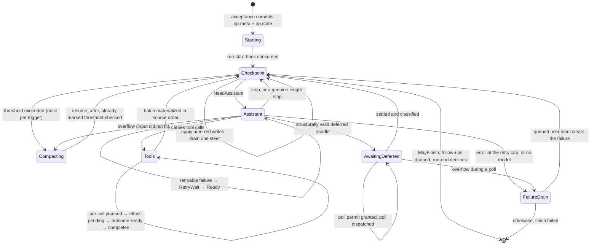
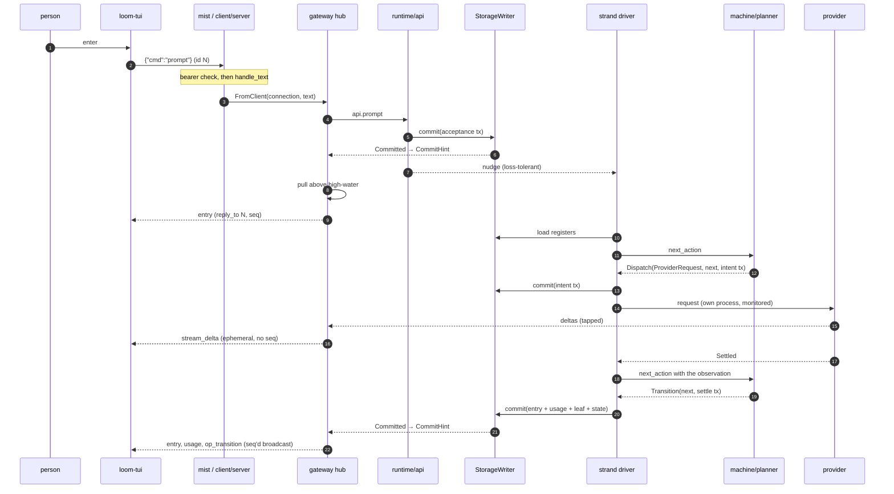

# A tour of the code

Someone types `fix the flaky test in auth_test.gleam` into `loom-tui` and
presses enter. Between that key press and an answer appearing on their
screen, the request crosses a native Gleam terminal process, a websocket, a
Gleam actor, a pure state machine, a SQLite file, an HTTP stream, a Go binary
inside a kernel jail, and all the way back. Every major piece of Loom
sits somewhere on that path.

Following it once, in order, with a file and line for every step, is the
cheapest way to learn where everything lives. The plane documents beside
this one — `docs/architecture/durability.md`, `orchestration.md`,
`effects.md` and their siblings — go deep on what each layer *is*; this
one is about how a request moves through them, and where a step deserves
more depth the cross-reference is the depth.

Paths follow the convention those docs use: a Gleam path is relative to
its package's source root, so `runtime/api.gleam:251` is
`packages/runtime/src/runtime/api.gleam` line 251; the remaining Go paths are
relative to `packages/sandbox`, so `internal/jail/stage2.go:43` lives there.

## The shape of the thing

Nineteen packages, eighteen Gleam and one Go, split across three planes.

**The durability plane** stores rows and answers queries and decides
nothing: `core` (ids, the four write-once entry shapes, transactions, the
two total codecs), `storage` (two interchangeable backends behind one
record of functions), `session` (typed register access and the context
projection), `events` (read models and a `pg` bus).

**The orchestration plane** decides what happens next: `machine`, a pure
package whose whole surface is one total function, and `runtime`, the OTP
tree that carries out what that function returns.

**The effect plane** touches the world: `provider` (the model SDK),
`broker` (the one door), `sandbox` (the Go jailer), `tools` (the tool
set), plus `codemode` and `cap` for programs the model writes, and `mcp`
for the third-party servers those programs can be handed.

`client` hosts all of it — the protocol, the hub, the websocket server,
the production wiring, and the `loom-server` entry point — and `tui_gleam` is
the native terminal client on the far side of the wire. `prompt` renders the
system prompt from a data pack, `conformance` holds the suites that
define correct, and `cap` is compiled *into* the jail rather than linked
into the harness.

Two more sit beside the planes rather than in one. `telemetry` is a leaf
over `core`, so any impure package may log through it, and its
correlation context travels as a value because `logger`'s process
metadata does not survive a spawn and the effect sandwich is nothing but
spawns. `lint` is Loom's own house-rule lint over Gleam source — seven
rules, four of which gate `make check` at error level — and it depends on
nothing in the harness at all.

Purity is layered on purpose. `core`, `machine`, and `prompt` perform no
I/O and declare no FFI; that is what makes the operation state space
property-testable with no processes involved and the system prompt
byte-stable for a whole session.

## Before the key press

By the time anyone can type, `client/serve.boot` has already assembled
the whole stack in one function, and its order is the dependency graph
made executable.

One clock function is built first and threaded into the session, the
broker, the tools, and the provider. That is not tidiness: budget
deadlines are computed on the tool-side clock and checked against the
broker-side clock, and the M2 integration found that misaligned eras made
the broker refuse every call as already expired. One clock, one era.

Then the session file opens under a fenced writer lease
(`session.open_sqlite`, 60-second TTL), a pool of `loom-exec` helpers
starts — sized from `LOOM_HELPER_POOL` or the node's scheduler count
clamped to `[4, 16]`, since every helper is an OS process running bwrap
and a jail and the number is also the ceiling on how wide a parallel
tool batch runs — and the broker starts over that pool. Then the two hub
composition seams are created *before* the runtime, because both need to
be addressable by name before the process they talk to exists: a commit
forwarder actor whose subject goes into `api.open`'s `subscribers`, and a
provider tap that wraps the effect record's provider field. The Agency —
the messaging plane behind the `agent_*` tools — has the same knot and
the same solution: `api.open` takes the effects record and returns the
runtime, and the runtime *contains* the effects, so a closure over the
live runtime would be a value cycle rather than an ordering problem. The
seam closes over a process name and the holder starts under that name
after the open.

The tool registry is assembled next, and what goes into it is decided
here rather than at call time: the `agent_*` family when a messaging
plane was wired, and `code_mode` only if this host has the toolchain and
the build seed code mode needs (§15). One registry serves two masters —
the effect wiring dispatches through it and the hub validates
`set_config active_tools` against it — so they must be the same registry
or the check means nothing.

The system prompt is assembled once and pinned into a reserved `prompt/`
cell, read straight off the store before the open (nothing owns it yet)
and written back through the writer after it. Every later boot sends the
pinned bytes rather than deriving them again, because the prompt sits
inside a one-hour cache breakpoint and a single changed byte costs a full
cache write on every strand for the rest of the session.

Last come `api.open`, the Agency holder, the gateway hub, and the
websocket listener. The token file is written `0600` before the listener
binds.

## 1. The key press

Etui hands each key to `update_key` in
`packages/tui_gleam/src/tui_gleam.gleam`. Modal keys stay with the open
selector or inspector; ordinary keys update the textarea; Enter passes the
current draft to the submission reducer.

That reducer makes one decision from state the client already holds. Typed
text on an idle strand is a `prompt`; typed text while the strand has a live
operation is a `steer`. Tab changes the live submission mode to a queued
`follow_up`. A `/` prefix opens the command palette instead (`/fork`,
`/compact`, `/abort`, `/strand`, `/model`, `/quit`).

The update loop never performs websocket I/O. It sends a typed message to the
connection actor in `tui_gleam/connection.gleam`; that actor stamps the command
id, serializes the frozen envelope, and owns the Stratus socket. Incoming text
returns through the terminal process's mailbox and reduces the same immutable
model before `view` draws the next frame.

## 2. The frame, and the fence at the door

The frame on the wire is one JSON envelope, text frames only, at
`/v1/ws`:

```
c→s  {"v":1, "id":<uint>, "cmd":<name>, "body":{...}}
s→c  {"v":1, "reply_to":<uint>?, "event":<name>, "seq":<uint>?, "body":{...}}
```

Both implementations build to `packages/client/protocol.md` and are pinned to
each other by thirty-five golden fixtures under
`packages/client/testdata/protocol/`, which the gateway conformance suite
decodes and re-encodes byte for byte. Drift fails a test
rather than a session. `docs/architecture/client.md` covers the envelope,
the reply table, and the three places the fixtures deliberately differ
from `core/codec`.

The connection was authenticated long before this frame: `route`
(`client/server.gleam:232`) runs the bearer check ahead of the upgrade,
so a `401` is emitted with no websocket state in existence.
`authorized` (`client/server.gleam:257`) branches only on the public
`Bearer ` prefix and then hands both operands to `crypto:hash_equals`
through a shim that hashes each side first — the presented string is
attacker-controlled, so a plain length-mismatch fast path would leak the
token's length.

Once upgraded, the transport is one module thick. The socket handler
registers a sink with the hub and forwards text:

```gleam
        mist.Text(frame) -> {
          gateway.handle_text(gateway, state.connection, frame)
          mist.continue(state)
        }
```

Nothing else in the client package knows what a socket is. A connection
*is* a `fn(String) -> Nil`, handed to `gateway.attach`
(`client/server.gleam:296`), which returns an integer id.

## 3. The hub

The hub is one actor per served session (`client/gateway.gleam:441`).
Four kinds of message reach it: client frames as `FromClient`, the
runtime writer's post-commit publication as `CommitHint`, a bus
publication as `BusHint`, and streamed provider deltas as
`ProviderDelta`.

`handle_text` becomes `dispatch` (`client/gateway.gleam:1221`), which
decodes strictly on the envelope and tolerantly on names — an
unrecognized `cmd` survives as `UnknownCommand` so the hub can answer
`unsupported` in band — then `run_command`
(`client/gateway.gleam:1078`) checks that this connection has subscribed
and matches the command. Our `prompt` lands at
`client/gateway.gleam:1497`:

```gleam
  use <- known_strand(state, connection, id, strand)
  let target = api.on_strand(state.runtime, strand)
  case api.prompt(target, [user_message(state, text)]) {
```

That is the whole of the hub's conversational logic. The commands map
straight onto the operation model the orchestration plane already has;
the hub adds nothing of its own and commits nothing of its own. Its reads
go at the store handle directly, but every write it causes goes through
the session's one writer.

## 4. The first commit

`api.prompt` is two lines (`runtime/api.gleam:312`): accept quietly, then
ring the doorbell. The work is in `accept_quietly`
(`runtime/api.gleam:270`), and its shape is the shape of every admission
in the system.

It reads the strand state, the leaf, and the pending payloads — capturing
the *seq* of each read, because the seq is what the commit's expectation
will be built from — mints a fresh id generator, and hands all of it to
the pure planner:

```gleam
    case acceptance.accept_prompt(AcceptRun(prompts:), ctx) {
      Error(reason) -> Ok(Done(Error(AcceptRejected(reason:))))
      Ok(acceptance.AcceptancePlan(operation:, state: _, tx: plan_tx)) ->
        case writer.commit(w, plan_tx) {
          Ok(_) -> Ok(Done(Ok(operation.id)))
          Error(tx.StaleExpectation(..)) -> Ok(Retry)
```

`accept_prompt` (`machine/acceptance.gleam:126`) refuses immediately if
`strand_state.current_operation` is already set, and otherwise builds one
transaction: any captured next-run items placed as entries first, the
prompt entries after them, the leaf moved to the newest, `op.meta` and
`op.state` written, `strand.state.current_operation` set. It expects both
the strand-state seq *and* the `strand.leaf` seq the caller read, so a
concurrent acceptance loses its expectation and a concurrent idle
tree-write that moved the leaf refuses the acceptance rather than
mis-parenting its entries.

The commit itself is a call into one actor. `writer.commit` is
`process.call_forever` into the StorageWriter (`runtime/writer.gleam:314`),
whose mailbox *is* the serialization order for the session — "transactions
on one session are serialized" is a property of the process topology, not
a convention someone must remember. On success the writer publishes a
`Committed` event to its subscribers, then calls an injected observer,
then replies:

```gleam
          // The crash-scheduler seam: may not return (see module doc).
          state.after_commit(ordinal)
          process.send(reply, Ok(result))
```

Production passes a no-op. The interleave harness passes a bomb, and
because the seam runs after the commit is durable and published but
*before* the committer's reply, killing the writer there produces exactly
the state "commit N is durable, and the committer never learned it" — a
crash between two adjacent commits, scriptable at every boundary
(`runtime/writer.gleam:159–180`).

`docs/architecture/durability.md` covers what happens underneath: the
three stores, all-or-none application, seqs assigned at commit,
expectations evaluated before any write applies, and the fenced lease
that makes "one process owns one session" true across OS processes as
well as inside the node.

## 5. The doorbell

The payload is durable. Only now does anything ephemeral happen:

```gleam
pub fn nudge(runtime: Runtime) -> Nil {
  case live_strand_subject(runtime) {
    Ok(subject) -> strand_runtime.nudge(subject)
    // No driver registered (mid-restart): loss is harmless — the
    // checkpoint poll finds the durable work.
    Error(Nil) -> Nil
  }
}
```

That is the doorbell doctrine in six lines (`runtime/api.gleam:405`).
Every payload travels in a commit; the process message that follows
carries nothing and asks only for promptness. Losing it costs one poll
interval — 200 ms by default — because the driver's periodic `PollTick`
drives a planning pass that re-reads the same durable state and finds the
same work. The api exposes `_quietly` variants that commit without
ringing at all, and the doorbell-loss tests use them to prove a run
completes on the poll alone.

`docs/architecture/messaging.md` states the rule in general: if the
recipient would act differently for having received a message, it goes
through a commit; if the message only affects pacing or display, a plain
process message is fine.

## 6. The machine wakes

The strand driver is an actor whose entire loop is the machine's contract
read literally (`runtime/strand_runtime.gleam:595`):

```
load registers  →  build PlannerInputs  →  next_action  →  act  →  repeat
```

`load` re-reads `strand.state`, `op.meta`, `op.state`, `strand.config`
and `strand.leaf` on *every* pass, then fetches exactly what the loaded
state names — the assistant entry behind a tool batch, the deferred
handle behind a suspended poll, the pending payloads for every queued id
(`runtime/strand_runtime.gleam:1684`). No process-local memory of durable
state exists to go stale, which is why a pass after a restart runs the
same code as a pass mid-run.

`plan` (`runtime/strand_runtime.gleam:862`) then calls the one frozen
entry point:

```gleam
pub fn next_action(
  op: Operation,
  state: OperationState,
  in: PlannerInputs,
) -> Action {
```

`next_action` lives at `machine/planner.gleam:506`. It reads a durable
state and a bundle of inputs and returns one of six actions, defined by
`Action` (`machine/planner.gleam:464`):

| Action | What the driver does |
|---|---|
| `Transition(next, tx)` | commit `tx`, then plan again |
| `Dispatch(intent, next, tx)` | commit the intent transaction, **then** start the effect |
| `AwaitEffect(key)` | produce the named observation, then plan again |
| `Wait(until)` | set a retry timer, or park for a poll permit |
| `Finish(result, tx)` | commit the terminal transaction; the operation ceases to exist |
| `Fault(report)` | the inputs or durable state are corrupt; stop abnormally |

The function performs no I/O, keeps nothing between calls, and cannot
crash. That last property is why there are six actions and not five:
a total function needs a value where a partial one would panic, and
`protocol-change/002` records the addition.

`Fault` really does mean fault. `plan` maps it to `Halt`, which becomes
`actor.stop_abnormal`, which the supervisor turns into a restart — and
under a genuinely corrupt register the strand faults on every attempt
until the tolerance is spent and the tree dies, visibly. Nothing is
quietly repaired behind the operator's back.

### The durable program counter

`op.state` is the program counter, and it is **total**: no transition may
depend on the previous state having been observed, so recovery reads this
one register and knows exactly where it was (`machine/operation.gleam:170`).
There is no finished variant — an ended operation has no state at all,
because the terminal transaction deletes the register.

Three constructors, matching the three things an operation can be
accepted to do: `RunState`, `CompactionState`, `NavigationState`. A state
whose kind disagrees with its operation's intent is corruption, checked
in the first `case` of `next_action`.

Inside a run, the phase is where the action is:



Each arrow that does anything is at least one commit, and a crash between
any two of them resumes at the next.

Two flags on the checkpoint keep the decision idempotent under crashes,
and both are worth knowing by name. `threshold_checked` records the
trigger whose compaction check already ran, so a boundary is never
checked twice; `skip_inbox_once` is set by a drain on the checkpoint it
produces, so a crash mid-drain cannot turn a one-at-a-time drain into an
all-item drain (`checkpoint_action`, `machine/planner.gleam:678`).

Large payloads never live inline in the state. Tool arguments go to
`op.tool_args/{op}:{step}:{index}`, a summary's frozen input to
`op.preparation/{op}:{task}`, a message durable but not yet in the tree
to `pending.entry/{id}` — all written once, all deleted by the terminal
transaction. Queue lists carry ids, never payloads, which is what makes
"at every commit boundary a queued id has a register *or* an entry *or*
neither, never both" a checkable invariant.

`docs/architecture/orchestration.md` has the full state space, the
transition table it maps to, and the normative classification order.

## 7. The effect sandwich

Our checkpoint decides `NeedAssistant`, generation snapshots its
configuration, and the pre-request hook admits. Now the machine has to do
the one thing it cannot do purely: reach outside.

It does not. It returns `Dispatch`, and the driver splits the moment in
two:

```
  commit  intent   op.state = effect_pending, holding reserved ids R
                   (the response entry) and U (the usage row)
          ──────────────────────────────────────────────────────────────
          do it    the provider request runs — nothing durable happens
          ──────────────────────────────────────────────────────────────
  commit  settle   entry R + usage row U + leaf move + next op.state,
                   in one atomic transaction
```

`admit_generation` (`machine/planner.gleam:1058`) mints `R` and `U`, folds them into
`GenerationEffectPending`, and returns the intent transaction beside the
next state. `runtime/strand_runtime.gleam:658` commits it and only then
runs the continuation that starts the effect:

```gleam
        planner.Dispatch(intent:, next: _, tx: plan_tx) ->
          commit_then(state, plan_tx, observation, fuel, fn(state) {
            case start_effect(state, loaded, intent) {
```

The reserved ids are the trick. Because `R` and `U` were minted *before*
the effect started and persisted in the intent, the settlement writes
under ids already promised — and so does a synthetic settlement written
by recovery days later. The ledger and the tree stay in step no matter
which side of the window the crash landed on.

A crash before the intent commit means the effect never started. A crash
after the settle commit means it is fully recorded. Inside the window the
state says `effect_pending` and the truth is unknown, which is exactly
what the driver reports when it reloads that state and finds no live
effect to match:

```gleam
        False ->
          // A restored effect_pending with no live continuation: the
          // request's outcome is unknown (spec §3.1). Loom persists no
          // frame lists (spec-gaps WP-D item 2), so the reconstructed
          // partial is always empty.
          KeyObservation(planner.ObservedAssistantOrphaned(partial: []))
```

`runtime/strand_runtime.gleam:754`. The machine, not the driver,
decides what an orphan means: an assistant request or deferred poll is
wholly uncertain and settles synthetically at zero usage, following
ordinary classification afterwards; a tool call consults the replay
policy declared at intent and persisted there. `ReplaySafe` re-executes
with the persisted arguments under the same reserved result id, and only
if the tool's *current* registration still says safe. `ReplayNever` never
re-executes — the machine synthesizes an interrupted result carrying an
explicit warning that the call's outcome is unknown.

That is the whole of crash-anywhere recovery, and everything else in the
orchestration plane is arranged so this shape holds. Hooks sit outside
the sandwich precisely because they carry no effect intent and are safe
to rerun.

## 8. The request

`start_effect` (`runtime/strand_runtime.gleam:1249`) projects the context
and hands a `RequestSpec` to the injected provider surface. The
projection is a branch scan from the leaf that stops at the first
compaction entry, run through `session.project_scan`
(`session/session.gleam:703`), which applies pi's five rules in order:
reverse to oldest-first, drop error/aborted/deferred assistant responses
while keeping genuine output-limit `length` stops, run custom entries
through their registered projectors, heal orphaned tool calls with
synthetic unknown-outcome results, then apply the transform hook. Healing
at request construction rather than at the fork is what keeps successive
projections append-only — on a settled history it is a no-op.

The driver takes the *default* projection, so as built the third and
fifth rules do nothing on this path: no custom projector is registered
and the transform is the identity. Both seams exist and are exercised by
`project` and `project_context`; nothing in production reaches for them
yet.

Everything past this point is behind `runtime/effects.Effects`, a record
of functions injected at `api.open`: `clock`, `entropy`, `timers`,
`provider`, `tools`, `hooks`. The runtime declares no FFI at all, which
is what lets the whole plane run under a logical clock in simulation.
`client/wiring.build_effects` (`client/wiring.gleam:173`) fills that
record with the real gateway, broker, and registry; the module's own
documentation is the authoritative list of mapping decisions, and it is
worth reading before changing anything about how a request is shaped.

Two of those decisions are load-bearing. An on-route generation dispatches
as `ForRole` so the gateway can walk that role's captured fallback chain;
off-route generations and every deferred poll use `ForResolved` so recovery
reaches exactly the identity its intent captured (`client/wiring.gleam`).
And `tool_specs` sorts and
deduplicates the active tool names (`client/wiring.gleam:329`), because
the tool array renders ahead of the system prompt and prompt caching
matches on an exact byte prefix; two requests with the same active set in
a different order would miss the cache entirely and pay the write again
on every turn. Neither step touches authorization — `clear` admits a call
by `list.contains` on the same list, and set membership is blind to order.

The driver spawns the request on its own process
(`runtime/strand_runtime.gleam`) and waits for a message. Production first
calls `gateway.prepare` (`provider/gateway.gleam`), publishes the parked public
owner to the runtime reaper, and only then grants its begin permit. The
resulting guard spawns a private fallback pump. The pump walks the role's chain only on
*retryably*-classified failures and calls `stream.run` per attempt
(`provider/stream.gleam`); the guard owns the returned handle and translates
a pump crash into a prompt in-band failure. The processful shell is small.
Its server-sent-events parser is pure bytes-in/events-out code with threaded
carry state, and each adapter is a pure response fold, so the same bytes in
any chunking yield the same events and the parsers are property-tested without
a process. `docs/architecture/effects.md`, section "Providers", covers the
adapters, total stop-reason mapping, adapter-computed overflow, and where
secrets are allowed to exist.

The consumption contract is narrow enough to build on: zero or more
`Delta` events, then exactly one `Settled` or `Failed`, and nothing after
it. Deltas are ephemeral display data and prove nothing. The handle also
carries an optional owner pid: when present, its normal exit acknowledges that
the whole asynchronous subtree beneath the handle has drained. An abnormal
exit means that proof was lost.

Which is exactly what the hub's tap exploits. `tap_provider`
(`client/gateway.gleam`) wraps the injected surface so each request runs
through a relay guard that forwards every event to the effect process unchanged
and in order, teeing deltas to the hub on the way past. The guard is published
before it calls the inner surface and remains the inner stream's direct
consumer. Only the synchronous observer call runs on a monitored worker, so
killing that callback cannot strand the guard's ownership. The tap
lives entirely in the composition seam, but it is not allowed an independent
lifetime: explicit cancellation and effect-process death propagate to the
inner handle. An observer-worker crash becomes an in-band transport failure only
after the inner owner drains; otherwise it becomes
`CancellationUnconfirmed`, and the guard remains the public drain witness.

That chain reaches the socket. `StreamHandle.cancel` signals the gateway
guard, which asks the pump to cancel its current `RunningRequest`; the native
owner calls the narrow FFI path with the exact request id and dedicated handler
pid. That same owner receives and normalizes raw `httpc` messages, then waits
for the handler Down that follows socket closure.
Request routing, deadlines, and the cancellation state machine remain in
typed Gleam. Each grace period is bounded; a public owner that cannot prove
teardown remains alive until its lower owner exits. Ignoring late events
protects state, but this ownership chain is what prevents an old request from
continuing to stream and bill after abort, timeout, or driver restart.

## 9. Settlement

`stream.await_terminal` returns, the effect process waits for the stream
owner's complete drain, then sends `ProviderDone` to the driver. Only then does
the driver turn it into an observation and plan again. `settle_assistant`
(`machine/planner.gleam:1135`) classifies the
response — first match wins, and the order is normative because
reordering it changes behavior rather than style: cancelled control,
overflow, valid deferred handle, retryable error, tool use, stop. Ask
about cancellation first and a cancelled run never diverts into a
compaction on its way out; ask about tool use before a genuine length
stop and a truncated response executes calls cut in half.

Then one transaction, in pi's normative order
(`settle_writes`, `machine/planner.gleam:1538`):

```gleam
  [
    build.message_entry(response_entry, leaf, message, False),
    build.set_leaf(op.strand, Some(response_entry)),
    build.usage_row(usage_id, Some(response_entry), message_usage(message)),
    build.set_op_state(op.id, next),
  ]
```

Response entry, leaf move, usage row under the reserved id, next state.
Atomic. The window is closed.

## 10. Back to the screen

The writer published `Committed` before it replied. A tiny forwarder
actor — created before the runtime so the writer re-registers it on every
tree restart — turns that into a `CommitHint` cast at the hub
(`client/gateway.gleam:349`).

The hint carries nothing. It triggers `pull` (`client/gateway.gleam:569`),
which reads everything in storage above the hub's high-water seq and
merges four sources: new entries reachable from each strand's leaf plus a
completeness pass for entries no leaf covers, new usage rows attributed
through the entry cache, operation transitions and terminal results read
from the strand registers, and escalation records under the reserved
prefix. The result is filtered above the high-water, sorted by seq,
deduped, and broadcast.

The single decision the rest of the hub falls out of is that **the
envelope `seq` is the storage seq of the write that produced the event**.
Storage assigns strictly increasing seqs to every write in a session, so
the event stream needs no side index, survives gateway restarts by
construction, and can be rebuilt from scans at any time. The high-water
advances only to the greatest seq actually *emitted*; advancing to the
store's tail would race a commit landing between two of the reads and
drop its events silently.

Two consequences follow from reading registers rather than a log, and
both are documented protocol behavior. Immutable rows replay exactly:
`entry` and `usage` events are scanned by seq range, so a resume
reproduces them one for one. Register-backed events replay as current
state at current seq: registers keep no history, so a superseded
`op_transition` is not reconstructible. A client that missed an
intermediate phase still converges, because phases are display labels and
the snapshot carries live state.

The client that issued the command gets its `entry` once, as the reply.
`reply_with_matched` (`client/gateway.gleam:1800`) pulls, picks the last
emit the matcher accepts, broadcasts everything to everyone *except* that
one copy to that one connection, and sends the matched emit back with
both `reply_to` and its seq.

The native connection actor decodes the event and returns it to the terminal
model, which replaces transient stream fragments when the matching durable
entry arrives. The event's seq *is* the storage seq of the commit that produced
it (`protocol-change/006`), so the stream is legitimately sparse — commits
that write no client event consume seqs too — and a forward jump carries
no information at all. The retired Go client once treated one as a gap and
asked for a replay; the replay was sparse for the same reason, so against a
real server nothing after the first event was applied. The real terminal
end-to-end caught that bug. The native client starts from a full snapshot and
applies the live connection's events, but does not yet reconnect or issue
sequence catch-up after a drop. That limitation is explicit rather than a
claim that sparse events have become contiguous.

The typed message reaches `Update`, which folds it into the transcript,
and the loop closes. `docs/architecture/client.md` covers the hub, the
protocol, attribution, the approval check, and the token story in depth.



## 11. A tool call goes out

Say the response carried tool calls instead. Classification yields a tool
batch, the machine plans one call per tool-call block in source order and
reserves every result id up front, and each call then walks
planned → effect-pending → outcome-ready → completed.

Clearance happens before the intent commit and is a security boundary
with a load-bearing ordering (`runtime/strand_runtime.gleam:1455`). The
driver loads only the approvals attributed to *exactly this call* — an
escalation record carries a `CallScope` of
`{operation, strand, step, source index, call id}` — consumes them by
compare-and-swap *first*, and passes into `tools.clear` only the grants
whose consumption commit won. A lost race drops those grants and the
clearance proceeds under the base policy; a crash after consumption
spends the approval without an execution. Both directions fail safe: one
approval is worth at most one widened execution of exactly the call a
human approved. What the clearance won then travels onto the dispatch it
authorized — `take_cleared` (`runtime/strand_runtime.gleam:1397`) hands
`ToolRun.grants` only the carry keyed to this call's own step and source
index — and `client/wiring.tool_context` decodes it there onto
`Ctx.grants` (`run_grants`, `client/wiring.gleam:1382`). That is the
whole channel: an approval a human gave for this call, reaching the
policy composition this call is judged by. It used to stop at the query.

Then `Dispatch` again — intent commit, then the effect — and the tool
runs on its own spawned process. `client/wiring.run_tool` builds a fresh
`Ctx` per call carrying the driver's own durable coordinates —
`{strand, op_id, step_id, source_index}` — and dispatches through the
registry (`run_tool`, `client/wiring.gleam:1206`). All four come from the driver, so a
model that names another strand in its arguments does not become it.

`tool.dispatch` is total (`tools/tool.gleam:360`): an unknown name yields
an in-band error result rather than a crash, and so does every other
failure a tool can meet. Tool failures are **data**. That is what makes
"tools never crash the strand" a structural claim rather than a
discipline.

For `bash`, `run` (`tools/bash.gleam:87`) builds a `CallSpec` naming the
op and step ids, the session base policy, the tool's own
policy-shaped requirements, the consumed grants, `RefuseNarrowed`, the
argv, the constructed environment, and a pooled budget
(`tools/bash.gleam:122`). Then one call:

```gleam
      case ctx.clear_call(spec, events) {
        Error(refusal) -> tool.refusal_outcome(refusal)
```

`ctx.clear_call` is `tool.broker_runner` over the live broker
(`tools/tool.gleam:652`). Every effect that leaves the harness goes
through this door and no other.

### Through the door

`broker.clear_call` (`broker/broker.gleam:368`) is a call into the broker
actor, and from the moment it succeeds the caller is guaranteed exactly
one settlement event, whatever happens downstream. Five steps, in order
(`broker/broker.gleam:479` and `:519`):

1. **Compose** — the meet of the session base and the tool's
   requirements, root coverage prefix-aware, the network lattice meeting
   at `Off < Proxy < Full`, environment allowlists intersecting as exact
   strings. Only then do approved grants widen anything. Then
   `narrow_unenforceable` downgrades what phase 1 cannot enforce — the
   egress proxy sidecar does not exist, so `NetworkProxy` becomes
   `NetworkOff` and is *reported* as a narrowing. Nothing ever claims a
   proxy allowlist was enforced. Under `RefuseNarrowed` any shortfall
   becomes a structured denial carrying `wanted_grants`, which is exactly
   the policy diff a human would be shown.
2. **Reserve** — one slot against the pooled ledger for this
   `{op_id, step_id}`. Budget is pooled per *execution*, not per call,
   which is what closes the amplification hole: ten thousand polite
   parallel reads share one cap and one aggregate wall deadline.
3. **Mint** — 32 bytes of injected entropy bound to
   `{op_id, step_id, policy, deadline}`, compared in constant time, spent
   once, revoked at settlement.
4. **Checkout** — a helper from the pool, waiting out a full one. A
   batch wider than the pool is congestion rather than a verdict, so
   `clear_call` retries within the caller's clearance budget instead of
   handing the model a resource error. The wait lives in the borrower's
   process on purpose: the broker checks helpers out inside its own
   message handler and back in from `Settle`, so a broker that parked on
   a checkout would be waiting for something only its own message loop
   could release.
5. **Dispatch** — an `exec_start` frame over the framing channel, with a
   relay process owning the event subject, enforcing the wall deadline,
   and reporting settlement back.

The wire is one framed msgpack protocol for every data-plane channel:
`u32_be length ++ msgpack(map)`, keys `v`, `id`, `kind`, `body`, capped
at 16 MiB on both sides. Malformed and unknown are different failures — a
frame that does not parse closes the channel after an in-band error so
the effect can settle; a frame that parses but names an unimplemented
kind gets an in-band error and the channel *stays open*, because the peer
may be newer.

### Into the jail

`spawn_helper` (`broker/exec.gleam:1576`) is where the Erlang side meets
the OS. The helper's base policy has to arrive on file descriptor 3, and
Erlang ports cannot map arbitrary descriptors, so the broker writes the
policy to a mode-0600 file inside a mode-0700 directory and starts the
helper through a shell:

```gleam
  let args =
    list.append(
      [
        "-c",
        "helper=$1; policy=$2; shift 2; exec 3<\"$policy\" \"$helper\" \"$@\"",
        "loom-exec",
        config.helper_path,
        policy_path,
      ],
      config.helper_args,
    )
```

Positional parameters sidestep every quoting pitfall in the paths; the
file is unlinked the moment the helper's hello proves it was read, and a
janitor process monitors the helper actor for deaths the actor never
sees. Per-execution policy still travels inside `exec_start` and remains
authoritative there. `helper_args` is how the two things the helper can
only learn from its command line get there — a delegated cgroup base, and
the `--allow-unenforced` opt-out on a platform with no jail — since an
Erlang port cannot set its child's environment.

`loom-exec` is one static Go binary whose first argument selects its role
(`cmd/loom-exec/main.go:39`): server mode with no argument at all, stage 2
under `--exec`, plus `--self-test`, the `--probe-socket` and
`--probe-setsid` witnesses, `--cgroup-base` (the delegated cgroup v2 base
the memory and pid ceilings need), and `--allow-unenforced`, which is
server mode on a platform Loom has no jail for. Server mode spawns bwrap, which owns every namespace and
mount — load-bearing, because the Go runtime is multithreaded from the
first instruction and unshare/fork namespace assembly in a multithreaded
process is the tar pit that gave runc its `nsexec.c`. The helper only
composes an argument list, which is pure data and golden-tested.

Stage 2 is the whole security model in one function
(`internal/jail/stage2.go:43`): parse the policy from fd 3, chdir, set
`RLIMIT_FSIZE` and `RLIMIT_CPU`, apply a Landlock ruleset derived purely
from the policy, set `no_new_privs` unconditionally, install the seccomp
filter when the network is off, write an enforcement report on fd 4, and
then:

```go
	// execve: the restrictions above ride along; our code does not.
	if err := syscall.Exec(path, cfg.Argv, os.Environ()); err != nil {
```

`internal/jail/stage2.go:156`. That order works because Landlock domains,
seccomp filters, rlimits and `no_new_privs` all persist across `execve`
and can only tighten: the target starts life inside the cage with none of
our code left in its address space.

A helper on a kernel that cannot provide a layer does not pretend. It
reports what it has in `hello.features` and, per execution, in an
`enforcement` list and a `degraded` flag; the broker decides.
`PlatformEnforcement` — what production passes — refuses a degraded helper at
dispatch *and* fails any execution whose `exec_exit` omits a mandatory layer
or reports an unexpected skip. It is identical to `FullEnforcement` on Linux;
on Darwin it admits only ADR-006's three explicitly reported resource and
lifecycle gaps. Features are a promise and the exit report is a fact.
`docs/architecture/effects.md` covers the threat model, the bwrap argv
order, why network-off is enforced at socket creation rather than at
connect, and why cgroups rather than rlimits bound memory and process
count.

### Off Linux, it refuses

Everything above is Linux. `loom-exec` nonetheless *compiles* everywhere
Go does, because a helper that will not build is a helper nobody can run
`--self-test` against to discover it has no jail. Two `//go:build` splits
carry that: `internal/jail/nnp_other.go` returns a skip reason where
`internal/jail/nnp_linux.go` would set `PR_SET_NO_NEW_PRIVS`, and
`internal/seccompf/seccompf_other.go` answers `false` from `Supported()`
and an error from `Install()` — so a caller that ignored `Supported()`
gets a refusal rather than a silent no-op that would leave the network
open under a report claiming a filter.

`internal/jail/platform.go` holds the decision itself, and its whole
point is that this gap is a *different kind* from a missing layer.
Everything else in `Features` probes the running kernel and reports a
shortfall as an environmental skip — no bwrap binary, no Landlock in this
kernel. `PlatformSupport` probes nothing, because there is nothing to
probe: the layer is missing from Loom, not from the machine.

So the two are kept apart at every point they surface. `hello.features`
carries a `platform-unsupported` tag of its own, distinct from the
`degraded` tag that flags an absent bwrap, and `Features.Degraded()` is
true for either reason. Every per-execution `enforcement` list *leads*
with the platform skip, because that entry governs how to read the rest:
`rlimits` and `pgroup` really are applied on such a build, and they are
also the whole of the confinement, so a reader who missed the first line
would take the list for a sandbox report. The self-test prints the
unsupported-platform report in place of the probes and exits nonzero.
And `runServer` refuses to serve at all unless the operator passes
`--allow-unenforced` — the opt-in that makes running with no confinement
a decision rather than an accident.

Two things about that path deserve saying plainly rather than being read
between the lines. **Seatbelt is not implemented.** WP-H phase 2 (macOS,
generated deny-default profiles under `sandbox-exec`) and phase 3
(Windows restricted tokens and ACLs) are specified and unbuilt; on
`darwin` the helper applies no filesystem view, no network filter, and no
memory or process ceiling. And **no part of the non-Linux path has ever
run.** `PlatformFor` takes the OS as an argument precisely so its darwin
and windows answers are testable from Linux, which is the only host this
tree has ever executed on.

Output comes back as `exec_out` frames, the tool collects them
(`tools/tool.gleam:692`), overflows anything past 64 KiB to a
content-addressed blob, and returns a `ToolOutcome`. The driver commits
the result — staged into `pending.entry` first, then materialized into
the tree in source order as a separate commit, because parallel execution
settles out of order while the tree stays ordered.

### Rule Zero, and the two channels

Two rules explain most of the architecture above.

**Rule Zero: model-influenced execution never runs in the harness VM.**
BEAM processes are fault isolation, not security isolation — any process
in the VM can call `os:cmd/1`, open any file the OS user can open, and
dial the network. So the actor model buys supervision and recovery, the
kernel buys isolation, and the two are never confused. This is why
`loom-exec` exists at all, why `cap` is compiled into the satellite
rather than linked into the harness, and why `codemode` deliberately does
not depend on `cap`.

**The two-channel doctrine**: framed msgpack over stdio, Unix sockets, or
tunnels to everything untrusted, where every message is parsed and
validated as data; native Erlang distribution strictly between
orchestrator nodes you operate, because a connected node is fully trusted
after handshake. On the path we just walked, the broker↔helper channel
and the satellite cap channel are data plane. Nothing in Loom uses the
control plane today — the bus is a single node's.

The filesystem tools are the one deliberate exception, and the code is
honest about it: `fs_read`, `fs_write` and `fs_edit` run harness-side and
never pass through the broker or the kernel jail, so path discipline is
their own responsibility. Under Rule Zero that is defense in depth rather
than the primary control — no model-chosen *program* runs here, only our
own code on model-supplied arguments — and they still declare
policy-shaped requirements so a policy audit covers every tool uniformly.

## 12. The second turn

The tool result lands, the batch materializes, and the machine returns to
a checkpoint. What happens next is the same code with three differences
worth knowing.

**The checkpoint drains first.** The procedure
`checkpoint_action` (`machine/planner.gleam:678`) runs a fixed order:
apply accepted deferred
writes, drain steer input per the run's drain mode, check the compaction
threshold, and only then start a generation step or, at a `MayFinish`
boundary, drain follow-ups and consult the run-end hook. So a steer the
person typed while the model was working is picked up *here*, not when it
was sent — it was durable from the moment it committed, and the doorbell
only shortened the wait.

**The strand is busy, so the client sends a different command.** That decision
was made by `update_main_key_without_palette` in
`packages/tui_gleam/src/tui_gleam.gleam` from the strand list the client
already holds. A `steer` ack is not what the reply table alone
suggests: the queue admission mints a reserved entry id and writes the
payload to a pending register, so the ack carries that reserved id with
no parent and no envelope seq, and the placed entry broadcasts later with
both.

**The request's cached prefix must not move.** The system prompt was
pinned at the session's first open and the tool array is sorted
canonically, so the bytes ahead of the conversation are byte-identical to
the previous turn. `prompt/pack.Environment` has no numeric field and
must never grow one — a timestamp, an elapsed count, a cost and a token
total all arrive as an `Int`, and adding one is how the caching contract
gets broken silently. `packages/prompt/CLAUDE.md` is the place to read
before touching any of that.

### What is in the pinned bytes

The prompt is rendered from a data pack, and the pack has seven canonical
sections (`prompt/pack.gleam:308`): `identity`, `tool_discipline`,
`delegation`, `conduct`, `environment`, `sandbox`,
`repository_guidance`. The first four carry no placeholders at all — they
are identical for every strand on a given build, and a test holds them
that way — while the last three vary by host and workspace and by nothing
else.

`delegation` is the one worth reading before you touch the `agent_*`
tools, because it is where their policy is stated to the model rather
than enforced on it. Three of its facts matter to anyone reading the
messaging plane. A wait blocks the operation the caller is inside
and holds it open, so the pack tells the model to spawn a batch and then
wait on the batch — one wait takes a list of handles against one
deadline, where the same handles waited one at a time are that many
windows in a row. Addressing is descendant-only: a strand may wait on
what it spawned and address only its parent or something below it, which
is what keeps the graph of waits acyclic, and a request outside it is
refused rather than queued. And a finished child's result *is its last
assistant message* — not a structured report — so the brief has to ask
for a final answer that stands on its own, with anything that needs shape
left as notes, which come back attached to the result.

A pack's problems carry a severity, and the split is the point.
`severity` (`prompt/pack.gleam:388`) calls an unknown placeholder, or a
missing *fragment*, `Corrupting`: the pack names something it does not
carry, so a section that is present says nothing on some host, and the
shortfall is invisible in the rendered bytes. A missing *canonical
section* is `Shaping` instead, because a pack that drops a section is
still a valid pack and may well have meant to.

`assess` returns the two lists at once, which is what a caller keys on.
`corrupting == []` is the optimizer's question — is this variant scorable
at all — as one expression, and `shaping` is what an operator is told
about a pack that runs anyway. `problems` itself still returns one flat
`List(Problem)`: the axis was added beside it, not folded into it. And
the rule underneath has not moved — `decode` accepts more than `problems`
approves, and the harness decides whether to run with a thin pack.

## 13. A crash, anywhere

Kill the tree at any instant and the session resumes without repeating
itself. Three mechanisms make that true, and they compose.

**The supervision tree is the recovery policy, written as data**
(`runtime/supervisor.gleam:143`). It is rest-for-one over six children,
in order:

```mermaid
flowchart TB
    S["SessionSupervisor — rest-for-one"]
    D["1. drain ledger<br/>strand → live reaper generations"]
    R["2. strand registry<br/>name ↔ process name"]
    W["3. StorageWriter<br/>every commit, every driver read"]
    F1["4. strand factory<br/>drivers for ordinary strands"]
    F2["5. subagent strand factory<br/>own restart tolerance"]
    B["6. strand booter<br/>lists strand.* and starts what is missing"]
    S --> D
    S --> R
    S --> W
    S --> F1
    S --> F2
    S --> B
    W -. "a writer crash restarts<br/>everything after it" .-> F1
    F1 -. "and everything after that" .-> F2
    F2 -. .-> B
    B -. "repopulates both factories" .-> F1
```

Ordering *is* blast radius. A writer crash restarts the writer and every
child after it, because a strand holding a subject to a dead writer has
nothing to say — and the booter, sitting last, repopulates the factories
it just emptied. A strand crash restarts only that strand. And the
subagent factory sits *after* the primary one on purpose: a model-spawned
strand in a crash loop restarts only itself and the booter, so it cannot
reboot the strand a human is talking to or spend the restart budget that
protects it. The runtime cannot tell a model-spawned strand from an
operator-spawned one — lineage is a layer up — so the host injects the
`subagent` predicate, and the default says nobody is a subagent.

The drain ledger and name registry are deliberately separate. Restarting the
name registry rebuilds the session subtree but leaves the earlier ledger alive,
so replacement drivers still see reapers from the tree being torn down. The
ledger itself is temporary and significant: if that ordering memory dies, the
whole session tree stops instead of restarting from an unsafe empty state.

**Recovery is cold start is the first drive pass.** A restarted driver
nudges itself in its initialiser (`runtime/strand_runtime.gleam:223`), so
recovery needs no external input. What that pass does before planning is
validate: every register decodes through a total decoder, and the bounded
checks that follow are decoders in the same spirit — `op.meta`'s id must
agree with `strand.state` and name this strand, a `Tools` phase must find
its batch's source entry and that entry must be an assistant message. A
failed check faults the strand rather than guessing.

The booter is what makes recovery boot *all* strands rather than just
`main`: it lists the `strand.*` registers and starts a driver for every
strand it finds, routing each to its factory
(`runtime/supervisor.gleam:285`). Cold open, a writer crash, and a booter
crash all converge on "list the store, start what is missing".

**No effect crosses the next incarnation's start barrier.** This is the
subtlest of the three. The exclusivity gate and the orphan-versus-live
decision both consult the driver's incarnation-local `live` list, so an
effect that survived a driver restart would run *concurrently* with the
replacement's recovery — a `ReplaySafe` tool re-executed beside its still
running first execution, an assistant request retried while the original
still streams and bills. The fix is an ownership chain built out of
BEAM primitives (`runtime/strand_runtime.gleam:1082`):

```gleam
fn spawn_effect(reaper, stop, body) {
  // Link, then let the reaper record both this pid and how to stop it.
  adopt(reaper, process.self(), stop)
  body()
}
```

Each incarnation spawns one reaper linked to the driver. Effects are spawned
*unlinked* from the driver, then link to the reaper and wait for an adoption
acknowledgement before doing work. On driver death the reaper hard-stops tools
and cooperatively cancels providers. A provider effect also publishes its
`StreamHandle` owner to the reaper before consuming events. That gives the
reaper an independent monitor: if the effect dies first, the reaper cancels
the owner and stays alive until both pids are gone. Its exit therefore
acknowledges the complete provider subtree rather than only its first process.

The drain ledger stores the complete list of still-live reapers for each
logical strand. A replacement driver publishes its new reaper and waits for
every predecessor to disappear before it nudges recovery. The list, rather
than a single latest pid, matters when a replacement itself fails during
startup: the next attempt must still see the older generation. Keeping this
ledger before the restartable name registry matters for the same reason.

Meanwhile a tool that dies mid-flight settles as a synthetic tool error. A
provider death faults the driver through `effect_exit`: presenting it as a
retryable transport failure would let the same incarnation advance before the
independently monitored owner had drained. The restart path waits instead.

**Abort** rides the same rails. `api.abort` sends `RequestAbort` to the
driver rather than committing anything itself, so the durable
`cancel_requested` marker serializes with the strand's own transitions.
The first abort drains steer and follow-up ids into the drained lists
*without deleting their payloads* — those survive to be reported and die
only in the terminal transaction — and only once the marker is durable
does the driver cancel its live effects. Their process-local
continuations die, so reconciliation finds orphans and settles them
synthetically under ids already reserved. A really-settled response that
was already in the mailbox commits normalized to `aborted` while
*retaining its reported usage*: abort must not fabricate a cost of zero
for work the provider actually did.

Provider effects have one additional teardown step before an ordinary receive
timeout can return: the effect calls its stream handle's cancellation
capability and waits a bounded acknowledgement grace. An owner-authored
`ProviderCancelled` proves that cancellation won. If the owner remains silent,
the effect reports the distinct terminal `CancellationUnconfirmed`; it cannot
truthfully claim cancellation succeeded, but it must not retry beside work
that may still exist. The effect then remains alive until the handle's owner
exits. An abort keeps the driver alive and therefore keeps that terminal race:
a settlement already in the mailbox still contributes its real usage to the
aborted result. Driver death has no terminal consumer. The effect requests
cancellation and exits, while the reaper's independent owner monitor keeps
recovery behind the relay, gateway, and transport drain.

The interleave harness turns "kill it anywhere" into an enumeration using
the writer's `after_commit` seam, and the deterministic simulation runner
generates the scenarios the enumeration's author never thought of.
`docs/architecture/simulation.md` covers seeds, scripts, fault schedules,
logical time, and how to reproduce a failure.

## 14. Subagents

A model that calls `agent_spawn` branches off the same path rather than a
parallel one. The tool itself is a shell — a thin wrapper over one
closure on the **Agency** record (`tools/agent.gleam`) — and everything
with teeth lives on the far side of that seam, in `client/agency.gleam`,
where a live runtime is visible.

`spawn` (`client/agency.gleam:423`) reads the durable lineage ledger,
checks the depth cap, and mints the child's name from coordinates that
are already durable in the intent (`client/agency.gleam:458`):
`sub:{parent}/{slug}-{digest}`, where the slug is the purpose bounded and
the digest is sixteen fixed hex characters over the operation, the
minting step and the source index. The model never supplies a name, so it
cannot claim `main`, shadow an operator's convention, or collide with a
sibling — and the determinism is exactly what makes a replayed spawn find
its own child instead of minting a second one. The split of labour is the
point: the half a model influences may be truncated, the half that says
whose child this is has a constant width and takes no model input, so
neither a long purpose nor a chosen one can collapse two minters onto one
name. If the ledger already has a cell for the minted name *and it
records this caller's own call site*, the same handle comes straight
back; a cell recording anyone else's is refused rather than adopted,
because adopting one would hand this spawn a strand already busy with
somebody else's brief.

A spawn may also state the *shape* it wants back. The request carries an
optional result schema, which travels into the child's brief and is
checked on the child's own terminal write: a result that does not match
fails naming the schema, and a matching one comes back as typed JSON
beside the prose report rather than as a sentence the parent would have to
parse. That is what makes deterministic orchestration over children
something other than a script that regexes prose.

`api.create_strand` (`runtime/api.gleam:793`) then seeds the child's
three registers — its own model identity, its own leaf (a cursor into the
shared tree), its own strand state — starts its driver through the
factory, and accepts the task brief as its first run. Because the
registers are durable before anything runs, every later reboot of the
tree restores the child. `create_strand` is `validate` + `seed_strand` +
`adopt_strand`, and `adopt_strand` is exposed on its own because a crash
between the seed commit and the brief commit leaves a strand nothing else
could finish.

Collecting the result is a store read, not a message.
`await_strand_result` (`runtime/api.gleam:1014`) keys on the *operation*,
reading the reserved `operation-result/{op}` cell the child's terminal
transaction wrote atomically beside the latest-wins `strand.last_result`
register (`build.set_last_result`, `machine/planner.gleam:3587`). Keying
on the strand register alone had a hole: a child that starts a second
run overwrites it, and a parent still waiting on the first run's result
would read the second's.

Four corners of `fact.custom` are reserved and refused to `put_fact`:
`escalation/`, `operation-result/`, `lineage/` and `prompt/`
(`runtime/api.gleam:949`). Because reserving also *hides* a namespace
from `facts`, harness code reads and writes those through
`reserved_facts` / `put_reserved_fact`, which refuse everything outside
the reserved set — the two doors are disjoint so neither can be pressed
into service as the other. `docs/architecture/messaging.md` covers the
four inter-strand patterns and what a forged write under each reserved
corner would buy.

## 15. Code mode

The other branch off a tool batch is a model that submits a *program*
rather than a call. `codemode.execute` (`codemode/codemode.gleam:111`)
threads its source through three trust stages, short-circuiting at the
first refusal:

```gleam
  case vet.vet(source, config.vet_policy) {
    vet.Rejected(rejections) -> VetRejected(rejections)
    vet.Passed(vetted) ->
      case compile.compile(vetted, config.compile) {
        Error(error) -> CompileFailed(error)
        Ok(artifact) ->
          case satellite.run(...) {
```

Vetting is a compiler-adjacent lint rather than a heuristic, and it works
because pure Gleam cannot do I/O: a program's maximal capability set is
the transitive closure of its imports plus its own `@external`
declarations. `Vetted` is opaque, so only linted source can reach a
build.

There is not one allowlist but two, and a submission is judged against
exactly one of them. The **workspace seam** is the nine `cap` modules that
orchestrate *effects* — `fs`, `proc`, `net`, `git`, `lsp`, `task`,
`actor`, `kv`, `report`. The **orchestration seam** is `cap/strand` and
`cap/report` and nothing else: a program that orchestrates *agents*,
serviced by the same `client/agency` closures the `agent_*` tools call and
judged against the same `Caller`, so descendant-only addressing, the depth
and fan-out caps and the refusal names are the tools' rather than a second
authorization model. Which capabilities travel together is the whole
point — an orchestrator that could also write a file is a materially worse
thing to hand a model — so the two sets share no module carrying
authority, and a test pins the disjointness. The allowlist follows the
*submission* (a program is refused against the seam it asked for, and the
refusal says which) while the router follows the *host* (`--codemode-seams`;
a surface serving one seam hands out that seam's router whatever a request
says), so no submission reaches a capability an operator did not wire.

The seam brings one rule that is new rather than inherited. `agent_spawn`
is throttled by turn cost, and a loop pays nothing, so an implicit
throttle removed became an explicit one: a hard ceiling on spawn
admissions per execution, refused in band *at* the ceiling and naming it.
It is enforced by the satellite host, because one host stands up per
execution holding the one identity a caller may mint, so the tally is
keyed to that identity by construction.

The build is hermetic, pinned, and offline, with
`--warnings-as-errors` doing real work — it turns Gleam's transitive
dependency import warning into a compile error, so `gleam/erlang/*`,
`gleam/otp/*` and `core/*` are closed by the compiler and not only by the
allowlist. Then the artifact runs in a disposable jailed BEAM whose only
reachable effect is one AF_UNIX capability channel back to the broker,
and every `cap_call` on it becomes an ordinary `broker.clear_call` under
the host's own `{op_id, step_id}` — so the deadline kills it and the
budget pools across the whole execution.

The model reaches all of that through a `code_mode` tool
(`tools/codemode.gleam:264`) built on the same shape as the `agent_*`
family: a `CodeMode` record of closures declared in `tools` as plain
data, and filled by the one package that can see both ends. `codemode`
already depends on `tools` — its capability router renders a
`tool.Collected` into a `cap_result` — so the two meet in
`client/codemode.seam` (`client/codemode.gleam:304`) rather than drawing
a cycle.

Two of the tool's declarations carry more than their names suggest.
Replay is `tool.Never`, and not out of caution: a program's capability
calls have neither a minted id to reconcile onto, the way `agent_spawn`
has one, nor a digest-bound pre-image, the way `fs_edit` has one, so a
crash mid-execution can only synthesize an interrupted result. Execution
is `tool.Exclusive`, and the workspace it may mutate is the lesser half
of the reason. The broker opens an execution's pooled ledger on the
*first* clearance under a `{op_id, step_id}`, with that call's budget
(`broker/broker.gleam:688`) — so a concurrent call in the same step both
sets the budget the program will live under and holds a slot the program
needs, and a satellite needs two outstanding slots to launch at all: one
the node holds for its whole life, one for the capability call it is
serving.

Identity is threaded, never minted. `codemode.request`
(`tools/codemode.gleam:367`) copies `{strand, op_id, step_id, workspace,
base_policy, demand, env}` straight off the dispatching `Ctx` and takes
only the program and a clamped `within_ms` from the model, so the
hermetic build, the jailed `erl`, and every `cap_call` the running
program makes are dispatched under one identity. That is what puts them
on one ledger and one wall deadline, and what makes `broker.abort` on the
operation reach the build and the node alike.

The base policy such an execution is judged against is the session's own
plus exactly two environment *names*. `execution_policy`
(`client/codemode.gleam:612`) appends `LOOM_CAP_SOCK` and
`LOOM_CAP_TOKEN_FILE` to `env_allow` and touches no root, no network
posture, and no limit. It has to: composition takes the meet, so a base
that does not name those two composes them away and the node comes up
unable to find the channel it exists to speak on. Their values are the
harness's own per-execution paths, minted by the launcher and never
model-supplied, so the widening is in what the launcher may *state*, not
in what a program may reach.

The description carries more than the tool's arguments. A model writing a
program authors blind, so a description listing only module *names* leaves
the compiler as the only oracle for a signature — reachable only by being
wrong first, at the cost of a whole hermetic build. `tools/prelude` is the
rendered public surface of every module the offered seams admit, generated
from `packages/cap` by `make gen-prelude` through the compiler's own
`package-interface` output, filtered through each seam's `allowed_imports`
so a module vetting will reject can never be advertised, and held to a
digest by `scripts/gen-prelude.sh --check` inside `make check`. Each seam
renders only what it adds, because tool bytes are the byte prefix of the
provider's cached region and are paid on every request of the session.

Registration is gated on discovery rather than on refusing at call time.
`serve.registry` (`client/serve.gleam`) appends the tool only when
`codemode.discover` (`client/codemode.gleam:722`) finds `gleam` and `erl`
on `PATH` *and* a prepared build seed whose dependency table is
byte-identical to the one the compile service generates — a seed built
from a different table resolved a different graph, so building against it
would pin something other than what the service says it pins. The seed
directory is `--codemode-seed <dir>`, defaulting to
`<workspace>/build/codemode-seed`, which is where `make codemode-seed`
writes one. A host failing any of the three prints the reason once on
stderr and ships no `code_mode` definition at all, because a definition
renders into the tool array ahead of the system prompt and a
permanently-refusing one would be paid for on every request of every
strand for the life of the session.

`execute` itself still reaches into no storage: it *returns* the source
and the artifact for the caller to persist, which is what keeps the
purity layering intact. `docs/architecture/code-mode.md` is the depth on
all three layers and on what each one actually confines, and
`make e2e-codemode` is where the whole pipeline runs for real against a
live toolchain: five scenarios in `e2e_test` — the happy path, a
transitive import the hermetic build refuses, a runaway program dying at
its deadline, a type error coming back in band, and an approved
escalation widening an execution its unwidened twin is refused — plus one
suite per documented sample.

Each sample is read from `docs/examples/` verbatim, so the documented
artifact and the executed one cannot drift, and each is asserted on an
instrumented fixture rather than on the outcome line alone. The migration
sample, `stale_symbol_sweep.gleam`, sweeps a fixture repo behind five
jailed processes and pins three properties the outcome line would pass
without: that the last sweep started before the first finished (the
fan-out is really concurrent), that the sweeps report in input order while
completing in the reverse of it (order preservation is really a property),
and that the losing build strategy stops ticking within a bound (the race
really kills rather than abandoning). The orchestration sample,
`fan_out_review.gleam`, fans out one reviewer strand per package on the
orchestration seam and joins all three on one deadline; it pins that three
*distinct* children were minted, that the join was one `wait` carrying
three handles rather than three waits carrying one each, and that the
counts come back as integers in the order the program listed the packages.
Its Agency is scripted, because `codemode` cannot see a live runtime —
everything between the program and that fake is real, and the
authorization model it does not claim is proved on `client`'s side against
a live runtime instead.

One thing the router does not do is worth stating here rather than
leaving to the depth. Of the nine modules the workspace seam admits,
`satellite.default_router` maps exactly one capability, `proc.run`, onto a
jailed `broker.clear_call`; every other name comes back `unsupported_cap`.
That is a routing table still being filled in (issue #16), not a security
property, and `cap/task` and `cap/actor` are the exception in kind — they
run inside the satellite and compose whatever the router does service.

### MCP servers, which are more modules

The router's other arm is the nineteenth package. An MCP server — a
third-party program speaking JSON-RPC 2.0 down a pipe — reaches a model
through code mode and nowhere else: one `[mcp.<name>]` table in
`loom.toml` becomes one generated Gleam module, and a program calls its
tools by writing `import cap/mcp/github`. Nothing about MCP is a
registered tool, so the model's tool array and its cached prefix do not
grow with a server's tool count, and trust is per server because the
vetting allowlist names one module per configured server.

At boot, `client/mcp` spawns each server over `mcp/transport`'s port
transport with its `api_key_env` resolved from the harness's own
environment, hand-shakes, lists its tools, and hands the listing to
`mcp/codegen`, which renders a module of typed façades plus the surface
the `code_mode` description carries. A server that fails any of those
steps is one `mcp.unavailable` line and no boot failure. The listing is
attacker-controlled JSON, so the generator's discretion stops at names
and signatures: every body closes over the original tool and parameter
names as escaped literals and calls `cap/internal/mcp.invoke`, which a
program cannot import, and a backstop refuses the whole server if a
single `@` survives outside a comment or a literal. A call then travels
as the capability `mcp.<server>` carrying `{tool, arguments}`, served by
the harness over the socket it already owns — no jail, no policy, bounded
by the pooled effect cap, the wall deadline and one call timeout.
`docs/architecture/mcp.md` is the depth, including the worked program a
model would write and the decision about jailing a server, which is open
rather than merely unbuilt.

## 16. Where the BEAM earns its place

Each of these is a specific primitive doing a specific job that a harness
on another runtime would have to build by hand.

**One writer, structurally.** Every commit and every driver read is a
call into one actor, so serialization is the process topology
(`runtime/writer.gleam:159`). Elsewhere this is a mutex plus a
convention that everybody remembers to take it — and it would still not
give you the single instrumentation point that `after_commit` exploits.

**Recovery as a data structure.** A rest-for-one supervisor with six
ordered children *is* the recovery policy
(`runtime/supervisor.gleam:143`). Blast radius is expressed by where a
child sits in a list, and the "restart it and let it re-read durable
state" strategy replaces the defensive coding a non-supervised runtime
needs at every layer.

**Names, not pids.** The writer and every strand register under process
names owned by a registry near the start of the restart order, so a
replacement process is addressable at the same address
(`runtime/registry.gleam`). Doorbells resolve through `lookup` at ring
time rather than caching a handle. The actor before it is the drain ledger: a
replacement atomically publishes its own reaper there and receives the
predecessors it must await even if the name registry just restarted.

**Monitors turn death into an ordering fact.** The driver monitors every
effect process. Tool death becomes an in-band result; provider death faults the
driver because its separate owner monitor belongs to the reaper and may still
be live. No liveness polling stands in for either Down message.

**Links, adoption, and a drain barrier give kernel-grade ownership.** The
reaper (`runtime/strand_runtime.gleam`) acknowledges an effect before it can
run, records provider owners before the receive loop, and exits only after the
worker and its published subtree drain. The replacement waits for that exit
through the drain ledger, making "no effect overlaps its successor
incarnation" an observed ordering rather than a scheduler-timing assumption.

**Ports carry the sandbox helper.** `erlang:open_port/2` with
`spawn_executable` in binary stream mode is the only non-NIF way to
stream to a child process, and port death arrives as an ordinary message
(`broker/internal/ffi_port.gleam`). The port also surfaces the child's OS
pid, which is what the cancel ladder's last resort needs.

**Selective receive with typed subjects.** The driver's selector combines
its own subject with monitor DOWNs
(`runtime/strand_runtime.gleam:219`), so one mailbox carries doorbells,
timers, effect outcomes and process deaths with no dispatcher of its own.

**`persistent_term`** appears exactly once, and inside the jail rather
than the harness: `cap` stores the capability channel in a VM-global slot
readable at local-memory speed from every process a model-written program
spawns (`cap/internal/ffi_registry.gleam`). Installing over a live
channel is refused, because a process surviving execution *N* would
otherwise read *N+1*'s channel and act under its token.

**`pg`** backs the event bus, keyed `#(session, topic)` inside one
node-global scope, so per-session isolation needs no per-session
processes and lookups are local-speed ETS reads
(`events/internal/ffi_pg.gleam`). Re-implementing membership as a Gleam
actor would lose `pg`'s monitor-based crash cleanup.

And two honest omissions. **Hot code loading is not implemented.** The
design names it as the mechanism for the self-improvement loop; no
release-upgrade machinery, no upgrade handling, and no extension zone
exists in the tree. The single `code_change/3` in the source is the
SIGTERM relay's gen_event boilerplate — a no-op
`code_change` (`client_ffi.erl:131`). **Distribution is not used
either**: the bus is a single node's, and the control-plane half of the
two-channel doctrine has no code behind it yet.

One more thing is deliberately *not* taken from the BEAM. Delayed wakeups
go through an injected `effects.Timers` seam rather than the VM's timer
wheel, so a simulated session runs them on logical time; production
passes `effects.real_timers()`.

## 17. Events, projections, and what is not wired

`events` is the read side of the durability plane, and its governing rule
is one sentence: **events are hints, pulls are truth.** An event never
carries content and is never applied as data — it only prompts a
catch-up pull from the durable store. Drop any subset of events and every
read model still converges on the next hint, sync, or restart.

A projection is `initial` plus a pure total `apply`, so folding the same
changes in the same order always yields the same state, which is what
makes rebuild and incremental catch-up provably equal. Its checkpoint
persists state, high-water, *and* the rewrite generation together —
state without its high-water is meaningless, and either without the
generation cannot be told apart from a checkpoint a precise rewrite has
invalidated.

Two things are worth knowing before you go looking for the bus in a live
session. **Nothing publishes to it in production.** `bus.publish`
(`events/bus.gleam:165`) has no caller outside the package's own tests;
the hub can accept a `BusHint`, but `gateway.default_options` sets
`bus: None` and `client/serve` never supplies one, so the writer's
post-commit publication is production's only hint source.

Escalation, on the other hand, is now wired end to end, and the shape is
worth knowing. A tool reaches the broker through `Ctx.clear_call`, and in
production that closure is not the bare broker runner: `escalating_runner`
(`client/wiring.gleam:1049`) wraps it, so a `PolicyRefused` — and only a
policy refusal, the one refusal a human can overturn — goes to the
escalation seam before it becomes a result. `decide`
(`client/escalate.gleam:290`) files a durable, call-scoped record under an
id derived from `{strand, tool, wanted diff}` (`record_id`,
`client/escalate.gleam:272`), so a model that retries lands on the record
already pending rather than one row per attempt — and *claims* it, moving
the record's scope to the call standing at the door now, because a retry
always arrives under a call id the provider has just minted and a scope
frozen to the first attempt would leave an approval nothing can spend.
Then, *if* the host says
someone is attached, `park` (`client/escalate.gleam:555`) holds the call —
on the tool's own effect process, never on the driver, so `Nudge`,
`RequestAbort` and `PollTick` keep being served while a human decides. An
approval is consumed by CAS — after a scope check that is still exact
equality, so a call that lost the claim widens nothing — and the same call
is re-cleared once under the widened policy; a denial, a closed window, a
lost claim, a disconnected client, a hub that does not answer and a crash
all settle the ordinary in-band refusal instead. The window is the smaller
of the configured timeout and the call's own budget deadline, because the
broker's ledger refuses a reservation past that instant, and the deadline
is re-read immediately before the consuming commit so an approval is never
spent on a re-clearance the budget will refuse.

Two things are deliberately *not* in the runtime. Which raised records
interrupt a person is a client-surface decision — the hub emits escalation
events and lists pending ones in its snapshot, and what a UI does with
them is its own business. And code mode is still half outside the loop.
The *spending* half is closed: grants ride the one threaded execution
identity, so an approved escalation composes onto the run phase and only
the run phase — a network grant reaching the hermetic build would put the
network back inside the one thing whose security property is being offline
— and `make e2e-codemode` proves a widened execution reaches a capability
its unwidened twin is refused. The *minting* half is not. Code mode clears
through `config.broker` directly rather than through `Ctx.clear_call`, so
a policy refusal inside it raises no escalation record at all and there is
nothing for a human to approve. Grants can be spent here; nothing produces
one (issue #97). The raiser belongs at the `code_mode` call rather than at
each clearance, because the consent unit is the whole program — which is
what the preview renders — and parking a single `cap_call` would park
inside a live satellite that is holding an outstanding slot and burning a
wall deadline while a human reads.

## 18. A reading order

If you want to read the system rather than follow it, this is the order
that costs the least backtracking.

| Read | Why here |
|---|---|
| `core/entry.gleam`, `core/register.gleam`, `core/tx.gleam` | The vocabulary every other package speaks. Thirty minutes buys the rest. |
| `machine/operation.gleam` | The state space, with every constructor's invariant beside it. |
| `machine/planner.gleam` | The transition table. Start at `next_action` (`:431`) and follow `run_action`. |
| `runtime/strand_runtime.gleam` | The loop that drives it. `drive_loop` (`:595`) → `plan` (`:610`) → `resolve_key` (`:720`) → `start_effect` (`:894`). |
| `runtime/writer.gleam`, `runtime/supervisor.gleam` | Small, and they explain the whole crash story. |
| `runtime/api.gleam` | Every session-facing operation, each one "read seqs, plan, commit, retry on stale". |
| `client/wiring.gleam` | The seam between the pure plane and the world; its module doc is the list of decisions. |
| `broker/broker.gleam`, `broker/policy.gleam` | The one door and the composition lattice. |
| `internal/jail/stage2.go` (in `sandbox`) | The security model, in one function. |
| `client/gateway.gleam` | The outward face. `pull` (`:484`) and `run_command` (`:1078`) are the two halves. |
| `conformance/src/conformance/` | What "correct" means, executably. |

Each package also carries a `README.md` — what it is for, and where in it
to start — and a `CLAUDE.md` that is denser and more current than any
architecture document about that package specifically: its key types, its
real dependency edges, its actor and register traffic with concrete type
names, and the invariants that break things when violated. Read the one
for the package you are about to change.

For the planes in depth: `docs/architecture/durability.md`,
`orchestration.md`, `effects.md`, `client.md`, `messaging.md`,
`events.md`, `models.md`, `code-mode.md`, `mcp.md`, `simulation.md`. For
intent,
`docs/loom-design.md`; for the frozen interfaces and normative
conventions, `docs/loom-implementation-spec.md`; and for every place the
implementation refined the spec, `docs/spec-gaps.md`.
