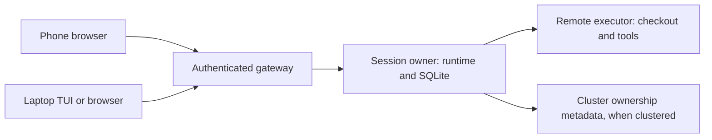

# Distributed Loom: user journeys and ownership

Status: **note, not a work package.** This is the proposed design for
[#697](https://github.com/Roasbeef/loom/issues/697), before implementation.
Configuration below illustrates the intended product; these keys are not a
shipped interface. Requirements describe the proposed contract.

Source baseline: `ae1a319a48aa3feed92f5f65efd09034df635675`.
Audience: Loom users choosing a deployment and implementers learning the
ownership rules. Read the journeys first, then the failure contracts.
The [API and implementation plan](distributed-runtime-api.md) accompanies
this note.

## 1. Start on a laptop, continue from a phone

This journey is already the purpose of Loom's
[multiplayer gateway](../architecture/multiplayer.md). Multiple authenticated
clients attach to one daemon's session; its browser relay uses the same
gateway. Remote access needs the existing authenticated transport and network
setup. Switching screens is not the new distributed-runtime capability.

The new deployment separates the session owner from the checkout and tools,
then permits multiple orchestrators to coordinate ownership. Today's local
executor service has no remote listener or registration protocol. The
distinction is visible in these two layouts:

```text
Today:
  phone + laptop -> daemon A [session state + runtime + local tools/checkout]

Proposed:
  phone + laptop -> owner A [session state + runtime]
                          -> executor E [tools + checkout]
  later: owner A -> owner B, with the same executor E and session identity
```

You register a checkout on a remote Linux machine, open Loom on your laptop,
and ask an agent to change it. The agent reads, edits, builds and tests on
that Linux machine. You then open the same session on your phone to inspect
the diff, answer an approval request, or steer the agent. Closing the laptop
does not stop the remote session.

The phone needs an authenticated connection to Loom's web gateway. It does
not need Git, Gleam, the repository or a local language server. On reconnect,
the client loads a snapshot and catches up by event sequence. A lost client
connection does not authorize resubmission of a potentially accepted command;
the gateway reconciles commands using their stable identities.



The owner and executor may be the same remote machine. That is the smallest
deployment for this journey. A separate orchestrator becomes useful when
you want one service to coordinate several execution machines. Keep the
existing multiplayer authorization and gateway rather than building a second
collaboration system for the cluster.

### Deployment examples

| Journey | UI | Session owner | Checkout and tools | Expected behavior |
|---|---|---|---|---|
| Work from anywhere, already the multiplayer model | Laptop, then phone | Remote server | Same remote server | Client changes do not move data or stop work. |
| Use a powerful development box | Phone or laptop | Small always-on server | Remote development box | Edits, Git, LSP and builds use the development box's checkout. |
| Work against a laptop checkout | Phone | Laptop, or always-on server | Laptop | Work can run while the laptop is reachable and awake; sleep is visible as unavailable execution. |
| Coordinate Linux and macOS testing | Any client | Always-on server | Separate Linux and macOS workspaces | Each test reports its commit or snapshot and workspace identity. |
| Upgrade an orchestrator | Any client | A, then B | Executor E throughout | A controlled pause moves session state; the checkout remains on E. |
| Keep the checkout physically on a phone | Laptop | Supported orchestrator | Phone | Requires a supported phone executor and toolchain; not an initial supported deployment. |

A browser on a phone is a client, not an executor. Uploading files from it
would be an explicit import into an executor's workspace. It would not make
the phone's filesystem the live authoritative checkout. Mobile execution
would require a separate platform design, including background lifetime and
sandbox enforcement, before we could promise it.

### Illustrative setup: remote checkout

These TOML fragments show the division of configuration. Their spelling is
provisional. Certificate enrollment, storage and rotation require a reviewed
administrative interface before this becomes runnable configuration.

On the development box:

```toml
[executor]
id = "dev-linux"
node = "dev_linux@dev.example"
identity = "dev-linux-credential"
accepted_orchestrators = ["personal-loom"]

[workspaces.loom]
root = "/srv/work/loom"
access = "read-write"
```

On the session-owning server:

```toml
[orchestrator]
id = "personal-loom"
session_store = "/var/lib/loom/sessions"

[executors.dev_linux]
node = "dev_linux@dev.example"
expected_identity = "dev-linux"

[workspaces.loom]
executor = "dev-linux"
registration = "loom"
```

The user selects the registered `loom` workspace in the UI and starts a
session. The server resolves the registration to an opaque workspace identity.
Clients and models cannot turn an arbitrary host path into an authorized
workspace. The phone only needs the gateway address and a user login.

For laptop-hosted work, the same executor registration points to the laptop.
An always-on orchestrator preserves the conversation when the laptop sleeps,
but cannot continue filesystem operations against an unavailable checkout.
It reports the interruption without repeatedly waking a model to retry.
Supported deployments need an actual authenticated network route; executor
enrollment alone does not solve NAT traversal.

## 2. Where the state lives

**Recommendation 1: begin with executor-resident workspaces.** Every operation
on a workspace runs against its authoritative executor. The orchestrator
holds the session's durable conversation and runtime. Clustering adds a
small ownership directory, not a second copy of every repository.

| State | Authoritative location | Recovery responsibility |
|---|---|---|
| Files, `.git`, worktrees and uncommitted edits | Workspace executor's disk | Preserve the checkout and its identity across reconnects. |
| Build caches, LSP/DAP processes and native jobs | Workspace executor | Reconcile process custody; rebuild disposable caches when needed. |
| Conversation, notes, approvals, accepted commands and effect records | Owning orchestrator's SQLite store and associated durable artifacts | Restart from durable state; transfer a verified consistent cut during handoff. |
| Execution admission and terminal evidence | Executor's durable execution ledger | Retain evidence until the owner durably acknowledges it. |
| Session owner, generation and handoff phase | Authoritative metadata store | Serialize conditional ownership transitions. |
| Workspace identity, registered executor and ownership epoch | Authoritative registration store | Fence stale workspace bindings. |
| Presence, capacity hints and subscriptions | Reconstructible runtime state | Refresh after reconnect; never grant ownership from these hints. |
| UI layout and cached transcript display | Client | Safe to discard and reload; never authoritative execution evidence. |

In the single-orchestrator phase, local durable registration is sufficient.
The proposed clustered store is Khepri, subject to the compatibility spike
in the implementation plan. Large transcripts, source files and build
artifacts remain outside that metadata store.

Deleting a browser tab must not delete a session or revoke an authorized
background job. Losing the executor's disk is a different failure: the
session history can survive while uncommitted workspace changes do not.
Backups and later snapshot support address that failure; metadata consensus
does not recover missing file contents.

### Do we need a VFS?

**Recommendation 2: use a typed workspace service, without a shared POSIX
filesystem.** Operations carry a `WorkspaceId`, its current epoch and a
validated relative path. The executor resolves that path under its registered
root and enforces the operation's filesystem authority.

The service supplies the filesystem operations Loom actually uses: bounded
reads, listing, search, anchored edits, writes, artifact access and command
execution. Git, code mode, dependency preparation, LSP and DAP use the same
workspace binding. A local deployment uses the same contracts with a local
adapter. A remote failure must never fall back to a stale local checkout.

This is a filesystem abstraction at Loom's API boundary. It does not require
a FUSE mount, NFS, coherent distributed page caches or transparent remote
system calls. Shell commands run beside the files, where ordinary operating
system filesystem behavior applies. File viewing from a phone returns data
through the gateway; it does not mount the repository on the phone.

Path validation includes native canonicalization and symlink policy at the
executor. A syntactically safe relative path alone does not prevent a symlink
from escaping its root. Existing anchored-edit and TOCTOU protections must
survive transport unchanged in meaning.

### Three different kinds of movement

Changing **client** means attaching another screen to the same session.
No workspace transfer or ownership handoff is necessary.

Moving a **session owner** means stopping its runtime on A and booting it
from verified durable state on B. The workspace can remain on executor E.
The A-to-B protocol below is for planned orchestrator maintenance.

Moving a **workspace** means transferring files, including uncommitted state,
to another executor. That requires a separate snapshot and transfer protocol,
quiescence rules and a new workspace epoch. It is deferred from the first
remote-executor phase. Copy-before-run and rsync-after-run do not supply a
concurrent-edit conflict protocol.

For cross-platform testing before general snapshot transfer exists, register
separate checkouts at an explicit Git commit. Return results tagged with that
commit and workspace. Tests of uncommitted changes require an explicit,
verified materialization step; another checkout must never be presented as
the same mutable workspace.

### Choosing among executor pools

After one remote executor works end to end, add placement across registered
pools. Filter candidates by authorization, platform, toolchain and required
sandbox enforcement before considering capacity. A writable resident workspace
binds execution to its host; a scheduler cannot move it merely because another
host is idle. Separate materialized test workspaces can be placed independently.

Capacity advertisements are hints. The selected executor reserves capacity
atomically at admission and can refuse a stale offer. Bound queued work by
session and tenant, expose queue age, and define fair admission under
saturation. Canceling queued work must remove its admission intent without
creating a late launch. Resource pressure never permits weaker enforcement
or an implicit fallback to a different checkout.

## 3. Why Khepri, Ra and Raft enter the design

Khepri is an embedded BEAM database library with a hierarchical key space.
Ra supplies its replicated state machine, using the Raft consensus protocol.
Loom would use it for small records such as session ownership and handoff
state. It is not a replacement for the session SQLite store.
[Khepri's documentation](https://github.com/rabbitmq/khepri) describes its
replication and storage model.

Consider two orchestrators receiving requests to take over session S.
Both may have cached `owner = A`. Reading that value and then writing their
own names separately allows conflicting decisions. The authority service
must perform an atomic conditional transition against the current record.
Raft orders those transitions across a replicated service despite a minority
of unavailable members. Discovery and BEAM messages do not provide that order.

**Recommendation 3: introduce consensus when introducing multiple ownership
decision makers.** One orchestrator serving remote executors does not need
Raft. A single central authority is also a valid cluster design, with a single
availability dependency. Replication is justified when we want that authority
to survive a member failure.

Two voters require both voters to commit. Three voters can commit with two;
two orchestrators plus a third metadata member is one possible deployment.
The third member needs durable storage and operational care. See
[RabbitMQ's cluster-size guidance](https://www.rabbitmq.com/docs/clustering#cluster-size).

The Raft leader, a session's owner and its workspace executor are separate
roles. Changing the Raft leader does not move a session. A majority vote also
does not stop a native process on a disconnected machine. The application
must enforce the ownership and native-custody rules below.

Khepri reads have selectable semantics; a fast local read is suitable for a
routing hint, not an ownership grant. Authority comes from a committed
conditional transition with a reconcilable operation identity. A timeout may
mean that transition committed and its reply was lost. See the
[Khepri API](https://rabbitmq.github.io/khepri/khepri.html).

Direct Ra remains an alternative if the Khepri spike shows that a small
explicit state machine has lower complexity. Mnesia would require a separate
partition and majority discipline; eventually consistent replicas do not
resolve conflicting exclusive ownership. The proposal does not adopt a
database dependency before the spike establishes the required semantics.

## 4. Controlled session handoff

**Recommendation 4: ship planned, quiescent handoff before automatic failover.**
A disconnected A is not sufficient evidence to activate B. The first version
waits for A to participate and for every native effect to be retired or
otherwise safely accounted for. An indefinite background job is an explicit
blocker; the operator may choose to stop it through the ordinary authorized
cancel path.

The durable handoff record contains the session, source, target, handoff ID,
source epoch, proposed next epoch and phase. Phases carry their required
evidence rather than optional fields in one mutable record:

```text
Active(A, e)
  -> Draining(A, e, handoff, B)
  -> Frozen(handoff, e, B, verified_cut)
  -> Prepared(handoff, e + 1, B, verified_cut)
  -> Active(B, e + 1)
```

Each transition is conditional on the exact previous record. During
`Draining`, A stops admitting new commands and effects while settling work
already admitted. It closes provider activity, persists approvals and
execution evidence, and waits for native cleanup evidence. An unknown
execution outcome may be retained in the cut, but unknown native custody
blocks transfer of overlapping mutation authority.

Before `Frozen`, A durably disables reopening its old writer epoch, closes
the writer and forms a consistent SQLite backup plus an artifact manifest.
An offline backup or the SQLite backup API must account for WAL contents;
copying a live `.db` file is insufficient. The cut includes conversation,
notes, approvals, grants, message receipts and unresolved outcome records.

B verifies the cut's identity, digest and required artifacts before recording
`Prepared`. It may construct inactive runtime resources, but cannot write or
dispatch. The committed transition to `Active(B, e + 1)` authorizes activation.
B acquires the local writer only for that epoch. Updated routing follows the
ownership commit and never grants authority on its own.

On every startup or recovery, an orchestrator checks the authoritative record
before reopening a writer. A copied SQLite lease is not a cluster fence.
Executor authorization also binds the session and workspace epochs; an old
credential cannot regain dispatch authority by opening a new connection.
Before activating B, each executor with relevant authority must durably close
A's admission epoch and drain accepted requests, including requests delayed
in transport. A missing acknowledgement blocks handoff.

| Failure point | Allowed recovery |
|---|---|
| Before source freeze | Cancel the exact handoff and resume A after confirming no freeze occurred. |
| Freeze happened, but publication/reply was lost | Reconcile A's durable freeze evidence and the directory; do not resume its old epoch. |
| Transfer or preparation fails | Retry the same verified transfer, or activate a verified copy on a selected owner with a fresh epoch. |
| B activation committed, reply lost | Reconcile the handoff ID; do not activate A as a fallback. |
| B wrote after activation | Returning to A is another handoff using B's state and a new epoch. |
| A is partitioned before fencing | Keep handoff blocked; automatic takeover is a later protocol. |

These rules preserve one effective writer and mutation authority across
epochs. The weaker condition "one owner per epoch" would permit A and B to
write simultaneously using different epochs.

## 5. Remote execution and disconnected machines

Mutually trusted orchestrators and executors join TLS-protected BEAM
distribution. The owner's explicit transport amendment replaces the original
framed executor protocol; implementation is in progress. An executor VM is a
full runtime peer, so compromise of that VM or its OS account can compromise
connected owners. The executor role and hidden-node configuration do not
provide isolation from a malicious peer. Model-authored satellites remain
outside distribution, behind the native sandbox boundary.

Executor enrollment does not grant Raft voting membership or user authority.
The owner still rechecks user membership and capability policy at mutation
admission. The [protocol amendment](../../protocol-change/067-remote-workspace-services.md#addendum-trusted-executor-distribution)
defines certificate pinning, explicit membership, bounded endpoint messages
and the transport replacement gates.

An execution key binds session, operation, execution ID, executor identity,
session epoch and workspace epoch. Its digest binds the command, policy and
inputs. Reusing a key with different content is a typed conflict. A reconnect
changes connection identity, not the logical identity of an existing job.
Executor boot incarnation is separate from both identities.

The executor durably records admission before acknowledging it. Launch can
fail ambiguously between recording intent and observing a native process;
recovery must retain that uncertainty rather than launch the command again.
Results and cleanup evidence remain separate. A successful exit result does
not prove that every native descendant has retired.

The local dispatcher must establish result custody before any remote send
can cause execution. Its existing `StartRefusal` contract means nothing ran
and nothing remains held. A lost remote acknowledgement cannot satisfy that
contract. After possible transmission, retain a handle and settle or reconcile
through it, including an explicit unknown outcome.

| Observed event | User-visible interpretation | Automatic replay |
|---|---|---|
| Locally refused before any possible dispatch | Not started, with a reason | A new authorized attempt is possible. |
| Connection lost after possible dispatch | Outcome unknown; reconciliation pending | No. |
| Result recorded remotely, receipt lost | Retrieve the same execution's result | No new execution. |
| Cancel requested while disconnected | Cancellation unconfirmed | No fabricated cancellation. |
| Executor returns without sufficient evidence | Outcome or cleanup remains unknown | No. |
| Client disconnects while the owner and executor remain connected | Session continues under existing authority | No command resubmission. |

Each admitted job reserves capacity for its durable outcome and cleanup
evidence. Admission stops when the bounded ledger cannot retain another
result. A disconnected owner cannot cause indefinite result retention and
unlimited new admission at the same time. The owner acknowledges receipt
only after its own durable commit. Ledger compaction retains replay fences,
such as closed admission epochs; expiry alone must never make an old key new.

Transport bounds cover frames, stdin, stdout/stderr, inventories, control
messages and aggregate disk/memory across connections. Wire streams such as
LSP cannot be coalesced or truncated into valid-looking success: apply
backpressure or close the channel with an explicit failure. Existing
[#703](https://github.com/Roasbeef/loom/issues/703) is a dependency here.
Native cancellation must continue even when network output is blocked.

An executor enforces a finite job's admitted local deadline while disconnected.
Host-local monotonic timestamps must not cross the wire as absolute deadlines.
The wire contract must distinguish queue age, execution duration and any
end-to-end deadline, with explicit transit accounting. Reconnect and restart
never silently renew a budget.

An explicitly authorized session-lifetime job may continue during owner
disconnection, under its existing bounded resource policy. Remote revocation
cannot take effect until communication returns unless admission included a
finite renewable authority interval. The initial protocol must make that
choice visible; planned handoff waits for confirmed retirement. Disconnection
does not mean the session was deliberately closed.

Code-mode satellites need an executor-local capability socket. Its bounded
forwarder authenticates the execution and routes capability requests to the
owning broker. A harness-local Unix socket path cannot be sent to a remote
host as if it were usable there. Authorization, cancellation and ordered
request identities must survive this forwarding path.

## 6. Messaging, visibility and limits

Cross-node peer delivery uses a durable sender intent, stable message ID,
recipient admission and a receipt. A retry with the same ID cannot deliver a
second logical message. Admission means the recipient stored the message;
it does not mean a model consumed it. Event subscribers catch up by sequence
after reconnecting. Presence and `pg` membership remain disposable hints.

The UI displays the session owner and workspace host separately. It can show
"workspace host unavailable", "cancellation unconfirmed", or "handoff waiting
for job retirement" without starting an inference turn just to poll those
states. Human decisions and new agent input remain deliberate wake events.

Remote executor reports assume the enrolled machine follows the executor
protocol. mTLS proves the reporting identity, not honest behavior by that
machine's administrator. Stronger attestation is outside this proposal.
Cluster consensus similarly assumes trusted, crash-faulting participants.

The first delivery promises remote work and client reconnection. It does
not promise offline multi-device editing, live migration of process heaps,
automatic replay of side effects, or automatic failover of a lost owner.
Each later capability must preserve the same ownership contracts.
