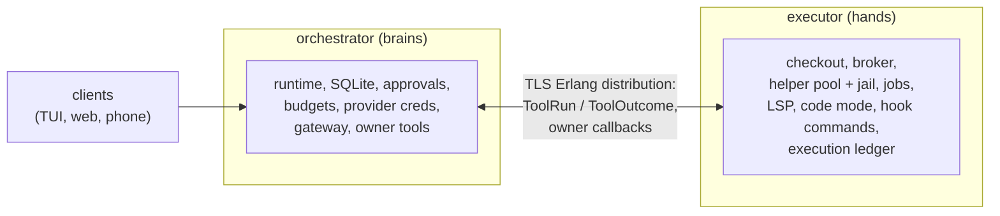

# Distributed runtime: brains and hands on different machines

Status: **accepted direction, 2026-10-07.** This note is the design of record
for [issue #697](https://github.com/Roasbeef/loom/issues/697). It replaces the
design carried by draft [PR #819](https://github.com/Roasbeef/loom/pull/819),
which is kept as an archive. The wire and durable formats it introduces are
specified in [protocol-change/078](../../protocol-change/078-distributed-runtime.md).
How the built system fits together, and what it does under each failure, is
described in [the distributed runtime architecture page](../architecture/distributed.md).

## 1. Why this note exists

PR #819 spent about 220k lines and 300 commits building remote custody for
every kind of effect before an ordinary session had ever run against a remote
checkout. Each effect family (workspace operations, Compile, Launch, LSP,
reports) grew its own journal, wire format, service, completion codec and
recovery path. Measured over the executor package, the Compile and Launch
services match 90% line for line, and the same journal recovery routine
appears five times. Ordinary tools were rebuilt a second time as a typed RPC
with a canonical msgpack codec, while the real tools stayed local and refused
a remote workspace. When the work paused, `serve.resolve_managed` still
answered "registered workspace assembly is not available", and none of the
remote modules had a production caller.

Two choices drove that growth. Every effect, including retry-safe reads, was
treated as an at-most-once native execution with its own identity and
generation link. And trusted executor membership was adopted (executors join
TLS Erlang distribution) without using what that trust buys: a trusted peer
can run our existing code beside the checkout, so the network boundary does
not have to sit underneath every tool.

This note takes the other path. We move whole tool calls, not file
operations, and we reuse main's effect plane unchanged on the machine that
holds the checkout.

## 2. Topology

A deployment has two roles, both served by the same release:



Either machine can play either role. The demo runs the orchestrator on a
laptop with the executor on a Linux box, and then the reverse, on the same
candidate. A single machine running both roles is the ordinary local daemon,
and it keeps working exactly as it does today.

Orchestrators and executors are mutually trusted and administered by the same
operator. They connect over `inet_tls_dist` with PKIX verification, an exact
leaf SHA-256 pin and an exact node-name SAN in both directions, and no
automatic connection. A connected executor has the full privileges of an
Erlang peer, so compromising its VM compromises the orchestrators it talks to;
this is the trust decision issue #697's Rule 1 originally forbade and the
owner later accepted. The TLS check does not tie a connection to the node name it
claims. The verify function (`client_distribution_ffi.erl`, `verify/4`) accepts a
peer certificate whose SHA-256 matches some configured pin and whose single
node-name SAN is that same pin's own node name. It does not compare that name
with the node name in the distribution handshake, so among pinned peers no
per-node identity is established at the distribution layer. A pinned node that
connects can present itself as another pinned node, which stays inside the
envelope above, where every pinned peer already holds the privileges of an Erlang
node. Nothing in the design may assume that a message came from the node it names
on the strength of the connection alone. Code-mode satellites, MCP servers, language servers and
every jailed payload stay outside distribution: satellites boot with
`-proto_dist none` exactly as on main, and no credential, cookie or option
file is ever mounted into a jail.

## 3. Where state lives

| Orchestrator (brains) | Executor (hands) |
|---|---|
| Session SQLite: conversation tree, registers, facts (per-strand working directory, `job/<id>` records), approvals, grants, budgets, notes | The checkout: files, `.git`, worktrees, uncommitted edits |
| Catalogue and session registrations, peer mail, memory and history index | `.blobs` (Bash overflow, code-mode reports), code-mode work directories, build seed, capability sockets |
| Provider credentials, MCP clients and their secrets | Toolchains, Go and Gleam caches, language servers and their caches |
| User configuration: `~/.loom`, user-level `~/.claude/settings.json` hooks, the hook trust record, skills | Helper pool and jail, background job processes, their staging and spill files |
| | Project hook files and guidance files, read here and sent to the orchestrator as text |
| | Machine configuration (toolchain paths, LSP profiles, mounts) and the execution ledger |

The rule behind the table: configuration that names paths on a machine lives
on that machine. The orchestrator never interprets an executor path, and the
executor never opens the conversation store.

## 4. The cut: `ToolSurface.run`

Every tool effect already leaves the runtime through one function slot,
`effects.ToolSurface.run: fn(ToolRun) -> ToolOutcome`
(`packages/runtime/src/runtime/effects.gleam:327`). The strand driver spawns
an effect process that calls it, after the call's intent and effective
arguments are already durable (`planner.dispatch_tool`, committed through
`commit_then`). `ToolRun` and `ToolOutcome` are plain data: operation id,
step, source index, strand, the call, its arguments, the persisted replay
policy and the consumed grants going out; a finished `AgentMessage` or a
failure reason coming back. No closure, port or local handle crosses.

`wiring.run_tool` (`client/wiring.gleam:1763`) is two functions in sequence.
`read_authority` reads the call's authority from SQLite (directory additions
and standing grants, no filesystem), then `run_workspace_tool` builds a
`tool.Ctx` and dispatches the tool. For a session whose workspace lives on an
executor those two halves split along the machine line. The orchestrator's `run` slot reads the authority
snapshot from its own store and sends it, with the `ToolRun`, to the session's
workspace host. The host validates the stored directory roots against its own
filesystem (the stat that `directories.revalidate` and `permissions.revalidate` do), builds the
`Ctx` with the executor's broker, pool and filesystem, and runs `tool.dispatch`.
Every tool body (`fs_read`, `fs_edit`, `bash`, `grep`, `working_directory`,
`code_mode`, the job tools) runs unchanged. One round trip per tool call,
never one per file access.

Tools that act on the conversation rather than the checkout (`agent_*`,
`history_search`, `remember`, `schedule_*`, `context`, `advise`, skills,
peers) keep running on the orchestrator. Clearance stays on the orchestrator
too. `wiring.clear` is pure over `tool.Declarations` (`wiring.gleam:1709`,
`tools/tool.gleam:573-589`), so the orchestrator builds declarations for the
workspace tools with the same registration code, fed by census facts instead
of local probes, and clears every call before it is sent.

### Callbacks from the executor

A few workspace-side operations need the orchestrator during a call. They
cross as plain request and reply messages to a per-session owner port on the
orchestrator:

1. **Approval.** A policy refusal becomes `escalate.Refused`, and the
   orchestrator returns the `Decision` exactly as `Escalations.refused` does
   today. The wait parks on the orchestrator, beside the durable escalation
   record.
2. **Owner facts.** The per-strand working directory and `job/<id>` records
   are reserved facts read and written through the existing `FactHandle`
   shape: get, compare-and-set, and a prefix listing the jobs actor uses at
   boot (`client/jobs.gleam:2772`). Only those reserved prefixes are served.
3. **Notices.** A finished background job tells its strand through the
   owner's `notify` function (`client/jobs.gleam:2964`), which locally is
   `notice.deliver` (`client/notice.gleam:162-174`) and writes to the
   conversation; the executor sends the notice text and the orchestrator
   delivers it.
4. **Output tails.** Live output hints are casts to the session's event bus.
   Losing one is legal; they never carried a guarantee.
5. **Owner-bound code-mode capabilities.** A satellite's `strand.*`, `notes.*`,
   `peers.*`, `schedule.*` and `mcp.*` requests go to the orchestrator. Its
   `fs.*`, `kv.*`, `report.*`, `proc.*`, `jobs.*` and `lsp.*` requests are
   served on the executor, beside the satellite.

Inside the executor the workspace plane receives these as an `OwnerServices`
record of functions. Locally they call straight through; for a remote session
they send to the owner port. The workspace code does not know which.

The workspace host monitors the owner port. If the port dies while a callback
is outstanding (an approval parked for its 600 s window, a fact swap), the
host settles that callback with an in-band failure, so the call reaches
`terminal` and the next orchestrator incarnation's recovery stages it instead
of waiting on a reply nobody will send.

### Non-tool callers

Hooks, goal checks, Git observation and the worktree diff run commands
through a `broker.Broker`, which is a `Subject(Msg)` plus a clock. For a
remote session the orchestrator holds a broker handle built from the
executor's broker subject, so `clear_call`, `cancel` and `abort` work as
today and output streams back to the caller's subject. Two details keep it
honest. A `CallSpec` carries an absolute deadline, its budget's `deadline_ms`
(`broker/budget.gleam:32-40`), and the executor's broker compares it with the
executor's own clock. The remote handle sends that absolute deadline
unchanged, so the callers build it on `Half.call_clock`: the orchestrator's
clock shifted by the executor's clock reading in the `Attached` reply minus the
local reading when the reply arrived (`workspace.rebased`). Only an escalation crosses as a remaining duration. And
these callers put the workspace path into the spec
(`client/hookrunner.gleam:298`, `CLAUDE_PROJECT_DIR` at :319); for a remote
session that path comes from the census as an opaque string the orchestrator
carries and never interprets. Beyond that, `broker` needs one public
constructor.

## 5. One workspace plane, two placements

Most of the work is splitting `serve.assemble_in` into the conversation half
and the workspace half. The workspace half builds the broker, helper pool,
executor service, the workspace tool registry and `wiring` configuration,
jobs, the LSP manager and the code-mode host, from a `WorkspaceSpec` (root,
machine configuration, base policy inputs, owner services). It returns a
`WorkspacePlane`: a `run` function over `ToolRun` and an authority snapshot,
the broker, the startup census, and `close`.

A local session calls the workspace half in-process and uses the returned
`WorkspacePlane` directly. A remote session asks the executor to build the
same plane inside a supervised workspace host; the orchestrator keeps the
workspace tools' declarations for clearance and a remote `run` that sends
messages. Both placements run the same assembly code, so local and remote
cannot drift apart. That property is the point of the cut, and it is what
PR #819's parallel reimplementation lost.

### Startup census

When a workspace host starts it returns what the orchestrator needs to build
the prompt and the tool table: platform and enforcement level, the toolchain
probe, available language servers, helper degradation, the shell, the Git
program (`host_git.program`, `workspace_plane.gleam:515`, probes the host it runs on),
the workspace root as an opaque string, the guidance files' text, the project
hook files' bytes and the base policy summary. The orchestrator renders and
pins the prompt from it, exactly as it pins guidance today, and checks the
project hook files against its own trust record before any hook can run.

### Not in phase 1

Two features read orchestrator-side state that has no executor counterpart
yet, and a remote session refuses them with a clear error rather than half
working. Extension tools are installed under the orchestrator's HOME
(`serve.gleam:2798`) but run as jailed satellites, which on a remote session
would have to run beside the checkout; executor-side installs as machine
configuration can follow. Operator-added directories
(`directories.admin_with_facts`, `client/directories.gleam:290-320`) are
validated against the orchestrator's filesystem when added; a remote
validation message can follow if anyone needs it.

Two code-mode features are also left local-only for now. Background code mode
(`async_codemode`, `async_runs`) holds the whole runtime handle, and a remote
session registers `code_mode` without it. MCP façades need the orchestrator's
MCP clients and secrets inside the executor's hermetic build; a remote
session's `code_mode` omits them until the MCP layer is split into the data an
executor needs and the clients that stay on the orchestrator. The
protocol-change/078 addendum on background code mode and MCP façades is the
design for both, since built at protocol version 3: the orchestrator keeps the
execution record and the executor runs the program, and each MCP server is
placed on one side by its `runs_on` key.

The remaining placement questions follow the rule in section 3. The `[tools]
env` table is resolved on the executor from its own configuration and secret
store, so no credential crosses the wire. Installed LSP profiles are
discovered on the executor. Guidance splits in two: the user's global guidance
is read on the orchestrator, the workspace's guidance files arrive as census
text. Which tools run where is a name table with a test asserting every
registered tool is placed exactly once, and a remote session refuses an
unplaced tool rather than running it on the orchestrator.

### What stops reading the local disk

For a remote session the orchestrator must not touch the workspace path. The
known places that do today, and where each goes:

| Today | Remote session |
|---|---|
| `server.create_session` canonicalizes the workspace path | Validated by the executor at attach |
| `ui_project.locate` reads `.git` every 30 s for web lists | Taken from the census, refreshed on attach |
| `session_base` reads `.git`, `gitdir`, `commondir` and manifests to widen roots | Built on the executor |
| `codemode_wiring.discover`, toolchain and seed probes | Census |
| `prepare_directories` creates `.blobs`, work and tmp directories, writes `.gitignore` | Executor |
| `system_prompt` reads guidance on first render | Census text |
| `hookserve.locations` reads project hook files | Census bytes; trust check stays on the orchestrator |
| `directories.read` re-validates stored roots on every call | Orchestrator reads the stored roots, executor validates them |
| Jail policy masks owner SQLite and state paths | Rebuilt per machine; the executor masks its own ledger and state |

A remote failure never falls back to a local path. A remote session's
orchestrator has no workspace path to fall back to.

## 6. Durability and failure

### What already exists

The runtime commits a tool call's intent, effective arguments and reserved
result entry before the effect starts, and stages the result durably when it
arrives. `ReplayPolicy` already separates calls that may re-run after a crash
(`fs_read`, `grep`) from calls that must not (`bash`, `code_mode`,
`working_directory`). An orphaned call whose policy is `Never` is staged as
"the external outcome is unknown" (`planner.recover_tool`). The broker
already reports `ExecutionLost` as "may have run, outcome unknown" and never
invites replay. Distribution adds lost replies, partitions and restarts on
either side, and nothing in that list needs a second custody system.

### The execution ledger

The executor keeps one SQLite ledger, opened by a node-level actor that lives
as long as the executor VM. Its rows are keyed by session, so one file serves
every scope on the machine:

```text
scope(session, workspace, incarnation, state, close_outcome, attach_token)
call(session, op, step, source_index, incarnation, tool, state, outcome, ...)
  state: admitted | terminal | unknown
```

A call row is keyed by `(session, op, step, source_index)`, the identity the
orchestrator's planner already uses. The host commits `admitted` before the
tool starts and `terminal` with the encoded `ToolOutcome` before replying.
A second request with the same key never starts a second run: it waits on the
live run or returns the stored outcome. When the executor VM restarts, every
`admitted` row becomes `unknown`; nothing is relaunched. Acknowledgements come
from the owner port's reconciler, not from the code that stages a result:
`surface.ack` has no caller. The reconciler runs when a runtime attaches and
then every 60 seconds, and it sends `ack` for each unacknowledged key that
`workspace.settled` accepts, that is, a call the session no longer holds
pending. An `ack` retires the row (an `unknown` row too, so executor restarts
do not leak them): the outcome and its reserved
bytes go, and a small tombstone keeps the key taken until the scope's
incarnation changes. The tombstone is what lets a key admitted once in an
incarnation never start again in it. Without it, a `Run` from a runtime that
restarted inside one open, delayed past recovery's fence and the
acknowledgement, would find no row and a current token and start a call the
model was told never ran. Tombstones are dropped when the scope reopens at a
new incarnation, closes with every child retired, or is released. A lost `ack`
would otherwise leak a row forever (the call is no longer orphaned, so nobody queries it), so
every `Attach` reply lists the scope's unacked terminal and unknown keys, the
reconciler asks again with `ListUnacked` on each later pass, and it acks the
ones its store already holds.

System work (hooks, goal checks, Git observation, LSP observations) keeps
main's semantics: it is not durable and never replayed, and the next event
triggers it again. It runs inside the scope's current incarnation, so a
closed scope's broker is gone and late system work has nowhere to land.

### Incarnations, close and reopen

Each scope has one monotonic `incarnation`, bumped only by a reopen. Every
request carries the incarnation it was sent under, and the host refuses any
other value inside the same transaction that admits the call. A request from
a closed incarnation and a delayed first request after a close both fail
that check.

Close is a ledger transition. The host sets `closing` (this commit is the
fence), cancels live calls and jobs, stops the LSP manager, code-mode host and
broker, then closes the helper pool and waits for its retirement result
(`exec.close_pool`, `broker/exec.gleam:3290-3310`; job runners, language
servers and satellites are all helper children, so pool retirement covers
them). It removes the scope's sockets and work directories. Then it sets
`closed` with `close_outcome = all_retired` or `unknown(count)`. A monitor
DOWN, a timeout or a lost reply never counts as a witness; missing evidence
leaves the scope `closing` or `unknown`. Reopen is allowed only from
`closed, all_retired`, and it bumps the incarnation. Archive closes; restore
reopens. A scope with unknown cleanup gets no automatic successor; an operator
override is explicit and recorded. The override is `loomd executor release
SESSION`, run on the executor with its daemon stopped. It closes a `closing`
scope, or a `closed` one with unknown cleanup, as `all_retired`, so the next
attach reopens it one incarnation higher, and it writes a `scope_release` row
with the scope's former state and the time. It refuses an `open` scope and a
scope that is already `all_retired`. An orchestrator whose record holds a close
with unknown cleanup attaches at the next incarnation, so the same attach is
refused before the release and reopens after it. This is the routine exit after
an executor restart: the new VM has no plane for any scope it did not build, so
every session that then closes records `unknown(0)`.

Result recovery uses the same ledger. A query by call key works in any scope
state and for any incarnation, because the rows never move. So the property
the PR's protocol 079 called "exact-generation historical read" is a column
read here, with no separate history lane.

The executor admits at most 16 scopes that are not cleanly closed (open,
closing, or closed with unknown cleanup) and refuses the seventeenth. Clean
closes free their slot immediately, so more than sixteen sequential sessions
work. The ledger carries a byte budget; terminal rows the orchestrator has not
acked count against it, and admission refuses when the next call's maximum
result would not fit.

### Runtime restarts, the attach token and the key fence

A strand driver or a whole session runtime can restart without its VM
restarting, and the effect processes of the dead driver are killed. A `Run`
one of them sent may still be in flight. Erlang orders messages only per
sender pair, and the dead effect process and the new driver are different
senders, so the new driver cannot assume its own messages arrive after the
old one's.

The fence that settles this is per call key, not per session. Recovery of an
orphaned call whose replay policy is not `ReplaySafe` sends `QueryOrFence`,
which in one ledger transaction either returns the row that exists or, when
there is none, inserts a terminal "did not start" row. If the stale `Run`
arrives first, the fence finds it admitted and recovery waits for its
outcome. If the fence arrives first, the stale `Run` finds the key taken and
never starts. Either order gives one truthful answer. A `ReplaySafe` call
needs no fence: recovery answers not-started, the planner replays it under
the same key, and admission deduplicates the replay against any stale `Run`.

The attach token covers the coarser case, a whole orchestrator session open.
Each time the orchestrator assembles a session it attaches with a fresh random
token, and admission compares the request's token for equality with the
stored one in the same transaction that inserts the row. Anything a previous
open of the session (an earlier VM, or the source of a move) still sends is
refused by content. Restarts inside one open keep the token, so live strands
are not disturbed when one of them restarts.

| Ledger answer | Recovery |
|---|---|
| `terminal` | Stage the stored outcome. Nothing re-runs. |
| `admitted` | The run is still live; wait for its outcome. |
| `unknown` | Stage "the outcome is unknown", exactly as today. |
| no row, `ReplaySafe` | The planner's existing replay arm re-runs it under the same key. |
| no row, otherwise | `QueryOrFence` writes "did not start", which is staged. |

Recovery is an effect like `run`, not a function the driver calls inline:
the driver must not block, and `KeyWait` only waits on something in its live
set (`runtime/strand_runtime.gleam:1549-1570`). The runtime spawns a recovery
effect for an orphaned call when the surface offers one, and that effect
reports through the same `ToolDone` path as a fresh run. `ToolSurface` gains
one `recover` slot and the planner one recovered observation. A local
session's surface offers no recovery, so it keeps today's orphan rule
unchanged.

### Partitions, aborts and lost replies

The orchestrator's effect process waits on the host's reply and monitors the
executor node. On a disconnect it reconnects and re-sends the same `Run`,
which admission treats idempotently by key (a live call gains a waiter, a
finished call returns its stored outcome), and keeps doing so until the
executor answers or the user aborts. A distribution connection that drops
loses its undelivered messages rather than delivering them later, so the
re-send cannot start a second run; it has no
timer of its own, because the call's deadline lives on the executor. The
session shows the executor as unavailable meanwhile.

The host monitors the effect process that sent each `Run`. Abort today is a
kill of that process (`runtime/strand_runtime.gleam:2181-2185`), so a DOWN
with any reason except `noconnection` cancels the run, exactly as a local
caller's death cancels it through the broker's caller watch. A `noconnection`
DOWN means the orchestrator is unreachable, not that anyone asked to stop, so
the run continues to completion or to its own local deadline and its outcome
waits in the ledger. That deadline is built and enforced on the executor's
clock (the broker budget and tool timeouts are constructed there for tool
calls), so clock skew between machines never decides a timeout. An abort
issued while partitioned arrives only as `noconnection`, so that call reports
"cancellation unconfirmed" rather than pretending it stopped.

| Event | Interpretation | Replay |
|---|---|---|
| Refused before send | Not started | A new call may run |
| Disconnected after send, row `terminal` on reconnect | Completed | No |
| Executor VM restarted mid-run | Unknown | No |
| Abort while connected | Cancelled through the broker | No |
| Abort while partitioned | Cancellation unconfirmed; outcome recovered later | No |
| Orchestrator or runtime restarted, row `terminal` | Completed, outcome recovered | No |

Background jobs belong to the scope, not to the call that started them, so
they keep running across an orchestrator disconnect under their existing
bounded policy, and close waits for their retirement.

### Three fixed limits of the current code

These are what the code does today, recorded so that a change to one is a
decision and not a surprise.

**The protocol version tag.** Every `Attach` carries the sender's
`protocol.version`, an integer that is 2 today (`pub const version`,
`client/remote/protocol.gleam:65`; the field is `Attach.version`,
`client/remote/protocol.gleam:223`, and the surface fills it in,
`client/remote/surface.gleam:202`). The host compares it with its own for
equality and for nothing else (`version == protocol.version`,
`client/remote/host.gleam:402`). A different value gets
`Error(VersionMismatch(supported))` carrying the host's own version, and the
host creates no scope and changes no state
(`client/remote/host.gleam:416`). The orchestrator's open then stops the
session's owner port and fails with `executor_unavailable: the executor speaks
protocol version N and this orchestrator does not`
(`client/remote/workspace.gleam:640`; the wording is
`client/remote/protocol.gleam:390`). There is no negotiation and no accepted
range. `Run`, `Query` and the other messages carry no version of their own,
because each session open begins with an `Attach`. The constant's doc comment
(`client/remote/protocol.gleam:56`) says to change it whenever a constructor or
field of `HostMessage`, `OwnerMessage` or a reply changes.

**The executor host's death halts the executor daemon.** The daemon starts the
host, unlinks it and monitors it (`start_executor`,
`client/daemon/main.gleam:474`). Any end of the host, whatever the reason, is
`ExecutorGone`, which logs `daemon.executor_lost` and halts the VM with status 1
(`client/daemon/main.gleam:1061`). The host is never restarted on its own. The
workspace planes it builds are not in its link set, so a host restarted alone
would leave their helper pools and jobs actors running and then build a second
set beside them on the next attach (`client/daemon/main.gleam:431`). Ending the
VM retires the first set with it, and on the next boot the ledger turns every
call that was `admitted` into `unknown`, as for any executor restart.

**The 16 MiB per-call reservation inside the 512 MiB budget.** Admission
reserves `default_max_result_bytes` for every call, 16 MiB, twice the largest
file `fs_read` returns (`client/remote/host.gleam:229`). The daemon passes it as
`max_result_bytes` (`client/daemon/main.gleam:495`) and the host hands it to
`exec_ledger.admit` (`client/remote/host.gleam:901`). The ledger's byte budget
is `default_max_ledger_bytes`, 512 MiB (`storage/exec_ledger.gleam:440`), and
`require_budget` refuses a call when the bytes held by `admitted` and
`terminal` rows plus the new reservation would pass it
(`storage/exec_ledger.gleam:978`). The refusal is `BudgetExhausted`, and its
sentence is "the executor's ledger is full at N bytes of unacknowledged
results" (`client/remote/protocol.gleam:375`). `finish` shrinks the reservation
to the outcome's real size, and `ack` releases it. Sixteen live calls therefore
hold 256 MiB, and the other 256 MiB is room for results the orchestrator has
not yet acknowledged. An outcome larger than its reservation is stored as a
failure naming both sizes (`commit_outcome`,
`client/remote/host.gleam:954`).

## 7. Code mode, LSP and jobs

All three run entirely on the executor, which is why the cut sits above them.
A code-mode satellite is jailed beside the checkout and can only reach a Unix
socket on its own machine, so the satellite host, its listener and its token
file stay there; only the owner-bound capabilities in section 4 cross. The
LSP manager, its per-server keepers, its query door and the post-write
diagnostics observer all run beside the files they read, so no LSP byte
crosses the network and no new helper wire is needed. The jobs actor runs on
the executor and reaches its `job/<id>` records through the owner facts
callback.

Main's local behavior for code mode, LSP and the helper wire is unchanged by
this design. Changes PR #819 made there (the helper protocol v4 credit
frames, the 64 MiB LSP stdout cap, the charged launch channel) are not
carried over. Two owner decisions about code-mode semantics from that work
are independent of distribution and can land on their own: a Compile is the
original attempt plus at most one `UnusedImportRewrite` under the original
authority and deadline (071), and each Launch retires its borrowed helper.

## 8. Phases

Each phase ends with something observable. We do not start a phase's design
work before the previous one runs.

1. **One orchestrator, one executor.** Distribution bootstrap and the executor
   role; the workspace plane split; the remote `run` and `recover` slots,
   owner port and remote broker handle; registered workspace selection with
   no orchestrator filesystem access; the ledger, attach fence and incarnation
   fence; close, reopen, archive and restore. Exit: a real session on two VMs
   on one host does fs, Bash (foreground and background), working-directory
   selection, jobs, hooks, goal checks, Git and guidance, Compile and Launch,
   LSP queries, rename and diagnostics, with the checkout absent from the
   orchestrator. Then the same candidate passes laptop to Linux box and Linux
   box to laptop.
2. **Executor pools.** Several registered executors; placement filters by
   authorization, platform, toolchain and enforcement before capacity; a full
   executor refuses at attach; no fallback to a different mutable checkout.
   *Built.* A `[pools.<name>]` lists configured executors in the order they are
   tried, and the platform, enforcement and toolchains it requires are matched
   against what each `[executors.<name>]` row declares, so the filter is a pure
   function of configuration and no message asks a machine what it has.
   Capacity is not predicted. The orchestrator attaches to the candidates in
   order, and an executor that already holds its limit refuses inside the attach
   transaction, before it builds a plane, so a received refusal proves that no
   scope exists there. The scope record in the session's store names the
   executor before the attach is sent, and that makes the one rule that matters
   structural: a session whose record names an executor has only that candidate,
   a lost reply is retried against the same machine where the ledger's rebind
   makes it converge, and a first open moves to the next candidate only on a
   failed connection or a capacity refusal. A full executor at reopen is
   `executor_unavailable:` and never a reason to move, because the checkout
   exists only where the record says. After an attach the census is compared
   with the declaration, and a contradiction closes the scope and fails the open
   naming both values. The protocol-change/078 addendum has the wire, the
   catalogue and the placement rules; `docs/distributed-setup.md` has the
   operator's side.
3. **Two orchestrators.** Each orchestrator keeps its own catalogue, which
   stays the source of truth for the sessions it owns, and a session is created
   on, and owned by, the orchestrator the client is connected to. A client may
   connect to either. A daemon asked about a session its catalogue lacks asks
   the orchestrators in its `[orchestrators.<name>]` table, each a pinned peer,
   which of them holds it, over the distribution connection and under a short
   deadline. The answer is a redirect: `sessions.get` and `sessions.open`
   refuse with `not_owner`, naming the owner and the address the asking
   daemon's operator configured for it, or with `owner_unreachable` when a peer
   could not be asked. Only the owner principal is redirected, and nothing
   follows the redirect for the client, which would need a credential for a
   second daemon. The lookup is behind a `Directory` interface of one
   operation, shaped so that a different backing could replace it and a write
   half could sit beside it. Phase 5 added that half and kept the catalogues as
   the authority. There is no merged session list, no
   registration step, no address advertised by the owner and no new
   constructor on the executor host's vocabulary. The protocol-change/078
   addendum on two orchestrators has the wire, the configuration and the
   rules.
4. **Cross-node messaging.** Peer mail already deduplicates on the recipient
   by message id (`peer_mail` admission); we add a directory-aware endpoint and
   a durable sender outbox. Event catch-up is already by commit sequence.
5. **Controlled movement.** *Built.* An owner hands a session on an executor to
   another orchestrator with `sessions.move`, and the source drives the move in
   six steps, each durable before the next. No third store decides who owns the
   session. Two catalogue rows do, ordered by a write-ahead intent: the source's
   `moving` and then `moved`, and the receiver's `imported`. The executor's
   incarnation fence is a second guard and not the authority, because it cannot
   say which orchestrator is the session's owner, only which token is current.
   1. *Intend and stop.* The source commits `moving(op, to)` in the same registry
      turn that stops the session's slot, and admission refuses a session in that
      state, so nothing on the source can open the file after the commit.
   2. *Close.* The session's own cleanup closes its scope on the executor and
      writes the outcome into the file's `client/remote/scope` cell. A cell that
      never recorded a close, because the orchestrator died first, is settled by
      asking the executor to close again, which answers the stored outcome for a
      scope already closed, and writing the answer into the file. An unproven
      cleanup refuses the move.
   3. *Cut.* The closed file is copied with the writer lease held under
      `move:<op>`, the lease row is dropped from the copy, and the copy is hashed.
   4. *Send.* The copy goes to the receiver in 256 KiB pieces, each acknowledged,
      and is bounded at 256 MiB. A failure sends the whole file again; there is no
      resume inside a file.
   5. *Activate.* The receiver checks the digest, that the copy's scope cell reads
      a clean close at the incarnation the sender claims, and that it lists the
      executor. Then one registry turn registers the session, records
      `imported(op, from)` and puts the file in place. That compare-and-set is the
      hand-over.
   6. *Retire.* The source's row becomes `moved(to)`, which has no way out under
      the same operation, its lease is released and its file is set aside.

   The receiver opens the session like any other and attaches at the incarnation
   the copied cell implies, one higher than the clean close, so the executor
   refuses the source's old token. Every step starts from what is on disk: the
   daemon resumes each `moving` row at boot, and a mover asks the receiver how far
   the move has got before it takes a step. A move is abandoned only on an answer
   (an unproven cleanup, a corrupt or oversized file, the receiver's refusal) and
   never because a peer was unreachable, since an unreachable receiver may have
   taken the session and lost the reply. The source's `moving` row is still exactly
   one owner. `Move.tla` checks the protocol with a crash between any two writes,
   and the shipped test loses the source after each of the six steps. A session
   can move onward from the catalogue that received it and back to the one that
   gave it up, each under a new operation. A local session cannot move, and the
   memory domain, memberships and claims stay with the source. The
   protocol-change/078 addendum on moving a session between orchestrators has the
   wire, the messages and the rules.
6. **Acceptance.** The evidence table, full repository gates, both placements,
   the failure matrix, the formal models, an independent review of the
   assembled system, and hosted CI once publication is authorized.

Automatic failover and workspace snapshot migration stay deferred. The
filesystem and cache policy is inherited from the executor's configuration,
with no aggregate disk quota claimed.

## 9. What carries over from PR #819

Kept, adapted to this design: the TLS distribution bootstrap and its verify
function (`executor/remote/distribution.gleam` and its 185-line Erlang FFI),
the strict deployment TOML reader cut down to nodes, pins, credential paths
and workspace rows, the typed workspace selection in `core/workspace`, the
operator launch script and setup guide, and the two-node test fixture. The
formal models were rewritten for this design rather than adapted. Two are
gated by `make model-check`: a TLA+ model of one session move
(`protocol/models/session-move`), which covers who owns a session across the
six steps and both orchestrators' crashes, and a P model of remote tool
execution against the executor ledger (`protocol/models/remote-execution`),
which covers the attach token, re-sends, recovery fences and acknowledgements.
PR #819's ownership and ingress specs are subsumed by the move model, and its
directory and channel specs describe state this design does not have: the
session directory is a lookup over each catalogue, with no store of its own.
The launch channel model and the Lean admission bridge go with the code they
described.

Not carried: the four executor journals, the generation registry and scope
plan, the credited BEAM endpoint, the owner custody database and custodian,
the typed workspace RPC and its codecs, the per-effect Compile, Launch and LSP
services, the history lane, registered hook-source acquisition, and the
pending weft Detached selector API, which none of this needs.

## 10. What this design gives up

The ledger is one SQLite file per executor rather than sealed storage per
generation, so corruption of that file affects every scope's history on that
machine. We use full sync and a digest over each stored outcome. Ledger writes
serialize through one node-level actor, two short transactions per tool call,
which is fine at the scale of a few concurrent calls per scope and sixteen
scopes. System work stays non-durable, as on main; a hook interrupted by a
partition is simply run again by the next event. And trusting executors as
Erlang peers is a real security cost that the operator accepts when enrolling
a machine.
