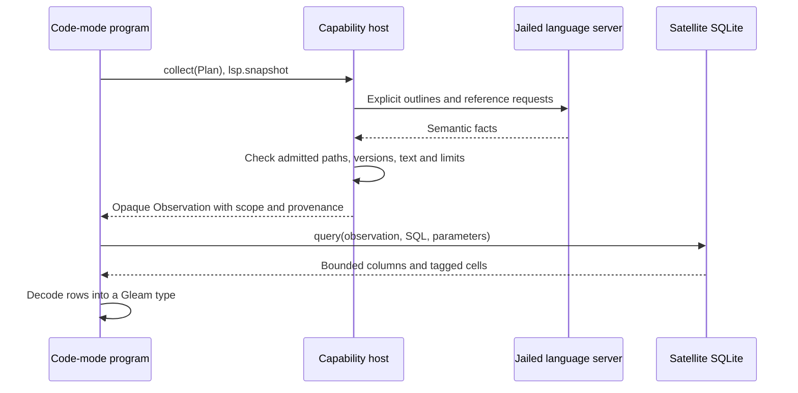

# SQL over LSP observations

**Status: implemented; final merge gates in progress.** This note describes the
API on `codex/lsp-sql`. Collection, routing, typed decoding and cancellation
tests pass, including the corrections from independent review. The complete
Gleam program below compiles unchanged with warnings treated as errors. Real
jailed Gleam and Go SQL tests pass with the normal offline seed resolved from
published `esqlite_loom` 0.9.1 and `sqlight_loom` 1.2.1. Full local package checks
and distribution builds pass. This is a reviewable contract, not an installed
daemon update or a release announcement.

## What this lets a program ask

We want a code-mode program to answer questions such as “which of these
functions have references in another file?” without returning every
intermediate LSP answer to the model. The program first collects facts for an
explicit set of files and symbols. It then uses SQLite joins and aggregates
to return the few rows its task needs.

The proposed public module is `cap/lsp_sql`. Collection uses the session's
existing jailed language server. SQL runs inside the jailed code-mode
satellite, over a fresh in-memory database. A SQL expression cannot issue an
LSP request, open another database, or edit a source file.



## Collect first, query afterward

The core signatures are:

```gleam
collect(Plan) -> Result(Observation, Error)
metadata(Observation) -> Metadata
query(Observation, String, List(Cell), RowDecoder(a))
  -> Result(QueryResult(a), QueryError)
```

`Plan` names one configured server and one project root. Its `outlines`
contains explicit file paths. Its `targets` contains reference seeds with a
symbol spelling, a required file path, and an optional one-based line.
Collection requires at least one outline or seed. It never searches the
workspace for a bare name or asks for references to every outlined symbol.

`Observation` is opaque. A caller can inspect its metadata and query its
facts, but cannot manufacture or mutate them. Several queries can reuse an
observation within the same program. Each query creates and closes its own
memory database; reuse makes no further language-server requests.

`QueryResult(a)` contains column names, `List(a)`, and observation metadata
outside the projected rows. A `SELECT name` cannot accidentally discard the
scope and provenance of the result.

## A complete program

Consider a small Gleam project with these files:

```gleam
// src/greeter.gleam.
pub fn greet() -> String {
  "hello"
}

pub fn unused() -> String {
  "unused"
}
```

```gleam
// src/app.gleam.
import greeter

pub fn main() -> Nil {
  let _greeting = greeter.greet()
  Nil
}
```

The following code-mode program requests references for those two functions.
It reports the number of returned references in other files. Adjust `server`
to the name under `[lsp.<name>]` in the active configuration; `root` must be
the root that owns the requested files.

```gleam
import cap/lsp_sql
import cap/report
import gleam/list
import gleam/option.{None}
import gleam/string

type ReferenceCount {
  ReferenceCount(name: String, external_references: Int)
}

pub fn main() -> report.Outcome {
  let plan = lsp_sql.Plan(
    server: "gleam",
    root: ".",
    outlines: ["src/greeter.gleam"],
    targets: [
      lsp_sql.Target("greet", "src/greeter.gleam", None),
      lsp_sql.Target("unused", "src/greeter.gleam", None),
    ],
  )

  case lsp_sql.collect(plan) {
    Error(error) -> report.failure(string.inspect(error))
    Ok(observation) -> summarize(observation)
  }
}

fn summarize(observation: lsp_sql.Observation) -> report.Outcome {
  let sql = "
    SELECT t.symbol, COUNT(r.path) AS external_references
    FROM targets AS t
    LEFT JOIN \"references\" AS r
      ON r.target_id = t.id AND r.path <> t.path
    WHERE t.symbol LIKE ?
    GROUP BY t.id, t.symbol
    ORDER BY external_references DESC, t.symbol
  "

  case lsp_sql.query(observation, sql, [lsp_sql.Text("%")], read_count) {
    Error(error) -> report.failure(string.inspect(error))
    Ok(answer) ->
      report.value(report.object([
        #("server", report.string(answer.observation.server)),
        #("root", report.string(answer.observation.root)),
        #("generation", report.string(answer.observation.generation)),
        #("started_ms", report.int(answer.observation.started_ms)),
        #("finished_ms", report.int(answer.observation.finished_ms)),
        #("withheld", report.int(answer.observation.withheld)),
        #("rows", report.list(list.map(answer.rows, render_count))),
      ]))
  }
}

fn read_count(cells: List(lsp_sql.Cell)) -> Result(ReferenceCount, String) {
  case cells {
    [lsp_sql.Text(name), lsp_sql.Integer(count)] ->
      Ok(ReferenceCount(name, count))
    _other -> Error("expected a text name and an integer reference count")
  }
}

fn render_count(row: ReferenceCount) -> report.Value {
  report.object([
    #("name", report.string(row.name)),
    #("external_references", report.int(row.external_references)),
  ])
}
```

The expected counts for this fixture are one for `greet` and zero for
`unused`, assuming the server reports this project's references and withholds
none. Real-server acceptance tests exercise the same collection and SQL path
with the normal published-package seed, including saved Gleam source and inline
Go source. The complete example above also compiles warning-free.

The decoder gives the returned rows their Gleam type. SQLite still parses SQL
at runtime. A projection with the wrong storage classes returns
`DecodeFailed(row, reason)` rather than pretending arbitrary SQL has a
compile-time result type. `Cell` distinguishes `Null`, `Integer`, `Real`, and
`Text`; neither parameter binding nor row decoding silently converts tags.

## The four tables

All paths are canonical admitted paths. Sites use one-based lines and
codepoint columns. `text` is the source line used to convert the server's
UTF-16 position. `anchor` uses the same hashline anchor as existing LSP
capability results.

| Table | Columns | Scope |
| --- | --- | --- |
| `documents` | `path`, `digest`, `version` | Files read to construct returned facts. |
| `symbols` | `id`, `parent_id`, `name`, `kind`, `detail`, `path`, `line`, `column`, `text`, `anchor` | Flat outlines for requested files only. |
| `targets` | `id`, `symbol`, `asked_path`, `asked_line`, `path`, `line`, `column`, `text`, `anchor` | Exactly the explicitly requested reference seeds. |
| `"references"` | `target_id`, `path`, `line`, `column`, `text`, `anchor` | Raw admitted reference locations for those targets. |

`symbols.id` and `symbols.parent_id` describe an outline hierarchy.
`references.target_id` joins to `targets.id`, not to `symbols.id`. An outline
does not imply that references were collected for its symbols. IDs are local
to one observation and cannot be joined across observations.

`documents.digest` is a SHA256 content address. `version` is the LSP client's
document version when the client held that exact text. A result file that was
read but not opened in the client has SQL `NULL` for its version. Optional
symbol details, parent IDs, and requested line numbers also use SQL `NULL`.

## More questions over the same observation

To find explicitly requested targets with no returned reference in another
file:

```sql
SELECT t.symbol, t.path, t.line
FROM targets AS t
WHERE NOT EXISTS (
  SELECT 1 FROM "references" AS r
  WHERE r.target_id = t.id AND r.path <> t.path
)
ORDER BY t.symbol;
```

That answer means “no admitted external reference was returned for this
requested target.” It does not prove that a function is dead code. The server
may omit references, a location may be withheld, or an unseen dependency may
have changed. Always retain the observation metadata when reporting absence.

To associate an outline with the exact document digest it was converted on:

```sql
SELECT s.name, s.kind, s.path, s.line, d.digest, d.version
FROM symbols AS s
JOIN documents AS d ON d.path = s.path
ORDER BY s.path, s.line, s.column;
```

Parameters belong in `List(Cell)`, with `?` placeholders in SQL. A value such
as a symbol spelling is data, even if it contains SQL punctuation. Table and
column names belong to the fixed schema; parameters cannot substitute them.
The `"references"` table is quoted because `REFERENCES` is an SQL keyword.

## What consistency means here

Collection checks the client incarnation, document revisions, analysis
activity, and retained failure state. It reads admitted texts and checks them
again before returning. A detected change, busy server, unsupported request,
malformed location, deadline, or exceeded limit refuses the whole observation.
No truncated set is returned as complete.

These checks cover the observed documents and client state during a finite
interval. Standard LSP has no transaction that freezes every project file.
A dependency that the request never observes can change without detection.
A reference file first discovered in an answer is checked from its read
through publication. Metadata therefore records an interval and document
evidence, not a project-wide revision or a semantic completeness certificate.

The metadata retains the configured server, canonical root, opaque client
generation, interval, answered outlines, requested targets, request count,
withheld count, and retained fact counts. The interval uses the host's
monotonic clock, not a calendar timestamp.

## Budgets and refusal

| Boundary | Fixed maximum |
| --- | --- |
| Capture admissions | Four per code-mode invocation. |
| Explicit capture scope | Sixteen outline files and thirty-two reference seeds under one server/root. |
| Collection | 128 semantic requests, 10,000 fact rows, 4 MiB of retained text/facts, and 75 seconds, narrowed by the invocation deadline. |
| SQL input | 16 KiB SQL and sixty-four parameters. |
| SQL execution | Two seconds and one million progress-counted operations per statement. |
| SQL output | Thirty-two columns, five hundred rows, and 1 MiB of output. |
| SQLite heap | A process-global, lower-only ceiling of 32 MiB inside the satellite. |

Materializing the trusted tables and running the Gleam decoder remain under
the enclosing invocation's resource and wall limits. The SQL execution limit
does not mean the entire public `query` call finishes within two seconds.
No API lets a program raise these ceilings.

Known collection failures have named variants such as `Changed`,
`LimitExceeded`, `DeadlineExceeded`, and `CaptureCeilingReached`. SQL errors
distinguish read-only denial, multiple statements, invalid input, resource
limits, cancellation, unsupported values, and row decoding. Unknown host or
native codes remain available through a fallback carrying the original code
and message. An empty successful answer differs from a refused collection.

## Ownership and SQL enforcement

The capture worker belongs to its invocation. Program cancellation, host
death, wall expiry, or resident-invocation release cancels that worker through
weft. The LSP client withdraws pending request IDs when their owner dies and
sends `$/cancelRequest`. The shared language-server lease remains available
to another caller. Cancellation cannot guarantee that a third-party server
honors the notification; it prevents later collection requests and local
publication of a late reply.

The native query boundary installs SQLite's authorizer before preparing
model SQL and keeps it installed through execution and finalization. Only
reads of the fixed fact tables and a small pure-function allowlist are
accepted. Writes, schema inspection, pragmas, attachments, virtual tables,
extensions, recursive SQL, and additional statements are refused. Temporary
storage stays in memory. Every privately owned statement is finalized before
the connection closes.

The existing SQLite binding is extended because a Gleam-only query wrapper
cannot install these native controls. We keep one SQLite implementation in
the dependency graph. Published `esqlite_loom` 0.9.1 and `sqlight_loom` 1.2.1
carry native builder metadata that stock Gleam understands. The resolved normal
seed builds and archives successfully. Its known in-seed Rebar plugin link is
materialized before relocation; the native-library bytes remain part of the
satellite artifact fingerprint.

## Where to read the implementation

- [Public API](../../packages/cap/src/cap/lsp_sql.gleam): plans, opaque
  observations, typed cells, row decoding, and errors.
- [Observation contract](../../packages/lsp/src/lsp/observation.gleam): the
  collector's request, facts, counts, and separate door.
- [Manager](../../packages/client/src/client/lsp/manager.gleam): admission,
  bounded collection, source checks, and server ownership.
- [Capability router](../../packages/codemode/src/codemode/observation.gleam):
  capture admission and the complete wire answer.
- [Satellite host](../../packages/codemode/src/codemode/satellite.gleam):
  scoped service custody in both host shapes.

The [protocol proposal](../../protocol-change/062-lsp-sql-observations.md),
[architecture page](../architecture/lsp-sql.md), [usage guide](../lsp-sql.md)
and [review record](../review/lsp-sql.md) accompany this readable design account.
Final distribution verification remains separate from the working implementation.

## Semantic access through code mode

The default registry exposes semantic operations through code mode rather
than seven top-level LSP tools. Use `cap/lsp` for definitions, references,
hover, outlines, calls, diagnostics and rename; use `cap/lsp_sql` for explicit
collection followed by joins and aggregates. Automatic post-edit diagnostics
remain on ordinary write tools. Rename preview and apply remain separate
programs with a model judgment step between them.

The system prompt prefers the modules when offered. Read `cap://lsp` for its
API and the served language profiles' naming hints, and `cap://lsp_sql` for
the observation/query API. Module discovery follows the same offered-seam
allowlists as vetting, so an unavailable server is not advertised as usable.
