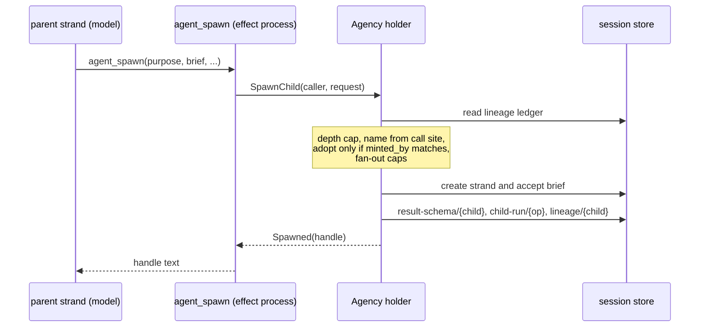
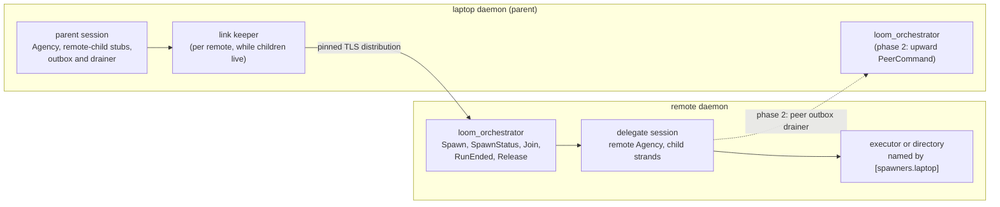
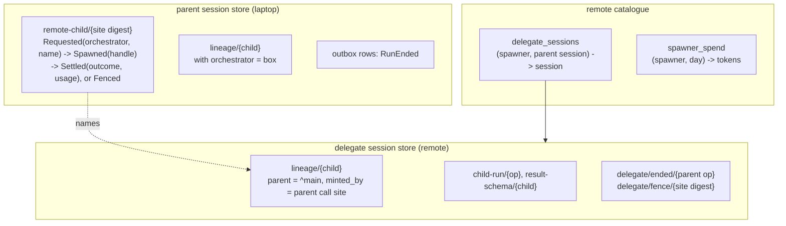
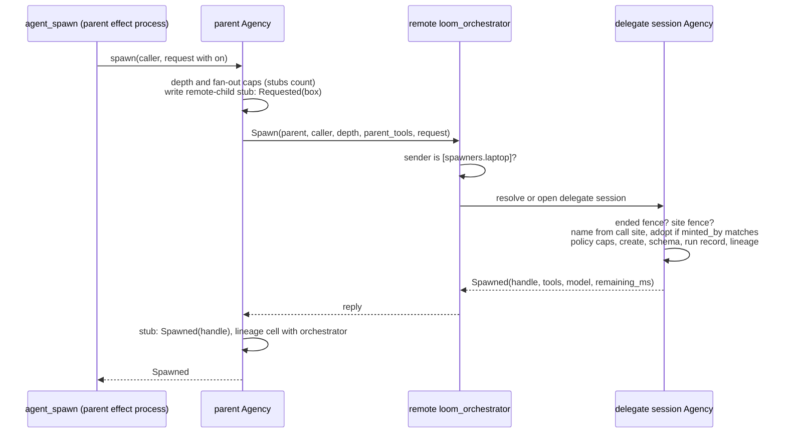
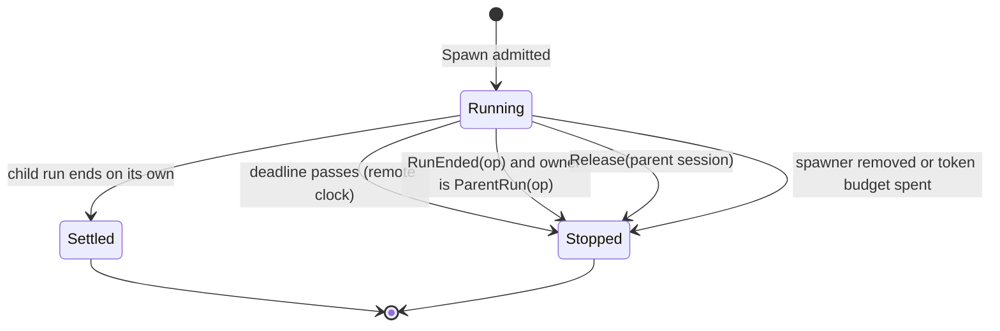

# Subagents on another orchestrator

Status: **direction ruled by the owner, 2026-10-09. Design only; nothing
here is built.** The wire and durable formats it would add are drafted in
[protocol-change/082](../../protocol-change/082-remote-subagents.md). It
builds on the distributed runtime of PR #923
([the design note](distributed-runtime.md),
[the architecture page](../architecture/distributed.md),
[protocol-change/078](../../protocol-change/078-distributed-runtime.md)) and
is meant to work with and without the Khepri directory of PR #934
(protocol-change/081).

## 1. The question

The owner asked whether an orchestrator on a laptop could start and direct
subagents on a remote orchestrator, "basically via TLS distribution". Today
it cannot. PR #923 gives a session remote hands (an executor runs its tool
calls), lets sessions on two orchestrators exchange peer mail, and lets an
owner move a session from one orchestrator to another. A subagent is none of
these.

`agent_spawn`, and `strand.spawn` in code mode, create a strand inside the
caller's own session, and the session's Agency (`client/agency`) owns
everything about it: the lineage cell that records who spawned whom
(`runtime/lineage`), the per-run record that carries its deadline and its
stop reason (`runtime/child_run`), the join, the result contract, the rule
that a strand addresses only its parent or a descendant, the depth and
fan-out caps, and reaping when the parent's run ends or the deadline passes.
All of it reads and writes one session store on one machine. And the model
cannot create a session anywhere, because `sessions.create` and `peers.link`
are owner control commands.

This note gives a model a child that runs on another orchestrator, keeps the
local semantics wherever the network allows, and carries the work over the
same pinned TLS distribution that #923's orchestrators already share.

## 2. The decisions in brief

These follow the owner's rulings of 2026-10-09 (section 17).

1. **The transport is TLS distribution.** Spawn, status, join, run end and
   release are new messages on the orchestrator port
   (`remote/orchestrator_port`), beside `PeerCommand`, `Import` and
   `Activate`. Delivery that must outlive a failure reuses peer mail's
   machinery: the outbox, the drainer, `Endpoint`, and the split between
   `Unreachable` and `Refused`.
2. **The trust model is #923's.** A pinned distribution peer is fully trusted
   and can call any function on the remote. The remote's spawn policy bounds
   an honest peer and a misbehaving model; it is not a security boundary
   against a compromised peer (section 5).
3. **The spawn policy lives in the remote's `loom.toml`,** in a
   `[spawners.<name>]` table that names the spawning node and its placement,
   profile, tool ceiling, caps, deadlines and budget. It is a separate table
   from `[orchestrators.<name>]`, because under #934 every orchestrator a
   member daemon lists must itself be a Khepri member (section 9).
4. **A remote child is a strand in a delegate session.** The remote creates
   one delegate session per (spawner, parent session) on the first spawn,
   owned by the remote owner, and its own Agency mints and judges every child
   in it. The parent is not a strand there; it appears as a reserved
   reference.
5. **The model's surface is `agent_spawn` with `on`,** offered only in
   sessions the laptop owner holds alone. `agent_wait`, `agent_roster`,
   `result_schema` and `detach` work on a remote child as on a local one.
6. **Idempotency comes from the call site, on the remote.** The remote's
   Agency derives the child's name from the parent's call site and adopts on
   a name match only when the lineage cell says that call site minted it. A
   write-ahead stub on the parent routes every retry to the same remote.
7. **Every remote child has a finite deadline on the remote's clock.**
   Reaping at the parent's run end, on release of a deleted parent session,
   and when the spawner is removed from the configuration are faster paths on
   top of it.
8. **The remote's provider keys pay.** Usage comes back with each settled
   child and counts against the parent goal's token budget.
9. **Approvals.** Phase 1 has none; a remote child's refused call settles in
   band. In phase 3 the parent's operator may approve, within a ceiling the
   remote owner sets in the spawn policy.

## 3. What a local subagent is today

A local spawn runs entirely inside the parent session's Agency holder, which
serializes child admission:



Four properties carry over to the remote design and decide most of it.

- **The name is derived, never chosen.** `agency.child_name` builds
  `sub:{parent}/{slug}-{digest}` from the caller's strand, the purpose and a
  digest of the call's durable coordinates (operation, minting step, source
  index). A replay derives the same name.
- **The ledger, not the name, proves ownership.** `adopt` hands an existing
  child back only when its cell's `minted_by` equals the caller's call site.
- **A run record owns cancellation.** `child_run.Run.owner` is
  `ParentRun(op)` for an attached child, and `reap_run(op)` at the parent's
  run end stops every child whose current run that operation owns. A
  deadline in the same record is checked by `reap_overdue` before each wait.
- **A send upward never wakes a finished parent.** `send` refuses an upward
  message to an idle parent with `ParentRunEnded`, because a fresh run with
  no human present is what auto-enqueued child results were rejected over.

## 4. Transport: the orchestrator port

### The messages

The orchestrator port is the one process per daemon, registered as
`loom_orchestrator`, that answers other orchestrators. It already serves
`Owns`, `PeerCommand` and the three move messages. Five constructors join
them in phase 1:

| Message | Answers | Runs |
|---|---|---|
| `Spawn(parent, caller, depth, parent_tools, request, reply)` | the child's handle, or a refusal | in a task, since the first spawn opens the delegate session |
| `SpawnStatus(parent, caller, reply)` | the child the call site made, or `Fenced` | in the port's turn |
| `Join(parent, handles, within_ms, reply)` | one `Ready` or `Pending` per handle | in a task, for up to 25 s |
| `RunEnded(parent, operation, reply)` | how many children it stopped | in the port's turn |
| `Release(parent_session, reply)` | released or releasing | in the port's turn |

`parent` is `{session, strand}` on the spawning orchestrator. Every value is
plain data and a reply subject, as on the rest of the port: no closure, port
or atom built from a peer's input. A spawn or a join can take seconds, so each
runs in a task linked to the port and cancelled with the requester, as
`Activate` already does, and an `Owns` question is never kept waiting behind
one. A daemon that accepts no spawns starts the port without a spawn host and
refuses all five, as a daemon that receives no sessions refuses `Import`.

The port forwards each message to the delegate session's Agency holder,
which serializes spawn admission, the status fence and the run-end fence in
one mailbox. Unlike a peer-mail delivery, which is refused when its recipient
is not running, these messages may open the delegate session: it exists only
to serve its spawner, and a join on a settled child must be able to read the
child's result after the session was closed.

### The sending end and its failures

The sending end is modelled on `remote_peer`. A call connects to the pinned
peer if it is not connected, sends the message to the remote's
`loom_orchestrator`, and waits under a deadline. The answer is one of the two
failures `peer_mail.Failure` already separates:

- **`Refused(reason)`** is a definitive answer: the remote looked and said
  no. The model reads it as an ordinary in-band refusal.
- **`Unreachable`** means nobody answered: `noconnection`, `noproc` (no port
  registered, for instance during the remote's boot), or the deadline passing.
  The remote may have acted and lost the reply. What happens next depends on
  the message (section 8).

A reply that arrives after the deadline reaches nobody, as in peer mail. Every
message is idempotent on the remote, so the next attempt gets the stored
answer.

### Who dials whom

The laptop dials. A laptop behind NAT has no address the remote can reach,
and #923 already has orchestrators dial their peers on demand with no
connection at startup. Once the laptop has connected, the connection carries
traffic both ways, as an executor's owner callbacks travel back over the
connection its orchestrator made. So the remote can answer, and in phase 2
deliver upward messages, whenever the laptop is connected; when it is not, a
send from the remote is `Unreachable` and waits in an outbox.

While a parent session holds a live remote child, a keeper on the laptop
holds the connection to that remote, reconnecting every two seconds when it
drops, as #934's link keeper does for directory members. The keeper is a weft
state machine per remote orchestrator, started by the first live stub and
stopped when none is left.



## 5. The trust model

This section states plainly what the design assumes, because the spawn
policy looks like an access control and is not one.

**A pinned distribution peer is fully trusted.** This is #923's assumption,
unchanged: a connected node has the full privileges of an Erlang peer and can
spawn processes and call any function on the other node. The closed message
vocabularies, the orchestrator port's included, keep each port to its job and
are not a security boundary. Under #923 the verify function also does not tie
a connection to the node name it claims, so among pinned peers a message's
claimed origin is not proven by the connection. Making a laptop a spawner
means making it a pinned peer of the remote, with all of that.

**What the spawn policy is for.** The caps, deadlines, budget, placement and
tool ceiling in `[spawners.<name>]` are enforced by the remote for a peer
that sends the orchestrator port's messages and nothing else. They bound a
model that spawns too much or for too long, a bug in the laptop's daemon, and
an operator's misconfiguration. They do not bound an attacker who controls
the laptop's VM, because that attacker does not have to send the messages the
policy checks.

| Threat | Bounded by the spawn policy? |
|---|---|
| A model on the laptop starts more children, longer runs or more spend than intended | Yes: `max_live`, `max_per_day`, `max_within_s` and the token budget, counted on the remote |
| A brief carries a prompt injection aimed at the remote child | As for a local child: the tool ceiling and the workspace's sandbox policy bound what the child can do |
| A bug in the laptop's daemon sends malformed, repeated or excessive requests | Yes: the closed vocabulary, idempotent handling and the caps |
| A laptop daemon from another release sends a message the remote cannot match | No new protection: as on the rest of the port, both ends are upgraded together |
| An attacker runs code in the laptop's VM | **No.** The attacker can call any function on the remote: read and prompt every session, use its provider keys, reach its executors, and through #934 change session ownership if the laptop is a member |
| An attacker copies the laptop's bundle (private key and cookie) | **No.** The copy can join as the laptop. The operator removes the laptop's pin from `[[distribution.peers]]` on every node and restarts them |

So a laptop should be made a spawner only when its owner would also make it
an orchestrator of the deployment, because that is the privilege it gets.
Protocol-change/082 records the stronger alternative that was considered and
rejected: the laptop as a client of the remote's control endpoint with a
scoped principal, where the remote's checks would bind even a compromised
laptop.

**What the remote child itself may do** is a separate question, and there
the usual boundaries hold. The child is a strand of the remote harness: its
tools pass the broker and its effects run in the remote's jail or on the
remote's executor, exactly as for any session there.

## 6. The model's surface

### `agent_spawn` with `on`

`agent_spawn` gains one optional argument, `on`, naming a remote
orchestrator. The names are the laptop's `[orchestrators.<name>]` keys whose
row sets `subagents = true`, and the tool schema lists them as an enum, the
way it lists `model` names. With `on` absent the spawn is local and nothing
changes. `on` is offered only in sessions the laptop owner holds alone, using
the predicate default peer links already use (`manager.unshared_sessions`),
so inviting a member into a session withdraws it.

```json
{"purpose": "run the integration suite",
 "brief": "Run make e2e on the box and report failures.",
 "on": "box",
 "within_ms": 1800000,
 "result_schema": {"type": "object",
                   "properties": {"failed": {"type": "array"}},
                   "required": ["failed"]}}
```

A new tool was considered and rejected. A remote child is waited on, listed
and reaped with the same tools, and a separate tool would make the model
learn a second vocabulary for the same act. `strand.spawn` in code mode gains
the same field through a `with_on` builder on the assignment, in phase 2; the
per-execution spawn ceiling (32) counts remote spawns too.

### What each argument means for a remote child

| Argument | Remote behavior |
|---|---|
| `purpose`, `brief` | As local. The brief is framed with `frame_brief` on the remote. |
| `within_ms` | Absent means the policy's `default_within_s` (30 min by default). A value above `max_within_s` (4 h by default) is refused, not clamped. Converted to an absolute deadline on the remote's clock. |
| `tools` | Narrowed three times: by the request, by the parent's own active tool names, and by the policy's ceiling. `agent_spawn` is removed unless the policy's depth allows it. The communication floor (`agent_note`, `agent_send`) is kept when the ceiling holds it. |
| `model` | A catalogue name on the remote, validated there. Absent means the policy profile's subagent route. |
| `result_schema` | Parsed on the parent (a malformed schema is the parent's mistake, told in its own turn), enforced on the child's `agent_note` on the remote, and decoded again on the parent when a result comes back. |
| `context` | `"mine"` is refused with `on`. Copying the parent's conversation would ship the transcript to another machine. |
| `detach` | As local: the child survives the parent's run end. It is still bounded by its deadline and by release. |

### The handle

A remote handle names its orchestrator, so `agent_wait` can route it:
`sub:^main/run-the-integration-suite-7b1c0a4e2d95f318#op_01J…@box`. The
orchestrator is the suffix after the last `@` that follows the last `#`;
neither an operation id nor a minted slug contains `@`. The spelling is
provisional. `^main` is explained in section 7.

### The other tools

- **`agent_wait`** takes local and remote handles in one call and waits for
  all of them against one deadline, as today. Remote handles are asked of
  their orchestrator with one `Join` per orchestrator, run beside the local
  poll inside the same budget. An `Unreachable` join leaves that
  orchestrator's handles `Pending`, with a sentence saying it did not answer.
- **`agent_roster`** lists remote children from the parent's stubs: the
  name, the orchestrator, the handle, and the state last observed (spawning,
  running, settled, or unknown when the remote has not answered).
- **`agent_send`** downward to a remote child, and a remote child's
  `agent_send` upward, are refused in phase 1 with a sentence that tells the
  child to report through its final answer, its notes or its result. Phase 2
  adds both directions (section 8.6).
- **`agent_notes`** reads the parent session's blackboard, as today. A
  settled remote child's notes arrive with its `Ready` result; reading a
  running remote child's notes is phase 2.
- **`todo`** stays local.

## 7. The remote child: a strand in a delegate session

### Three shapes considered

**A strand in an existing session on the remote.** Rejected. The remote's
sessions belong to its owner and its members; a child there would be visible
to them and would share their lineage namespace.

**One new session per child.** Each child would need its own session store,
runtime and, for an executor-backed workspace, its own executor scope, and an
executor admits at most 16 scopes that are not cleanly closed. A fan-out of
eight children would take half an executor. Lineage, the caps and reaping
would also have to be rebuilt across sessions.

**One delegate session per (spawner, parent session), with each child a
strand in it.** Chosen. Children of one parent share one workspace and one
executor scope, which is what local children do: they share the parent's
checkout. And the remote's Agency already implements naming, adoption, caps,
the result contract, the wait and reaping over strands in one session, so the
remote side is the local code with a different caller.

### The delegate session

The remote creates the delegate session on the first `Spawn` for a parent
session, keyed by (spawner name, parent session id) in a new catalogue table,
and answers every later message for that parent session from the same row.
The spawner name is the remote's `[spawners.<name>]` key for the sending
node. It is an ordinary session of the remote daemon in every respect not
listed here:

- **Owner.** The remote owner. It appears in the owner's session list,
  labelled with the spawner and the parent session's id, and the owner can
  open it, read it and abort its strands.
- **Workspace.** The policy's placement: a registered workspace on an
  executor, a pool, or a directory on the remote. The laptop never names a
  path or an executor. The memory domain is `session_only`.
- **Configuration.** The policy's profile (`[profiles.<name>]`,
  protocol-change/076) seeds the session, so the remote's catalogue, roles and
  pricing apply.
- **Identity of the parent.** The parent strand is not a strand of the
  delegate session. Its children's lineage cells name it as a reserved
  reference, `^{parent strand}` (so `^main`), and `create_strand` gains a
  check that refuses a name of that form, so the reference can never name a
  real strand. The addressing walk (`lineage.is_descendant`) needs no change:
  it compares names, and every child's chain ends at the reference, which has
  no cell.
- **Attribution.** A brief carries `PeerOrigin(parent session, parent
  strand)`, the existing origin for a model in another session whose identity
  the host binds.
- **What it refuses.** Moving it (`sessions.move` answers `not_movable`),
  inviting members to it, and peer links to or from it other than the ones
  section 8.6 writes.

### What the remote's Agency does differently

The spawn path is `spawn_on` with three changes, selected by a caller that
arrives from the port rather than from `Ctx`:

1. **Depth** is the depth the parent reports, checked against the policy's
   `max_depth`, instead of a parent cell, because the parent has no cell on
   the remote.
2. **The base configuration** is the policy profile's, narrowed to the tool
   set above, instead of the parent strand's configuration, which the remote
   does not have.
3. **Admission refuses a spawn under an ended parent run.** Before it mints,
   the holder checks for a `delegate/ended/{op}` fence for the call site's
   operation (section 8.3).

The caller's coordinates are the parent's own: strand `^main`, and the
operation, step, source index and minter of the parent's planned call. So
`child_name` and `adopt` run unchanged, and a resent spawn from the same call
site adopts the child it already created.

## 8. The protocol

### 8.1 Records on each side



On the parent, the `remote-child/{site digest}` fact is the write-ahead
stub. It is reserved (no model tool can read or write it) and records the
orchestrator before any message is sent, so every retry of that call site
goes to the same remote and a remote failure never becomes a local spawn. The
parent's lineage cell gains an optional `orchestrator` and is written once the
spawn is answered, so addressing, the roster and the fan-out count see the
remote child as the caller's descendant. A cell that predates the field
decodes as local.

On the remote, the delegate session holds the real lineage cell, run record
and result schema, written by the same `reconcile` path as a local child,
plus two kinds of fence described below. The remote catalogue keeps the
delegate session map and the spawner's daily spend; the policy itself is
configuration.

### 8.2 Spawn



The parent's spawn is `ReplaySafe` and stays so. The spawn call waits up to
30 seconds for each attempt, because the first spawn for a parent session
opens the delegate session, which on an executor placement includes an
attach.

- **`Refused`** settles the spawn with the refusal, and the stub is removed.
  Nothing was created.
- **`Unreachable`** is resent with a doubling pause from 50 ms to 2 s, as
  `surface.run` resends a `Run`, until the remote answers or the spawn's
  window of 30 seconds runs out. A resend derives the same name, finds its own
  cell, checks `minted_by` and answers the same handle. When the window runs
  out, the tool answers that the remote did not answer and the child may
  exist, and the stub stays `Requested`. A spawn is never retried against
  another orchestrator.

A `Requested` stub is settled by a `SpawnStatus` row in the parent session's
outbox (section 8.4). On the remote, `SpawnStatus` either returns the child
that exists or, when none does, writes `delegate/fence/{site digest}` in the
same holder turn and answers `Fenced`; a later `Spawn` for that site finds the
fence and is refused. This is the executor ledger's `QueryOrFence` applied to
spawns, and it is needed for the same reason: a `Spawn` sent by an effect
process that was then killed and a `SpawnStatus` sent by a later process are
two senders, Erlang orders messages only per sender pair, and so the status
can overtake the spawn. Both are decided in the delegate session's Agency
holder, so whichever arrives first decides and the other agrees with it.

### 8.3 Reaping

A remote child is stopped by one of four things. The first holds on the
remote alone; the other three are messages from the laptop or the remote's
own configuration.



- **Deadline.** Every remote child has a finite deadline on the remote's
  clock, capped by the policy. The remote's Agency checks it as
  `reap_overdue` does today, and the delegate session also arms a timer for
  its earliest deadline, so a child with nobody waiting on it is still
  stopped on time. This bound holds if the laptop never returns.
- **Parent run end.** The parent's run-end hook already spawns `reap_run(op)`
  off the driver. For each remote stub whose run that operation owns, it also
  writes a `RunEnded(op)` row to the parent session's outbox, and the drainer
  sends it (section 8.4). On the remote, the holder writes
  `delegate/ended/{op}`, then calls the existing `reap_run(op)`, which stops
  every child whose current run is owned by `ParentRun(op)`; that operation id
  is the parent's, because the child's `minted_by.operation` is. The fence is
  what makes a parent run aborted in the middle of a spawn safe: if `RunEnded`
  overtakes the `Spawn`, the spawn finds the fence and is refused instead of
  creating a child nobody will reap.
- **Release.** Deleting the parent session writes a release row per remote
  orchestrator into the laptop's catalogue, in the registry turn that deletes
  the session, since the session's store is about to go. A daemon-level
  drainer sends `Release(parent session)` until the remote answers. The
  remote stops every child of that delegate session, detached ones included,
  marks the row `released` and deletes the session once its cleanup is
  proven.
- **Removal and spend.** At boot the remote releases every delegate session
  whose spawner no longer has a `[spawners.<name>]` table, which is how the
  remote owner ends a spawner's work. A spawner reaching its token budget
  stops the affected children.

`child_run.Stop` gains `Released`, `SpawnerRemoved` and `TokenBudgetSpent`,
and the model-facing `Outcome` gains the matching variants, so a wait explains
why a child stopped.

### 8.4 The outbox and the drainer

Messages from the laptop can find the remote unreachable, and the laptop can
crash between a durable write and the message it implies. Peer mail already
solves this for messages: a durable row is written before the first attempt,
an `Unreachable` attempt leaves it pending, and a weft state machine per
resident session, `peer_outbox_drain`, retries pending rows every five
seconds. The parent's remote-child messages use the same outbox and the same
drainer, with two new row kinds:

| Row | Written | Sent as | Settled by |
|---|---|---|---|
| `SpawnStatus(site)` | when a spawn's window runs out with no answer | `SpawnStatus` | `Spawned`, which writes the handle and lineage cell, or `Fenced`, which removes the stub |
| `RunEnded(op)` | at the run end, once per remote orchestrator with a stub owned by `op` | `RunEnded` | any answer from the remote |

Every message is idempotent on the remote (a repeated `RunEnded` stops
nothing more; a repeated `SpawnStatus` returns the stored answer), so the
drainer's retries need no receipt of their own. A `Refused` answer settles the
row with the refusal recorded, as peer mail settles a refused message. Unlike
a peer-mail row, a remote-child row is not refused after an hour: it is
retried until the remote answers, because the child it concerns is bounded by
its deadline and the row costs one bounded call every five seconds.

A crash can also land between a run's end and the run-end hook writing its
row. So when a parent session opens, it writes a `RunEnded` row for each live
stub whose owning operation has a terminal result and no row yet. Release
rows live in the laptop's catalogue, because they outlive the parent session's
store, and a daemon-level drainer of the same shape sends them.

### 8.5 Waiting

The parent waits with `Join`, a call the remote answers when every handle has
settled or the window ends: the remote runs its own Agency's `wait` for the
parent reference, which checks that every handle is a descendant of
`^{strand}`. The window is at most the parent's remaining budget and at most
25 seconds, under `agent_wait`'s 30-second ceiling. A `Ready` answer carries
the outcome, the final report, the notes, the judged result and the child's
usage. Waiting twice on the same handle gets the same answer twice, as
locally: a wait is a read. A join that is `Unreachable` is not queued; the
handles are reported `Pending` and the model may wait again.

### 8.6 Messaging (phase 2)

**Downward.** A new constructor, `ChildSend(parent, child, message_id, text,
within_ms)`, delivers into the child through the remote Agency's `send`, so a
send to an idle child starts a run owned by the parent's operation as locally.
The message id is derived from the parent's call site, and the remote stores a
receipt under it, so a resend answers the receipt instead of delivering twice:
peer mail's receipt rule, reused. An `Unreachable` send is queued in the
parent's outbox and drained like a peer-mail row.

**Upward.** A remote child's `agent_send` to `^main` becomes peer mail from
the delegate session to the parent session, unchanged in mechanism. At spawn
the parent's Agency writes a peer grant for the pair (child strand of the
delegate session to the parent strand) with `may_wake = false`. The child's
send then goes through `peers.send` on the remote: an outbox row first, then
`PeerCommand(parent session, Deliver(...))` to the laptop's
`loom_orchestrator` over an `Endpoint` built from the delegate session's
recorded spawner node (`remote_peer.at`), not from a directory lookup. The
parent's Agency admits it with `peer_mail.deliver`: exactly once by message
id, and, because the grant does not allow waking, only as a steer into an open
run.

When the laptop is connected, this is the local guarantee: a parent strand
that has gone idle refuses, and the child reads `Refused` in its own turn.
When it is not, `peers.send` returns `queued`, the remote's drainer retries,
and a delivery that later finds the parent idle is refused and recorded on the
child's outbox row, where the child can read it with `peer.sent_receipt` but
is not told in its turn. That is the weaker guarantee the owner accepted for
phase 2. Phase 1 refuses upward sends entirely.

### 8.7 Depth and fan-out across machines

Caps are counted on both sides, and each side counts what it can see.

- **On the parent**, `check_capacity` counts remote stubs as live children of
  their parent strand, against the same `fan_out` and `session_strands`, until
  a settlement or a stop is observed. A stub whose remote has not answered
  stays counted, which errs toward refusing a spawn.
- **On the remote**, the policy caps live children across all of the
  spawner's delegate sessions, spawns per rolling day, and delegate sessions.
  Each delegate session on an executor holds one scope, so `max_sessions` must
  sit under the executor's 16.
- **Depth** is carried in the request and checked against `max_depth`. With
  the shipped `depth_cap: 1`, only a strand a human talks to spawns, and a
  remote child's tool set has no `agent_spawn`, so phase 1 has no
  grandchildren anywhere.

## 9. The spawn policy

### Where it lives

The remote's policy for one spawning orchestrator is a `[spawners.<name>]`
table in the remote's `loom.toml`:

```toml
[spawners.laptop]
node = "laptop@100.64.0.5"        # one of [[distribution.peers]]
executor = "box"                  # or pool = "linux", or directory = "/srv/loom/scratch"
workspace = "loom"                # with executor or pool: a registered workspace
profile = "cheap-review"          # a [profiles.<name>] key
tools = ["fs_read", "fs_write", "fs_edit", "grep", "bash", "code_mode",
         "agent_note", "agent_send"]
max_depth = 1
max_live = 8
max_per_day = 200
max_sessions = 4
max_within_s = 14400              # 4 h
default_within_s = 1800           # 30 min
token_budget_per_day = 5000000
child_token_budget = 1000000      # optional
retain_s = 604800                 # 7 days
# approval_ceiling = { ... }      # phase 3
```

The laptop lists the remote as an orchestrator and opts it in:

```toml
[orchestrators.box]
node = "box@100.64.0.9"
subagents = true
```

**Configuration rather than the catalogue.** A spawner is a distribution
peer, and peers, executors, pools and orchestrators are already configured in
`loom.toml`, read once at startup and validated by the daemon's strict
decoders. The policy names a profile, an executor or pool and a workspace, all
of which are configuration and can be checked against each other at boot. A
catalogue grant would buy runtime changes and a revocation command, but under
distribution revocation means removing a pin and restarting anyway, so it
would buy little. The catalogue keeps only what changes at runtime: the
delegate session map and each spawner's spend.

**A separate table rather than `[orchestrators.<laptop>.spawn]`.** Under
#934, every `[orchestrators.<name>]` node of a Khepri member daemon must
itself be a member. Listing the laptop there would make it a member of the
store that decides session ownership, with a replica and, for an odd count, a
vote, on a machine that sleeps and roams. `[orchestrators]` also means whom
this daemon asks about sessions and to whom it may move them, neither of which
a spawner needs. `[spawners.<name>]` requires only that its node be a pinned
`[[distribution.peers]]` node, so a laptop can be a spawner of a member daemon
without joining the store. Without #934 the two tables could have been one;
the separate table costs one name and keeps the rule the same in both
deployments.

The decoder refuses a `[spawners]` table whose node is not a distribution
peer, whose placement does not resolve, whose profile is unknown, whose
`max_sessions` exceeds an executor placement's scope capacity, or whose
`default_within_s` exceeds `max_within_s`. `docs/configuration.md` gains the
table when it is built.

### What a remote child may do

| | Remote child |
|---|---|
| Tools | The policy's ceiling, narrowed by the parent's own set and the request. The default ceiling excludes `agent_spawn` (unless depth allows), the peer tools, `schedule_*`, `remember` and skill installation, because each reaches state beyond the delegate session. |
| Workspace and executor | The policy's placement only. Executor-backed placement uses the existing pools and placement rules. |
| Sandbox | The workspace's base policy on the remote. No standing grant from the laptop crosses. |
| Secrets | `[tools] env` resolved on the remote and its executor, as for any remote session. |
| Approvals | Phase 1: none. A refused call parks only when someone is attached to the session (`client/gateway.attached`), nobody is attached to a delegate session, and so the refusal settles in band. The remote owner can attach and approve. Phase 3 adds the parent's operator (section 11). |
| Memory, schedules, peers | None beyond the upward grant of section 8.6. The delegate session's domain is `session_only`, and its owner tools are not in the ceiling. |

## 10. Budgets and credentials

The remote's provider keys pay for remote children. Keys never travel, and
the delegate session's profile resolves its models from the remote's
catalogue.

**Enforcement is on the remote, for an honest peer.** The policy carries a
token budget per rolling day and an optional per-child ceiling. The delegate
session's usage hook (`effects.Hooks.usage`, which is called with each usage
row the session records) adds each row's tokens to the spawner's spend in the
remote catalogue, and when a row passes a budget the hook stops the affected
children with `TokenBudgetSpent`. Spawn admission refuses while the daily
budget is spent. Because the check runs per provider request, a child can
overshoot by at most one request.

**Reporting is per child.** A `Ready` answer carries the child's usage: the
four token buckets and the cost, priced once by the remote's gateway as every
usage row is. The parent records it on the child's stub and never reprices
it. The parent's provider usage ledger records only requests the laptop made,
so remote spend is shown beside it, labelled with the orchestrator, in the
terminal's status bar and the web view. Remote tokens count against a parent
goal's token budget, so a goal cannot escape its budget by delegating.

**Clocks never cross as instants.** `within_ms` crosses as a duration and the
remote builds the deadline on its own clock; a reply reports the remaining
time, and the parent rebuilds a display deadline on its own clock, as
escalations already do between orchestrator and executor.

## 11. Approvals and the human

**Phase 1.** Escalations stay on the remote and settle in band unless the
remote owner is attached to the delegate session. The child reads the refusal
and works around it, as it would locally with nobody watching.

**Phase 3: the parent's operator.** The spawn policy may set an
`approval_ceiling`: the grants the parent's operator may approve for that
spawner's children (for example, network to a listed host, or write access
under the workspace root). With a ceiling set, the delegate session counts as
attached while its spawner's link keeper is connected, so a refused call
parks. The remote tells the laptop of the pending escalation with a new
message to the laptop's `loom_orchestrator`, `ChildEscalation(parent, child,
escalation)`, sent from an outbox on the delegate session while the laptop is
connected. The laptop shows it in the parent session's terminal and web view,
and the operator's answer goes back as `Resolve(parent, escalation, decision,
expected_seq)`. The remote admits an approval only when every grant in it is
inside the ceiling; anything wider stays pending for the remote owner. Like
the rest of the policy, the ceiling binds an honest laptop, not a compromised
one.

**Display.** The laptop's terminal and web view show a remote child in the
parent's agent strip and roster with its orchestrator
(`run-the-integration-suite @ box`), its last observed state, its deadline and
its usage. They do not show its transcript in phases 1 to 3: the transcript is
in the delegate session on the remote. The remote owner sees delegate sessions
in their own session list, grouped under the spawner's name, and can open one
like any session.

## 12. Failure behavior

"Unknown" below means the model is told the remote did not answer and the
child may exist; the roster shows the stub as unknown until the outbox settles
it.

| Failure | What the system does | What is seen |
|---|---|---|
| Link cut during `Spawn` (`noconnection`) | `Unreachable`: the spawn is resent with a doubling pause for up to 30 s. The remote adopts on the call site, so a spawn that landed is answered with the same handle. | Within the window, an ordinary spawn. After it, unknown; the outbox's `SpawnStatus` later settles the stub as spawned or fenced. |
| Spawn refused | `Refused(reason)`: definitive. The stub is removed. | The refusal, naming the cap or rule. |
| Link cut during `Join` | `Unreachable`; the join is not queued. | Handles of that remote are `Pending` with "the remote did not answer". |
| Link cut with a `RunEnded` or `Release` pending | The row stays in the outbox and the drainer retries every 5 s until the remote answers. | Nothing; the children stop when the message lands, or at their deadline. |
| Parent orchestrator restarts | Stubs, outbox rows and release rows are durable. A spawn in flight is replayed by the planner under the same call site and adopts. On open, the session writes `RunEnded` rows for runs that ended without one. The remote's port tasks see `noconnection` and are dropped. | A replayed spawn returns the same handle. Children owned by a run the crash ended are reaped when their row lands, or at their deadline. |
| Remote orchestrator restarts | During boot the port is not registered (`noproc`), so calls are `Unreachable`. The remote reopens delegate sessions with live children at boot, and runtime recovery handles their tool calls. Deadlines are absolute on the remote clock, so time spent down counts. | The parent's waits see `Pending` while it is down, then the children's results. |
| Parent run aborted mid-spawn | The effect process is killed after the stub was written. The run end writes `RunEnded`, whose fence refuses the spawn if it arrives later and reaps the child if it arrived first. | No child survives the aborted run unless it was detached. |
| Spawn reply lost | As a link cut: a resend or a replay adopts. | The same handle, once. |
| Child running after its parent was reaped | The deadline stops it on the remote whatever the laptop does. A lost `RunEnded` or `Release` is retried by its drainer. | The child's result is kept in the delegate session until release or `retain_s`. |
| Remote down when the parent waits | The join is `Unreachable`; fan-out keeps counting the stubs. | `Pending`, with the remote named. |
| Parent session moved | `sessions.move` refuses `not_movable` while the session holds a remote child that is not settled. A settled stub moves as history. | The owner waits for or stops the children first. |
| Delegate session moved | Refused: a delegate session is never movable. | `not_movable`. |
| Spawner removed from the remote's configuration | At the next boot the remote releases its delegate sessions, stopping their children with `SpawnerRemoved`, and refuses its messages. | The parent's joins get `Ready` with that outcome; later spawns are refused. |
| Budget spent or caps reached | Children past the budget stop with `TokenBudgetSpent`; spawns are refused naming the cap. | The reason in the wait result or the spawn refusal. |
| Mismatched builds | As on the rest of the port: a message the remote cannot match crashes the port, and both ends are upgraded together. | The spawn or join is `Unreachable` until the builds agree. |

## 13. Interplay with what exists

- **Peer mail.** Reused for exactly-once delivery: the outbox and its
  drainer carry the parent's `SpawnStatus` and `RunEnded`, `Endpoint` and the
  `Unreachable` and `Refused` failures shape every call, the receipt rule makes
  `ChildSend` exactly-once, and upward messages are ordinary peer mail with a
  busy-only grant. One difference: the endpoint to the laptop is built from the
  delegate session's recorded node, not from the session directory, because the
  laptop is not a directory member.
- **Executor pools on the remote.** A policy may name a pool or an executor
  and registered workspace. The delegate session is placed by the existing
  placement code on its first open and keeps that executor, as every remote
  session does. The 16-scope limit is why delegate sessions are per parent
  session and not per child.
- **Khepri (#934).** Without it, nothing changes. With it, the laptop is a
  spawner and not a member: it is in the remote's `[spawners]` and
  `[[distribution.peers]]` but not in `[orchestrators]` or `[directory]
  members`, connects hidden as a non-member does, and holds no replica. A
  delegate session placed on an executor is a remote session of a member
  daemon and gets its `{self, serving}` record when it is created. Because a
  delegate session never moves, its record only ever changes by create and
  delete. The laptop finds its delegate sessions by the remote it sent to, not
  through the directory.
- **Session moves.** Section 12: a parent with live remote children does not
  move, and a delegate session never moves.
- **Code mode `strand.*` on an executor.** A satellite's `strand.spawn` on
  the laptop's executor already reaches the laptop orchestrator through the
  owner port and the Agency. `with_on` adds one field; the executor is not
  involved. A remote child's own `code_mode` runs on the remote's executor, and
  its `strand.*` calls reach the remote orchestrator, where `max_depth` decides
  whether it may spawn.
- **Provisioning.** `loom distribution provision` is one-shot: adding a node
  means provisioning again and reinstalling every bundle. A laptop added as a
  spawner to an existing deployment pays that cost today.
- **Rule Zero and the two channels.** Unchanged. A remote child is an
  ordinary strand in the remote harness, and model-influenced code still runs
  only in jailed satellites.

## 14. Formal model

Three invariants are worth a model, because each depends on message
interleavings that tests reach only by luck:

1. **At most one child per call site.** However spawns, statuses and resends
   interleave, a call site creates at most one child, and a fenced site
   creates none.
2. **No orphan past its bound.** A child whose owning run has ended, and
   whose end the remote has been told, is stopped; and every ended run is
   eventually told, under fair reconnection. The deadline is the bound when the
   laptop never returns.
3. **A message reaches a live parent at most once.** An upward message is
   admitted into the parent at most once by its id, and only into an open run
   (phase 2).

The proposal is a new P model, `protocol/models/remote-subagents`, rather
than an extension of `remote-execution`, whose machines are the executor
ledger's. It reuses that model's wire, which is distribution's: one queue per
sender and receiver pair, any interleaving across pairs, everything in flight
lost when the connection breaks, and a killed process and its successor being
two senders.

| Machine | Stands for |
|---|---|
| `ParentAgency` | The parent's spawn, its stub, its run-end hook and the open-time `RunEnded` repair; it crashes and restarts from durable state |
| `Drainer` | The parent session's outbox drainer, retrying `SpawnStatus` and `RunEnded` rows on `Unreachable` |
| `SpawnCall` | One effect process sending `Spawn` and resending on `Unreachable`; killed by an abort |
| `Port` | The remote's `loom_orchestrator` and the delegate session's Agency holder: admission with adoption and both fences, `SpawnStatus`, `RunEnded`, `Release`, and in phase 2 the upward outbox |
| `Child` | A child strand: runs, may send upward, ends on its own or is stopped |
| `Chaos` | Connection drops, crashes on both sides, a parent run ending, an abort during a spawn, a deadline firing |

Specs: `AtMostOneChildPerSite`, `FencedSiteNeverSpawns`,
`NoSpawnUnderEndedRun`, `EndedRunChildrenStop` (safety, once `RunEnded` is
delivered), `EveryEndedRunIsTold` (liveness), `UpwardAtMostOnce` and
`UpwardOnlyIntoOpenRun`.

Mutants that must each be caught:

| Mutant | Violates |
|---|---|
| Adopt on a name match without comparing `minted_by` | `AtMostOneChildPerSite` (two call sites share a child) |
| `SpawnStatus` answers "not found" without writing the fence | `FencedSiteNeverSpawns` (the killed process's late `Spawn` starts after "never started") |
| `RunEnded` reaps without writing the ended fence | `NoSpawnUnderEndedRun`, then `EndedRunChildrenStop` |
| The drainer settles a `RunEnded` row on `Unreachable` as if answered | `EveryEndedRunIsTold` |
| No open-time repair of `RunEnded` rows after a parent crash | `EveryEndedRunIsTold` |
| The parent admits an upward message without its receipt | `UpwardAtMostOnce` |
| The upward grant allows waking an idle parent | `UpwardOnlyIntoOpenRun` |
| A spawn retried against a second orchestrator after a timeout | `AtMostOneChildPerSite`, with two `Port` machines |

The model leaves out the policy's caps, the token budget, the workspace and
time other than as a deadline event. It does not model trust: every machine is
honest, which is the design's assumption. The upward specs and their mutants
join in phase 2.

## 15. Phasing

Each phase ends with something observable, as in the distributed runtime
note.

1. **Spawn and join.** `[spawners.<name>]` on the remote and `subagents =
   true` on the laptop's `[orchestrators.<name>]`; the five port messages and
   the sending end; the delegate session; `agent_spawn` with `on`,
   `agent_wait` over mixed handles and `agent_roster`; the stub, the outbox
   rows and the release drainer; deadlines, run-end reaping, release, removal,
   retention and the token budget; `result_schema` and `detach`; remote usage
   counted against goals. Messaging in either direction and `context: "mine"`
   refuse with a sentence, and refused tool calls settle in band. The P model
   with the first five specs. Exit: a laptop daemon starts three children on a
   Linux box daemon over pinned distribution, joins them and reads their
   structured results; a shipped test kills the laptop during a spawn, cuts the
   link during a join and with a `RunEnded` pending, and restarts the remote,
   and each child is reaped or reported exactly once.
2. **Messaging.** `ChildSend` downward, upward peer mail with the busy-only
   grant, reading a running child's notes, and `strand.spawn` with `with_on`.
   The upward specs join the model.
3. **The parent's operator approves.** `approval_ceiling`, `ChildEscalation`
   and `Resolve`, and their display in the laptop's terminal and web view.
4. **Observation and reach.** Observing a remote child's transcript from the
   laptop; policies with several placements, chosen by name; depth across
   machines, with a remote child spawning on a third orchestrator.

## 16. What this design gives up

- **A boundary against a compromised laptop.** The spawn policy binds an
  honest peer only (section 5). A spawner holds the privileges of any #923
  orchestrator, and its bundle is as sensitive as theirs.
- **Revocation is a configuration change and a restart.** Removing a
  spawner's table stops its work at the next boot; cutting a compromised
  laptop off means removing its pin on every node.
- **A laptop joins the deployment.** It needs a provisioned bundle, so
  adding one reprovisions every node today.
- **Upward messages are weaker than local ones** when the laptop is
  disconnected (section 8.6).
- **Siblings share a workspace.** Two remote children of one parent edit the
  same checkout, as local siblings do. Isolation per child would cost a scope
  each.
- **Transcripts stay on the remote** until phase 4, so the laptop's operator
  sees a remote child's result and notes but not its working.
- **Remote usage is reported, not metered locally.** The laptop trusts the
  remote's account of what a child cost, as it trusts its own gateway's.

## 17. Rulings and what remains open

### Settled by the owner, 2026-10-09

1. **Transport:** TLS distribution, over the orchestrator port, reusing peer
   mail's outbox, drainer, `Endpoint` and failure split. The trust model is
   #923's; the control-connection alternative is recorded as rejected in
   protocol-change/082.
2. **Child shape:** a strand in one delegate session per (parent
   orchestrator, parent session).
3. **Approvals:** the parent's operator approves within a ceiling the remote
   owner sets, in phase 3. Phase 1 has no approvals and refusals settle in
   band.
4. **Who spawns:** only sessions the laptop owner holds alone
   (`manager.unshared_sessions`).
5. **Remote spend:** counts against the parent goal's token budget.
6. **Upward messages into a finished parent:** the weaker guarantee is
   accepted for phase 2; phase 1 refuses upward sends.
7. **Moving a parent with live remote children:** refused.
8. **TLS pin:** dropped; distribution already pins leaves.
9. **Policy defaults:** `max_within_s` 4 h, `default_within_s` 30 min,
   `retain_s` 7 days.
10. **Where the policy lives:** the owner suggested configuration beside the
    peer table. This design puts it in configuration as a separate
    `[spawners.<name>]` table rather than under `[orchestrators.<laptop>]`,
    for the #934 membership rule in section 9.

### Still open

1. **Confirm `[spawners.<name>]` over `[orchestrators.<laptop>.spawn]`.**
   (a) A separate table, so a laptop can spawn on a Khepri member without
   becoming a member. (b) Nest it under `[orchestrators]` and require spawners
   to be members under #934. **Recommendation: (a).**
2. **Enrolling a laptop.** Provisioning is one-shot, so adding a laptop as a
   spawner reprovisions every bundle in the deployment. (a) Accept that for
   phase 1. (b) Build incremental node enrollment first. **Recommendation:
   (a)**, with enrollment as its own piece of work if laptops come and go.
