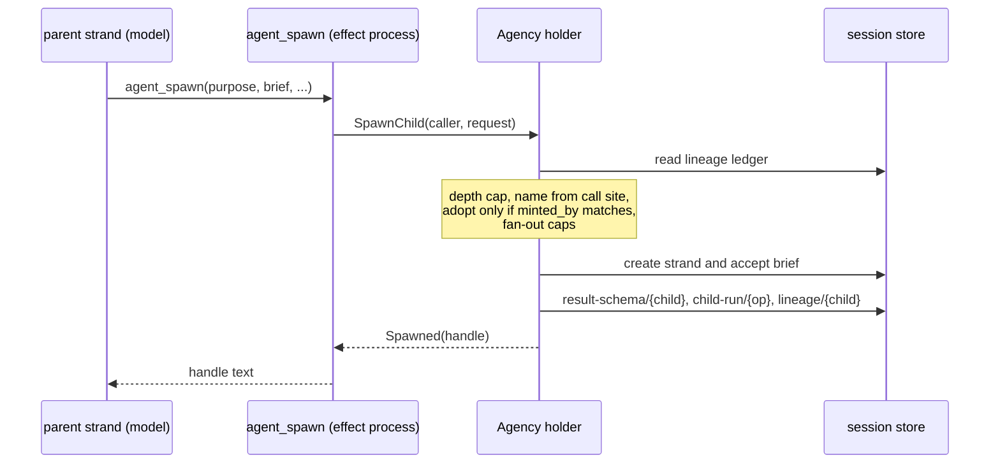
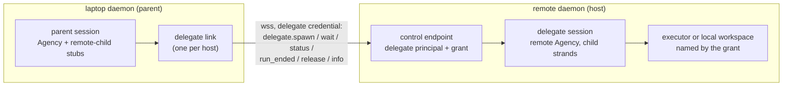
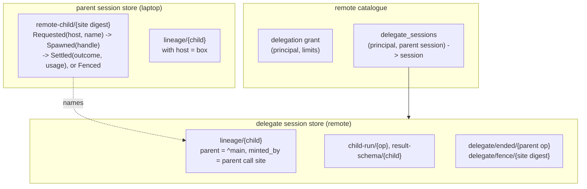
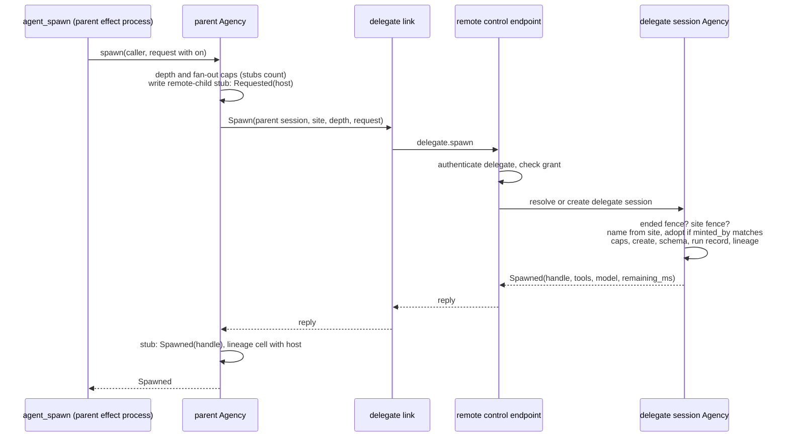
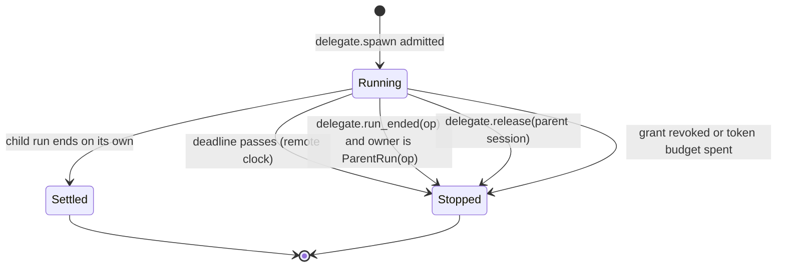

# Subagents on another orchestrator

Status: **proposed, 2026-10-09. Design only; nothing here is built.** The
wire and durable formats it would add are drafted in
[protocol-change/082](../../protocol-change/082-remote-subagents.md). It
builds on the distributed runtime of PR #923
([the design note](distributed-runtime.md),
[the architecture page](../architecture/distributed.md),
[protocol-change/078](../../protocol-change/078-distributed-runtime.md)) and
is meant to work with and without the Khepri directory of PR #934
(protocol-change/081).

## 1. The question

The owner asked whether an orchestrator on a laptop could start and direct
subagents on a remote orchestrator, "basically via TLS distribution". Today
it cannot. PR #923 gives a session remote hands (an executor runs its tool
calls), lets sessions on two orchestrators exchange peer mail, and lets an
owner move a session from one orchestrator to another. A subagent is none of
these.

`agent_spawn`, and `strand.spawn` in code mode, create a strand inside
the caller's own session, and the session's Agency (`client/agency`) owns
everything about it: the lineage cell that records who spawned whom
(`runtime/lineage`), the per-run record that carries its deadline and its
stop reason (`runtime/child_run`), the join, the result contract, the rule
that a strand addresses only its parent or a descendant, the depth and
fan-out caps, and reaping when the parent's run ends or the deadline passes.
All of it reads and writes one session store on one machine. And the model
cannot create a session anywhere, because `sessions.create` and `peers.link`
are owner control commands.

This note proposes a way to give a model a child that runs on another
orchestrator, keeps the local semantics wherever the network allows, and
keeps the remote machine safe from the laptop that asked.

## 2. The decisions in brief

1. **The transport is the remote daemon's control connection, not Erlang
   distribution.** The laptop's daemon reaches the remote as a client, over
   the same `wss` endpoint the terminal uses, authenticated as a new kind of
   principal, a **delegate**. Distribution cannot carry the trust boundary
   this feature needs: a connected node can call any function on its peer,
   so no check on the remote binds a compromised laptop that has joined it
   (section 4).
2. **The remote owner issues a delegation grant.** It names the workspace,
   profile, tool ceiling, caps, maximum deadline and token budget that every
   child of that delegate runs under. The delegate credential authorizes the
   `delegate.*` commands and nothing else.
3. **A remote child is a strand in a delegate session.** The remote creates
   one delegate session per (delegate, parent session) on the first spawn,
   owned by the remote owner, and every child that parent session starts on
   that remote is a strand in it, minted and judged by the remote's own
   Agency. The parent is not a strand there; it appears as a reserved
   reference.
4. **The model's surface is `agent_spawn` with `on`.** `agent_wait`,
   `agent_roster`, `result_schema` and `detach` work on a remote child as on
   a local one. A few things refuse in the first phase and are named.
5. **Idempotency comes from the call site, on the remote.** The remote's
   Agency derives the child's name from the parent's call-site coordinates
   and adopts on a name match only when the lineage cell says this call site
   minted it, exactly as a local replay does. A write-ahead stub on the
   parent routes every retry to the same remote.
6. **Every remote child has a finite deadline on the remote's clock.** That
   bound holds whatever the laptop does. Reaping at the parent's run end,
   on release of a deleted parent session, and on grant revocation are
   faster paths on top of it.
7. **The remote's provider keys pay; the grant caps the spend.** Usage is
   reported back with each settled child and recorded on the parent's stub.
8. **Escalations stay on the remote.** In the first phase a remote child's
   refused call settles in band, because nobody is attached to the delegate
   session. Routing an approval back to the laptop's operator, inside a
   ceiling the remote owner sets, is a later phase.

## 3. What a local subagent is today

A local spawn runs entirely inside the parent session's Agency holder, which
serializes child admission:



Four properties carry over to the remote design and decide most of it.

- **The name is derived, never chosen.** `agency.child_name` builds
  `sub:{parent}/{slug}-{digest}` from the caller's strand, the purpose and a
  digest of the call's durable coordinates (operation, minting step, source
  index). A replay derives the same name.
- **The ledger, not the name, proves ownership.** `adopt` hands an existing
  child back only when its cell's `minted_by` equals the caller's call site.
- **A run record owns cancellation.** `child_run.Run.owner` is
  `ParentRun(op)` for an attached child, and `reap_run(op)` at the parent's
  run end stops every child whose current run that operation owns. A
  deadline in the same record is checked by `reap_overdue` before each wait.
- **A send upward never wakes a finished parent.** `send` refuses an upward
  message to an idle parent with `ParentRunEnded`, because a fresh run with
  no human present is what auto-enqueued child results were rejected over.

## 4. Transport and trust

### Why not distribution

PR #923 joins orchestrators and executors in TLS Erlang distribution, and
the architecture page states the consequence plainly: a connected node has
the full privileges of an Erlang peer and can spawn processes and call any
function on the other node. The closed message vocabularies (`HostMessage`,
`OwnerMessage`, the orchestrator port's `Message`) are scope hygiene, not a
security boundary. Under protocol-change/081 the members of a directory
deployment, every orchestrator and executor, use visible distribution and
each holds a replica of the Khepri store that decides session ownership.

A laptop is the machine most likely to be compromised. It browses the web,
opens arbitrary repositories and sleeps on untrusted networks. If it joins
the remote's distribution, a compromise of the laptop is a compromise of the
remote's VM, its provider keys, every session it holds and every executor it
trusts. No authorization written on the remote can prevent that, because the
attacker does not have to send the messages the authorization checks. The
brief's requirement that the trust boundary hold when the laptop is
compromised cannot be met on that transport, so the design does not use it.

### The control connection and the delegate principal

The remote daemon already authenticates clients that are not its owner. A
principal has a stable identity and a credential whose SHA-256 digest the
daemon stores; members are invited with a single-use claim
(protocol-change/053); a revoked credential closes its connections at the
next authorization check. And the daemon already holds a client for that
protocol: `host/websocket` and `host/access` open an owner's control
connection to a remote daemon over `wss`.

The design adds one principal kind, `delegate`. The remote owner creates it
with a grant (section 8), the laptop redeems the claim, and the laptop's
daemon then opens a control connection to the remote as that delegate. The
delegate may send the `delegate.*` commands and no others. Every other
control command, every session socket and every web route refuses it.



### What a compromised laptop can and cannot do

An attacker who holds the laptop and its delegate credential can do exactly
what the grant allows, and the grant is written on the remote:

| The attacker can | The attacker cannot |
|---|---|
| Start children up to the grant's live and daily caps, with any brief | Prompt, read or open any session other than its own delegate sessions |
| Make those children run any tool in the grant's ceiling, inside the sandbox policy of the grant's workspace | Choose a different workspace, executor or directory |
| Spend the remote's provider keys up to the grant's token budget | Exceed that budget, the deadline cap or the caps on live children |
| Read its children's reports, notes and results | Approve an escalation (phase 1), or approve beyond the grant's ceiling (phase 3) |
| | Reach distribution, the remote's configuration, its owner tools, its memory domain, its schedules or its peer links |

The brief is model-written text, so it can carry a prompt injection aimed at
the remote child. That is the same exposure a local child has to a laptop
model, and it is bounded by the same things: the tool ceiling and the
sandbox. The grant should name a workspace the remote owner is willing to
expose to whatever the laptop can ask for. The remote owner ends a delegation
with `loomd access revoke`, which closes the link and reaps the delegate's
children (section 7.6).

### Who dials whom

The laptop dials; the remote never does. A laptop behind NAT has no address
the remote could reach, and the remote daemon binds loopback and is reached
through whatever tunnel or proxy its operator set up, as an
`[orchestrators.<name>]` address already is. So every exchange is a request
from the laptop and a reply from the remote, and anything the remote has to
tell the parent (a settled child, later an upward message or an escalation)
waits on the remote until the laptop asks for it. This also holds on
distribution, where the remote could dial the laptop only if the laptop ran a
reachable listener, so it costs nothing relative to the rejected transport.

## 5. The model's surface

### `agent_spawn` with `on`

`agent_spawn` gains one optional argument, `on`, naming a subagent host. The
names are the keys of the laptop's `[subagent_hosts.<name>]` tables and the
tool schema lists them as an enum, the way it lists `model` names today. With
`on` absent the spawn is local and nothing changes.

```json
{"purpose": "run the integration suite",
 "brief": "Run make e2e on the box and report failures.",
 "on": "box",
 "within_ms": 1800000,
 "result_schema": {"type": "object",
                   "properties": {"failed": {"type": "array"}},
                   "required": ["failed"]}}
```

A new tool was considered and rejected. A remote child is waited on, listed
and reaped with the same tools, and a separate tool would make the model
learn a second vocabulary for the same act.

`strand.spawn` in code mode gains the same field through a `with_on` builder
on the assignment, in phase 2. The per-execution spawn ceiling (32) counts
remote spawns too.

### What each argument means for a remote child

| Argument | Remote behavior |
|---|---|
| `purpose`, `brief` | As local. The brief is framed with `frame_brief` on the remote. |
| `within_ms` | Required to be finite. Absent means the grant's default; a value above the grant's `max_within_ms` is refused, not clamped. Converted to an absolute deadline on the remote's clock. |
| `tools` | Narrowed three times: by the request, by the parent's own active tool names, and by the grant's ceiling. `agent_spawn` is removed unless the grant's depth allows it. The communication floor (`agent_note`, `agent_send`) is kept when the ceiling holds it. |
| `model` | A catalogue name on the remote, validated there. Absent means the grant profile's subagent route. |
| `result_schema` | Parsed on the parent (a malformed schema is the parent's mistake, told in its own turn), enforced on the child's `agent_note` on the remote, and decoded again on the parent when a result comes back. |
| `context` | `"mine"` is refused with `on`. Copying the parent's conversation would ship the transcript to another machine; a later phase may send a rendered excerpt. |
| `detach` | As local: the child survives the parent's run end. It is still bounded by its deadline, by the parent session's release and by revocation. |

### The handle

A remote handle names its host, so `agent_wait` can route it:
`sub:^main/run-the-integration-suite-7b1c0a4e2d95f318#op_01J…@box`. The
host is the suffix after the last `@` that follows the last `#`; host names
are restricted to `[a-z0-9_-]`, and neither an operation id nor a minted slug
contains `@`. The spelling is provisional. `^main` is explained in section 6.

### The other tools

- **`agent_wait`** takes local and remote handles in one call and waits for
  all of them against one deadline, as today. Remote handles are asked of
  their host with one long poll per host per wait, run beside the local poll
  inside the same budget. A host that cannot be reached leaves its handles
  `Pending`, with a sentence saying the host did not answer.
- **`agent_roster`** lists remote children from the parent's stubs: the
  name, the host, the handle, and the state last observed (spawning,
  running, settled, or unknown when the host has not answered).
- **`agent_send`** downward to a remote child, and a remote child's
  `agent_send` upward, are refused in phase 1 with a sentence that tells the
  child to report through its final answer, its notes or its result. Phase 2
  adds both directions (section 7.5).
- **`agent_notes`** reads the parent session's blackboard, as today. A
  settled remote child's notes arrive with its `Ready` result. Reading a
  running remote child's notes is phase 2.
- **`todo`** stays local.

## 6. The remote child: a strand in a delegate session

### Three shapes considered

**A strand in an existing session on the remote.** Rejected. The remote's
sessions belong to its owner and its members; a child there would be
visible to them, would share their lineage namespace, and would make the
delegate a member of a session it has no business reading.

**One new session per child.** Simple identity: a child is a session. But
each child then needs its own session store, runtime and, for an
executor-backed workspace, its own executor scope, and an executor admits at
most 16 scopes that are not cleanly closed. A fan-out of eight children
would take half an executor. Lineage, the caps and reaping would also have
to be rebuilt across sessions, because the Agency judges strands inside one
session.

**One delegate session per (delegate, parent session), with each child a
strand in it.** Chosen. Children of one parent share one workspace and one
executor scope, which is what local children do: they share the parent's
checkout. And the remote's Agency already implements naming, adoption, caps,
the result contract, the wait and reaping over strands in one session, so
the remote side is the local code with a different caller.

### The delegate session

The remote creates the delegate session on the first `delegate.spawn` for a
parent session, keyed by (delegate principal, parent session id) in a new
catalogue table, and answers every later spawn for that parent session from
the same row. It is an ordinary session of the remote daemon in every
respect not listed here:

- **Owner.** The remote owner. It appears in the owner's session list,
  labelled with the delegate's name and the parent session's id, and the
  owner can open it, read it and abort its strands. The delegate principal
  has no membership in it; its only access is the `delegate.*` commands,
  which name the parent session and are resolved through the catalogue row.
- **Workspace.** The grant's placement: a registered workspace on an
  executor, a pool, or a directory on the remote. The laptop never names a
  path or an executor. The memory domain is `session_only`.
- **Configuration.** The grant's profile (`[profiles.<name>]`,
  protocol-change/076) seeds the session, so the remote's catalogue, roles
  and pricing apply.
- **Identity of the parent.** The parent strand is not a strand of the
  delegate session. Its children's lineage cells name it as a reserved
  reference, `^{parent strand}` (so `^main`), and `create_strand` gains a
  check that refuses a name of that form, so the reference can never name a
  real strand. The
  addressing walk (`lineage.is_descendant`) needs no change: it compares
  names, and every child's chain ends at the reference, which has no cell.
- **Attribution.** A brief carries `PeerOrigin(parent session, parent
  strand)`, the existing origin for a model in another session whose
  identity the host binds. Here the host binds it to the delegate
  principal, which the delegate session's catalogue row names.
- **What it refuses.** Moving it (`sessions.move` answers `not_movable`),
  inviting members to it, and peer links to or from it.

### What the remote's Agency does differently

The spawn path is `spawn_on` with three changes, selected by a caller that
arrives from the wire rather than from `Ctx`:

1. **Depth** is the depth the parent reports plus the grant's own cap,
   instead of a parent cell, because the parent has no cell on the remote.
   The reported depth is advisory: a compromised laptop can lie about it, and
   what binds is the grant's `max_depth` and the caps counted on the remote.
2. **The base configuration** is the grant profile's, narrowed to the
   tool set above, instead of the parent strand's configuration, which the
   remote does not have.
3. **Admission refuses a spawn under an ended parent run.** Before it
   mints, the holder checks for a `delegate/ended/{op}` fence for the call
   site's operation (section 7.3).

The caller's coordinates are the parent's own: strand `^main`, and the
operation, step, source index and minter of the parent's planned call. So
`child_name` and `adopt` run unchanged, and a resent spawn from the same call
site adopts the child it already created.

## 7. The protocol

### 7.1 Records on each side



On the parent, the `remote-child/{site digest}` fact is the write-ahead
stub. It is reserved (no model tool can read or write it) and records the
host before any message is sent, so every retry of that call site goes to the
same host and a remote failure never falls back to a local spawn. The
parent's lineage cell gains an optional `host` and is written once the spawn
is answered, so addressing, the roster and the fan-out count see the remote
child as the caller's descendant. A cell that predates the field decodes as
local.

On the remote, the delegate session holds the real lineage cell, run record
and result schema, written by the same `reconcile` path as a local child,
plus two kinds of fence described below.

### 7.2 Spawn



The parent's spawn is `ReplaySafe` and stays so. A lost reply is recovered by
sending the same `delegate.spawn` again: the remote derives the same name,
finds its own cell, checks `minted_by` and answers the same handle. The link
resends with a doubling pause, as `surface.run` does, until the remote
answers or the spawn's own window (30 s) runs out. When the window runs out
the tool answers that the host did not answer and the child may exist, and
the stub stays `Requested`. A spawn is never retried against another host.

A `Requested` stub is settled by the parent's reconciler (section 7.4) with
`delegate.status(site)`, which on the remote either returns the child that
exists or, when none does, writes a `delegate/fence/{site digest}` in the
same holder turn and answers `Fenced`. A late `delegate.spawn` for that site
then finds the fence and is refused. This is the executor ledger's
`QueryOrFence` applied to spawns, and it is needed for the same reason: two
connections are two senders, and a spawn sent on a connection that broke can
reach the holder after a status asked on the next one. Both messages go
through the delegate session's Agency holder, which serializes them, so
whichever arrives first decides and the other agrees with it.

### 7.3 Reaping

A remote child is stopped by one of four things. The first is a property of
the remote alone; the other three are messages from the laptop.



- **Deadline.** Every remote child has a finite deadline on the remote's
  clock, capped by the grant. The remote's Agency checks it as
  `reap_overdue` does today, and the delegate session also arms a timer for
  its earliest deadline so a child with nobody waiting on it is still
  stopped on time. This bound holds when the laptop is gone for good.
- **Parent run end.** The parent's run-end hook already spawns `reap_run(op)`
  off the driver. For each remote stub whose run that operation owns, it
  also asks the host to run `delegate.run_ended(parent session, op)`. The
  remote's holder writes `delegate/ended/{op}`, then calls the existing
  `reap_run(op)`, which stops every child whose current run is owned by
  `ParentRun(op)`; on the remote that operation id is the parent's, because
  the child's `minted_by.operation` is the parent's operation. The fence is
  what makes a parent run aborted in the middle of a spawn safe: if the
  run-end message overtakes the spawn, the spawn finds the fence and is
  refused, instead of creating a child nobody will reap.
- **Release.** Deleting the parent session writes a release intent per host
  into the laptop's catalogue in the registry turn that deletes the session,
  since the session store is about to go. A daemon-level drainer, a weft
  state machine like `peer_outbox_drain`, sends `delegate.release(parent
  session)` until the host acknowledges it. The remote stops every child of
  that delegate session, detached ones included, marks the row `released`
  and deletes the session once its cleanup is proven.
- **Revocation and spend.** Revoking the delegate's credential, or the grant
  reaching its token budget, stops every child of that delegate with a
  recorded reason.

`child_run.Stop` gains `Released`, `Revoked` and `TokenBudgetSpent`, and the
model-facing `Outcome` gains the matching variants, so a wait explains why a
child stopped.

### 7.4 The parent's reconciler

Messages from the laptop can be lost, and the laptop can crash between a
durable write and the message it implies. The parent's reconciler makes each
such message eventually delivered by reading durable state. It runs when the
session opens and then every 60 seconds, as the executor acknowledgement
reconciler does, and for each stub:

| Stub | Reconciler sends | On the answer |
|---|---|---|
| `Requested` | `delegate.status(site)`, which fences | `Spawned(handle)` with the lineage cell, or `Fenced` |
| `Spawned`, owning run ended, end not acknowledged | `delegate.run_ended(op)` | mark the end acknowledged |
| `Spawned`, settlement not yet observed | nothing; the next wait or roster observes it | |

Release intents live in the laptop catalogue and are drained by the daemon,
because they outlive the parent session's store.

### 7.5 Waiting and messaging

**The parent waits by polling.** The remote cannot reach the laptop, so the
parent asks. `delegate.wait(handles, within_ms)` is a long poll: the remote
runs its own Agency's `wait` for the parent reference, which checks that
every handle is a descendant of `^{strand}` and answers as soon as all
settle or the window ends. The window is at most the parent's remaining
budget and at most 25 seconds, under `agent_wait`'s 30-second ceiling. A
`Ready` answer carries the outcome, the final report, the notes, the
judged result and the child's usage. Waiting twice on the same handle gets the
same answer twice, as locally; a wait is a read.

**Messaging is phase 2.** Downward, `delegate.send(child, message_id, text,
within_ms)` delivers into the child through the remote Agency's `send`, and
the message id, derived from the parent's call site, makes a resend return
the stored receipt instead of a second message: peer mail's receipt rule,
reused.

Upward, a remote child's `agent_send` to `^main` cannot be delivered
synchronously, so the remote Agency writes it to a delegate outbox in the
delegate session. It refuses with `ParentRunEnded` when the run that owns
the child has an ended fence, which is the local rule applied to what the
remote knows. The laptop pulls the outbox with `delegate.pull(cursor)` and
admits each message into the parent through the parent Agency, keyed by its
message id so a message pulled twice is admitted once, and only as a steer
into an open run: a parent strand that has gone idle refuses it, and the
refusal is written back to the outbox row. That is a narrower guarantee than
the local one: locally the child learns of the refusal in its own turn, while
remotely the child can be told only that the message was queued. An open
question asks whether that is acceptable.

### 7.6 Depth and fan-out across machines

Caps are counted on both sides, and each side counts what it can see.

- **On the parent**, `check_capacity` counts remote stubs as live children of
  their parent strand, against the same `fan_out` and `session_strands`, until
  a settlement or a stop is observed. A stub whose host has not answered stays
  counted. That errs toward refusing a spawn, which is the safe direction.
- **On the remote**, the grant caps live children across all of the
  delegate's sessions, spawns per day and delegate sessions. Each delegate
  session on an executor holds one scope, so the grant's session cap must sit
  under the executor's 16.
- **Depth** is carried in the request and checked against the grant's
  `max_depth`. With the shipped `depth_cap: 1`, only a strand a human talks to
  spawns, and a remote child's tool set has no `agent_spawn`, so the first
  phase has no grandchildren anywhere.

## 8. Authorization

### The grant

The remote owner creates a delegate and its grant in one command, which
prints a single-use claim as `loomd access invite` does:

```text
loomd access delegate laptop \
  --workspace box:loom --profile cheap-review \
  --tools fs_read,fs_write,fs_edit,grep,bash,code_mode \
  --max-live 8 --max-per-day 200 --max-within 2h \
  --token-budget 5000000/day --retain 7d
```

The laptop redeems it with `loom delegate claim --addr wss://box.example/v2/control
--as box`, which stores the credential at mode 0600 under `~/.loom/remotes/`
and writes a `[subagent_hosts.box]` table with the address and the
credential path. `loom access list` on the remote shows the delegate, its
grant and its fingerprint, and `loomd access revoke laptop` ends it.

The grant is durable state in the remote catalogue, beside the principal it
belongs to, rather than a `loom.toml` table. A credential is already durable,
revoking it is one command, and keeping the grant beside it means there is no
configuration that can name a delegate whose principal does not exist. The
profile and workspace it names are validated against the remote's
configuration when the grant is created and again when a delegate session is
created.

### What a remote child may do

| | Remote child |
|---|---|
| Tools | The grant's ceiling, narrowed by the parent's own set and the request. The default ceiling excludes `agent_spawn` (unless depth allows), the peer tools, `schedule_*`, `remember` and skill installation, because each reaches state beyond the delegate session. |
| Workspace and executor | The grant's placement only. Executor-backed placement uses the existing pools and placement rules. |
| Sandbox | The workspace's base policy on the remote. No standing grant from the laptop crosses; the laptop has none to send. |
| Secrets | `[tools] env` resolved on the remote and its executor, as for any remote session. |
| Approvals | Phase 1: none. A refused call parks only when someone is attached to the session (`client/gateway.attached`), and nobody is attached to a delegate session, so the refusal settles in band. The remote owner can attach and approve. Phase 3 adds delegated approval (section 10). |
| Memory, schedules, peers | None. The delegate session's domain is `session_only`, and its owner tools are not in the ceiling. |

### Who on the laptop may use a host

A host is configured by the laptop's owner and spends the remote owner's
budget. In phase 1, `on` is offered only in sessions the laptop owner holds
alone, using the predicate default peer links already use
(`manager.unshared_sessions`), so inviting a member into a session withdraws
it. An open question asks whether that is the right default.

## 9. Budgets and credentials

The remote's provider keys pay for remote children. Keys never travel, and
the delegate session's profile resolves its models from the remote's
catalogue.

**Enforcement is on the remote.** The grant carries a token budget per
rolling day and an optional per-child ceiling. The delegate session's usage
hook (`effects.Hooks.usage`, which is called with each usage row the session
records) adds each row's tokens to the delegate's spend in the remote
catalogue, and when a row passes a budget the hook stops the affected
children with `TokenBudgetSpent`. Spawn admission refuses with
`budget_spent` while the daily budget is spent. Because the check runs per
provider request, a child can overshoot by at most one request.

**Reporting is per child.** A `Ready` answer carries the child's usage:
the four token buckets and the cost, priced once by the remote's gateway as
every usage row is. The parent records it on the child's stub and never
reprices it. The parent's provider usage ledger records only requests the
laptop made and priced, so remote spend is shown beside it, labelled with the
host, in the terminal's status bar and the web view. Whether remote tokens
count against a parent goal's budget is an open question; the recommendation
is that they do, so a goal cannot escape its budget by delegating.

**Clocks never cross as instants.** `within_ms` crosses as a duration and
the remote builds the deadline on its own clock; a reply reports the
remaining time, and the parent rebuilds a display deadline on its own clock,
as escalations already do between orchestrator and executor.

## 10. Approvals and the human

**Phase 1.** Escalations stay on the remote and settle in band unless the
remote owner is attached to the delegate session. The child reads the
refusal and works around it, as it would locally with nobody watching.

**Phase 3, delegated approval.** The grant may add an approval ceiling: the
grants a delegate may approve (for example, network to a listed host, or
write access under the workspace root). With a ceiling set, the delegate's
link counts as attached to its delegate sessions while it is connected, so a
refused call parks. The laptop learns of pending escalations through
`delegate.pull`, shows them to the parent's operator in the parent session's
terminal and web view, and sends the answer with `delegate.resolve(id,
decision, expected_seq)`. The remote admits an approval only when every
grant in it is inside the ceiling; anything wider stays pending for the
remote owner. A compromised laptop can therefore approve only what the remote
owner already said a delegate may approve.

**Display.** The laptop's terminal and web view show a remote child in the
parent's agent strip and roster with its host (`run-the-integration-suite @
box`), its last observed state, its deadline and its usage. They do not show
its transcript in phases 1 to 3: the transcript is in the delegate session on
the remote. The remote owner sees delegate sessions in their own session
list, grouped under the delegate's name, and can open one like any session.
Observing a remote child's transcript from the laptop is phase 4.

## 11. Failure behavior

"Unknown" below means the model is told the host did not answer and the
child may exist; the roster shows the stub as unknown until the reconciler
settles it.

| Failure | What the system does | What is seen |
|---|---|---|
| Link cut during `delegate.spawn` | The link resends the same spawn with a doubling pause for up to 30 s. The remote adopts on the call site, so a spawn that landed is answered with the same handle. | Within the window, an ordinary spawn. After it, unknown; the reconciler's `delegate.status` later settles the stub as spawned or fenced. |
| Link cut during `delegate.wait` | The wait retries inside its budget. | Handles of that host are `Pending` with "the host did not answer". |
| Parent orchestrator restarts | Stubs and release intents are durable. A spawn in flight is replayed by the planner under the same call site and adopts. The reconciler resends `run_ended` for runs that ended before the crash. | A replayed spawn returns the same handle. Children owned by a run the crash ended are reaped when the reconciler reaches them, or at their deadline. |
| Remote orchestrator restarts | The delegate session is a normal session; the remote reopens delegate sessions with live children at boot, and runtime recovery handles their tool calls. Deadlines are absolute on the remote clock, so time spent down counts. | The parent's waits see `Pending` while it is down, then the children's results. |
| Parent run aborted mid-spawn | The effect process is killed after the stub was written. The run end sends `run_ended`, whose fence refuses the spawn if it arrives later, and reaps the child if it arrived first. | No child survives the aborted run unless it was detached. |
| Spawn reply lost | As a link cut: a resend or a replay adopts. | The same handle, once. |
| Child running after its parent was reaped | The deadline stops it on the remote whatever the laptop does. A lost `run_ended` is resent by the reconciler; a lost release by the drainer. | The child's result is retained in the delegate session until release or `retain`. |
| Remote down when the parent waits | The wait spends its budget retrying. Fan-out keeps counting the stubs. | `Pending`, with the host named as unreachable. |
| Parent session moved | `sessions.move` refuses `not_movable` while the session holds a remote child that is not settled. A settled stub moves as history. | The owner waits for or stops the children first. |
| Delegate session moved | Refused: a delegate session is never movable. | `not_movable`. |
| Delegate credential revoked | The remote closes the link and stops every child of the delegate with `Revoked`. | The parent's waits get `Ready` with outcome `revoked`; later commands are refused. |
| Grant budget spent | Children past the budget stop with `TokenBudgetSpent`; spawns are refused with `budget_spent`. | The reason in the wait result or the spawn refusal. |
| Grant's caps reached | Spawn refused on the remote. | `fan_out_cap` or `grant_exceeded` naming the cap. |

## 12. Interplay with what exists

- **Executor pools on the remote.** A grant may name a pool or an executor
  and registered workspace. The delegate session is placed by the existing
  placement code on its first open and keeps that executor, as every remote
  session does. The 16-scope limit is why delegate sessions are per parent
  session and not per child.
- **Peer mail.** Reused where its properties fit: the receipt keyed by
  message id for exactly-once admission (both directions in phase 2), and the
  outbox row format for upward messages. Not reused: the orchestrator port,
  which rides distribution, and the drainer's push, because the remote cannot
  dial the laptop.
- **Khepri (#934).** Without it, nothing changes. With it, a delegate
  session placed on an executor is a remote session of a member daemon and
  gets its `{self, serving}` record when it is created. Because a delegate
  session never moves, its record only ever changes by create and delete.
  The laptop is not a member and never joins the store. A laptop that reaches
  an orchestrator other than the one holding its delegate session (because
  the operator repointed the address) gets `not_found` for that parent
  session, and its stubs read as unknown; there is no redirect, because a
  delegate session cannot have moved.
- **Session moves.** Section 11: a parent with live remote children does not
  move, and a delegate session never moves.
- **Code mode `strand.*` on an executor.** A satellite's `strand.spawn` on
  the laptop's executor already reaches the laptop orchestrator through the
  owner port and the Agency. `with_on` adds one field; the executor is not
  involved. A remote child's own `code_mode` runs on the remote's executor,
  and its `strand.*` calls reach the remote orchestrator, where the grant's
  depth decides whether it may spawn.
- **Rule Zero and the two channels.** Unchanged. A remote child is an
  ordinary strand in the remote harness, and model-influenced code still runs
  only in jailed satellites.

## 13. Formal model

Three invariants are worth a model, because each depends on message
interleavings across connections that tests reach only by luck:

1. **At most one child per call site.** However spawns, statuses and
   resends interleave, a call site creates at most one child, and a fenced
   site creates none.
2. **No orphan past its bound.** A child whose owning run has ended, and
   whose end the remote has been told, is stopped; and every ended run is
   eventually told, under fair reconnection. The deadline is the bound when
   the laptop never returns.
3. **A message reaches a live parent at most once.** An upward message is
   admitted into the parent at most once by its id, and only into an open
   run (phase 2).

The proposal is a new P model, `protocol/models/remote-subagents`, rather
than an extension of `remote-execution`, whose machines are the executor
ledger's. It reuses that model's wire: one queue per sender and receiver pair,
any interleaving across pairs, everything in flight lost on a break, and a
new connection being a new sender.

| Machine | Stands for |
|---|---|
| `ParentAgency` | The parent's spawn, its stub, its run-end hook and its reconciler; it crashes and restarts from durable state |
| `Link` | One connection; each reconnect is a new sender, so a request on a dead connection may still reach the remote late |
| `DelegateHost` | The delegate session's Agency holder: spawn admission with adoption and both fences, `status`, `run_ended`, `release`, the outbox |
| `Child` | A child strand: runs, may send upward, ends on its own or is stopped |
| `Chaos` | Connection drops, crashes on both sides, parent run end, an abort during a spawn, a deadline firing |

Specs: `AtMostOneChildPerSite`, `FencedSiteNeverSpawns`,
`NoSpawnUnderEndedRun`, `EndedRunChildrenStop` (safety, once the end is
delivered), `EveryEndedRunIsTold` (liveness), `UpwardAtMostOnce` and
`UpwardOnlyIntoOpenRun`.

Mutants that must each be caught:

| Mutant | Violates |
|---|---|
| Adopt on a name match without comparing `minted_by` | `AtMostOneChildPerSite` (two call sites share a child) |
| `status` answers "not found" without writing the fence | `FencedSiteNeverSpawns` (a late spawn starts after "never started") |
| `run_ended` reaps without writing the ended fence | `NoSpawnUnderEndedRun`, then `EndedRunChildrenStop` |
| The reconciler does not resend `run_ended` after a parent crash | `EveryEndedRunIsTold` |
| The parent admits an upward message without its receipt | `UpwardAtMostOnce` |
| Upward admission starts a run on an idle parent | `UpwardOnlyIntoOpenRun` |
| A spawn retried against a second host after a timeout | `AtMostOneChildPerSite`, with the two hosts as two `DelegateHost` machines |

The model leaves out the grant's caps, the token budget, the workspace and
time other than as a deadline event. The upward specs and their mutants join
in phase 2.

## 14. Phasing

Each phase ends with something observable, as in the distributed runtime
note.

1. **Spawn and join.** The delegate principal and its grant, with one
   placement; `[subagent_hosts.<name>]` and `loom delegate claim`;
   `agent_spawn` with `on`, `agent_wait` over mixed handles, `agent_roster`;
   `delegate.info`, `delegate.spawn`, `delegate.status`, `delegate.wait`,
   `delegate.run_ended`, `delegate.release`; deadlines, run-end reaping,
   release, revocation, retention and the token budget; `result_schema` and
   `detach`. Messaging in either direction, `context: "mine"` and delegated
   approval refuse with a sentence. The P model with the first five specs.
   Exit: a laptop daemon starts three children on a Linux box daemon over
   `wss`, joins them and reads their structured results; a shipped test kills
   the laptop during a spawn, cuts the link during a wait and restarts the
   remote, and each child is reaped or reported exactly once; and a test
   holding the delegate credential is refused every non-delegate command and
   every request past the grant.
2. **Messaging.** `delegate.send` and the upward outbox with
   `delegate.pull`; reading a running child's notes; `strand.spawn` with
   `with_on`; remote usage counted toward goals if the owner agrees. The upward
   specs join the model.
3. **Delegated approval.** The approval ceiling, escalation events in
   `delegate.pull`, `delegate.resolve`, and their display in the laptop's
   terminal and web view.
4. **Observation and reach.** Observing a remote child's transcript from
   the laptop; grants with several placements, chosen by name; depth across
   machines, with a remote child spawning on a third orchestrator.

## 15. What this design gives up

- **A second authentication path between daemons.** Orchestrators in one
  deployment talk over distribution; a delegate talks over the control
  protocol. They answer different trust questions, and keeping them apart is
  the point, but it is two things to understand.
- **Total decoders at a new boundary.** Every `delegate.*` request is
  untrusted input to the remote, decoded totally and refused with a code, as
  every control command already is. Nothing on that path may assume the shape
  a well-behaved laptop would send.
- **Upward messages are weaker than local ones** (section 7.5), and arrive
  only when the laptop asks.
- **Siblings share a workspace.** Two remote children of one parent edit the
  same checkout, as local siblings do. Isolation per child would cost a scope
  each.
- **Transcripts stay on the remote** until phase 4, so the laptop's operator
  sees a remote child's result and notes but not its working.
- **Remote usage is reported, not metered locally.** The laptop trusts the
  remote's account of what a child cost, as it trusts its own gateway's.

## 16. Open questions for the owner

1. **Transport.** (a) The control connection with a delegate principal, as
   proposed. (b) The orchestrator port over distribution, which is what
   "via TLS distribution" suggests, with the laptop as a pinned peer: less
   new code, and no boundary against a compromised laptop. (c) Both, with (b) only between
   servers already in one deployment. With (b) or (c), the laptop also
   holds a replica of the Khepri store under #934. **Recommendation: (a)
   only.** Build (b) later only if a deployment of servers asks for it; the request handler
   on the remote is written against a delegate identity, so a second
   transport would be an adapter, not a redesign.
2. **Where the grant lives.** (a) Durable, beside the delegate principal in
   the remote catalogue, managed by `loomd access`. (b) A
   `[delegates.<name>]` table in the remote's `loom.toml`. **Recommendation:
   (a)**, so a grant cannot outlive or predate its credential and revocation
   is one command.
3. **The child's shape.** (a) A strand in one delegate session per
   (delegate, parent session). (b) One session per child. **Recommendation:
   (a)**, for the executor scope limit and to reuse the Agency.
4. **Delegated approval.** (a) Never; escalations always belong to the remote
   owner. (b) Within a ceiling the remote owner sets, as in section 10. (c)
   Unbounded. **Recommendation: (b)**, in phase 3; (c) would let a
   compromised laptop approve anything.
5. **Remote spend and a parent goal.** (a) Remote tokens count against the
   parent goal's token budget. (b) They are shown but not counted.
   **Recommendation: (a)**, so delegation is not a way around a goal's
   budget.
6. **Which laptop sessions may use a host.** (a) Sessions the owner holds
   alone. (b) Any session whose strand holds `agent_spawn`. (c) An explicit
   per-session opt-in. **Recommendation: (a)** for phase 1; members of a
   shared session should not be able to spend the remote owner's budget
   without the owner deciding so.
7. **Upward messages into a finished parent.** (a) Accept the narrower
   guarantee of section 7.5. (b) Keep refusing upward sends from remote
   children, and have them report only through results and notes.
   **Recommendation: (a)** in phase 2, with phase 1 doing (b).
8. **Moving a parent with live remote children.** (a) Refuse until they
   settle or stop. (b) Release them as part of the move. **Recommendation:
   (a)**; a move should not silently stop work the model is waiting on.
9. **Pinning the remote's certificate.** The control connection uses
   ordinary TLS verification. (a) Leave it so. (b) Add an optional leaf pin
   to `[subagent_hosts.<name>]`, as distribution pins its peers.
   **Recommendation: (b)**, optional, in phase 1: the laptop is sending a
   bearer credential, and a pin keeps a mis-issued certificate from
   collecting it.
10. **Defaults in the grant.** `max_within` (proposed cap 4 h, default
    30 min), `retain` (7 days), and the default tool ceiling in section 8.
    **Recommendation: as proposed**, all overridable per grant.
