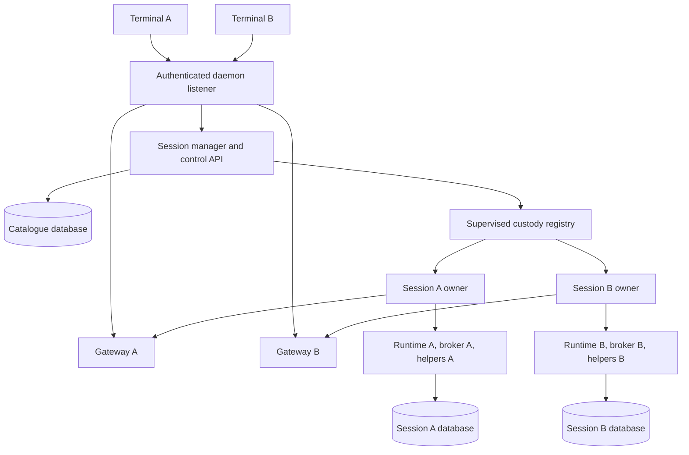

# Design note: one daemon, many sessions

Status: **ruling, pre-code.** The owner selected one daemon and one VM
across workspaces on 2026-09-04, with multiplayer and no backwards
compatibility requirement. Implementation starts from `f019322`.
The compatibility discussion below records an earlier proposal; the
execution ruling supersedes it. No runtime behavior has changed yet.
The current lifecycle is documented in
[the client architecture](../architecture/client.md).

## Execution ruling

The new daemon and client ship together and replace the single-session
server default. Do not build a legacy `/v1/ws` adapter, retain a separate
legacy server mode, or automate import/rollback for old launcher records.
No compatibility requirement authorizes deletion of existing user data:
unknown or unsupported stores must fail clearly and remain untouched.
Numbered protocol proposals still record changes to frozen interfaces.

[Sessions](../architecture/sessions.md) and
[multiplayer](../architecture/multiplayer.md) are the implementation-facing
architecture pages. Update them as code lands and verify them against the
final end-to-end results.

**Restart ruling (2026-09-04): restore the catalogue, then open sessions
lazily as needed.** The owner selected this behavior instead of reopening
previously resident sessions at startup. An authorized selection or open
request starts a session; listing and metadata preview do not. Automatic
transport reconnect across daemon epochs does not supply that request.
The cost is a session-open delay on first use, and saved schedules remain
inactive until their session opens. The historical automatic-reopen option
in Decision 9 is outside the initial implementation.

## The experience we want

An operator starts `loom` in a workspace. The client finds or starts one
user daemon, selects a saved session or creates one, and attaches.
Other terminals use the same daemon, including terminals in other
workspaces. `/sessions` lists sessions through the server, and selecting
one never starts another public server. Closing a terminal leaves its
work running.

**Recommend one daemon and one BEAM VM for the user, managing sessions
across all workspaces.** The state directory stores that daemon's data;
it is not a workspace boundary. A separately configured state directory
is an explicit isolated deployment, not something `loom` creates for
each project. The canonical state directory identifies the singleton
for startup arbitration.
One daemon does not mean one conversation database, one writer, or one
capability domain for generated code. A session remains the unit of
conversation, execution, cancellation, and database ownership.

The audience for this note is an implementer who knows Loom's session
runtime but has not traced the launcher. The proposal covers the
operator-facing behavior, ownership and failure boundaries, wire
changes, migration, and the tests required before enabling the default.

## What the tree already decides

| Existing boundary | Evidence | Consequence |
|---|---|---|
| One served database per entry point | `client/serve.gleam:1874` opens SQLite once; `assemble` constructs one runtime and hub. | Split daemon boot from session boot. |
| One gateway per connection | `client/server.gleam:122` captures one gateway; `client/gateway.gleam:1395` reports rejection of another session name. | Add routing above the hub rather than combining hub state. |
| Runtime handles are session-specific | `runtime/api.gleam:92` holds the session, tree, effects, and canonical ID. | Retain one runtime handle per live session. |
| Opening can execute recovered work | `runtime/supervisor.gleam:153` starts drivers for stored strands and unfinished operations. | Listing or previewing must not call runtime open. |
| Close waits for external owners | `runtime/api.gleam:770` releases storage only after the drain barrier. | A stop deadline cannot authorize immediate replacement. |
| Runtime names allocate atoms | `runtime/registry.gleam:77` allocates a name per new strand; session boot also calls `process.new_name`. | Repeated opens need reclaimable addressing before a long-lived shared VM ships. |
| Memory and search outlive a conversation | `client/serve.gleam:1840` derives shared sidecar paths; `distillpass` runs at session boot. | Explicitly assign shared maintenance ownership. |

Prime Agent is a useful reference for the public ownership model. Its
supervisor owns routing, attachments, worker health, and discovery;
separate workers own root session trees, and a catalogue process scans
saved sessions. Normal workers survive terminal detach. Its separate
worker processes also contain failures that BEAM supervision alone
cannot contain. See its [daemon architecture](https://github.com/PrimeIntellect-ai/prime-agent/blob/5c2750bdc3c99cc4225c1167a3484371a7a221ab/packages/coding-agent/docs/daemon.md)
and [supervisor implementation](https://github.com/PrimeIntellect-ai/prime-agent/blob/5c2750bdc3c99cc4225c1167a3484371a7a221ab/packages/coding-agent/src/modes/daemon/daemon-supervisor.ts#L685).
This proposal adopts the management boundary; it does not copy Prime's
recovery protocol or claim its behavior has been reproduced in Loom.

## Decision 1: separate discovery, lifecycle, and execution

**The daemon manager handles small lifecycle messages; session traffic
goes directly to the selected session gateway.**



The catalogue stores metadata and lifecycle intent. The manager
serializes admission for a session ID or database identity, reserves
resources, and starts an owner. Opening SQLite, restoring a tree,
generating snapshots, and waiting for drain happen outside the manager's
message handler. Independent sessions can open and stop concurrently,
under a configured limit, while list and status requests remain usable.

Each session owner contains its runtime, gateway, effect wiring, helper
pool, and session services. A failure that is fatal to that owner ends
that session and closes its attachments; it does not terminate the
daemon listener. The existing policy for recoverable strand/service
failures stays inside the session boundary.

Keep custody separate from the manager's request loop. A supervised
custody registry retains owner handles, reservations, partial-boot
resources, and pending drain outcomes across manager failure. Session
owners remain reachable while that registry fences admission and drains
them. A replacement manager cannot become Ready until the registry has
settled the predecessor's owners. Do not reconstruct an empty manager
alongside untracked live runtimes.

An owner's own death must not erase its only cleanup ledger either.
Publish runtime handles and teardown witnesses to surviving custody
before execution, using Weft's owner-adoption mechanism. If that
authority is lost or cannot prove cleanup, retain recovery blocks and
capacity reservations. Supervisor ordering alone is insufficient:
runtime roots currently unlink from their starter. Restarting only the
listener can preserve sessions. Hot adoption after manager failure is
a separate feature, not an implicit property of OTP supervision.

## Decision 2: prefer one BEAM VM, with explicit prerequisites

**Use session supervision trees inside one VM only after addressing
unbounded names and auditing node-global state.**

| Arrangement | Benefit | Cost |
|---|---|---|
| One VM, one supervised owner per session | Uses Loom's typed handles and direct messaging; one runtime deployment and listener. | Shared atom table, native libraries, scheduler, and VM memory; process isolation is not an OS resource boundary. |
| One public daemon, one private BEAM worker per session | Reuses process-level session lifetime and limits the effect of a VM/native crash. | More VMs, private transports, credentials, worker adoption, and deployment/recovery machinery. |
| One independent public server per session | Existing implementation. | Retains the discovery and management model this work is intended to replace. |

The first arrangement fits Loom's architecture, but a dispatcher wrapped
around repeated `serve.boot` calls is insufficient. Gleam's installed
`new_name` implementation creates an atom on every call. Those atoms
are never reclaimed when the session closes. The strand registry also
allocates them within an already-running session. A session-count limit
does not bound the total names allocated over a daemon's lifetime.

Introduce a typed, reclaimable address abstraction in the effectful
runtime: stable binary/reference keys resolve through a monitored
registry, and callers retain logical addresses across actor restarts.
Do not replace stable names with cached PIDs or derive atoms from UUIDs.
Use a Weft primitive, extending Weft where necessary, rather than adding
several independent registry implementations. Audit every production
`process.new_name` call, not only the new manager. Some address types
cross existing interfaces; inventory those before writing proposals.

Also audit VM-global HTTP profiles, ETS/pg scopes, signal handlers,
logging handlers, registered names, loaded modules, caches, and external
process cleanup. Only daemon boot installs VM-wide handlers. The event
bus already separates session traffic with canonical IDs; verify its
ownership and restart behavior with several live sessions.

One VM does not promise survival of an OOM, native SQLite fault, or VM
crash. Those affect all sessions. Private workers remain a viable later
backend if measured workloads require OS-level isolation. That would
preserve the public management API, but worker adoption and private
transport would need their own design and verification.

## Decision 3: give sessions stable identities and a durable catalogue

**Use the database's canonical session ID as identity; names and paths
are metadata. Keep the conversation databases separate.**

Proposed state layout:

```text
<state>/
  daemon.lock
  daemon.json
  daemon.token
  catalogue.db
  sessions/<session-id>.db
  logs/daemon.log
  logs/sessions/<session-id>.log
```

`catalogue.db` is daemon-owned SQLite metadata, using the existing
binding and a separate schema. It records session ID, canonical database
path, workspace, display name, configuration reference/revision,
creation time, last use, requested restart policy, and any unfinished
lifecycle operation. It stores no transcript, provider keys, or copies
of operation/strand state. Its writer has a distinct lease identity.

The session database remains authoritative for its canonical ID,
conversation, strands, durable sequences, and operation state. The
catalogue is authoritative for registration and operator lifecycle
intent; its summaries are projections. A stale summary cannot authorize
a write or establish that a runtime is alive. Live state comes from
the owner registry and its monitors.

Keep a per-workspace default-session mapping so plain `loom` resumes
the same choice rather than creating a session on every launch.
Additional named sessions share the workspace without sharing a
conversation. Workspace equality does not imply exclusive filesystem
access: two sessions can edit the same files, as they can today. Surface
the other active sessions; use separate worktrees when independent
editing is required.

Normalize paths and detect an already-registered database before an
open. Resolve symlinks, reject managed-database hard-link aliases, and
verify stored ID/path agreement. Two distinct files carrying the same
canonical ID are an import conflict, not two live registrations; an
explicit copy/fork operation must mint the intended new identity.
Legacy files without an ID are registered only through an explicit
lease-protected import that mints one.

Catalogue creation and database initialization cannot be one SQLite
transaction across independent files. Reserve a creation ID and target
path in the catalogue first, create/initialize the database, then mark
the row available. Recovery reconciles the reserved path and stored ID
instead of creating a second database. A stable creation request key
and parameter digest return the same registration on retries; reuse of
the key with different parameters is an error.

Listing reads bounded catalogue pages. Background reconciliation uses
a dedicated bounded read-only metadata path that cannot migrate a
database, take its writer lease, run hooks, or boot drivers. The current
`session.open_sqlite` is not that path. Never scan arbitrary workspace
trees in a list request. Recovering a missing catalogue scans only the
managed directory; external paths and configuration bindings require
catalogue backup or explicit re-registration.

## Decision 4: make lifecycle transitions explicit

**There is one lifecycle owner per database, and a session slot stays
reserved until teardown is proven complete.**

| State | Meaning | Allowed next step |
|---|---|---|
| Saved | Registered, no runtime or writer owned by this daemon. | Explicit open, or an approved startup policy. |
| Opening | One open operation owns the reservation and partial resources. | Publish Resident, or unwind before returning Saved with an error. |
| Resident | Runtime and gateway are available. Activity is separately idle or running. | Attach/detach, normal commands, or stop. |
| Stopping | New mutations refused; cancellation and resource drain in progress. | Saved only after verified close; otherwise remain unavailable. |
| RecoveryBlocked | Ownership or drain cannot be established, or another writer holds the file. | Recheck evidence or explicit operator recovery. |

Names above are proposed domain types, not booleans layered over a
`running` flag. A runtime fault records its reason separately from its
lifecycle state. A request to open a Resident session returns that
session; concurrent opens of an Opening session observe the same
operation. Opening while Stopping is refused with status information,
not queued to race the close.

Every writer open gets a fresh owner identity derived from the daemon
epoch and a unique open nonce. The database's lease fence remains the
write authority; a display label such as `loomd` is not a unique writer
identity. A delayed close or renewal from an old owner must never match
the replacement's credentials, even after an earlier lease row was
deleted by clean close.

An open worker prepares resources under the session owner, and the
manager publishes the owner before releasing execution. Every fallible
boot stage registers its acquired resources before starting the next
stage. A disconnected caller does not lose a successfully accepted
session open; lifecycle operations belong to the daemon. Poll their
operation ID to recover a response lost with the connection.

Stop fences new mutations and configured wake sources first, then asks
the runtime to close while the broker, extension owners, and drain
witness remain reachable. Only after runtime drain may it stop those
services, close storage, release its resource reservation, and publish
Saved. The new close API must return a typed outcome; today's
`serve.shutdown` discards the runtime close result.

The caller's timeout bounds how long it waits for a report. It never
means the daemon may erase an owner or release its lease. Slow drain
leaves Stopping visible with diagnostics while other sessions work.
Unconfirmed cleanup becomes RecoveryBlocked. A lease TTL expiring is
not proof that a known external request finished. Never start a new
incarnation beside work whose drain is still unknown.

Implement lifecycle states and timeout ownership with
`weft/state_machine`. Use managed tasks for resource acquisition and
drain, preserving the runtime's existing cross-generation drain ledger.
A killed task's exit alone is not evidence that its external resources
have stopped. Required Weft extensions belong in Weft.

## Decision 5: add a control API and keep session streams separate

**Use one authenticated daemon endpoint, one control connection, and
one session connection per attached view.**

Propose `/v2/control` for daemon/session management and
`/v2/sessions/<session-id>/ws` for a selected session's stream. Both
are WebSockets on the same listener. The control connection handles
listing, lifecycle operation status, and catalogue invalidations; it
does not carry conversation entries. Session commands retain the
existing body vocabulary where possible, with an explicitly versioned
v2 envelope and attachment/recovery additions.

Catalogue pages carry a catalogue revision. Subscribe to invalidations
before requesting the first page, and restart the listing if the
revision changes across pages. Reconnect always re-lists; invalidations
are hints, not a durable event log. This protocol is separate from the
conversation's durable cursor and snapshot cut.

| Control operation | Semantics |
|---|---|
| `hello` / `status` | Protocol/features, daemon epoch, and bounded health/capacity summary. |
| `sessions.list` / `sessions.get` | Paginated metadata and live lifecycle status; never starts a runtime. |
| `sessions.create` / `sessions.register` | Durable registration; creation accepts an idempotency key. |
| `sessions.open` | Start or return the existing owner; return a lifecycle operation ID while pending. |
| `sessions.stop` | Begin orderly stop; preserve the database. |
| `operations.get` | Observe the accepted lifecycle operation after a timeout/disconnect. |
| `daemon.shutdown` | Explicit daemon-wide drain and stop. |

The first version does not add deletion, moving databases, automatic
archival, or a generic remote shell through the control API. Display
names may be added independently of identity. An authenticated session
socket is bound to one ID and incarnation; a command cannot retarget it
by supplying another strand or session field.

Use a fresh opaque daemon epoch on boot and a fresh session incarnation
on each runtime open. Durable event cursors still refer to that
session's stored sequence; they are not VM counters. Incarnation fences
transient streams, snapshots, and late callbacks. The client can request
durable replay after an incarnation change, but must discard old
ephemeral state and accept a fresh authoritative snapshot when needed.
Storage sequences can be sparse; a numeric gap alone is not proof that
a client lost an event.

For large full snapshots, v2 must define bounded begin/chunk/end
transfer tied to one snapshot ID and durable high-water. The session
gateway owns a coherent cut and the transition into live delivery;
concurrent writes cannot fall between the snapshot and live stream.
Do not assemble an entire historical transcript in the manager or queue
an unbounded stream while a client consumes a snapshot. Specify paging,
cut retention, and expiry in the protocol proposal and test the race.

A socket loss after sending a mutation can leave its outcome unknown.
Initially, reconnect must not automatically resend `prompt`, `steer`,
`fork`, approvals, or other mutating session commands. Reconcile from
the durable snapshot and show unresolved submission status. Automatic
retry would require durable request deduplication at the same commit
boundary as admission, not an in-memory transport cache. Even that
would guarantee admission semantics, not exactly-once external effects.

The envelope, new endpoints, cursor rules, errors, snapshot transfer,
and changes to frozen runtime addresses require numbered
`protocol-change` proposals. This note does not assign a number or
silently amend v1. During migration, explicitly launched legacy
`loomd --session` servers retain `/v1/ws`; old clients do not
automatically speak to the multi-session control plane.

## Decision 6: preserve safe startup and attachment

**Bootstrap proves daemon identity once; selecting a session is then
an authenticated server operation.**

The launcher canonicalizes the state root and first probes the published
endpoint without acquiring the daemon's lifetime lock. `daemon.json` includes endpoint,
protocol/features, PID and birth identity, token path, and daemon epoch.
It remains a hint. Reuse requires authenticated `hello` with compatible
features and matching identity, not a live port or `/healthz`. A valid
daemon can therefore be reused while it holds the singleton lock.

Reuse the paused-launch publication ordering, private atomic files,
loopback default, trusted executable lookup, and refusal to replace a
live-but-unresponsive process. Only when discovery finds no valid daemon
does startup contend for the kernel lock, then recheck the endpoint
under the lock before creating anything. A busy lock permits bounded
discovery retries, not a second daemon. The lock must cover the daemon's
whole lifetime, not merely startup, before the endpoint is advertised Ready.
Design the lock-holder ownership handoff so launcher death cannot leave
an unlocked live daemon. Database leases still guard against legacy or
external writers.

The manager refuses admission until it owns the catalogue and startup
reconciliation has established which lifecycle rows are incomplete.
Heavy metadata scans run afterwards; an inaccessible saved database
does not prevent other sessions from being served. Startup readiness
does not require opening every saved session.

`/sessions` lists server data, opens the selected session if requested,
and probes its replacement connection. Keep the current view usable
until the replacement has authenticated and supplied its initial
snapshot. Only then atomically swap the client model and connection.
Each attempt owns its mailbox and deadline; failures and stale outcomes
cannot mutate the previous view or a later attempt.

Reconnect to a still-running daemon attaches without starting another
runtime. On a new daemon epoch, reacquire credentials and repeat
capability negotiation. Keep a disconnected view visibly stale until
resynchronization succeeds. Backoff is bounded and cancellable; a
reconnect is never implicit authorization to restart previously running
work after a daemon crash.

## Decision 7: daemon ownership and session collaboration are distinct

**The local owner can manage the daemon; an invited collaborator gains
access only to the sessions and roles explicitly granted.**

The [multiplayer brief](https://github.com/Roasbeef/loom/blob/d9b3893e42a57789c3f1959ea49b4306f5315c66/docs/design-notes/multiplayer.md)
proposes several operators on one session. That is compatible with many
sessions in one daemon: each session retains its gateway, subscribed
connections, writer, and durable event order. Attachment is not exclusive,
and selecting another session is local to that client's view. Neither
multiplayer nor multi-session hosting needs a global command queue or a
new transcript lock.

Generalize the brief's session-local principal table into daemon-owned
principals, credentials, and session memberships. A credential resolves
to a stable principal on the server; a membership assigns that principal
an operator or observer role in a particular session. An invitation must
not hand out the daemon owner's token. Keep the initial owner credential
under the private state root. Rotating a credential or restarting the
daemon must not change the principal's durable identity.

| Authority | Scope |
|---|---|
| Daemon owner | Register, create, open, stop, and configure sessions; manage invitations; shut down the daemon. |
| Session operator | Prompt, steer, abort work, resolve approvals, and change session configuration in the granted session. |
| Session observer | Subscribe and replay the granted session; no mutations. |

An invitation also exposes the session's existing transcript and the
information its configured tools and memory can bring into that transcript.
Membership restricts the control and conversation APIs; it does not isolate
overlapping workspace files or intentionally shared memory. The owner must
review those grants and existing content before inviting collaborators.

Aborting a strand is not stopping its session runtime or shutting down
the daemon. The initial proposal reserves those lifecycle operations for
the owner. Whether collaborators may wake an inactive session is an
explicit policy decision, not a consequence of having a valid token.

Apply authorization to both APIs. Catalogue results, invalidations,
lifecycle status, capacity details, and session routes must not expose
ungranted sessions to collaborators. A session-scoped invitation can
attach directly without discovering the owner's other workspaces.
Recheck current membership when admitting commands; revocation closes
affected attachments and prevents further delivery. Define the ordering
against commands already admitted: revocation prevents new authority,
but does not undo completed effects. Connection IDs describe presence,
not identity, and several connections may belong to one principal.

Preserve the rest of the brief at the session boundary:

- Persist server-resolved origin with user turns, queued steers, and
  approval resolutions. Retain a name snapshot alongside the principal
  ID; legacy and system-originated entries may have no human origin.
- Broadcast durable configuration changes to every authorized subscriber.
  Presence is a transient roster, rebuilt from an authoritative snapshot
  after reconnect rather than replayed as durable conversation history.
- Keep single-writer admission and existing busy-strand behavior. Approve
  and deny must share one first-resolution-wins guard and report the
  winning origin. Do not introduce an exclusive controlling terminal.
- Return the authenticated principal and session role in the attachment
  snapshot. Reconnect restores authorized state, not client-asserted
  authorship or permissions cached before disconnect.

These are proposed protocol and persistence changes, not claims that the
brief has been implemented. The daemon and multiplayer protocol proposals
must agree on identity, membership, origin, and snapshot fields before
either freezes a new interface. Per-strand ACLs remain out of scope.

Generated programs retain per-session broker tokens and sandbox policy.
They receive neither the control token nor the ability to register or
open other sessions. The daemon state root, token, catalogue and SQLite
side files must be excluded from generated-code access even when an
operator selects an ancestor directory as the workspace. Do not rely
on `0700`: generated programs may have the same Unix UID. Explicitly
protect other registered session databases against workspace overlap.
Verify read as well as write isolation for credentials.

An external registration must also check the policies of already-live
sessions. If its database or side files overlap an existing writable
grant, reject registration until those sessions stop cleanly and can
reopen with refreshed protection. Already-running jailed programs do
not acquire new restrictions when the catalogue changes. Managed files
under the permanently excluded state root avoid this dynamic overlap.

Keep loopback TCP and bearer authentication initially. Remote multiplayer
requires authenticated TLS transport before invitations can be used over
an untrusted network; native TLS or an explicitly configured trusted TLS
terminator is separate work, not an optional protection. Unix-domain
sockets are independent local transport work. Validate Host and
Origin behavior for browser-originated connections, authenticate before
any expensive work, and return bounded pre-auth errors. Never log
credentials or provider environments.

A daemon inherits its environment once. A later terminal cannot change
another session's credentials by attaching, and the first client's
workspace must not become a process-wide current directory. Configuration
is explicit per registration, with an operator-owned daemon default.
Snapshot its revision at open and derive tool environment per session;
do not mutate process-global environment to switch sessions.
Applying changed credentials requires an explicit daemon operation or
restart, not silently importing the attaching client's environment.

Session roles authorize access to that session's conversation and effects;
they do not make one VM a hardened hosted multi-tenant service. Provider
credentials, sandbox grants, and cross-session memory sharing need explicit
owner policy. In particular, a session shared with a collaborator must not
silently import private sessions through a shared memory/search domain.

## Decision 8: bound shared costs before enabling the default

**Ordinary session faults are contained; resource exhaustion needs
admission and transport bounds in addition to supervision.**

The daemon reserves a session's capacity before boot. Start with
separate helper pools and brokers to preserve their current ownership
and policy boundaries. Charge each pool's configured maximum against a
daemon-wide helper budget, including Opening, Stopping, and blocked
owners whose helpers may remain alive. Refuse new work with a capacity
error when the reservation cannot be made. Shared helper scheduling
can follow measurement; it is not necessary to obtain one public server.

Set finite defaults for resident sessions, simultaneous opens/stops,
attachments, pending lifecycle requests, metadata pages, provider
concurrency, and retained bytes per connection. Pool reservations trade
utilization for simpler proof: idle sessions hold capacity. Show the
cost in status rather than silently evicting running sessions. Choose
the initial numeric profile from multi-session measurements before
release; an unlimited default is not an acceptable result of that work.

Inbound byte bounds must apply before the WebSocket implementation
assembles a frame or publishes it to a BEAM mailbox. A length check in
`gateway.handle_text` is too late. Inspect Mist's actual buffering
boundary and extend the transport or dependency if necessary. The
accepted image prompt size and base64 expansion must fit the chosen
limit; lowering the cap silently would break the current client.

Outbound delivery needs byte-accounted capacity between the gateway and
socket, including queued snapshots and events. A slow client exhausts
its own allowance and receives a resync requirement or disconnect;
other attachments continue. Dropping durable events is safe only when
the client is told to replay. Ephemeral deltas may be replaced by the
next authoritative projection. Do not route content through the
manager's mailbox, and do not use a bounded queue after an unbounded
mailbox as evidence of a transport bound.

Audit provider response buffering and large database reads as shared-VM
risks too. A per-process heap cap does not bound native buffers or prove
resource drain. Admission plus these bounds limits known paths; it
does not establish complete memory isolation between sessions.

## Decision 9: restore metadata without implicitly resuming work

**Proposed default: restore the catalogue at daemon restart and require
explicit reopening of previously resident sessions.**

*Accepted on 2026-09-04 as catalogue restoration followed by lazy open;
the execution ruling above defines the activation boundary. The following
preference discussion records the earlier proposal.*

This is a recommendation pending operator preference. Saved sessions
remain selectable, with a visible interrupted/recovery status where
appropriate. Calling `sessions.open` is the action that permits the
existing runtime to recover unfinished operations. Merely browsing or
previewing them performs no provider call, tool execution, or hook.
There is no assumed paused mode in today's runtime.

An opt-in automatic-reopen policy can restore previously resident
sessions through bounded admission. It must use existing operation
recovery rules and cleanup evidence; never promise that an uncertain
external side effect will execute exactly once. Proving predecessor
cleanup after process or VM death is a separate gate from acquiring an
expired database lease. If platform janitors or durable ownership
records cannot establish cleanup, retain RecoveryBlocked rather than
inventing a clean transition.

Resident session schedules continue after terminal detach. Stopping a
session stops its scanners and records that intent. A saved session
does not run its schedules by default; waking saved sessions requires
an explicit policy and daemon-owned scheduling design. Initially,
sessions with background work remain resident. Make this visible in
the UI rather than describing a stopped session as still scheduled.

Daemon shutdown first stops admission, then drains session owners with
bounded concurrency. Progress and blocked owners stay observable while
the control connection can still serve status; close the listener last.
A forced OS termination is reported as an unclean shutdown and follows
the same recovery checks on the next boot. An update uses this normal
shutdown path; zero-downtime code replacement and surviving worker
adoption are outside the initial design.

## Decision 10: preserve shared memory and search scope

**Coordinate shared services by their canonical store path; do not
silently merge memory across newly managed workspaces.**

Search indexes and memory files are currently derived from the session
directory. Preserve those mappings for imported sessions. Record the
mapping for newly registered sessions rather than infer it from whatever
directory the daemon started in. Cross-workspace sharing must remain an
operator choice, and moving to ID-named managed databases must not
accidentally make every session share a new global memory domain.

Use one search writer/coordinator per canonical index path, with
session-scoped cursors and bounded sync jobs. Large indexing work must
not block all lifecycle requests. Runtime hooks retain session context;
a shared coordinator does not turn cancellation into a global action.

Distillation's once-per-server-boot cadence changes meaning under a
daemon that may live for weeks. Recommend one bounded pass per memory
domain at daemon startup, plus coalesced triggers after a session in
that domain closes cleanly. The pass still skips live leased sources,
honors `distill = off`, and publishes via the existing cursor/head
transaction. A failed pass waits for a later trigger or explicit retry.
An interval loop and per-turn summarization are not required.

Choose the domain's configuration/credential owner explicitly; two
sessions sharing a file cannot race to impose different distillation
policies. Existing shared domains must be reconciled before applying
the new cadence. Hook and extension hosts remain per session initially,
including their credentials, failure state, and teardown.

## Migration without two writers

Keep the current explicit `loomd --session` mode while the new daemon
mode is opt-in. New clients can still attach explicitly to a legacy
endpoint; they must not try to adopt its BEAM process as an in-VM
session. Legacy running sessions appear as externally owned candidates,
not as successful managed opens.

Import old endpoint records as hints about database paths and workspace
bindings. Authenticate a live legacy endpoint before labeling it live.
Never signal its recorded PID merely to migrate. The operator stops
the legacy server, its writer drains and releases the lease, and then
the new daemon registers/opens the existing file. Keep the database's
canonical ID; the old basename is a display alias, not its new identity.

Retain old records and token files during the transition. Switching the
default launcher is a separate release step after migration tests pass.
Rollback to an old binary is supported only when it understands the
session storage version; fail clearly on newer versions. Catalogue
metadata does not justify a silent conversation schema migration.

## Work sequence and exit criteria

| Phase | Main work | Exit criterion |
|---|---|---|
| 0. Agree contracts | ADR for ownership/auth/restart policy; numbered proposals for v2 and affected frozen addresses; inventory global state and resource limits. | Reviewed boundaries, wire fixtures, and a list of exact compatibility changes. |
| 1. Make sessions reusable | Reclaimable addresses; extract session open/close from `serve`; typed partial-boot cleanup and close outcome. | Two real sessions coexist in one VM; repeated opens do not grow atoms; one session's failure or stop leaves the other usable. |
| 2. Add daemon lifecycle | Catalogue, singleton lifetime ownership, session manager, durable creation reconciliation, per-session resource reservations. | Concurrent launch/create/open/stop and crash-at-each-boundary tests pass without a second writer or lost owner. |
| 3. Route and bound clients | Control API, session routes, version negotiation, bounded snapshots/replay, ingress and egress admission. | Two clients attach to one session and a third to another; a slow client and large snapshot do not block unrelated sessions. |
| 4. Move the TUI | Server-backed `/sessions`, safe swap, reconnect, uncertain-submission UI, startup/error reporting. | A terminal switches A to B while A continues; failed switching preserves A; dropped connections recover without duplicate mutation admission. |
| 5. Lifecycle integration | Memory/search coordination, background schedules, startup policy, legacy migration and rollback. | Detached work, clean stop, daemon restart, legacy ownership, and memory opt-out behave as documented. |
| 6. Enable the default | Release packaging, documentation, measured default limits, real multi-session soak. | One-command install/start flow passes on macOS and Linux with the declared sandbox enforcement. |

Coordinate the multiplayer work with these phases: settle principal and
membership contracts in phase 0, enforce session authorization in phase 3,
and add the brief's origin/config/presence rendering and concurrent-client
tests alongside phase 4. An owner-only first release may precede invitations,
but must not expose invitation support until the multiplayer authorization
and attribution gates pass. Remote invitations additionally require TLS.

The largest work is not the session map. It is reclaimable runtime
addresses, close/boot ownership, bounded transport, and restart semantics.
Do not combine those into one refactor or claim that a green dispatcher
unit test establishes the daemon's lifecycle guarantees.

## The acceptance drive

Use the shipped daemon and native clients, real SQLite files, real
jailed tools, and a deterministic streaming provider. Put two saved
sessions in workspace A and one in B. Two simultaneous terminal starts
must converge on one daemon. Two attachments to A1 receive its durable
events, while B1 runs independently. Switch one terminal to A2 while
A1's tool remains live; failure to open A2 must preserve the A1 view.

Repeat with two distinct operator principals and an observer on A1.
Assert identical durable ordering, server-assigned authorship, config
fan-out, presence recovery, and exactly one winner in an approve/deny
race. The observer cannot mutate. An A1 invitation cannot enumerate B1,
attach to it, inspect its lifecycle operations, or stop the daemon.
Revoke membership with a live connection and a queued command; verify
the specified admission boundary and absence of further event delivery.
Run two native TUI drivers concurrently, not just two raw subscriptions.

Kill a strand, a session owner, and then the listener separately.
Verify the documented containment, exact lease behavior, and reconnect
outcome for each. Block a provider's drain and stop that session:
another session must still accept prompts, while reopen of the blocked
session is refused even after the caller's timeout. Crash between each
creation/publication step and retry the same creation key. Check the
database IDs and writer fences, not just the number of visible rows.

Run an attachment that never reads, a maximum-sized image request, a
large saved transcript, rapid session switches, and repeated open/close
cycles. Measure daemon RSS, native memory where observable, atom count,
mailbox lengths, file descriptors, helper count, and response latency
for an unrelated session. Load failures must exercise the intended
admission limits before exhausting the VM. Demonstrate that a model in
A cannot read the daemon token or alter B's database through workspace
overlap.

Finally, terminate and restart the daemon with active sessions and a
pending lifecycle request. Verify the selected reopen policy, no
automatic resend of an ambiguous prompt, preserved schedules according
to residency policy, and cleanup evidence before replacement. Drive
the legacy import path with a live lease, an expired lease, and an
incompatible database version. Memory off must remain off throughout.

Package tests and `make check` remain required, but these acceptance
cases need a dedicated multi-session e2e target and soak. Mutation-test
the publish-before-execute gate, incarnation check, duplicate-open
reservation, snapshot cut, resource accounting, and drain barrier.
Removing each must fail its intended test. Local source inspection of
this proposal establishes none of those runtime results.

## Decisions still open

Restart behavior is settled by the execution ruling above.
The multiplayer and daemon proposals must agree on session membership,
revocation ordering, and whether collaborators can wake inactive sessions.
Shared memory policy and its configuration owner require an
explicit migration rule. Numeric capacity defaults require measurement.

The one-VM recommendation depends on the addressing and node-global
audit. If their measured scope makes a private-worker backend cheaper
or necessary for failure isolation, record that choice before changing
the implementation plan. Either backend must satisfy the same public
single-server experience and ownership tests.
