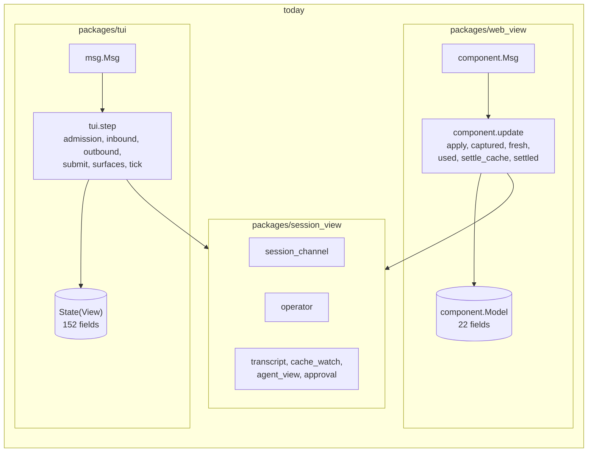

# Extracting the client step into `session_view`

Status: **accepted**; the owner ruled on questions 1 and 2 of section 6
on 2026-09-27 and approved starting S1. Design note for
[issue #569](https://github.com/Roasbeef/loom/issues/569) Part 1. Written
against `main` at `868dfedd8` on 2026-09-27; every line number below was
checked against that tree.

Issue #530 left the terminal and the web view sharing the session lane and
the transcript projection but not the step. The terminal reduces with
`tui.step` over a `Model` of 152 fields; the web view reduces with
`component.update` over a model of 22 fields and its own copy of the
capture, cache and approval folds. This note decides how the step moves
into `session_view`, the R6-portable package, so that the web view runs
the terminal's reducers instead of its own. It settles six things: which
fields of the terminal's model are session state and which are the
terminal's own, the signature of the shared step, how the reducers that
touch both kinds of state are cut, what the web view deletes, the order of
slices, and the questions that were left open, two of which the owner
has since ruled on.

The design points the issue records from the outside review are taken as
given and not re-argued: two records per host (`{shared, view}`), no new
package, the shells follow `operator_page`'s `Observed` and `effect.map`
template, the web shell reads `now()` once at the top of its `update`, and
`rearm` stays the web host's handler for `next_due`.

## Where the step is today

The terminal's whole update is `runtime.settle(step(runtime.message(event,
model), runtime.receive(model)))` (`packages/tui/src/tui.gleam:1702`
(`update`)). `step` takes `msg.Msg` (`tui/msg.gleam:48` (`Msg`)): an
`Input(at, event)` it reduces through `apply_input` and `settle_update`
(`packages/tui/src/tui.gleam:1785` (`apply_input`),
`packages/tui/src/tui.gleam:1862` (`settle_update`)), or an `Arrived`
that `admission.admit` only files (`tui/admission.gleam:60` (`admit`)).
Every reducer reads and writes one record, `State(view)`
(`tui/model.gleam:406` (`State`)), whose `view` field already holds the
terminal's etui render caches (`tui/model.gleam:334` (`View`)). The lane's
outputs join the step's one outbox through `hold_channel`
(`tui/model.gleam:863` (`hold_channel`)), and `runtime.take` returns
them with the model (`tui/runtime.gleam:345` (`take`)).

The web view holds the lane, an inbox and what it derived from the last
capture (`web_view/component.gleam:215` (`Model`)). Its `update`
(`web_view/component.gleam:414` (`update`)) reduces on `Arrived` and
`Ticked`, folds the lane's updates in `apply`
(`web_view/component.gleam:524` (`apply`)), and re-implements the
capture fold (`captured`, `fresh`, `recaptured`), the usage and cache
fold (`used`, `settle_cache`, `settle_pushed`, `noted`) and the submission
fold (`settled`) that `tui/inbound` and `tui/outbound` already contain.
That is the drift the issue names.



## 1. The field split

### The rule

A field is **session state (a)** when a second host would need the same
value to show or act on the session correctly: what the daemon said, what
this client has sent and not yet seen committed, and the bookkeeping the
lane's reads and reads-in-flight need. It is **terminal state (b)** when
only the terminal reads it, or when its type names etui, a terminal
surface, a daemon-control job or a pane reporter. It is a **host handle
(c)** when the shared step must carry it to name the target of an effect
and must never use it: those become type parameters, as the lane's
`socket` and `recorder` did in phase 4
(`session_view/session_channel.gleam:317` (`Channel`)).

Three fields are records that hold both kinds of state and are split
rather than placed. Four fields are counters that only the terminal reads
today but that shared reducers bump; they stay shared as presentation
revisions, because the alternative is comparing the whole record after
every event, which the code avoids on purpose (`tui/tick.gleam:388`
(`refresh_frame_cache`), the comment above it).

The daemon-control jobs, the reconnect, the provisional attachment and the
picker's activity poll are terminal state, not session state. The web
page's transport is a relay the daemon opens for it; it does not launch
daemons, relaunch them, switch attachments or page a catalogue. Keeping
that machinery in the terminal also keeps the P model unchanged: its
`Terminal` machine stands for `tui.step` followed by `runtime.perform`,
and its interleavings are the attachment worker's and the gateway's
(`protocol/models/terminal-attachment/README.md`).

### The terminal's `Model`

152 fields, in the record's own order (`tui/model.gleam:406` (`State`)
through `tui/model.gleam:773` (`view`)). The counts: 80 shared, 65
terminal, 4 handles, 3 split.

| Field | Group | Reason |
|---|---|---|
| `quit` | a | Both hosts stop the loop on it; the web's `Ended` is this plus the reason line. |
| `width`, `height` | b | The terminal's size. |
| `palette` | b | Launch-time colour capability. |
| `input` | b | An etui `TextAreaState`; the web's editor is the browser's. |
| `strand_workspaces` | split | The parked `scrollback` per strand is the session's history window and moves to a shared `Dict(#(session, strand), history_view.State)`; the editor, its history, the offset, anchors and height stay terminal; the record is `StrandWorkspace` (`tui/model.gleam:293`). |
| `restored_workspace` | b | A viewport endpoint the next projection restores. |
| `attachments` | a | What the next submission carries, not editor state; `submit_with_images` sends them (`tui/submit.gleam:393` (`submit_with_images`)), and Part 2 adds images to the page's composer. |
| `history`, `history_index`, `history_draft` | b | The composer's command history. |
| `command_selected` | b | The palette's cursor. |
| `submission_mode` | b | Tab's choice for the next Enter; the web sends its delivery with each submit. The shared `Submit` command carries it. |
| `pending_submission` | a | Whether a mutation is locked behind the lane and whose draft it consumes on `Sent`, decided in `apply_submission` (`tui/outbound.gleam:189`). The web's `drafts` counter is derived from it. |
| `interrupt` | a | The held interrupt waiting for its operation to settle. |
| `submitting` | a | The strand whose prompt is on the way. |
| `queued` | a | Echoes of held prompts, retired by their committed entries. |
| `awaiting_outcome` | a | The one submission whose reply is out. |
| `transcript` | a | The banner, build, configuration, approval and error lines every host shows. |
| `records` | a | The active strand's records from the last cut. |
| `cache` | a | The prompt-cache ledger both hosts fold usage into. |
| `cache_notices` | a | Miss notices; the web files the same ones in `noted` (`web_view/component.gleam:709`). |
| `cache_outlook` | b | The terminal footer's label as of the last tick; the web keeps a label per chip. |
| `scrollback` | a | The bounded history window; history paging is Part 2's second item. |
| `notice` | a | The last line said to the operator; both hosts show one. |
| `queue_editor` | split | Of `queue_editor.State` (`tui/queue_editor.gleam:65`), `fetch`, `awaiting` and `request_id` correlate lane replies and move; `surface`, `selected`, `preview_scroll`, `draft` (an etui editor) and `message` stay. |
| `worktree` | a | A `session_view` state already. |
| `context` | a | A `session_view` state already. |
| `completion`, `completion_owner` | a | Operation boundaries the summary reads; `tui/completion_summary` imports nothing BEAM-only and moves. |
| `summary_surface`, `summary_scroll`, `summary_tab`, `summary_job_selected` | b | The summary panel's own state. |
| `jobs`, `jobs_observed_ms`, `jobs_refresh`, `jobs_awaiting`, `jobs_request`, `jobs_notice` | a | The live-jobs board and its one read in flight. |
| `nudges`, `nudges_refresh`, `nudges_awaiting`, `nudges_request` | a | The advisor's pending queue and its read; Part 2 draws it. |
| `summaries` | a | Summarizer labels and the reads still owed. |
| `goal`, `goal_refresh`, `goal_awaiting`, `goal_request`, `goal_report` | a | The goal board and its command slot. |
| `help_open`, `notes_open` | b | Terminal surfaces. |
| `diff_view`, `diff_scroll_offset`, `diff_row_count`, `diff_worktree_source` | b | The changes pane. |
| `note_board` | a | The last explicit notes read; a board is data. |
| `note_selected`, `note_mode`, `note_scroll` | b | The notes panel's cursor and mode. |
| `notes_requested` | a | The notes target waiting for the lane. |
| `overlay` | b | The modal surface with the keyboard; each variant is a terminal panel. |
| `models`, `skills`, `current_model` | a | What the daemon listed. |
| `workspace` | a | The session's path and branch; the page's header wants it. |
| `strands` | a | The captured strand list. |
| `agent_summary` | b | A string derived from `strands` by `tui/agents`, which imports etui; the terminal derives it at paint instead. |
| `reviewer_rows`, `agent_rows` | a | Both hosts observe them, the web in `fresh` (`web_view/component.gleam:600`). |
| `strip` | split | `roster` is `agent_roster.Roster` and moves; `focus` is the strip's keyboard cursor and stays (`tui/agent_strip.gleam:65` (`State`)). |
| `agent_messages` | a | Provenance-checked sends; the module imports nothing BEAM-only. |
| `advisor_history` | a | The advisor's captured board. |
| `todo_boards`, `todo_seed`, `todo_asked` | a | Each strand's board and the one seed read. |
| `active_strand` | a | The strand the composer addresses; the web's `strand` constant becomes this field. |
| `session`, `session_label` | a | Identity and catalogue name. |
| `local_options` | b | The launch's options, read by session creation. |
| `inbox` | c | `Inbox(source, Message)`; the source is the terminal's subject and the web's `Nil`. |
| `peer` | a | `Attached`, `Disconnected`, `Preview`, `Replaying`; reducers branch on it, and the type is `Peer` (`tui/model.gleam:179`). The web is always `Attached`. |
| `candidate` | b | The provisional attachment: a lane, a `Subject(Nil)` and an inbox inside a job slot, `attachment.Status` (`tui/attachment.gleam:92`). |
| `channel` | c | `Option(Channel(socket, recorder))`. |
| `captured` | a | The last cut and its view. |
| `last_capture`, `notices` | a | Live-delivery witnesses the fixtures read. |
| `daemon_host` | b | The control connection's key and build. |
| `control_request`, `activity_poll`, `reconnect`, `creation_key`, `configuring` | b | Daemon-control job slots; their replies are `weft.Pulled` values (`tui/job.gleam:395` (`ControlReply`)), which R6 keeps out of `session_view`. |
| `approvals` | a | Pending and settled reviews; both hosts project them. |
| `prompted_approvals`, `inspecting_approval` | b | Which questions the terminal's inspector has opened; the page draws every pending record as a card. |
| `unconfirmed` | a | The last mutation with a lost reply. |
| `next_attempt` | b | The next attachment attempt's identity. |
| `replay_state` | a | The two-slot replay of recorded lane updates; it holds lanes, so `attempt_replay.State` (`tui/attempt_replay.gleam:44`) becomes generic over the handles. |
| `replay_inbox` | c | `Inbox(source, attempt.Event)`. |
| `replay_error` | a | A malformed recording stops the shared drain. |
| `next_id` | a | The command counter both hosts encode with. |
| `usage` | a | The captured usage. |
| `generation_started_ms`, `output_rate_tps` | a | The generation clock and the rate it yields. |
| `agent_rail_visible` | b | A pane toggle. |
| `details_expanded` | a | The extent the shared line builders read through `presentation` (`tui/model.gleam:1238`), and `advance_generation_clock` checks it (`tui/tick.gleam:328`); a page will toggle it too. |
| `repaint_phase`, `activity_frame` | b | Frame-local paint state. |
| `activity_started_ms`, `activity_elapsed_s`, `generation_elapsed_s` | a | Elapsed readings the tick advances from the stamp; a chip shows the same figures. |
| `streams`, `tool_tails` | a | The live answer and tool tails. |
| `reading_lines` | b | Frozen transient rows while reading above the tail. |
| `scroll_offset` | b | The viewport. |
| `render_revision` | a | A presentation revision shared reducers bump (`tui/model.gleam:1162` (`invalidate_transcript`)); the terminal compares it with `rendered_revision`, the web ignores it. |
| `rendered_revision`, `rendered_row_count`, `revealed_rows`, `rendered_anchors`, `rendered_gutters`, `record_gutters` | b | The row projection's outputs. |
| `compact_call_cache`, `compact_entry_cache` | a | Line caches keyed by `transcript_line.Line`, read by the shared line builders through `Presentation`. |
| `pending_records` | a | Legacy entries awaiting append. |
| `record_cache_valid` | a | Today a flag cleared at twelve write sites; it becomes a counter the terminal compares, in the shape of `record_cache_epoch`. |
| `record_cache_width`, `record_cache_strand`, `record_cache_details` | b | What the record rows were built for. |
| `frame_revision` | a | A presentation revision (`tui/model.gleam:1051` (`invalidate_frame`)); every `append_system` bumps it. |
| `frame_debt` | b | Frame pacing. |
| `monotonic_time_ms`, `transport_time_ms` | b | The host's clocks; the shell reads them into the stamp. |
| `stamp` | a | The readings the step applies at. |
| `terminal` | b | This terminal's identity in a creation key. |
| `client_build` | a | The build the mismatch line compares; data, read once. |
| `last_frame_ms` | b | Frame pacing. |
| `activity_revision` | a | A revision `mark_activity` bumps from shared reducers (`tui/model.gleam:838` (`mark_activity`)); the terminal's quiet timer reads it. |
| `quiet_for_ms` | b | Idle pacing. |
| `connection_backlog` | a | Set by the shared drain from the inbox it holds (`tui/inbound.gleam:1043` (`drain_connection`)); the terminal's poll reads it. |
| `recorder` | c | `Option(recorder)`. |
| `selection`, `selection_gutters`, `clipboard` | b | Mouse selection and where a copy goes. |
| `herdr_reporter`, `herdr_published` | b | The pane reporter, a host handle the terminal alone performs against; it stays in the terminal's record rather than becoming a type parameter because no shared reducer names it. |
| `outbox` | a | `List(Effect(socket, recorder))`; the terminal moves it into its own outbox at each call boundary, as `hold_channel` does for the lane. |
| `next_job`, `running` | b | Job keys and the runtime's table. |
| `record_cache_epoch` | a | Already the counter shape (`tui/model.gleam:771` (`record_cache_epoch`)). |
| `view` | b | The etui caches themselves. |

The shared record therefore holds no etui type, no `Subject`, no weft
type and no job slot. What it does hold from `tui/` today moves with it:
`completion_summary`, `agent_messages`, `attempt_replay` (made generic
over its lane's handles) and the `Peer`, `Interrupt`,
`UnconfirmedSubmission`, `SubmissionSource`, `GoalReport` and
`ConnectionBacklog` types from `tui/model`. `agents.summary`
(`tui/agents.gleam:816` (`summary`)) stays behind; the terminal derives
the footer string in its projection.

### The web view's `component.Model`

22 fields (`web_view/component.gleam:215` (`Model`)). Thirteen go away
because the shared record holds them; nine stay as the web's view or host
state.

| Field | Fate | Replaced by |
|---|---|---|
| `session_id` | goes | `shared.session`. |
| `expected` | stays (host) | Needed to start the lane at `Opened`. |
| `transport` | stays (host) | The relay and clock. |
| `lane` | goes | `shared.channel`. |
| `filed` | goes | `shared.inbox` with source `Nil`. |
| `shown` | goes | `shared.captured`. |
| `blocks`, `pieces` | stay (view) | Derived from the capture when `shared.render_revision` moves. |
| `agents`, `reviewers` | go | `shared.agent_rows`, `shared.reviewer_rows`. |
| `roster` | goes | `shared.roster`. |
| `cache`, `notices` | go | `shared.cache`, `shared.cache_notices`. |
| `strip` | stays (view) | Derived from the shared roster, rows and cache. |
| `approvals` | goes | `shared.approvals`. |
| `status` | stays (view) | Set from an edge: the first `Captured` and a `Failed` lane. |
| `clock` | goes | `shared.stamp`. |
| `timer`, `armed` | stay (host) | The deadline timer. |
| `notice` | goes | `shared.notice`. |
| `next_id` | goes | `shared.next_id`. |
| `drafts` | stays (view) | Bumped when `shared.pending_submission` clears on a `Sent`. |

## 2. The shared step's signature

No new package: the step lives in `session_view`, in modules named for
what they are today so the final slice is a rename, as phase 4's was
(`docs/adr/013-tui-effects-as-values.md`, the P4a addendum).
`session_view/model` holds the record and the helpers every reducer uses;
`session_view/msg` the message; `session_view/admission` the filing;
`session_view/inbound`, `session_view/outbound`, `session_view/surfaces`
and `session_view/commands` the reducers; and `session_view/step` the
three entry points.

### The message

```gleam
// session_view/msg
pub type Msg(source) {
  /// One event and the readings it is applied at; the step reduces it.
  Input(at: Stamp, event: Event)

  /// Traffic the host received, oldest first; the step files it and
  /// reduces nothing.
  Arrived(arrivals: List(Arrival(source)))
}

pub type Arrival(source) {
  Frame(source: source, message: connection_event.Message)
  Replayed(event: attempt.Event)
}

pub type Stamp {
  Stamp(now_ms: Int, transport_ms: Int)
}

pub type Event {
  /// The host's wake-up: the drains run, the lane ticks, the clocks advance.
  Ticked

  /// The operator acted, in the session's terms.
  Acted(command: Command)
}

pub type Command {
  Submit(text: String, attachments: List(composer.Attachment), delivery: operator.Delivery)
  Interrupt
  Stop(strand: String)
  Decide(id: String, seq: Int, choice: operator.Choice)
  Focus(strand: String)
  SelectModel(name: String)
  Clear
  OlderHistory
  RefreshWorktree
  Quit
}
```

What is a session message and what stays a host message follows from the
split above. `Arrived` and `Ticked` are session messages in both hosts.
The terminal's event variants (`Event`, `tui/msg.gleam:110`), which
are `KeyPressed`, `Pasted`, `Resized`, `Scrolled`, `Pressed`, `Dragged`,
`Released` and `Moved`, stay terminal messages: the key dispatch in
`tui/interaction` reads the overlay, the context surface, the queue
editor and the summary panel
before it decides what a key means (`tui/interaction.gleam:417`
(`update_key`)), and all four are terminal state. The terminal's key
handler therefore ends in one of three ways: it edits terminal state, it
opens or moves a terminal surface, or it produces a `Command` and hands
the shared step an `Acted`. The `JobReplied` arrival
(`tui/msg.gleam:83` (`JobReplied`)) stays terminal, because every slot
it is filed into does.

`Stamp` loses `wall_ms`. The one reader is the session creation key
(`tui/session_control.gleam:574` (`wall_ms`)), which stays in the
terminal, and the terminal's stamp gains it back beside the shared one. The web shell sets `now_ms` and `transport_ms` to the same
reading.

`Command` is the closed set of things an operator does to a session from
either host. The slash commands are not a variant of it. The shell parses
the draft with `command.parse_with_skills`, which is already in
`session_view`; a parse that names a terminal surface (`Help`, `Sessions`,
`Agents`, `Queue`, `Diff`, `Summary`, `Notes`, the context surfaces) is
acted on by the shell and never reaches the step, and every other parse is
wrapped as `Submit` with the raw text. The shared `submit_text` keeps its
arms for the session commands and answers a surface command with a
notice, which no shipped shell can trigger. Splitting `command.Command`
into a surface half and a session half would make that arm unrepresentable
and is a small follow-up (open question 7).

### The model, the effect and the entry points

```gleam
// session_view/model
pub type Model(socket, recorder, source) {
  Model(
    // the 80 shared fields, plus the shared halves of the three splits
    inbox: inbox.Inbox(source, connection_event.Message),
    replay_inbox: inbox.Inbox(source, attempt.Event),
    channel: Option(session_channel.Channel(socket, recorder)),
    recorder: Option(recorder),
    outbox: List(Effect(socket, recorder)),
    ..
  )
}

// session_view/step
pub type Effect(socket, recorder) {
  /// An output of the adopted lane: a frame, a close or a note.
  Lane(session_channel.Out(socket, recorder))

  /// A message that arrived with no lane to note it under.
  Recorded(recorder: recorder, message: connection_event.Message)
}

pub fn new(session: String, workspace: workspace.Context, inbox: Inbox(source, Message),
  replay_inbox: Inbox(source, attempt.Event), recorder: Option(recorder),
  client_build: build_identity.Identity, at: Stamp) -> Model(socket, recorder, source)

pub fn update(model: Model(socket, recorder, source), message: Msg(source))
  -> #(Model(socket, recorder, source), List(Effect(socket, recorder)))

pub fn attach(model: Model(socket, recorder, source),
  lane: session_channel.Channel(socket, recorder),
  inbox: Inbox(source, Message), at: Stamp) -> Model(socket, recorder, source)

pub fn next_due(model: Model(socket, recorder, source)) -> Option(Int)
```

Three type parameters rather than the two the lane has, because the inbox
is keyed by the subject a frame was read from and that subject is not the
socket (`tui/buffered.gleam:44` (`Inbox`)). The web passes `Nil` for
`recorder` and `source`, as it passes `Nil` for the lane's recorder today.

`Effect` is two variants because those are the two effects the shared
reducers decide. Every `Channel` effect comes through `hold_channel`
(`tui/model.gleam:863` (`hold_channel`)), and the one `Record` a shared
reducer queues is the channelless arrival
(`tui/inbound.gleam:1089` (`handle_connection_message`), its `None`
arm). The input's own recording line is queued by `start_step` before
the reducer runs
(`tui/model.gleam:990` (`start_step`)); the terminal's shell keeps
queuing it, ahead of the shared call, so the recording's order holds. The
terminal maps `Recorded(recorder, message)` to
`recording.append(recorder, recording.Arrived(message))`, which writes the
bytes it writes today.

`update` is `tui.step` with the terminal removed: an `Input` stores the
stamp, dispatches `Ticked` to the drains and `Acted` to the command arms,
runs the shared half of `settle_update` (the context, nudge and goal edges,
`surfaces.sync_context` and its siblings, which compare the model before
and after and read only shared fields; `tui/surfaces.gleam:850`
(`sync_context`)), and returns the outbox oldest first. An `Arrived`
files and returns nothing, as it does now. `attach` is the shared part of
adopting a lane: it stores the lane and inbox, resets the per-session
fields the adoption arm resets today (`tui/interaction.gleam:236`
(`candidate_outcome`), its `Adopted` arm), and marks the peer
`Attached`. `next_due` is
`option.then(model.channel, session_channel.next_due)`; a host that has
other reasons to wake, as the terminal does, combines it with its own
(`tui/tick.gleam:590` (`lane_wait`)).

### The shells

```mermaid
flowchart TB
    subgraph tshell["terminal shell: packages/tui"]
        tin(["etui event"]) --> tmsg["runtime.message<br/>stamp, keymap"]
        tmsg --> tstep["tui.step over TuiModel{shared, view}"]
        tstep -- "key edits a surface" --> tview[("view")]
        tstep -- "Acted(command) / Ticked / Arrived" --> supd["step.update(shared, msg)"]
        supd --> sm[("shared")]
        supd -- "List(step.Effect)" --> twrap["list.map(effect.Step)"]
        twrap --> tout["outbox: Step, Attachment,<br/>StartJob, Record, Herdr, ..."]
        tstep -- "before/after edges" --> tedge["reconnect on a failed lane,<br/>open the approval inspector,<br/>reset overlays on a new session"]
    end
    subgraph wshell["web shell: packages/web_view"]
        win(["Arrived / Ticked / Opened"]) --> wnow["at = transport.now()"]
        wnow --> wupd["step.update(shared, Arrived)<br/>then step.update(shared, Input(Ticked))"]
        wupd --> wperf["perform: one effect.from<br/>over Lane outputs"]
        wupd --> wrearm["rearm(step.next_due)"]
        wupd --> wderive["derive blocks, pieces, strip<br/>when render_revision moved"]
        op["operator_page: Observed(component.Msg)<br/>Submitted -> Acted(Submit)<br/>Decided -> Acted(Decide)"] -- "effect.map(Observed)" --> win
    end
```



The terminal keeps `tui.step(msg.Msg, TuiModel)`. `TuiModel` is
`TuiModel(shared: step.Model(Connection, Recorder, Subject(Message)),
view: View)`, where `View` absorbs the 65 terminal fields and the
terminal halves of the splits. A terminal reducer that calls into the
shared step stores the result through `hold_shared`, the same discipline
as `hold_channel`: the shared outbox is moved into the terminal's at the
point of the call, so a step that decides a lane close, then a terminal
`Discard`, then a lane write (`tui/interaction.gleam:307` (`Discard`))
still performs them in that order. The terminal's effect type gains one
variant, `Step(step.Effect(Connection, Recorder))`,
and `perform_io` gains two arms (`tui/runtime.gleam:423`
(`perform_io`)).

The web's `component.Model(socket)` becomes
`WebModel(shared: step.Model(socket, Nil, Nil), view: WebView)`.
`component.update` reads the clock once at its top,
`let at = model.view.transport.now()`, and builds the stamp from it; the
selector mappings that read `transport.now()` today, in `open`
(`web_view/component.gleam:362`) and `arm`
(`web_view/component.gleam:400`), stop carrying `at`, and the read in
`commanded` (`web_view/component.gleam:939`) goes with them. This is the
terminal's `runtime.stamp` shape (`tui/runtime.gleam:80` (`stamp`)). An
`Arrived`
becomes two shared calls in one Lustre message, `Arrived` then
`Input(Ticked)`, which is the delivery ADR-014 describes for a host that
wakes on arrival and still one render per burst. `rearm` stays as it is,
reading `step.next_due` (`web_view/component.gleam:1024` (`rearm`)).
`operator_page` keeps its `Observed` and `effect.map` layering over the
component (`web_view/operator_page.gleam:88` (`update`)); its
`Submitted` and `Decided` become `Acted(Submit(..))` and
`Acted(Decide(..))` after the page's own checks on the draft's length and
emptiness, which are the page socket's limits and not the session's
(`web_view/component.gleam:891` (`submit`)).

## 3. Admission and reducers

### Admission

`admission.admit` splits along its arms (`tui/admission.gleam:64`
(`admit_one`)). `Frame` and `Replayed` move: a frame whose source is the
shared inbox's is pushed, a replayed event is pushed, and a frame from any
other source is dropped, which is the S2 rule. `JobReplied` stays in the
terminal with the slots it fills. The terminal's `runtime.receive`
(`tui/runtime.gleam:117` (`receive`)) already admits the jobs first and
the frames after; it now routes the waiting attempt's frames to
`attachment.push_frame` itself and hands the rest to the shared step as
`Arrived`. The relative order of a candidate's frames and the adopted
inbox's frames does not matter, since they enter different buffers, and
each buffer keeps its own order. `admission_test`'s twenty generated runs
hold across the change because the reducers take from the same buffers at
the same points.

### Reducers that move whole

These read and write shared fields only, or read a terminal field that
the split turns into a shared one:

- The lane fold: `tick_channel`, `apply_channel_update`, `reconcile_cut`,
  `request_decisions`, `apply_cut` and `render_cut`
  (`tui/inbound.gleam:216` (`tick_channel`) through
  `tui/inbound.gleam:607` (`render_cut`)), less the four writes named
  below.
- The connection drain and the event fold: `drain_connection`,
  `handle_connection_message`, `handle_presentation_message`,
  `apply_event` and everything under it: streams, tool tails, usage, the
  cache watch, summaries, schedules, skills and models
  (`tui/inbound.gleam:1043` (`drain_connection`),
  `tui/inbound.gleam:1150` (`apply_event`)).
- Submission bookkeeping: `send_frame` (`tui/outbound.gleam:146`),
  `send_via`, `apply_submission`, `discard_own_turn` and
  `mutation_refusal`, less the `clear_composer` call and the queue
  editor's `request_id`.
- The command arms: `interrupt_active` (`tui/submit.gleam:731`),
  `stop_strand`, `switch_active_strand` (`tui/submit.gleam:902`),
  `select_model`, `decide` (`tui/inbound.gleam:1015`), `send_prompt_to`,
  `cancel_pending` and `service_history`.
- The auxiliary reads and their edges: every `service_*_read` from
  `service_todo_seed` (`tui/surfaces.gleam:84`) onward, `sync_context`,
  `sync_advisor_nudges`, `sync_goal`, `receive_jobs`, `receive_goal` and
  `receive_advisor_nudges`, less `notes_target` and `notes_surface`.
- The tick's clocks: `advance_activity_indicator` (`tui/tick.gleam:293`)
  and `advance_generation_clock` read the stamp and shared fields;
  `drain_replay` (`tui/tick.gleam:200`) and `apply_replay_change`.
- `queue_owner`, `queue_namespace`, `active_strand_phase`,
  `append_system`, `append_error`, `append_notice`, `start_step`, `emit`,
  `record`, `hold_channel` and `presentation` from `tui/model`.

### Reducers that split, and the two shapes

A reducer that touches both kinds of state is cut in one of two ways, and
which way follows from which side decides.

**The shared side decides; the shell reacts to an edge.** The shared
reducer keeps its decision and drops the terminal write. The terminal
shell, after the shared call, compares `before.shared` with
`after.shared` and makes the terminal write itself. This is the shape
`surfaces.sync_context(before, after)` already has
(`tui/surfaces.gleam:850` (`sync_context`)) and the shape
`refresh_render_cache(before, after)` has (`tui/projection.gleam:48`
(`refresh_render_cache`)); the shell gains one more before-and-after
pass beside them. It is right when the terminal write is a consequence of
a session fact.

**The shell decides; the shared step takes a command.** The terminal
reducer keeps its dispatch on terminal state and hands the shared step a
`Command` or a call for the session half. It is right when the terminal
knows something the session does not, such as which pane is open.

The worst cases in the code, and the cut for each:

1. **`render_cut`** (`tui/inbound.gleam:607` (`render_cut`)) writes 31
   fields; four touch terminal state. `strip: agent_strip.observe(..)`
   becomes `roster: agent_roster.observe(..)`, the strip's focus being
   untouched by a capture. `cache_outlook` is reset when the active
   strand's watch is gone; the shell's edge does the same on
   `before.shared.cache != after.shared.cache`. `strand_workspaces` is
   pruned of retired strands; the shared half prunes its history dict, and
   the shell prunes its editor dict on the same `strands` edge.
   `agent_summary` is dropped and derived at paint. The other 27 writes
   are shared and the function moves as it is.

2. **`select_workspace`** (`tui/inbound.gleam:2688`
   (`select_workspace`)) parks the editor, the history window, the
   viewport and the anchors under one key and restores another's. It
   splits into `step.select_workspace`, which parks and restores
   `scrollback` and clears the per-session boards, and a terminal
   `park_editor` that parks `input`, `attachments`' editor half,
   `history`, `scroll_offset`, `rendered_anchors` and the viewport height
   under the same key. Both run on the same edge, `before.shared.session`
   and `active_strand` against `after`'s, so a switch from a strand key,
   the strip, a capture that renames the session or a replay's `Adopt`
   parks both halves. `restore_returned_draft`
   (`tui/inbound.gleam:1588` (`restore_returned_draft`)) is the one
   shared reducer that writes a parked editor: the returned text becomes a
   shared field, `returned_drafts: List(#(strand, text))`, and the shell
   appends it to the editor it owns.

3. **`apply_channel_update`'s `Failed` arm** (`tui/inbound.gleam:378`
   (`Failed`)) closes a `GoalInspector` overlay, fails the
   worktree navigator and starts the reconnect job (`tui/inbound.gleam:195`
   (`begin_reconnect`)). The shared arm keeps the peer transition, the
   cleared reads and the error line. The shell's edge on
   `before.shared.peer == Attached && after.shared.peer == Disconnected`
   closes the overlay and starts the job, which is a `StartJob` the
   terminal already owns. The same edge covers the arm of
   `handle_presentation_message` for `Closed` (`tui/inbound.gleam:1125`).

4. **`apply_submission`** (`tui/outbound.gleam:189`
   (`apply_submission`)) writes `queue_editor.request_id` on a sent
   queue command and clears the composer on a sent prompt. The queue
   editor's lane correlation moves to the shared half of the split, so
   that write stays in the reducer. The composer clear becomes an edge:
   `pending_submission` goes from `Some(ComposerSubmission)` to `None`
   with a `Sent` disposition, and the shell clears its editor and
   remembers the text in the input history. The web's `drafts` counter is
   the same edge, so the two hosts empty their editors on the same fact.

5. **`submit_text`** (`tui/submit.gleam:124` (`submit_text`)) parses
   the draft and dispatches over `command.Command`, opening overlays for
   `Help`, `Models`, `Sessions` and the panels and sending frames for the
   rest. The shell parses first, as described under the message: surface
   commands are handled in the terminal, `Models` opens the selector and
   then hands the step a `Submit` so the `models` frame is still sent, and
   every other parse is a `Submit` the shared `submit_text` dispatches as
   it does today. `submit` itself (`tui/submit.gleam:63` (`submit`))
   stays in the terminal because it reads `model.input`, and its
   `pending_submission` marker moves into the shared `Submit` arm.

6. **`present_pending_approval` and `close_settled_approval`**
   (`tui/inbound.gleam:579` (`present_pending_approval`),
   `tui/inbound.gleam:525` (`close_settled_approval`)) open and close the
   approval inspector from the projected approvals. Both are terminal:
   the page has no inspector and draws every pending record. They become
   the shell's edge on `after.shared.approvals`, run after every shared
   call that can change it, which is where `apply_cut` and the `LookedUp`
   arm call them today. `prompted_approvals` moves to the view with them.
   `decide_captured_approval` (`tui/inbound.gleam:989`
   (`decide_captured_approval`)) becomes the inspector producing
   `Acted(Decide(id, seq, choice))`, with `AllowForSession` mapped through
   `operator.Choice`, which already has it.

7. **`settle_update`** (`packages/tui/src/tui.gleam:1862`
   (`settle_update`)) runs nine calls after every event. Three are
   shared and move into `step.update`'s own settle: `sync_context`,
   `sync_advisor_nudges`, `sync_goal`. Six are terminal and stay:
   `request_visible_worktree` on a diff pane appearing, which becomes
   `Acted(RefreshWorktree)` because only the shell knows the pane appeared
   (`tui/inbound.gleam:2802` (`request_visible_worktree`) reads
   `layout.diff_shown`); `request_history_for_view`, which becomes
   `Acted(OlderHistory)` for the same reason
   (`tui/interaction.gleam:1529` (`request_history_for_view`) reads the
   viewport); `publish_herdr`; `refresh_render_cache`; the viewport snap;
   and `refresh_frame_cache`. The compile-time boundary the comment above
   `apply_input` describes keeps its shape: the shared `update` applies
   its settle to a parameter, and the terminal's `settle_update` applies
   its remaining steps to `updated` as it does now
   (`packages/tui/src/tui.gleam:1785` (`apply_input`)).

8. **The tick** (`tui/tick.gleam:122` (`update_tick`)) is a fixed
   order of drains: replay, strip, activity, control, candidate,
   reconnect, activity poll, configuration, connection, then the settle
   chain. The order is kept by having the terminal's tick call the shared
   `Ticked` at the point where the connection drain sits today, after the
   terminal's job drains and the candidate's poll. `tick_strip`
   (`tui/inbound.gleam:3037` (`tick_strip`)) reads the strip's focus and
   stays; `advance_cache_outlook` (`tui/tick.gleam:357`
   (`advance_cache_outlook`)) writes the footer label and stays, reading
   `shared.cache` and the stamp. `settle_tick`'s quiet-time and backlog
   bookkeeping stays terminal (`tui/tick.gleam:142` (`settle_tick`)).

9. **Key dispatch** (`tui/interaction.gleam:1085`
   (`update_conversation_key`)) reads `help_open`, `notes_open`, the
   overlay and the editor, and calls both kinds of reducer. It stays a
   terminal function over `TuiModel`, and the calls it makes into shared
   reducers become `Acted` commands or direct calls through `hold_shared`.
   `update_ready_key`'s order, Escape before the drain
   (`tui/interaction.gleam:1219` (`update_ready_key`)), is kept because
   the shell decides when to call the shared drain, as it does today.

## 4. What the web view deletes

Once the component drives the shared step, its orchestration is the
shell's `update`, `perform` and `rearm`, and its view derivation. The
table maps each function in `web_view/component.gleam` to what replaces
it.

| Today | After | Where the logic lives |
|---|---|---|
| `update`'s `Opened` arm (`web_view/component.gleam:421` (`Opened`)) | `step.attach(shared, session_channel.start(socket, expected, now: at), inbox.new(Nil), stamp)`, then `Ticked` | `session_view/step` |
| `Refused` | view `status: Ended(reason)` | shell |
| `Arrived` (`web_view/component.gleam:444` (`Arrived`)) | `step.update(Arrived(frames))` then `step.update(Input(stamp, Ticked))` | `session_view/step` |
| `Ticked` | `step.update(Input(stamp, Ticked))`, then the strip's label check | `session_view/step`, shell |
| `reduce` (`web_view/component.gleam:463`), `drained`, `take_filed`, `received` | the shared `Ticked`: `drain_connection` then `tick_channel` | `session_view/inbound` |
| `apply` (`web_view/component.gleam:524`) | `apply_channel_update` | `session_view/inbound` |
| `captured` (`web_view/component.gleam:575`), `fresh`, `recaptured` | `reconcile_cut`, `apply_cut`, `render_cut` | `session_view/inbound` |
| `used` (`web_view/component.gleam:628`), `settle_cache`, `settle_pushed`, `noted` | `receive_usage` (`tui/inbound.gleam:1995`), `settle_usage`, `settle_pending_cache`, `note_cache_miss` | `session_view/inbound` |
| `relaned` (`web_view/component.gleam:732`), `restripped`, `strip_of`, `outlook`, `running_ms`, `strands` | `derive(before, after)`: rebuild blocks, pieces and the strip when `shared.render_revision` moved | shell, view state |
| `ticked` (`web_view/component.gleam:811` (`ticked`)) | the same per-chip label comparison over `shared.cache` and `shared.stamp` | shell |
| `settled` (`web_view/component.gleam:838` (`settled`)) | `apply_submission`; `drafts` bumps on the `pending_submission` edge | `session_view/outbound`, shell |
| `submit` (`web_view/component.gleam:891` (`submit`)) | the page's empty and length checks, then `Acted(Submit(text, [], delivery))` | shell, `session_view/commands` |
| `decide` (`web_view/component.gleam:930` (`decide`)) | `Acted(Decide(id, seq, choice))`; the drawn-sequence check is `operator.drawn` inside the shared arm | `session_view/commands` |
| `commanded` (`web_view/component.gleam:939`), `flushed` | the shell's `update`: stamp, shared call, `perform`, `rearm` | shell |
| `perform` (`web_view/component.gleam:986` (`perform`)) | unchanged, over `step.Effect(socket, Nil)`: `Lane(Transmit)`, `Lane(Shut)`; `Note` and `Recorded` are `Nil` | shell |
| `rearm` (`web_view/component.gleam:1022` (`rearm`)) | unchanged, reading `step.next_due(shared)` | shell |
| `open`, `arm`, `waiting`, `init`, `new` | unchanged, less the clock reads in the mappings | shell |
| `activity` (`web_view/component.gleam:1150` (`activity`)) | `model.active_strand_live(shared)` | `session_view/model` |
| `lines`, `rows`, `pieces`, `strip`, `addressed`, `status`, `pending`, `notice`, `drafts`, `attachment`, `lane`, `session_id` | accessors over `{shared, view}` | shell |
| `view`, `heading`, and the region modules `web_view/view/heading`, `strip` and `lane` | unchanged | view |

What the page gains without new code: strand focus (`Acted(Focus(strand))`
switches the column, which is Part 2's first item), history paging
(`OlderHistory`), the live answer and tool tails (`streams` and
`tool_tails` are shared and `transcript_lines` already draws them), the
notes, goal, jobs and nudge boards, and a build-mismatch line. Each still
needs its view.

## 5. Slicing

Six slices, each landing green on its own, in the way phase 2's S1 to S6
did (`docs/adr/013-tui-effects-as-values.md`, the phase 2 addenda). The
proofs named are the ones the issue requires plus the ones each slice
puts at risk.

**S1: the two records, no move.** `tui/model` gains `Shared` and
`TuiModel(shared, view)`; every reducer changes its field paths and
nothing else. `record_cache_valid` becomes a counter here, since it is a
field-shape change with no behaviour, and `agent_summary` becomes a
projection-time derivation. The three splits are made: `strand_workspaces`
into two dicts, `queue_editor` into its lane half and its editor half, and
`strip` into `roster` and `strip_focus`. `hold_shared` is introduced and
every terminal reducer that calls a shared one stores through it.
*Proves:* the whole `tui` suite; the replay snapshot `replay-transcript.txt`
and the golden recording (`packages/tui/test/recording_effects_test.gleam:53`
(`a_scripted_session_records_the_golden_bytes_test`)); `loom replay
--all --plain` byte-identical between the two builds;
`scripts/tui_perf.sh events` and `burst 500` within noise (the idle tick
was 7,478 reductions at the last measurement). The P model is untouched.
*Size:* about 40 modules and a few thousand changed lines, all field
paths; the largest mechanical slice.

**S2: the handles become type parameters.** `Shared` becomes
`Shared(socket, recorder, source)`; `channel`, `inbox`, `replay_inbox`
and `recorder` take the parameters; `attempt_replay.State` becomes
generic; the shared `Effect(socket, recorder)` with `Lane` and `Recorded`
is split out of `tui/effect.Effect`, which gains `Step(..)`. `Stamp`
loses `wall_ms` to the terminal. *Proves:* `effects_test`,
`recording_effects_test`, `session_channel_property_test` (unchanged by
construction: it drives the lane directly), and the P model's ten cases
at their current schedule count. *Size:* `tui/model`, `tui/effect`,
`tui/runtime`, `tui/attempt_replay`, `tui/terminal_lane`; a few hundred
lines.

**S3: the shared `Msg` and the reducer cut.** The largest semantic slice,
in three landings. *S3a:* `session_view`-shaped `Msg`, `Event` and
`Command` types in `tui/msg`; the frame and replay arms of admission take
`Shared`; the lane fold, event fold and tick clocks take and return
`Shared`, with the terminal writes in `render_cut`, the `Failed` arm and
`select_workspace` pulled out into `settle_update` edges. *S3b:* the
command arms and `apply_submission` take `Shared`; `submit_text` splits
into the shell's parse and the shared dispatch; the approval inspector's
open and close become edges. *S3c:* the `service_*` reads and the
`sync_*` edges take `Shared`, and `step.update`'s own settle is formed.
*Proves:* after each landing, the `tui` suite, `admission_test`'s
generated runs, `poll_timeout_test`, `runtime_receive_test`,
`session_pushed_test`, the two replay checks, and `erlc +time` on
`tui`, `tui@inbound`, `tui@interaction` and `tui@submit` against the
figures in the phase 3 addendum. *Size:* `inbound`, `outbound`, `submit`,
`surfaces`, `tick`, `interaction`, `tui.gleam`; two to three thousand
lines moved between functions, few added.

**S4: the move.** `tui/model`'s shared record and helpers,
`tui/msg`, the frame and replay admission, `tui/inbound`, `tui/outbound`,
`tui/surfaces`, the shared half of `tui/submit`, `tui/completion_summary`,
`tui/agent_messages` and `tui/attempt_replay` move to `session_view`
under the names in section 2, and `step.update`, `attach`, `new` and
`next_due` are written as the entry points `tui.step` calls. *Proves:*
`make lint-session_view` passes R6 at error level, `gleam export
package-interface` shows no BEAM type in the new modules, the `tui` suite
passes with only import lines changed, and the replay is byte-identical.
*Size:* renames of about seven thousand lines plus `step.gleam`, under
two hundred lines new.

**S5: the web view drives the step.** `component.Model` becomes
`{shared, view}`; `update` reads the clock at its top; `Opened`,
`Arrived` and `Ticked` call the step; `submit` and `decide` wrap
commands; the functions in section 4's table are deleted; `derive`
rebuilds blocks, pieces and the strip on the revision edge. *Proves:*
`component_test` (with `at` supplied by the fixture's transport clock
rather than in messages), `delivery_test`'s render counts per burst (one
and three), `operator_page_test`, `page_test`, the client's `ui_*` tests,
`web_view_parity_test`, and a hand check in a browser of the operator
page, the observer page and a session with a running strand. *Size:*
`component.gleam` loses about 450 lines and gains about 150;
`operator_page.gleam` changes its two command arms; `client/daemon/ui_socket`
is untouched.

**S6: the record.** ADR-014 gains an addendum saying the four blockers
are closed and how; `packages/session_view/CLAUDE.md`,
`packages/tui/CLAUDE.md` and `packages/web_view/CLAUDE.md` with their
mirrors; `docs/architecture/client.md`'s layering section, `terminal.md`'s
loop section, `web-view.md`'s "Time" paragraph and `delivery.md`'s web
steps; `docs/next.md`. *Proves:* `make doc-check`.

S1 can start now. S5 must wait for S4, and S3's landings for S2; nothing
else is ordered. The first pull request is S1 alone, so that its size is
reviewed as the mechanical change it is.

## 6. Rulings, risks and open questions

The first two were decided by the owner on 2026-09-27, as recommended.
The rest are open, for the implementer to settle in the slice that meets
them.

1. **Decided (owner, 2026-09-27): commands, not a shared key
   vocabulary.** ADR-014's second blocker proposed engine-owned key and
   pointer types so that the key handlers could move. That path is not
   taken: the handlers read four terminal surfaces before they decide,
   and moving them would move the surfaces. Keys stay in the terminal
   shell, and both shells emit the same closed `Command` set; the web
   maps DOM events to it, which is what it does today for its two
   handlers. `tui/interaction` stays in the terminal at its current
   size. S6 records the ruling in an ADR-014 addendum amending blocker 2.

2. **Decided (owner, 2026-09-27): daemon control, reconnect and the
   attachment jobs stay terminal-only.** The catalogue, the relaunch and
   the provisional attempt live in the terminal shell and the page does
   not reuse them. Part 2's session sidebar mounts one component per
   session, as ADR-014's direction section already says; the daemon side
   lists sessions from its own registry rather than through the control
   protocol the terminal speaks.

3. **Presentation revisions in the shared record.** `render_revision`,
   `frame_revision`, `activity_revision`, `record_cache_epoch` and the
   counter that replaces `record_cache_valid` are bumped by shared
   reducers and read only by the terminal. They are in the shared record
   because a reducer that changes a transcript line has to say so, and
   the alternative, comparing the whole record after every event, is
   what the frame cache's design refuses. *Recommendation:* keep them,
   document them in `session_view/model` as revisions a host may compare
   and may ignore, and have the web's `derive` compare `render_revision`
   so it stops re-projecting on a capture that changed nothing, which is
   an invariant its `CLAUDE.md` already states.

4. **Compile time.** The step's settle chains are the two places the
   Erlang inliner has cost a minute before (the comment above
   `packages/tui/src/tui.gleam:1785` (`apply_input`)). S3 creates a third
   chain, the shell's edges. *Recommendation:* every S3 landing measures
   `erlc +time` on the generated modules and keeps the parameter boundary
   in each of the three chains; the `beam-compile-review` skill has the
   procedure.

5. **Allocation per event.** Today one event copies one 152-field record
   per field write. After S1 a shared write copies an 80-field record and
   the two-field outer; a terminal write copies a 65-field record and the
   outer; a reducer that writes both copies both. The idle tick should get
   cheaper and a `render_cut` about the same. *Recommendation:* S1's
   proof includes `tui_perf.sh events`, `burst 500` and `growth 4096`,
   alternating before and after; a rise over two percent on the idle tick
   is a finding.

6. **The notice's level.** The web draws `Warned` differently from `Said`
   (`web_view/component.gleam:181` (`Notice`)); the shared `notice` is a
   string, and the terminal writes it at about 120 sites.
   *Recommendation:* keep the string in S1 through S5 and draw every
   shared notice as `Said`; type it afterwards if the page needs the
   distinction, since a typed notice changes no terminal frame.

7. **Slash commands mix surfaces and session commands.**
   `command.Command` has both, so the shared `submit_text` keeps arms it
   can only answer with a notice. *Recommendation:* in S3b split
   `session_view/command` into `Surface` and `Session` variants under one
   parse, so the shell's routing is a `case` on the outer variant and the
   shared dispatch is exhaustive over the inner one.

8. **The web reads its clock in `update`.** This reverses the sentence in
   `docs/architecture/web-view.md` that `update` reads no clock, and
   `component_test` builds `Arrived([frame], 0)` with its own readings.
   *Recommendation:* the fixture's `Transport` gains a settable clock and
   the tests set it where they passed `at`; the paragraph is rewritten in
   S6.

9. **The candidate's frames and the shared inbox.** The adopted inbox's
   source and the attempt's frames subject are compared by admission
   today in one function. After the split the comparison is in two
   places, the terminal's routing and the shared filing. The S2 swap
   regression in `runtime_receive_test` must still fail when either place
   is wrong, and the phase 3 mutation "admission files a frame from any
   subject", which failed eight tests, must fail as many when applied to
   either. *Recommendation:* re-run the phase 3 mutation table's admission
   rows in S3a and record the result in the ADR-014 addendum.

10. **`details_expanded` as shared state.** It is a terminal toggle
    today, placed in the shared record because the shared projection and
    the generation clock read it. A page that never toggles it holds a
    field it never writes. *Recommendation:* accept; the page will toggle
    it when Part 2 adds a details control, and a shared `extent` is what
    keeps `presentation` a function of the shared record alone.
