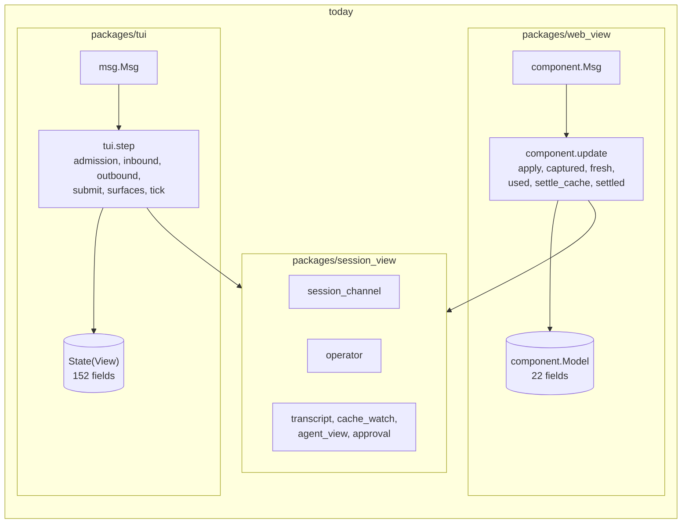

# Extracting the client step into `session_view`

Status: **accepted and implemented**; the owner ruled on questions 1 and 2 of section 6
on 2026-09-27 and approved starting S1. Design note for
[issue #569](https://github.com/Roasbeef/loom/issues/569) Part 1. Written
against `main` at `868dfedd8` on 2026-09-27. S1 has since split the
terminal's model; the line numbers below were re-pointed to the tree after
S1, and where S1 renamed a cited type the citation names its successor
(`State` is now `Model`, and the render caches' `View` is now `Caches`).
The field table still describes the record as it stood before the split.
S2 has since made the shared record's host handles type parameters; where
it departed from this note, the S2 entry in section 5 says how and why.
S3 was re-sliced on 2026-09-28, with the owner's approval, after a census
found that section 3's lists miss much of what the lane and event folds
reach; section 5's S3 entry gives the census and the new landings, and
S3a′ to S3e′ have landed. S4 has landed: the shared step's modules are
in `session_view`. S5 has landed: the web view drives the shared step
through `step.update`, the entry the ruling on question 12 chose. S6 has
landed: ADR-014's addendum of 2026-09-29 records that its four blockers are
closed, and the package and architecture documents describe the tree as it
stands. Part 1 of issue #569 is done.

Issue #530 left the terminal and the web view sharing the session lane and
the transcript projection but not the step. The terminal reduces with
`tui.step` over a `Model` of 152 fields; the web view reduces with
`component.update` over a model of 22 fields and its own copy of the
capture, cache and approval folds. This note decides how the step moves
into `session_view`, the R6-portable package, so that the web view runs
the terminal's reducers instead of its own. It settles six things: which
fields of the terminal's model are session state and which are the
terminal's own, the signature of the shared step, how the reducers that
touch both kinds of state are cut, what the web view deletes, the order of
slices, and the questions that were left open, two of which the owner
has since ruled on.

The design points the issue records from the outside review are taken as
given and not re-argued: two records per host (`{shared, view}`), no new
package, the shells follow `operator_page`'s `Observed` and `effect.map`
template, the web shell reads `now()` once at the top of its `update`, and
`rearm` stays the web host's handler for `next_due`.

## Where the step is today

The terminal's whole update is `runtime.settle(step(runtime.message(event,
model), runtime.receive(model)))` (`packages/tui/src/tui.gleam:1764`
(`update`)). `step` takes `msg.Msg` (`tui/msg.gleam:59` (`Msg`)): an
`Input(at, event)` it reduces through `apply_input` and `settle_update`
(`packages/tui/src/tui.gleam:2262` (`apply_input`),
`packages/tui/src/tui.gleam:2263` (`settle_update`)), or an `Arrived`
that `admission.admit` only files (`tui/admission.gleam:68` (`admit`)).
Every reducer reads and writes one record, `State(view)`
(`tui/model.gleam:392` (`Model`)), whose `view` field already holds the
terminal's etui render caches (`tui/model.gleam:332` (`Caches`)). The lane's
outputs join the step's one outbox through `hold_channel`
(`tui/model.gleam:1029` (`hold_channel`)), and `runtime.take` returns
them with the model (`tui/runtime.gleam:361` (`take`)).

The web view held the lane, an inbox and what it derived from the last
capture in its own `Model`, one record of 22 fields. Its `update` reduced
on `Arrived` and `Ticked`, folded the lane's updates in `apply`, and
re-implemented the capture fold (`captured`, `fresh`, `recaptured`), the
usage and cache fold (`used`, `settle_cache`, `settle_pushed`, `noted`) and
the submission fold (`settled`) that `tui/inbound` and `tui/outbound`
already contain. That is the drift the issue names. S5 deleted those
functions; this section and the next two describe the code as the note was
written, so they cite no lines in `web_view/component.gleam` for what S5
removed.



## 1. The field split

### The rule

A field is **session state (a)** when a second host would need the same
value to show or act on the session correctly: what the daemon said, what
this client has sent and not yet seen committed, and the bookkeeping the
lane's reads and reads-in-flight need. It is **terminal state (b)** when
only the terminal reads it, or when its type names etui, a terminal
surface, a daemon-control job or a pane reporter. It is a **host handle
(c)** when the shared step must carry it to name the target of an effect
and must never use it: those become type parameters, as the lane's
`socket` and `recorder` did in phase 4
(`session_view/session_channel.gleam:403` (`Channel`)).

Three fields are records that hold both kinds of state and are split
rather than placed. Four fields are counters that only the terminal reads
today but that shared reducers bump; they stay shared as presentation
revisions, because the alternative is comparing the whole record after
every event, which the code avoids on purpose (`tui/tick.gleam:388`
(`refresh_frame_cache`), the comment above it).

The daemon-control jobs, the reconnect, the provisional attachment and the
picker's activity poll are terminal state, not session state. The web
page's transport is a relay the daemon opens for it; it does not launch
daemons, relaunch them, switch attachments or page a catalogue. Keeping
that machinery in the terminal also keeps the P model unchanged: its
`Terminal` machine stands for `tui.step` followed by `runtime.perform`,
and its interleavings are the attachment worker's and the gateway's
(`protocol/models/terminal-attachment/README.md`).

### The terminal's `Model`

152 fields, in the record's own order as it stood before S1, which split
it into `Shared` (`session_view/model.gleam:135`) and `View`
(`tui/model.gleam:399`). The counts: 80 shared, 65
terminal, 4 handles, 3 split.

| Field | Group | Reason |
|---|---|---|
| `quit` | a | Both hosts stop the loop on it; the web's `Ended` is this plus the reason line. |
| `width`, `height` | b | The terminal's size. |
| `palette` | b | Launch-time colour capability. |
| `input` | b | An etui `TextAreaState`; the web's editor is the browser's. |
| `strand_workspaces` | split | The parked `scrollback` per strand is the session's history window and moves to a shared `Dict(#(session, strand), history_view.State)`; the editor, its history, the offset, anchors and height stay terminal; the record is `StrandWorkspace` (`tui/model.gleam:293`). |
| `restored_workspace` | b | A viewport endpoint the next projection restores. |
| `attachments` | a | What the next submission carries, not editor state; `submit_with_images` sends them (`session_view/commands.gleam:687` (`submit_with_images`)), and Part 2 adds images to the page's composer. |
| `history`, `history_index`, `history_draft` | b | The composer's command history. |
| `command_selected` | b | The palette's cursor. |
| `submission_mode` | b | Tab's choice for the next Enter; the web sends its delivery with each submit. The shared `Submit` command carries it. |
| `pending_submission` | a | Whether a mutation is locked behind the lane and whose draft it consumes on `Sent`, decided in `apply_submission` (`session_view/outbound.gleam:118`). The web's `drafts` counter is derived from it. |
| `interrupt` | a | The held interrupt waiting for its operation to settle. |
| `submitting` | a | The strand whose prompt is on the way. |
| `queued` | a | Echoes of held prompts, retired by their committed entries. |
| `awaiting_outcome` | a | The one submission whose reply is out. |
| `transcript` | a | The banner, build, configuration, approval and error lines every host shows. |
| `records` | a | The active strand's records from the last cut. |
| `cache` | a | The prompt-cache ledger both hosts fold usage into. |
| `cache_notices` | a | Miss notices; the web filed the same ones in its own `noted`, which S5 deleted. |
| `cache_outlook` | b | The terminal footer's label as of the last tick; the web keeps a label per chip. |
| `scrollback` | a | The bounded history window; history paging is Part 2's second item. |
| `notice` | a | The last line said to the operator; both hosts show one. |
| `queue_editor` | split | Of `queue_editor.State` (`tui/queue_editor.gleam:55`), `fetch`, `awaiting` and `request_id` correlate lane replies and move; `surface`, `selected`, `preview_scroll`, `draft` (an etui editor) and `message` stay. |
| `worktree` | a | A `session_view` state already. |
| `context` | a | A `session_view` state already. |
| `completion`, `completion_owner` | a | Operation boundaries the summary reads; `tui/completion_summary` imports nothing BEAM-only and moves. |
| `summary_surface`, `summary_scroll`, `summary_tab`, `summary_job_selected` | b | The summary panel's own state. |
| `jobs`, `jobs_observed_ms`, `jobs_refresh`, `jobs_awaiting`, `jobs_request`, `jobs_notice` | a | The live-jobs board and its one read in flight. |
| `nudges`, `nudges_refresh`, `nudges_awaiting`, `nudges_request` | a | The advisor's pending queue and its read; Part 2 draws it. |
| `summaries` | a | Summarizer labels and the reads still owed. |
| `goal`, `goal_refresh`, `goal_awaiting`, `goal_request`, `goal_report` | a | The goal board and its command slot. |
| `help_open`, `notes_open` | b | Terminal surfaces. |
| `diff_view`, `diff_scroll_offset`, `diff_row_count`, `diff_worktree_source` | b | The changes pane. |
| `note_board` | a | The last explicit notes read; a board is data. |
| `note_selected`, `note_mode`, `note_scroll` | b | The notes panel's cursor and mode. |
| `notes_requested` | a | The notes target waiting for the lane. |
| `overlay` | b | The modal surface with the keyboard; each variant is a terminal panel. |
| `models`, `skills`, `current_model` | a | What the daemon listed. |
| `workspace` | a | The session's path and branch; the page's header wants it. |
| `strands` | a | The captured strand list. |
| `agent_summary` | b | A string derived from `strands` by `tui/agents`, which imports etui; the terminal derives it at paint instead. |
| `reviewer_rows`, `agent_rows` | a | Both hosts observe them, the web did in its own `fresh` before S5. |
| `strip` | split | `roster` is `agent_roster.Roster` and moves; `focus` is the strip's keyboard cursor and stays (`tui/agent_strip.gleam:65` (`State`)). |
| `agent_messages` | a | Provenance-checked sends; the module imports nothing BEAM-only. |
| `advisor_history` | a | The advisor's captured board. |
| `todo_boards`, `todo_seed`, `todo_asked` | a | Each strand's board and the one seed read. |
| `active_strand` | a | The strand the composer addresses; the web's `strand` constant becomes this field. |
| `session`, `session_label` | a | Identity and catalogue name. |
| `local_options` | b | The launch's options, read by session creation. |
| `inbox` | c | `Inbox(source, Message)`; the source is the terminal's subject and the web's `Nil`. |
| `peer` | a | `Attached`, `Disconnected`, `Preview`, `Replaying`; reducers branch on it, and the type is `Peer` (`session_view/model.gleam:473`). The web is always `Attached`. |
| `candidate` | b | The provisional attachment: a lane, a `Subject(Nil)` and an inbox inside a job slot, `attachment.Status` (`tui/attachment.gleam:92`). |
| `channel` | c | `Option(Channel(socket, recorder))`. |
| `captured` | a | The last cut and its view. |
| `last_capture`, `notices` | a | Live-delivery witnesses the fixtures read. |
| `daemon_host` | b | The control connection's key and build. |
| `control_request`, `activity_poll`, `reconnect`, `creation_key`, `configuring` | b | Daemon-control job slots; their replies are `weft.Pulled` values (`tui/job.gleam:401` (`ControlReply`)), which R6 keeps out of `session_view`. |
| `approvals` | a | Pending and settled reviews; both hosts project them. |
| `prompted_approvals`, `inspecting_approval` | b | Which questions the terminal's inspector has opened; the page draws every pending record as a card. |
| `unconfirmed` | a | The last mutation with a lost reply. |
| `next_attempt` | b | The next attachment attempt's identity. |
| `replay_state` | a | The two-slot replay of recorded lane updates; it holds lanes, so `attempt_replay.State` (`session_view/attempt_replay.gleam:54`) becomes generic over the handles. |
| `replay_inbox` | c | `Inbox(source, attempt.Event)`. |
| `replay_error` | a | A malformed recording stops the shared drain. |
| `next_id` | a | The command counter both hosts encode with. |
| `usage` | a | The captured usage. |
| `generation_started_ms`, `output_rate_tps` | a | The generation clock and the rate it yields. |
| `rail` | b | The operator's choice about the docked rail, none until made. |
| `details_expanded` | a | The extent the shared line builders read through `presentation` (`session_view/model.gleam:1155`), and `advance_generation_clock` checks it (`session_view/step.gleam:135`); a page will toggle it too. |
| `repaint_phase`, `activity_frame` | b | Frame-local paint state. |
| `activity_started_ms`, `activity_elapsed_s`, `generation_elapsed_s` | a | Elapsed readings the tick advances from the stamp; a chip shows the same figures. |
| `streams`, `tool_tails` | a | The live answer and tool tails. |
| `reading_lines` | b | Frozen transient rows while reading above the tail. |
| `scroll_offset` | b | The viewport. |
| `render_revision` | a | A presentation revision shared reducers bump (`session_view/model.gleam:856` (`invalidate_transcript`)); the terminal compares it with `rendered_revision`, the web ignores it. |
| `rendered_revision`, `rendered_row_count`, `revealed_rows`, `rendered_anchors`, `rendered_gutters`, `record_gutters` | b | The row projection's outputs. |
| `compact_call_cache`, `compact_entry_cache` | a | Line caches keyed by `transcript_line.Line`, read by the shared line builders through `Presentation`. |
| `pending_records` | a | Legacy entries awaiting append. |
| `record_cache_valid` | a | Today a flag cleared at twelve write sites; it becomes a counter the terminal compares, in the shape of `record_cache_epoch`. |
| `record_cache_width`, `record_cache_strand`, `record_cache_details` | b | What the record rows were built for. |
| `frame_revision` | a | A presentation revision (`session_view/model.gleam:875` (`invalidate_frame`)); every `append_system` bumps it. |
| `frame_debt` | b | Frame pacing. |
| `monotonic_time_ms`, `transport_time_ms` | b | The host's clocks; the shell reads them into the stamp. |
| `stamp` | a | The readings the step applies at. |
| `terminal` | b | This terminal's identity in a creation key. |
| `client_build` | a | The build the mismatch line compares; data, read once. |
| `last_frame_ms` | b | Frame pacing. |
| `activity_revision` | a | A revision `mark_activity` bumps from shared reducers (`session_view/model.gleam:887` (`mark_activity`)); the terminal's quiet timer reads it. |
| `quiet_for_ms` | b | Idle pacing. |
| `connection_backlog` | a | Set by the shared drain from the inbox it holds (`tui/inbound.gleam:404` (`drain_connection`)); the terminal's poll reads it. |
| `recorder` | c | `Option(recorder)`. |
| `selection`, `selection_gutters`, `clipboard` | b | Mouse selection and where a copy goes. |
| `herdr_reporter`, `herdr_published` | b | The pane reporter, a host handle the terminal alone performs against; it stays in the terminal's record rather than becoming a type parameter because no shared reducer names it. |
| `outbox` | a | `List(Effect(socket, recorder))`; the terminal moves it into its own outbox at each call boundary, as `hold_channel` does for the lane. |
| `next_job`, `running` | b | Job keys and the runtime's table. |
| `record_cache_epoch` | a | Already the counter shape (`session_view/model.gleam:447` (`record_cache_epoch`)). |
| `view` | b | The etui caches themselves. |

The shared record therefore holds no etui type, no `Subject`, no weft
type and no job slot. What it does hold from `tui/` today moves with it:
`completion_summary`, `agent_messages`, `attempt_replay` (made generic
over its lane's handles) and the `Peer`, `Interrupt`,
`UnconfirmedSubmission`, `SubmissionSource`, `GoalReport` and
`ConnectionBacklog` types from `tui/model`. `agents.summary`
(`tui/agents.gleam:1410` (`summary`)) stays behind; the terminal derives
the footer string in its projection.

### The web view's `component.Model`

22 fields before S5. Thirteen go away because the shared record holds
them; nine stay as the web's view or host state. The table is the plan;
the S5 entry in section 5 says where the landed `View` differs from it.

| Field | Fate | Replaced by |
|---|---|---|
| `session_id` | goes | `shared.session`. |
| `expected` | stays (host) | Needed to start the lane at `Opened`. |
| `transport` | stays (host) | The relay and clock. |
| `lane` | goes | `shared.channel`. |
| `filed` | goes | `shared.inbox` with source `Nil`. |
| `shown` | goes | `shared.captured`. |
| `blocks`, `pieces` | stay (view) | Derived from the capture when `shared.render_revision` moves. |
| `agents`, `reviewers` | go | `shared.agent_rows`, `shared.reviewer_rows`. |
| `roster` | goes | `shared.roster`. |
| `cache`, `notices` | go | `shared.cache`, `shared.cache_notices`. |
| `strip` | stays (view) | Derived from the shared roster, rows and cache. |
| `approvals` | goes | `shared.approvals`. |
| `status` | stays (view) | Set from an edge: the first `Captured` and a `Failed` lane. |
| `clock` | goes | `shared.stamp`. |
| `timer`, `armed` | stay (host) | The deadline timer. |
| `notice` | goes | `shared.notice`. |
| `next_id` | goes | `shared.next_id`. |
| `drafts` | stays (view) | Bumped when `shared.pending_submission` clears on a `Sent`. |

## 2. The shared step's signature

No new package: the step lives in `session_view`, in modules named for
what they are today so the final slice is a rename, as phase 4's was
(`docs/adr/013-tui-effects-as-values.md`, the P4a addendum).
`session_view/model` holds the record and the helpers every reducer uses;
`session_view/msg` the message; `session_view/admission` the filing;
`session_view/inbound`, `session_view/outbound`, `session_view/surfaces`
and `session_view/commands` the reducers; and `session_view/step` the
three entry points.

### The message

```gleam
// session_view/msg
pub type Msg(source) {
  /// One event and the readings it is applied at; the step reduces it.
  Input(at: Stamp, event: Event)

  /// Traffic the host received, oldest first; the step files it and
  /// reduces nothing.
  Arrived(arrivals: List(Arrival(source)))
}

pub type Arrival(source) {
  Frame(source: source, message: connection_event.Message)
  Replayed(event: attempt.Event)
}

pub type Stamp {
  Stamp(now_ms: Int, transport_ms: Int)
}

pub type Event {
  /// The host's wake-up: the drains run, the lane ticks, the clocks advance.
  Ticked

  /// The operator acted, in the session's terms.
  Acted(command: Command)
}

pub type Command {
  Submit(text: String, attachments: List(composer.Attachment), delivery: operator.Delivery)
  Interrupt
  Stop(strand: String)
  Decide(id: String, seq: Int, choice: operator.Choice)
  Focus(strand: String)
  SelectModel(name: String)
  Clear
  OlderHistory
  RefreshWorktree
  Quit
}
```

What is a session message and what stays a host message follows from the
split above. `Arrived` and `Ticked` are session messages in both hosts.
The terminal's event variants (`Event`, `tui/msg.gleam:145`), which
are `KeyPressed`, `Pasted`, `Resized`, `Scrolled`, `Pressed`, `Dragged`,
`Released` and `Moved`, stay terminal messages: the key dispatch in
`tui/interaction` reads the overlay, the context surface, the queue
editor and the summary panel
before it decides what a key means (`tui/interaction.gleam:441`
(`update_key`)), and all four are terminal state. The terminal's key
handler therefore ends in one of three ways: it edits terminal state, it
opens or moves a terminal surface, or it produces a `Command` and hands
the shared step an `Acted`. The `JobReplied` arrival
(`tui/msg.gleam:99` (`JobReplied`)) stays terminal, because every slot
it is filed into does.

`Stamp` loses `wall_ms`. The one reader is the session creation key
(`tui/session_control.gleam:748` (`wall_ms`)), which stays in the
terminal, and the terminal's stamp gains it back beside the shared one. The web shell sets `now_ms` and `transport_ms` to the same
reading.

`Command` is the closed set of things an operator does to a session from
either host. The slash commands are not a variant of it. The shell parses
the draft with `command.parse_with_skills`, which is already in
`session_view`; a parse that names a terminal surface (`Help`, `Sessions`,
`Agents`, `Queue`, `Diff`, `Summary`, `Notes`, the context surfaces) is
acted on by the shell and never reaches the step, and every other parse is
wrapped as `Submit` with the raw text. The shared `submit_text` keeps its
arms for the session commands and answers a surface command with a
notice, which no shipped shell can trigger. Splitting `command.Command`
into a surface half and a session half would make that arm unrepresentable
and is a small follow-up (open question 7).

### The model, the effect and the entry points

```gleam
// session_view/model
pub type Model(socket, recorder, source) {
  Model(
    // the 80 shared fields, plus the shared halves of the three splits
    inbox: inbox.Inbox(source, connection_event.Message),
    replay_inbox: inbox.Inbox(source, attempt.Event),
    channel: Option(session_channel.Channel(socket, recorder)),
    recorder: Option(recorder),
    outbox: List(Effect(socket, recorder)),
    ..
  )
}

// session_view/step
pub type Effect(socket, recorder) {
  /// An output of the adopted lane: a frame, a close or a note.
  Lane(session_channel.Out(socket, recorder))

  /// A message that arrived with no lane to note it under.
  Recorded(recorder: recorder, message: connection_event.Message)
}

pub fn new(session: String, workspace: workspace.Context, inbox: Inbox(source, Message),
  replay_inbox: Inbox(source, attempt.Event), recorder: Option(recorder),
  client_build: build_identity.Identity, at: Stamp) -> Model(socket, recorder, source)

pub fn update(model: Model(socket, recorder, source), message: Msg(source))
  -> #(Model(socket, recorder, source), List(Effect(socket, recorder)))

pub fn attach(model: Model(socket, recorder, source),
  lane: session_channel.Channel(socket, recorder),
  inbox: Inbox(source, Message), at: Stamp) -> Model(socket, recorder, source)

pub fn next_due(model: Model(socket, recorder, source)) -> Option(Int)
```

Three type parameters rather than the two the lane has, because the inbox
is keyed by the subject a frame was read from and that subject is not the
socket (`tui/buffered.gleam:44` (`Inbox`)). The web passes `Nil` for
`recorder` and `source`, as it passes `Nil` for the lane's recorder today.

S2 found that one source parameter is not enough. The terminal reads the
connection inbox from a `Subject(connection_event.Message)` and the replay
inbox from a `Subject(attempt.Event)`, so the two sources have different
types, and the record takes a fourth parameter, `replay_source`, for the
replay inbox. The web passes `Nil` for it too. The shared record is
therefore `Shared(socket, recorder, source, replay_source)`, and the
entry points above gain the parameter with it.

`Effect` is two variants because those are the two effects the shared
reducers decide. Every `Channel` effect comes through `hold_channel`
(`session_view/model.gleam:909` (`hold_channel`)), and the one `Record` a shared
reducer queues is the channelless arrival
(`session_view/lane_fold.gleam:1110` (`receive_unlaned`), the arrival of a message with no lane). The input's own recording line is queued by `start_step` before
the reducer runs
(`tui/model.gleam:1197` (`start_step`)); the terminal's shell keeps
queuing it, ahead of the shared call, so the recording's order holds. The
terminal maps `Recorded(recorder, message)` to
`recording.append(recorder, recording.Arrived(message))`, which writes the
bytes it writes today.

`update` is `tui.step` with the terminal removed: an `Input` stores the
stamp, dispatches `Ticked` to the drains and `Acted` to the command arms,
runs the shared half of `settle_update` (the context, nudge and goal edges,
`surfaces.sync_context` and its siblings, which compare the model before
and after and read only shared fields; `session_view/surfaces.gleam:874`
(`sync_context`)), and returns the outbox oldest first. An `Arrived`
files and returns nothing, as it does now. `attach` is the shared part of
adopting a lane: it stores the lane and inbox, resets the per-session
fields the adoption arm resets today (`tui/interaction.gleam:260`
(`candidate_outcome`), its `Adopted` arm), and marks the peer
`Attached`. `next_due` is
`option.then(model.channel, session_channel.next_due)`; a host that has
other reasons to wake, as the terminal does, combines it with its own
(`tui/tick.gleam:534` (`lane_wait`)).

### The shells


The terminal keeps `tui.step(msg.Msg, TuiModel)`. `TuiModel` is
`TuiModel(shared: step.Model(Connection, Recorder, Subject(Message)),
view: View)`, where `View` absorbs the 65 terminal fields and the
terminal halves of the splits. A terminal reducer that calls into the
shared step stores the result through `hold_shared`, the same discipline
as `hold_channel`: the shared outbox is moved into the terminal's at the
point of the call, so a step that decides a lane close, then a terminal
`Discard`, then a lane write (`tui/interaction.gleam:377` (`Discard`))
still performs them in that order. The terminal's effect type gains one
variant, `Step(step.Effect(Connection, Recorder))`,
and `perform_io` gains two arms (`tui/runtime.gleam:446`
(`perform_io`)).

The web's `component.Model(socket)` becomes
`WebModel(shared: step.Model(socket, Nil, Nil), view: WebView)`.
`component.update` reads the clock once at its top,
`let at = model.view.transport.now()`, and builds the stamp from it; the
selector mappings that read `transport.now()` today, in `open` and `arm`,
stop carrying `at`, and the read in `commanded` goes with them. This is the
terminal's `runtime.stamp` shape (`tui/runtime.gleam:86` (`stamp`)). An
`Arrived`
becomes two shared calls in one Lustre message, `Arrived` then
`Input(Ticked)`, which is the delivery ADR-014 describes for a host that
wakes on arrival and still one render per burst. `rearm` stays as it is,
reading the lane's `next_due`.
`operator_page` keeps its `Observed` and `effect.map` layering over the
component (`web_view/operator_page.gleam:214` (`update`)); its
`Submitted` and `Decided` become `Acted(Submit(..))` and
`Acted(Decide(..))` after the page's own checks on the draft's length and
emptiness, which are the page socket's limits and not the session's.

## 3. Admission and reducers

### Admission

`admission.admit` splits along its arms (`tui/admission.gleam:64`
(`admit_one`)). `Frame` and `Replayed` move: a frame whose source is the
shared inbox's is pushed, a replayed event is pushed, and a frame from any
other source is dropped, which is the S2 rule. `JobReplied` stays in the
terminal with the slots it fills. The terminal's `runtime.receive`
(`tui/runtime.gleam:123` (`receive`)) already admits the jobs first and
the frames after; it now routes the waiting attempt's frames to
`attachment.push_frame` itself and hands the rest to the shared step as
`Arrived`. The relative order of a candidate's frames and the adopted
inbox's frames does not matter, since they enter different buffers, and
each buffer keeps its own order. `admission_test`'s twenty generated runs
hold across the change because the reducers take from the same buffers at
the same points.

### Reducers that move whole

These read and write shared fields only, or read a terminal field that
the split turns into a shared one. The list is incomplete for the lane and
event folds and the tick; section 5's S3 entry lists the terminal state
they reach that it misses.

- The lane fold: `tick_channel`, `apply_channel_update`, `reconcile_cut`,
  `request_decisions`, `apply_cut` and `render_cut`
  (`tui/inbound.gleam:171` (`tick_channel`) through
  `session_view/lane_fold.gleam:678` (`render_cut`)), less the four writes named
  below.
- The connection drain and the event fold: `drain_connection`,
  `handle_connection_message`, `handle_presentation_message`,
  `apply_event` and everything under it: streams, tool tails, usage, the
  cache watch, summaries, schedules, skills and models
  (`tui/inbound.gleam:388` (`drain_connection`),
  `session_view/event_fold.gleam:106` (`apply_event`)).
- Submission bookkeeping: `send_frame` (`session_view/outbound.gleam:58`),
  `send_via`, `apply_submission`, `discard_own_turn` and
  `mutation_refusal`, less the `clear_composer` call and the queue
  editor's `request_id`.
- The command arms: `interrupt_active` (`session_view/commands.gleam:80`),
  `stop_strand`, `switch_active_strand` (`tui/submit.gleam:574`),
  `select_model`, `decide` (`session_view/commands.gleam:168`), `send_prompt_to`,
  `cancel_pending` and `service_history`.
- The auxiliary reads and their edges: every `service_*_read` from
  `service_todo_seed` (`session_view/surfaces.gleam:132`) onward, `sync_context`,
  `sync_advisor_nudges`, `sync_goal`, `receive_jobs`, `receive_goal` and
  `receive_advisor_nudges`, less `notes_target` and `notes_surface`.
- The tick's clocks: `advance_activity_indicator` (`tui/tick.gleam:261`)
  and `advance_generation_clock` read the stamp and shared fields;
  `drain_replay` (`tui/tick.gleam:223`) and `apply_replay_change`.
- `queue_owner`, `queue_namespace`, `active_strand_phase`,
  `append_system`, `append_error`, `append_notice`, `start_step`, `emit`,
  `record`, `hold_channel` and `presentation` from `tui/model`.

### Reducers that split, and the two shapes

A reducer that touches both kinds of state is cut in one of two ways, and
which way follows from which side decides.

**The shared side decides; the shell reacts to an edge.** The shared
reducer keeps its decision and drops the terminal write. The terminal
shell, after the shared call, compares `before.shared` with
`after.shared` and makes the terminal write itself. This is the shape
`surfaces.sync_context(before, after)` already has
(`session_view/surfaces.gleam:1123` (`sync_context`)) and the shape
`refresh_render_cache(before, after)` has (`tui/projection.gleam:79`
(`refresh_render_cache`)); the shell gains one more before-and-after
pass beside them. It is right when the terminal write is a consequence of
a session fact.

**The shell decides; the shared step takes a command.** The terminal
reducer keeps its dispatch on terminal state and hands the shared step a
`Command` or a call for the session half. It is right when the terminal
knows something the session does not, such as which pane is open.

The worst cases in the code, and the cut for each:

1. **`render_cut`** (`session_view/lane_fold.gleam:678` (`render_cut`)) writes 31
   fields; four touch terminal state. `strip: agent_strip.observe(..)`
   becomes `roster: agent_roster.observe(..)`, the strip's focus being
   untouched by a capture. `cache_outlook` is reset when the active
   strand's watch is gone; the shell's edge does the same on
   `before.shared.cache != after.shared.cache`. `strand_workspaces` is
   pruned of retired strands; the shared half prunes its history dict, and
   the shell prunes its editor dict on the same `strands` edge.
   `agent_summary` is dropped and derived at paint. The other 27 writes
   are shared and the function moves as it is.

2. **`select_workspace`** (`session_view/event_fold.gleam:1554`
   (`select_workspace`)) parks the editor, the history window, the
   viewport and the anchors under one key and restores another's. It
   splits into `step.select_workspace`, which parks and restores
   `scrollback` and clears the per-session boards, and a terminal
   `park_editor` that parks `input`, `attachments`' editor half,
   `history`, `scroll_offset`, `rendered_anchors` and the viewport height
   under the same key. Both run on the same edge, `before.shared.session`
   and `active_strand` against `after`'s, so a switch from a strand key,
   the strip, a capture that renames the session or a replay's `Adopt`
   parks both halves. `restore_returned_draft`
   (`session_view/event_fold.gleam:572` (`restore_returned_draft`)) is the one
   shared reducer that writes a parked editor: the returned text becomes a
   shared field, `returned_drafts: List(#(strand, text))`, and the shell
   appends it to the editor it owns.

3. **`apply_channel_update`'s `Failed` arm** (`session_view/lane_fold.gleam:455`
   (`Failed`)) closes a `GoalInspector` overlay, fails the
   worktree navigator and starts the reconnect job (`tui/inbound.gleam:212`
   (`begin_reconnect`)). The shared arm keeps the peer transition, the
   cleared reads and the error line. The shell's edge on
   `before.shared.peer == Attached && after.shared.peer == Disconnected`
   closes the overlay and starts the job, which is a `StartJob` the
   terminal already owns. The same edge covers the arm of
   `handle_presentation_message` for `Closed` (`session_view/lane_fold.gleam:1126` (`receive_unlaned`)).
   *As landed (S3d′):* recorded facts rather than a comparison of `peer`:
   `GoalReleased` and `ConnectionLost` on `Failed`, `ConnectionLost` on
   `Closed`, applied after the update.

4. **`apply_submission`** (`session_view/outbound.gleam:118`
   (`apply_submission`)) writes `queue_editor.request_id` on a sent
   queue command and clears the composer on a sent prompt. The queue
   editor's lane correlation moves to the shared half of the split, so
   that write stays in the reducer. The composer clear becomes an edge:
   `pending_submission` goes from `Some(ComposerSubmission)` to `None`
   with a `Sent` disposition, and the shell clears its editor and
   remembers the text in the input history. The web's `drafts` counter is
   the same edge, so the two hosts empty their editors on the same fact.

5. **`submit_text`** (now `commands.submit`, `session_view/commands.gleam:366` (`submit`)) parses
   the draft and dispatches over `command.Command`, opening overlays for
   `Help`, `Models`, `Sessions` and the panels and sending frames for the
   rest. The shell parses first, as described under the message: surface
   commands are handled in the terminal, `Models` opens the selector and
   then hands the step a `Submit` so the `models` frame is still sent, and
   every other parse is a `Submit` the shared `submit_text` dispatches as
   it does today. `submit` itself (`tui/submit.gleam:73` (`submit`))
   stays in the terminal because it reads `model.input`, and its
   `pending_submission` marker moves into the shared `Submit` arm.

6. **`present_pending_approval` and `close_settled_approval`**
   (`tui/inbound.gleam:600` (`present_pending_approval`),
   `session_view/lane_fold.gleam:607` (`close_settled_approval`)) open and close the
   approval inspector from the projected approvals. Both are terminal:
   the page has no inspector and draws every pending record. They become
   the shell's edge on `after.shared.approvals`, run after every shared
   call that can change it, which is where `apply_cut` and the `LookedUp`
   arm call them today. `prompted_approvals` moves to the view with them.
   `decide_captured_approval` (`tui/inbound.gleam:360`
   (`decide_captured_approval`)) becomes the inspector producing
   `Acted(Decide(id, seq, choice))`, with `AllowForSession` mapped through
   `operator.Choice`, which already has it. *As landed (S3d′):* the close
   is decided in the shared fold, from the approval the host passes in as
   `Surroundings.reviewing`, because the decision writes a transcript line
   that later lines of the same cut must follow; the dialog's close
   (`ApprovalSettled`), the presentation (`ApprovalsPresented`) and the
   lookup's inspector (`LookupAnswered`) are facts the terminal applies
   after the update.

7. **`settle_update`** (`packages/tui/src/tui.gleam:2263`
   (`settle_update`)) runs nine calls after every event. Three are
   shared and move into `step.update`'s own settle: `sync_context`,
   `sync_advisor_nudges`, `sync_goal`. Six are terminal and stay:
   `request_visible_worktree` on a diff pane appearing, which becomes
   `Acted(RefreshWorktree)` because only the shell knows the pane appeared
   (`tui/inbound.gleam:1078` (`request_visible_worktree`) reads
   `layout.diff_shown`); `request_history_for_view`, which becomes
   `Acted(OlderHistory)` for the same reason
   (`tui/interaction.gleam:2092` (`request_history_for_view`) reads the
   viewport); `publish_herdr`; `refresh_render_cache`; the viewport snap;
   and `refresh_frame_cache`. The compile-time boundary the comment above
   `apply_input` describes keeps its shape: the shared `update` applies
   its settle to a parameter, and the terminal's `settle_update` applies
   its remaining steps to `updated` as it does now
   (`packages/tui/src/tui.gleam:2262` (`apply_input`)).

8. **The tick** (`tui/tick.gleam:139` (`update_tick`)) is a fixed
   order of drains: replay, strip, activity, control, candidate,
   reconnect, activity poll, configuration, connection, then the settle
   chain. The order is kept by having the terminal's tick call the shared
   `Ticked` at the point where the connection drain sits today, after the
   terminal's job drains and the candidate's poll. `tick_strip`
   (`tui/inbound.gleam:1181` (`tick_strip`)) reads the strip's focus and
   stays; `advance_cache_outlook` (`tui/tick.gleam:290`
   (`advance_cache_outlook`)) writes the footer label and stays, reading
   `shared.cache` and the stamp. `settle_tick`'s quiet-time and backlog
   bookkeeping stays terminal (`tui/tick.gleam:167` (`settle_tick`)).

9. **Key dispatch** (`tui/interaction.gleam:1109`
   (`update_conversation_key`)) reads `help_open`, `notes_open`, the
   overlay and the editor, and calls both kinds of reducer. It stays a
   terminal function over `TuiModel`, and the calls it makes into shared
   reducers become `Acted` commands or direct calls through `hold_shared`.
   `update_ready_key`'s order, Escape before the drain
   (`tui/interaction.gleam:1736` (`update_ready_key`)), is kept because
   the shell decides when to call the shared drain, as it does today.

## 4. What the web view deletes

Once the component drives the shared step, its orchestration is the
shell's `update`, `perform` and `rearm`, and its view derivation. The
table maps each function in `web_view/component.gleam` to what replaces
it. Its left column is the code before S5, which S5 deleted, so it cites
no lines.

| Today | After | Where the logic lives |
|---|---|---|
| `update`'s `Opened` arm | `step.attach(shared, session_channel.start(socket, expected, now: at), inbox.new(Nil), stamp)`, then `Ticked` | `session_view/step` |
| `Refused` | view `status: Ended(reason)` | shell |
| `Arrived` | `step.update(Arrived(frames))` then `step.update(Input(stamp, Ticked))` | `session_view/step` |
| `Ticked` | `step.update(Input(stamp, Ticked))`, then the strip's label check | `session_view/step`, shell |
| `reduce`, `drained`, `take_filed`, `received` | the shared `Ticked`: `drain_connection` then `tick_channel` | `session_view/inbound` |
| `apply` | `apply_channel_update` | `session_view/inbound` |
| `captured`, `fresh`, `recaptured` | `reconcile_cut`, `apply_cut`, `render_cut` | `session_view/inbound` |
| `used`, `settle_cache`, `settle_pushed`, `noted` | `receive_usage` (`session_view/event_fold.gleam:952`), `settle_usage`, `settle_pending_cache`, `note_cache_miss` | `session_view/inbound` |
| `relaned`, `restripped`, `strip_of`, `outlook`, `running_ms`, `strands` | `derive(before, after)`: rebuild blocks, pieces and the strip when `shared.render_revision` moved | shell, view state |
| `ticked` | the same per-chip label comparison over `shared.cache` and `shared.stamp` | shell |
| `settled` | `apply_submission`; `drafts` bumps on the `pending_submission` edge | `session_view/outbound`, shell |
| `submit` | the page's empty and length checks, then `Acted(Submit(text, [], delivery))` | shell, `session_view/commands` |
| `decide` | `Acted(Decide(id, seq, choice))`; the drawn-sequence check is `operator.drawn` inside the shared arm | `session_view/commands` |
| `commanded`, `flushed` | the shell's `update`: stamp, shared call, `perform`, `rearm` | shell |
| `perform` | unchanged, over `step.Effect(socket, Nil)`: `Lane(Transmit)`, `Lane(Shut)`; `Note` and `Recorded` are `Nil` | shell |
| `rearm` | unchanged, reading `step.next_due(shared)` | shell |
| `open`, `arm`, `waiting`, `init`, `new` | unchanged, less the clock reads in the mappings | shell |
| `activity` | `model.active_strand_live(shared)` | `session_view/model` |
| `lines`, `rows`, `pieces`, `strip`, `addressed`, `status`, `pending`, `notice`, `drafts`, `attachment`, `lane`, `session_id` | accessors over `{shared, view}` | shell |
| `view`, `heading`, and the region modules `web_view/view/heading`, `strip` and `lane` | unchanged | view |

What the page gains without new code: strand focus (`Acted(Focus(strand))`
switches the column, which is Part 2's first item), history paging
(`OlderHistory`), the live answer and tool tails (`streams` and
`tool_tails` are shared and `transcript_lines` already draws them), the
notes, goal, jobs and nudge boards, and a build-mismatch line. Each still
needs its view.

## 5. Slicing

Six slices, each landing green on its own, in the way phase 2's S1 to S6
did (`docs/adr/013-tui-effects-as-values.md`, the phase 2 addenda). The
proofs named are the ones the issue requires plus the ones each slice
puts at risk.

**S1: the two records, no move.** `tui/model` gains `Shared` and
`TuiModel(shared, view)`; every reducer changes its field paths and
nothing else. `record_cache_valid` becomes a counter here, since it is a
field-shape change with no behaviour, and `agent_summary` becomes a
projection-time derivation. The three splits are made: `strand_workspaces`
into two dicts, `queue_editor` into its lane half and its editor half, and
`strip` into `roster` and `strip_focus`. `hold_shared` is introduced and
every terminal reducer that calls a shared one stores through it.
*Proves:* the whole `tui` suite; the replay snapshot `replay-transcript.txt`
and the golden recording (`packages/tui/test/recording_effects_test.gleam:53`
(`a_scripted_session_records_the_golden_bytes_test`)); `loom replay
--all --plain` byte-identical between the two builds;
`scripts/tui_perf.sh events` and `burst 500` within noise (the idle tick
was 7,478 reductions at the last measurement). The P model is untouched.
*Size:* about 40 modules and a few thousand changed lines, all field
paths; the largest mechanical slice.

**S2: the handles become type parameters.** `Shared` becomes
`Shared(socket, recorder, source)`; `channel`, `inbox`, `replay_inbox`
and `recorder` take the parameters; `attempt_replay.State` becomes
generic; the shared `Effect(socket, recorder)` with `Lane` and `Recorded`
is split out of `tui/effect.Effect`, which gains `Step(..)`. `Stamp`
loses `wall_ms` to the terminal. *Proves:* `effects_test`,
`recording_effects_test`, `session_channel_property_test` (unchanged by
construction: it drives the lane directly), and the P model's ten cases
at their current schedule count. *Size:* `tui/model`, `tui/effect`,
`tui/runtime`, `tui/attempt_replay`, `tui/terminal_lane`; a few hundred
lines.

*As landed:* three departures from the plan above. `Shared` takes four
parameters, `Shared(socket, recorder, source, replay_source)`, because the
terminal's two inboxes are read from subjects of different types (section
2); the terminal binds them in a `TerminalShared` alias, and `Model.shared`
has that type. The shared effect type is `tui/step_effect.Effect(socket,
recorder)`, a module that imports only `session_view`, so S4 moves it into
`session_view/step` unchanged. And the outbox moved from `Shared` to
`View` rather than taking the shared effect type: every reducer still
takes the whole model, the outbox is still the step's one queue of
terminal effects with the session effects wrapped as `effect.Step`, and a
single queue is what keeps their relative order. A shared outbox of step
effects comes back in S3, with `hold_shared`, when a reducer first runs
over `Shared` alone. `Stamp` lost `wall_ms` as planned: `msg.Input`
carries it beside the stamp and the step stores it as `View.wall_ms`.

**S3: the reducer cut.** The largest semantic slice. It was planned as
three landings, S3a to S3c, and re-sliced into five, S3a′ to S3e′, before
any code landed. The owner approved the re-slice on 2026-09-28.

*Why it was re-sliced.* The plan had S3a cut the lane fold and the event
fold down to `Shared`, with three terminal writes pulled out as edges
(`render_cut`, the `Failed` arm and `select_workspace`), and left the
submission bookkeeping to S3b and the auxiliary reads to S3c. The fold
cannot be cut first. `tick_channel`, `apply_channel_update` and
`apply_event` call each other, so everything they reach must take
`Shared` in the same landing, and a function over `Shared` cannot call a
function over the whole model. A census of what the fold reaches, taken
on `main` at `7e0e8be7c`, found two kinds of problem.

The first kind is calls into reducers the plan gave to later landings:

- `outbound.apply_submission`, `send_frame`, `send_via`,
  `discard_own_turn` and `mutation_refusal`, planned for S3b;
- `surfaces.receive_jobs`, `receive_goal`, `receive_advisor_nudges`,
  `retire_delivered_nudges`, `refuse_goal` and `service_worktree_read`,
  planned for S3c;
- `reconcile_cut` calls `request_visible_worktree`, which reads
  `layout.diff_shown`, and which the plan turned into an edge only in
  `settle_update`;
- `reconcile_cut`, `apply_cut` and the `LookedUp` arm call
  `close_settled_approval` and `present_pending_approval`, which the plan
  made edges in S3b.

The second kind is terminal state the fold reads or writes that section 3
does not list:

- the queue editor, written in `apply_channel_update` (the
  `edit_queued_input` acknowledgement, `UnknownOutcome` and `Failed`), in
  `apply_event`'s `QueuedInputSnapshot` arm, in `retain_queue_selection`,
  in `apply_request_refused` and in `apply_submission`. S1 was to split
  `queue_editor` and kept it whole in `View` instead;
- `agent_summary`, written in `render_cut` and in the `FullSnapshot`,
  `StrandsSnapshot` and `OperationChanged` arms. S1 was to derive it at
  paint time and kept it as a `View` field instead;
- overlay and panel state: the notes selection and scroll in the
  `NotesSnapshot` arm, through `render.selected_note`,
  `surfaces.notes_target` and `surfaces.notes_surface`; the model
  selector's list in `ModelsSnapshot`; `reconcile_agent_message_selection`;
  `inspect_looked_up`'s `inspecting_approval`; the goal inspector in
  `receive_goal` and `refuse_goal`; and `summary_job_selected` in
  `receive_jobs`;
- `View.daemon_host`, read by `render_cut` for the build-mismatch lines;
- the composer and `strand_workspaces`, written by
  `restore_returned_draft` (section 3 plans a shared `returned_drafts`);
- `local_options` and `reconnect`, read by `begin_reconnect`, which also
  starts a job (section 3 plans an edge);
- `quiet_for_ms`, written by `mark_activity` at six sites in the fold;
- `record_gutters` and `scroll_offset`, written by the `FullSnapshot` arm;
- in the tick, `drain_replay` calls `select_workspace`, `apply_cut` and
  `apply_channel_update` and writes `note_selected`, `prompted_approvals`,
  `inspecting_approval` and `scroll_offset`; and
  `advance_activity_indicator` writes `activity_frame`, which section 3
  says it does not.

So cutting the fold first would have brought most of S3b and S3c, and the
two record splits S1 left, into one pull request. The re-slice orders the
landings by what calls what, from the functions the fold calls up to the
fold and then the commands above it. It also picks up the S1 debt: the
`queue_editor` split and the `agent_summary` derivation land in S3b′.

*S3a′: `hold_shared` and the helpers over `Shared`.* The shared record
gets an outbox of step effects and `hold_shared`, the discipline that
drains it; the model helpers that touch only session state take
`Shared`; admission's frame and replay arms take `Shared`; and the tick's
session clocks take `Shared`.

*S3b′: the record shapes S1 left.* `queue_editor` splits into its lane
correlation (`fetch`, `awaiting`, `request_id`), which moves to `Shared`,
and its editor, which stays in `View`. `agent_summary` is derived at paint
time. `returned_drafts` becomes a shared field, and the daemon's build
becomes shared data rather than a read of `View.daemon_host`. These are
field-shape changes; no reducer changes its signature.

*S3c′: what the fold calls.* The submission bookkeeping (`send_frame`,
`send_via`, `apply_submission`, `discard_own_turn` and
`mutation_refusal`) takes `Shared`, with the composer clear as the edge
section 3 describes. The `surfaces` receivers (`receive_jobs`,
`receive_goal`, `receive_advisor_nudges`, `retire_delivered_nudges` and
`refuse_goal`) and the `service_*` reads take `Shared`, with the goal
inspector and the summary's job cursor as edges.

*S3d′: the fold.* The lane fold, the event fold and `drain_replay` take
and return `Shared`. Every terminal write listed in the census becomes an
edge in `settle_update`: the approval inspector's open and close and
`inspect_looked_up`; the notes, agent, model-selector and goal overlays;
`cache_outlook`; the workspace park and prune (`select_workspace`); the
reconnect on `Failed` and `Closed`; the visible-worktree refresh; and the
returned drafts.

*S3e′: the commands.* The `session_view`-shaped `Msg`, `Event` and
`Command` types land in `tui/msg`. The command arms (`interrupt_active`,
`stop_strand`, `switch_active_strand`, `select_model`, `decide`,
`send_prompt_to`, `cancel_pending` and `service_history`) take `Shared`.
`submit_text` splits into the shell's parse and the shared dispatch, with
`command.Command` split into surface and session variants (question 7).
`step.update`'s own settle is formed from `sync_context`,
`sync_advisor_nudges` and `sync_goal`.

*Proves:* after each landing, the `tui` suite, `admission_test`'s
generated runs, `poll_timeout_test`, `runtime_receive_test`,
`session_pushed_test`, the two replay checks, and `erlc +time` on `tui`,
`tui@inbound`, `tui@interaction` and `tui@submit` against the figures in
the phase 3 addendum. *Size:* S3a′ is a new module and a few hundred
changed lines. The later landings move two to three thousand lines
between functions in `inbound`, `outbound`, `submit`, `surfaces`, `tick`,
`interaction` and `tui.gleam`, and add few.

*S3a′ as landed.* `Shared` and the six types it names (`Peer`,
`Interrupt`, `SubmissionSource`, `UnconfirmedSubmission`,
`ConnectionBacklog` and `GoalReport`) moved from `tui/model` into a new
module, `tui/session_model`. The move was needed because a function over
`Shared` and the terminal's function of the same name over the whole
model cannot both live in `tui/model`, and the terminal's form cannot call
into a module that imports `tui/model`. `tui/session_model` imports
nothing of the terminal, and it is the module S4 renames to
`session_view/model`. `TerminalShared`, the terminal's binding of the four
handle parameters, stays in `tui/model`.

`Shared.outbox` holds the `step_effect.Effect` values a function over
`Shared` decides, newest first. `tui_model.hold_shared(model, shared)`
stores the result of every such call: it moves the queued effects into
`View.outbox`, wrapped as `effect.Step`, at the point of the call, and
empties `Shared.outbox`. A lane close, a terminal `Discard` and a lane
write therefore keep the order they were decided in. `hold_shared` also
resets `View.quiet_for_ms` when `activity_revision` moved, because the
shared `mark_activity` only bumps the revision.

The writers `append_system`, `append_error`, `append_notice`,
`invalidate_transcript`, `invalidate_frame`, `mark_activity`,
`hold_channel` and `record_arrival` are defined over `Shared` in
`tui/session_model`. Their forms in `tui/model` remain, each a
`hold_shared` of the shared call, because most reducers still take the
whole model. The readers `queue_owner`, `queue_namespace`,
`active_strand_live`, `active_strand_phase`, `active_interrupt`,
`is_known_strand` and `presentation` have no terminal form; their callers
pass `model.shared`. Admission's shared half is `admission.file_frame`
and `admission.file_replayed`; a frame the adopted inbox refuses is then
offered to the attempt, as before. The tick's shared half is
`advance_activity_clocks` and `advance_generation_clock`; the glyph's
animation frame stays in the terminal's `advance_activity_indicator`.

Two things the plan had in S3a are not in S3a′: the `session_view`-shaped
message types, which land with their first user in S3e′, and every
`settle_update` edge, which lands with S3d′.

One effect is visible in the counters and not on screen. Before, a tick
that moved both the glyph and the elapsed seconds bumped `frame_revision`
once; each half now bumps it for its own change, so such a tick bumps it
twice. The revision's only reader in the running client is
`tick.refresh_frame_cache`, which runs in `settle_update` after the whole
event and compares the revision for equality with the one it last
painted. The two tests that read it compare with `>` across a reducer
call, or with `==` across admission, which touches no clock. No reader
runs between the two bumps, so none can tell them from one. `main` already
bumped it twice in a tick that moved the generation clock under a shown
reasoning row and the indicator, so the count per tick was never fixed.

Nothing in the types stops a terminal reducer from storing a shared result
without `hold_shared`. The test driver `tui_test/stepping.step` therefore
asserts that `Shared.outbox` is empty after every step it drives, which
catches a result stored without `hold_shared` when it is the last shared
call of the step. When a later `hold_shared` in the same step follows it,
that call flushes the stranded effects, which are then performed late
rather than lost, and the check sees an empty outbox; the
effect-order tests in `effects_test` and `recording_effects_test` are what
cover that.

Measured against `main` at `7e0e8be7c`. The `tui` suite passes 960 tests
on both. Both committed recordings replay byte-identical with `--all
--plain`, and the three synthesized `tui_perf` replays end on identical
frames. The phase 3 admission mutation, "admission files a frame from any
subject", fails the same eight tests on `main`, when applied to
`file_frame`, and when applied to the terminal's routing of a refused
frame (question 9). `scripts/tui_perf.sh`, median of three alternating
runs: an idle tick costs 7,509 reductions and 9,411 words against 7,492
and 9,359 (+0.2% and +0.6%), a 64-frame tick 224,668 reductions against
223,884 (+0.35%), and a 500-frame burst 5,530 reductions per frame
against 5,502 (+0.5%). With `TUI_PERF_MIN_HEAP=4000000` the reductions
and words are the same to within 0.4%. `erlc +time` on `tui`,
`tui@inbound`, `tui@interaction` and `tui@submit` is unchanged at 0.41 s,
2.2 s, 2.5 s and 0.95 s, and `tui@model` fell from 0.25 s to 0.17 s; a
clean build of the `tui` package takes 2.7 to 3.0 s on both.

*S3b′ as landed.* The four record shapes, each with no change to what
the terminal sends or draws.

The queue editor is split. `fetch`, `awaiting` and `request_id` moved out
of `queue_editor.State` into a new module, `tui/queue_request`, whose
`State` is `Shared.queue_request`; the module imports no etui, and its
`Fetch` type moved with it. `receive` there is the check that a
queued-input document answers the read this client issued, and it settles
that read; `queue_editor.receive` then fills the editor, and runs only
when the check passes. `queue_editor.refused` now writes only the
editor's message and delivery lock, and each of its three callers (the
lane's `Failed`, a refusal that matches the request ID, and a frame the
lane did not send) also returns `Shared.queue_request` to
`queue_request.new()`, which is what `refused` did to the three fields
before. The acknowledged save resets both halves, `UnknownOutcome` writes
only the editor, and a sent queue command writes only the request ID. The
draft's `Delivery` lock (`Editable`, `Saving`, `Unknown`) stayed with the
draft in `View`, as section 1's table has it: it is part of the draft the
etui editor holds, and the fold's writes to it, on `UnknownOutcome` and
on a refusal, become edges in S3d′ with the rest of the editor's writes.

`agent_summary` had no reader. The footer already derived its agent count
at paint, from `agents.summary_rows(layout.displayed_agents(model))` in
`render`, so the field's seven writers were dead: at launch, in the
replay and live bases (`replay_steps`, `live_base`) and on `FullSnapshot`,
`StrandsSnapshot` and `OperationChanged` it was written from the strands
with the legacy `agents.summary`, and in `render_cut` from the agent rows
with `summary_rows`. The field and its writes are
removed. There is nothing to reproduce, so no choice between a derived
value and a shared field arose, and no output can change.

`Shared.returned_drafts` holds a held prompt the daemon returned, as a
`ReturnedDraft(session, strand, text)`, oldest first.
`restore_returned_draft` appends to it and appends the notice, both
shared writes, and then `inbound.restore_returned_drafts`, the terminal's
half, moves each entry into the composer or the strand's parked
workspace and empties the list. It is called in the same function, so
the text reaches the editor at the same point as before; S3d′ moves the
call into `settle_update`. The entry carries the session, which
section 3's `List(#(strand, text))` did not: once the terminal's half
runs after the shared write rather than inside it, the parked key has to
be the session the prompt came back in.

`Shared.daemon_build` is the build the daemon's `hello` named, as a
`build_identity.Identity`. `tui_model.adopt_daemon` writes it together
with `View.daemon_host`, and both places that adopt a control connection,
`runtime.adopt_control` and the reconnect's reply, go through it, so the
two fields describe the same daemon. `daemon_build_lines` takes the
identity, and `render_cut` no longer reads `View`.

Measured against `main` at `1b5946eda`. The `tui` suite passes 960 tests
on both; the queue editor tests assert on `Shared.queue_request` where
they asserted on the editor's three fields, and two existing tests gained
an assertion each, on `daemon_build` and on an emptied `returned_drafts`.
Both committed recordings replay byte-identical with `--all --plain`, and
the synthesized `tui_perf` replays of 64, 512 and 4,096 frames end on
identical frames. The P model's ten cases find no bug at 30,000
schedules each. `scripts/tui_perf.sh`, median of three alternating runs:
an idle tick costs 7,509 reductions on both and 9,423 words against
9,411 (+0.13%), a 64-frame tick 226,149 reductions against 226,153, and a
500-frame burst 5,513 reductions per frame against 5,530 (−0.3%). With
`TUI_PERF_MIN_HEAP=4000000` the reductions are identical and the words
within 0.21%. The shipped fixtures, the two `tui_shipped_*` suites and
the seven `daemon_shipped_*` ones, pass against each build's `bin/loomd`
with `HOME` pointed at an empty directory. `erlc` on the generated
modules, median of three alternating runs of wall time: `tui` 0.42 s
against 0.45 s, `tui@inbound` 1.84 s against 1.74 s, `tui@interaction`
2.05 s against 1.93 s, `tui@submit` 0.88 s against 0.85 s, and
`tui@outbound`, `tui@surfaces`, `tui@model` and `tui@session_model` each
within 0.05 s. The rises of about 6% in `inbound` and `interaction` follow
the queue editor's writes, which now update two records where they
updated one; no settle chain was added. Lint finds the same census on
both, with no error-tier finding.

*S3c′ as landed.* The functions the fold calls take `Shared` alone. In
`tui/outbound` these are `send_frame`, `send_via`, `apply_submission`,
`discard_own_turn`, `mutation_refusal`, and the two helpers beside them,
`waiting_notice` and `mutating_submission`. In `tui/surfaces` they are the
receivers `receive_jobs`, `receive_goal`, `receive_advisor_nudges`,
`retire_delivered_nudges` and `refuse_goal`, and every `service_*` read
from `service_todo_seed` onward: the todo seed, notes, queue, worktree,
jobs, advisor nudges, block summaries, goal and context reads. The
functions in `surfaces` that open a surface or read its target
(`refresh_notes`, `select_note`, `open_summary`, `open_context`,
`request_goal_status`, `notes_target` and `notes_surface`) read the
terminal's overlay and panels and still take the whole model, as do the
`sync_*` edges, which S3e′ forms into `step.update`'s settle.

Six of the moved functions wrote terminal state, in five ways
(`apply_submission` in two of them): a sent composer draft
cleared the editor and pushed its text onto the input history; a frame
the lane did not send unlocked and labelled the queue editor; a dropped
queued-input read labelled it; a goal board, a goal refusal and a goal
read with no attachment updated the open goal inspector; and a live-jobs
board moved the summary's job cursor. The first four are now session
facts that the shared function records and the terminal applies:

- `Shared.drafts_sent` counts the composer drafts the lane has sent.
  `apply_submission` bumps it, and empties `attachments`, when a frame
  marked `ComposerSubmission` is sent. A host empties its editor when the
  count moves; the web's `drafts` counter in section 4 is the same count.
- `Shared.queue_notices` holds `queue_request.Notice` values, oldest
  first: `Refused(reason)` for a frame the lane did not send, which
  `queue_editor.show` turns into `queue_editor.refused`, and
  `Dropped(message)` for a read dropped before it was sent.
- `Shared.goal_observations` holds `GoalObserved(board)` and
  `GoalUnavailable(reason)` entries, oldest first, which the terminal
  applies to the goal inspector through `focused_goal_panel.observe` and
  `unavailable` when the inspector is open, and drops otherwise.

This departs from the note in two ways. Section 3 describes the composer
clear as an edge found by comparing the model before and after:
`pending_submission` going from `Some(ComposerSubmission)` to `None` with
a `Sent` disposition. The disposition is not in the state, and
`pending_submission` also goes to `None` when a frame is refused, so the
fact is recorded as a counter instead, and the queue editor's and goal
inspector's writes as lists, which the note did not plan. And the note
puts the edges in `settle_update`. They run in `tui_model.hold_shared`
instead, at the point of each call into a shared function. Any
function that sends a frame can produce the first two, and the tick's
goal read the third, from inside other reducers and the tick's own
chain, and each used to write the editor at that point. Applying them in
the hold keeps every terminal write where it was, so the frames and the
effect order do not change, and it needs no before-and-after comparison
that could confuse two sends in one event, such as a composer draft
refused and another frame sent. `hold_shared` already applied one such
edge, the idle timer's reset, for the same reason. The counter and the
two lists are records of facts rather than comparisons, so S3d′ can move
the calls that apply them into `settle_update` if the fold's order allows
it. `tui_test/stepping.step` asserts that both lists are empty after
every step, beside its outbox check.

The job cursor is not recorded that way, because it follows the job it
pointed at in the board being replaced, and which job that was is the
terminal's to know. `inbound.receive_jobs` calls the shared receiver and,
when `jobs_awaiting` shows the board was taken, moves the cursor with
`summary_panel.follow_selected_job`, which is the old selection code as a
pure function.

The reducers that still take the whole model reach the moved functions
through terminal forms in `tui/model` (`send_frame`, `send_via` and
`apply_submission`) and through `tui_model.run_shared(model, reducer)`,
which is `hold_shared(model, reducer(model.shared))`. `clear_composer` and
`clear_composer_text` are the terminal's and moved into `tui/model` with
the edge that calls them. The tick runs its first eight reads as one chain
over `Shared`, `service_reads`, held once before the activity poll: one
hold per read cost the idle tick about 0.8% in reductions, and none of the
eight reads the editors a hold writes.

One test gained an assertion. Before this slice no test observed the
queue editor's message after a refused frame, so the Escape test in
`attempt_replay_test` now checks that a cancelled prompt's reason reaches
the editor; it passes on `main` and fails when the notice is not shown.
The `Dropped` path has no test on either tree.

Measured against `main` at `d337e4a24`, whose tree is the one #599
merged. The `tui` suite passes 961 tests on both. Both committed
recordings replay byte-identical with `--all --plain`, and the
synthesized `tui_perf` replays of 64, 512 and 4,096 frames end on
identical frames. The P model's ten cases find no bug at 30,000 schedules
each. The shipped fixtures, the two `tui_shipped_*` suites and the seven
`daemon_shipped_*` ones, pass against each build's `bin/loomd` with `HOME`
pointed at an empty directory. `scripts/tui_perf.sh`, median of three
alternating runs: an idle tick costs 7,525 reductions against 7,509
(+0.21%) and 9,449 words against 9,423 (+0.28%), a 64-frame tick 227,364
reductions against 226,314 (+0.46%), a key 100,972 against 100,966, and a
500-frame burst 5,536 reductions per frame against 5,514 (+0.40%). With
`TUI_PERF_MIN_HEAP=4000000` the rises are the same to within 0.1%. The
remaining cost is the extra comparisons in `hold_shared` and the terminal
forms' calls; nothing new runs per frame. `erlc` on the generated
modules, median of three alternating runs of wall time: `tui` 0.41 s on
both, `tui@inbound` 1.88 s against 1.86 s, `tui@interaction` 2.02 s
against 2.01 s, `tui@submit` 0.88 s against 0.84 s, `tui@model` 0.38 s
against 0.28 s (it gained the terminal forms and the edges),
`tui@surfaces` 0.62 s against 0.77 s and `tui@outbound` 0.46 s against
0.50 s; `tui@tick`, `tui@session_model`, `tui@queue_editor` and
`tui@summary_panel` are unchanged. No settle chain was added; the tick's
chain keeps its parameter boundary. Lint finds no error-tier finding on
either; the `tui` package's census falls from 100 to 98 warnings (R3,
catch-all patterns, from 52 to 50) and R8, R11 and R12 are unchanged.

*S3d′ as landed, first half: the event fold.* S3d′ was to cut the lane
fold, the event fold and `drain_replay` to `Shared` in one landing. It
landed in two, and this is the first. The event fold went first, alone,
because it sits below the lane fold in the call graph and every terminal
write in it can be recorded and applied without changing behaviour. The
lane fold cannot, as the end of this entry explains, and it waits for a
ruling.

`apply_event` and everything it reaches moved into a new module,
`tui/event_fold`, over `Shared` alone: streams, tool tails, entries,
phases, usage and the cache watch, the side-surface replies, schedules,
skills and models, the returned draft, the interrupt's held prompt, the
own-turn bookkeeping (`send_prompt_to`, `expect_own_turn`,
`settle_own_turn`, `abandon_interjections`), `select_model`,
`settle_pending_cache`, and the session half of `select_workspace`. The
module reads no terminal state. It calls `outbound`'s and `surfaces`'
functions over `Shared` and no other function of either. The lane fold
(`apply_channel_update`, `reconcile_cut`, `render_cut`, the approval
presentation, `drain_connection`, `tick_channel`, `cancel_pending`,
`receive_history`) and the tick's `drain_replay` and
`advance_activity_indicator` stay in the terminal over the whole model. The
lane fold calls the event fold once per event through `inbound.run_event`.

Where an event wrote terminal state, the fold now records a
`session_model.SurfaceFact` in `Shared.surface_facts`, oldest first:

- `WorkspaceSwitched(departing, arriving, previous_session)`, recorded by
  `event_fold.select_workspace`, which parks and restores the history
  window and releases the session's boards (`leave_session`). The terminal
  parks the editor, the attachments and the viewport under `departing`,
  restores `arriving`'s, closes a goal inspector and resets the strip's
  focus on a change of session. This is section 3's `park_editor`.
- `SessionSynchronized`, recorded by a full snapshot. The terminal drops
  `record_gutters` and returns `scroll_offset` to the tail.
- `ModelsListed(models, current)`. An open model selector takes the list.
- `OutlookCleared`, recorded when a model change forgets the active
  strand's cache watch. The terminal empties `cache_outlook`.
- `NotesArrived(board)`, recorded after the board seeds the todo panel.
  The terminal decides whether a notes surface shows the board's strand,
  through `surfaces.notes_target`, and if so writes `note_board`, the
  notice, the selection and the scroll, as the arm did.
- `JobsReplaced(previous, board)`, recorded when a jobs board answers
  this attachment's read. The summary's cursor follows its job from
  `previous` to `board`.

A queued-input reply appends `queue_request.Received(owner, namespace,
document)` to `queue_notices`, which `queue_editor.show` turns into
`queue_editor.receive`, and a returned draft stays in `returned_drafts`.
`inbound.settle_surfaces(before, held)` applies the facts in order and
then moves the returned drafts into the editors. It runs after every call
into the fold: in `run_event`, and in the terminal forms
`inbound.select_workspace` and `inbound.select_model`, which the
command arms and `drain_replay` call. `tui_test/stepping.step` asserts
that `surface_facts` is empty after every step.

This departs from the note in three ways.

1. The edges run in `settle_surfaces`, after each event, not in
   `settle_update`. One step applies many events, and a later event reads
   or overwrites what an earlier one wrote. A stream fragment after a
   notes board replaces the notice the board set; applied at the end of
   the step, the board's notice would win. A returned draft has to be in
   the composer before a later switch in the same drain parks it. As in
   S3c′, applying each fact at the call that recorded it keeps every
   terminal write in the same order relative to the shared writes around
   it, so nothing the fold writes afterwards can see a difference.
2. The edges are recorded facts rather than comparisons of the model
   before and after, for the same reason S3c′ gave, and because no single
   comparison reproduces the rules. `render_cut` empties the outlook when
   the active strand has no watch after a capture; `forget_cache` empties
   it when the forgotten strand is the active one. An edge on
   `before.shared.cache != after.shared.cache` would also fire after a
   strand switch that leaves a stale label for the next tick to replace,
   and would repaint a frame earlier than today.
3. The switch's viewport height is measured on the model from before the
   call, with the session's boards and a goal inspector released. Layout
   reads both, the old `select_workspace` measured after releasing them
   and before anything else moved, and the full snapshot changes the
   strands, records and active strand after the switch within the same
   event.

The census above missed two terminal accesses. In the event fold,
`forget_cache`, reached from the `ConfigSnapshot` arm through
`select_model`, writes `cache_outlook`. In the lane fold,
`apply_request_refused` reads `surfaces.notes_surface` to decide whether a
refused notes read writes an error line. The census also lists
`close_settled_approval` as a write only; it reads the overlay first, and
what it reads decides whether it appends a transcript line.

Breaking each fact's application in turn failed tests for six of the
eight (the six facts, the queue editor's `Received` and the returned
drafts): 8, 11, 15, 3, 1 and 1 tests for the workspace switch, the queue
reply, the notes board, the returned drafts, the jobs cursor and the
outlook. The snapshot's viewport reset and the selector refresh had no
test on either tree, so `surface_facts_test` adds one for each; both pass
on `main` and each fails when its fact is not applied.

Measured against `main` at `431d3e4c6`, whose tree is the one #600 merged.
The `tui` suite passes 961 tests on `main` and 963 here, the two new
ones; `session_view` passes 112, `web_view` 81 and `client` 2,292 on
both. Both committed recordings replay
byte-identical with `--all --plain`, and the synthesized `tui_perf`
replays of 64, 512 and 4,096 frames end on identical frames. The P
model's ten cases find no bug at 30,000 schedules each. The shipped
fixtures (the fifteen tests matching `_shipped_`, the `tui_shipped_*` and
`daemon_shipped_*` suites among them) pass against each build's
`bin/loomd` with `HOME` pointed at an empty directory.
`scripts/tui_perf.sh`, median of three alternating runs: an idle tick
costs 7,525 reductions on both and 9,455 words against 9,449 (+0.06%,
the new field on the shared record), a 64-frame tick 226,652 reductions
against 226,897 (−0.11%), a key 100,972 on both, and a 500-frame burst
5,529 reductions per frame against 5,536 (−0.13%) and 11,848 words per
frame against 11,850. With `TUI_PERF_MIN_HEAP=4000000` the idle tick is
7,525 on both, the 64-frame tick 216,942 against 217,453 (−0.23%) and the
burst 5,385 per frame against 5,393. The event fold now copies one record
per write where it copied two. `erlc` through the compile review's
`profile_module.py`, median of three alternating runs, wall time and
`core_inline_module`: `tui@inbound` 1.35 s against 2.09 s (inlining 0.061 s
against 0.099 s), the new `tui@event_fold` 0.91 s (0.041 s), `tui` 0.63 s
against 0.62 s, `tui@interaction` 2.34 s against 2.32 s, `tui@submit`
1.41 s against 1.24 s, `tui@tick` 0.90 s against 1.11 s and `tui@model`
0.72 s against 1.06 s. The machine's load average was between five and
seven, so the wall times move by a few tenths between runs; the inlining
times do not. Lint finds no error-tier finding on either; the `tui`
census falls from 98 to 97 warnings (R3 from 50 to 49).

*Why the lane fold waits.* The lane fold makes three decisions over
terminal state that a later update in the same drain depends on.
`close_settled_approval` reads the open inspector and appends "Approval …
was settled elsewhere" to the transcript; `present_pending_approval` opens
the inspector, which the next cut's `close_settled_approval` reads; and
`apply_request_refused` reads whether a notes surface is open. A drain
takes up to a batch of messages, each of which can produce several
updates. If the lane fold became one call over `Shared` per drain and
these ran after it, a drain holding two cuts would differ from today's:
a question presented by the first cut and settled by another client in
the second is today presented, closed and reported with a line that
survives until the next cut, and after the change would be neither
presented nor reported. The visible-worktree refresh does not have this
problem: `layout.diff_shown` reads only `diff_view` and the width, which
no update changes. Section 6, question 11, has the options.

*S3d′ as landed, second half: the lane fold.* The owner ruled on question
11 on 2026-09-28 for option (a), and the lane fold moved under it.
`apply_channel_update` and its arms (`reconcile_cut`, `render_cut`,
`receive_history`, the approval lookup, the refusals through
`apply_request_refused`, the acknowledgements, `Noticed`, the lost lane),
the preview peer's channelless messages (`receive_unlaned`, formerly
`handle_presentation_message`) and a replay's changes
(`apply_replay_change`, formerly the body of `tick.drain_replay`) moved into
a new module, `tui/lane_fold`, over `Shared` alone. The module reads no
terminal state; it calls `event_fold`, and `outbound`'s and `surfaces`'
functions over `Shared`.

The host keeps the loop. `lane_fold.tick`, `receive` and `cancel_unsent`
hold the lane and return its updates, and `take_replayed` takes a replay's
event and returns its changes. `tui/inbound` applies each update through
`inbound.apply_channel_update`, and `tui/tick` each change through its own
`apply_replay_change`, as one shared call followed by
`inbound.settle_surfaces`. `drain_connection`'s loop over messages,
`tick_channel`'s and `cancel_pending`'s folds over updates and the
connection backlog stay terminal, as the ruling has it.

Three decisions inside one update read terminal state, and the fold takes
each from a `lane_fold.Surroundings` value the host reads before the
update (`inbound.surroundings`):

- `worktree`, whether captured edits are on screen, decides whether a new
  cut asks for a fresh worktree. `layout.diff_shown` reads only `diff_view`
  and the width, which no update writes.
- `notes`, whether a notes surface is open, decides whether a refused
  notes read is reported. The refusal is the first thing its update does.
- `reviewing`, the approval the inspector shows, and `wanted`, the
  approval `/approvals <id>` waits for, decide whether a cut or a lookup
  closes the dialog with "Approval … was settled elsewhere". The fold
  writes that line where it always did, before the lines the same update
  writes after it ("decision lookup not sent", "Additional resolutions are
  not loaded", "Decisions not available"). In a lookup's update the
  inspector can open before the close; the fold computes the record it
  opens on from `wanted` and the lookup's records, as `inspect_looked_up`
  does.

Recording these as facts after the update would have moved the line after
those later lines and changed the notice the update leaves, which is the
difference the ruling was meant to avoid. Passing the three values in is
not option (b) of question 11: nothing about the inspector is stored in
`Shared`, and a host with no inspector, such as the web view, passes
`lane_fold.nothing_shown()`.

The terminal writes became facts, applied after each update in the order
recorded: `LookupAnswered(records, missing)` runs `inspect_looked_up`;
`ApprovalSettled` closes the dialog; `ApprovalsPresented` runs
`present_pending_approval`, after every close, as before;
`QueueRowsCaptured(previous, rows)` moves the queue editor's selection
(`follow_queue_selection`, formerly `retain_queue_selection`);
`HistoryReleased(session, strands)` prunes the parked editors' reading
positions; `AgentMessagesCaptured` runs
`reconcile_agent_message_selection`; `OutlookCleared` empties the outlook
when a cut leaves the active strand without a watch; `GoalReleased`
closes a goal inspector on a lost lane; `ConnectionLost` runs
`begin_reconnect` on a lost lane or a closed channelless connection;
`ReplayAdopted(SameSession | NewSession)` clears the note selection, the
prompted approvals and the pending lookup and resets the viewport on a new
session. The activity glyph is not a fact: it already advanced in the
terminal after the hold of the shared clocks, reading
`active_strand_live`, and a fact recorded and cleared on every tick of a
live strand cost two copies of the shared record, 190 more words on the
idle tick of a live strand (from 9,455 to 9,675), which is over question
5's two percent. The queue editor's acknowledged save and unknown outcome
are the notices `queue_request.Saved` and `Unknown`, and its refusals the
existing `Refused`. `mark_activity`'s quiet time was already an edge in
`hold_shared`.

Two departures from the plan. The queue preview's height, which bounds
the preview's scroll when the selected row survives a cut, is measured on
the shared record from before the update with the terminal state as the
earlier facts left it. The old code measured inside `render_cut`, after
`observe_completion` and before the cut wrote anything layout reads
(`observe_completion` writes the completion, the worktree and the jobs,
none of which the queue preview's layout reads), and for a replay's adoption the old rows are
empty, so the height is never read. And `drain_replay`'s view resets are
one fact, `ReplayAdopted`, rather than edges on the session.

The census in the S3 entry holds for the lane fold, with the two
corrections the first half's entry made. The terminal forms that remain
in `tui/inbound` for the command arms and the tests are
`apply_channel_update`, `apply_cut`, `request_decisions`,
`service_history`, `cancel_pending`, `request_visible_worktree` and
`refresh_worktree`.

Removing each fact's application, and each queue notice, in turn failed
2, 3, 6, 1, 4 and 1 tests for the lookup's inspector, the dialog's close,
the presentation, the queue selection, the reconnect and the unknown
save. Removing the rest failed none: the pruned reading positions, the
agent inspector's selection, the goal inspector's close, the replay
adoption's resets, the activity glyph, the acknowledged save, and two of
the three `Surroundings` reads (the notes surface and the shown diff).
None of these behaviours is new, and nothing observed them on either
tree, so the slice adds a test for each, in `surface_facts_test`,
`agent_workspace_test` and `history_view_test`; each passes on `main`,
except the replay adoption's, which drives `tick.apply_replay_change`, a
function `main` keeps private, and each fails when its application is
removed. Removing the third read, the approval under review, failed four
tests, one of them new: `snapshot_view_test`'s check that the "settled
elsewhere" line comes before the lookup's "Decisions not available" line,
which is the notice the update leaves.

Measured against `main` at `ddd88a690`, whose tree is the one #601 merged.
The `tui` suite passes 963 tests on `main` and 971 here, the eight new
ones; `session_view` passes 112, `web_view` 81 and `client` 2,292 on
both. Both committed recordings replay byte-identical with `--all
--plain`, and the synthesized `tui_perf` replays of 64, 512 and 4,096
frames end on identical frames. The P model's ten cases find no bug at
30,000 schedules each. The shipped fixtures, the fifteen tests matching
`_shipped_`, pass against each build's `bin/loomd` with `HOME` pointed at
an empty directory. `scripts/tui_perf.sh`, median of three alternating
runs: an idle tick costs 7,532 reductions against 7,525 (+0.09%) and
9,458 words against 9,455 (+0.03%), a 64-frame tick 225,491 reductions
against 226,017 (−0.23%), a key 100,972 on both, and a 500-frame burst
5,526 reductions per frame against 5,529 and 11,844 words against
11,848. With `TUI_PERF_MIN_HEAP=4000000` the idle tick is 7,532 against
7,525, the 64-frame tick 216,497 against 216,942 and the burst 5,377 per
frame against 5,384. `erlc` through `profile_module.py`, median of three
alternating runs, wall time and `core_inline_module`: `tui@inbound`
0.64 s against 1.22 s (inlining 0.026 s against 0.061 s), the new
`tui@lane_fold` 0.74 s (0.039 s), `tui@tick` 0.36 s against 0.43 s
(0.013 s against 0.018 s), and `tui` 0.47 s, `tui@event_fold` 0.78 s,
`tui@interaction` 2.10 s, `tui@submit` 0.95 s, `tui@model` 0.42 s and
`tui@session_model` 0.30 s, each within 0.03 s of `main`. Lint finds no
error-tier finding on either; the `tui` census falls from 97 to 96
warnings (R11 from 4 to 3, `render_cut` no longer one undivided block).
A report-only review from `ddd88a690` found no behaviour change; its
three notes were comments, now corrected.

*S3e′ as landed, first half: the command arms and the settle.* S3e′ was
to land the `session_view`-shaped messages, the command arms over
`Shared`, the split of `submit_text` and of `command.Command`, and the
step's own settle in one landing. It landed in two, and this is the
first: the command arms and the settle. The messages, the `Command` type,
the split of `command.Command` (question 7) and the split of `submit_text`
into the shell's parse and the shared dispatch are the second half. The
two are separate because the second half changes the public shape of
`session_view/command`, which every slash-command test names, and because
the shared dispatch has to decide what a submission clears in the
composer, which is the one part of the command set whose writes are
spread across the terminal's editor, its history and its submission mode.

A census of the command arms, taken on `main` at `d0c8c600b`, corrects
section 3's list in five places.

- Three arms were already over `Shared` before this slice.
  `send_prompt_to` moved into `tui/event_fold` in the first half of S3d′,
  and `service_history` into `tui/lane_fold` in the second. The shared
  unit of `cancel_pending` is `lane_fold.cancel_unsent`, which returns the
  lane's updates; the loop that applies them stays in the terminal under
  the ruling on question 11.
- Two arms the list moves whole wrote terminal state. `interrupt_active`
  returned the composer from steering to prompting, and the approval
  dialog's decision, `decide_captured_approval`, which the list does not
  name, closed the dialog.
- `switch_active_strand` cannot be one call. It cancels the lane's unsent
  frames, whose updates the host applies one at a time, parks the
  departing workspace, which records a fact, closes the terminal's overlay
  and forgets the footer's outlook, and then applies the captured cut,
  whose approval decisions read what the terminal shows.
- `select_model` in the list is `event_fold.select_model`, which S3d′
  moved. The command arm is that call followed by the `set_model` frame
  and the line saying so, and it has two callers, the `/model` command and
  the model selector.
- Three arms are missing from the list: the session's half of a quit (the
  lane's close and the quit flag, which section 2's `Quit` names), and the
  goal inspector's pause and resume with the confirmation a goal mutation
  arms (`submit_goal_action` and `confirming`). The other arms of
  `submit_text` are the second half's.

The arms moved into a new module, `tui/commands`, over `Shared` alone:
`interrupt_active`, `stop_strand`, `decide` (a displayed approval by ID),
`decide_review` (the dialog's captured record), `select_model`, `focus`,
`load_strand` and `quit`. `submit_goal_action` and `confirming` moved over
`Shared` in `tui/surfaces`, beside the goal reads. `strand_running`, which
`stop_strand` and the settle's edges read, moved from `tui/layout` to
`tui/session_model`; it reads only shared fields. The terminal's forms
stay in `tui/submit` and `tui/inbound` under their old names.

Two terminal writes became surface facts, applied by
`inbound.settle_surfaces` after the call, as the folds' facts are:
`InterruptRequested` returns the composer to prompting, and
`ReviewAnswered` closes the approval dialog. Each used to be written
before the frame was sent. Nothing the send does reads the submission
mode or the overlay, so writing them after it leaves the same model; the
send's own composer clear also sets prompting, and the two writes
commute.

A strand switch is three shared units, each settled before the next: the
lane's cancellation, `commands.focus` (the session half of the workspace
switch and the new active strand), and `commands.load_strand` (the cut
for the new strand, or a `config` read when nothing is captured). The
terminal closes its overlay and clears the outlook between the last two,
and reads the `Surroundings` for the cut after that, as the old code
applied the cut to a model with no dialog open. Each unit settles against
the model it started from, which is the `before` the old code's settles
used: the workspace switch measures the parked viewport on the model
after the cancellation, and the queue preview's height is measured on the
shared record with the new strand active.

The quit's shared half sets the quit flag before the terminal cancels its
jobs, where the old code set it last. Nothing between reads it, and the
lane's close is still the first effect the quit queues.

Every call into a fold or a command that can record a fact now goes
through `inbound.run_settled`, which holds the result and settles its
facts in one call, so no call can hold without settling. That replaced
twelve pairs of `run_shared` and `settle_surfaces` against the same model,
eight of them new; the report-only review below suggested it.

The step's own settle is `tui/session_step.settle(before, after)`:
`sync_context`, `sync_advisor_nudges` and `sync_goal`, in that order, each
now over two shared records, with the edges they compute
(`context_refresh_due`, `advisor_nudges_action`, `goal_action`).
`settle_update` calls it once through `run_shared`, where it made three
calls over the whole model. The three calls are to another module and
apply to the parameter `after`, so the settle adds no local step to any
chain the inliner revisits (question 4).

Removing the application of either new fact failed no test, so the slice
adds one for each, `surface_facts_test`'s interrupt test and
`snapshot_view_test`'s decision test, which also check that an interrupt
with nothing running leaves the composer alone and a refused decision
leaves the dialog open. Both pass on `main` and each fails, alone, when its fact's
application is removed. Removing the shared settle fails
`inspector_retains_the_draft_and_shows_unavailable_without_a_connection_test`.

Measured against `main` at `d0c8c600b`, whose tree is the one #602
merged. The `tui` suite passes 971 tests on `main` and 973 here, the two
new ones; `session_view` passes 112, `web_view` 81 and `client` 2,292 on
the branch. On `main`'s checkout four of `client`'s `git_identity_test`
cases fail, alone as well as in the suite, and pass on the branch's; they
read the checkout's Git configuration and touch nothing this slice
changes. Both committed recordings replay byte-identical with `--all
--plain`, and the synthesized `tui_perf` replays of 64, 512 and 4,096
frames end on identical frames. The P model's ten cases find no bug at
30,000 schedules each. The shipped fixtures, the fifteen tests matching
`_shipped_`, pass against each build's `bin/loomd` with `HOME` pointed at
an empty directory and `bin/loom-exec` built. `scripts/tui_perf.sh`,
median of three alternating runs: an idle tick costs 7,540 reductions
against 7,532 (+0.11%) and 9,476 words against 9,458 (+0.19%), the one
`run_shared` of the settle and its closure; a 64-frame tick 226,188
reductions against 226,219, a key 100,980 against 100,972, and a
500-frame burst 5,528 reductions per frame against 5,526 and 11,844 words
on both. With `TUI_PERF_MIN_HEAP=4000000` the idle tick shows the same
rises and every other figure moves by 0.05% or less. `erlc` through
`profile_module.py`, median of three alternating runs, wall time and
`core_inline_module`: `tui` 0.55 s against 0.54 s (0.025 s on both),
`tui@inbound` 0.71 s on both (0.029 s against 0.030 s), `tui@submit`
0.91 s against 1.02 s (0.041 s against 0.046 s), `tui@tick` 0.44 s
against 0.39 s (0.015 s against 0.013 s), `tui@interaction` 2.50 s
against 2.24 s (0.116 s on both), `tui@surfaces`, `tui@model` and
`tui@session_model` within 0.06 s, and the new `tui@commands` 0.33 s
(0.010 s) and `tui@session_step` 0.23 s (0.003 s). The machine's load
average was between seven and nine; the inlining times, which the load
does not move, are unchanged. Lint finds no error-tier finding on either,
and the census is 928 warnings on both. A report-only review from
`66e6b7f32`, re-read against the rebased commits, found no behaviour
change on any rewritten path; its one actionable note is `run_settled`,
and a second pass over that commit found nothing further.

*S3e′ as landed, second half: the dispatch.* The slash-command parse now
says who acts on a command, and the session's commands are dispatched over
`Shared` alone.

`session_view/command.Command` is two variants under one parse, as
question 7 recommended. `Surface(command.Surface)` holds the commands a
host carries out with its own machinery, and `Session(command.Session)`
everything the session carries out. The terminal's `submit` parses the
draft and routes on the outer variant. A surface command is carried out in
`tui/submit` (`surface_command`), after the terminal consumes the draft
itself. A session command goes to `commands.act` as `msg.Submit(draft,
command, delivery)`, and `commands.submit` holds what `submit` and
`submit_text` did for it: the refusal before encoding, the
`ComposerSubmission` marker, the image prompt, the dispatch, which is
exhaustive over `command.Session`, and the release of the marker.
`outbound.mutation_refusal` and `mutating_submission` take a
`command.Session`, because no surface command mutates.

Section 2 names `Help`, `Sessions`, `Agents`, `Queue`, `Diff`, `Summary`,
`Notes` and the context surfaces as the host's, with `Models` handled by
the shell. The split puts seven more there, each because its handling
reaches the terminal's machinery: `Strands` opens the agent workspace like
`Agents`; `PeerLinks` and `Rename` go through daemon control; `Details`
flips the terminal's repaint phase with the shared extent; `GoalStatus`
opens the goal inspector; `Quit` cancels the terminal's jobs after the
session's half; and `Strand(name)` is a change of strand, which the host
drives as three shared calls with its own writes between them (the first
half's entry). Every other variant is a session command, including the
parse errors (`Unknown`, `MissingArgument`, the goal bounds), `Empty` and
`Prompt`, which the dispatch answers with a line or a send; so a missing
argument to a surface command, such as `/rename` alone, is reported by the
shared dispatch, with the same line as before.

The dispatch reads no editor state, as the owner asked. The old
`submit_text` cleared the composer before it dispatched, unless the
submission was locked behind the lane: the text for every command, and
also the attachments and the submission mode for a prompt, a steer or a
follow-up. The dispatch records the outcome instead, as
`DraftTaken(TakenByCommand)` or `DraftTaken(TakenAsPrompt)`, and empties
the attachments in the session state for a prompt; the terminal applies
the fact by clearing its editor into the input history and, for a prompt,
returning to prompting. A locked draft is still consumed when the lane
sends it, through `drafts_sent`, which records no `DraftTaken`. `/clear`
records `TranscriptCleared` for the terminal's gutters, and `/approvals
<id>` records `LookupRequested(id)` for the record the dialog waits on.
Each of these writes preceded the rest of its arm and nothing the arm does
afterwards reads it, so applying it after the call leaves the same model.
The composer's submission mode, which the send decisions read, reaches the
dispatch as the `Submit`'s delivery.

`tui/msg` gains `Command`, the operator's command set, with its first user,
`commands.act`: `Submit`, `Interrupt`, `Stop(strand)`, `Decide(review,
choice)`, `SelectModel(name)` and `Quit`. The terminal forms of the
interrupt, the stop, the dialog's decision, the model selector and the
quit go through it. This departs from section 2 in four ways.

1. `Submit` carries the parsed `command.Session` and not the raw text and
   attachments. The parse is the host's, since it decides the route, and
   the attachments are session state already (section 1).
2. `Decide` carries the review the dialog captured rather than `(id, seq,
   choice)`. The dialog decides the record it shows, and a lookup by ID and
   sequence would refuse a record the session state no longer holds, which
   the terminal does not do today. The web's `Decided` will look up its
   drawn record before it builds one.
3. There is no `Focus`, `Clear`, `OlderHistory` or `RefreshWorktree`. A
   change of strand is three shared calls with host writes between them;
   `/clear` is a `Submit`; and the history and worktree requests are edges
   of the terminal's `settle_update` that call shared units.
4. The `session_view`-shaped `Msg`, `Arrival` and `Event` did not land.
   Their consumer is `step.update`, which S4 writes, and until then no
   function would take them, so they wait for it, as the first half's
   entry said the message types would wait for their first user.

Removing the application of each new fact in turn failed tests for one
of four: dropping the editor clear of `DraftTaken` failed three. The
prompt's return to prompting, `TranscriptCleared` and `LookupRequested`
failed none, since the old `submit_text` wrote each inline and no test
looked, so `surface_facts_test` gains a test for each; the three pass on
`main` and each fails, alone, when its fact's application is removed.

Measured against `main` at `c61dc3f0d`, whose tree is the one #605
merged. The `tui` suite passes 973 tests on `main` and 976 here, the three
new ones; `session_view` passes 112 and `web_view` 81 on both. `client`
fails the same `git_identity_test` cases on both trees, with the same
reason, "global Git identity could not be read", when run alone as well
as in the suite; they read the machine's global Git configuration, which
the environment the proofs ran in did not provide, and every other
`client` test passes on both (2,289 on the branch). Both committed
recordings replay byte-identical with `--all --plain`, and the synthesized
`tui_perf` replays of 64, 512 and 4,096 frames end on identical frames.
The P model's ten cases find no bug at 30,000 schedules each. The shipped
fixtures, the fifteen tests matching `_shipped_`, pass against each
build's `bin/loomd` with `HOME` pointed at an empty directory and
`bin/loom-exec` built. `scripts/tui_perf.sh`, median of three alternating
runs, plain and with `TUI_PERF_MIN_HEAP=4000000`: the idle tick (7,540
reductions, 9,476 words), a key (100,980 reductions, 213,555 words) and
the 500-frame burst (5,528 reductions and 11,844 words per frame) are the
same on both, and the 64-frame tick is within 0.23%. `erlc` through
`profile_module.py`, median of three alternating runs, wall time and
`core_inline_module`: `tui@submit` fell from 0.87 s to 0.55 s (0.039 s to
0.021 s) and `tui@commands` rose from 0.29 s to 0.50 s (0.010 s to
0.028 s), as the dispatch moved between them; `tui`, `tui@inbound`,
`tui@interaction`, `tui@tick`, `tui@surfaces`, `tui@outbound`, `tui@model`,
`tui@session_model` and `tui@session_step` are within 0.05 s and 0.003 s
of `main`. Lint finds no error-tier finding on either, and the census
falls from 928 warnings to 927. A report-only review from `c61dc3f0d`
found no behaviour change for any slash command, with or without images,
locked or not; its two optional notes, a naked `Bool` in the moved
`image_prompt_preview` and binding both draft takings before the `case`,
were kept, the first because the code moved unchanged and the census did
not grow, the second because the extra copy does not show in the measured
key and taking the draft per arm would repeat the call in about
twenty-five arms or split the dispatch. At its suggestion, `DraftTaken`'s
documentation names the pairing that clears a draft once and never twice:
no `DraftTaken` for a `ComposerSubmission`, and no move of `drafts_sent`
for anything else. A second pass over the dispositions found nothing
further.

**S4: the move.** `tui/model`'s shared record and helpers,
`tui/msg`, the frame and replay admission, `tui/inbound`, `tui/outbound`,
`tui/surfaces`, the shared half of `tui/submit`, `tui/completion_summary`,
`tui/agent_messages`, `tui/attempt_replay` and `tui/step_effect` move to
`session_view`
under the names in section 2, and `step.update`, `attach`, `new` and
`next_due` are written as the entry points `tui.step` calls. *Proves:*
`make lint-session_view` passes R6 at error level, `gleam export
package-interface` shows no BEAM type in the new modules, the `tui` suite
passes with only import lines changed, and the replay is byte-identical.
*Size:* renames of about seven thousand lines plus `step.gleam`, under
two hundred lines new.

*S4 as landed, first half: the move.* S4 was to move the shared step's
modules into `session_view` and write the entry points `tui.step` calls.
It landed in two, and this is the first: every function the S3 slices put
over `Shared` now lives in `session_view`, and the terminal calls it there.
The owner ruled on question 12 on 2026-09-28 for option (a), so S4 is
complete at this half: `update`, `attach`, `new` and `next_due` and the
`session_view`-shaped `Msg`, `Arrival` and `Event` move to S5, written
with the web view as their first caller.

Twelve modules moved with `git mv`, and no code in them changed beyond
their imports; a later commit rewrote their module comments.
`tui/session_model` is `session_view/model` and `tui/session_step` is
`session_view/step`, the names section 2 gives them; `step_effect`,
`queue_request`, `agent_messages`, `attempt_replay`, `completion_summary`,
`outbound`, `surfaces`, `event_fold`, `lane_fold` and `commands` kept
their names. The terminal imports the two renamed modules as
`session_model` and `session_step`, the names they had, so no function
body in the terminal changed for the move either. Two modules are new in
`session_view`: `msg`, which holds `Stamp` and `Command`, the session's
half of a message, taken out of `tui/msg`; and `admission`, which holds
`file_frame` and `file_replayed`, taken out of `tui/admission`. The tick's
three private functions over `Shared` moved into `session_view/step`
beside the settle: `service_reads`, the eight side-surface reads in the
order they share the lane's command slot, and `advance_activity_clocks`
with the generation clock beneath it. A second host's tick needs the same
units.

Three things the moved code reached could not come with it, because each
is a module R6 keeps out of `session_view`. In each case the terminal
keeps the value and the shared code receives what it needs as data, and
none needed a new type parameter.

- `Shared.client_build` and `Shared.daemon_build` were
  `host/build_identity.Identity` values. The `host` package reads the
  environment (`envoy`) and depends on `gleam_erlang`, so `session_view`
  cannot import it, and moving the type into `session_view` or `core`
  would change packages this slice does not touch. The only use a shared
  reducer made of the two builds was `render_cut` drawing the mismatch
  notice. The terminal now compares them once, in `tui_model.adopt_daemon`,
  and stores the lines in `Shared.build_notice`, which the cut splices in
  where it used to call `daemon_build_lines`. The client's build moved to
  `View.client_build`; the daemon's build is already in `View.daemon_host`.
  Both inputs change only in `adopt_daemon`, so every cut draws the lines
  it drew. `build_notice_test` now sets the client's build before the
  adoption, since that is where the comparison runs.
- `Shared.workspace` was a `tui/workspace.Context`, a module that reads the
  filesystem. No shared reducer read it; the footer, the picker's order and
  a new session's name do, all in the terminal. It moved to
  `View.workspace`. Section 1's table put it in the session state because
  "the page's header wants it"; the page has its session's workspace from
  the daemon and does not read the field.
- `tui/surfaces` held eight functions over the whole model: the notes
  target and surface, the note selection, the notes refresh and the
  summary, goal and context openers. They read the overlay and the panels,
  and moved to a new terminal module, `tui/side_surfaces`, before the rest
  of `surfaces` moved.

This departs from the note in five other ways.

1. The effect type is not in `session_view/step`. `Shared.outbox` holds
   `step_effect.Effect` values, so `session_view/model` imports the type,
   and the step imports the model; the type in the step would make the two
   modules import each other. It stays `session_view/step_effect`.
2. `tui/inbound` and the shared half of `tui/submit`, which section 5's S4
   plan lists, did not move as modules. Under the ruling on question 11
   what is left in `tui/inbound` is the host's loop over a drain's updates
   and the application of the facts, and the shared half of `submit` moved
   to `commands` in S3e′.
3. `step.update`, `attach`, `new` and `next_due` were not written, and
   the `session_view`-shaped `Msg`, `Arrival` and `Event` did not land.
   Section 2 planned `tui.step` to call `update`, and the ruling on
   question 11 means it cannot: question 12 has the finding and the
   options.
4. `record_cache_valid` is still the flag section 1 planned as a counter;
   question 3's documentation of the revisions is now in
   `session_view/model`.
5. The note's test for the move, "the `tui` suite passes with only import
   lines changed", holds except in two ways. `build_notice_test`, one
   `agent_workspace_test` case and two assertions in `client`'s
   `tui_v2_persisted_test` set or read the fields that moved to `View`.
   And `context_view_test` and `completion_summary_ui_test` call
   `open_context` and `open_summary` as `side_surfaces.` rather than
   `surfaces.`, since the two openers stayed in the terminal.

Measured against `main` at `bfe144ed3`, whose tree is the one #606 merged.
The `tui` suite passes 976 tests and `session_view` 112 on both; on the
branch `web_view` passes 81 and `client` 2,297, in `make check-affected`.
Both committed recordings replay byte-identical with `--all --plain`, and
the synthesized `tui_perf` replays of 64, 512 and 4,096 frames end on
identical last frames. The synthesized replays are paced on the host
clock, so their `--all` output differs between two runs of the same build
(three runs of `main` gave three different outputs), which is why only
their last frames are compared. The P model's ten cases find no bug at
30,000 schedules each, and its ten probes find their witnesses. The twelve
shipped fixtures among the fifteen tests matching `_shipped_` pass on the
branch in `make check-affected`'s client lane, which runs them against a
freshly built `bin/loomd` with an isolated home; they were not re-run
against `main`'s build.

`scripts/tui_perf.sh`, median of three alternating runs: an idle tick
costs 7,540 reductions and 9,476 words on both, a key 100,980 reductions
on both and 213,576 words against 213,570, a 64-frame tick 226,305
reductions against 226,141 (+0.07%) and 540,622 words against 541,240
(−0.11%), and a 500-frame burst 5,517.8 reductions per frame against
5,527.9 (−0.18%) and 11,833.6 words against 11,843.6 (−0.08%). With
`TUI_PERF_MIN_HEAP=4000000` the idle tick, the key and the 64-frame tick
cost the same reductions to the unit on both, the burst 5,380.4 per frame
against 5,380.5, and the words fall by up to 0.12%. No figure allocates
more, so question 5's two percent is not approached.

Gleam 1.19 leaves the generated module's abstract forms (`.abstr`) beside
the build rather than `.erl`, so `profile_module.py` finds no source;
these figures come from `compile:forms` with the `time` option over those
forms, median of three alternating runs, wall time and
`core_inline_module`. The terminal's modules: `tui` 0.28 s against 0.30 s
(0.017 s on both), `tui@inbound` 0.49 s on both (0.022 s),
`tui@interaction` 1.80 s on both (0.088 s against 0.096 s), `tui@tick`
0.18 s against 0.20 s (0.008 s against 0.009 s), `tui@submit` 0.37 s on
both (0.016 s) and `tui@model` 0.27 s against 0.26 s (0.016 s on both).
The moved modules, against their old names: `session_view@surfaces` 0.33 s
against 0.44 s (0.023 s against 0.026 s), with the terminal's half in the
new `tui@side_surfaces` at 0.17 s (0.009 s); `session_view@model` 0.15 s
on both (0.009 s); `session_view@event_fold` 0.59 s against 0.58 s (0.039
s against 0.032 s); `session_view@lane_fold` 0.56 s on both (0.038 s
against 0.031 s); `session_view@commands` 0.30 s on both (0.025 s against
0.021 s); `session_view@outbound` 0.33 s against 0.32 s (0.015 s against
0.012 s); and `session_view@step`, with the tick's units, 0.10 s against
0.08 s (0.004 s against 0.003 s). The inlining of four moved modules rose
by 3 to 7 ms each with bodies that did not change; none of them holds a
settle chain. No chain changed: `settle_update` is as it was, and the
tick's read chain is still applied to `settle_tick`'s parameter, now as
one call to `session_step.service_reads`.

Lint finds no error-tier finding on either; the census is 927 warnings on
both, and the 17 that moved with the code left `tui` (96 to 79) for
`session_view` (66 to 83). `session_view` builds for the JavaScript target
with the moved modules, and `gleam export package-interface` names types
from `session_view`, `core`, `machine` and `gleam_stdlib` alone; its
`@internal` functions are not in the export, so R6's check of the imports
is what covers them. A report-only review from `bfe144ed3` found no
behaviour change. Its findings were about documentation: citations the
later commits pushed past doc-check's window, a statement in
`docs/architecture/terminal.md` of where the client's build lives, this
entry, which had not been written, and stale module paths in six
documents. It also suggested making `daemon_build_lines` private, since
its one caller is `adopt_daemon` beside it. All five were acted on.

**S5: the web view drives the step.** `component.Model` becomes
`{shared, view}`; `update` reads the clock at its top; `Opened`,
`Arrived` and `Ticked` call the step; `submit` and `decide` wrap
commands; the functions in section 4's table are deleted; `derive`
rebuilds blocks, pieces and the strip on the revision edge. *Proves:*
`component_test` (with `at` supplied by the fixture's transport clock
rather than in messages), `delivery_test`'s render counts per burst (one
and three), `operator_page_test`, `page_test`, the client's `ui_*` tests,
`web_view_parity_test`, and a hand check in a browser of the operator
page, the observer page and a session with a running strand. *Size:*
`component.gleam` loses about 450 lines and gains about 150;
`operator_page.gleam` changes its two command arms; `client/daemon/ui_socket`
is untouched.

*S5 as landed.* The web view drives the shared step and no longer folds
the lane's updates itself. `component.Model` is `{shared, view}`, with
`shared` a `session_view/model.Shared(socket, Nil, Nil, Nil)` built by the
new `step.new`. `update` reads the transport's clock once, at its top, and
the four messages that carried a reading lost it: `Opened(socket)`,
`Arrived(messages)` and `Ticked` no longer take `at`. An `Arrived` is
`step.update(msg.Arrived(frames))` and then a tick in one Lustre message, so
a burst is still one render; `Opened` adopts the lane and ticks, so what was
filed before it existed is drained in order; `Ticked` is a tick.
`session_view/msg` gained `Msg`, `Arrival` and `Event`, the message types
S4 deferred for their first caller. `submit` and `decide` wrap
`msg.Submit` and `msg.Decide` and call `step.update` with `Acted`.
`web_view/component.gleam` went from 1,703 lines to about 1,540, of which
most of what remains is documentation; the fold, the cache and usage
handling, the submission handling and the strip's input bookkeeping are
gone, and `derive` is written as `refreshed`, since `derive` is a reserved
word in Gleam. `operator_page.gleam` changed only its documentation,
because `submit` and `decide` kept their signatures. `client/daemon/ui_socket`
is untouched.

Slash commands on the operator page work as the terminal's do. `submit`
keeps the page socket's two checks (an empty draft and a draft over
`prompt_limit`, refused with a `Warned` notice), parses the draft with
`command.parse_with_skills`, runs a `command.Session` through
`commands.act`, and refuses a `command.Surface` with a notice and no frame.
`/compact` is now a `compact` command and not a prompt to the model,
`operator_page_test` proves it, and `/models`, `/sessions` and `/details`
send nothing. An unknown command is refused by the shared step as the
terminal refuses it. The page loads no skills catalogue, so a skill's slash
command, which the page used to send to the daemon as a prompt, is now
refused as unknown; reading the catalogue is the follow-up.

This departs from the plan in the following ways.

1. `step.attach` and `step.next_due` were not written. The web's `Opened` is
   three statements over public functions (start the lane, set the peer,
   `hold_channel`), and `rearm` reads `session_channel.next_due` of the
   record's lane; a shared function for either would have one caller.
2. The step's tick omits the terminal's block-summary read. The daemon may
   run a summarizer for a label it is asked for, and the page draws no
   labels, so asking would spend a model call for nothing. The terminal
   still sends it between the side surfaces' reads and the lane's tick.
3. An `Acted` leaves the facts its command recorded on the record, and
   `step.forget_surfaces` drops them. The host that acted knows which of its
   controls the command consumed, and the web reads `DraftTaken` for its
   composer, then drops. A `Ticked` drops them itself. The sketch dropped in
   both.
4. A tick with no adopted lane drains nothing and keeps the frames. The
   terminal's tick reads a frame that finds no lane as the preview peer's
   traffic, which would lose what a page filed before its transport opened.
5. The page does not compare `render_revision`, which question 3
   recommended. It moves for stream fragments and tool tails, so the page
   would have projected once per batch of a streaming answer. `Projected`
   holds what the blocks and pieces were built from (the capture, the
   history window, the cache notices, the agent rows, the paging) and
   `Stripped` what the strip was built from (the roster less its clock, the
   cache ledger, the agent rows, the strands); `refreshed` rebuilds only what
   differs, and an unchanged input is the same term, so the comparison costs
   a pointer check. Because it compares state rather than an event, it needs
   no `before`, and `older` forces a reprojection just by changing the
   paging.
6. `Shared` gained `ended`, the reason the adopted lane failed. The lane
   keeps none, the failure updates are applied and gone by the time a host
   looks, and the transcript line that says it is prose. The heading's
   "disconnected: reason" and the page's status read it. The terminal never
   reads it, and its adoption clears it, which is the one line each that
   `tui.gleam` and `tui/interaction.gleam` changed.
7. The page resumes its history window itself. After a `history` read is
   answered, refused or abandoned the window is still in the reading mode
   `history_view.older` set, which the terminal leaves until its reader
   scrolls back. `refreshed` resumes it and folds the newest capture in,
   which is what the page's `paged` and `resumed` did.
8. The page writes `shared` in two places: it trims the history window to the
   rows it draws (`history_view.retain_from`), and it marks the window as
   wanting older rows (`history_view.older`).

Some behaviour changed with the move, each because the page now runs the
terminal's engine.

- The page sends the terminal's reads. After a first capture it reads the
  strand's notes, to seed a todo board it does not draw, then the session's
  context, the advisor's pending nudges and the goal, each when the one
  before is answered, and it reads the context again when an operation ends
  and on a configuration change. That is four round trips at load that hold
  the lane's command slot, and a context read the daemon answers with a
  branch scan on each operation, for every open page. The ruling on question
  12 chose it; it is the cost of not choosing which reads a host has a
  surface for, and a page that draws none of those boards could skip them.
- The composer's notice line shows the shared notice, so it now says "notes
  sent" after the first read and "streaming text" during an answer, and a
  daemon's refusal appears as its code and message, drawn as text. Question 6
  said this would happen. (Amended: the page's notice is now the outcome of
  the last command; see protocol-change/051, the composer's element.)
- A Steer on an idle strand is an ordinary prompt, as in the terminal. The
  page offers Steer only while the strand runs, so this is reachable only
  through a forged form field, which `composition` already refuses.
- A decision now takes the same refusals as every other mutation
  (`outbound.mutation_refusal`). The page's own arm queued a decision behind
  an in-flight read and refused it behind an in-flight mutation or an
  occupied queued slot, and the shared step does the same, because
  `session_channel.mutation_available` is the same predicate in both. The
  only new refusals are `mutation_refusal`'s two others: an unknown active
  strand, and an `Attached` peer with no channel. The card stays and the
  operator presses the button again.
- A command to a strand the last capture does not list is refused as
  "recipient unavailable". `main` is always listed by a real daemon; the test
  fixtures now list it.
- The engine writes lines and notices the page does not draw into
  `shared.transcript`, as it does for the terminal, and `returned_drafts`
  is dropped by `forget_surfaces` with the other facts, so a held prompt the
  daemon hands back is not shown to the operator on the page. That is the
  ruling on question 12, and it is a loss of the prompt's last copy.
  (Amended: the page now keeps the prompt for the composer's element; see
  question 12.)
- What the operator page may send widened from a prompt and a decision to
  any session command a draft names, except adding a directory. The two
  handlers, the socket's accepted events, the Operator ceiling and the
  gateway's role check are as they were. protocol-change/051's addendum
  "the operator page runs session commands" (2026-09-29) supersedes the
  text that says the page has two commands, re-prices a stolen page, and
  records the refusal of `/add-dir`.

The tests changed in three ways. The message fixtures dropped `at`.
`page_fixture` gained a settable clock, the three cells that list `main`,
and `refuse_reads`, which refuses the reads a first capture starts so that
a test that wants an idle lane gets one; `lane_fixture`'s captures now carry
metadata that differs when their views do (the shared step treats two cuts
with one cursor and one metadata as one cut) and share `page_fixture`'s
connection identity, since a change of attachment starts a context read.
`web_view_parity_test`'s terminal runs the units the page's tick runs, in
the terminal's order, and answers the reads, and its decision now meets a
busy lane in both hosts. Fourteen tests are new: `session_view/step_test`
holds `update` to the terminal's tick order over a scripted drain and pins
the drain before the reads by a mutation that fails it, and covers filing,
the dropped facts, a tick with no lane and the two arms of `Acted`; and
`operator_page_test` covers `/compact`, an unknown command, the terminal
commands and a command that sends nothing.

Measured on the branch against `origin/main` at `81c31493b`.
`make check-affected BASE=origin/main` is green, exit status 0 in 424 s:
`session_view` passes 122 tests (ten new), `web_view` 85 (four new), the
`tui` suite 986 and `client` 2,307. `delivery_test` still counts one render
for a burst of forty frames and three for a burst of a hundred and fifty.
The golden recording, the replay snapshot and `session_channel_property_test`
in the `tui` suite pass unchanged. `make doc-check` is clean. Lint finds no
error-tier finding; `web_view` has one warning, an R3 on `took_draft`, a
predicate over the twenty variants of `SurfaceFact` of which only
`DraftTaken` matters. `web_view@component` compiles in 0.17 s
(`core_inline_module` 0.014 s) and `session_view@step` in 0.08 s (0.006
s), from `compile:forms` over their abstract forms as in S4; the tick's
chain applies to a parameter, as `settle_tick`'s does, and no module holds a
settle chain that grew.

Not run: the hand check in a browser of the operator page, the observer page
and a session with a running strand; `loom replay --all --plain` between
two builds, where only the goldens above stand in; and
`scripts/tui_perf.sh`, since the terminal's step is unchanged apart from
one field each in its constructor and its adoption. `make signoff` is
required by the affected-gates check for a change that touches the
daemon's package, and was not run.

**S6: the record.** ADR-014 gains an addendum saying the four blockers
are closed and how; `packages/session_view/CLAUDE.md`,
`packages/tui/CLAUDE.md` and `packages/web_view/CLAUDE.md` with their
mirrors; `docs/architecture/client.md`'s layering section, `terminal.md`'s
loop section, `web-view.md`'s "Time" paragraph and `delivery.md`'s web
steps; `docs/next.md`. *Proves:* `make doc-check`.

*S6 as landed.* ADR-014 gained the addendum "the step moved into
`session_view`", which closes its four blockers one by one, amends the second
under the ruling on question 1, records the entry point chosen under
question 12 and the option (d) left on #569, and carries the admission
mutation result of question 9. `packages/session_view/CLAUDE.md`,
`packages/tui/CLAUDE.md` and `packages/web_view/CLAUDE.md` were refreshed from
the source with their mirrors, and `docs/architecture/client.md`, `terminal.md`,
`web-view.md`, `delivery.md`, `docs/lustre.md`, `docs/code-tour.md`, `docs/design-notes/web-ui.md`,
`packages/web_view/README.md` and `docs/next.md` were brought to the tree
after S5. Two citations in this
note that pointed at `tui/submit.gleam` were re-pointed to
`session_view/commands.gleam`. `make doc-check` is the proof and passes.

Where a document and the code disagreed, the code was taken. The
architecture documents still described the web view as having no step of its
own and as reading no clock in `update`; `client.md` still said the step had
four blockers to clear; `web-view.md` and `delivery.md` still described
`Arrived(messages, at)`; `web-ui.md` and `code-tour.md` still said the page
waited for the step; the web view's README and `docs/lustre.md` described
a component that projects on `Captured`; `client.md`'s table of source files
named `tui/outbound` and `tui/surfaces`, which moved in S4; and the terminal's
`CLAUDE.md` gave an etui pin one change behind `gleam.toml`. The module
comment of `session_view/model.gleam` still says the web view "will bind"
the handles to its relay and `Nil`; it is code, and S6 is docs only, so the
sentence is left for the next change to that file.

S1 can start now. S5 must wait for S4, and S3's landings for S2; nothing
else is ordered. The first pull request is S1 alone, so that its size is
reviewed as the mechanical change it is.

## 6. Rulings, risks and open questions

The first two were decided by the owner on 2026-09-27, as recommended.
The rest are open, for the implementer to settle in the slice that meets
them.

1. **Decided (owner, 2026-09-27): commands, not a shared key
   vocabulary.** ADR-014's second blocker proposed engine-owned key and
   pointer types so that the key handlers could move. That path is not
   taken: the handlers read four terminal surfaces before they decide,
   and moving them would move the surfaces. Keys stay in the terminal
   shell, and both shells emit the same closed `Command` set; the web
   maps DOM events to it, which is what it does today for its two
   handlers. `tui/interaction` stays in the terminal at its current
   size. S6 records the ruling in an ADR-014 addendum amending blocker 2.

2. **Decided (owner, 2026-09-27): daemon control, reconnect and the
   attachment jobs stay terminal-only.** The catalogue, the relaunch and
   the provisional attempt live in the terminal shell and the page does
   not reuse them. Part 2's session sidebar mounts one component per
   session, as ADR-014's direction section already says; the daemon side
   lists sessions from its own registry rather than through the control
   protocol the terminal speaks.

3. **Presentation revisions in the shared record.** `render_revision`,
   `frame_revision`, `activity_revision`, `record_cache_epoch` and the
   counter that replaces `record_cache_valid` are bumped by shared
   reducers and read only by the terminal. They are in the shared record
   because a reducer that changes a transcript line has to say so, and
   the alternative, comparing the whole record after every event, is
   what the frame cache's design refuses. *Recommendation:* keep them,
   document them in `session_view/model` as revisions a host may compare
   and may ignore, and have the web's `derive` compare `render_revision`
   so it stops re-projecting on a capture that changed nothing, which is
   an invariant its `CLAUDE.md` already states. *Done in the first half of
   S4:* kept, and documented in `session_view/model`'s module comment; the
   web's `derive` is S5's. *Resolved in S5:* the web does not compare
   `render_revision`. It moves for stream fragments and tool tails the page
   does not draw, so a page that re-projected on each move would project
   once per batch of a streaming answer. The page compares the inputs its
   projections read instead; section 5's S5 entry has the two records of
   them.

4. **Compile time.** The step's settle chains are the two places the
   Erlang inliner has cost a minute before (the comment above
   `packages/tui/src/tui.gleam:2262` (`apply_input`)). S3 creates a third
   chain, the shell's edges. *Recommendation:* every S3 landing measures
   `erlc +time` on the generated modules and keeps the parameter boundary
   in each of the three chains; the `beam-compile-review` skill has the
   procedure. *Measured in S3a′:* unchanged; section 5's S3a′ entry has
   the figures. S3a′ adds no settle chain, so the third one is S3d′'s to
   measure. *Measured in S3c′:* no module that holds a settle chain moved
   by more than 0.04 s; `tui@model` rose by 0.1 s with the terminal forms
   and the edges it gained. Section 5's S3c′ entry has the figures.
   *Measured in the first half of S3d′:* the edges run in
   `inbound.settle_surfaces`, a fold over the recorded facts called once
   per event, not in a chain of local steps, so no third settle chain was
   formed yet. `core_inline_module` on `tui@inbound` fell from 0.099 s to
   0.061 s, and on the new `tui@event_fold` it is 0.041 s; `tui` and
   `tui@tick` are unchanged. The lane fold's half is where the chain would
   form, if its edges move to `settle_update`. *Measured in the second
   half:* the edges stayed in `settle_surfaces` under the ruling on
   question 11, so no third chain was formed. `core_inline_module` on `tui@inbound` fell
   from 0.061 s to 0.026 s, and on the new `tui@lane_fold` it is 0.039 s;
   `tui@tick` fell from 0.018 s to 0.013 s, and `tui`, `tui@event_fold`,
   `tui@interaction` and `tui@submit` are unchanged. *Measured in the
   first half of S3e′:* the step's settle is one cross-module call,
   `session_step.settle`, applied to `settle_update`'s parameter, and its
   three edges are calls into `tui/surfaces` applied to its own parameter,
   so no local step was added to any chain. `core_inline_module` on `tui`
   and `tui@interaction` is unchanged, on `tui@submit` fell from 0.046 s to
   0.041 s, and on `tui@tick` rose from 0.013 s to 0.015 s; the new
   `tui@commands` takes 0.010 s and `tui@session_step` 0.003 s.
   *Measured in the second half of S3e′:* no settle chain changed. The
   dispatch moved from `tui@submit`, whose `core_inline_module` fell from
   0.039 s to 0.021 s, to `tui@commands`, where it rose from 0.010 s to
   0.028 s; neither module holds a chain, and `tui` and `tui@tick` are
   unchanged. *Measured in the first half of S4:* no chain changed. The
   tick's read chain became one call, `session_step.service_reads`, still
   applied to `settle_tick`'s parameter; `core_inline_module` on `tui`,
   `tui@inbound`, `tui@submit` and `tui@model` is unchanged and on
   `tui@tick` and `tui@interaction` it fell by a millisecond or more. Gleam
   1.19 writes abstract forms rather than `.erl`, so the figures come from
   `compile:forms` over them; section 5's entry says how.

5. **Allocation per event.** Today one event copies one 152-field record
   per field write. After S1 a shared write copies an 80-field record and
   the two-field outer; a terminal write copies a 65-field record and the
   outer; a reducer that writes both copies both. The idle tick should get
   cheaper and a `render_cut` about the same. *Recommendation:* S1's
   proof includes `tui_perf.sh events`, `burst 500` and `growth 4096`,
   alternating before and after; a rise over two percent on the idle tick
   is a finding. *Measured in the first half of S4:* the move added no
   allocation; the idle tick is 9,476 words on both and the 64-frame tick
   and the burst fell by about 0.1%. Section 5's entry has the figures.

6. **The notice's level.** The web draws `Warned` differently from `Said`
   (`component.Notice`); the shared `notice` is a
   string, and the terminal writes it at about 120 sites.
   *Recommendation:* keep the string in S1 through S5 and draw every
   shared notice as `Said`; type it afterwards if the page needs the
   distinction, since a typed notice changes no terminal frame.
   *Resolved in S5:* as recommended, with one addition. The page's own
   refusals of an input before it reaches the session (an empty or
   oversized draft, a terminal-surface command, a stale approval) stay
   `Warned`, in a `View` field cleared by the operator's next input. The
   cost was that the composer's notice line showed what the session last
   said, as the terminal's footer does: "notes sent" after the first read,
   "streaming text" during an answer, and a daemon's refusal as its code
   and message. #624 changed that: the notice now shows the outcome of the
   last command only, the daemon's reply to it (`Shared.answer`, which only
   a reply writes) or what the shared step worded when the page ran it, and
   an event that is not a command's outcome does not replace it.

7. **Slash commands mix surfaces and session commands.**
   `command.Command` has both, so the shared `submit_text` keeps arms it
   can only answer with a notice. *Recommendation:* in S3b split
   `session_view/command` into `Surface` and `Session` variants under one
   parse, so the shell's routing is a `case` on the outer variant and the
   shared dispatch is exhaustive over the inner one. *As landed in the
   first half of S3e′:* not yet split. The first half moved the command
   arms a slash command reaches (`/model`, `/approve`, `/deny`, `/goal
   pause` and `resume`) over `Shared`, and `submit_text` still parses and
   dispatches over the whole `command.Command`. The split lands with its
   first user, the shared dispatch, in the second half, since until then
   nothing matches on the outer variant. *Resolved in the second half of
   S3e′:* split as recommended. `command.Command` is `Surface(Surface) |
   Session(Session)` under one parse; the terminal routes on the outer
   variant and `commands.submit` is exhaustive over `Session`. Seventeen
   variants are surface commands and twenty-six session commands; section
   5's entry says which and why, and every slash-command test names the
   outer variant.

8. **The web reads its clock in `update`.** This reverses the sentence in
   `docs/architecture/web-view.md` that `update` reads no clock, and
   `component_test` builds `Arrived([frame], 0)` with its own readings.
   *Recommendation:* the fixture's `Transport` gains a settable clock and
   the tests set it where they passed `at`; the paragraph is rewritten in
   S6. *Resolved in S5:* the messages lost their `at`. `page_fixture.start`
   still reads a constant zero, which is all most tests need; a test that
   needs the transport to read a later time builds a `page_fixture.clock`,
   sets it and starts the page with `start_with`.

9. **The candidate's frames and the shared inbox.** The adopted inbox's
   source and the attempt's frames subject are compared by admission
   today in one function. After the split the comparison is in two
   places, the terminal's routing and the shared filing. The S2 swap
   regression in `runtime_receive_test` must still fail when either place
   is wrong, and the phase 3 mutation "admission files a frame from any
   subject", which failed eight tests, must fail as many when applied to
   either. *Recommendation:* re-run the phase 3 mutation table's admission
   rows in S3a and record the result in the ADR-014 addendum. *Measured in
   S3a′:* the mutation fails the same eight tests on `main`, applied to
   `admission.file_frame`, and applied to the terminal's routing of a
   refused frame; S6 carries the result into the addendum.

10. **`details_expanded` as shared state.** It is a terminal toggle
    today, placed in the shared record because the shared projection and
    the generation clock read it. A page that never toggles it holds a
    field it never writes. *Recommendation:* accept; the page will toggle
    it when Part 2 adds a details control, and a shared `extent` is what
    keeps `presentation` a function of the shared record alone.

11. **The lane fold's reads of terminal state.** Found in S3d′ (section
    5, the first half's entry). The approval inspector's close and
    presentation and a refused notes read decide shared writes from
    terminal state, and a later update in the same drain reads the
    result. Three ways to keep behaviour: *(a)* keep the loop over a
    drain's updates in the host, make one update the shared unit, and
    apply the recorded facts between updates, which is the shape the event
    fold took; *(b)* move the approval under review into `Shared`, which
    section 3 ruled terminal because the page has no inspector; *(c)*
    accept the difference for two cuts in one drain and record it.
    *Recommendation:* (a). It keeps every frame and line as it is, and the
    web view, which has no inspector, runs the same loop with no facts to
    apply. It needs the owner's ruling, because it changes the shape of
    `step.update`'s `Ticked` from one call into a host-driven loop.
    *Ruled 2026-09-28: (a).* The host keeps the loop over a drain's
    updates, one update is the shared unit, and the recorded facts are
    applied between updates. Section 5's "S3d′ as landed, second half"
    entry says how it landed: the three reads inside an update come from a
    `Surroundings` value the host passes in.

12. **What `step.update` is, under the ruling on question 11.** Found in
    S4 (section 5, the first half's entry). Section 2 planned
    `update(model, Msg)`, with `Input(at, Ticked | Acted(command))` and
    `Arrived`, and `tui.step` calling it for the session's half of each
    event. The terminal cannot call an update of a whole event without a
    change in behaviour, for two reasons. A tick is not one shared call:
    the connection drain and the lane's tick are host loops that apply
    facts between updates (question 11), placed among the terminal's own
    drains in a fixed order (section 3, the eighth cut). And the terminal
    runs a command from inside a key handler that writes its own state
    after the command, while the step's settle runs once, at the end of
    the event, in `settle_update`. An `update(Acted(..))` that settled
    would run the three edges in the middle of the event and again at its
    end, which can send a context, nudge or goal read one event earlier
    than today. So what S4 moved is the set of units the terminal calls,
    and the entry point is a question of what the web view needs. Three
    options:

    - *(a)* `update` is the entry for a host with no surfaces of its own.
      `Arrived` files through `admission`. `Input(at, Ticked)` stores the
      stamp, advances the clocks, drains the inbox through
      `lane_fold.receive` and applies each update with `nothing_shown()`,
      ticks the lane, runs the side-surface reads, drops the facts such a
      host has no surface for (`surface_facts`, `queue_notices`,
      `goal_observations`, `returned_drafts`), and settles against the
      record it started from. `Input(at, Acted(command))` stores the stamp,
      runs `commands.act` and settles. The terminal keeps calling the
      units. The cost is a second composition of the units that only the
      web view runs.
    - *(b)* `update` dispatches one unit (`Filed`, `Updated(update,
      around)`, `Replayed(change, around)`, `Acted(command)`,
      `Settled(before)`), and both hosts call it wherever they call a unit
      today. Nothing is composed twice, but every call in the terminal
      gains a dispatch and a message value, and the web view still writes
      the loop.
    - *(c)* No `update`: the units are the step's interface, and S5
      composes them in `web_view`.

    *Recommendation:* (a), written in S5 with its first caller, as S3e′
    held the message types for theirs. The composition is the web view's
    loop, and a test in `session_view` can hold it to the terminal's
    order: on a scripted drain with no surface state, `update(Input(at,
    Ticked))` and the terminal's tick leave the same `Shared` and queue
    the same effects in the same order. It needs the owner's ruling,
    because it changes what section 2 says `tui.step` calls.
    *Ruled 2026-09-28: (a).* `step.update` is the entry for a whole event
    in a host with no surfaces of its own, the web view; the terminal keeps
    calling the shared pieces as it does today. It is written in S5 with
    the web view as its first caller, with a `session_view` test holding
    it to the terminal's order. *Landed in S5:* `step.update` and
    `session_view/step_test`. The entry differs from the sketch in three
    ways, which the S5 entry in section 5 explains: the tick leaves out the
    block-summary read, an `Acted` leaves its facts for the host, and a tick
    with no adopted lane keeps the frames. *Amended 2026-09-28 (issue #569,
    part 2):* `returned_drafts` is no longer among the facts the tick drops.
    A held prompt the daemon hands back is the prompt's last copy, and the
    web view has an editor for it after all, the composer's element
    (protocol-change/051, "the composer's element"). `forget_surfaces` leaves
    the list alone, and the web view takes it at the end of every message, as
    the terminal does after each update.
