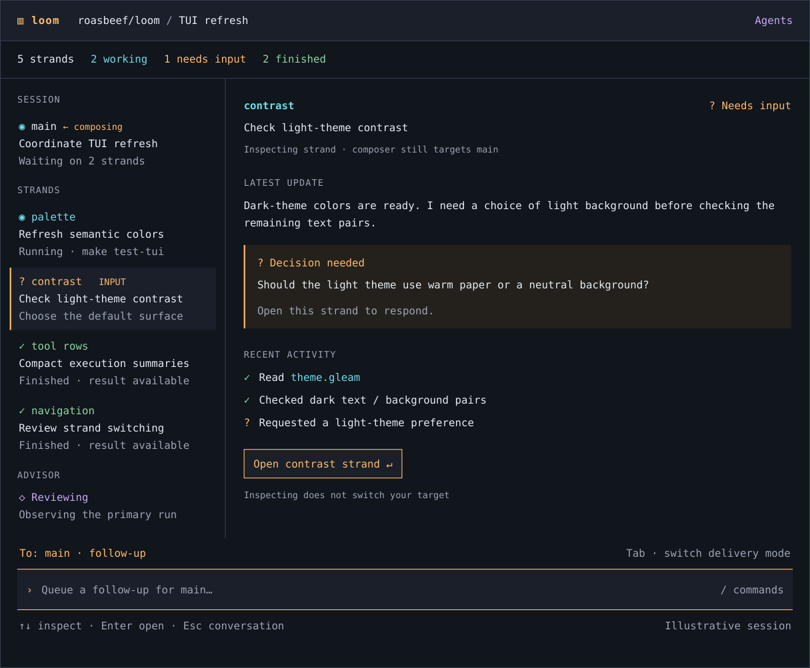
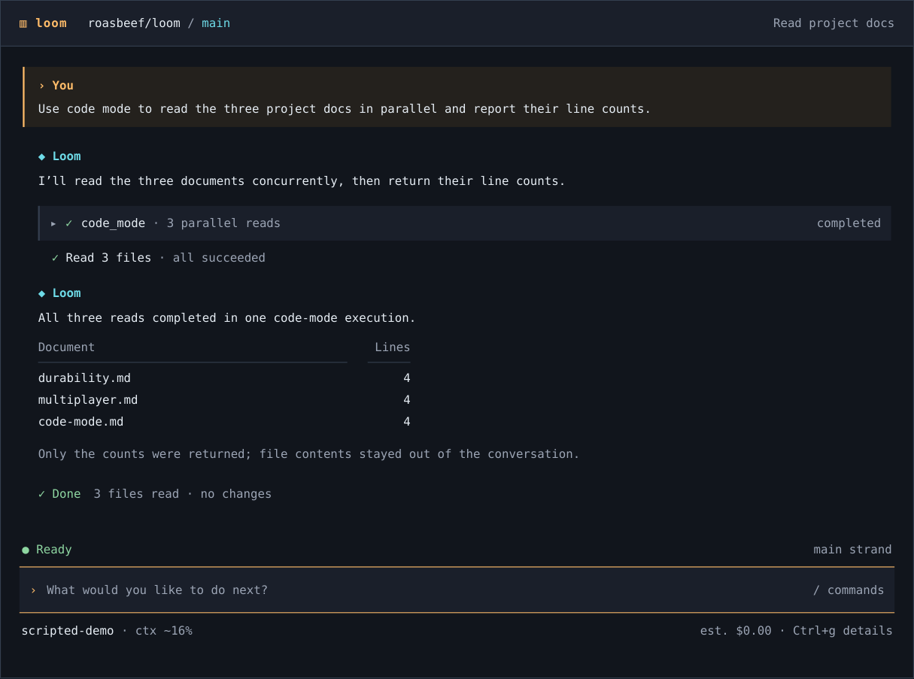
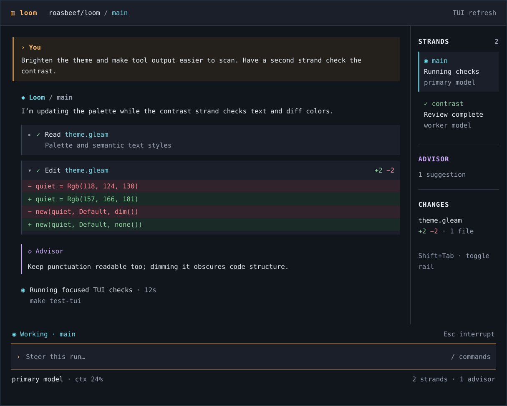

# Agent workspace concepts

Design exploration for Loom's TUI, with particular focus on agent visibility and explicit steering. These are HTML concept mockups with illustrative session data, not screenshots of an implemented native redesign. No ImageGen artwork was produced.

Read [the design brief](design.md) for the rationale, data boundaries, implementation order, and acceptance checks. The native TUI was built and exercised in scripted demo mode at source revision `1ab97ba5086cf2bef98fa69941306a427feeba68`; provider-backed operation was not tested.

## Agents: primary direction

Task-oriented roster, attention summary, selected-strand detail, and an explicitly targeted composer.

## Focus

Conversation-first reading flow, readable semantic colors, and compact tool results.

## Studio

An alternative multi-pane exploration for following conversation, agents, and advisor activity together. This is not a decision to make a split pane the default.

## Interactive prototype

Download [concepts.html](concepts.html) using GitHub's raw-file download control and open it in a browser. The preview contains all three layouts and illustrative interactions. Some preview helpers load from a CDN. The PNGs above can be reviewed without running the prototype.

The images are static exports of the HTML concepts; browser and terminal rendering will differ. In implementation, preserve full advisor nudge bodies in compact mode (#447), distinguish halted from idle (#399), and evaluate advisor panes alongside #448. Inspection must never silently retarget an unsent draft.
