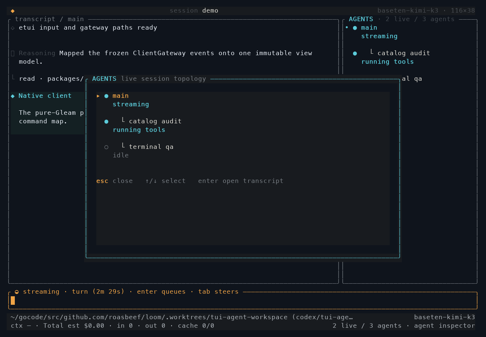
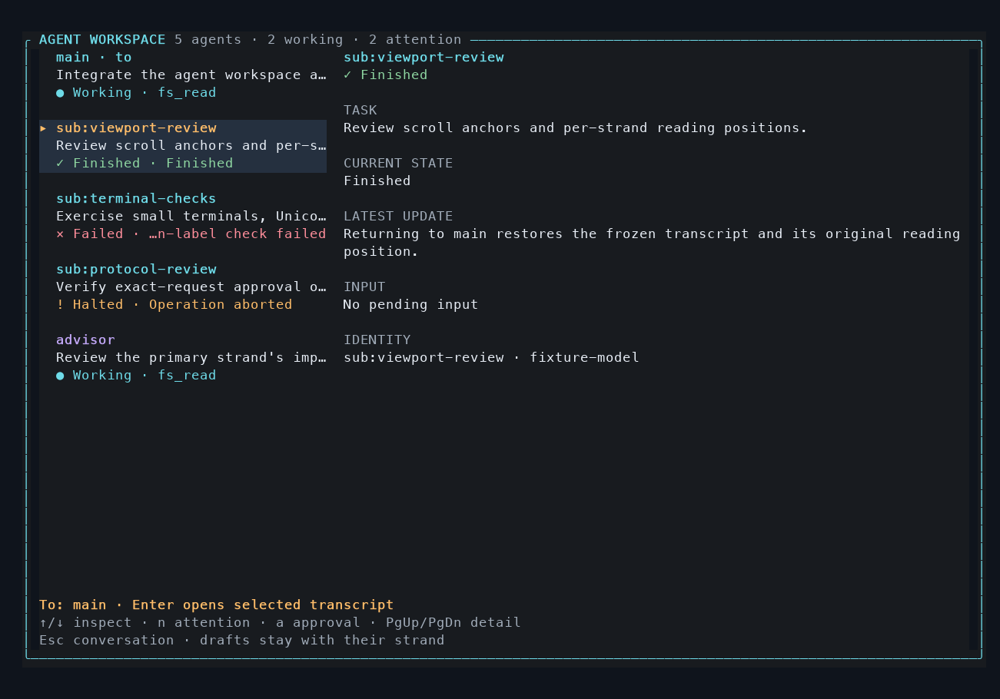
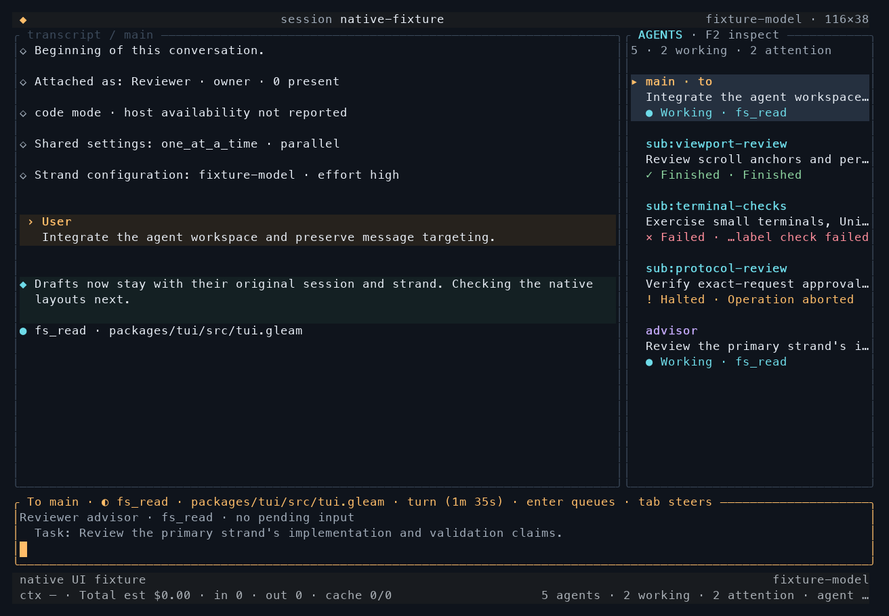
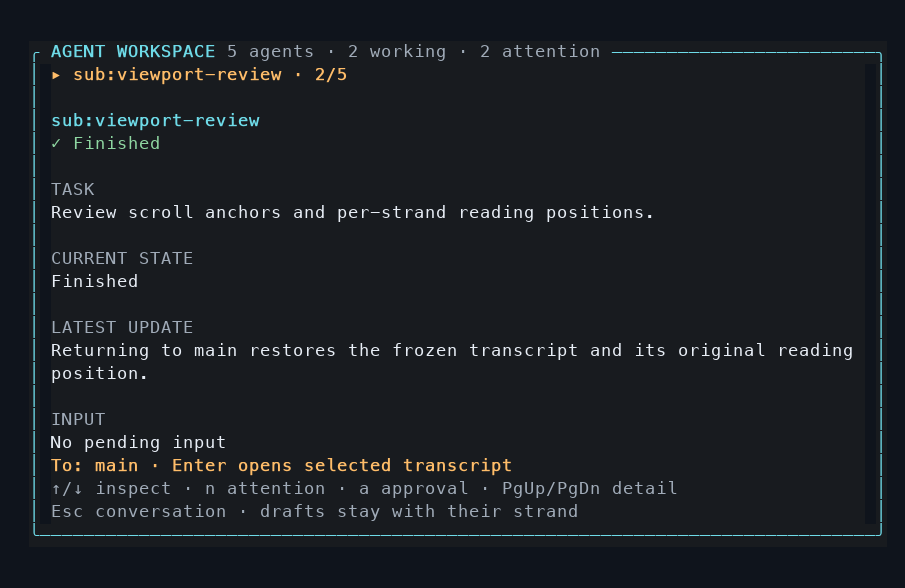
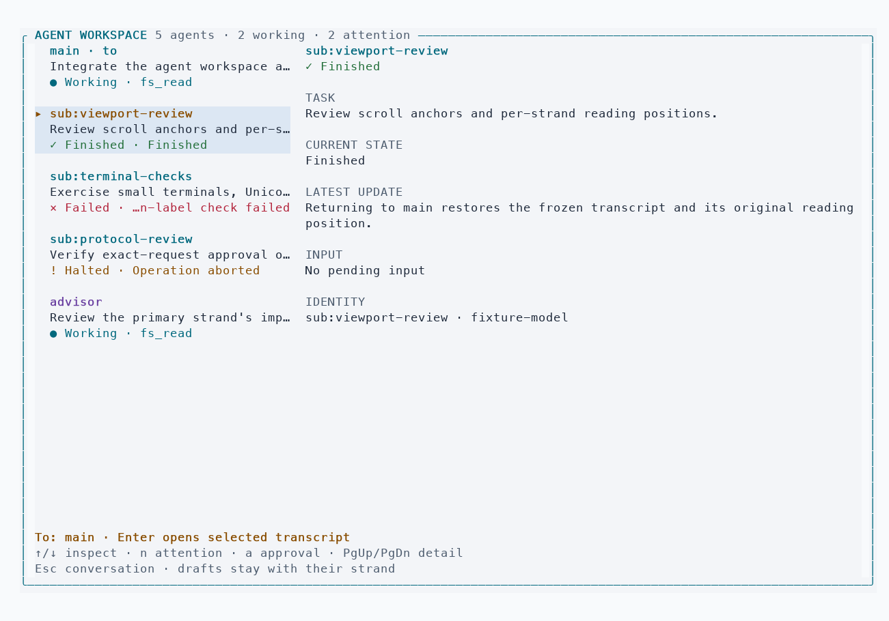
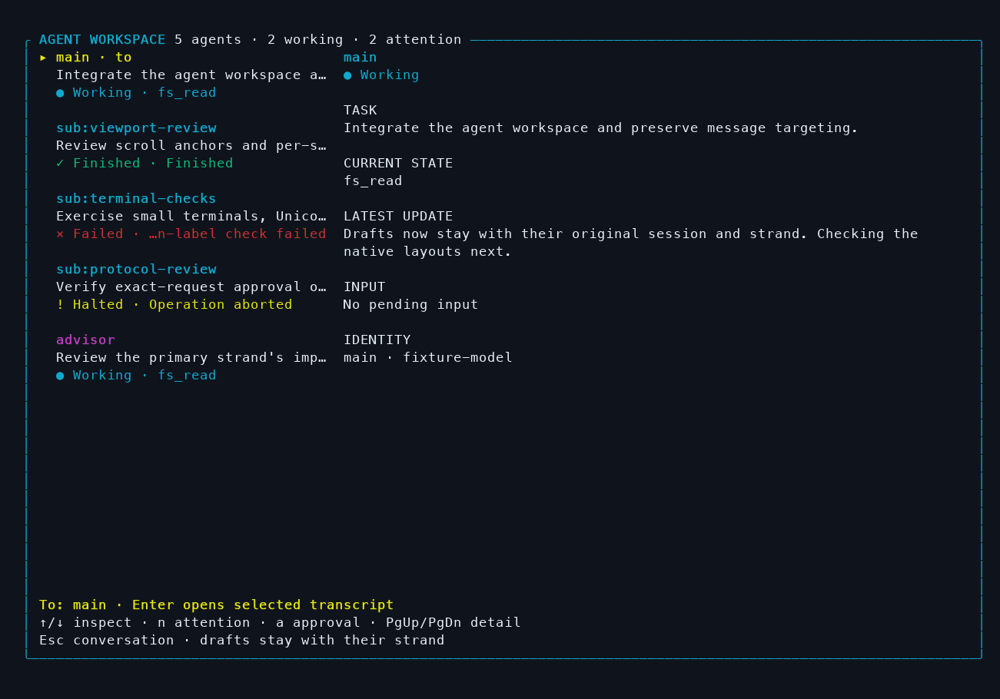
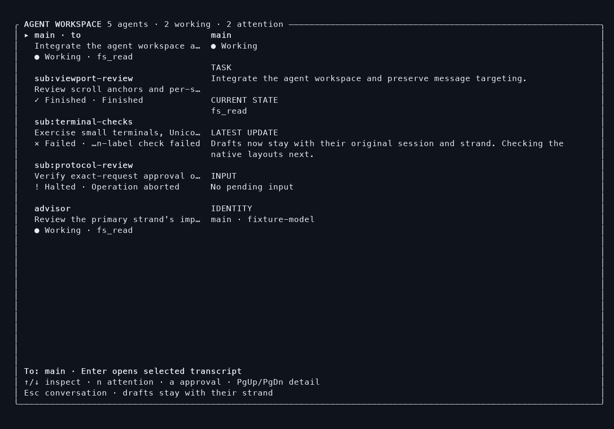

# Native agent workspace

Status: implemented for review, September 20, 2026. Tracks
[#473](https://github.com/Roasbeef/loom/issues/473); this slice does not close the
whole design issue. The implementation starts from `9c9bb576`.

## Operator behavior

The compact rail shows each strand's accepted task, captured state, and current
activity. `F2` opens the larger workspace without consuming the draft. `/agents`
opens the same view through the command path. Arrows inspect a stable strand
identity; they do not change the composer recipient. `Enter` explicitly opens
the selected transcript, whose composer names that recipient. `Escape` returns
to the existing conversation. `n` finds the next failed, halted, or approval
state; `a` opens the existing exact-request approval inspector. `PgUp` and
`PgDn` scroll the selected detail. Below the two-column breakpoint, the selected
agent and its position replace the roster, leaving the same controls available.

Drafts, editor positions, attachments, command history, and submission mode
belong to a `(session, strand)` pair. Switching strands restores the saved
history window and reading anchor within the current session. A session change
retains drafts but releases old history windows; it does not promise to retain
cross-session scroll positions. A removed recipient remains named and refuses
submission until the operator selects an available strand. Daemon-returned
held input goes back to its original strand's draft even when another editor
is open.

## Evidence behind the view

`agent_view` projects the captured operation state, last result, pending input,
and exact escalation scope. An idle phase alone never means success. Completed,
failed, and aborted outcomes remain distinct, and missing state is unavailable.
Live receipts mean input was received, not that the agent asked a question.
Only a pending approval belonging to a live operation produces “Needs input.”
A timed-out or aborted operation cannot inherit attention from an unanswered
journal record. Idle captured strands with held input show “Halted.”

Task excerpts come from the operation's accepted prompt entries. Activity uses
captured effect-pending tool calls, retry/deferred phases, or cancellation.
Latest-update excerpts follow the operation's designated assistant entry and
are retained only for the same operation and entry. The detail view bounds
excerpts; `Enter` opens the full transcript and existing result/history tools.
Legacy recordings without lifecycle evidence show unavailable states rather
than inferred completion.

Delivered advisor nudges retain their complete body even in compact mode.
Pending nudges appear in the scrollable tail under an explicit “pending, not
delivered” heading; the composer carries only the count. Neither presentation
changes model context or drains the advisor queue. Session changes clear advice
and goal observations and request fresh boards, including running-to-running
session switches. Advisor identity and the existing `/goal` commands remain
separate from message targeting.

## Readability and palette

Body text uses a brighter neutral color, current work cyan, attention amber,
failure red, confirmed completion green, and advisor identity violet. Status
words, symbols, and selection markers carry meaning without color. Separators
use a distinct subdued role rather than dimming explanatory text.

Interactive startup reads the existing `COLORTERM`, `TERM`, `COLORFGBG`, and
`NO_COLOR` hints. Truecolor terminals with a light background hint use the light
palette; other truecolor terminals use dark. Terminals without a truecolor hint
use indexed semantic colors and their own default background. Nonempty
`NO_COLOR` or `TERM=dumb` removes color while retaining text, links, wide-cell
continuations, and emphasis. Background detection is a hint, not a terminal
color probe; unusual emulator themes still require visual verification.

## Native captures

These PNGs rasterize **actual tmux captures of the Gleam/etui renderer**, not
HTML concepts. `before` is the baseline native `--demo` at 116×38. The after
frames use an illustrative, provider-free decoded snapshot fixture at the same
size, except the 80×24 narrow frame. Their task descriptions and outcomes are
fixture data, not claims about completed provider work. Default emulator colors
are fixed by the capture script; explicit ANSI/RGB colors come from the frame.
The adjacent `.ansi` files preserve the terminal output.

| Baseline inspector | Native workspace |
| --- | --- |
|  |  |

| Light palette | ANSI fallback |
| --- | --- |
|  |  |

Reproduce the interactive fixture from `packages/tui` with
`gleam dev agents dark`, substituting `light`, `ansi`, or `plain` for the other
palettes. Resize the terminal, inspect another agent, and press `Escape` then
`Shift+Tab` for the compact rail. Save a frame with
`tmux capture-pane -p -e -t <session> > capture.ansi`. The adjacent
`render_capture.py` accepts an ANSI path, PNG path, and optional `light` argument;
it uses Pillow and the macOS Menlo font only for documentation rendering.

## Validation and limits

The focused gate passes 625 TUI tests, including projection evidence, stale
approvals, stable inspection, removed recipients, per-strand drafts and history,
returned-input ownership, cross-session boards, full compact nudges, cell
preservation, hostile text, and terminal widths from 40 to 160 columns. The
40×12 case checks bounded rendering and core controls; 80×24 is the native
small-terminal capture. Package lint has zero errors and 116 warnings.

The full repository command initially stopped on a Hex API rate limit at the
client package after the preceding suites passed. Checks resumed at that
package. The client run passed 2,024 tests and exposed one obsolete terminal
expectation for `0 live / 2 agents`; the native summary now reads
`2 agents · 0 working · 0 attention`. The assertion is updated; all five tests
in its terminal end-to-end module pass on the separate rerun. Conformance passes 83 tests, lint passes
139 tests, and the sandbox Go checks pass. Repository-wide house lint reports
zero errors and 828 warnings. The documentation gate also passes with zero
errors. This is component-by-component gate evidence,
not a claim that one uninterrupted `make check` invocation succeeded.

The macOS gate retains its reported skips: code-mode satellite cases have no
seed in this worktree, and shipped-daemon cases have no
`LOOM_BOOTSTRAP_E2E_SERVER`. These runs do not establish Linux sandbox coverage.

Configured provider access was found, but creating a live smoke session against
the existing daemon returned `daemon connection admission unavailable (503)`.
The daemon was left running for its other users. No provider-backed parallel
run or live approval was validated in that attempt. The native client/server
E2E tests use the repository's controlled provider fixtures.

An independent review found and verified the returned-input, terminal-approval,
and session-observation ownership paths. Their fixes and focused regressions
are recorded in [the review dispositions](../review/tui-agent-workspace.md).
Remaining scope includes provider-backed scenario coverage, larger workflow
changes to tool-result presentation, and the optional main/advisor split-pane
exploration in #448.
