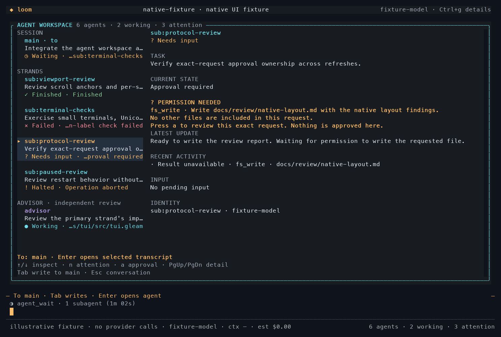
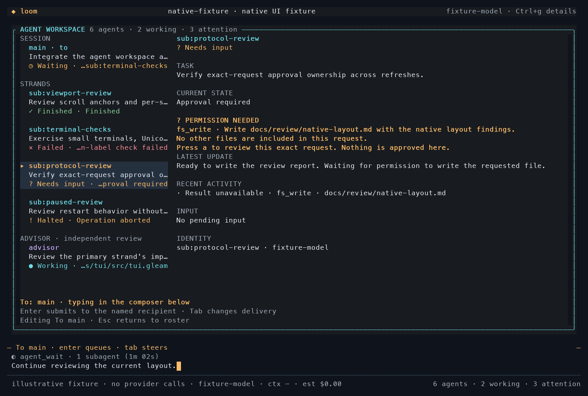
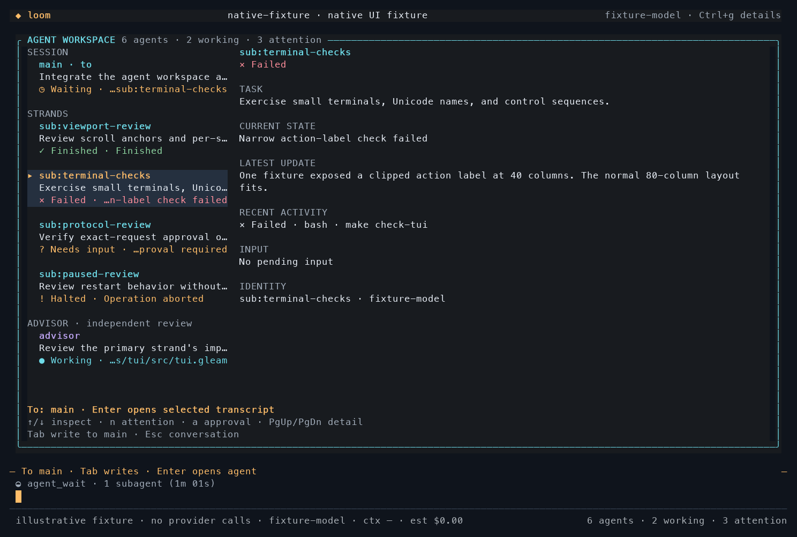
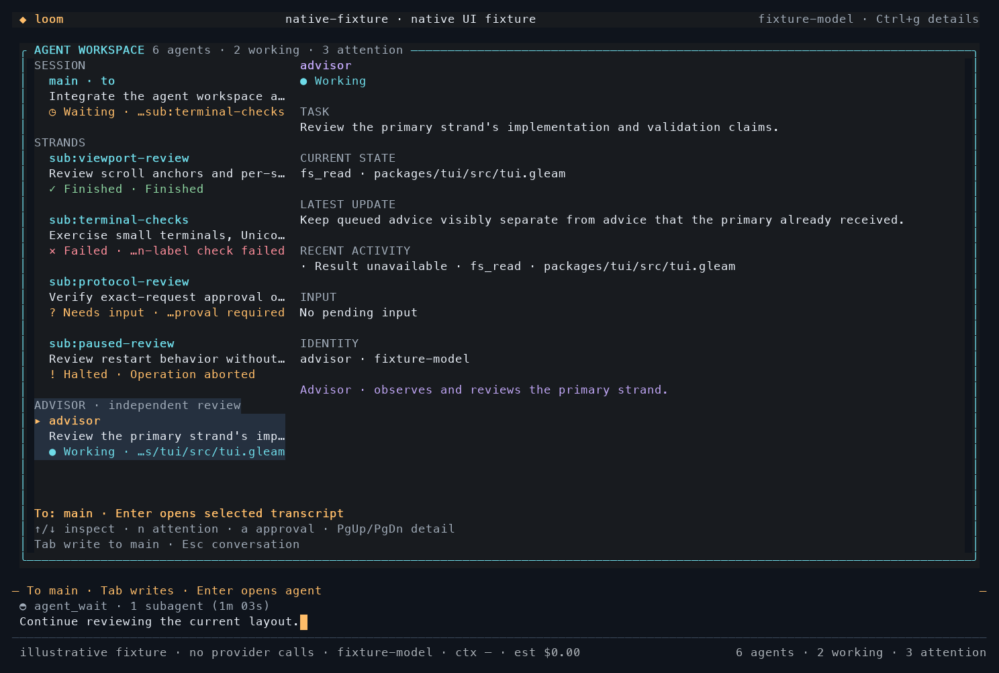
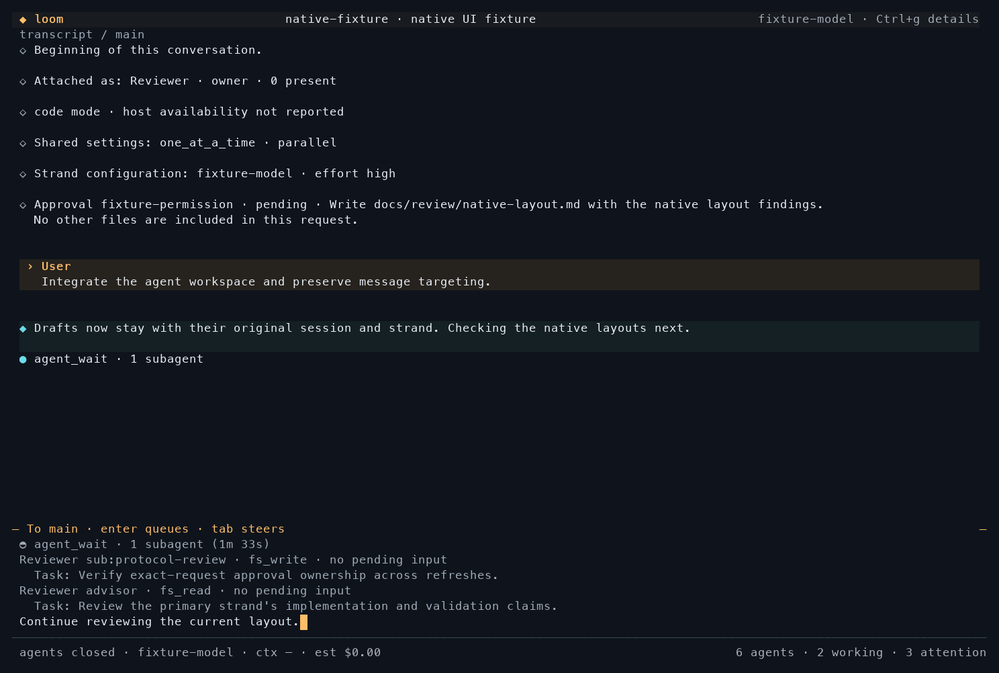

# Native agent workspace

Status: implemented for review, September 20, 2026. Tracks
[#473](https://github.com/Roasbeef/loom/issues/473). The implementation starts
from `9c9bb576`; the follow-up completes the native Focus, Studio, and Agents
presentation work identified during comparison with the three concept images.
The independent main/advisor split exploration in #448 remains separate.

## Operator behavior

The compact rail shows each strand's accepted task, captured state, and current
activity. `F2` opens the larger workspace without consuming the draft. `/agents`
opens the same view through the command path. Arrows inspect a stable strand
identity; they do not change the composer recipient. `Enter` explicitly opens
the selected transcript, whose composer names that recipient. `Tab` transfers
keyboard ownership to the existing composer without opening the selected
strand; the unsent draft still belongs to its named recipient. `Escape` or
`F2` first returns typing to inspection, then closes inspection. Slash commands
open their ordinary visible surfaces. `n` finds the next failed, halted, or approval
state; `a` opens the existing exact-request approval inspector. `PgUp` and
`PgDn` scroll the selected detail. Below the two-column breakpoint, the selected
agent and its position replace the roster, leaving the same controls available.

Drafts, editor positions, attachments, command history, and submission mode
belong to a `(session, strand)` pair. Switching strands restores the saved
history window and reading anchor within the current session. A session change
retains drafts but releases old history windows; it does not promise to retain
cross-session scroll positions. A removed recipient remains named and refuses
submission until the operator selects an available strand. Daemon-returned
held input goes back to its original strand's draft even when another editor
is open.

## Evidence behind the view

`agent_view` projects the captured operation state, last result, pending input,
and exact escalation scope. An idle phase alone never means success. Completed,
failed, and aborted outcomes remain distinct, and missing state is unavailable.
Live receipts mean input was received, not that the agent asked a question.
Only a pending approval belonging to a live operation produces “Needs input.”
A timed-out or aborted operation cannot inherit attention from an unanswered
journal record. Idle captured strands with held input show “Halted.”

Task excerpts come from the operation's accepted prompt entries. Activity uses
captured effect-pending tool calls, retry/deferred phases, or cancellation.
A waiting label names a dependency only when an active `agent_wait` call has a
valid strand/operation handle. Recent tools come from the current operation's
retained accepted-prompt branch, match results by invocation identity, and
become unavailable when that evidence is missing. Permission detail carries
the captured requested action and directs the operator to the existing exact
approval panel. The capture has no generic pending-question lifecycle field;
ordinary assistant questions remain visible in the update and transcript.
Latest-update excerpts follow the operation's designated assistant entry and
are retained only for the same operation and entry. The detail view bounds
excerpts; `Enter` opens the full transcript and existing result/history tools.
Legacy recordings without lifecycle evidence show unavailable states rather
than inferred completion.

Delivered advisor nudges retain their complete body even in compact mode.
Pending nudges appear in the scrollable tail under an explicit “pending, not
delivered” heading; the composer carries only the count. Neither presentation
changes model context or drains the advisor queue. Session changes clear advice
and goal observations and request fresh boards, including running-to-running
session switches. Advisor identity and the existing `/goal` commands remain
separate from message targeting.

## Focus, Studio, and Agents

Focus gives the session name priority over a long checkout path, replaces the
transcript box with a quiet heading, and gives the composer
horizontal boundaries. Its compact footer reserves room for agent attention;
`Ctrl+g` restores detailed accounting. Reading history never replaces the
composer's actual Enter/Tab delivery hint. The fixed heading owns the history
indicator so scrolling does not change the editor's height.

Successful grouped code-mode calls collapse to their result summary. Pending
source previews keep at most six lines; expansion retains the exact source
and output. Failures preserve up to eight diagnostic lines and 1,600 characters
with an explicit expansion hint. A generic invocation gets an activity mark;
a green success mark requires a matched non-error result.

Studio combines conversation with a compact rail, separate session/strand
sections, and a reserved advisor section. Pending-advice counts and change
observations show only captured evidence; absent observations are labelled.
The existing changes pane retains priority when open. At widths below 100
columns the rail yields its space to the transcript. Agents uses the larger
roster/detail body while retaining the real composer and attention footer.

## Readability and palette

Body text uses a brighter neutral color, current work cyan, attention amber,
failure red, confirmed completion green, and advisor identity violet. Status
words, symbols, and selection markers carry meaning without color. Separators
use a distinct subdued role rather than dimming explanatory text.

Interactive startup reads the existing `COLORTERM`, `TERM`, `COLORFGBG`, and
`NO_COLOR` hints. Truecolor terminals with a light background hint use the light
palette; other truecolor terminals use dark. Terminals without a truecolor hint
use indexed semantic colors and their own default background. Nonempty
`NO_COLOR` or `TERM=dumb` removes color while retaining text, links, wide-cell
continuations, and emphasis. Background detection is a hint, not a terminal
color probe; unusual emulator themes still require visual verification.

## Native captures

These PNGs rasterize **actual tmux captures of the Gleam/etui renderer**.
They use decoded, provider-free fixture data; the task descriptions and outcomes
are illustrative. The wide frames are 132×42, and the narrow frame is 80×24.
Adjacent `.ansi` files preserve terminal output. The earlier baseline capture
remains available for comparison with the first implementation pass.

| Agents: exact pending decision | Composer: still addressed to main |
| --- | --- |
|  |  |

| Failed strand and recent result | Advisor detail |
| --- | --- |
|  |  |

| Light palette | ANSI fallback |
| --- | --- |
|  |  |

Reproduce from `packages/tui` with `gleam dev agents dark`, substituting
`light`, `ansi`, or `plain` for other palettes. `F2` closes the initial
inspector; `Shift+Tab` shows Studio. `F2` reopens Agents. In Agents, select a
worker and press `Tab` to type to the existing recipient. Use separate key
events when scripting Escape: terminals may combine adjacent escape bytes
into a different key sequence. No fixture prompt needs to be submitted.

Save with `tmux capture-pane -p -e -t <session> > capture.ansi`. The adjacent
`render_capture.py` accepts an ANSI path, PNG path, and optional `light` argument;
it uses Pillow and the macOS Menlo font only for documentation rendering.

## Issue acceptance mapping

| Requirement | Native behavior and regression evidence |
| --- | --- |
| Navigation cannot redirect a draft | Stable inspector identity; separate composer owner; workspace editing and returned-input tests. |
| Stable selection and per-strand restoration | Roster-refresh tests, draft/history workspace tests, removed-recipient refusal. Cross-session history buffers are deliberately released. |
| Evidence-based states | Current operation/result projection; validated wait handles; terminal, stale approval, missing-capture, and operation-ownership tests. |
| Exact approval | Captured preview opens the existing panel with no decision; scope and terminal-approval regressions. |
| Narrow target and attention | Reducer/render checks at 40×12, 80×24, 100×30, 116×38, and 160×50; real 80×24 capture. |
| Advisor isolation and full nudges | Separate advisor section, no generic advisor targeting, pending/delivered and full multiline compact-nudge tests. |
| Color-independent meaning | Dark, light, indexed, and plain native captures plus cell/content preservation tests. |
| Full details and viewport integrity | Exact source/result expansion, multiline failures, history anchors, selection/copy, streaming handoff, pacing, and stale-cell regressions. |
| Native coverage and repository gates | Snapshot/replay suite, native fixture captures, independent review, and the gate results below. |

## Validation and limits

The final TUI suite passes all 634 tests with a warning-free build, including
the new header-identity regression. The client gate passes all 2,025 tests,
including the native client/server E2E module. Repository house lint reports
zero errors and 831 warnings; the documentation gate reports zero errors and
153 warnings. The final native text snapshots were regenerated and inspected.

One full `make check` reached the final lint step after all package suites,
including 83 conformance and 139 lint tests plus the sandbox Go checks, passed.
Its comment-spacing finding was corrected. The subsequent full run passed
through the events package, then stopped at the client package on the external
Hex API rate limit. The client and TUI gates were rerun successfully, and the
final house lint and documentation checks pass. This is complete component
gate evidence, not a claim that an uninterrupted `make check` returned zero.

The new client successfully attaches to a fresh session after other clients
released daemon admission. Code mode is available. No provider request, real
parallel provider run, or live approval decision was sent during this follow-up;
the native client/server E2E tests use controlled providers. No installed daemon
or operator configuration was changed.

The macOS gate retains its reported skips: code-mode satellite cases have no
seed in this worktree, and shipped-daemon cases have no
`LOOM_BOOTSTRAP_E2E_SERVER`. These runs do not establish Linux sandbox coverage.
Hosted CI must be checked at the submitted head before merge.

The [review dispositions](../review/tui-agent-workspace.md) record the initial
ownership repairs and the follow-up keyboard-routing and diagnostic fixes.
