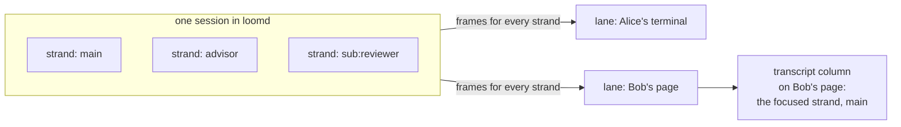

# The web UI: layout and visual language

**Status: exploration, not a commitment.** This is the working spec for
building out the web view that `loomd --ui` serves. Sections 3.8 (folded
work) and 3.9 (the prompt cache), and screen (d) in section 8 ("Agents at
work"), are the current direction; the rest records where the page may
go and is open to change. What the page does today is described in
[the web view architecture](../architecture/web-view.md), and where this
note describes today's page it was checked against the code on
2026-09-27. Everything else here is proposed.

The spec is grounded in `docs/loom-design.md`, in the architecture docs
for the terminal, multiplayer, messaging, async collaboration, code mode,
the advisor, goals, approvals and durability, and in
[ADR-014](../adr/014-second-runtime.md) and
[protocol-change/051](../../protocol-change/051-web-view-route.md) as they
stood on `main` on 2026-09-26. Where it names a wire field or command, it
is one the terminal already uses.

## Terms: lane, strand and transcript column

Three words in this note name three different things, and the code uses
the first of them in one sense only.

- **A lane** is one attached client's connection to one session: the
  session lane, `session_view/session_channel.Channel`. Each terminal and
  each page holds its own lane, and a lane carries the frames of every
  strand in the session.
- **A strand** is one conversation thread inside the session: `main`, the
  advisor, or a sub-agent such as `sub:reviewer`. Every lane sees every
  strand.
- **The transcript column** is the part of the page that draws one strand's
  entries: the focused strand. Switching the focused strand changes the
  column and leaves the lane as it was.

## 1. Principles

1. **Durable and transient rows look different.** Every row on the page is
   either a durable entry, drawn solid, or a transient observation (a
   stream, a tool tail, a held input, a pending nudge), drawn in a visibly
   lighter style and never mixed with entries. The page persists nothing
   and invents no state. After a disconnect it is visibly stale until a
   cut and a catch-up land.
2. **Strands first, transcript second.** The unit of navigation is the
   strand: `main`, the advisor, a `sub:*` agent, or a peer. The page leads
   with what every agent is doing now, and the transcript column shows one
   strand. Roboclaw leads with a chat; Loom leads with the roster.
3. **Effects are records with an author.** A capability call, a program
   launch, a job, an approval and its decision are cards with a state, a
   scope, a policy and an origin. The page never says "ran 20 tools"; it
   says which capability ran, under which policy, and who decided.
4. **Consent binds to what was shown.** A decision carries the escalation's
   identity and the sequence its card was drawn at, and the engine encodes
   it to echo that record's action digest and grants. If the record moved
   after the card was drawn, the page sends nothing and says so. This is
   what the page does today (`operator.drawn`). The direction is for the
   card to settle in place and name who decided, for example "decided by
   Bob" after a `stale_approval`.
5. **You always know who you are and whom you address.** The principal,
   the role and the addressed strand sit in the composer's identity strip,
   not on a settings page. An observer's page carries no mutating control
   at all, since every handler in the tree can be called by whoever holds
   the socket. Where a control would be, a fixed line states why it is
   absent.
6. **One engine, one home for logic.** Any rule about what a frame means
   belongs in `session_view`. The view decides layout, hit targets and
   colour, and nothing else.

## 2. Information architecture

At 1280 px and wider the page has three columns: a sidebar (280 px,
collapsible to a 56 px rail), the session view (fluid, at least 640 px),
and a right pane (420 to 560 px, closable). From 960 to 1279 px the right
pane becomes a sheet, and below 960 px the sidebar becomes a drawer.

**The sidebar**, top to bottom:

- **Workspaces, then sessions.** Sessions are grouped by repository root,
  then branch, then residency (`resident` above `saved`), because that is
  what the catalogue knows. There is no automatic grouping by topic. A row
  shows the title, the branch, a state glyph (section 6.2), the number of
  live strands, a stack of up to three presence avatars, and the session's
  activity from `sessions.activity` (`needs you` in amber, `working`,
  `idle`). There is no unread count: the daemon knows that a peer message
  was stored, never that anyone read it. Sessions for the current
  workspace sort first.
- **People.** The presence roster of the focused session: each person's
  name, a ring showing their role, and a connection count when one person
  has several windows. An owner-only "Invite" opens the invitation form
  (session, role). Below it, "Peer links" lists the focused strand's
  directional links as `this › target` rows, with a mark on links that may
  wake their target (`may_wake`).
- **Jobs.** `live_jobs` for the focused session: ID, the head of the
  argument vector, state, and a deadline countdown. A row expands to the
  output tail, and operators can cancel.
- **Goals.** One row per session that has a goal: status, phase, and
  tokens used against the budget.

**The header** carries the session title, the branch, a policy chip
(`workspace-write · network off`), a changes chip (`+41 −12`, from
`worktree_diff`), the presence stack, a control that opens the session in
the right pane, and a role badge.

**The strand rail** sits under the header (section 3.1). **The composer**
and its trays sit at the bottom. Slash commands from
`command.suggestions_with_skills` open the same palette the terminal has.

## 3. The session view

### 3.1 Strands drawn as threads

The layout takes the loom literally. **Warp** threads run vertically, one
per strand, in time order down the page. **Weft** runs horizontally: a
message that crosses from one strand to another is drawn as a bar across
the threads. The logo, amber warp over graphite weft, is the same picture.
Three pieces work together.

**The agent strip** is 56 px tall, under the header. It is the terminal's
agent strip (`tui/agent_strip`) drawn wide. It holds one chip per live
strand, in the terminal's order: `main`, then the working sub-agents, then
the advisor in violet. A chip shows the strand's hue, its name, a state
glyph, one line of activity (the phase and elapsed time of its
`agent_view.Row`), the context size from the strand's glance
(`glance.tokens`), and the cache ring (section 3.9). The advisor's chip
adds a badge counting pending nudges. Settled strands leave the strip and
fold into one `+n settled` chip, which opens them as a list. Clicking a
chip focuses that strand: the transcript column, the composer's addressed
strand and the margin's highlighted thread switch together, as Enter does
in the terminal. A strand of a peer session never gets a chip; it appears
only as crossings.

**Sub-agents.** An `agent_spawn` call is one row in the spawner's transcript,
`↳ agent_spawn · sub:reviewer · <purpose>`, drawn in the child's hue, and
the child's thread starts in the margin at that row. The child's result
returns as a crossing card (`from sub:reviewer · result · settled`), and
the thread ends there with a settled mark. Only the spawn row and the
result enter the spawner's transcript; the child's own work is read by focusing
its chip.

**The warp margin** is 72 px wide, left of the transcript column. It draws one
4 px vertical thread per strand that is not focused, in that strand's hue,
up to six threads with a `+n` fold after them. Threads are placed in time
against the transcript column's rows. A 6 px tick marks where that strand
committed an entry at that sequence: filled for a tool result, hollow for
an assistant message. A thread starts at the row of the entry it forked
from, with a fork glyph in the focused transcript's gutter, which draws the
conversation tree as a branch point (section 3.3). A thread ends with a
terminal-result tick (▣) when its strand settles. Hovering a tick shows
the entry's first line and an "open strand here" action.

**Crossings.** A cross-strand message (a `send_to_strand`, an advisor
verdict, a sub-agent's brief or result) is a 2 px horizontal bar in the
sender's hue. It runs from the sender's thread across the margin into the
transcript column and ends in a card whose header chip reads, for example,
`from sub:reviewer · steered` or `· started a run`, after the `Delivery`
variant. A crossing out of the focused transcript runs from the card's left
edge back to the target's thread and ends in an arrowhead.

A **cross-session** message has no thread in this view to start from.
Its bar begins at the margin's outer edge with a session chip
(`wp-j/vetting-lint · main`) and is drawn hatched, because the peer is
outside this session. Its card carries the `PeerOrigin` label, the
delivery (`started a run` or `steered the open run`), the receipt mark
`stored` (never `read`, since the daemon has no such signal), and a
**Reply** button, which addresses the composer to that session's strand
through the peer link. Reply is disabled, with the reason shown, when no
link from the focused strand exists. The link's mode (`busy_only` or
`may_wake`) is shown beside the addressed chip, because a `busy_only` link
cannot start work on an idle target.

There is no side-by-side mode. A person reads two strands by switching the
focused chip, and opens a second session in the right pane (section 5).

### 3.2 Code mode, capability calls and approvals

A `code_mode` call is a **program card**. Collapsed, it is one 40 px row:
`⌘ program · workspace · 3 cap calls · proc.run ×3 · running 4.2s`, with
the state glyph. In `launch` mode the row adds
`background · 2 endpoints · idle 40s/300s`.

Expanded, the card has three tabs:

- **Pipeline** shows three stage pills, `vetted ✓ · compiled ✓ · run ●`,
  with the failure value inline when a stage stops
  (`VetRejected: import cap/net not allowed`).
- **Source** shows the program's Gleam in a monospace face, token-styled
  and never reformatted, with the import list highlighted, since the
  imports are the permissions the program asks for.
- **Calls** lists one row per capability call in wall-clock order: the
  capability (`cap/proc.run`), an argument preview (monospace, cut at
  2 KB), the state and the duration, and a `cancelled` mark on the losers
  of a `task.race`. Rows nest under `task.parallel_map`, which shows its
  concurrency (`3 of 3 in flight`).

**Approvals** are never a modal. Protocol-change/051's operator addendum
fixes where a card with buttons may sit, and this spec follows it. The
card is drawn from the escalation record alone, in a region of its own
below the composer, which transcript content cannot occupy, and in a style
no transcript line uses. It sits below the composer because the agent
chooses when a card appears and how tall it is, and a card drawn above the
composer, or inline in the transcript, could move a button under a click already
on its way to Send. In the transcript column, the row of the call that holds
the claim (a `bash` call, a native file tool, or a program launch) shows
the waiting state glyph and a one-line `waits for approval` marker with no
buttons. A capability refused inside a running program is drawn as a
failed call row, because it cannot escalate.

The card today shows the header `waits for approval · <tool>`, the
question, the action preview in a monospace face, the authority lines from
`approval.presentation`, and two buttons: **Deny <tool>** first, then
**Allow <tool> once**. Nothing is preselected, nothing has `autofocus`,
and a new card never takes focus. A record whose authority the page cannot
present in full gets only Deny. **Allow for this session** is not offered
from a page, because a remembered grant outlives the page that gave it;
it stays a terminal decision unless a later review changes that.

The direction for the card adds: the strand from the record's
`CallScope`; the count of questions (`asked 1 of 3`); the wanted grants
drawn as a diff (`+ writable root packages/foo`, `+ network full`); and a
footer with every eligible operator's avatar. On resolution the card
would settle to one line, `allowed once · Alice · 12:04:07`, and after a
`stale_approval` its buttons would grey out and its footer would read
`decided by Bob`. Today a card leaves the page when its record is no
longer pending. An observer's page today draws no approval cards; the
direction is to show them with the note `waiting on an operator` and no
buttons.

Ordinary tool groups (compact mode) collapse to one row per group, as
`tool_activity` groups them, and expand with `⌘G`. A `fs_edit` result
shows a collapsed diff card.

### 3.3 The conversation tree

Every entry row has a gutter, shown on hover, with the entry's sequence
(`#41`), a copy-ID action and, for operators, **Fork here**, which sends
the protocol's `fork` and creates a new strand at that entry; the new
thread appears in the margin starting at that row. A **compaction entry**
is a full-width rule: `compacted · checkpoint of 41 entries · context
reads from here`. A **branch summary** entry is a folded card. Older
history loads in bounded pages from `history_view` through a `load older`
row at the top. The reading position is anchored to an entry, so new
output does not move the text being read, and scrolling above the live
tail freezes the transient rows exactly as the terminal does. The
transcript header carries the attachment banner
(`viewing epoch 3 · incarnation 2`).

### 3.4 The advisor

The advisor is a strand chip and a violet thread. Its verdicts are drawn
according to what they cost the primary strand:

- **`quiet`** is a hollow tick on the advisor's thread, with no crossing.
- **`nudge`** is a dashed crossing that lands in the pending tray above
  the composer (`Advisor · pending, not delivered · 1`), read from
  `advisor_pending`, and a count badge on the advisor's chip. When the
  primary drains the nudge, the dashed bar becomes solid at the delivery
  row, which reads `advisor · nudge · delivered` with the nudge's first
  line. Reading the tray never delivers anything: `advisor_pending` is a
  pull-only read of the guard cell. The tray is refreshed on the
  terminal's triggers (the primary settles, a review settles while the
  primary is idle, the primary appears, a session switch), not polled.
- **`block`** is a solid 3 px crossing that lands at the steer row, with
  the header `advisor · block · steered the open run`.

Feeds from `main` to the advisor are crossings to the advisor's thread,
collapsed to one attribution row. Advisor frames are drawn in the system
voice with the frame delimiters dropped, and a long frame shows the
summarizer's summary under a `(summarized)` heading. The advisor's own
transcript always shows commentary in full.

### 3.5 Goals and task progress

When a goal exists, the **goal board** is a card pinned above the
composer. It shows the objective (one line, expandable), a status pill
(`active`, `paused`, `budget_limited` or `complete`), the phase
(`awaiting verdict`), a budget bar of accounted tokens against the budget
with the cost beside it, the continuation count (`continuations 3/8`), and
the check command with its last result (`exit 0 · 41s`, or `did not
finish`). Operators get pause, resume and clear; the primary strand never
gets a control. A **todo card**, from the `todo` tool, sits beside the
board: `step 3 of 7` with the checklist, collapsed to the current item.

### 3.6 Jobs and worktree diffs

Jobs appear in the sidebar (section 2) and as a `job://` chip on the call
that started them. The **changes pane** (the right pane, section 5) shows
the Git observation: a file navigator with `+/−` counts and a unified
diff, with `fs_edit` patches as a labelled fallback. Each hunk row shows
the sequence of the entry that produced it, when that is known.

### 3.7 The composer

The composer is a block of three rows.

1. **The identity strip.** Today it shows the principal's name, a role
   badge (`Owner`, `Operator` or `Observer`, from the attachment the last
   capture was taken for) and the addressed strand, `→ main`. The
   direction adds an avatar, a model chip, the effort, a policy chip and
   the cache outlook chip (section 3.9), and lets the person click the
   addressed chip to change it; browsing the rail never retargets a draft.
2. **The editor.** Today it is an uncontrolled text area: the browser
   holds the draft as the person types, Enter inserts a newline and never
   sends, and one form submission carries the draft to the server. Prose
   is set in a proportional face. The direction adds the terminal's paste
   rules (a paste of at least 400 tokens or eight lines becomes an
   attachment chip) and a slash prefix that opens the palette. Images, up
   to four as in the terminal, would need the page socket's 1 MiB frame
   limit raised under their own review.
3. **The action row.** When the strand is idle it holds one button,
   **Send**. When the strand is busy it holds **Queue** (a `prompt`, which
   the daemon runs after the current operation) and **Steer** (which goes
   to the front of the queue and stops the observed operation). Both exist
   today as submit buttons of the one form. The direction adds a red
   **Stop** (`abort`, which keeps queued turns) and the held-inputs tray
   above the composer: up to three items from `pending_inputs`, with edit
   and drop.

The composer's states come from the lane. While one unsent mutation waits
for a capture, the page says so; today the notice reads "Waiting for the
session to synchronize before sending." After a lost reply the page says
the reply was lost and the command was not resent; the direction is a
banner that names the session, the command and the request ID, as the
terminal's notice does. The page
attaches no keyboard handler, so a waiting command cannot be cancelled
with Escape as it can in the terminal; a cancel control would be a
button. When disconnected, the page shows why; the direction adds the
reconnect attempt and its outcome.

### 3.8 Folded work

This section and the next are the current direction.

Everything a strand did between a human input and its answer (reasoning,
tool calls, programs, edits, jobs started) folds under one divider:
`▸ worked 48s · 4 steps · 2 files`. Expanded, each step is one line: a
chevron, a state glyph, the kind, the target, `+/−` counts for an edit,
and the entry's sequence on the right. A program keeps its card (section
3.2) when expanded. A turn that is still running is never folded, and a
step waiting on approval unfolds its turn. The duration and step count
come from the operation and its entries, not from the browser's clock.
Five things stay outside the fold, because each is something another party
did or something the reader may need to act on: a sub-agent's spawn row, a
result crossing, an advisor nudge, a cache miss, and a peer message.

Two ideas are taken from pi-gui, as inspiration only: the fold with a
duration, and one-line step rows. Two are not taken: pi-gui's per-turn
change card and review checklist, and its flat thread list grouped by
recency. The session's changes stay one chip in the header (section 2)
that opens the changes pane, and the sidebar stays grouped by workspace,
with recency as the sort within a group.

### 3.9 The prompt cache

The terminal already knows more about the prompt cache than the daemon
reports. `tui/cache_miss` detects a miss from two consecutive usage rows
on a strand, prices it from the rows' own cost buckets, and computes an
outlook from the providers' published minimum lifetimes: a one-hour head
that a positive `cache_write_1h` proves, a five-minute tail, or, for a
provider that proves neither, only the idle age. The page shows the same
facts in three places and invents none:

- **The cache ring** on every strand chip. A full cyan ring means the head
  is held (`cache head ≤42m`). A quarter amber arc means only the tail is
  held (`cache tail ≤3m`). A hollow grey ring means the idle age is known
  and nothing is proven (`cache idle 10m`). A dashed grey ring means the
  proven lifetime has elapsed. The label is the chip's tooltip and is read
  to screen readers.
- **The outlook chip** in the composer's identity strip, for the addressed
  strand: `cache head ≤42m`. It sits beside the model and effort chips,
  where the person decides whether to send now or later. A tail about to
  lapse turns the chip amber, and nothing else warns.
- **The cache-miss row** in the transcript when a miss is detected:
  `cache miss · main · idle 12m · re-read 38k of 41k · ≈ $0.41 · TTL elapsed`.
  It is drawn in the transient style (dashed, amber) at the turn that paid
  for the miss. The cause is named only when the client knows it: an
  elapsed lifetime, or a model switch that fences the comparison. A prefix
  change is inferred from a compaction entry or a fork, and the row says
  it is inferred.

Session totals (input, output, cache read and write, cost) stay in the
header's usage popover, like the terminal's `Ctrl+G` breakdown, and are
not repeated on chips.

## 4. Multiplayer

**Presence** is the roster from the cut, replaced whole on each capture.
Avatars in the header carry a role ring: amber for an operator, grey for
an observer, and a small key mark for the owner. Several windows from one
principal stack as one avatar marked `×2`.

**Authorship, not a driver.** There is no controlling client: concurrent
submissions are admitted in order. The page therefore never shows a
"driver"; it shows authorship. Every human turn carries its origin chip,
and the rail's activity line says, for example, `last steered by Alice
30s ago`. A queued prompt shows `queued · Bob` in the held tray for
everyone.

**Approvals race.** Every eligible operator sees the same card, the first
decision to commit wins, and, in the direction of section 3.2, everyone's
card settles to the winner's name.

**Typing and mentions** are not in the protocol. Typing is a display-only
signal, so it could ride an ephemeral bus event (phase C). `@name`
completes from the roster and highlights the row for that person; routing
a mention anywhere needs a daemon feature.

**Handing off control** is a role change. The owner promotes an observer
to operator, or invites a principal, from the People panel. A revocation
closes the person's attachment at the next frame, and the page shows
`membership revoked` with the transcript frozen.

**The observer's page as it ships today.** It shows one session, picked by
ID, and follows `main`'s transcript lines live. It is read-only by role in
the daemon, by type in the component, and in the lane. Where the composer
would be, it draws one fixed line: `Observer · read-only · you can follow
this session; ask the owner for operator access`. It draws no approval
cards, and it has no fork, steer, goal or job control: they are absent
from the tree, not disabled. Switching strands and paging history wait
for the extracted step.

## 5. The right pane and secondary surfaces

The pane holds one selected surface, chosen by tabs:

- **Session**: a second session's full view, as its own component keyed by
  person and session, with the same rail and margin, so two sessions can
  be read side by side and a cross-session crossing can be followed from
  one pane to the other.
- **Changes** (section 3.6).
- **Trace**: a program's Calls tab drawn as a Gantt chart, one row per
  capability call with bars in wall-clock time, and the pooled budget and
  the deadline drawn as vertical rules.
- **Inspect**: the agents, notes, context and summary tabs of the
  terminal's inspector.
- **Replay**: scrubbing durable history by sequence, through history
  pages. A scrubber over a `--record` file needs the daemon to serve
  recordings (phase C).

## 6. The visual language

### 6.1 Tokens

Colour continues the terminal's palette (`tui/theme`) and the mark. Dark
is the primary theme; the light theme is a cool bone, not warm paper. The
page's stylesheet (`web_view/page.stylesheet`) carries the dark values for
`bg`, `bg-raised`, `bg-user`, `bg-agent`, `fg`, `fg-quiet`, `divider`,
`signal`, `current`, `danger` and `added` today; the rest of the table and
the light theme are proposed.

| Token | Dark | Light | Use |
|---|---|---|---|
| `bg` | `#181B1F` | `#F4F5F7` | page |
| `bg-raised` | `#1F252B` | `#FFFFFF` | cards, pane |
| `bg-user` | `#26221D` | `#F7F1E6` | operator turns |
| `bg-agent` | `#142023` | `#E9F4F5` | assistant turns |
| `fg` | `#E7EDF5` | `#1C2225` | text |
| `fg-quiet` | `#A0ABB8` | `#5B6673` | annotations |
| `divider` | `#3C4A5B` | `#D5DBE3` | 1 px rules |
| `signal` | `#FFBD69` | `#9A5F0A` | operator actions, approvals waiting |
| `current` | `#6EDBE8` | `#0E7C8A` | agent output, main strand, running |
| `advisor` | `#C0A6F5` | `#6B4FBF` | advisor strand |
| `danger` | `#FF8E9B` | `#B3261E` | failed, refused, lost |
| `added` / `added-bg` | `#8ED6A1` / `#183423` | `#1E7A3C` / `#E3F5E8` | done, diff additions |
| `removed-bg` | `#391B1F` | `#FBE7E9` | diff removals |
| `strand-2` to `strand-6` | `#5FB8A0`, `#E39BC4`, `#7FA7F0`, `#D6C15A`, `#F2A26B` | `#1F7F6C`, `#B4497A`, `#2E5FC4`, `#8A7A0F`, `#B8581E` | sub-agent hues, in order |
| `peer` | hatched `fg-quiet` | the same | cross-session |

**Typography.** IBM Plex Sans (falling back to Inter, then `system-ui`,
then `sans-serif`) sets prose, labels and the composer. IBM Plex Mono
(falling back to JetBrains Mono, `ui-monospace`, then `monospace`) sets
code, capability calls, argument previews, IDs, sequences, strand names
and policy chips. The page loads no web fonts: its content security policy
allows no font source, so these names resolve only when the fonts are
installed locally, and the fallbacks carry the page otherwise. Serving the
fonts would mean adding them as assets and a `font-src 'self'` to the
policy, which is a 051 addendum. The type scale is 12, 13, 14, 16, 20 and
24 px, with a line height of 1.5 for prose and 1.4 for monospace. The
transcript body is 14 px and chips are 12 px monospace. No serif face is
used anywhere.

**Spacing** uses a 4 px base, with steps of 8, 12, 16, 24 and 32 px.
**Radius** is 4 px for inputs, 8 px for cards, and 999 px for chips,
matching the rounded threads of the mark. **Borders** are 1 px in
`divider`, and a focused card gets a 2 px inset ring in its strand's hue.
Elevation is shown with a border, not a shadow.

**Motion.** Expanding and collapsing take 120 ms, ease-out. A new
crossing draws left to right in 250 ms. The running glyph pulses on a
1.6 s cycle. Stream text appears without animation.
`prefers-reduced-motion` turns off all three animations.

### 6.2 Iconography and state

Glyphs are 12 px geometric marks, always paired with a text label; colour
never carries state on its own.

| State | Glyph | Colour |
|---|---|---|
| running | ● pulsing | `current` |
| waiting on approval | ◇ hollow diamond | `signal` |
| queued or held | ○ dashed | `fg-quiet` |
| idle | ○ | `fg-quiet` |
| done | ✓ in a square | `added` |
| failed or refused | ✕ in a square | `danger` |
| lost (satellite reaped) | ▢ hollow | `danger` |
| cancelled | ⊘ | `fg-quiet` |

Human turns carry a round avatar, agent turns a square swatch in the
strand's hue, and harness speech a grey ⌂. Ticks in the margin reuse the
same shapes at 6 px.

### 6.3 How it differs from Roboclaw

- Sessions group by workspace, branch and residency, not by topic.
- A program is one card and a capability call is one row; there is no
  "ran 20 tools" line.
- A policy chip names the jail, where Roboclaw shows an access-mode badge.
- The right pane shows traces, diffs and a second session, not a VNC
  view, because Rule Zero keeps effects outside the harness.
- Every turn shows its author, and no client is shown as the driver.
- The palette is graphite and bone with amber warp, with no serif face
  and no warm paper.
- A monospace face marks anything the daemon owns (IDs, calls, policies),
  and a proportional face marks anything a person or a model wrote.

Three things identify the page as Loom's at a glance: the warp margin with
coloured threads and crossings beside every transcript, amber operator
actions against cyan agent output, and chips that read like the wire
(`sub:reviewer`, `#41`, `cap/proc.run`).

## 7. Phased build plan

**Phase A: the read-only page gains its layout, without the step.** This
phase covers everything that can be derived from the cut and the pushes:
the header, the presence stack, the strand rail from `snapshot_view`'s
strands and operations, the transcript column with its durable and transient
styles, the warp margin and crossings (the mapping from entries to strands
and each fork's parent are in the cut), collapsed program cards from
`tool_activity`, folded work (section 3.8), cache rings and cache-miss
rows (section 3.9), approval cards without buttons for observers, held
inputs, streams and tool tails, the observer's bar, and the light and dark
themes. The strand the transcript column shows stays fixed per page until the step
moves.

**Phase B: interaction.** Part of this phase shipped ahead of the step,
with the operator addendum to protocol-change/051: an operator's page
sends a prompt or a steer and answers an escalation with allow once or
deny, through the command arms in `session_view/operator`, which the
terminal uses too. The rest needs the extracted step. Of the four changes
ADR-014 lists for it, the split of the buffered inbox from its subject is
done (`session_view/inbox.Inbox(source, a)`); engine-owned key and
pointer types, the split of the model into engine state and per-host view
state, and host handles as type parameters remain. After them come abort,
image prompts, strand focus, fork, history paging, the auxiliary reads
(`goal_get`, `live_jobs`, `worktree_diff`, `advisor_pending`, `context`,
`notes`), the model selector, goal controls, job cancel, the changes and
trace panes, and replies to peers through an existing link.

**Phase C: new daemon features.** A control relay for the page (the
catalogue, invitations, role changes, peer links, and `ui.link` for a
second session); a second session in the pane, which the routes allow and
the shell does not yet; typing and mention signals on the bus; served
recordings for the replay scrubber; and a sandboxed `srcdoc` iframe with a
strict policy for any HTML a program reports as an artifact.

## 8. Four screens

### (d) Agents at work

This screen is the current direction. It has no right pane, only the
session view. The strip holds `main` (focused, running, 41k tokens, head
held), `sub:tests` (running, 9k, tail only), the advisor (idle, 18k, a
badge for one pending nudge) and `+1 settled`. The transcript column, top to bottom:

1. Alice asks for a reviewer.
2. `main`'s spawn row for `sub:reviewer` starts a green thread in the
   margin.
3. `main`'s own work is folded under one divider.
4. The reviewer's result crosses back, and its thread ends settled.
5. A delivered advisor nudge crosses solid from the violet thread.
6. A cache-miss row reads `idle 12m · re-read 38k of 41k · ≈ $0.41 · TTL
   elapsed`.
7. A peer message from `lint census · main` enters hatched from the
   margin's edge, marked `stored`, with Reply.

Above the composer, the pending tray holds the advisor's undelivered
nudge, with its dashed crossing aimed at it. The composer's identity strip
shows `cache head ≤42m`, and the sidebar marks `lint census` as
`needs you`.

### (a) A session with the advisor, a program waiting on approval, and two people

The viewport is 1440 by 900 px, in the dark theme.

- **Sidebar** (280 px): workspace `loom`, branch `tui/step-extraction`,
  and the session "vetting lint for cap surface" selected (● running,
  with Alice and Bob present).
- **Header**: the title, the policy chip `workspace-write · network off`,
  the changes chip `+41 −12`, and avatars for Alice (amber ring, key mark)
  and Bob (amber ring).
- **Rail**: `main` in cyan (◇ waiting on approval · code_mode · 2m 14s ·
  38k ctx) and the advisor in violet (○ idle · last review 1m ago ·
  quiet).
- **Margin**: the violet thread with two hollow ticks and one dashed
  crossing into the pending tray.
- **Transcript column**, top to bottom: Alice's turn (on `bg-user`, with her
  avatar: "sweep the retired symbol and confirm the build"); an assistant
  message; a collapsed reasoning row; the program card expanded on its
  Pipeline tab (`vetted ✓ · compiled ✓ · run ◇`), with the Source tab
  showing six imports; and, on the `bash` call that holds the claim, the
  `waits for approval` marker.
- **Pending tray**: `Advisor · pending, not delivered · 1 — "Confirm the
  sweep excludes generated SQL."`
- **Composer**: `Alice · Owner · → main · glm-5.2 · effort 400 ·
  workspace-write`, and the action row **Queue**, **Steer** and **Stop**,
  because `main` is busy.
- **Approvals region**, below the composer: the card
  `waits for approval · asked 1 of 3 · bash · main`, the wanted grant
  `+ writable root packages/lint/build`, the action preview
  `["/bin/sh","tools/sweep","deprecated_decode","packages/lint"]`, the
  buttons Deny bash and Allow bash once, and a footer with Alice's and
  Bob's avatars.
- **Right pane**: the Trace tab, with three `proc.run` bars stopped at the
  approval rule.

### (b) Cross-session messaging

The shell is the same. The sidebar shows the session "vetting lint" and,
below it, the session "lint census", each with its activity. In the
transcript column, showing `main` of "vetting lint",, a hatched crossing enters from
the margin's outer edge with the session chip `lint census · main` and
ends in a card: the header `peer · started a run`, the body "R8 census is
14 on main; three in packages/tui.", the receipt mark `stored`, and a
Reply button. Reply fills the composer's addressed chip as
`→ lint census / main`, and the message goes through the peer link; the
button is disabled with `no link from main to lint census` when no link
exists. The People panel's peer-links section lists
`main › lint census/main · may_wake`. The right pane's Session tab shows
"lint census", so the reader sees the sending turn in its own transcript and the
same crossing leaving that transcript leftwards with an arrowhead.

### (c) The observer's read-only view

This is the session from screen (a), viewed by Reader (grey ring). The
sidebar shows only the sessions Reader is a member of. The header is the
same, and the role badge reads `Observer`. The rail, the threads, the
program card and the `waits for approval` marker are all present, and the
approval card is shown without buttons, its footer reading
`waiting on an operator · Alice, Bob can decide`. There is no Fork on
hover, no goal control and no job cancel. The bottom bar reads
`Reader · Observer · read-only · following main`. When Reader's membership
is revoked, the bar turns to `danger` and reads
`membership revoked · transcript frozen at #58`.
