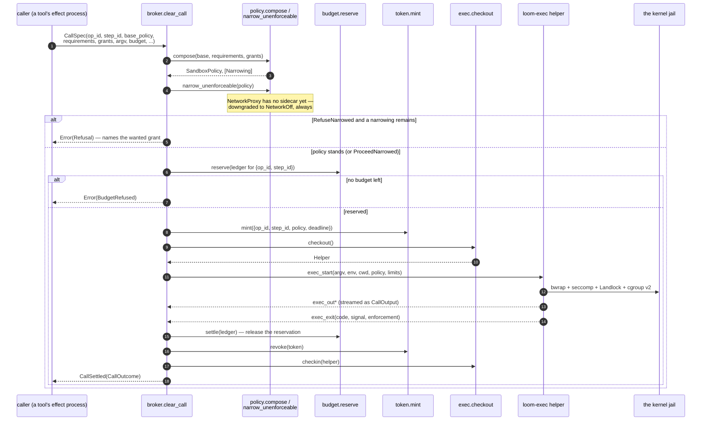
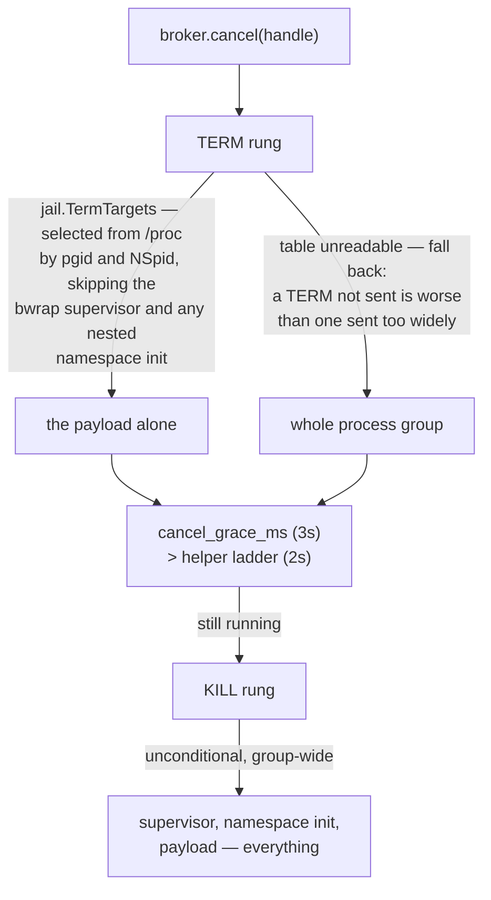

# broker

`broker` is the one door. Every effect a strand ever performs — a shell
command, a file read, a jailed build, a code-mode node — reaches the
outside world by going through `broker/broker.clear_call`, and there is
no second path in. What `clear_call` does in one call is compose a
sandbox policy, refuse or narrow whatever it cannot enforce, reserve
budget against a pooled ledger, mint a single-use capability token,
borrow a `loom-exec` helper from a pool, dispatch the jailed execution,
stream its output back, and settle. `packages/sandbox` is the Go binary
on the other end of the wire this package speaks; nothing here builds a
jail itself.

The broker also owns the frozen effect-plane wire protocol (spec Part
1.4) — the framing both sides decode, and the policy encoding that
travels on it.

## One call, start to finish

`clear_call` is a single `process.call` into the broker actor, but the
work behind it is five decisions in a fixed order, each of which can
refuse before anything is spent.

The budget ledger is keyed by `{op_id, step_id}`, not by call — that pair
*is* the execution identity (spec Part 1.4), so the first clearance for a
key opens the ledger and every later clearance under the same key
reserves against what is already there. Ten thousand polite parallel
reads inside one execution share one `max_outstanding` cap and one
aggregate wall deadline; none of them can widen it by carrying a bigger
budget field of its own. `abort(op_id)` frees every reservation for that
operation wholesale and cancels every running call under it — each still
settles in band with a `CallSettled` to its own caller.

`narrow_unenforceable` is not a corner case, it is the phase-1 default:
the egress proxy sidecar does not exist, so every `NetworkProxy` request
is downgraded to `NetworkOff` before dispatch, reported as an ordinary
`Narrowing`, and refused or proceeded per `CallSpec.response`. Nothing
that runs through `clear_call` can ever come back having enforced a
proxy allowlist it did not actually have.

## The cancel ladder, and why TERM skips the jail's own supervisor

`cancel` is `TERM` then, after a grace, `KILL` — but the two rungs are
addressed to different processes, and getting that wrong once cost the
whole grace period.

Under bwrap, the helper's direct child is a **supervisor** process that
is also the OS process-group leader, with a second bwrap acting as the
PID namespace's own init below it, and the payload below that. The
supervisor is spawned `--die-with-parent`. Signalling the *group* at the
TERM rung — which is what the ladder used to do — kills the supervisor,
whose death immediately SIGKILLs the namespace init and everything under
it. Measured: a payload that trapped `TERM` and looped for 30 seconds
died in 813 microseconds, by SIGKILL, having never been asked to stop.
`TERM → grace → KILL` was, in practice, just `KILL`.

`cancel_grace_ms` (3s, broker side) is required to exceed the helper's
own 2s ladder, or the broker would give up on a call the helper was
still gracefully ending.

**Read `ExecResult.code`, never `ExecResult.signal`, for how a payload
ended.** The helper waits on its *direct* child. Unjailed, that child is
the payload, so a TERM-killed payload reports `signal: 15, code: 143`.
Jailed, the direct child is the bwrap supervisor — which outlives the
payload and relays a signalled payload by *exiting* `128 + signal`
rather than dying of it, so the same TERM-killed payload reports
`signal: 0, code: 143`. `signal` therefore tells you whether a jail was
engaged, not whether the payload was signalled; `code` means the same
thing in both environments and is what separates the TERM rung (143)
from the KILL rung (137).

## Composition, capability, and what a token actually buys

`policy.compose` is most-restrictive-wins with one exception: writable
and readable roots compose prefix-aware (`/work` covers `/work/sub`),
environment allowlists intersect as exact strings, and a `NetworkProxy`
meets another `NetworkProxy` by intersecting their allowlists while
always keeping the base's harness-owned proxy address — but an
escalation's *grants* are the caller applying an explicit widening, never
an automatic one. Nothing here silently grows a session's base policy.

A token is 32 bytes of injected entropy bound to
`{op_id, step_id, policy, deadline}`, checked in constant time against
every entry in the vault (so a match's position leaks nothing), and
revoked at settlement. It is single-use: presenting it twice, or
presenting it for a different `{op_id, step_id}`, fails the check. What
it is *not* is a widening of what the jail itself allows — the token
authenticates a channel, and the sandbox policy it was minted for is what
actually confines the call (`packages/sandbox` speaks the other end and
enforces the layers described in its own `CLAUDE.md`).

`FullEnforcement` is the demand that checks the kernel's own word for
it, not just the helper's advertised features: it refuses a helper whose
`hello.features` are already degraded, and it fails any execution whose
`exec_exit` reports `degraded` — where "degraded" means the bool *or*
any `skip:` entry in the structured enforcement list, because the bool
alone only tracks the bwrap layer. `--allow-unenforced` is a different
knob entirely: it opts a genuinely unsupported *platform* out of the
refusal-to-serve, and passing it in place of `FullEnforcement`'s honest
skip report would replace a decision with a silence.

## The modules

| Module | What it holds |
|---|---|
| `broker/broker` | The actor: `clear_call`, `stdin`, `cancel`, `abort`, `stop`; `CallSpec`, `CallEvent`, `CallOutcome`, `Refusal`. |
| `broker/policy` | `SandboxPolicy` as typed data, `compose`, `narrow_unenforceable`, msgpack encode/decode. |
| `broker/token` | `Vault`, `mint`, `check`, `revoke`, `revoke_all` — constant-time, single-use tokens. |
| `broker/budget` | Pure pooled accounting: `Ledger`, `reserve`, `settle`, `outstanding`. |
| `broker/exec` | The helper actor and the pool: `Helper`, `Pool`, `ExecRequest`, `ExecResult`, the cancel ladder, the fd-3 policy handoff. |
| `broker/framing` | The wire protocol and its pure incremental `Deframer`. |
| `broker/escalation` | `Denial` → approval → single consume — the shapes; the durable record lives in `runtime/escalation`. |

Paths are relative to `packages/broker/src/` — `broker/exec` is
`packages/broker/src/broker/exec.gleam`.

## Reading further

- [`CLAUDE.md`](CLAUDE.md) — the reference doc for changing this code:
  key types, real dependency edges, actor and wire traffic, and the
  invariants that break things when violated. Read it before editing.
- [`docs/architecture/effects.md`](../../docs/architecture/effects.md) —
  the plane in full: the one door, the wire, the jail, enforced versus
  reported.
- [`packages/sandbox/CLAUDE.md`](../sandbox/CLAUDE.md) — the other end of
  the wire, and what each kernel layer actually enforces.
- [`docs/spec-gaps.md`](../../docs/spec-gaps.md) — "From WP-G
  (`broker`)": fd-3 delivery, port ownership, `step_id` typing, degraded
  refusal, grant bounds, the deferred MCP adapter.
