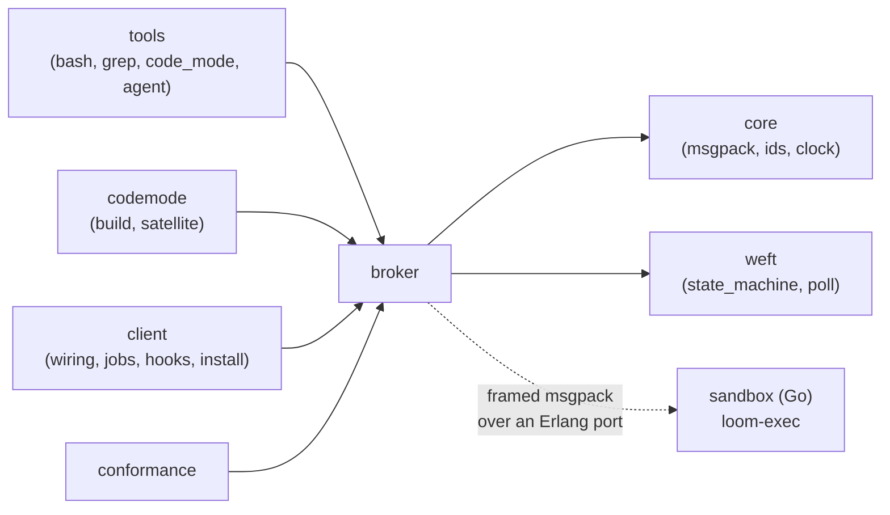
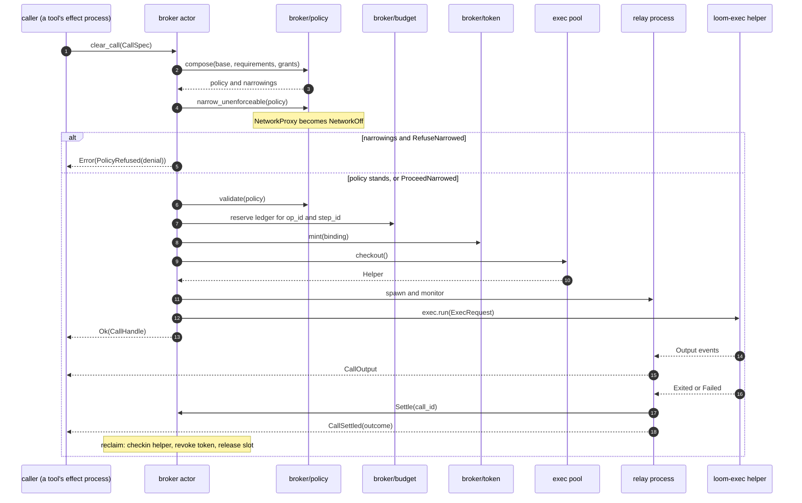
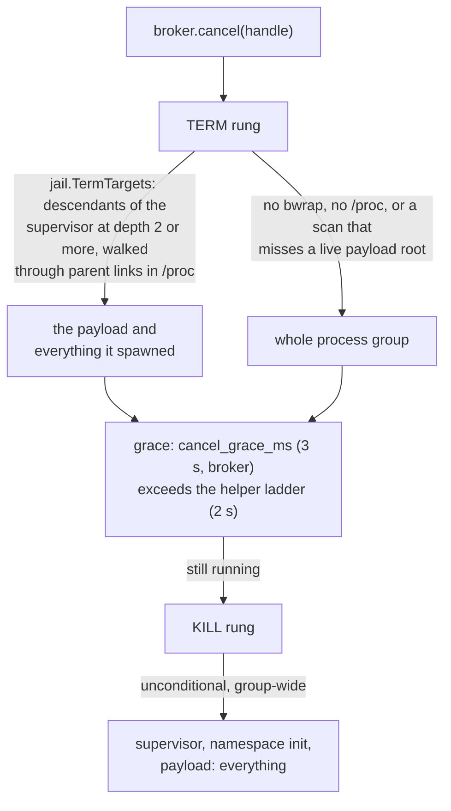

# broker

`broker` is the only way into the jail. Every jailed execution a strand
starts (a `bash` command, a `grep`, a code-mode build, a code-mode
satellite) goes through `broker/broker.clear_call`, and there is no second
way to start one. In one call, `clear_call` composes a sandbox policy,
refuses or narrows whatever it cannot enforce, reserves budget against a
pooled ledger, mints a capability token, borrows a `loom-exec` helper
from a pool, dispatches the execution, streams its output back, and
settles. `packages/sandbox` is the Go binary on the other end of the wire
this package speaks; nothing here builds a jail itself.

The broker is a separate package because it owns the effect plane's trust
boundary: the policy lattice, the tokens, the budget, and the frozen
effect-plane wire protocol (spec Part 1.4) that both sides decode. Not
every effect is jailed. The `fs_read`, `fs_write` and `fs_edit` tools run
in the harness and enforce their own path discipline (`tools/fs`), and
`broker/egress` makes outbound HTTPS requests from the harness on behalf
of a caller that has no socket (ADR-007).

## Where it sits

```mermaid
flowchart LR
    tools["tools<br/>(bash, grep, code_mode, agent)"]
    codemode["codemode<br/>(build, satellite)"]
    client["client<br/>(wiring, jobs, hooks, install)"]
    conformance["conformance"]
    broker["broker"]
    core["core<br/>(msgpack, ids, clock)"]
    weft["weft<br/>(state_machine, poll)"]
    sandbox["sandbox (Go)<br/>loom-exec"]

    tools --> broker
    codemode --> broker
    client --> broker
    conformance --> broker
    broker --> core
    broker --> weft
    broker -. "framed msgpack<br/>over an Erlang port" .-> sandbox
```

Solid edges are `gleam.toml` dependencies; the dotted edge is the wire.
`broker` also depends on `gleam_erlang` and `gleam_otp`: the broker, the
helper pool and each helper are processes.

## One call, start to finish

`clear_call` is one exchange with the broker actor, but the work behind
it is a fixed sequence of decisions, each of which can refuse before
anything is spent. After dispatch, a per-call relay process owns the
stream: it forwards output, enforces the wall deadline, and settles.

```mermaid
sequenceDiagram
    autonumber
    participant C as caller (a tool's effect process)
    participant Br as broker actor
    participant Pol as broker/policy
    participant Bud as broker/budget
    participant Tok as broker/token
    participant Pool as exec pool
    participant R as relay process
    participant H as loom-exec helper

    C->>Br: clear_call(CallSpec)
    Br->>Pol: compose(base, requirements, grants)
    Pol-->>Br: policy and narrowings
    Br->>Pol: narrow_unenforceable(policy)
    Note over Pol: NetworkProxy becomes NetworkOff
    alt narrowings and RefuseNarrowed
        Br-->>C: Error(PolicyRefused(denial))
    else policy stands, or ProceedNarrowed
        Br->>Pol: validate(policy)
        Br->>Bud: reserve ledger for op_id and step_id
        Br->>Tok: mint(binding)
        Br->>Pool: checkout()
        Pool-->>Br: Helper
        Br->>R: spawn and monitor
        Br->>H: exec.run(ExecRequest)
        Br-->>C: Ok(CallHandle)
        H-->>R: Output events
        R-->>C: CallOutput
        H-->>R: Exited or Failed
        R->>Br: Settle(call_id)
        R-->>C: CallSettled(outcome)
        Note over Br: reclaim: checkin helper, revoke token, release slot
    end
```

Each later step can still refuse: `InvalidPolicy`, `BudgetRefused`,
`MintRefused`, `NoHelper`, `OperationAborted` and `BrokerUnavailable`
are the other `Refusal` variants. A step that refuses hands back what the
earlier steps took, so a refused clearance holds no ledger slot and no
live token. If the relay dies without settling, the broker's monitor
fires and it cancels the execution and reclaims the same three things.

The budget ledger is keyed by `{op_id, step_id}`, not by call. That pair
is the batch identity (spec Part 1.4), so the first clearance for a key
opens the ledger with its own budget, and every later clearance under the
same key reserves against the stored budget, which its own budget field
cannot widen. Ten thousand parallel reads inside one execution share one
`max_outstanding` cap and one aggregate wall deadline.
`docs/adr/005-budget-pooling-granularity.md` records the decision and its
addenda. `abort(op_id)` revokes every token of the operation, cancels its
running calls, and drops its ledgers; `abort_step(op_id, step_id:)` does
the same for one step and leaves sibling steps (a code-mode background
job clears under `{op_id, "job/" <> id}`) running. Each cancelled call
still settles in band with one `CallSettled`.

A full pool is congestion, not a verdict. `clear_call` retries a
`NoHelper(AllBusy(..))` refusal from the caller's own process, within the
caller's `waiting` budget, because the broker can only check a helper back
in from its own message loop. A retry that resumes across an `abort` is
refused with `OperationAborted`, so a sweep cannot miss an execution that
was still waiting for a helper.

`narrow_unenforceable` is the default path, not a corner case. The egress
proxy sidecar does not exist, so every `NetworkProxy` request becomes
`NetworkOff` before dispatch, is reported as an ordinary `Narrowing`, and
is refused or run per `CallSpec.response`. No execution can report that a
proxy allowlist was enforced.

## The cancel ladder, and why TERM skips the jail's own supervisor

`cancel` sends `TERM`, waits a grace period, then sends `KILL`. The two
rungs are addressed to different processes.

Under bwrap, the helper's direct child is a supervisor process that is
also the process-group leader. Its child is a second bwrap that is PID 1
of the new PID namespace, and the payload runs below that. The supervisor
is spawned with `--die-with-parent`. Sending `TERM` to the whole group, as
the ladder once did, killed the supervisor, whose death SIGKILLed the
namespace init and everything under it. A payload that trapped `TERM` and
looped for 30 seconds died by SIGKILL in under a millisecond, so
`TERM → grace → KILL` was in practice `KILL`.

```mermaid
flowchart TD
    Cancel["broker.cancel(handle)"]
    Term["TERM rung"]
    Grace["grace: cancel_grace_ms (3 s, broker)<br/>exceeds the helper ladder (2 s)"]
    Kill["KILL rung"]

    Cancel --> Term
    Term -->|"jail.TermTargets: descendants of the<br/>supervisor at depth 2 or more, walked<br/>through parent links in /proc"| Payload["the payload and<br/>everything it spawned"]
    Term -->|"no bwrap, no /proc, or a scan that<br/>misses a live payload root"| Group1["whole process group"]
    Payload --> Grace
    Group1 --> Grace
    Grace -->|still running| Kill
    Kill -->|"unconditional, group-wide"| Group2["supervisor, namespace init,<br/>payload: everything"]
```

The selection walks descent rather than process-group membership because
a payload can leave its group with `setsid(2)` but cannot stop being its
parent's child. `packages/sandbox/internal/jail/cancel.go` has the full
argument, including why a partial `/proc` scan falls back to the group.

**Read `ExecResult.code`, never `ExecResult.signal`, for how a payload
ended.** The helper waits on its direct child. Unjailed, that child is the
payload, so a TERM-killed payload reports `signal: 15, code: 143`. Jailed,
the direct child is the bwrap supervisor, which outlives the payload and
relays a signalled payload by exiting with `128 + signal`, so the same
payload reports `signal: 0, code: 143`. `signal` therefore tells you
whether a jail was engaged. `code` means the same thing in both
environments and separates the TERM rung (143) from the KILL rung (137).
To assert that the helper truncated a run, assert `ExecResult.cancelled`
(protocol-change/006); an exit status alone cannot say it.

## Composition, capability, and what a token buys

`policy.compose` is most-restrictive-wins, applied field by field, and
then adds the escalation grants the caller passed. Writable and readable
roots meet prefix-aware (`/work` covers `/work/sub`); environment
allowlists intersect as exact strings; two `NetworkProxy` policies meet
by intersecting their allowlists while keeping the base's harness-owned
proxy address; mounts intersect by exact path at the weaker access, and
no grant adds one (protocol-change/004). Grants are the only widening,
and the caller supplies them explicitly after an approval. Nothing here
grows a session's base policy.

A token is 32 bytes of injected entropy bound to
`{op_id, step_id, policy, deadline}`. `token.check` compares presented
bytes in constant time against every entry in the vault, so the position
of a match leaks nothing, and `check_for` also requires the binding's
`{op_id, step_id}`. A token is valid for one execution: many `cap_call`s
from that execution may present it, and it is revoked at settlement,
after which it fails with `Revoked`. It authenticates a channel. The
sandbox policy it was minted for is what confines the call.

`EnforcementDemand` says how much of the jail the caller requires.
`FullEnforcement` refuses a helper whose `hello.features` are already
degraded, and fails any execution whose `exec_exit` reports the
`degraded` bool, any `skip:` entry, or a layer the policy called for that
the report never mentions. `PlatformEnforcement` is the production
default: identical on Linux, and on Darwin it accepts only the three gaps
ADR-006 documents, each of which must still appear in the report.
`BestEffort` accepts whatever the helper could enforce. `loomd`'s
`--full-enforcement` and `--best-effort` flags select the other two. The
helper's own `--allow-unenforced` flag is different: it lets a platform
with no jail at all serve, and it is never a substitute for reporting a
degraded Linux host.

## A tour of the modules

Paths are relative to `packages/broker/src/`. Read them in this order.

- `broker/policy`: `SandboxPolicy` (policy wire version 2) as typed data,
  with `NetworkPolicy`, `Limits`, `Scratch` and `Mount`. `compose`,
  `narrow_unenforceable`, `validate` and `wanted_grants` are the lattice;
  `encode` and `decode` are its msgpack form.
- `broker/budget`: pure pooled accounting. A `Ledger` opened from a
  `Budget` answers `reserve` with `OutstandingCapReached` or
  `DeadlinePassed`, and `settle` never underflows.
- `broker/token`: the `Vault` of `Token`s and their `Binding`s: `mint`,
  `check`, `check_for`, `revoke`, `revoke_all` and `revoke_step`.
- `broker/escalation`: an opaque `Escalation` moving from pending to
  approved and then consumed once, or to rejected. `approve` accepts only
  grants from the `Denial`'s wanted list. The durable record lives in
  `runtime/escalation`.
- `broker/framing`: the wire protocol. `Frame` and `Body` are the frame
  kinds, `exec_protocol_version` is 3, `max_frame_bytes` is 16 MiB, and
  `Deframer` is a pure incremental decoder whose faults are values.
- `broker/exec`: the helper and the pool. Each `Helper` is a
  `weft/state_machine` whose `Phase` is `Prepared`, `AwaitingHello`,
  `Idle`, `Running`, `Cancelling` or `Dead`; the `Pool` lends helpers and
  proves their retirement. `ExecRequest`, `ExecResult`, `ExecFailure` and
  `EnforcementDemand` are the execution vocabulary, and `SpawnConfig`
  holds the fd-3 policy handoff.
- `broker/broker`: the actor. `clear_call`, `stdin`, `cancel`, `abort`,
  `abort_step` and `stop`, with `CallSpec`, `CallEvent`, `CallOutcome`
  and `Refusal`.
- `broker/egress`: outbound HTTPS from the harness under a `Policy` the
  caller cannot widen. `request` performs one; `one_host` is the policy
  for `loom ext install`; a `Secret` binds an environment variable name
  to one header and one origin so the caller never sees the value.
- `broker/internal/call`: `try_call`, a `process.call` that returns
  `NoReply` or `CalleeGone` instead of panicking. Every exchange on the
  clearance path uses it.
- `broker/internal/ffi_*`: crypto, OS, port and `httpc` access, backed by
  `broker_ffi.erl`. The rest of the package takes these as injected
  functions, so tests substitute deterministic ones.

## How it is tested

`make check-broker` runs the package gate: format check, a warning-free
build, and the test suite. `make test-broker` runs only the tests.

Most suites run against injected seams, not a real jail.
`test/broker/support/fake_helper.gleam` speaks the helper's side of the
wire, so `broker_test` and `exec_test` drive clearance, streaming,
cancellation, aborts, congestion and relay death without an OS process.
`policy_test`, `budget_test`, `token_test`, `escalation_test` and
`framing_test` cover the pure modules. `retirement_test` pins the pool's
retirement proofs. `egress_test` runs against a real loopback TLS origin
whose root it pins. `protocol_version_test` reads the Go source so the
two ends' `exec_protocol_version` literals cannot drift.
`integration_test` builds the real `loom-exec` with `go` and drives it
through the pool; it skips, printing the reason, when `go` is missing or
the host has no jail. The jailed end-to-end lives in `conformance`
(`make e2e`).

## Reading further

- [`CLAUDE.md`](CLAUDE.md): the reference for changing this code: key
  types, dependency edges, actor and wire traffic, and the invariants.
  Read it before editing.
- [`docs/architecture/effects.md`](../../docs/architecture/effects.md):
  the effect plane in full: the one door, the wire, the jail, enforced
  versus reported.
- [`packages/sandbox/README.md`](../sandbox/README.md): the other end of
  the wire, and what each kernel layer enforces.
- [ADR-005](../../docs/adr/005-budget-pooling-granularity.md) (budget
  pooling), [ADR-006](../../docs/adr/006-macos-seatbelt-boundary.md) (the
  Darwin boundary), and
  [ADR-007](../../docs/adr/007-extension-tiers-and-brokered-egress.md)
  (brokered egress).
- Protocol changes to this wire:
  [004](../../protocol-change/004-sandbox-policy-explicit-mounts.md)
  (mounts), [006](../../protocol-change/006-exec-exit-cancelled.md)
  (`cancelled`), [012](../../protocol-change/012-hook-call.md)
  (`hook_call`), [014](../../protocol-change/014-helper-shutdown-witness.md)
  (shutdown witness), and
  [017](../../protocol-change/017-exec-protocol-version.md) (the exec
  protocol version).
- [`docs/spec-gaps.md`](../../docs/spec-gaps.md), "From WP-G
  (`broker`)": fd-3 delivery, port ownership, `step_id` typing, degraded
  refusal, grant bounds, the deferred MCP adapter.
