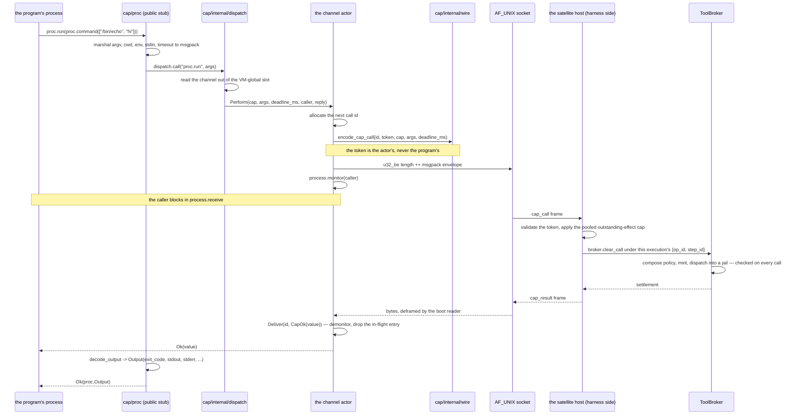
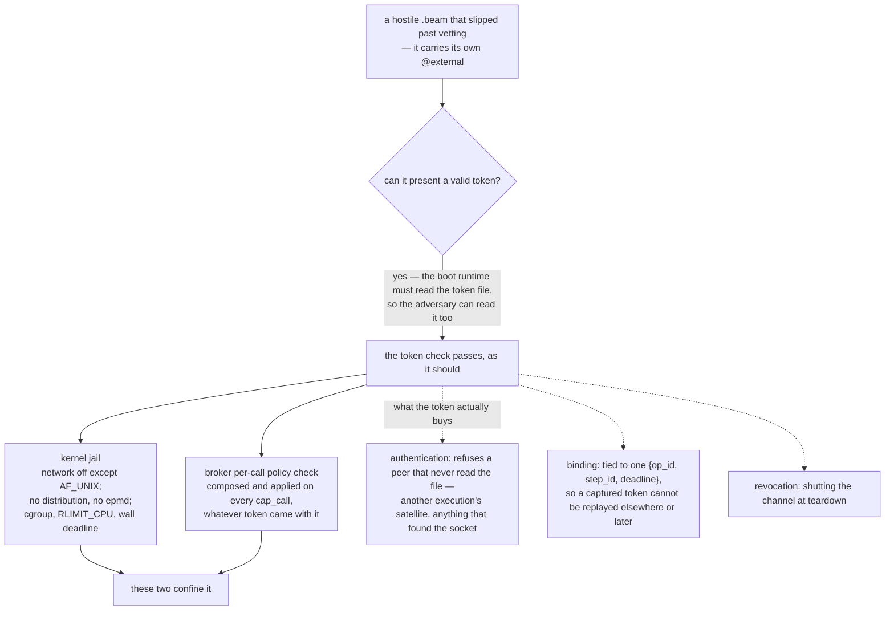
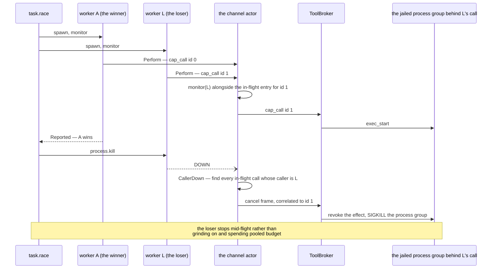

# cap

The capability prelude: the language a code-mode program is written
against, and the boot runtime that runs it.

This package is unusual in Loom because **it does not run in the harness**.
It is compiled into a disposable, jailed satellite node together with a
model-written program, and everything in it executes on the untrusted side
of the kernel boundary. Nothing in the harness imports it. It is a separate
build target so that it can one day be published on its own.

What it provides is a set of typed Gleam modules — `cap/fs`, `cap/proc`,
`cap/net`, `cap/git`, `cap/lsp`, `cap/kv`, `cap/report`, `cap/task`,
`cap/actor` — that look like an ordinary standard library and are in fact
remote procedure call stubs. A program calls `fs.read(path)`; what happens
is that the arguments are marshalled into a `cap_call` frame, written to a
single AF_UNIX socket, and the calling process blocks until the matching
`cap_result` comes back. The broker on the other end is the thing that
actually reads.

That arrangement is the point of the whole design:

> A Gleam program's maximal capability set is computable from its source:
> the transitive closure of its imports plus its own `@external`
> declarations.

Pure Gleam cannot touch the world — no reflection, no `eval`, no dynamic
module lookup, no macros — so every effect must enter through an import.
Because effects arrive only through these modules, **the import list is
the permission grant.** A program that opens with `import cap/fs` and
`import cap/proc` can read files and run processes; it cannot open a
socket, because it did not import `cap/net` and the socket-opening
function is therefore not in its reach. Permissions are not configuration
attached from outside. They are visible in the first few lines the program
wrote.

The lint that checks those imports, the hermetic build that pins them, and
the satellite host at the other end of the socket all live in
`packages/codemode`. [`docs/architecture/code-mode.md`](../../docs/architecture/code-mode.md)
is the argument for the whole pipeline.

## One call, end to end

Follow a `proc.run` from source to a value.



The type checker validated the arguments at compile time, so a `cap_call`
that reaches the host is already well-formed. What the broker adds is the
runtime authority check: the token could have been revoked, the policy
could refuse this path, the deadline could have passed. **Vetting bounds
what a program can ask for; the broker decides, per call, what it gets.**

A non-zero exit is data, not an error — it comes back in
`Output.exit_code`. Only a refusal, a failed spawn, or a lost channel is a
`ProcError`. Every public module maps the channel's two error shapes,
`Denied(code, message)` from the broker and `Unreachable(reason)` from the
transport, onto its own typed error.

The wire is the frozen Part 1.4 envelope: `u32_be` length prefix, msgpack
map `{v: 1, id, kind, body}`, 16 MiB payload cap. Out go `cap_call` and
`cancel`; in comes `cap_result`, the only kind a satellite acts on. A
well-formed frame of any other kind is dropped and the channel stays open.

## The security shape, stated exactly

Three claims here are easy to state slightly wrong, and the loose version
of each is a different claim from the true one.



**A program cannot name the seam.** `cap/internal/*` is an internal
module, which the Gleam compiler forbids another package from importing —
and a submitted program is a separate package. No public cap function
takes a channel or a token as an argument either. Both are held inside the
channel actor and fetched per call through `cap/internal/dispatch`. The
program can neither supply, read, nor replace them, and the failure is a
compile error inside the sandboxed build, before a node ever starts.

**The token authenticates the channel; it does not confine an escaped
`.beam`.** The boot runtime has to read the token file, and its path is an
ordinary environment variable, so a hand-written `.beam` reads the file and
presents the genuine token. The check then passes, correctly. What confines
that adversary is the kernel jail — the socket is the only thing the node
can reach at all — plus the broker's per-call policy check. It is not a
bearer capability, and no call gets more for having carried a valid one.

**Deny-by-default for `cap/net` is a broker property.** Nothing in
`cap/net` refuses anything: its functions marshal and dispatch exactly as
`cap/fs.read` does, and the refusal is composed and returned by the broker.
The module only labels it. The design's guarantee still holds, because
there is no policy field for a program to flip and so no way for a program
to widen its own network access — but it holds in the broker, not in the
prelude.

**What is routed today.** The harness-side default router services exactly
one capability, `proc.run`, and within it argv alone. Everything else in
the prelude compiles, marshals, dispatches, and comes back refused in band
with `unsupported_cap`; a `Command` carrying `in_dir`, `with_env`,
`with_stdin`, or `with_timeout` is denied as `unsupported_argument` rather
than run without it. None of that refusal is a security property. It is a
routing table still being filled in, and
[`docs/architecture/code-mode.md`](../../docs/architecture/code-mode.md)
tracks what the fuller bridge will add.

## Cancellation is real, not advisory

`cap/task` gives structured concurrency and nothing else — there is no raw
`spawn` here, because raw spawn would allow unbounded process creation and
messages to arbitrary registered names, including the cap channel itself.
The combinators are `parallel_map`, `parallel_map_fail_fast`, `all`,
`both`, and `race`.

When `race` picks a winner the losers are *killed*, and the interesting
question is what happens to the work they had already started outside the
virtual machine.



No cooperation from the dying process is needed, because the channel
monitors the *caller* of every in-flight call. A worker blocked awaiting a
`cap_result` is exactly that caller, so its death is the signal.

Three semantics are pinned. `parallel_map` preserves input order
regardless of completion order, so result *i* always corresponds to input
*i* even when input *i* finished last. Failures aggregate by default —
every task still runs and the error is the list of all of them — with
`parallel_map_fail_fast` available when the first error should abort the
rest. And `Failure(e)` distinguishes `Returned(index, error)` from
`Crashed(index, reason)`, so a killed branch is never mistaken for a
branch that returned an error.

**Where the structure ends, honestly.** Workers are spawned unlinked and
monitored, and the combinator drives cancellation from its own loop. That
holds exactly as long as the combinator's process does. If something kills
it out from under the loop — most plausibly a linked `cap/actor` crashing
while `main` is blocked inside a combinator — the workers are orphaned and
keep running, spending pooled budget, until the node is torn down. The
guarantee to state is therefore **"no work outlives the satellite"**; "no
work outlives its call" holds only while the combinator is alive. Linking
workers into a per-combinator sub-supervisor would make the stronger claim
true, and is a recorded follow-up rather than today's behaviour.

## Actors, and where the link runs

`cap/actor` is a constrained `gen_server`: spawn with an initial state and
a typed handler, receive an unforgeable typed `Address(state, msg)`, then
`send`, `call(timeout)`, or `get`. Both type parameters ride on the
address, which is what makes `call` and `get` fully typed. There is no
global registration, so no actor can be addressed by a name another
program could guess.

Actors earn their keep for ongoing state driven by asynchronous input:
watching a build's output stream and reacting to the first error,
coordinating a debugger stepping session, running a work-stealing queue
whose items generate more items. Mailboxes are bounded and the
backpressure is real — `send` admits a message only when the queue has
room and parks the sender inside `send` until a slot frees, so a fast
producer is bounded by how many processes are pushing rather than by
message rate.

The supervision policy is fixed, and "all-for-one" describes its common
case rather than a guarantee that holds from anywhere. **The link runs
between an actor and its spawner.** An actor spawned by `main` is linked
to the program root, so its abnormal crash fails the program as a unit and
the strand sees a structured error. An actor spawned inside a `cap/task`
branch is linked to that branch's worker instead, so its crash is
contained to the branch and surfaces as a `Crashed` failure while the
program carries on. That is fault isolation rather than all-for-one, and
which one a given spawn site gets is worth knowing.

What is excluded either way is the rest of OTP: links and monitors with
custom trap-exit logic, and self-defined supervision strategies. Those
belong to installed extensions, where a human approved them. A jailed
program does not get to invent its own failure semantics.

## The boot runtime

`cap/runtime` is what the generated entry module calls. The compile
service emits that module verbatim:

```gleam
import cap/runtime
import program

pub fn main() -> Nil {
  runtime.run(program.main)
}
```

`run` reads two environment variables — `LOOM_CAP_SOCK` for the AF_UNIX
socket and `LOOM_CAP_TOKEN_FILE` for the private token file — builds the
production transport, and boots. `boot` is the testable core beneath it,
taking its transport as plain function values so the whole round trip runs
in-process with no socket.

```mermaid
stateDiagram-v2
  [*] --> Starting: run(program.main)
  Starting --> ChannelUp: channel.start(token, send)
  Starting --> Failed: ChannelStartFailed
  ChannelUp --> Claiming: dispatch.install_exclusive(channel, owner)
  Claiming --> Refused: a prior execution's channel actor is still alive
  Refused --> Failed: ChannelSlotOccupied — the channel just started is stopped again
  Claiming --> Reading: the VM-global slot is claimed
  Reading --> Running: the inbound reader is spawned, main runs in a monitored child
  Running --> Running: cap_result frames delivered to in-flight callers
  Running --> Settled: main returns a report.Outcome
  Running --> Settled: main crashes — the DOWN becomes an Errored outcome
  Settled --> Emitted: exactly one outcome frame written to the sink
  Emitted --> TornDown: kill the reader, stop the channel, dispatch.release(owner)
  TornDown --> [*]
  Failed --> [*]: no outcome emitted; the host observes the absence
```



Two details in that lifecycle are doing real work.

**Installing over a live channel is refused.** The channel lives in a
VM-global slot installed per execution. In the kept-alive satellite mode
the design wants later, a process that survived execution *N* would read
execution *N+1*'s channel on its next capability call and act under
*N+1*'s token and policy. The invariant that rules this out is external to
this package — the executor must reap every process a program spawned
before the next execution installs — so `install_exclusive` refuses to
overwrite a slot whose channel actor is still alive, making the obligation
fail loudly instead of silently lending authority. `release` is a
compare-and-clear, so a slow teardown cannot clear a later execution's
slot. A fresh node per execution, which is all that runs today, never
reaches the case.

**Exactly one `outcome` frame per execution.** A program is a
`fn() -> report.Outcome`, and the runtime marshals whatever it returns —
`Completed(value)` or `Errored(message, details)` — into a terminal frame
`{v: 1, id: 0, kind: "outcome", body}` on the same socket. The strand
receives a structured value off the wire and never scrapes stdout. The
frozen `broker/framing` does not know that kind, because it is a
satellite-to-host result rather than a broker frame, so the host reads the
outcome with its own decoder.

`main` runs in a monitored child specifically so that a crash inside
untrusted program code becomes an `Errored` outcome rather than a dead
node with nothing to report.

## Totality at every boundary

Nothing here panics. A wrong-shape `cap_result` field is a `String` fault
the calling module maps to its own typed error. An oversized length
prefix, an unparseable payload, or an unsupported protocol version is an
`inbound.Fault`: it settles every in-flight call in band and closes the
channel, so a program blocked on a result that will never arrive unblocks
at once instead of waiting out its deadline. A well-formed frame of an
unrecognized kind is dropped and the channel stays open, because the peer
may be newer. Teardown settles in-flight calls the same way `Fail` does,
for the same reason.

## Why this package does not depend on `broker`

It would be the obvious edge, and it is deliberately absent. `cap` is the
untrusted far side of the effect-plane wire, not a peer of the broker, so
the frozen Part 1.4 envelope it needs is reproduced over `core/msgpack` in
`cap/internal/wire` for the write half and `cap/internal/inbound` for the
read half, rather than borrowed from `broker/framing`. `packages/codemode`
is its counterpart and restates the shared names — `LOOM_CAP_SOCK`,
`LOOM_CAP_TOKEN_FILE`, the `outcome` frame kind — rather than importing
them, because linking model-facing code into the harness virtual machine
would break Rule Zero. Report the divergence from the spec's dependency
graph; do not close it by adding the edge.

## Where to look

| Path | What it holds |
|---|---|
| `src/cap/proc.gleam`, `fs.gleam`, `net.gleam`, `git.gleam`, `lsp.gleam`, `kv.gleam`, `report.gleam` | The capability modules — typed stubs over one `cap_call` each. |
| `src/cap/task.gleam` | Structured concurrency: the five combinators, ordering, aggregation, and the kill path. |
| `src/cap/actor.gleam` | Program-scoped actors: `Address`, `Next`, `Reply`, bounded mailboxes, parking `send`. |
| `src/cap/runtime.gleam` | The boot runtime: the environment contract, `boot`, `run`, the inbound reader, the outcome frame. |
| `src/cap/internal/channel.gleam` | The channel actor: the token, call ids, the in-flight table, caller monitors, the cancel path. |
| `src/cap/internal/dispatch.gleam` | The one front door: slot resolution, `install_exclusive`, `release`. |
| `src/cap/internal/wire.gleam`, `inbound.gleam` | The frozen envelope, encoded and decoded locally over `core/msgpack`. |
| `src/cap/internal/ffi_registry.gleam`, `ffi_transport.gleam` | `persistent_term`, and `getenv` plus a file read plus `gen_tcp` over AF_UNIX. The whole of this package's impurity. |

[`CLAUDE.md`](CLAUDE.md) is the reference doc for changing this code. The
two trust layers and what each one actually confines are in
[`docs/architecture/code-mode.md`](../../docs/architecture/code-mode.md);
the one door, the framed wire, the jail, and Rule Zero are in
[`docs/architecture/effects.md`](../../docs/architecture/effects.md); and
[`packages/codemode/CLAUDE.md`](../codemode/CLAUDE.md) is the harness side
of this channel.
