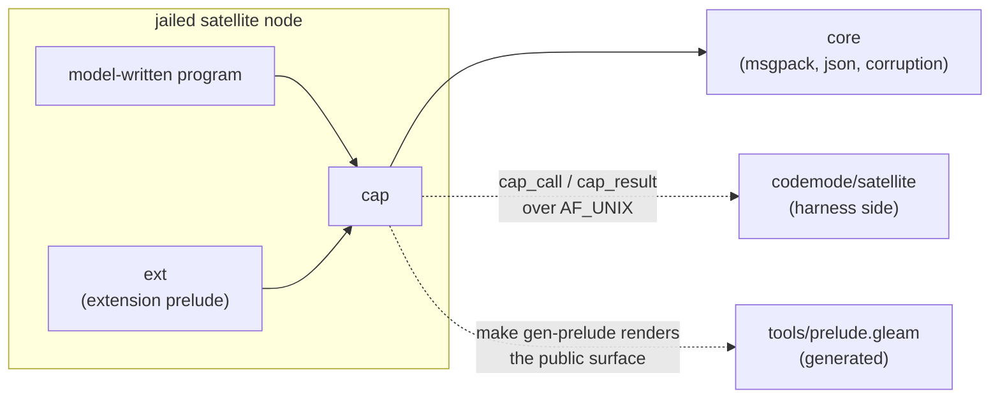
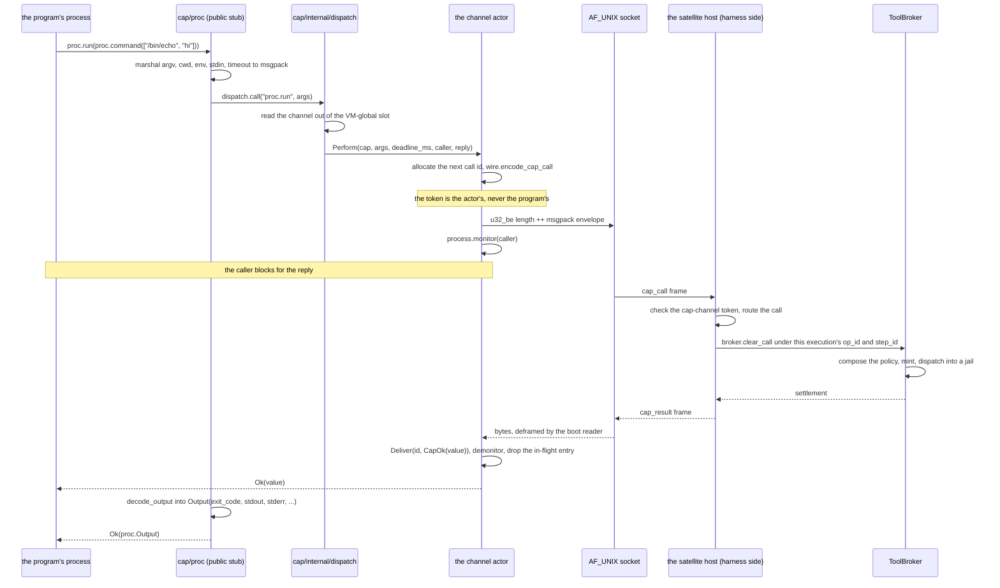
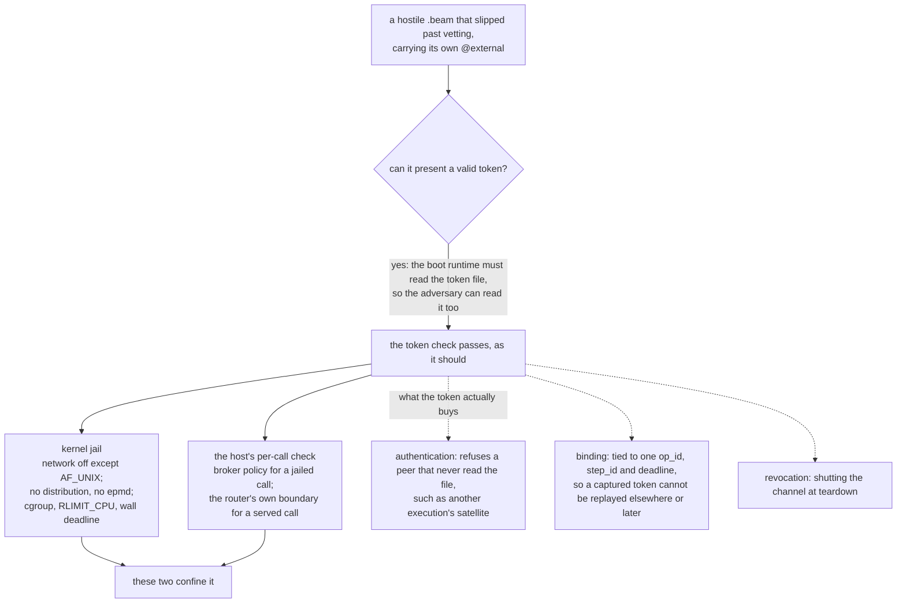
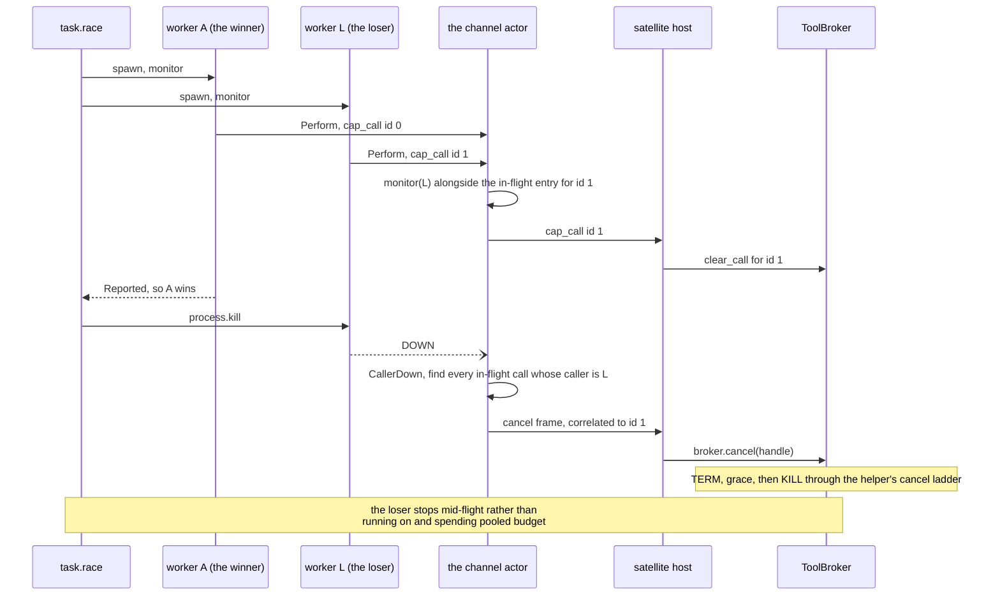
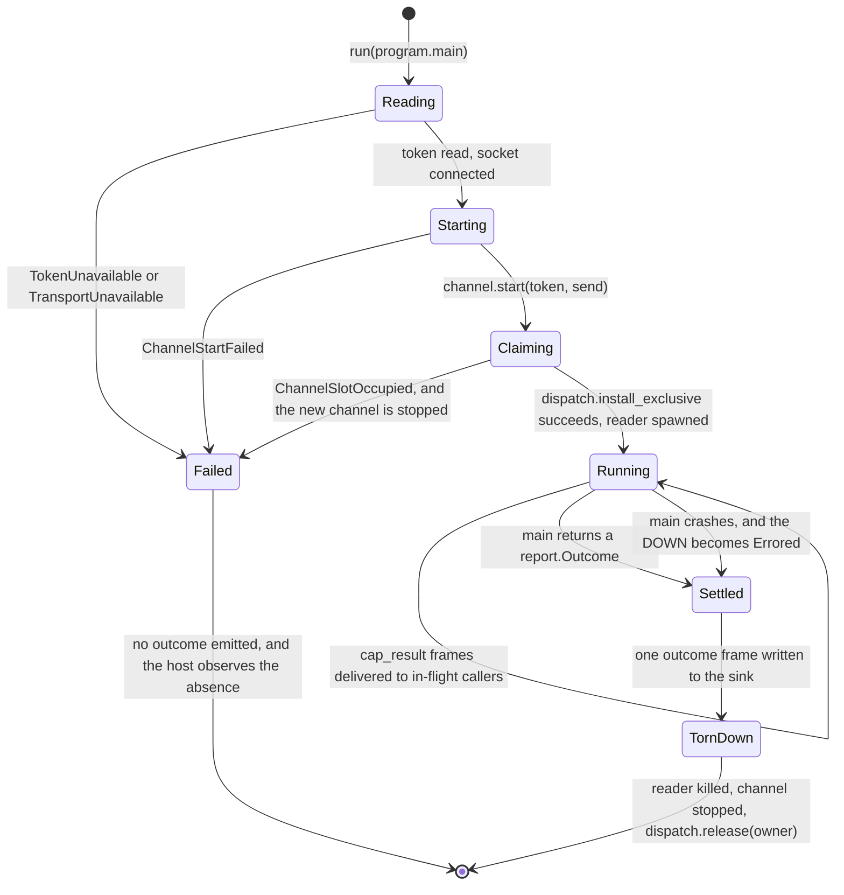

# cap

The capability prelude: the language a code-mode program is written
against, and the boot runtime that runs it.

This package is unusual in Loom because **it does not run in the harness**.
It is compiled into a disposable, jailed satellite node together with a
model-written program, and everything in it executes on the untrusted side
of the kernel boundary. No harness package imports it; its only dependent
is `packages/ext`, the extension prelude, which runs in the satellite too.
It is a separate build target so that it can one day be published on its
own.

What it provides is a set of typed Gleam modules (`cap/fs`, `cap/proc`,
`cap/search`, `cap/strand`, `cap/job` and the rest, listed in the tour
below) that look like an ordinary standard library and are in fact remote
procedure call stubs. A program calls `proc.run(command)`; what happens is
that the arguments are marshalled into a `cap_call` frame, written to a
single AF_UNIX socket, and the calling process blocks until the matching
`cap_result` comes back. The satellite host on the other end of the socket
(`packages/codemode`) decides whether and how to perform the call.

That arrangement is the point of the whole design:

> A Gleam program's maximal capability set is computable from its source:
> the transitive closure of its imports plus its own `@external`
> declarations.

Pure Gleam cannot touch the world (no reflection, no `eval`, no dynamic
module lookup, no macros), so every effect must enter through an import.
Because effects arrive only through these modules, **the import list is
the permission grant.** A program that opens with `import cap/fs` and
`import cap/proc` can read files and run processes; it cannot make a
network request, because it did not import `cap/net` and the function
that asks for one is therefore not in its reach. Permissions are not
configuration attached from outside. They are visible in the first few
lines the program wrote.

The lint that checks those imports, the hermetic build that pins them, and
the satellite host at the other end of the socket all live in
`packages/codemode`. [`docs/architecture/code-mode.md`](../../docs/architecture/code-mode.md)
is the argument for the whole pipeline.

## Where it sits


```mermaid
flowchart LR
    subgraph satellite["jailed satellite node"]
        program["model-written program"]
        ext["ext<br/>(extension prelude)"]
        cap["cap"]
    end
    core["core<br/>(msgpack, json, corruption)"]
    host["codemode/satellite<br/>(harness side)"]
    prelude["tools/prelude.gleam<br/>(generated)"]

    program --> cap
    ext --> cap
    cap --> core
    cap -. "cap_call / cap_result<br/>over AF_UNIX" .-> host
    cap -. "make gen-prelude renders<br/>the public surface" .-> prelude
```

`cap`'s `gleam.toml` names `core`, `gleam_erlang` and `gleam_otp`, and
nothing else. A compiled program depends on `cap` by being built against
a vendored copy inside its own build root. The two dotted edges are not
imports: one is the wire, and the other is the generated description of
this package's public surface that the `code_mode` tool carries (see
"How it is tested").

## One call, end to end

Follow a `proc.run` from source to a value. `proc.run` is the one
capability that becomes a jailed execution; the diagram after this one
names what happens to the others.


```mermaid
sequenceDiagram
  participant P as the program's process
  participant M as cap/proc (public stub)
  participant D as cap/internal/dispatch
  participant C as the channel actor
  participant S as AF_UNIX socket
  participant H as the satellite host (harness side)
  participant B as ToolBroker

  P->>M: proc.run(proc.command(["/bin/echo", "hi"]))
  M->>M: marshal argv, cwd, env, stdin, timeout to msgpack
  M->>D: dispatch.call("proc.run", args)
  D->>D: read the channel out of the VM-global slot
  D->>C: Perform(cap, args, deadline_ms, caller, reply)
  C->>C: allocate the next call id, wire.encode_cap_call
  Note over C: the token is the actor's, never the program's
  C->>S: u32_be length ++ msgpack envelope
  C->>C: process.monitor(caller)
  Note over P,C: the caller blocks for the reply
  S->>H: cap_call frame
  H->>H: check the cap-channel token, route the call
  H->>B: broker.clear_call under this execution's op_id and step_id
  B->>B: compose the policy, mint, dispatch into a jail
  B-->>H: settlement
  H-->>S: cap_result frame
  S-->>C: bytes, deframed by the boot reader
  C->>C: Deliver(id, CapOk(value)), demonitor, drop the in-flight entry
  C-->>P: Ok(value)
  M->>M: decode_output into Output(exit_code, stdout, stderr, ...)
  M-->>P: Ok(proc.Output)
```

The type checker validated the arguments at compile time, so a `cap_call`
that reaches the host is already well-formed. What the host adds is the
runtime authority check: the token could have been revoked, the policy
could refuse this path, the deadline could have passed. **Vetting bounds
what a program can ask for; the host decides, per call, what it gets.**

A non-zero exit is data, not an error; it comes back in
`Output.exit_code`. Only a refusal, a failed spawn, or a lost channel is a
`ProcError`. Every public module maps the channel's two error shapes,
`Denied(code, message)` from the host and `Unreachable(reason)` from the
transport, onto its own typed error.

The wire is the frozen Part 1.4 envelope: `u32_be` length prefix, msgpack
map `{v: 1, id, kind, body}`, 16 MiB payload cap. Out go `cap_call` and
`cancel`; in comes `cap_result`, plus `hook_call` on a serving node (see
"The boot runtime"). A well-formed frame of any other kind is dropped and
the channel stays open.

## Who answers which capability

The host's router is a chain of arms, each handing what it does not answer
to the arm beneath. Only the innermost arm, `satellite.default_router`,
builds a `broker.CallSpec`, and it answers `proc.run` alone. The other
arms answer in the harness itself, as `ServedHere` plans that enter no
jail, because reading a workspace file or writing a scratch value spawns
no process and has no jail to enforce a policy on
(`codemode/workspace`'s module doc has the argument).

| Capability names | Answered by |
|---|---|
| `proc.run` | `codemode/satellite.default_router`, cleared into a jail through the broker. Only argv is serviced: a `Command` carrying `in_dir`, `with_env`, `with_stdin` or `with_timeout` is refused as `unsupported_argument` rather than run without it. |
| `fs.*`, `kv.*`, `report.emit`, `job.*`, `schedule.*` | `codemode/workspace`, through `tools/fs`'s own path checks and the host's job and schedule doors. |
| `search.*` | `codemode/search`. |
| `notes.*` (and `note://` reads through `cap/fs.read`) | `codemode/notes`, on hosts with a notes door (protocol-change/045). |
| `strand.*` | `codemode/orchestration`, over the same closures the `agent_*` tools use. |
| `mcp.<server>` | `client/mcp`, only where that server is configured. |
| `execution.*`, `peer.*`, `workflow.step` | `client/async_codemode`, `client/peers` and `client/workflows` (protocol-change/048). |
| `net.request` | The extension seam only (`client/extension/seam`), performed by `broker/egress` from the harness (ADR-007). |
| `lsp.*`, and anything unrouted | Refused in band with `unsupported_cap`. |

`cap/git` needs no routing: it is built out of `cap/proc` inside the
satellite. None of these refusals is a security property. Which modules a
program may import at all is a separate question, answered per seam by
`codemode/vet/policy`.

## The security shape, stated exactly

Three claims here are easy to state slightly wrong, and the loose version
of each is a different claim from the true one.


```mermaid
flowchart TD
  ADV["a hostile .beam that slipped past vetting,<br/>carrying its own @external"]

  ADV --> T{"can it present a valid token?"}
  T -->|"yes: the boot runtime must read the token file,<br/>so the adversary can read it too"| TOK["the token check passes, as it should"]

  TOK --> J["kernel jail<br/>network off except AF_UNIX;<br/>no distribution, no epmd;<br/>cgroup, RLIMIT_CPU, wall deadline"]
  TOK --> BR["the host's per-call check<br/>broker policy for a jailed call;<br/>the router's own boundary for a served call"]

  J --> CONF["these two confine it"]
  BR --> CONF

  TOK -.->|"what the token actually buys"| AUTH["authentication: refuses a peer that never read the file,<br/>such as another execution's satellite"]
  TOK -.-> BIND["binding: tied to one op_id, step_id and deadline,<br/>so a captured token cannot be replayed elsewhere or later"]
  TOK -.-> REV["revocation: shutting the channel at teardown"]
```

**A program cannot name the seam.** `cap/internal/*` is an internal
module, which the Gleam compiler forbids another package from importing,
and a submitted program is a separate package. No public cap function
takes a channel or a token as an argument either. Both are held inside the
channel actor and fetched per call through `cap/internal/dispatch`. The
program can neither supply, read, nor replace them, and the failure is a
compile error inside the sandboxed build, before a node ever starts.

**The token authenticates the channel; it does not confine an escaped
`.beam`.** The boot runtime has to read the token file, and its path is an
ordinary environment variable, so a hand-written `.beam` reads the file and
presents the genuine token. The check then passes, correctly. What confines
that adversary is the kernel jail (the socket is the only thing the node
can reach at all) plus the host's per-call check. The token is not a
bearer capability, and no call gets more for having carried a valid one.
It is also not the broker's exec token: the host mints it with
`broker/token` for the channel, and the broker's per-clearance tokens
never reach the satellite.

**Deny-by-default for `cap/net` is a host property.** Nothing in
`cap/net` refuses anything: its functions marshal and dispatch exactly as
`cap/fs.read` does, and the refusal is decided on the harness side. The
module only labels it. The design's guarantee still holds, because there
is no policy field for a program to flip and so no way for a program to
widen its own network access, but it holds in the harness, not in the
prelude.

## Cancellation is real, not advisory

`cap/task` gives structured concurrency and nothing else. There is no raw
`spawn` here, because raw spawn would allow unbounded process creation and
messages to arbitrary registered names, including the cap channel itself.
The combinators are `parallel_map`, `parallel_map_fail_fast`, `all`,
`both`, and `race`.

When `race` picks a winner the losers are *killed*, and the interesting
question is what happens to the work they had already started outside the
virtual machine.


```mermaid
sequenceDiagram
  participant R as task.race
  participant A as worker A (the winner)
  participant L as worker L (the loser)
  participant C as the channel actor
  participant H as satellite host
  participant B as ToolBroker

  R->>A: spawn, monitor
  R->>L: spawn, monitor
  A->>C: Perform, cap_call id 0
  L->>C: Perform, cap_call id 1
  C->>C: monitor(L) alongside the in-flight entry for id 1
  C->>H: cap_call id 1
  H->>B: clear_call for id 1
  A-->>R: Reported, so A wins
  R->>L: process.kill
  L--)C: DOWN
  C->>C: CallerDown, find every in-flight call whose caller is L
  C->>H: cancel frame, correlated to id 1
  H->>B: broker.cancel(handle)
  Note over B: TERM, grace, then KILL through the helper's cancel ladder
  Note over R,B: the loser stops mid-flight rather than<br/>running on and spending pooled budget
```

No cooperation from the dying process is needed, because the channel
monitors the *caller* of every in-flight call. A worker blocked awaiting a
`cap_result` is exactly that caller, so its death is the signal.

Three semantics are pinned. `parallel_map` preserves input order
regardless of completion order, so result *i* always corresponds to input
*i* even when input *i* finished last. Failures aggregate by default (every
task still runs and the error is the list of all of them), with
`parallel_map_fail_fast` available when the first error should abort the
rest; fail-fast reports the failure that triggered the cancellation, not
a synthetic crash of a task it killed. And `Failure(e)` distinguishes
`Returned(index, error)` from `Crashed(index, reason)`, so a killed branch
is never mistaken for a branch that returned an error.

**Where the structure ends.** Workers are spawned unlinked and monitored,
and the combinator drives cancellation from its own loop. That holds
exactly as long as the combinator's process does. If something kills it
out from under the loop (most plausibly a linked `cap/actor` crashing
while `main` is blocked inside a combinator), the workers are orphaned and
keep running, spending pooled budget, until the node is torn down. The
guarantee to state is therefore **"no work outlives the satellite"**; "no
work outlives its call" holds only while the combinator is alive. Linking
workers into a per-combinator sub-supervisor would make the stronger claim
true, and is a recorded follow-up rather than today's behaviour.

## Actors, and where the link runs

`cap/actor` is a constrained `gen_server`: spawn with an initial state and
a typed handler, receive an unforgeable typed `Address(state, msg)`, then
`send`, `call(timeout)`, or `get`. Both type parameters ride on the
address, which is what makes `call` and `get` fully typed. There is no
global registration, so no actor can be addressed by a name another
program could guess.

Actors fit ongoing state driven by asynchronous input: watching a build's
output stream and reacting to the first error, or running a work queue
whose items generate more items. Mailboxes are bounded and the
backpressure is real: `send` admits a message only when the queue has room
and parks the sender inside `send` until a slot frees, so a fast producer
is bounded by how many processes are pushing rather than by message rate.

The supervision policy is fixed, and "all-for-one" describes its common
case rather than a guarantee that holds from anywhere. **The link runs
between an actor and its spawner.** An actor spawned by `main` is linked
to the program root, so its abnormal crash fails the program as a unit and
the strand sees a structured error. An actor spawned inside a `cap/task`
branch is linked to that branch's worker instead, so its crash is
contained to the branch and surfaces as a `Crashed` failure while the
program carries on.

What is excluded either way is the rest of OTP: links and monitors with
custom trap-exit logic, and self-defined supervision strategies. Those
belong to installed extensions, where a human approved them. A jailed
program does not get to invent its own failure semantics.

## The boot runtime

`cap/runtime` has two boot shapes over one channel. `run` boots one
program, writes one terminal `outcome` frame, and returns, which ends the
node: code mode's disposable satellite. `serve` boots the same channel and
then waits, answering `hook_call`s until the harness cancels or the channel
closes: an installed extension's session-lived satellite
(protocol-change/012).

The compile service emits the single-shot entry module verbatim:

```gleam
import cap/runtime
import program

pub fn main() -> Nil {
  runtime.run(program.main)
}
```

`run` reads two environment variables, `LOOM_CAP_TOKEN_FILE` for the
private token file and `LOOM_CAP_SOCK` for the AF_UNIX socket, builds the
production transport, and calls `boot`. `boot` is the testable core
beneath it, taking its transport as plain function values so the whole
round trip runs in-process with no socket.


```mermaid
stateDiagram-v2
  [*] --> Reading: run(program.main)
  Reading --> Failed: TokenUnavailable or TransportUnavailable
  Reading --> Starting: token read, socket connected
  Starting --> Failed: ChannelStartFailed
  Starting --> Claiming: channel.start(token, send)
  Claiming --> Failed: ChannelSlotOccupied, and the new channel is stopped
  Claiming --> Running: dispatch.install_exclusive succeeds, reader spawned
  Running --> Running: cap_result frames delivered to in-flight callers
  Running --> Settled: main returns a report.Outcome
  Running --> Settled: main crashes, and the DOWN becomes Errored
  Settled --> TornDown: one outcome frame written to the sink
  TornDown --> [*]: reader killed, channel stopped, dispatch.release(owner)
  Failed --> [*]: no outcome emitted, and the host observes the absence
```

Two details in that lifecycle matter.

**Installing over a live channel is refused.** The channel lives in a
VM-global slot installed per execution. A process that survived execution
*N* would otherwise read execution *N+1*'s channel on its next capability
call and act under *N+1*'s token. The invariant that rules this out is
external to this package (the host must reap a node before it starts the
next one for the same purpose), so `install_exclusive` refuses to
overwrite a slot whose channel actor is still alive, making the
obligation fail loudly instead of silently lending authority. `release` is
a compare-and-clear, so a slow teardown cannot clear a later execution's
slot. A fresh node per execution never reaches the case; a serving node
is where the guard would fire.

**Exactly one `outcome` frame per single-shot execution.** A program is a
`fn() -> report.Outcome`, and the runtime marshals whatever it returns
(`Completed(value)` or `Errored(message, details)`) into a terminal frame
`{v: 1, id: 0, kind: "outcome", body}` on the same socket. The strand
receives a structured value off the wire and never scrapes stdout. The
frozen `broker/framing` does not know that kind, because it is a
satellite-to-host result rather than a broker frame, so the host reads the
outcome with its own decoder. `main` runs in a monitored child so that a
crash inside untrusted program code becomes an `Errored` outcome rather
than a dead node with nothing to report. A serving node writes no
`outcome` frame at all.

**A serving node's authority belongs to the invocation.** Each
`hook_call` carries a token the harness minted for it. `serve` installs it
on the channel (`channel.set_token`) before the answer starts and clears
it after, so a process the extension kept alive between invocations
frames its `cap_call`s with bytes the harness has already revoked. A
second `hook_call` arriving while one is open is answered `busy`, and a
crash in the answering child is answered `crashed`.

## Totality at every boundary

Nothing here panics. A wrong-shape `cap_result` field is a `String` fault
the calling module maps to its own typed error. An oversized length
prefix, an unparseable payload, or an unsupported protocol version is an
`inbound.Fault`: it settles every in-flight call in band and closes the
channel, so a program blocked on a result that will never arrive unblocks
at once instead of waiting out its deadline. A well-formed frame of an
unrecognized kind is dropped and the channel stays open, because the peer
may be newer. Teardown settles in-flight calls the same way `Fail` does,
for the same reason.

## Why this package does not depend on `broker`

It would be the obvious edge, and it is deliberately absent. `cap` is the
untrusted far side of the effect-plane wire, not a peer of the broker, so
the frozen Part 1.4 envelope it needs is reproduced over `core/msgpack` in
`cap/internal/wire` for the write half and `cap/internal/inbound` for the
read half, rather than borrowed from `broker/framing`. `packages/codemode`
is its counterpart and restates the shared names (`LOOM_CAP_SOCK`,
`LOOM_CAP_TOKEN_FILE`, the `outcome` frame kind) rather than importing
them, because linking model-facing code into the harness virtual machine
would break Rule Zero. Report the divergence from the spec's dependency
graph; do not close it by adding the edge.

## A tour of the modules

Paths are relative to `src/cap/`. The first group is the plumbing every
call goes through; read it first.

- `internal/channel.gleam`: the channel actor. It holds the token, call
  ids, the in-flight table and the caller monitors; `Perform`, `Deliver`,
  `Fail`, `CallerDown`, `SetToken` and `Stop` are its messages, and
  `CallError` is `Denied` or `Unreachable`.
- `internal/dispatch.gleam`: the one front door every public module
  calls. `call` reads the channel from the VM-global slot;
  `install_exclusive` and `release` claim and free it.
- `internal/wire.gleam`, `internal/inbound.gleam`: the frozen envelope,
  encoded and decoded locally over `core/msgpack`.
- `internal/mcp.gleam`: `invoke`, the one marshalling seam behind the
  generated `cap/mcp/<server>` modules.
- `internal/ffi_registry.gleam`, `internal/ffi_transport.gleam`:
  `persistent_term`, and `getenv` plus a file read plus `gen_tcp` over
  AF_UNIX, backed by `cap_ffi.erl`. This is the whole of the package's
  impurity.
- `runtime.gleam`: the boot runtime. `run` and `boot` for the single-shot
  shape, `serve` and `serve_over` for the serving shape, `Transport`, and
  the four `BootError`s.

The rest are the capability modules a program imports, each a typed stub
over one `cap_call` per function unless noted.

- `report.gleam`: `Outcome` (`Completed` or `Errored`), the `Value`
  builders and readers a program needs because it cannot import
  `core/msgpack`, `emit`, and the JSON bridges `decode_json` and
  `encode_json`.
- `proc.gleam`: the opaque `Command` builder and `run`, which returns
  `Output`.
- `fs.gleam`: `read`, `write`, `list` and `edit` over the workspace.
- `search.gleam`: read-only `glob`, `grep`, `stat` and `read_lines`.
- `git.gleam`: common git operations, built on `cap/proc` rather than a
  capability of their own.
- `kv.gleam`: `get`, `set` and `delete` on the session's scratch store.
- `net.gleam`: `fetch` and `request`, deny-by-default as described above.
- `lsp.gleam`: `references`, `definition`, `rename` and `diagnostics`;
  unrouted today.
- `task.gleam`: the five combinators and `Failure(e)`, with no raw
  spawn.
- `actor.gleam`: program-scoped actors: `Address`, `Next`, `Reply`,
  bounded mailboxes, and a parking `send`.
- `strand.gleam`: child operations: an `Assignment` builder, `spawn`,
  `wait`, `send`, `note`, `notes`, `roster`, and the bounded batch helper
  `map`. `StrandError` keeps the harness's refusal names.
- `job.gleam`: background jobs a program starts, polls, feeds and kills,
  sharing one implementation with the `job_*` tools.
- `schedule.gleam`: heartbeats onto this strand or a strand it spawned,
  with the `every`, `at`, `cron` and `after` timings.
- `notes.gleam`: `put`, `get` and `list` on the session's durable notes
  (protocol-change/045).
- `mcp.gleam`: the shared types (`Content`, `ToolResult`, `McpError`) for
  the generated per-server modules.
- `execution.gleam`, `peer.gleam`, `workflow.gleam`: background
  collaboration: typed input endpoints for the current execution, linked
  peers, and durable named child steps (protocol-change/048).

## How it is tested

`make check-cap` runs the package gate: format check, a warning-free
build, and the tests. `make test-cap` runs only the tests.

`cap_test` installs a fake channel with `dispatch.install` and checks each
capability module's marshalling and error mapping without an actor.
`runtime_test` drives `boot` over a scripted `Transport`, covering the
outcome frame, a crashing `main`, the exclusive install and inbound
faults, with no socket. The serving loop is exercised from
`packages/ext`'s `ext_test`, through `serve_over`. `strand_test`, `strand_map_test`,
`execution_test`, `notes_test`, `json_helpers_test`, `cap/mcp_test` and
`cap/search_test` cover the newer modules the same way. `actor_perf_test`
pins that filling a bounded mailbox costs O(bound), not O(bound²).

The package's public surface is also gated from outside it.
`packages/tools/src/tools/prelude.gleam` is a committed rendering of every
top-level `src/cap/*.gleam` module, which the `code_mode` tool description
carries. It stamps the sha256 of each of those files, so any edit to one,
a comment included, stales it. After changing them, run `make
gen-prelude` (needs `gleam` and `python3`) and commit the result. `make
prelude-check` is the toolchain-free digest comparison; it runs in `make
check` and `make check-tools`, not in `make check-cap`. The same check
fails when a `cap/*` module appears on no seam allowlist in
`codemode/vet/policy` and not on `harness_only_cap_modules`. The
round trip against a real satellite and a real jail is `make
e2e-codemode`.

## Reading further

- [`CLAUDE.md`](CLAUDE.md): the reference for changing this code: key
  types, traffic, and invariants.
- [`docs/architecture/code-mode.md`](../../docs/architecture/code-mode.md):
  the two trust layers and what each one confines.
- [`docs/architecture/effects.md`](../../docs/architecture/effects.md):
  the one door, the framed wire, the jail, and Rule Zero.
- [`packages/codemode/README.md`](../codemode/README.md): the harness side
  of this channel.
- [ADR-007](../../docs/adr/007-extension-tiers-and-brokered-egress.md):
  extension tiers and brokered egress.
- Protocol changes:
  [012](../../protocol-change/012-hook-call.md) (`hook_call`, the serving
  shape), [045](../../protocol-change/045-code-mode-notes.md) (notes),
  [046](../../protocol-change/046-code-mode-utilities.md) (utilities), and
  [048](../../protocol-change/048-async-collaboration.md) (background
  collaboration).
