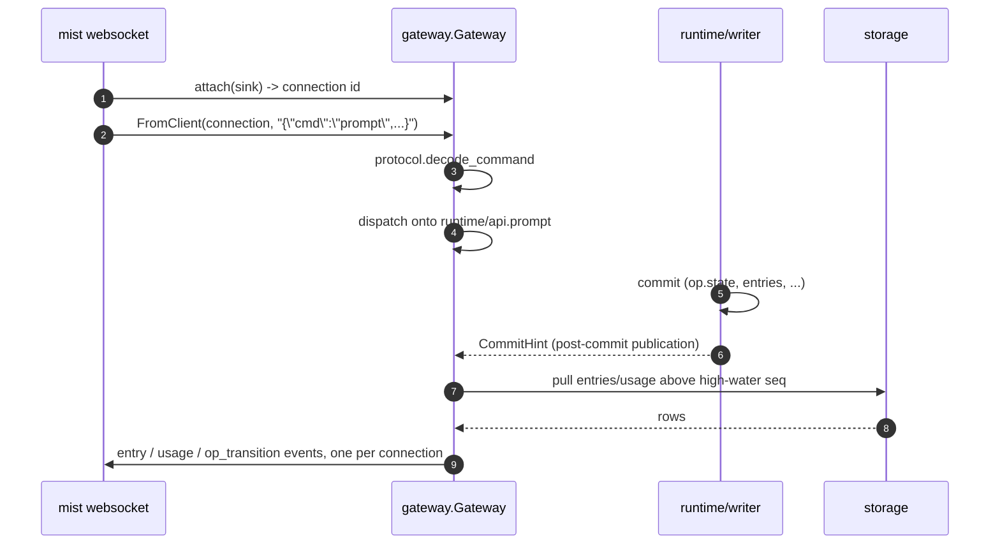
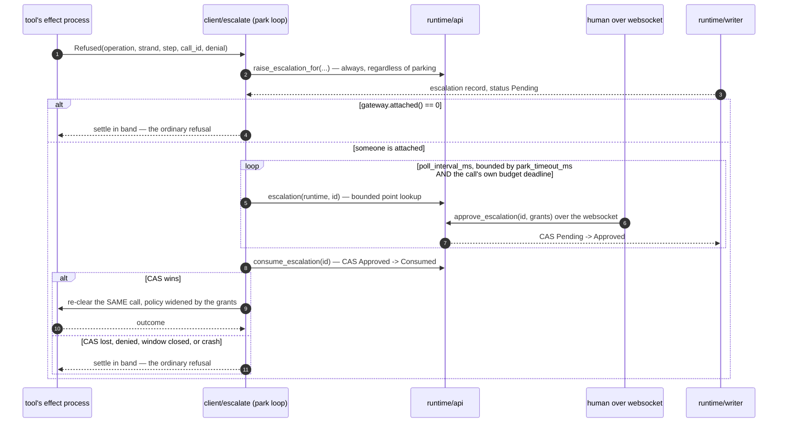
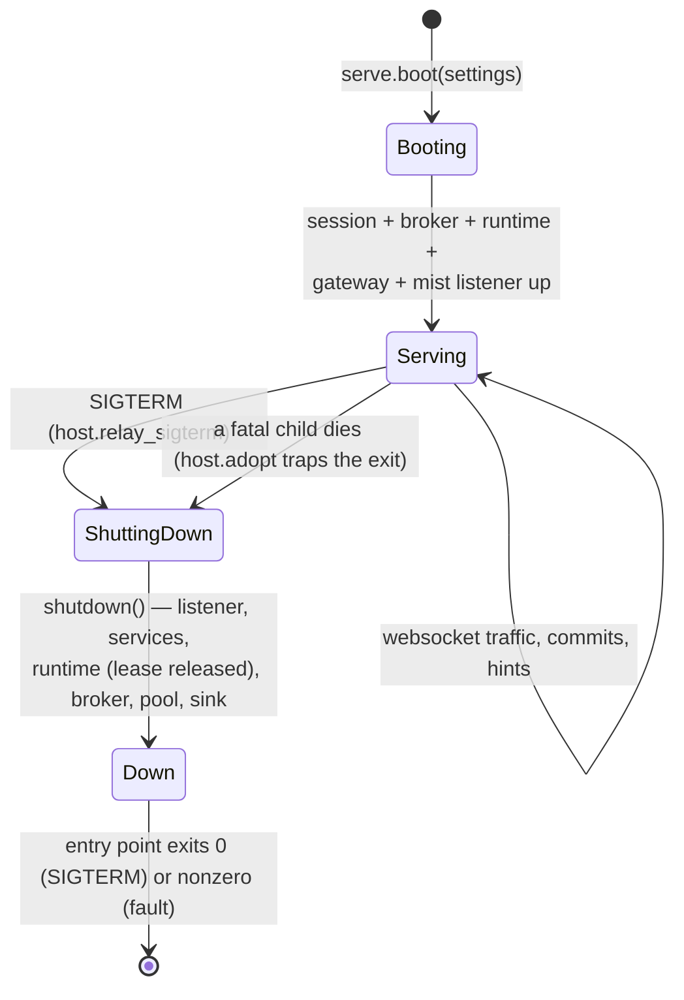

# client

`client` is the outward face of a live session: the ClientGateway hub
that speaks the Part 1.6 websocket protocol, the `mist` transport under
it, and — because this is the tree's host package — the production
wiring that turns `runtime/effects.Effects` into a real provider, a real
broker, and a real tool registry, plus the `loomd` entry point that
boots the whole stack over one session file. Everything a human or a
thin client (`packages/tui`) does to a session arrives here first.

## The gateway: one hub, any number of connections

`client/gateway.start` boots one hub actor per served session. A
connection is nothing more exotic than a `fn(String) -> Nil` sink handed
to `attach` — the hub does not know or care whether that sink writes to a
websocket, a test harness, or a pipe. Inbound frames arrive as text
through `handle_text`, get decoded by the pure, total `client/protocol`
codecs, and dispatch onto `runtime/api`. Outbound, the hub answers a
`CommitHint` or a `BusHint` by pulling everything above its own
high-water seq from storage and re-broadcasting it as typed events —
**live materialization is a pull, never an apply**, so a lost hint costs
latency, never a missing event.

## Escalation parking, end to end

This is the sequence worth the closest reading, because it is where the
"a human is deciding, in real time, whether your call is allowed to run"
promise actually holds together. A policy refusal from `broker.clear_call`
does not automatically fail a tool call — it is handed to
`client/escalate`, which raises a durable, call-scoped record
unconditionally and then decides separately whether to *park*: hold the
call's own effect process open, waiting, rather than settling it in band.
Parking happens only when `gateway.attached` says a client is there —
holding a call open in a headless session is a hang, not a courtesy.

`Approved` and `Consumed` are two different states and the difference is
the entire proof this mechanism works. The `approve` frame a keystroke
sends can only ever write `Approved` — that CAS is `runtime/api`'s
ordinary decision-recording path. The move to `Consumed` is a *separate*
compare-and-swap, performed by the park loop itself, on the refused
call's own effect process, at the exact moment it composes the granted
policy and re-clears. So an escalation record that reaches `Consumed`
is proof that a call which had already been refused woke back up and
spent an approval that arrived over a websocket — not merely that a
human clicked approve. `client/demo` asserts on `Consumed` while driving the
complete flow through the websocket protocol. The native terminal end-to-end
does not claim this leg yet: it proves terminal input, durable output, fork,
and clean detach against the real server, while approval remains visible but
non-interactive in `tui`.

An approval buys exactly one re-clearance of exactly one call — the
record's `CallScope` is checked against the call in hand before anything
is spent, so a scoped grant can never widen a sibling call that happened
to dedupe onto the same record.

## The server: boot, supervise, shut down together

`client/serve.boot` stands up a session, a helper pool, a broker, the
system prompt, a runtime, a service supervisor, and the websocket
listener, in that order, and prints exactly one startup line to stdout.
`client/host.adopt` runs the whole boot on a dedicated exit-trapping
process so every link an `actor.start` forms lands there instead of on
the caller; the first fatal child death runs the *entire* teardown —
listener, services, the runtime (releasing the writer's lease), broker,
pool, sink — before reporting anything, so a crash and a clean `SIGTERM`
converge on the same shutdown path rather than two.

The system prompt is assembled once, at a session's first open, and
pinned into the reserved `prompt/` fact cell — every later boot resends
the pinned bytes rather than re-deriving them, because a prompt
re-derived from moved inputs (an edited `CLAUDE.md`, a changed kernel, a
different flag) is a full cache-write on the first turn after every
restart. Nothing volatile — no clock, no token count, no git state, no
random value — is allowed into what gets rendered, for the same reason
the active-tool list is kept sorted: both sit inside the provider's
cached prefix.

## The two output channels

The entry point's stdout and its log stream carry deliberately different
things (spec §3.4). **stdout** is the ephemeral port, the token path, and
the prompt digest — one line, read by whatever launched the process with
`head -1`. Everything else about the running system — every commit, every
retry, every parked call — is a JSON log line on the other channel,
correlated to the session through `telemetry`'s injected logger. A
mistyped flag is neither: it belongs to the person who ran the binary,
before there is a session to correlate anything to, so it stays on
stderr with the usage text.

## The modules

| Module | What it holds |
|---|---|
| `client/protocol` | The `CommandEnvelope`/`EventEnvelope` codecs — pure, total, strict on envelope shape, tolerant on unknown names. |
| `client/gateway` | The hub actor: `attach`/`detach`/`handle_text`, `commit_forwarder`, `tap_provider`. |
| `client/server` | The `mist` websocket transport, `LocalAuth`/`BearerAuth`. |
| `client/escalate` | Parking: raise-always, park-if-attached, the two-deadline bound, spend-by-CAS. |
| `client/agency` | The messaging seam for other agents: descendant-only addressing, the lineage ledger, the reap hooks. |
| `client/codemode` | The seam that fills `tools/codemode` with the real vet → compile → launch → host pipeline. |
| `client/wiring` | The production `runtime/effects.Effects`: provider, broker, tool registry, compaction hooks. |
| `client/system_prompt` | Assembly, rendering, and the durable pin. |
| `client/catalog` | The `loom.toml` model catalogue parser and the provider-gateway builder. |
| `client/serve` | The `loomd` entry point: flags, boot, shutdown, the two output channels. |

Paths are relative to `packages/client/src/` — `client/escalate` is
`packages/client/src/client/escalate.gleam`.

## Reading further

- [`CLAUDE.md`](CLAUDE.md) — the reference doc for changing this code:
  key types, real dependency edges, actor and wire traffic, and the
  invariants that break things when violated. Read it before editing.
- [`docs/architecture/orchestration.md`](../../docs/architecture/orchestration.md)
  — the runtime surface the hub dispatches onto.
- [`packages/tui/CLAUDE.md`](../tui/CLAUDE.md) — the other end of the
  wire, and the golden fixtures both sides are pinned against.
- [`packages/runtime/CLAUDE.md`](../runtime/CLAUDE.md) — the escalation
  register, the lineage ledger, and the drive loop this package commits
  through.
- [`docs/spec-gaps.md`](../../docs/spec-gaps.md) — "From WP-L
  (`client`)": escalation attribution, the missing compaction/navigation
  api entry points, fixture-versus-codec drift.
