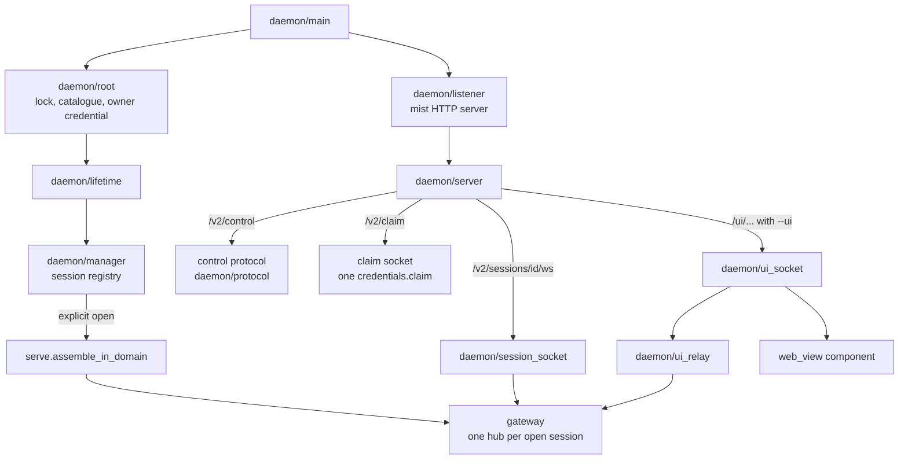
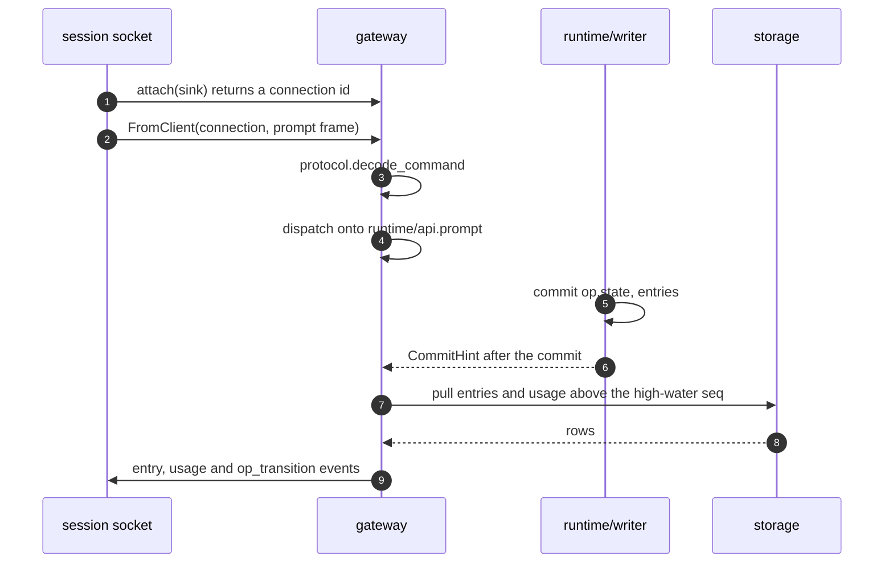
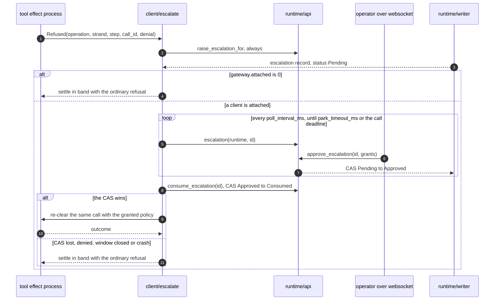

# client

`client` builds `loomd`, the daemon every Loom client talks to. One BEAM VM
holds the private state root, the session catalogue and the owner
credential, and serves them on one loopback listener. It opens no
conversation on its own: a session's stack (its database writer, runtime,
provider, broker and tool registry) is assembled only when an authorized
client opens that session, and a restarted daemon comes back with every
session closed. For each open session a ClientGateway hub speaks the
Part 1.6 websocket protocol to any number of attached connections, and with
`loomd --ui` the same listener serves a browser view of a session.

The package is separate because it is the tree's host package. It depends
on most of the tree (`runtime`, `broker`, `provider`, `tools`, `codemode`,
`mcp`, `storage` and more; `gleam.toml` has the list), so it is the one
place that turns `runtime/effects.Effects` into a real provider, a real broker and
a real tool registry, and the one place that performs the I/O the pure
packages refuse (`prompt`'s system prompt, for example, is assembled and
pinned here). The clients sit on the other side of a wire: `packages/tui`
and the web view's engine in `packages/session_view` share no code with
this package except the protocol they both speak.

## Processes and routes

`client/daemon/main` parses the flags, starts the root, starts the
listener, prints one readiness line and then waits for a signal or for the
root to exit. The root owns the daemon's private files and orders shutdown;
the manager is the session registry that admits opens against the capacity
limit and answers every authorization question. HTTP upgrades are routed by
`client/daemon/server`.


```mermaid
flowchart TD
    Main["daemon/main"] --> Root["daemon/root<br/>lock, catalogue, owner credential"]
    Main --> Listener["daemon/listener<br/>mist HTTP server"]
    Root --> Lifetime["daemon/lifetime"]
    Lifetime --> Manager["daemon/manager<br/>session registry"]
    Manager -->|"explicit open"| Serve["serve.assemble_in_domain"]
    Serve --> Gateway["gateway<br/>one hub per open session"]
    Listener --> Server["daemon/server"]
    Server -->|"/v2/control"| Control["control protocol<br/>daemon/protocol"]
    Server -->|"/v2/sessions/id/ws"| Socket["daemon/session_socket"]
    Server -->|"/v2/claim"| Claim["claim socket<br/>one credentials.claim"]
    Server -->|"/ui/... with --ui"| UiSocket["daemon/ui_socket"]
    Socket --> Gateway
    UiSocket --> Relay["daemon/ui_relay"]
    Relay --> Gateway
    UiSocket --> Component["web_view component"]
```

A terminal first authenticates on `/v2/control` (`protocol-change/015`),
where it lists, creates, opens, renames and removes sessions, then attaches
to one session's socket. The readiness line on stdout names the control
address and the owner token's path; everything else the daemon reports is a
JSON log line through `telemetry`'s injected logger.

## The gateway: one hub, any number of connections

`client/gateway.start` boots one hub actor per open session. A connection
is a `fn(String) -> Nil` sink handed to `attach`, so the hub does not know
whether the sink writes to a websocket, the web view's relay or a test.
Inbound frames arrive as text, are decoded by the pure, total
`client/protocol` codecs, and dispatch onto `runtime/api`. Outbound, the hub
answers a `CommitHint` or a `BusHint` by pulling everything above its own
high-water seq from storage and broadcasting it as typed events. Live
materialization is a pull, never an apply, so a lost hint costs latency and
never a missing event. The envelope `seq` is the storage seq of the write
that produced the event.


```mermaid
sequenceDiagram
    autonumber
    participant Sock as session socket
    participant G as gateway
    participant W as runtime/writer
    participant S as storage

    Sock->>G: attach(sink) returns a connection id
    Sock->>G: FromClient(connection, prompt frame)
    G->>G: protocol.decode_command
    G->>G: dispatch onto runtime/api.prompt
    W->>W: commit op.state, entries
    W-->>G: CommitHint after the commit
    G->>S: pull entries and usage above the high-water seq
    S-->>G: rows
    G->>Sock: entry, usage and op_transition events
```

## Escalation parking, end to end

A policy refusal from `broker.clear_call` does not automatically fail a tool
call. It is handed to `client/escalate`, which always raises a durable,
call-scoped escalation record and then decides separately whether to park:
hold the call's own effect process open and wait, rather than settling it
in band. It parks only when `gateway.attached` reports a client, because
holding a call open in a session nobody is watching would hang it.


```mermaid
sequenceDiagram
    autonumber
    participant Tool as tool effect process
    participant Esc as client/escalate
    participant Api as runtime/api
    participant Human as operator over websocket
    participant Wr as runtime/writer

    Tool->>Esc: Refused(operation, strand, step, call_id, denial)
    Esc->>Api: raise_escalation_for, always
    Wr-->>Esc: escalation record, status Pending
    alt gateway.attached is 0
        Esc-->>Tool: settle in band with the ordinary refusal
    else a client is attached
        loop every poll_interval_ms, until park_timeout_ms or the call deadline
            Esc->>Api: escalation(runtime, id)
            Human->>Api: approve_escalation(id, grants)
            Api-->>Wr: CAS Pending to Approved
        end
        Esc->>Api: consume_escalation(id), CAS Approved to Consumed
        alt the CAS wins
            Esc->>Tool: re-clear the same call with the granted policy
            Tool-->>Esc: outcome
        else CAS lost, denied, window closed or crash
            Esc-->>Tool: settle in band with the ordinary refusal
        end
    end
```

`Approved` and `Consumed` are separate states, and the difference is the
proof that the mechanism works. The `approve` frame an operator sends can
only write `Approved`, through `runtime/api`'s ordinary decision path. The
move to `Consumed` is a second compare-and-swap, made by the park loop on
the refused call's own effect process when it composes the granted policy
and re-clears. A record that reaches `Consumed` therefore shows that a
refused call resumed and spent the approval, not only that someone
approved. An approval buys one re-clearance of one call: the record's
`CallScope` is checked against the call in hand before anything is spent,
so a scoped grant cannot widen a sibling call that deduplicated onto the
same record. `protocol-change/041` adds the session-scoped approval that
the terminal's approval dialog sends.

## The system prompt pin

The system prompt is assembled once, at a session's first open, and pinned
into the reserved `prompt/` fact cell. Every later boot resends the pinned
bytes rather than re-deriving them, because a prompt re-derived from moved
inputs (an edited `CLAUDE.md`, a changed kernel, a different flag) costs a
full cache write on the first turn after every restart. For the same
reason nothing volatile (a clock, a token count, git state, a random value)
is rendered into it, and the active-tool list is kept sorted: both sit
inside the provider's cached prefix.

## The web view

With `--ui`, `daemon/main` starts `daemon/ui_sessions` and the server
serves the `/ui` routes (`protocol-change/051`, ADR-014). `loom ui`
asks the control endpoint for a single-use ticket; the browser exchanges
it for a cookie scoped to one page path. `daemon/ui_socket` runs the page's
websocket and starts a `web_view` Lustre server component, and
`daemon/ui_relay` stands in for a session socket: it attaches to the
session's gateway with the principal's membership capped by the page's
ceiling (observer by default, operator on request, never owner), so the
gateway enforces the page's role like any other attachment. Without
`--ui`, every `/ui` path is a 404 and the control `hello` has no `ui`
field.

## Governed runtime evolution

`client/evolution` owns the authoring-to-publication loop. A model proposes
immutable source and runs jailed author checks; a native operator inspects
the retained evidence and approves the exact candidate. The live owner then
stages a replacement, retires its predecessor's native helpers and commits
the selection. Rollback selects earlier approved source under a new
generation while preserving the session's conversation.

The model's tools never confer approval authority. `loomd evolution` and
the `loom evolution` forwarder attach to an already resident session and
use the authenticated connection's principal. A queued selection receipt
requires a status lookup before it can be treated as publication.

This host also selects named workspace programs and pins exact-model prose
profiles for new sessions. The catalogue, custody rules, module map and
operator workflow are in [the evolution architecture](../../docs/architecture/evolution.md).

## A tour of the modules

Paths are relative to `src/`; `client/escalate` is
`src/client/escalate.gleam`. In reading order:

- `client.gleam` is the package entry point `bin/loomd` runs. It splits
  `loomd ext`, `loomd access` and `loomd peer` from the daemon itself.
- `client/daemon/main` is the daemon's flags, startup, readiness line and
  signal wait. `daemon/root` owns the lock, catalogue connection and owner
  credential; `daemon/lifetime` and `daemon/manager` hold the session
  registry and its capacity and authorization checks; `daemon/listener`
  owns the mist server.
- `client/daemon/server` routes upgrades and serves `/v2/control`, whose
  bounded codec is `client/daemon/protocol`, and `/v2/claim`, where an
  invitee redeems a claim token for its own credential digest
  (protocol-change/053). `client/daemon/session_socket` connects an
  authenticated session socket to its gateway.
- `client/serve` assembles one session: `resolve_managed` turns a catalogue
  registration into settings and `assemble_in_domain` builds the session's
  stack. `boot` is the embedded, one-session host API that tests use.
- `client/wiring` is the production `runtime/effects.Effects`: provider,
  broker, tool registry and compaction hooks. `client/catalog` parses the
  `loom.toml` model catalogue and builds the provider gateway.
- `client/protocol` holds the `CommandEnvelope` and `EventEnvelope` codecs:
  total, strict on envelope shape, tolerant of unknown names.
- `client/gateway` is the hub actor: `attach`, `detach`, `handle_text`,
  `commit_forwarder` and `tap_provider`.
- `client/escalate` is parking: raise always, park only if attached, a
  two-deadline bound, and spend by compare-and-swap.
- `client/system_prompt` assembles, renders and pins the system prompt.
- `client/agency`, `client/codemode`, `client/history` and `client/memory`
  are the seams that give a model other agents, code mode, recall over the
  repository's history, and memory that outlives a session;
  `client/distill` is the pipeline that fills that memory.
- `client/extension/*` is `loom ext`: installing, recording and dispatching
  extensions.
- `client/evolution/*` retains candidates and evidence, admits native
  controls, owns live generations and runs independent model trials.
- `client/daemon/ui_sessions`, `ui_http`, `ui_socket` and `ui_relay` are
  the web view's tickets, request checks, page socket and gateway relay.

The package holds many more modules (advisor, goals, schedules, rules,
hooks, jobs, glances). [`CLAUDE.md`](CLAUDE.md) describes each of them.

## Testing

```sh
make check-client
```

runs the format check, a warning-free build and the tests under
`test/client/`; `make lint-client` runs the house-rule lint, which only
the bare `make check` includes. The suite boots real daemons
over temporary state roots: `daemon_*_test` covers the root, manager,
listener, control protocol and fault containment; `gateway_test`,
`escalate_test` and `protocol_test` cover the hub, parking and the codecs;
`ui_*_test`, `web_view_parity_test` and `web_operator_page_test` cover the
web view's routes, relay and parity with the terminal's projection.
Because `tui` is a dev dependency, the terminal's end-to-end tests against a
real daemon live here too (`tui_e2e_test`, `tui_v2_test`,
`tui_multiplayer_test`). `tui_approval_effect_test` drives an approval
against a real daemon, broker refusal and helper: two operator sockets send
the same captured approval, one is admitted, the other is refused as
`stale_approval`, and the record ends `Consumed` after exactly one native
execution.

The `daemon_shipped_*` and `tui_shipped_*` tests exercise a built
`bin/loomd` and skip unless `LOOM_BOOTSTRAP_E2E_SERVER` names one;
`scripts/e2e_client_bootstrap.sh` and the signoff set it.

## Reading further

- [`docs/architecture/evolution.md`](../../docs/architecture/evolution.md):
  governed authoring, approval, publication, evaluation and rollback.

- [`CLAUDE.md`](CLAUDE.md): key types, real dependency edges, actor and
  wire traffic, and the invariants that break things when violated. Read
  it before editing.
- [`protocol.md`](protocol.md): the normative wire bodies.
- [`docs/architecture/daemon.md`](../../docs/architecture/daemon.md): the
  daemon's process tree, admission and shutdown.
- [`docs/architecture/client.md`](../../docs/architecture/client.md): the
  endpoint record, the launcher, the v2 wire and the gateway.
- [`docs/architecture/orchestration.md`](../../docs/architecture/orchestration.md):
  the runtime surface the hub dispatches onto.
- [`protocol-change/015`](../../protocol-change/015-daemon-control-and-session-attachments.md)
  (daemon control and session attachments),
  [`041`](../../protocol-change/041-session-approval-dialog.md) (session
  approvals) and [`051`](../../protocol-change/051-web-view-route.md) (the
  web view route), with [ADR-014](../../docs/adr/014-second-runtime.md).
- [`packages/tui/README.md`](../tui/README.md): the native client on the
  other end of the wire.
