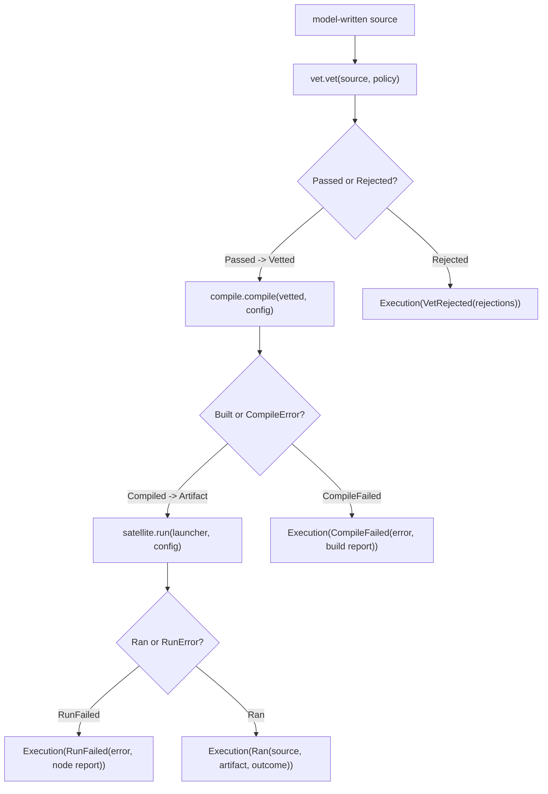
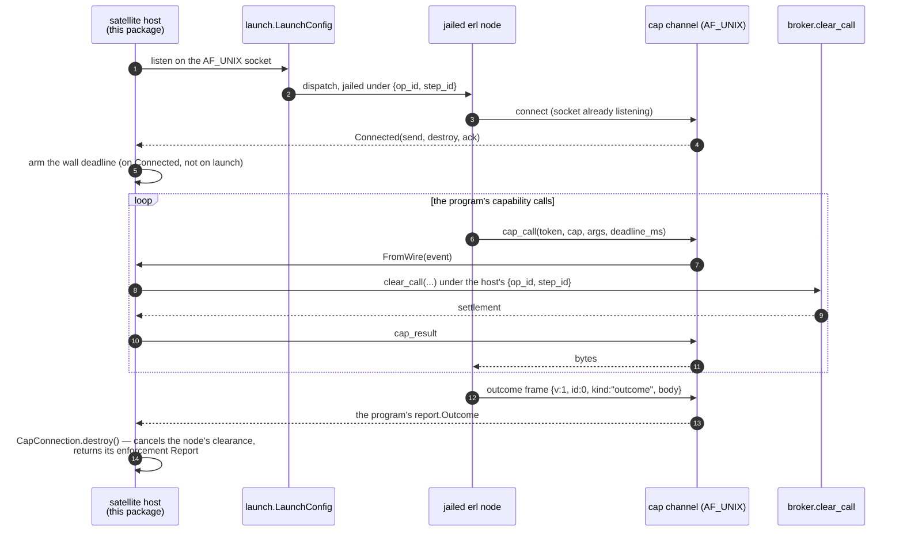

# codemode

Code mode is the alternative to a tool call: instead of asking the model
for one function invocation at a time, let it write a *program* — one
that fans out, races, retries, holds state — and run that program once,
in a disposable jailed BEAM node whose only reachable effect is a single
capability channel back to the broker. `codemode` is the whole harness
side of that pipeline: vet the source, compile it hermetically, launch
the node, host its capability calls. It never runs model-influenced code
itself — the jailed satellite does that, and this package only ever
watches the socket. `packages/cap` is what the satellite is compiled
against; this package never imports it (see below).

`codemode/codemode.execute` is the one entry point, and it threads a
source string through the three stages in order, short-circuiting at the
first refusal:

Every branch is a value, never a crash — `execute` is total, and a
rejected or failed program comes back as data the model can read and fix
in band.

## The capability theorem

Everything downstream rests on one claim, stated exactly as
`codemode/vet`'s module doc states it:

> A Gleam program's maximal capability set is the transitive closure of
> its imports plus its own `@external` declarations.

Pure Gleam has no reflection, no `eval`, no dynamic module lookup, no
macros — so a program's reachable effects are exactly what its imports
expose plus whatever `@external` it declares itself. `vet` enforces the
three rules that turn that principle into an actual bound: no
`@external` in submitted source (the one construct that reaches arbitrary
foreign code); every import confined to the pinned capability prelude
plus a pure-stdlib allowlist; no dependency of the program's own outside
that same allowlist. A pass yields an opaque `Vetted` — no public
constructor exists for it, so the *only* way to obtain one is to call
`vet`, and the compile service is written to take a `Vetted` rather than
a `String`. The type system then makes it structurally impossible to
compile source that was never linted.

Vetting is layer one of defense in depth, and it is written to assume it
is the *only* layer: a hostile `.beam` that slips past it sits inside the
satellite jail only because vetting was supposed to have caught it
first, not because the jail is expected to catch what vetting misses.

## The hermetic build

`codemode/compile.compile` runs `gleam build --warnings-as-errors` inside
a network-off jail, against a package cache cloned from a pre-resolved
seed (`codemode/seed`) rather than resolved live — a range cannot be
resolved with the network off, and the builder refuses a seed whose
dependency table is not byte-identical to the one it generated.
`--warnings-as-errors` is not cosmetic: it turns Gleam's transitive
dependency-import warning into a compile error, which is what closes
`gleam/erlang/*`, `gleam/otp/*`, and `core/*` by the compiler itself
rather than by the vetting allowlist alone. The build is pinned to
exactly `compile.default_dependencies()` and the program is written under
a `program_module` path the compile service chooses, never the source —
a Gleam module is named by its path, so shadowing the prelude from inside
submitted source is structurally impossible.

## Launch and the host

`codemode/satellite.run` is the in-harness half: it opens the AF_UNIX cap
socket *before* dispatching the jailed `erl`, so the satellite's connect
can never lose the race, then services `cap_call` frames by translating
each into a `broker.clear_call` under the host's own `{op_id, step_id}` —
the same pooled pair the build ran under, which is what makes
`broker.abort` on the operation reach the build and the running node
alike. `codemode/launch.start_janitor` spawns an unlinked process that
monitors the host and runs the identical teardown if the host dies any
other way, mirroring the broker's own fd-3 safety net.

## What the token confines, stated exactly

Because this is a security claim, it is worth stating the way
`CLAUDE.md` states it rather than the loose version: **the cap token
authenticates the channel; it does not confine an escaped `.beam`.** The
token file is readable inside the jail by necessity — the boot runtime
has to read it to speak on the socket at all — so a hand-written `.beam`
that found the file can present the genuine token, and the check then
passes, correctly. What actually confines that adversary is the kernel
jail (the socket is the only thing the node can reach at all) plus the
broker's own per-call policy check on every `cap_call`, whatever token it
carried. Nothing about holding a valid token gets a call more than the
policy already allows.

Both halves of that sentence are observed by tests today, not just
argued in a docstring. `satellite_test.gleam` denies an unauthenticated
`cap_call` and separately refuses a genuine token presented against a
policy-forbidden call. The sandbox self-test's `unvetted beam denied host
write, secret, and network` probe loads a hand-written, never-vetted,
never-compiled-by-this-package Erlang module straight into a node inside
the jail and calls `file:write_file/2`, `file:read_file/1`, and
`gen_tcp:connect/4` directly — confined, it gets `erofs`, `enoent`, and
`eperm`. What that probe does *not* claim is "reaches nothing on the
filesystem": the jail's base view ro-binds the whole host filesystem, so
an unprotected host path stays readable from inside it.

## Every outcome carries both stages' enforcement reports

`codemode.Execution` cannot exist without an `Enforcement` `Report` for
each jailed stage it ran — the build's from `compile.Compiled`, the
node's from `satellite.Run` (which is what `CapConnection.destroy`
returns). `Reported(entries, degraded)` is `exec_exit`'s ground truth
with the broker's own degraded rule applied — any `skip:` entry counts,
not only the bwrap bool — and `Unreported(reason)` is never itself a
claim of confinement; a stage that genuinely produced no report says why,
which is a different value from one whose report was simply lost.

## The modules

| Module | What it holds |
|---|---|
| `codemode/vet` | The import/`@external` lint; `Vetted`, `Rejection`. |
| `codemode/vet/policy` | The pinned allowlist. |
| `codemode/compile` | The hermetic build service; `Artifact`, `CompileError`. |
| `codemode/seed` | The pre-resolved offline package cache: `prepare`, `verify`. |
| `codemode/build` | The production `Builder` — `gleam build --warnings-as-errors` in a network-off jail. |
| `codemode/launch` | The production `Launcher`: the AF_UNIX socket, the jailed `erl`, the janitor. |
| `codemode/satellite` | The in-harness host: the cap channel, the deadline, teardown. |
| `codemode/enforcement` | `Report`, `Enforcement`, `layers` — applied versus skipped, never conflated. |
| `codemode/codemode` | `execute`: the orchestrator that ties the three stages together. |

Paths are relative to `packages/codemode/src/` — `codemode/satellite` is
`packages/codemode/src/codemode/satellite.gleam`.

## Reading further

- [`CLAUDE.md`](CLAUDE.md) — the reference doc for changing this code:
  key types, real dependency edges, actor and wire traffic, and the
  invariants that break things when violated. Read it before editing.
- [`docs/architecture/code-mode.md`](../../docs/architecture/code-mode.md)
  — the three layers, the pipeline, and what each one actually confines.
- [`packages/cap/CLAUDE.md`](../cap/CLAUDE.md) — the prelude a submitted
  program is compiled against, and the boot runtime on the untrusted
  side of this channel.
- [`packages/broker/CLAUDE.md`](../broker/CLAUDE.md) — the `clear_call`
  door every `cap_call` and both jailed stages go through.
- [`docs/review/m4-triage.md`](../../docs/review/m4-triage.md) — the
  review wave this package's current shape answers.
- `make codemode-seed` prepares the offline package cache; `make
  e2e-codemode` runs the jailed acceptance against it.
