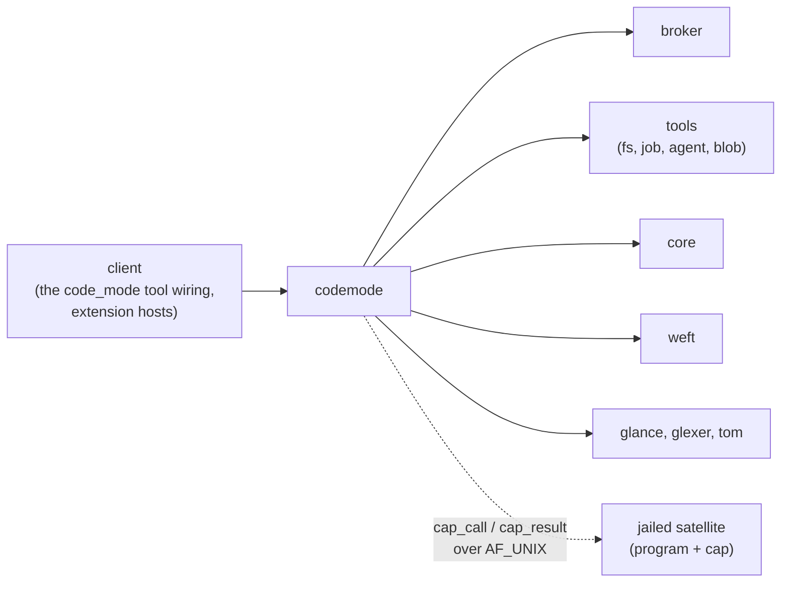
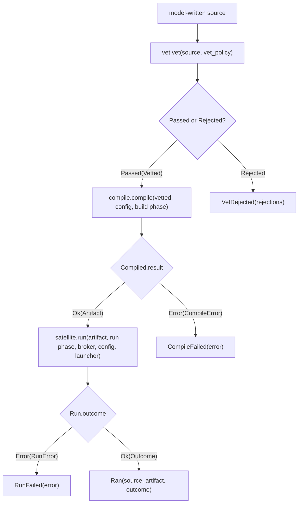
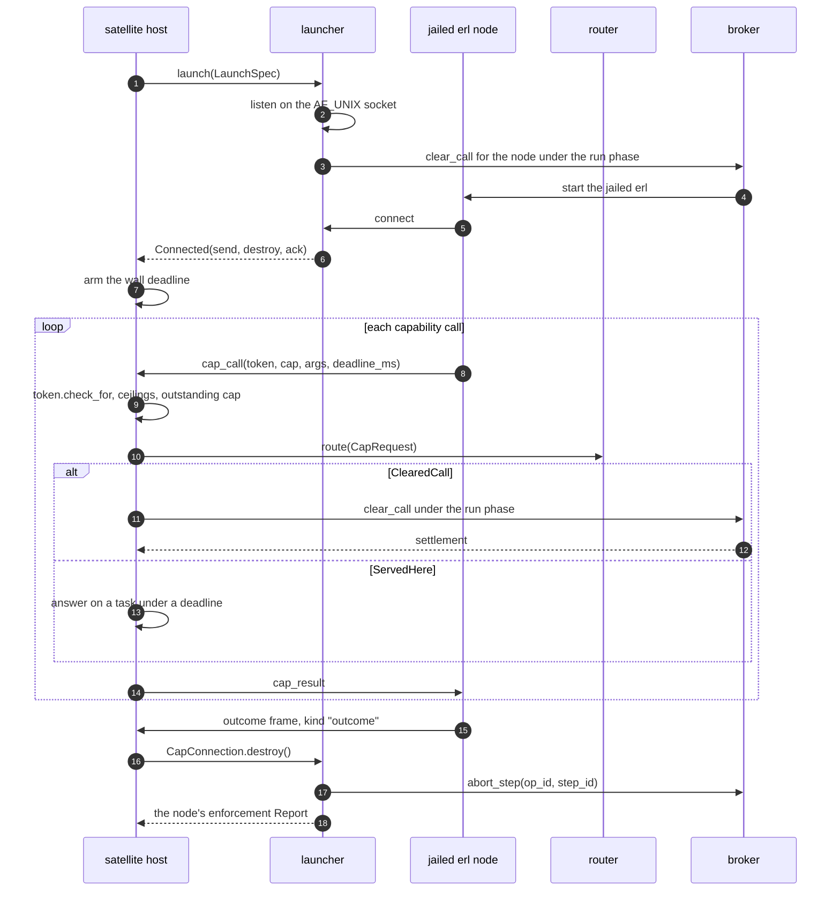

# codemode

Code mode is the alternative to a tool call: instead of asking the model
for one function invocation at a time, let it write a *program* (one that
fans out, races, retries, holds state) and run that program once, in a
disposable jailed BEAM node whose only reachable effect is a single
capability channel back to the harness. `codemode` is the whole harness
side of that pipeline: vet the source, compile it hermetically, launch the
node, and host its capability calls.

It is a separate package because it owns the boundary between
model-written code and the harness. It never runs model-influenced code
itself (Rule Zero); the jailed satellite does that, and this package only
reads the socket. `packages/cap` is what the satellite is compiled
against, and this package never imports it (see "Where it sits").

## Where it sits

```mermaid
flowchart LR
    client["client<br/>(the code_mode tool wiring,<br/>extension hosts)"]
    codemode["codemode"]
    broker["broker"]
    tools["tools<br/>(fs, job, agent, blob)"]
    core["core"]
    weft["weft"]
    parse["glance, glexer, tom"]
    satellite["jailed satellite<br/>(program + cap)"]

    client --> codemode
    codemode --> broker
    codemode --> tools
    codemode --> core
    codemode --> weft
    codemode --> parse
    codemode -. "cap_call / cap_result<br/>over AF_UNIX" .-> satellite
```

Solid edges are `gleam.toml` dependencies (`simplifile`, `filepath`,
`gleam_erlang` and `gleam_otp` are omitted). `client` is the only
package that depends on `codemode`. The dotted edge is the wire to
`packages/cap`; the shared names (`LOOM_CAP_SOCK`, `LOOM_CAP_TOKEN_FILE`,
the `outcome` frame kind) are restated here and pinned by tests rather
than imported, because linking `cap` into the harness would put
model-facing code in the harness VM.

## The pipeline

`codemode/codemode.execute` is the one entry point. It threads a source
string through the three stages in order and stops at the first refusal:

```mermaid
flowchart TD
    SRC["model-written source"]
    VET["vet.vet(source, vet_policy)"]
    VETR{"Passed or Rejected?"}
    COMP["compile.compile(vetted, config, build phase)"]
    COMPR{"Compiled.result"}
    LAUNCH["satellite.run(artifact, run phase, broker, config, launcher)"]
    LAUNCHR{"Run.outcome"}

    SRC --> VET --> VETR
    VETR -->|Rejected| OUT1["VetRejected(rejections)"]
    VETR -->|"Passed(Vetted)"| COMP --> COMPR
    COMPR -->|"Error(CompileError)"| OUT2["CompileFailed(error)"]
    COMPR -->|"Ok(Artifact)"| LAUNCH --> LAUNCHR
    LAUNCHR -->|"Error(RunError)"| OUT3["RunFailed(error)"]
    LAUNCHR -->|"Ok(Outcome)"| OUT4["Ran(source, artifact, outcome)"]
```

Every branch is a value, never a crash. Each `ExecOutcome` arrives inside
an `Execution` that also carries both jailed stages' enforcement reports
and the `Widening` an approval did or did not buy, so a rejected or
failed program comes back as data the model can read and fix.

## The capability theorem

Everything downstream rests on one claim, stated as `codemode/vet`'s
module doc states it:

> A Gleam program's maximal capability set is the transitive closure of
> its imports plus its own `@external` declarations.

Pure Gleam has no reflection, no `eval`, no dynamic module lookup and no
macros, so a program's reachable effects are exactly what its imports
expose plus whatever `@external` it declares. `vet` enforces three rules
that turn that principle into a bound: no `@external` in submitted
source; every import confined to the seam's capability modules plus a
pure-stdlib allowlist; and no dependency outside that same allowlist. A
pass yields an opaque `Vetted`, which has no public constructor, and the
compile service takes a `Vetted` rather than a `String`, so source that
was never linted cannot be compiled.

Which modules a program may import depends on the seam it is vetted
against (`vet/policy.Seam`). The default server admits the effect modules
(`cap/fs`, `cap/proc`, `cap/search`, `cap/job` and the rest) and the
child-operation modules (`cap/strand`, `cap/workflow`) together. The
extension seam is the effect set plus the `ext` modules, and the resident
seam, which nothing selects yet, admits no capability at all.
`harness_only_cap_modules` names the `cap` modules no seam admits on
purpose.

Vetting is layer one of defense in depth, and it is written to assume it
is the only layer. The jail around the satellite is the second.

## The hermetic build

`codemode/compile.compile` runs `gleam build --warnings-as-errors` inside
a network-off jail, against a package cache cloned from a pre-resolved
seed (`codemode/seed`) rather than resolved live. A version range cannot
be resolved with the network off, and the builder refuses a seed whose
dependency table is not byte-identical to the one it generated.
`--warnings-as-errors` turns Gleam's transitive-dependency import warning
into a compile error, which closes `gleam/erlang/*`, `gleam/otp/*` and
`core/*` in the compiler as well as in the vetting allowlist. The build
is pinned to exactly `compile.default_dependencies()`, and the program is
written under a `program_module` path the compile service chooses. A
Gleam module is named by its path, so submitted source cannot shadow the
prelude.

## Launch and the host

`codemode/satellite.run` is the in-harness half. The launcher opens the
AF_UNIX cap socket before it dispatches the jailed `erl`, so the node's
connect cannot lose the race. The host then checks the channel token on
every `cap_call`, asks its router for a plan, and either clears the call
into a jail through the broker (`ClearedCall`, used for `proc.run`) or
answers it in the harness (`ServedHere`, used for `fs.*`, `kv.*`,
`search.*`, `strand.*`, `job.*`, `schedule.*`, `notes.*`,
`report.emit`, and the MCP, peer and background-execution calls whose
routers `client` adds). The jailed node and every cleared call run under the run
phase's own `{op_id, step_id}`, so they share one pooled budget and one
`broker.abort_step` reaches them all. `launch.start_janitor` spawns an
unlinked process that monitors the host and runs the same teardown if the
host dies any other way.

```mermaid
sequenceDiagram
    autonumber
    participant Host as satellite host
    participant L as launcher
    participant Node as jailed erl node
    participant R as router
    participant B as broker

    Host->>L: launch(LaunchSpec)
    L->>L: listen on the AF_UNIX socket
    L->>B: clear_call for the node under the run phase
    B->>Node: start the jailed erl
    Node->>L: connect
    L-->>Host: Connected(send, destroy, ack)
    Host->>Host: arm the wall deadline
    loop each capability call
        Node->>Host: cap_call(token, cap, args, deadline_ms)
        Host->>Host: token.check_for, ceilings, outstanding cap
        Host->>R: route(CapRequest)
        alt ClearedCall
            Host->>B: clear_call under the run phase
            B-->>Host: settlement
        else ServedHere
            Host->>Host: answer on a task under a deadline
        end
        Host->>Node: cap_result
    end
    Node->>Host: outcome frame, kind "outcome"
    Host->>L: CapConnection.destroy()
    L->>B: abort_step(op_id, step_id)
    L-->>Host: the node's enforcement Report
```

The host reports the outcome only after `destroy` returns, so the node's
enforcement report travels with it. A persistent variant of the same host
(`satellite.Host`, with `start`, `invoke` and `stop`) keeps one node open
for a session and sends it `hook_call`s; installed extensions run on it
(protocol-change/012).

## What the token confines

**The cap token authenticates the channel; it does not confine an escaped
`.beam`.** The token file is readable inside the jail because the boot
runtime has to read it, so a hand-written `.beam` can present the genuine
token and the check passes, correctly. What confines that adversary is
the kernel jail (the socket is the only thing the node can reach) plus the
per-call check: the broker's composed policy for a cleared call, and the
router's own boundary for a served one (`tools/fs`'s path checks, the
Agency's lineage rules). Holding a valid token gets a call nothing the
policy does not already allow.

Both halves are observed by tests. `satellite_test.gleam` denies an
unauthenticated `cap_call` and refuses a genuine token presented against a
policy-forbidden call. The sandbox self-test's hostile-`.beam` probe loads
a hand-written, never-vetted Erlang module into a jailed node and checks
that it cannot write outside the writable roots, read a protected path or
reach the network, after first confirming that the same module does all
three unjailed. That probe does not claim the node reaches nothing on the
filesystem; `packages/sandbox/README.md` states what the base view
exposes.

## Every outcome carries both stages' enforcement reports

`codemode.Execution` cannot exist without an `Enforcement` holding a
`Report` for each jailed stage: the build's from `compile.Compiled`, and
the node's from `satellite.Run`, which is what `CapConnection.destroy`
returns. `Reported(entries, degraded)` is `exec_exit`'s ground truth with
the broker's degraded rule applied (any `skip:` entry counts, not only the
bwrap bool). `Unreported(reason)` is never a claim of confinement; a stage
that produced no report says why.

## Governed candidates use the same boundary

`codemode/vet/package.vet_candidate` admits retained source and author tests
under the selected seam. It rejects unchecked files and module collisions
before compilation. The host invokes the retained author-test entry to collect
evidence, then uses the declared implementation entry when serving calls.
Passing an authored check does not grant selection authority.

The evolution host reconstructs a named program from immutable source and
fresh JSON input on each invocation, then uses this package's ordinary vet,
compile and satellite pipeline. Persistent tool and hook generations use
the existing extension seam. `client` owns approval, private build paths and
native retirement. See [the evolution architecture](../../docs/architecture/evolution.md)
for that ownership and the complete acceptance path.

## A tour of the modules

Paths are relative to `packages/codemode/src/codemode/`. Read them in
this order.

- `codemode.gleam`: `execute`, `ExecConfig`, `Execution` and
  `ExecOutcome`. `ExecConfig.identity` is the one place an operation, a
  step, a budget or an approval's grants can be written.
- `identity.gleam`: the opaque `ExecIdentity` and the `PhaseIdentity`
  values derived from it. `build_phase` drops approval grants and
  `run_phase` carries them; `ledger_keys` says whether the build shares
  the run's pooled ledger (`BuildLedger`) before anything runs.
- `vet.gleam`: the import and `@external` lint over a `glance` parse;
  `Vetted`, `Rejection`.
- `vet/policy.gleam`: the allowlists per `Seam`, and
  `harness_only_cap_modules`.
- `vet/package.gleam`: vetting a whole extension package: which files are
  installed, what its `gleam.toml` may depend on, and intra-package
  imports.
- `seed.gleam`: the pre-resolved package cache: `prepare` and `verify`.
- `compile.gleam`: the hermetic compile service: `Artifact`,
  `CompileError`, `Compiled`, and the `Builder` seam.
- `build.gleam`: the production `Builder`, which runs the build in a
  network-off jail through the broker.
- `launch.gleam`: the production `Launcher`: the AF_UNIX socket, the
  jailed `erl`, the reachability checks, and the janitor.
- `satellite.gleam`: the host. `run` for a single execution, `Host` for a
  persistent one; `CapRouter`, `CapPlan` (`ClearedCall` or `ServedHere`),
  `CapCeiling`, and `default_router`, which maps `proc.run` alone.
- `workspace.gleam`: the harness-side router for `fs.*`, `kv.*`,
  `schedule.*` and `job.*`, over injected closures built from `tools/fs`
  and the host's doors.
- `search.gleam`: the router for the read-only `search.*` calls.
- `orchestration.gleam`: the router for `strand.*`, over the `Agency`
  closures the `agent_*` tools call, with the spawn and admission
  ceilings.
- `notes.gleam`: the router for `notes.*` (protocol-change/045).
- `artifact.gleam`: `report.emit`, shared by both default modes: a byte
  bound, a lifetime ceiling and a content address.
- `enforcement.gleam`: `Report`, `Enforcement`, `Widening` and `layers`:
  applied versus skipped, never conflated.
- `internal/ffi_unix.gleam`: `gen_tcp` over AF_UNIX for the cap socket,
  backed by `codemode_ffi.erl`.

## How it is tested

`make check-codemode` runs the package gate: format check, a
warning-free build, and the tests. `make test-codemode` runs only the
tests.

Most suites are deterministic and in-process. `codemode_test` is the
adversarial vetting corpus. `satellite_test` and `host_test` run a real
broker over `ChannelTransport` fake helpers
(`test/support/fake_helper.gleam`) with a fake satellite peer on the
socket. `workspace_test`, `search_test`, `orchestration_test` and
`router_test` cover each router's frames, closures and refusals;
`identity_test` and `widening_test` pin the ledger count and what an
approval widens; `compile_test`, `build_test`, `seed_test`,
`launch_test`, `generated_test` and `vet_package_test` cover the build
and launch halves that need no kernel.

`e2e_test`, `migration_sample_test` and `orchestration_sample_test` run a
real hermetic build and a real jailed satellite. They skip, printing the
reason, when the helper `make sandbox` builds, the Gleam and Erlang
toolchain, or the prepared build seed is missing, so `make check-codemode`
stays fast. Run
`make codemode-seed` first, then `make e2e-codemode`, which builds the
helper and the seed and runs this suite with them in place.

## Reading further

- [`CLAUDE.md`](CLAUDE.md): the reference for changing this code: key
  types, traffic, and invariants. Read it before editing.
- [`docs/architecture/code-mode.md`](../../docs/architecture/code-mode.md):
  the layers, the pipeline, and what each one confines.
- [`packages/cap/README.md`](../cap/README.md): the prelude a submitted
  program is compiled against, and the boot runtime on the other end of
  the channel.
- [`packages/broker/README.md`](../broker/README.md): the `clear_call`
  door the build, the node and every cleared call go through.
- [`packages/sandbox/README.md`](../sandbox/README.md): the jail both
  stages run in.
- [ADR-005](../../docs/adr/005-budget-pooling-granularity.md) (budget
  pooling and its addenda) and
  [ADR-007](../../docs/adr/007-extension-tiers-and-brokered-egress.md)
  (extension tiers).
- Protocol changes: [004](../../protocol-change/004-sandbox-policy-explicit-mounts.md)
  (mounts), [012](../../protocol-change/012-hook-call.md) (`hook_call`),
  [020](../../protocol-change/020-minimal-jail-root.md) (minimal jail
  root), [031](../../protocol-change/031-tool-output-stream.md) (build
  output streaming), [045](../../protocol-change/045-code-mode-notes.md)
  (notes), [046](../../protocol-change/046-code-mode-utilities.md)
  (utilities), and
  [048](../../protocol-change/048-async-collaboration.md) (background
  collaboration).
- [`docs/review/m4-triage.md`](../../docs/review/m4-triage.md): the review
  wave this package's current shape answers.
