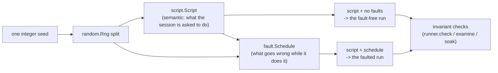
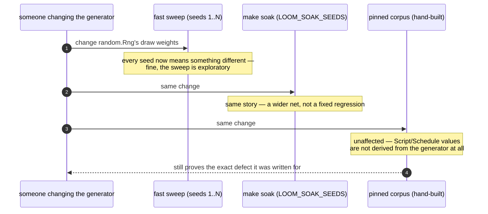

# conformance

`conformance` is the one package allowed to depend on every layer of the
tree, and it exists to hold two different kinds of oracle: the storage
conformance suite that *defines* what "correct backend" means for
`storage/memory` and `storage/sqlite` alike, and the deterministic
simulation runner that turns one integer into a whole crash-tested
session and checks the result against a fixed set of named invariants.
It also carries the wiring and jailed end-to-end suites that prove the
production effect seam (`client/wiring`) actually behaves the way
`runtime/effects.Effects` promises.

## The storage suite: one definition, two backends

`conformance/storage_suite.run` takes a `Backend` constructor and drives
it through everything the frozen contract requires: atomicity, seq
ordering and legal gaps, the full expectation (CAS) matrix, branch scans
across every combination of stop/filter/cursor/limit, catch-up reads,
close idempotence, and statistics equal to the ledger sum after *every*
commit — plus three checks that are SQLite-only because they are about
the file rather than the model: the writer-lease duel, the query-plan
assertions, and the branch-index metadata invariants. A backend passes
WP-B's exit criteria exactly when this suite is green against it, and
nowhere else — "correct" is not defined in prose anywhere in this tree.

## The simulation runner: seed in, verdict out

A run of `conformance/simulation/runner` is four steps, and the split
between the first two is the whole idea:

Every fault in the taxonomy — killing the tree at a commit boundary,
killing it mid-effect, restarting a single strand driver mid-effect
(`RestartStrand`), refusing a commit as stale, faulting a read, stealing
the lease, dropping a doorbell, starving an effect — is *transparent by
definition*: it must never change what the session ends up having done.
Anything that legitimately changes the outcome (a provider that refuses,
a user who aborts) lives in the **script**, so it happens in the
fault-free run too and cannot be mistaken for damage. "The same script
converges to the same place under every schedule" is the property both
runs are held to.

## What a seed actually pins, and what it does not

The runner is deterministic about *decisions* — which commit is killed,
which effects fail, in what order, what each turn settles with — and
reproduces every one of them exactly from a seed: `random.Rng` is a
splittable SplitMix64 and nothing else supplies choice. That is enough to
make "the same seed produces the same script and the same schedule" true
on every run, which is what makes a failing seed a bug report rather than
a shrug — `seed 317` prints, and re-running it reproduces the case.

It is worth stating precisely rather than loosely, because the honest
claim is narrower than "reproduces an exact interleaving": the runner
drives the *real* supervision tree, the real writer, and the real strand
driver as real BEAM processes, not a simulated scheduler, so it does not
control how those independent processes get interleaved by the VM. Two
runs of one seed can therefore schedule differently underneath — that is
exactly the property "convergence holds regardless" is checking — but it
also means a failure that depends on one rare interleaving may not
reproduce on demand. A simulator that pinned interleaving too would need
the whole runtime running on an injected scheduler, which this is not.

That gap is why the suite keeps a second, separate memory: the **pinned
corpus** (`conformance/test/conformance/simulation_test.gleam`) is a set
of hand-built `Script`/`Schedule` pairs, each one kept because it found a
real defect, and each one deliberately *not* stored as a seed. A seed's
meaning changes the moment the generator that turns it into a script and
a schedule changes — add a new fault kind, reweight a choice, and the
same integer produces a different session. A regression case would
silently stop testing the bug it was named for. Written out as an
explicit script and schedule, a corpus case means the same thing forever,
independent of the generator that (might have) once produced something
like it.

## What is checked, and how

Checks run at two different times on purpose. Boundary checks
(`invariant`) run *inside* the commit path, so a violation is caught at
the exact transaction that caused it rather than discovered later by
inspection. Terminal checks run once a strand goes idle. Nothing is keyed
by a counter that a crash could desynchronize: a generation request is
answered by the *phase* of its projected context (how many assistant
messages, plus a hundred once a compaction summary is present), and a
tool execution by its scripted call id — both stable across a synthetic
recovery settlement, which is exactly what makes them safe keys.

## Deep Docs

- [`CLAUDE.md`](CLAUDE.md) — the reference doc for changing this code:
  key types, real dependency edges, actor and wire traffic, and the
  invariants that break things when violated. Read it before editing.
- [`docs/architecture/simulation.md`](../../docs/architecture/simulation.md)
  — seed/script/schedule/verdict in full, keying, simulated time, the
  fault taxonomy, and what interleaving control does not cover.
- [`docs/architecture/durability.md`](../../docs/architecture/durability.md)
  — "The conformance suite is the definition of correct."
- `make conformance` runs the shared suites; `make e2e` the jailed
  acceptance; `make soak` the long simulation run.
