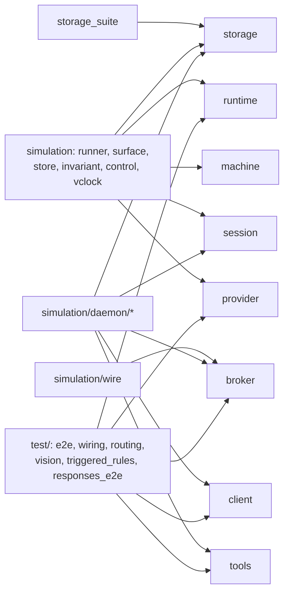
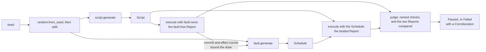
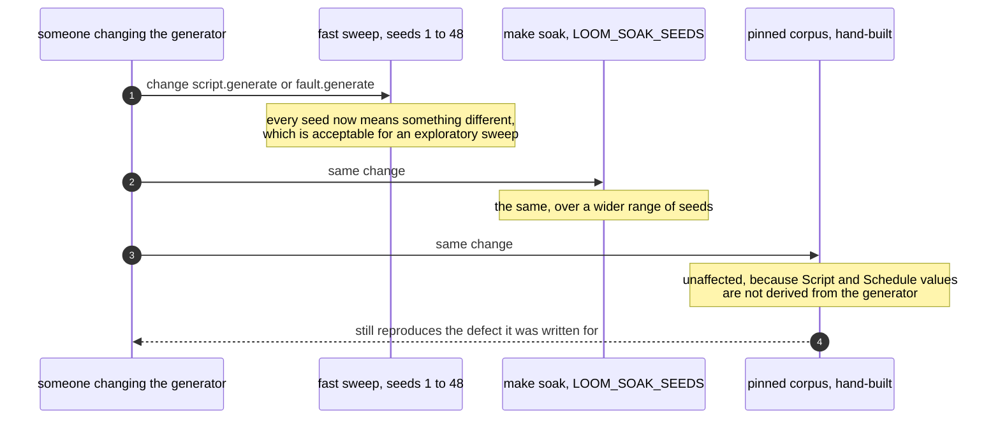

# conformance

`conformance` holds Loom's cross-layer oracles: the checks that define
correct behaviour for code that lives in other packages. It is the one
package that depends on most of the tree at once (`core`, `storage`,
`session`, `machine`, `runtime`, `provider`, `broker`, `tools` and
`client`), and nothing depends on it, so a check here can drive the real
production pieces together without any library package importing test
machinery. It holds three kinds of oracle. The storage conformance suite
*defines* what a correct backend is, for `storage/memory` and
`storage/sqlite` alike. The deterministic simulations turn one integer seed
into a crash-tested session, or a crash-tested daemon, and hold the result
to a fixed set of named checks. The end-to-end suites prove that the
production effect seam (`client/wiring`) behaves the way
`runtime/effects.Effects` promises, including a jailed run through the real
Go `loom-exec` helper.

```mermaid
flowchart LR
    Suite["storage_suite"] --> storage
    Sim["simulation: runner, surface,<br/>store, invariant, control, vclock"] --> runtime & machine & session & storage & provider
    Wire["simulation/wire"] --> broker
    Daemon["simulation/daemon/*"] --> client & storage & broker & session & tools
    Tests["test/: e2e, wiring, routing,<br/>vision, triggered_rules, responses_e2e"] --> client & runtime & provider & broker & tools
```

The diagram leaves out `core`, which almost every module imports, and
`weft`, which supplies the simulation's bounded runs (`control.attempt`)
and its polls (`runner.await_writer`, the daemon harness).

## The storage suite: one definition, two backends

`conformance/storage_suite.run` takes a `Backend` (a name and a constructor
that opens a fresh session) and drives it through the frozen Part 1.2
contract: all-or-none atomicity, strictly increasing seqs with legal gaps,
write order within a transaction, the shared entry and usage id namespace,
register semantics, the CAS expectation matrix, placement reads, branch
scans across stops, filters, cursors and limits, the branch-index
invariants, session-wide entry and usage scans including the catch-up
window, and close semantics. Every commit the suite makes also checks that
the maintained statistics equal the suite's own ledger sum.

`test/conformance/storage_suite_test.gleam` runs `run` against both
backends, then adds the checks that are about the SQLite file rather than
the model: the writer-lease duel, the `EXPLAIN QUERY PLAN` assertions, the
branch-index metadata invariants, and a 10,000-entry perf smoke that
asserts a `scan_branch` p50 ceiling. A backend passes WP-B's exit criteria
exactly when this suite is green against it; "correct" is not defined in
prose anywhere else in the tree.

## The session simulation: seed in, verdict out

`conformance/simulation/runner` turns a seed into two runs of one script
and compares them:

```mermaid
flowchart LR
    Seed["seed"] --> Rng["random.from_seed, then split"]
    Rng --> ScriptGen["script.generate"]
    Rng --> FaultGen["fault.generate"]
    ScriptGen --> Script["Script"]
    Script --> Free["execute with fault.none:<br/>the fault-free Report"]
    Free -->|"commit and effect counts<br/>bound the draw"| FaultGen
    FaultGen --> Sched["Schedule"]
    Script --> Faulted["execute with the Schedule:<br/>the faulted Report"]
    Sched --> Faulted
    Free --> Judge["judge: named checks,<br/>and the two Reports compared"]
    Faulted --> Judge
    Judge --> Verdict["Passed, or Failed<br/>with a Corroboration"]
```

The script is the semantic half: what the session is asked to do. The
schedule is what goes wrong while it does it. Every fault in
`simulation/fault` is transparent by definition, meaning it must not change
what the session ends up having done: `CrashAtCommit`, `CrashDuringEffect`,
`RestartStrand` (only the strand driver dies, mid-effect),
`RefuseCommitStale`, `ReadFault`, `StealLease`, `DropDoorbell`,
`DelayDoorbell`, `SlowEffect`, `ProviderEffectDies` and
`ProviderEffectTimesOut`. Anything that legitimately changes the outcome,
such as a provider that refuses or a user who aborts, lives in the script,
so it happens in the fault-free run too and cannot be mistaken for damage.
The property both runs are held to is that the same script converges to
the same outcomes, projection and ledger under every schedule.

The schedule is drawn after the fault-free run because commit-indexed
faults name a commit ordinal, and the fault-free run's commit count keeps
every drawn ordinal inside the run. Faults are addressed by commit or
dispatch ordinal, never by wall-clock instant, so a schedule means the same
thing on a loaded machine as on an idle one.

## What a seed pins, and what it does not

The runner is deterministic about decisions: which commit is killed, which
effects fail and in what order, and what each turn settles with.
`random.Rng` is a splittable SplitMix64 and is the only source of choice,
so one seed always produces the same script and the same schedule. A
failing seed's report ends with `make replay-simulation SIM_SEED=<seed>`,
which re-runs that case alone.

A seed does not pin an interleaving. The runner drives the real supervision
tree, the real writer and the real strand driver as BEAM processes, not a
simulated scheduler, so two runs of one seed can be scheduled differently
by the VM. Convergence is supposed to hold under any interleaving, which is
what the check measures, but a failure that depends on one rare
interleaving may not reproduce on demand. For that reason a failed verdict
carries a `Corroboration`: the runner re-runs the seed up to three times
and reports `Reproducible` when every run failed and `Unstable` when the
verdicts differed. `check` shrinks the fault schedule only for a
reproducible seed, since shrinking an unstable one would chase whichever
candidate lost the race.

The **pinned corpus** in `test/conformance/simulation_test.gleam` covers
the other gap. It is a set of hand-built `Script` and `Schedule` pairs, run
through `runner.verify_case`, each kept because it found a real defect and
each deliberately not stored as a seed. A seed's meaning changes whenever
the generator changes: add a fault kind or reweight a choice and the same
integer produces a different session, so a regression seed would silently
stop testing the bug it was named for. An explicit script and schedule
means the same thing whatever the generator does.

```mermaid
sequenceDiagram
    autonumber
    participant Dev as someone changing the generator
    participant Sweep as fast sweep, seeds 1 to 48
    participant Soak as make soak, LOOM_SOAK_SEEDS
    participant Corpus as pinned corpus, hand-built

    Dev->>Sweep: change script.generate or fault.generate
    Note over Sweep: every seed now means something different,<br/>which is acceptable for an exploratory sweep
    Dev->>Soak: same change
    Note over Soak: the same, over a wider range of seeds
    Dev->>Corpus: same change
    Note over Corpus: unaffected, because Script and Schedule values<br/>are not derived from the generator
    Corpus-->>Dev: still reproduces the defect it was written for
```

## What is checked, and how

Checks run at two different times on purpose. Boundary checks
(`simulation/invariant`) run inside the commit path through the
instrumented store, so a violation is caught at the transaction that caused
it rather than discovered later by inspection. Terminal checks run once a
strand goes idle. Every check has a name, such as `convergence/ledger` or
`terminal/last-result-once`, and a failure reports it.

Nothing is keyed by a counter that a crash could desynchronize. A
generation request is answered by the phase of its projected context: the
number of assistant messages in it, and whether it holds a summary, after
which the operation's post-compaction settlement answers. A tool execution
is answered by its scripted call id. Errored, aborted and deferred
responses never enter a projection, so a synthetic settlement written by
recovery cannot shift either key.

The simulated session never sleeps. Every part of it reads one logical
clock (`simulation/vclock`), and the runner advances that clock only when
the session goes quiet, and only to the earliest registered deadline.

## The daemon simulation

`conformance/simulation/daemon` applies the same fault-free-versus-faulted
comparison one level up, to the daemon's session registry and catalogue.
`daemon/harness` assembles the real daemon root, registry and SQLite
catalogue over a temporary state root and the simulation's logical clock,
with no listener. A daemon fault kills the whole root and restarts it over
the same state root, because the root answers a dead registry by blocking
recovery rather than restarting it in place.

Three runners share the harness, and `daemon/daemon_soak.runners` runs each
of them for every seed it draws:

- `daemon/daemon_runner` checks creation keys. Its script
  (`daemon/daemon_script`) creates sessions under one to three keys and
  retries them; its schedule (`daemon/daemon_fault`) may kill the daemon at
  `AfterReservation`, `AfterDomainBind`, `AfterCustodyPublish` or
  `AfterConfirm`. The checks are `creation/one-identity-per-key`,
  `creation/no-orphan-file`, `publication/before-execute` and
  `replay/equal-catalogue-rows`.
- `daemon/lifecycle_runner` kills the daemon with an `open` or `stop`
  pending, or revokes a principal before admission or between admission
  and delivery (`daemon/lifecycle_faults`). Its checks include
  `lifecycle/reopen-policy`, `lifecycle/no-resend` and
  `revocation/silence-after-close`.
- `daemon/domain_runner` compares an open after a workspace domain's normal
  retirement with an open acknowledged while the original domain cleanup is
  held, under checks named `domain/*`.

The daemon soak is bounded by wall clock rather than by seed count, because
a daemon seed opens real files and its cost depends on the machine.

## A tour of the modules

Paths are relative to `src/conformance/`. Read them in this order:

- `storage_suite.gleam`: `Backend` and `run`, the storage contract as code.
- `simulation/random.gleam`: `Rng`, the splittable SplitMix64 every draw
  comes from.
- `simulation/script.gleam`: `Script`, `Op`, `Settle` and `Intervention`,
  what a simulated session is asked to do, including the subagent coda,
  the parallel batch mode and the escalation path.
- `simulation/fault.gleam`: `Fault` and `Schedule`, the transparent faults
  and the shrinker that offers smaller schedules.
- `simulation/vclock.gleam`: `Clockwork`, the one logical clock and its
  timer wheel.
- `simulation/control.gleam`: `Control`, the actor that outlives the
  session tree and holds counters, one-shot claims, violations, and
  `attempt`, whose `Attempted` result is `Answered`, `Raised` or `Expired`.
- `simulation/store.gleam`: `instrument`, which wraps a real memory backend
  so every commit is counted, can be refused as stale, and is checked at
  the boundary, and which gives the session a lease that can be stolen.
- `simulation/surface.gleam`: the scripted provider, tools, hooks and
  timers a session runs against, keyed by phase and call id.
- `simulation/invariant.gleam`: the named boundary and terminal checks.
- `simulation/runner.gleam`: `run`, `examine`, `check`, `soak`,
  `verify_case`, `Report`, `Verdict` and `Corroboration`.
- `simulation/wire.gleam`: the same seeded explorer pointed at
  `broker/framing`'s deframer, checking that it is total.
- `simulation/daemon/harness.gleam`: `Harness`, `Boot`, `Arrest`, `Row`
  and `Snapshot`, the daemon assembled for simulation.
- `simulation/daemon/daemon_script.gleam`, `daemon_fault.gleam` and
  `daemon_runner.gleam`: the creation-key scenario.
- `simulation/daemon/lifecycle_faults.gleam` and `lifecycle_runner.gleam`:
  the lifecycle and revocation scenarios.
- `simulation/daemon/domain_runner.gleam`: the domain-retirement scenario.
- `simulation/daemon/daemon_soak.gleam`: `Runner`, `Outcome` and `soak`,
  the wall-clock-budgeted loop over all three daemon scenarios.

`let assert` is permitted in this package's `src`, and nowhere else in the
tree: `lint/policy.harness_packages` lists `conformance` as lint R4's one
exemption, because a suite whose fixture will not construct has nothing
else to report.

## How it is tested

The tests under `test/conformance/` are the suites themselves:

- `storage_suite_test` runs the storage suite against both backends and
  adds the SQLite-only checks.
- `simulation_test` runs a fast sweep of 48 generated seeds in three
  chunks, asserts that the sweep reaches the named recovery paths, runs the
  pinned corpus, checks 400 wire seeds, and holds the opt-in soak.
- `simulation_control_test`, `simulation_store_test` and
  `simulation_surface_test` test the harness's own seams directly.
- `simulation_daemon_test`, `simulation_lifecycle_test` and
  `simulation_domain_test` run small fixed sets of daemon seeds, and
  `simulation_daemon_soak_test` is the opt-in daemon soak.
- `e2e_test` is the M2 jailed acceptance through the real `loom-exec`
  helper; it prints a skip reason and passes when the Go toolchain is
  missing.
- `routing_test`, `vision_test`, `triggered_rules_test` and
  `responses_e2e_test` drive the production wiring, gateway, adapters and
  runtime with the HTTP transport scripted.
- `wiring_test` unit-tests the `client/wiring` adapter's mappings against
  fakes.

Run them with:

- `make check-conformance`: the package's gate (format, warning-free
  build and tests); `make lint-conformance` runs the house-rule lint.
- `make conformance` or `make e2e`: the tests alone; `make e2e` first builds
  the sandbox helper.
- `make soak` (`SOAK_SEEDS`, `SOAK_FROM`, `SOAK_CHUNK`): the long session
  simulation, in chunks.
- `make replay-simulation SIM_SEED=<n>`: one session seed, alone.
- `make soak-daemon-sim` (`SOAK_DAEMON_BUDGET_SECONDS`): the daemon soak.

A failing seed range prints its full report to stderr before the test
panics, because eunit truncates a panic message and a truncated report
carries no seed and no reproduction line.

## Deep Docs

- [`CLAUDE.md`](CLAUDE.md): the reference doc for changing this code: key
  types, real dependency edges, actor and wire traffic, and the invariants
  that break things when violated. Read it before editing.
- [`docs/architecture/simulation.md`](../../docs/architecture/simulation.md):
  seed, script, schedule and verdict in full, keying, simulated time, the
  fault taxonomy, the daemon script, and what interleaving control does not
  cover.
- [`docs/architecture/durability.md`](../../docs/architecture/durability.md):
  "The conformance suite is the definition of correct".
- [`docs/adr/002-sqlite-binding.md`](../../docs/adr/002-sqlite-binding.md):
  the SQLite binding, whose verification gate is this suite and its
  `EXPLAIN QUERY PLAN` assertions.
- [`docs/adr/004-parrot-sql-codegen.md`](../../docs/adr/004-parrot-sql-codegen.md):
  why the storage backend was not converted to generated SQL, with this
  suite's evidence as the reason.
- [`docs/loom-implementation-spec.md`](../../docs/loom-implementation-spec.md):
  §1.2, the storage contract the suite encodes, and Part 4's M2 row, the
  jailed acceptance.
