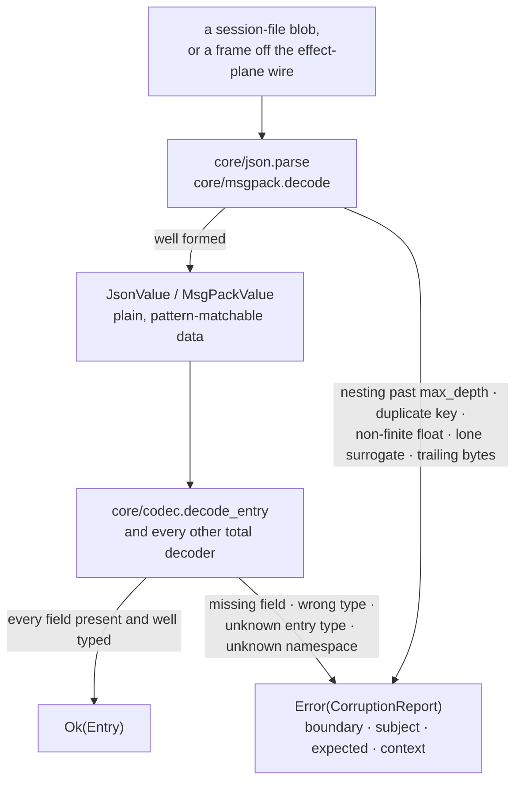
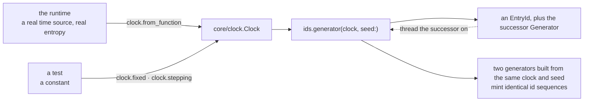
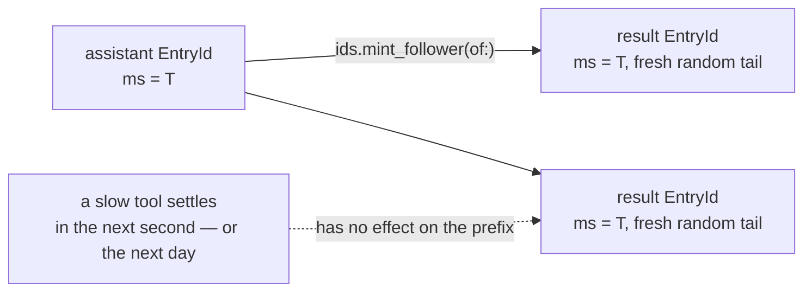

# core

`core` is the vocabulary every other package in Loom shares: the opaque
ids, the four write-once row shapes, the closed register-namespace set,
the transaction type, and the two codecs that guard every durability and
wire boundary. It is the root of the dependency graph — every other Gleam
package depends on it, and it depends on `gleam_stdlib` and nothing else.

Two properties shape the whole package, and everything below is a
consequence of one of them.

> **It performs no I/O**, and that is structural rather than a convention:
> there is no `gleam_erlang`, no `gleam_otp`, no `simplifile`, and no FFI
> module. Time and randomness arrive as injected values.
>
> **Every decoder is total.** A decoder returns
> `Result(t, CorruptionReport)`. Wrong shapes, wrong types, and hostile
> input are reports; nothing here panics, and nothing here half-succeeds.

## What a decode boundary looks like

Durable bytes reach a caller through two total steps: a parser that turns
text or a byte string into plain data, and a codec that turns that data
into a typed value. Either step can refuse, and refusing always produces
the same thing — a `CorruptionReport`, which is itself plain data that can
be logged, stored, and sent across a process boundary.



`decode_entry` is the representative case. It reads the placement fields
common to all four entry kinds, dispatches on the `type` string, and
returns a report for anything it does not recognise — the entry-kind set
is closed, so an unknown name is damage, not a value to skip:

```gleam
pub fn decode_entry(value: JsonValue) -> Result(Entry, CorruptionReport) {
  use fields <- result.try(fields_of(value, where))
  use id <- result.try(require_entry_id(fields, "id", where))
  use parent <- result.try(decode_parent(fields, where))
  ...
}
```

The shape matters as much as the totality. There is no "decode what you
can and carry on": a value is either fully constructed or it is a report,
because a partially decoded durable row is a bug that surfaces much later
and somewhere else.

### Bounded against hostile input

Both codecs are read by adversarial data — a provider response that ends
up in an entry, a frame from a sandboxed process — so the defences are
part of the contract rather than hardening added later.

- **Nesting is bounded** at `max_depth` (256) in both codecs. A thousand
  `[` characters is cheap to fabricate and would otherwise drive the
  parser into unbounded recursion.
- **Reports are bounded.** `corruption.report` truncates its `context`
  excerpt to `max_context_length` (256) graphemes, so a report derived
  from a multi-megabyte payload cannot bloat every log line that carries
  it.
- **Duplicate keys are corruption**, in JSON objects and msgpack maps
  alike. Decoders disagree on whether the first or last occurrence wins,
  so a document carrying duplicates has no single meaning; rejecting is
  the only rule with one interpretation.
- **Non-finite floats are corruption.** The BEAM cannot represent NaN or
  infinity, so a literal that would round to one is refused rather than
  silently changed.

The strictness applies to *our* boundaries. Third-party wire formats are
read leniently elsewhere, because strict decoding of a foreign vocabulary
breaks against real proxies and buys nothing. The line is ownership: data
Loom wrote must decode exactly as written, or it is damaged and we say so.

## Impurity is injected, never imported

Nothing in `core` reads a system clock or an entropy source. A `Clock` is
a value; reading it returns the time *and the clock to use next*, so a
fixture clock can step deterministically and a caller cannot accidentally
re-read the same instant twice without noticing it threaded nothing.

```gleam
pub fn read(clock: Clock) -> #(Int, Clock)
```

`ids.Generator` composes that clock with a seeded SplitMix64 state, and
mints the same way — value in, value out.



Impurity belongs to whoever *built* the clock, which is why the runtime
can seed from real entropy while a test seeds from a constant and gets the
same ids every run.

## Ids that exist before their rows do

Every durable id — entry, usage row, operation — is a UUIDv7: 48 bits of
Unix-millisecond mint time, the version nibble, then randomness. Three
consequences are load-bearing.

The mint time reads back out of the id without touching storage. The
canonical lowercase text form sorts lexicographically in mint order, so an
id is a stable tiebreaker wherever rows are ordered by text. And an id can
be minted *before* the row it names exists, which is what lets a
transaction reserve an id for output that has not been produced yet — the
mechanism the whole effect sandwich is built on.

`EntryId`, `UsageId`, and `OpId` are distinct opaque wrappers over the
same shape, so an entry id can never be passed where an operation id
belongs. Tool results are the one special case:



A call-and-results group therefore stays contiguous under id order even
when a tool takes minutes to answer.

Ids are minted; `seq` is not. A `Seq` is assigned by storage at commit and
is strictly increasing within a session. Ids say when something was
created, seqs say in what order it became durable, and that is storage's
word alone.

## The durable vocabulary

**Entries** are the conversation tree, and there are four shapes:
`MessageEntry`, `CompactionEntry` (a self-contained checkpoint carrying
the complete retained suffix, so context assembly never reads past it),
`BranchSummaryEntry`, and `CustomEntry` (whose `custom_type` is
structural — branch queries filter on it without touching the payload).
Each carries its placement fields and its payload together, so a read
returns exactly what was committed with no materialization step.

**`UsageRow`** is the append-only cost ledger row.

**Registers** are the only mutable store, and the namespace set is closed:
`strand.leaf`, `strand.config`, `strand.state`, `strand.last_result`,
`op.meta`, `op.state`, `op.tool_args`, `op.preparation`, `pending.entry`,
`fact.name`, `fact.label`, `fact.custom`. Adding one is an interface
change. The *rich* payload types those namespaces force are orchestration
vocabulary and live in `machine`; `core` stores a `RegisterValue` — a thin
tagged wrapper around encoded JSON — so storage stays generic over
payloads it never has to understand. The single exception is
`strand.leaf`, whose `Option(EntryId)` payload `core` encodes and decodes
itself.

**`Tx`** is the unit of durability: an ordered `List(Write)` plus a list
of `SeqExpectation`s, applied all-or-none.

```gleam
pub type Write {
  InsertEntry(entry: Entry)
  InsertUsage(row: UsageRow)
  SetRegister(ns: RegisterNs, key: String, value: RegisterValue)
  DeleteRegister(ns: RegisterNs, key: String)
}
```

`CommitError` names four refusals, and the fourth is newer than the frozen
sketch. `LeaseLost(held_by:)` says the committer is no longer the
session's writer — the one refusal that no reload and no retry can get
past, which is exactly why it is a value rather than a string inside
`Faulted` (`protocol-change/005`). `tx.describe_lease_loss` is the single
place it is worded for humans, so every layer that has to flatten one into
prose says the same thing.

## The modules

| Module | What it holds |
|---|---|
| `core/ids` | `EntryId`/`UsageId`/`OpId`, `Seq`, the injected UUIDv7 `Generator`, `mint_follower`. |
| `core/clock` | The injected time capability: `from_function`, `fixed`, `stepping`, `read`. |
| `core/entry` | The four `Entry` variants and `UsageRow`. |
| `core/register` | The closed `RegisterNs` set, `RegisterValue`, the leaf codec, `ns_to_string`/`parse_ns`. |
| `core/message` | The `AgentMessage` family, `StopReason`, `DeferredHandle`, `Usage`. |
| `core/tx` | `Write`, `Tx`, `SeqExpectation`, `CommitResult`, `CommitError`, `describe_lease_loss`. |
| `core/json` | A pattern-matchable JSON ADT with a total parser and serializer. |
| `core/codec` | Total JSON codecs for every durable core type, in pi's exact field vocabulary. |
| `core/msgpack` | The canonical msgpack subset the effect-plane framing protocol uses. |
| `core/corruption` | `CorruptionReport`, its bounding smart constructor, and `describe`. |

Paths are relative to `packages/core/src/` — `core/ids` is
`packages/core/src/core/ids.gleam`.

## Reading further

- [`CLAUDE.md`](CLAUDE.md) — the reference doc for changing this code: key
  types, real dependency edges, register and wire traffic, and the
  invariants that break things when violated. Read it before editing.
- [`docs/architecture/durability.md`](../../docs/architecture/durability.md)
  — the plane this package is the foundation of: the three stores,
  identity, transactions, expectations.
- [`docs/adr/001-agent-message-fidelity.md`](../../docs/adr/001-agent-message-fidelity.md)
  — why the message family mirrors pi's shapes field for field.
- [`docs/adr/003-msgpack.md`](../../docs/adr/003-msgpack.md) — why the
  msgpack codec is self-contained pure Gleam.
- [`docs/gleam-style.md`](../../docs/gleam-style.md) — Part IV is the
  policy this package is the strictest instance of: total decoders, no
  panics outside tests, FFI confinement, purity layering.
