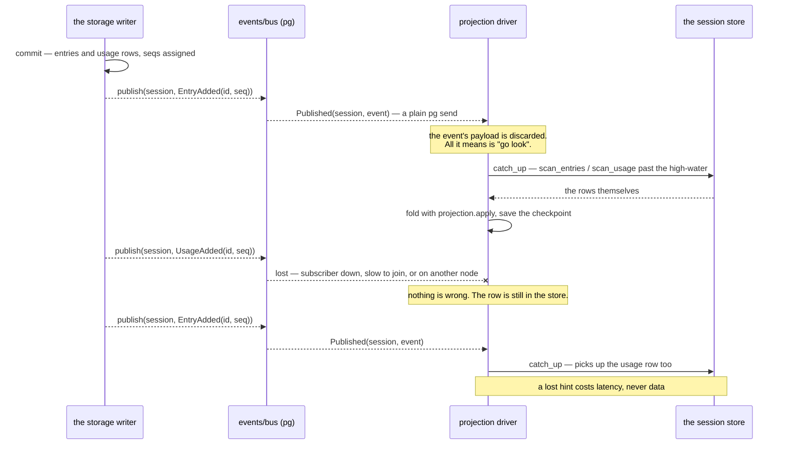
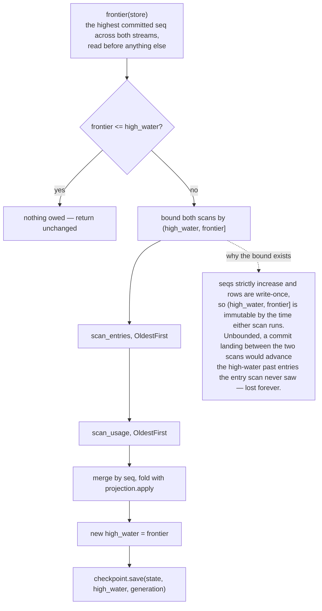
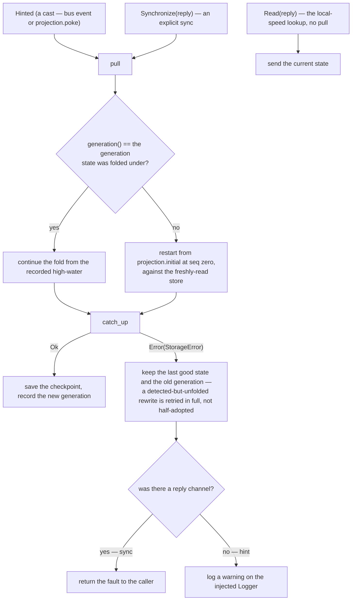
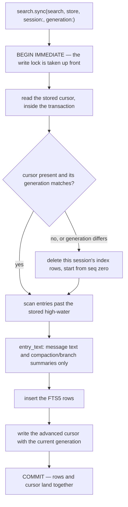

# events

The read side of the durability plane: a typed per-session event bus, the
rebuildable read models folded from a session's committed stream, and a
full-text index over a repository's sessions.

Nothing in this package holds authority. Every read model is a fold over
the durable store, every index row is derived, and every event is a hint
that something changed. Deleting a projection's checkpoint or the whole
search database costs a longer catch-up and nothing else.

## Events are hints; pulls are truth

This is the doctrine the package exists to enforce, and it is one
sentence: **an event never carries content and is never applied as data —
it only prompts a catch-up pull from the durable store.**

The events are deliberately thin — `EntryAdded(id, seq)`,
`UsageAdded(id, seq)`, `OpTransition(op, phase)`,
`StrandResult(strand)`, `Escalation(op, description)`,
`Committed(seqs, ts)` — and where one carries a string it is a display
label, never a machine input. An `OpTransition`'s `phase` is text for a
UI; the `op.state` register remains the truth. That is what makes the
loss tolerable: drop any subset of events and every read model still
converges on the next hint, on an explicit `sync`, or on restart, and the
package's lost-event tests assert exactly that.

The bus itself owns no actor. It is `pg` process-group membership plus
plain sends, keyed `#(session, topic)` inside one node-global scope, so
per-session isolation needs no per-session processes and a lookup is a
local-speed ETS read. Delivery is best-effort by construction, which is
the honest expression of the doctrine rather than a limitation of it.

One typed-boundary detail is load-bearing. `pg` stores plain pids and
delivery is an untyped Erlang send, so the types are re-established by
*pairing*: only `ffi_pg.publish` ever sends the `{loom_event, _}` tuple,
and only with the caller's typed payload, and `published_payload` is the
matching unwrap. That pairing is what makes the unchecked coercion back
to a typed payload sound.

**What is wired today.** `bus.publish` has no caller outside this
package's own tests. The runtime's storage writer publishes its own
minimal post-commit notification, and `bus.bridge` is the adoption seam —
it turns any subscription-shaped event source into bus publishes without
this package importing the runtime, because the mapping closure belongs
to whichever layer can see both types. Section 17 of
[`docs/code-tour.md`](../../docs/code-tour.md) is the current account of
what is and is not connected.

## A projection, and the frontier rule

A `Projection(state)` is `initial` plus a pure, total
`apply(state, Change) -> state` over `EntryAppended` or `UsageAppended`.
Purity is what makes the correctness property provable: folding the same
changes in the same order from `initial` always yields the same state, so
`rebuild` and incremental `catch_up` are provably equal, and `rebuild` is
literally `catch_up` from seq zero.

`catch_up` issues more than one scan — entries and usage are separate
streams — and the writer may commit between them. That is the whole
reason for the frontier.

A checkpoint persists **state, high-water, and generation together**, as
one triple. State without its high-water is meaningless, and either
without the rewrite generation they were folded under cannot be told
apart from a checkpoint that a precise rewrite has invalidated.
Persistence is best-effort: a checkpoint that loses writes costs a longer
catch-up, never correctness. `projection.ephemeral()` persists nothing
and rebuilds every restart, which is a legitimate configuration rather
than a degraded one.

### The driver, and why it re-reads everything

`projection.start` runs the fold in an actor. Its `Options` carry `store`
and `generation` as **thunks**, called fresh on every pull rather than
captured once, and that is not fussiness — a precise rewrite swaps the
store handle and bumps its generation underneath a long-lived driver.

That last branch is a small decision with a reason. A pull fault on the
hint path has nobody to answer, but staying silent would let a driver
reading a closed or stale handle serve its last good state forever with
nothing surfacing the failure. It is a `warning` rather than an error
because the checkpointed state still stands and the next hint retries —
degraded, not broken.

## Full-text search

Search is a standalone service over its own store. Sessions know nothing
about it; it reads them through the ordinary `Storage` scans and keeps
its index plus a durable per-session cursor in one repository-wide SQLite
file that is **never inside a session file**. Indexing failures cannot
affect commits, and deleting the database only costs a re-sync.

The interesting part is that one transaction does everything, including
the read that decides what to write.

Reading the cursor *inside* the transaction is what makes two concurrent
syncs of the same session safe: the second one's read waits for the
first's commit and then sees the advanced high-water, instead of both
reading the same stale cursor and both inserting the same rows. It was
reproducible as five entries indexing as ten. Crash-safety falls out of
the same arrangement — a crash mid-batch simply re-runs the batch into
the same state, and a lost hint is caught by the next sweep.

`search.notify` is `sync` under a name that reads correctly at the call
site: a notification is a poke that triggers a pull of one session, and a
lost poke is caught by the next sweep. Debouncing, for search-as-you-type
freshness, belongs to the caller.

**A rewrite invalidates by generation, on both read models**, because a
rewrite may renumber seqs and anything folded or indexed under the old
numbering is void. Search stores the session store's generation alongside
its cursor and re-indexes from zero on mismatch, in the same transaction.
The projection driver compares on every pull and restarts the fold. A
cold start has nothing to compare against, so it simply records whatever
generation the store reports.

**What is indexed is message text and compaction or branch summaries, and
nothing else.** Thinking blocks and tool-call arguments are deliberately
left out.

## Where to look

| Path | What it holds |
|---|---|
| `src/events/bus.gleam` | Topics, the thin events, `publish`/`subscribe`/`select_published`, and `bridge`. |
| `src/events/projection.gleam` | `Projection`, `Checkpoint`, `catch_up` with the frontier rule, `rebuild`, and the driver actor. |
| `src/events/search.gleam` | The FTS5 index, the one-transaction `sync`, `query`, `remove`, and `entry_text`. |
| `src/events/sql/search.sql` | The named static statements. `src/events/sql.gleam` is generated from it by parrot — do not edit; regenerate with `scripts/gen-sql.sh`. |
| `src/events/internal/ffi_pg.gleam` | The confined binding over OTP's `pg`, and this package's complete impurity. |

[`CLAUDE.md`](CLAUDE.md) is the reference doc for changing this code. The
plane these read models sit on — seqs, write-once rows, the store as the
only authority — is
[`docs/architecture/durability.md`](../../docs/architecture/durability.md);
[`docs/adr/004-parrot-sql-codegen.md`](../../docs/adr/004-parrot-sql-codegen.md)
records why one module is generated and what stays hand-written.
