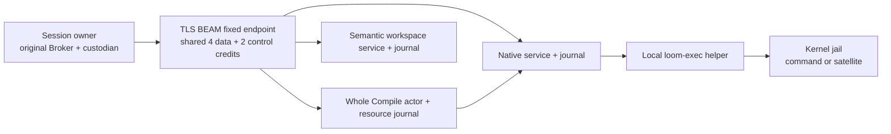

# executor

`executor` owns execution beside a workspace, without a session runtime or model
provider. Its local entrypoint boots the same helper pool and execution service
that the harness uses. Its `remote/` modules add durable native custody, semantic
workspace operations and physical Compile ownership for an administratively
registered executor.

Trusted executor nodes join the owner's runtime trust domain through TLS BEAM
distribution. Model-written code stays in a separate native jail. A distributed
peer can create remote BEAM processes, so executor membership is a full-node
trust decision. A satellite must receive neither distribution credentials nor a
`distribution.Peer`; the assembled remote deployment still needs to verify
credential and descriptor exclusion in its actual jail.

The distributed components are implemented, with real journal, compiler and
TLS BEAM component tests. Registered daemon assembly, Launch/satellite routing,
remote language servers and separate-host ordinary-tool acceptance remain
pending. The standalone entrypoint is a local smoke and drain program; it does
not configure or expose a remote executor deployment.

## One local service, two effect boundaries

`executor.boot` creates a helper pool, execution service and Broker. `smoke`
runs a jailed command through that Broker; `census` reports the helper's actual
versions and features; `drain` closes the service and asks the pool for its
native-exit verdict. A degraded host refuses the smoke. An unconfirmed drain
preserves scratch because native work may still use it.

The native `loom-exec` helper runs on the executor machine. Gleam owns identity,
policy admission and settlement; the helper and kernel own confinement and
native retirement. A BEAM process exit, terminal result or disconnected peer
cannot establish that native descendants have retired.



The workspace service calls the concrete executor-local tool host. Whole Compile
prepares source and offline dependencies, publishes Ready, waits for the
original owner's cleared compiler command, then finalizes an artifact only from
exact retained native terminal evidence. Its artifact locations remain executor
locations; the owner does not open them as local paths.

## Membership and bounded transport

`remote/distribution` validates a finite administrative list before atom creation.
A successful boot requires the provisioned OTP TLS flags, mutual certificate
verification, exact leaf pins, full-node subject alternative names and a private
cookie home. The host must protect the actual canonical credential and options
paths returned by `protected_membership_paths` from every jail. Membership checks
those files at boot; it cannot prove that the embedding sandbox protects them.

`remote/beam_endpoint` publishes one fixed rendezvous. Trusted local registration
binds an original owner Peer, labels, full scope and generation to concrete
native, workspace and Compile services. Up to sixteen registrations share four
data and two control credits across the node. The Compile registration derives
its native endpoint from the whole Compile actor. Command frames enter through
that actor; fresh native admission requires its original live Claim. Historical
controls reconcile the original association without creating another Claim.

Payloads retain their existing canonical codecs. Existing acknowledged 64-KiB
chunks carry invocation bytes (up to nine MiB), workspace completion (up to
thirty-two MiB) and Compile completion (up to 256 KiB). Native frames retain
their 256-KiB aggregate and separate 128-KiB Prepared bound. Small routing headers
bind the complete scope and generation before a credit is granted. These are
content and admitted-concurrency limits, not a bound on all BEAM memory or
mailbox traffic from a trusted peer.

An endpoint credit owns the actual service reply subject. After a queued ask,
reuse requires the service's real answer and the managed transport's final
`AllDelivered` report. Caller death, elapsed observation or successful BEAM send
supplies neither fact. A delayed handoff also carries its original run reference;
it cannot admit work into a reused credit. Uncertain custody retires capacity.
Endpoint replacement still requires the embedding owner's independent native
drain obligations.

## Durable records and recovery

The owner retains the original tool, service request, command offer, cleared
native request and receipts before acknowledging them. This package retains
three different executor histories: native request/admission/output, semantic
workspace invocation/completion, and physical preparation/native association/
Compile completion. All row operations use named SQL generated by Parrot/sqlc.

`remote/resource_journal` grants an original Claim only after fresh preparation
admission commits. Its historical Input and Ready reads grant no execution
permission. New live native association checks actual retained Request,
Authority and Admit, then atomically checks original Prepared eligibility and
commits the exact native binding. Only that successful live transaction returns
a `NativeLaunchPermit`; duplicate, historical and recovered reads never recreate
it. Cancellation uses the same resource writer lock.

The native service clamps command authority to the executor-local Compile
monotonic deadline captured at original admission. Preparing files and waiting
for owner clearance consume that same lifetime. A retry cannot renew it, even
if the owner's Unix clock moves backward. Exact historical query, cancellation
and acknowledgement remain data reconciliation under the original identity.

Outer Compile receipt, native output receipt, resource cleanup and native
retirement are separate obligations. Recovery reads exact history and preserves
uncertainty; it never reruns the compiler to reconstruct a report.

## Modules in reading order

Paths are relative to `src/`. The dependency manifest adds `core`, `broker`,
`codemode`, `tools` and `telemetry`, but no `client`, provider or session package.

| Module | Responsibility |
|---|---|
| `executor.gleam` | Local boot, jailed smoke, census and witnessed drain. |
| `executor/remote/distribution` | Administrative TLS BEAM bootstrap and opaque peer identity. |
| `executor/remote/beam_endpoint` | Fixed discovery, closed routing and shared ingress custody. |
| `executor/remote/host` | Native scope publication, ordered fencing and witnessed cleanup over a borrowed shared endpoint. |
| `executor/remote/identity`, `admission`, `journal`, `payload`, `service` | Native identity, pure decisions, durable evidence and original launch continuation. |
| `executor/remote/registration`, `wire`, `dispatcher` | Exact native policy enrollment, canonical frames and owner dispatcher adapter. |
| `executor/remote/workspace_journal`, `workspace_service`, `workspace_transfer` | Once-only semantic workspace work and bounded canonical content transfer. |
| `executor/remote/resource_journal` | Original physical input, preparation fence, native binding and outer completion custody. |
| `executor/remote/compile_service`, `compile_observation`, `compile_completion`, `compile_wire` | Whole Compile lifecycle, committed native evidence, closed result and transport segments. |

The older `connection` and `listener` modules record the socket transport
being replaced. They are not an alternative deployment mode. Removal waits for
all consumers and acceptance fixtures to finish the TLS BEAM migration.

## Testing and proof limits

```sh
make check-executor
make lint-executor
make doc-check
```

The package gate runs format, warning-free compilation and executor tests.
Real-helper tests report optional skips when the helper or kernel jail is
unavailable. Their logs and actual exit status remain part of the result.
`distribution_test` exercises independent TLS BEAM nodes and refused
credentials/boot settings. Endpoint controls exercise shared credit ownership,
drain and stale handoffs. Resource/native journal tests use real SQLite, and
Compile controls use actual Broker clearance, helper output and artifact
fingerprints. The owner joined fixture lives in `client`.

The bounded P models check custody transitions and endpoint handoff ordering.
Channel PlusCal and the existing admission Lean bridge cover their own narrower
claims. None proves OTP/TLS behavior, database power-loss durability, kernel
confinement or the whole remote deployment. See the model README for exact
snapshots and executable counterexamples.

## Reading further

- [CLAUDE.md](CLAUDE.md) records key types, dependency edges and invariants;
  [AGENTS.md](AGENTS.md) is its exact mirror.
- [Executor architecture](../../docs/architecture/executor.md) connects this
  package to the local service, trusted membership and native lifetime.
- [Remote custody](../../docs/architecture/remote-custody.md) follows original
  owner admission, command reservations, receipts and recovery.
- [Remote compilation](../../docs/architecture/remote-compilation.md) follows
  original preparation, native association and exact outer completion.
- [Protocol 067](../../protocol-change/067-remote-workspace-services.md) records
  the service contracts and accepted trusted-executor distribution amendment.
- [Remote execution model](../../protocol/models/remote-execution/README.md)
  records bounded checks and their omissions.
