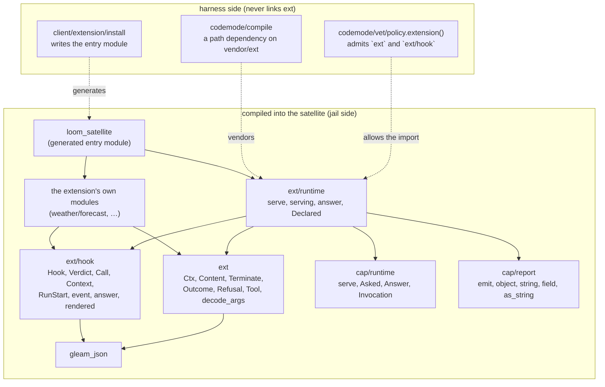
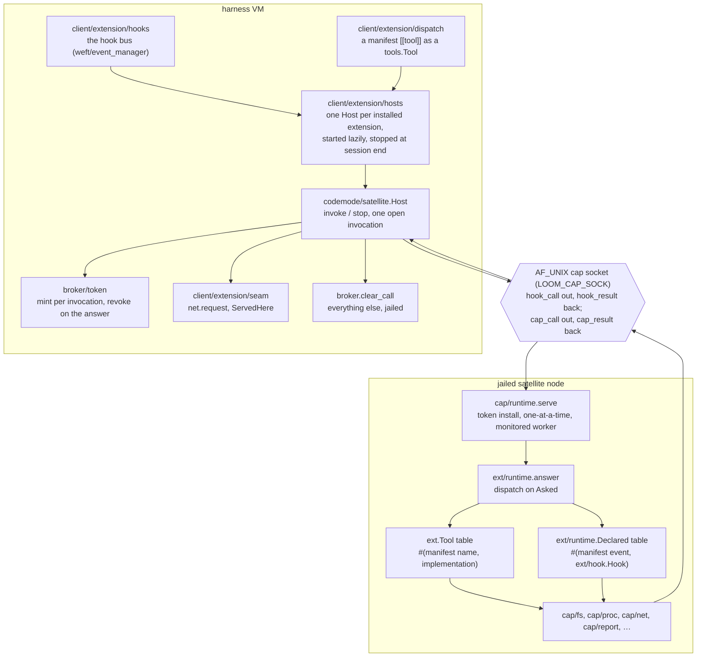
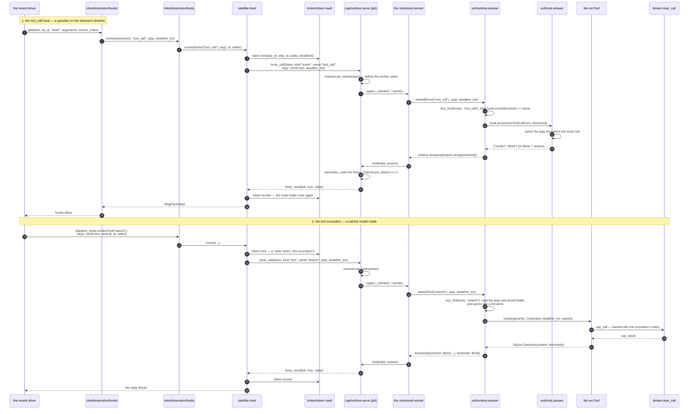

# ext

The extension prelude: the vocabulary an out-of-tree extension author
writes their tools and hooks against, and the runtime that serves them.

Like [`cap`](../cap/README.md), this package **does not run in the
harness**. It is vendored into a code-mode build root at `vendor/ext`
(`codemode/compile.ext_path`), compiled once at install together with the
extension's own source, and executed inside a jailed satellite node on the
untrusted side of the kernel boundary. Nothing in the harness imports it.

The split from `cap` is the useful thing to hold onto. `cap` is the
capability language: what a jailed program may *reach*. `ext` is the
behaviour contract: what shape a jailed program must *be* to answer a tool
call. A code-mode program is a `fn() -> report.Outcome` whose arguments the
harness already knows; an installed extension is compiled once and run many
times, so the invocation is what varies, and something has to dispatch on
it and marshal the reply. That something is `ext/runtime.serving`, the one
call a generated entry module contains.

An extension author writes three kinds of thing and nothing else:

```gleam
import ext.{type Ctx, type Outcome, type Refusal}
import gleam/dynamic.{type Dynamic}
import gleam/dynamic/decode

pub fn run(arguments: Dynamic, ctx: Ctx) -> Result(Outcome, Refusal) {
  let decoder = {
    use city <- decode.field("city", decode.string)
    decode.success(city)
  }
  use city <- result.try(ext.decode_args(arguments, decoder))
  ctx.report("looking up " <> city)
  Ok(ext.text("it is raining in " <> city))
}
```

[Roasbeef/loom-web-search](https://github.com/Roasbeef/loom-web-search) is
the worked example: a manifest, a schema and one tool, installed with
`loom ext install`. It declares no hooks.

## Where it sits

`ext` sits below the extension's own modules and above `cap`, and it has
one consumer in the harness tree — the vetting allowlist that admits it —
and no importer at all.



The dashed edges are the only relationships the harness has with this
package: it writes a module that imports it, it vendors it into a build
root, and its vetting allowlist names it. Linking `ext` into the harness
virtual machine would break Rule Zero, so the edge is deliberately absent
and stays absent.

`gleam_erlang`, `gleam_otp` and `core` appear in `gleam.toml` as **dev**
dependencies only, for the test that drives the serving loop over a faked
channel. There is no `@external` here, of any target.

## Harness side, jail side

One `hook_call` frame is the whole seam. Above it, the harness decides
*when* an extension is asked something; below it, this package decides
*what* answers.



Two things about that picture are worth stating rather than inferring.

**The satellite never pulls.** Phase 1 launched a node per call and had it
ask, with a single `cap/ext.call`, which tool it had been booted for. Phase
3 deleted the capability and the pull with it (`protocol-change/012`,
ADR-007 Decision 3), because a node that lives past its first answer holds
no token of its own and so has nothing to pull *with*. The harness tells
the satellite what to answer, and `cap/runtime.serve` is the loop that
waits for the telling.

**A tool invocation and a hook event are the same frame.** `hook_call`
carries `kind` (`"tool"` or `"event"`), a `name`, an `args` value, a
per-invocation `token` and a `deadline_ms`. `cap/runtime` turns `kind` into
the closed set `Tool(name) | Event(name)` at the edge, and
`ext/runtime.answer` branches on it once. That is why an extension's hooks
cost no second process and no second boot.

## One `tool_call` hook and one tool invocation, end to end

The model asks for `bash`. Every extension that declared a `tool_call` hook
gets a say before the call is dispatched; then the model asks for the
extension's own `search` tool, and that runs on the same node.



The token is the load-bearing part. `cap/runtime` installs it on the
channel *before* the worker starts and clears it *after* the answer is
written, so a `cap_call` that leaves the node outside those two moments is
framed with bytes the harness already revoked and is refused
`unauthorized` before any router sees it. That is the whole of what keeps a
session-lived node no more powerful than the disposable one it replaced.

## What an extension cannot do

Four absences, each of them a design ruling rather than a gap waiting to be
filled.

**It cannot act between invocations.** Keeping an actor, a client or a
cache alive across calls is the point of a persistent satellite, and
computing with them is fine. Reaching a capability from one *between*
invocations is not: the token its `cap_call` would be framed with was
revoked when the last answer went out. Nothing in this package enforces
that and nothing in it could, which is why the rule is written here for the
author who is about to write a background poller.

**It cannot push.** There is no way to originate a frame. The satellite
answers `hook_call`s and makes `cap_call`s while an invocation is open; it
emits no events of its own, and the harness never reads anything from it
that it did not ask for.

**It cannot end an execution.** A serving node writes no `outcome` frame,
ever. The terminal frame the single-shot code-mode shape writes has no
counterpart here, because there is no execution to end.

**It cannot rewrite a tool call's arguments.** `hook.Verdict` is `Allow` or
`Block(reason)` and there is no third variant carrying replacements. A hook
that rewrote arguments after vetting is the one thing vetting cannot see,
so the type does not admit it.

To that list add the ordinary one: **nothing here refuses a capability**.
Like `cap/net`, this package marshals and labels. Deny-by-default is the
broker's property, and an extension's network policy is composed from its
manifest at dispatch (`client/extension/policy`), never checked in the
jail.

## What the author writes against

`ext` is vocabulary and nothing else, so the contract between an author and
the harness is a type the compiler checks at install time rather than a
shape agreed in prose and discovered at the first call.

| Type | What it is |
|---|---|
| `ext.Tool` | `fn(Dynamic, Ctx) -> Result(Outcome, Refusal)`. Arguments arrive as `Dynamic` because their shape is the manifest's `parameters` JSON schema, which the harness knows and this package does not. |
| `ext.Ctx` | `strand`, `deadline_ms`, and `report: fn(String) -> Nil`. `report` is a function value rather than a capability import, so a tool is exercisable in the author's own tests with no channel; in the satellite it is `cap/report.emit`, best-effort. |
| `ext.Content` | `Text(String) \| Json(json.Json)`. A JSON block travels as its serialization, because the channel speaks msgpack and a round trip through two structured encodings is a place for the two sides to disagree about numbers. |
| `ext.Terminate` | `ContinueRun \| TerminateRun`. The tool reply's `terminate` (`core/entry`) as a named type rather than a bare `Bool`, so a call site says which it means. |
| `ext.Outcome` | `content: List(Content)` and `terminate: Terminate`. `ext.text` and `ext.json` build the one-block common case. |
| `ext.Refusal` | Text the *model* reads and repairs. A refusal is a value; a crash is a fault the harness reports and the model can do nothing with. |
| `ext.decode_args` | Runs a decoder and turns every failure `decode.run` found into a `Refusal` that names the field. "expected String at .city" is a repair instruction; "bad arguments" is a dead end. |

## The hook vocabulary and its wire

`ext/hook` is the other half, and the one place the hook wire shapes are
read and written on the extension's side. `Hook` has one variant per event,
so an entry that answers the wrong event is a compile error in the
extension rather than a shape mismatch on the wire.

| `Hook` variant | Manifest `event` | Handed | Answers |
|---|---|---|---|
| `OnSessionStart` | `session_start` | nothing | `{}` |
| `OnBeforeAgentStart` | `before_agent_start` | `RunStart(op_id, strand)` | `{"inject": String \| null}` |
| `OnContext` | `context` | `Context(op_id, messages)` | `{"messages": [...]}` |
| `OnToolCall` | `tool_call` | `Call(op_id, tool, arguments, source_index)` | `{"verdict": "allow"}` or `{"verdict":"block","reason":…}` |
| `OnToolResult` | `tool_result` | the reply as `Dynamic` | `{"message": …}` |
| `OnAgentEnd` | `agent_end` | `op_id` | `{}` |
| `OnAgentSettled` | `agent_settled` | `op_id` | `{}` (accepted, but nothing in the harness fires it yet) |

`context` and `tool_result` are **chained transforms**: the harness folds
them over the installed extensions in load order and hands each one its
predecessor's output rather than the original, so an author writing one
should assume somebody else has already been here. The other five fan out.

Both documents cross as JSON text held in a msgpack string. The extension
seam admits `gleam/json`, `gleam/dynamic` and no msgpack decoder, so text
is the only shape both ends can read, and `hook.answer` is the single place
that reads or writes either side of it. `ext/runtime` carries the text
between the channel and that one place and reads neither end.

A conversation message is the case that shaped the API. The harness carries
messages in `core/codec`'s durable JSON, and `core` is not on the extension
seam — putting it there would widen the seam for a convenience — so a
`context` hook sees each message as a `Dynamic` and answers with a `Json`,
and the harness re-decodes what comes back with `core/codec`'s own total
decoder. There is no `Dynamic -> Json` in the standard library and a
transform that keeps most of what it was handed needs one, so
`hook.rendered(Dynamic) -> Result(Json, String)` is here. It is total, and
its `Error` is real: the null arm is written as an optional *string*
precisely so an unknown shape fails rather than being silently rendered
`null`.

## Five codes, five different facts

A `hook_result` that is not an answer carries one of these, and they are
five rather than one because they are five different things to be told
about an install.

| Code | What happened |
|---|---|
| `refused` | The extension worked as written and declined. Text the model reads. |
| `unknown_tool` | The manifest and the artifact disagree. The message carries *both* sides: the name asked for and the sorted list served. |
| `unhandled` | The extension registered no handler for this event. An ordinary answer, not a fault — the bus offers every extension every moment and most care about none. |
| `mismatched_hook` | The manifest declared one event and the module named for it answers another. Only the pair can see it, which is why `Declared` carries the name beside the hook. |
| `bad_arguments` | The invocation's envelope had no `args` string, or its `args` was not JSON. Schema-checked on the harness side, so this is a harness bug named rather than guessed past. |

`cap/runtime` mints `bad_kind`, `busy` and `crashed` a layer below, and
this package never mints those. A missing `strand`, by contrast, is the
empty string rather than a refusal: attribution is what it is for, and an
invocation with no strand is still one a tool can serve.

## What the manifest supplies

`extension.toml` is decoded by `client/extension/manifest` and the fields
this package's behaviour depends on are these:

- `[[tool]]` — `name` (what the model calls, and the key in the served
  table), `entry` (the module in `src/` exposing `pub fn run` of type
  `ext.Tool`), `parameters` (a path under `schema/` naming the JSON Schema
  the harness checks arguments against before they are sent), `timeout_ms`
  (the invocation deadline that becomes `Ctx.deadline_ms`), plus
  `description` and the required `prompt_snippet`.
- `[[hook]]` — `event` and `entry`, where the entry module exposes a
  zero-arity function returning an `ext/hook.Hook`. `answer` checks the two
  against each other.
- `[net]` — `hosts`, `methods`, `max_response_bytes`, `requests_per_call`
  and `secrets`. None of it is read in the jail; it composes the policy the
  broker judges `net.request` against, and the ceiling is reset per
  invocation, which is what makes `requests_per_call` mean per call rather
  than per session.

`client/extension/install` turns the tool and hook tables into the
generated entry module verbatim:

```gleam
import ext/runtime
import weather/forecast as ext_entry_0

pub fn main() -> Nil {
  runtime.serving(
    tools: [#("weather", ext_entry_0.run)],
    hooks: [#("tool_call", ext_entry_0.on_event())],
  )
}
```

`serve(tools)` is `serving` with an empty hook table, which is what an
extension declaring no `[[hook]]` gets. Two functions rather than one with
an optional argument, because the generated entry writes whichever call the
manifest asked for and the common one should read as the common one.

## Testing

`answer(tools, hooks, asked)` is the whole dispatch as a function over a
`cap/runtime.Asked`, deliberately separated from `serving` so the round
trip is drivable with no channel and no socket. That is how this package's
own tests run — `answer_runs_the_named_tool_test`,
`answer_names_what_it_serves_test`,
`a_hook_that_answers_another_event_is_refused_test` — and it is how an
author tests their own table.

Three tests in `test/ext_test.gleam` go further and drive the real serving
loop over a faked transport, which is what the dev-only `gleam_erlang` and
`gleam_otp` dependencies are for:
`the_runtime_answers_two_invocations_on_one_node_test` proves the node
survives its first answer, `a_crashing_tool_is_an_answer_test` proves a
`panic` becomes `crashed` rather than a dead satellite, and
`a_cap_call_presents_the_invocation_token_test` proves a tool's `cap_call`
is framed with the token that arrived on the `hook_call`.

`test/ext/hook_test.gleam` covers the wire shapes one event at a time, plus
the two `rendered` cases: a document re-renders unchanged, and a `Dynamic`
that no JSON parser produced is an `Error`.

Run them with `make check-ext`.

## Where to look

| Path | What it holds |
|---|---|
| `src/ext.gleam` | The author-facing vocabulary: `Ctx`, `Content`, `Terminate`, `Outcome`, `Refusal`, `Tool`, and the `text` / `json` / `refuse` / `decode_args` helpers. |
| `src/ext/hook.gleam` | `Hook`, `Verdict`, `Call`, `Context`, `RunStart`; `event`, `answer`, `rendered`, and the JSON marshalling of every hook wire shape. |
| `src/ext/runtime.gleam` | `serve`, `serving`, `answer`, `Declared`, and the five in-band codes. |

## Reading further

- [`CLAUDE.md`](CLAUDE.md) — the reference doc for changing this code: key
  types, real dependency edges, wire traffic, and the invariants that break
  things when violated. Read it before editing.
- [`docs/architecture/extensions.md`](../../docs/architecture/extensions.md)
  — the plane in full: the manifest, the install pipeline, the hook bus,
  and the host registry.
- [`docs/design-notes/extension-architecture.md`](../../docs/design-notes/extension-architecture.md)
  — the ruling: two tiers, brokered egress, the phases.
- [`docs/adr/007-extension-tiers-and-brokered-egress.md`](../../docs/adr/007-extension-tiers-and-brokered-egress.md)
  — the two decisions that outlive one change, including Decision 3 on the
  satellite's lifetime.
- [`protocol-change/012-hook-call.md`](../../protocol-change/012-hook-call.md)
  — the frame this whole package answers.
- [`packages/cap/README.md`](../cap/README.md) — the capability prelude
  this one sits beside, and the boot runtime it reuses.
- [`packages/client/CLAUDE.md`](../client/CLAUDE.md) — the harness side:
  the manifest decoder, the install pipeline, the hook bus, and `loom ext`.
