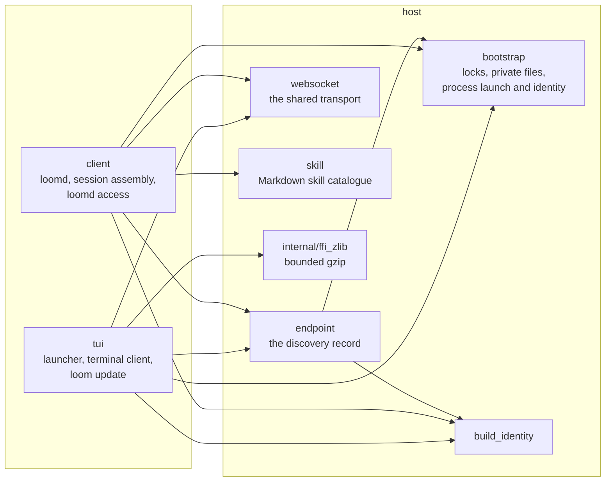
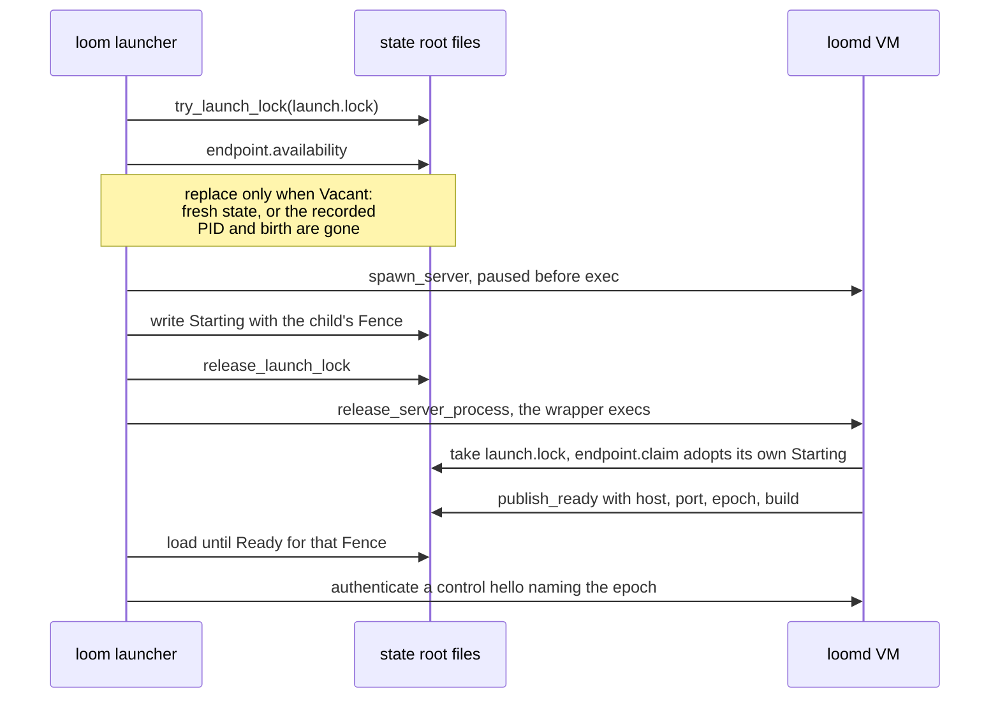

# host

`host` holds the operating-system primitives that the daemon (`client`)
and the terminal launcher (`tui`) share: private files and the state
root's discovery record, the launch lock, starting a paused server and
proving whether a process is still the one that was started, the build
identity both sides compare, the WebSocket transport every client socket
runs on, the operator's Markdown skill catalogue, and a bounded gzip
inflater. It decides no startup policy of its own. The launcher and the
daemon keep their policy in Gleam and call down into this package for
the mechanisms.

## Why it is a separate package

**Two programs need the same mechanisms, and neither may depend on the
other.** `tui` speaks to the daemon only over the wire and must not import
`client`; `client` takes `tui` only as a test dependency. Both need the
same discovery record, the same lock discipline and the same process
identity, and those must agree byte for byte, because a launcher and a
daemon that read the endpoint record differently could each conclude the
other is gone and start a second daemon. Putting the one implementation
below both is what keeps them agreeing.

**Custom Erlang is confined here.** Loom's rule is that an `@external` is a
last resort, kept to the minimum and placed where it is visible. This
package holds two of the tree's Erlang files: `host_bootstrap_ffi.erl`,
for what no published package reaches (advisory locking through a helper
port, `open_port` process launch and release, a positioned bounded read,
an exclusive-create atomic rename, `realpath`, `os:find_executable`, and
procfs or `ps` birth identity), and `host_zlib_ffi.erl`, for gzip
inflation that stops at a byte budget. Everything a Gleam package already
expresses (clocks, digests, the environment, `stat`, directory listing,
permission bits) is written in Gleam over `gleam_crypto`, `gleam_time`,
`envoy`, `simplifile`, `filepath` and `weft`.

## Who uses what

The terminal's control and conversation connections run on
`host/websocket` (through `tui/connection`), and so does `loomd access`.
The daemon captures each session's skills through `host/skill`. The
release installer in `tui/update` inflates archives through the bounded
gzip shim; the extension installer in `client` keeps its own adapter,
`client/internal/ffi_zlib`, for the same bound.

## The main flow: starting one shared daemon

The package's reason to exist is the cold start that `tui/daemon/bootstrap`
and `client/daemon/main` perform together. Each step below is a function
in this package; the ordering is the callers' policy.

The launcher releases the lock before it waits, because the child takes
the same lock to adopt its reservation. A failed socket probe never counts
as evidence that a daemon is gone: only `process_identity` reporting the
recorded PID absent, or present with a different birth, permits a
replacement.

## A tour, in reading order

1. **`bootstrap`.** The mechanisms, each with its policy in Gleam around
   it. `try_launch_lock`, `lock_monitor` and `release_launch_lock` hold a
   kernel lock through a helper port whose death releases it.
   `spawn_server` returns a `ServerProcess` for a wrapper that waits for
   one release line before it execs, so its caller can publish the PID
   first; `release_server_process` lets it run. `process_identity`
   answers `ProcessPresent(birth)` or `ProcessAbsent`, and an observation
   error stays an error rather than becoming absence. The private-file
   functions (`ensure_private_directory`, `read_private_bounded`,
   `atomic_write_private`, `read_bounded`) check ownership and
   permissions, bound what they read, and replace a file atomically after
   flushing it. `monotonic_time_ms`, `system_time_ms`, `sha256` and
   `getenv` are the shared clock, digest and environment reads.
2. **`endpoint`.** The one private discovery record that fences the
   daemon's whole VM. `Paths` fixes the files under the state root
   (`daemon.endpoint`, `launch.lock`, `owner.token`, the log and the
   catalogue). `Endpoint` is `Starting(fence)` or `Ready(fence, host,
   port, epoch, identity)`, where a `Fence` is a PID with its platform
   birth marker. `availability` answers `Vacant` or `Occupied(record)`,
   `claim` adopts only the reservation whose fence matches the claiming
   VM, and `publish_ready` replaces exactly that reservation. The codec is
   total and fails closed on a malformed record.
3. **`build_identity`.** The release version and commit, read from what
   the launcher exported rather than computed, compared by `matches` and
   printed by `describe`. It travels into the daemon's control `hello` and
   the endpoint record, and every reader reports a mismatch rather than
   refusing to attach.
4. **`websocket`.** Stratus owns the socket and the caller owns the inbox.
   `connect_mapped` maps every lifecycle event (`Connected`, `Incoming`,
   `Closed`, `NetworkFault`) into the caller's own message type inside the
   socket actor, so no forwarding process is needed, and `Connected` is
   minted after the upgrade and before the first read, so it cannot arrive
   behind a frame. `start_safely` and `start_safely_within` run a guarded
   startup whose links hold until a guardian takes ownership, so a socket
   is never left without an owner. The transport bounds nothing about the
   application: callers enforce their own frame and credit limits.
5. **`skill`.** Discovers the operator's Markdown skills from the
   configured directories, at most 256 entries per location and 64 KiB per
   document, suppressing aliases of the same file and reporting name
   collisions. A `Catalogue` keeps each document whole; `expand` discloses
   it only when the skill is invoked, with bounded argument substitution.
   Nothing in a skill executes in the host, and loading one grants no
   permission.
6. **`internal/ffi_zlib`.** Gzip inflation that compares the running
   output against a cap after every chunk and abandons the stream when it
   goes over, so a small archive cannot become gigabytes in the harness VM.

Paths are relative to `packages/host/src/`: `endpoint` is
`packages/host/src/host/endpoint.gleam`.

## How it is tested

- **In this package**, `make check-host` runs the tests in `test/host/`.
  `endpoint_test` covers the record's codec, its optional build identity,
  failing closed on a missing catalogue or a malformed record, a VM
  adopting its own `Starting` record while a `Ready` one cannot be
  restarted over, and a reused PID with a new birth being replaceable.
  `bootstrap_test` covers private files with UTF-8 paths and read bounds,
  the lock monitor observing the helper port's death, the stable digest,
  and a log tail cut inside a codepoint. `build_identity_test` and
  `skill_test` cover the identity's parsing and the catalogue's metadata,
  aliasing, limits and argument expansion.
- **Through its users.** The WebSocket transport and the cold start are
  exercised end to end by the terminal's and the daemon's suites in
  `packages/tui` and `packages/client`, including the real-client fixtures
  that launch a daemon, attach several terminals and restart it.

## Reading further

- [`CLAUDE.md`](CLAUDE.md): key types, the FFI inventory, the OS
  boundary, and the invariants, to read before changing this package.
- [The client plane](../../docs/architecture/client.md#discovery-credentials-and-safe-startup):
  the state-root files, credentials and the safe-startup rules this
  package implements.
- [The daemon process](../../docs/architecture/daemon.md): the daemon's
  side of startup, from claiming the record to publishing readiness.
- [The terminal client](../../docs/architecture/terminal.md#finding-or-starting-the-daemon):
  the launcher's side.
- [Skills](../../docs/skills.md): discovery and progressive disclosure.
- [`docs/gleam-style.md`](../../docs/gleam-style.md) Part IV §4: the FFI
  confinement rule this package's two Erlang files are held to.
