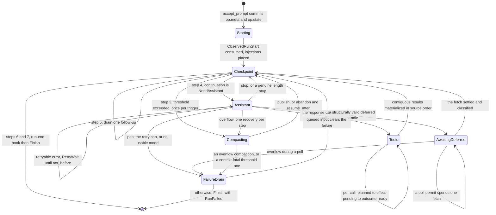
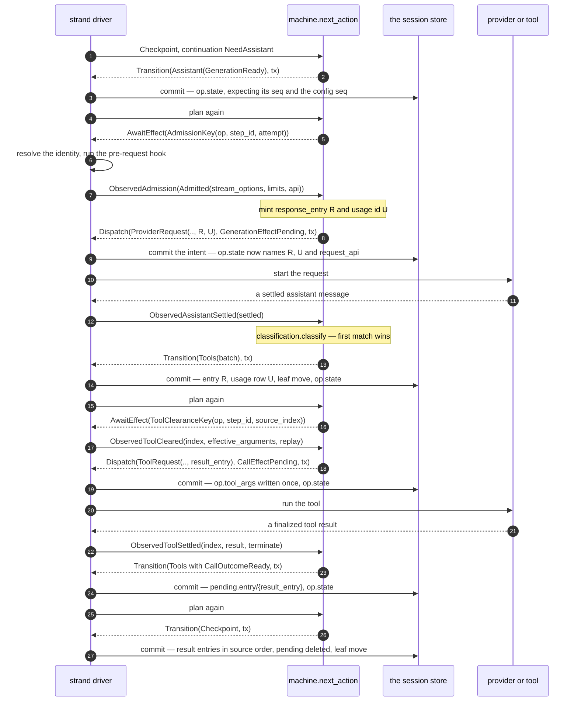
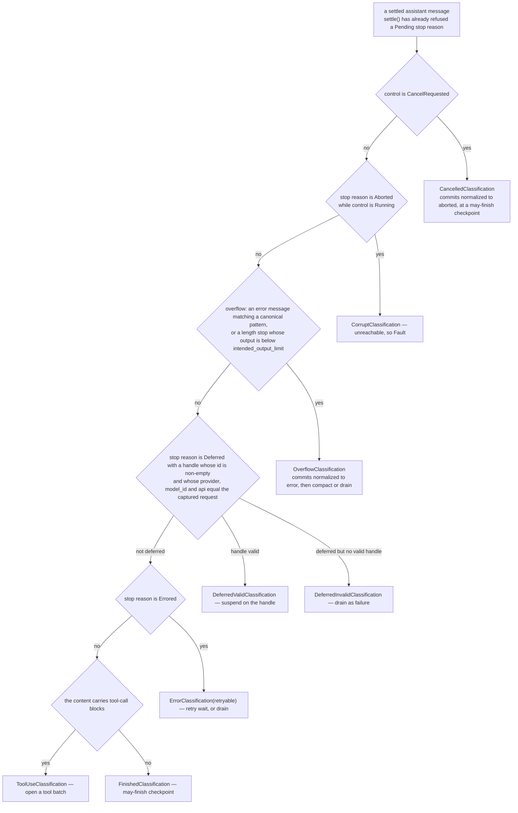
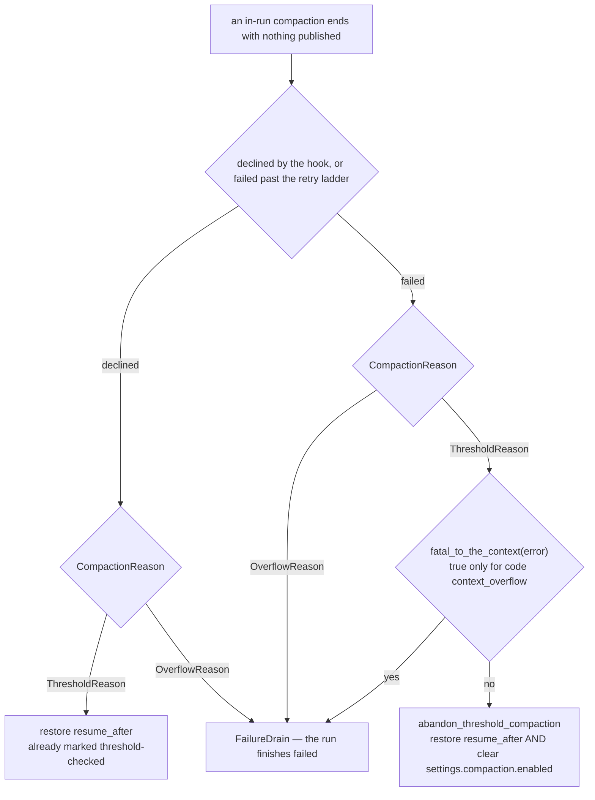

# machine

`machine` is the part of Loom that decides what happens next. It is one
pure function over a closed vocabulary:

```gleam
pub fn next_action(
  op: Operation,
  state: OperationState,
  in: PlannerInputs,
) -> Action
```

It performs no I/O, spawns nothing, waits on nothing, keeps nothing
between calls, and cannot crash. It depends on `core` and on nothing
else — not `storage`, not `provider`, not `gleam_erlang` — and it has no
FFI, deliberately: purity here is what makes the whole state space
testable without a single process.

The runtime drives it. Every pass of the strand driver's loop is the
same four steps — load the registers, build `PlannerInputs`, call
`next_action`, do what the returned `Action` says — and the machine
never learns anything the driver did not hand it.

## Decided from durable state, and only from durable state

`op.state` is the operation's program counter, and it is **total**: no
transition depends on the previous state having been observed. Recovery
reads that one register and knows exactly where it was. There is no
journal to replay, no event log to fold, and — the part that is easy to
get wrong — no inference from absence. The machine never concludes "the
entry is missing, so the effect must not have run"; the state says what
was true at the last commit, and anything the state does not say is
asked for explicitly as an `Observation`.

There is no finished variant either. An ended operation has no state at
all, because the terminal transaction deletes the register. "Is this
operation over" is `op.state` existing or not, which is one read and no
interpretation.

Three constructors match the three things an operation can be accepted
to do — `RunState`, `CompactionState`, `NavigationState` — and a state
whose kind disagrees with its operation's `intent` is corruption, caught
in the first `case` of `next_action`.

## Six actions

| Action | What the driver does |
|---|---|
| `Transition(next, tx)` | commit `tx`, then plan again |
| `Dispatch(intent, next, tx)` | commit the intent transaction, **then** start the effect |
| `AwaitEffect(key)` | produce the observation named by `key`, then plan again |
| `Wait(until)` | set a retry timer, or park until a poll permit |
| `Finish(result, tx)` | commit the terminal transaction; the operation ceases to exist |
| `Fault(report)` | the inputs or durable state are corrupt; stop, never continue |

The machine *builds* transactions and never commits them. Every `Action`
carrying a `Tx` carries all the writes that make its `next` state true,
guarded by the seq expectations the caller must have read against —
`expect_op_state`, `expect_strand_state`, `expect_leaf`,
`expect_configuration`. If the commit is refused with a stale
expectation, nothing happened and the driver reloads and plans again.

`Fault` is the sixth action and is newer than the frozen five. A pure
total function needs a value where a partial one would panic, so corrupt
durable state surfaces in-band rather than as a crash
(`protocol-change/002-fault-action-variant.md`). It really does mean
fault: the driver stops abnormally and the supervisor restarts, and a
genuinely corrupt register faults on every attempt until the tolerance
is spent and the tree dies visibly. Nothing is quietly repaired.

## The state space of a run



Every arrow that does anything is at least one commit, and a crash
between any two of them resumes at the next.

The checkpoint is the run's junction and runs pi's seven steps in a
normative order: deferred writes, steer, threshold compaction,
generation, follow-up, the run-end hook, finish. Two flags on
`CheckpointPhase` keep it idempotent under crashes, and both are worth
knowing by name. `threshold_checked` names the trigger entry whose
compaction check already ran, so one boundary is never checked twice.
`skip_inbox_once` is set by whichever drain just committed, so a crash
mid-drain cannot turn a one-at-a-time drain into an all-item drain —
resumption skips straight past steps 1 and 2 instead of re-evaluating
them.

Large payloads never live inline in the state. Tool arguments go to
`op.tool_args/{op}:{step}:{index}`, a summary's frozen input to
`op.preparation/{op}:{task}`, a message that is durable but not yet in
the tree to `pending.entry/{id}` — all written once, all deleted by the
terminal transaction. Queue lists carry ids and never payloads, which is
what makes "at every commit boundary a queued id has a register *or* an
entry *or* neither, never both" a checkable invariant.

## One turn, end to end

Here is a run that generates, gets tool calls back, executes one, and
lands at the next checkpoint. `D` is the strand driver; everything in
the `machine` column is a return value, not a call.



Two shapes are visible in that trace and both are load-bearing.

**The effect sandwich.** Every external effect is preceded by a
committed intent transaction and followed by a settlement transaction,
and `Dispatch` hands back both halves at once: the intent `tx` *and* the
state it makes true. The reserved ids are the trick. `R` and `U` are
minted before the effect starts and persisted in the intent, so the
settlement writes under ids already promised — and so does a synthetic
settlement written by recovery days later. A crash before the intent
commit means the effect never started; a crash after the settlement
means it is fully recorded; inside the window the state says
`effect_pending` and the truth is unknown, which is exactly what the
driver reports when it reloads that state and finds no live effect
(`ObservedAssistantOrphaned`, `ObservedToolOrphaned`). The machine, not
the driver, then decides what an orphan means: a provider request or
deferred poll is wholly uncertain and settles synthetically at zero
usage; a tool call consults the `ReplayPolicy` declared at intent, and
re-executes only when the tool's *current* registration also still says
safe.

**Staging before placement.** A tool result becomes durable at
`pending.entry/{result_entry}` first and enters the tree only when the
contiguous outcome-ready run at the frontier is materialized. That is
what keeps result entries in source order regardless of the order the
effects settled in, and it is why `ToolExecution` — `Sequential` or
`Parallel` — changes only *which call is worked next*, never how the
tree ends up looking. `Sequential` works the frontier's head alone;
`Parallel` works the first still-planned call even while earlier calls
are in flight, and parks on the first pending one only once nothing is
left to plan.

## Classification order is normative

When a provider request settles, one function decides what the run does
with it, and the order is first-match-wins and part of the contract —
reordering it changes behaviour, not style.



Three details in that chain are the reason it is written down.

Overflow is checked *before* the ordinary error rungs, because an
oversized request must compact rather than retry unchanged: the same
`Errored` stop reason would otherwise reach a perfectly plausible
retryable verdict and burn a whole ladder against a request that can
never fit.

A deferred handle is validated against the **captured request api** —
the value `admit_generation` persisted into `GenerationEffectPending`
as `request_api` — and never against the api the response reports about
itself. A routing change between dispatch and settlement cannot smuggle
a handle in.

Two normalizations happen at commit and both are deliberate: a cancelled
response commits as `aborted`, an overflow-classified response commits
as `error`. Both are then dropped from every later context by
`session`'s ordinary projection rule, which is the point — the row stays
in the tree as a record of what happened, and stays out of the model's
view.

One faithful-but-surprising consequence, kept because pi has it: a
really-settled response under cancelled control keeps its content and
its reported usage. Only an *unknown-outcome* orphan gets the synthetic
zero-usage settlement. Abort must not fabricate a cost of zero for work
the provider actually did.

## Acceptance: two seqs, or nothing

`accept_prompt` computes the single transaction that starts an
operation — a run, a standalone compaction, or a navigation. It is
state-independent normalization plus validation against a durable
snapshot the caller read; it invokes no hook, consults no registry, and
pre-acceptance rejections write nothing at all.

The transaction pins **two** seqs, plus the assertion that the
operation's own registers do not exist yet:

```gleam
tx: Tx(writes:, expected: [
  build.expect_strand_state(ctx.strand, ctx.strand_state_seq),
  build.expect_leaf(ctx.strand, ctx.leaf_seq),
  ..build.expect_op_absent(operation.id)
])
```

The strand-state expectation is what makes "at most one open operation
per strand" enforceable: a losing concurrent accept fails with
`StaleExpectation` and reports `StrandBusy` after reload. The leaf
expectation catches a different race — a concurrent *idle* tree write
moving the leaf between the caller's read and this commit would
otherwise mis-parent the acceptance's own prompt entries. Both must
hold, or nothing is written.

## The compaction decision lives here

Compaction has three hosts — an in-run `Compacting` phase, a standalone
compaction operation, and a summarized navigation — and one lifecycle:
decide, generate, publish. `StructuralHost` is the private type that
keeps the three from being three copies of the same code; every handler
in the structural section is written once against it and differs only
where the spec does.

The decision that matters most is what happens when a compaction does
*not* produce a summary. Both the decline path (`decide_structural`) and
the failure path (`structural_failure`) ask the same first question, and
it is not "what was the error" — it is **why the compaction started**.



A **threshold** compaction is the harness's own clamp, applied because
the context crossed an inequality Loom chose. Failing to apply it costs
the clamp, not the conversation: every message is still in the tree,
still projecting to the same context, still the size it was when the
last request fitted. So the run restores the checkpoint the compaction
copied aside and carries on unsummarized.

An **overflow** compaction is the provider's verdict that the context
does not fit, and a run that cannot shrink a context the provider has
already refused has nowhere left to go. It drains.

`abandon_threshold_compaction` does one thing beyond restoring the
checkpoint, and it is the part that is easy to leave out: it clears
`enabled` in the run's captured `CompactionSettings`. Restoring alone
would leave the gate open — the next appended entry is a new trigger,
the boundary is unchecked again, the threshold is still crossed because
the context did not shrink — and the run would spend a full retry ladder
against the same dead route at every turn for the rest of its life.
`enabled` is already the single gate step 3 reads and already lives in
`op.state`, so clearing it is a backoff that survives a crash-restore
for free. The backoff interval is the *operation*: `RunSettings` is
captured per operation at acceptance, so the next run on the strand
takes a fresh snapshot and asks the summarizer again. A summarizer
outage costs the run its compaction, not the session its ability to
compact.

`fatal_to_the_context` is a denylist rather than an allowlist, and
deliberately so. An unknown error code is far likelier to be one more
way for a summarizer to be unavailable than a claim that the
conversation cannot continue, and the two mistakes cost differently:
continuing when the run should have drained costs one more generation
request, which the overflow path catches; draining when the run should
have continued costs the whole session. Corruption never reaches this
decision at all — an undecodable register or an impossible observation
is a `Fault` raised at its own site, so nothing here can turn an
impossible state into a survivable one.

`compaction_publication` is the other end: one transaction carrying the
`CompactionEntry` — the summary, the complete retained tail from the
frozen preparation, and the `tokens_before` it recorded — plus the leaf
move. Nothing is deleted; a compaction is an append, and the projection
is what changes.
[`docs/architecture/compaction.md`](../../docs/architecture/compaction.md)
is the deep doc for all of it.

## Reading `machine/planner`

It is one public function and five thousand lines, and the module doc is
the map: it enumerates the sections and says what each one *decides*,
which is enough to find the section you want without reading the ones
you do not. Two conventions hold throughout. Every type the module has
is declared before the first function body, the private ones included,
so no handler thousands of lines down introduces a name cold. And a
phase's entry function is a dispatch table whose arms *name* the
decision rather than making it — `settle_assistant` is the clearest
example, seven arms each of which is one call.

Corruption has its own `use` forms, `or_fault` and `or_fault_unless`,
because Gleam has no early return and `result.try` cannot serve where
the continuation returns an `Action`. Reach for those rather than
nesting a `case` whose error arm is `Fault(report:)`.

## The modules

| Module | What it holds |
|---|---|
| `machine/operation` | The state space: `Operation`, `OperationState`, `RunPhase`, `Generation`, `ToolBatch`, `Inbox`, `Control`, `StructuralDecision`, `LastResult`, and the pending/preparation payloads. |
| `machine/planner` | `next_action`, the `Action`/`EffectKey`/`EffectIntent`/`Observation` vocabulary, and one section per phase of the spec. |
| `machine/classification` | `settle` and `classify`: the normative first-match-wins order over a settled response. |
| `machine/acceptance` | `accept_prompt` — the single acceptance transaction, and the rejections that write nothing. |
| `machine/queue` | Queue admission (steer, follow-up, write, next-run), queue cancellation, and the first-abort transaction. |
| `machine/strand` | The strand-scoped register payloads: `StrandConfiguration`, `StrandState`, `ModelIdentity`, `ThinkingLevel`. |
| `machine/codec` | Total JSON codecs for every register payload above. |
| `machine/internal/build` | The shared write builders and expectation builders every transaction is assembled from. |

Paths are relative to `packages/machine/src/` — `machine/planner` is
`packages/machine/src/machine/planner.gleam`.

## Reading further

- [`CLAUDE.md`](CLAUDE.md) — the reference doc for changing this code:
  key types, real dependency edges, register and effect traffic, and the
  invariants that break things when violated. Read it before editing.
- [`docs/architecture/orchestration.md`](../../docs/architecture/orchestration.md)
  — the plane this package is the brain of: the durable program counter,
  the effect sandwich, the state space, the drive loop, the interleave
  harness.
- [`docs/architecture/compaction.md`](../../docs/architecture/compaction.md)
  — compaction end to end, including everything on the runtime side of
  the threshold and the summary relay.
- [`packages/session/README.md`](../session/README.md) — the typed
  register access this package's codecs are read through, and the
  projection that decides what a settled response is worth later.
- [`protocol-change/002-fault-action-variant.md`](../../protocol-change/002-fault-action-variant.md)
  — why there are six actions and not five.
- [`docs/spec-gaps.md`](../../docs/spec-gaps.md) — "From WP-D
  (`machine`)": the absent list store, prefix scans, entry labels, and
  the retryability convention.
