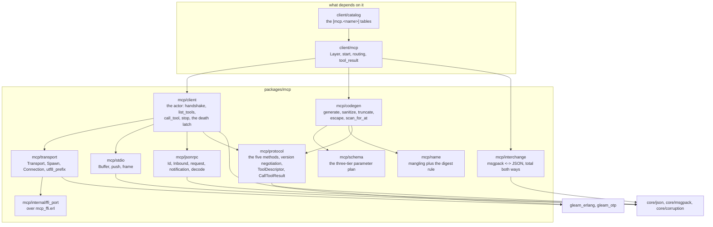
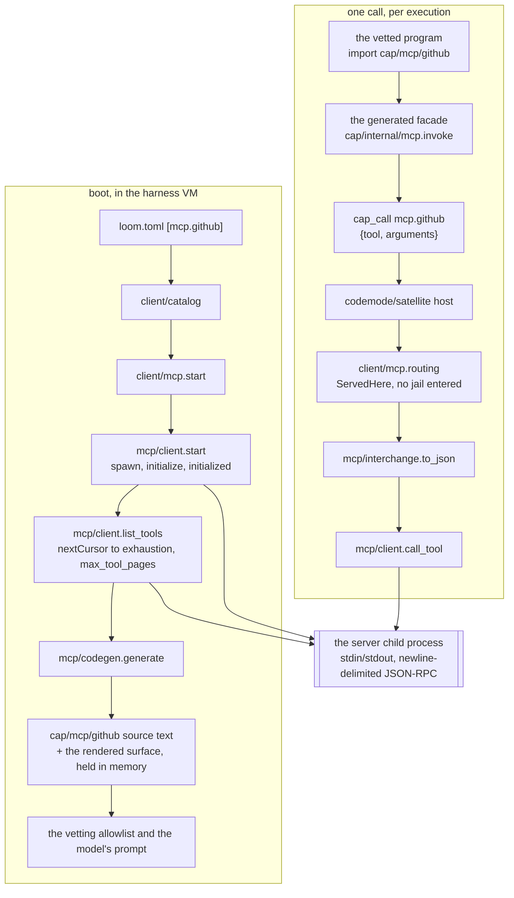
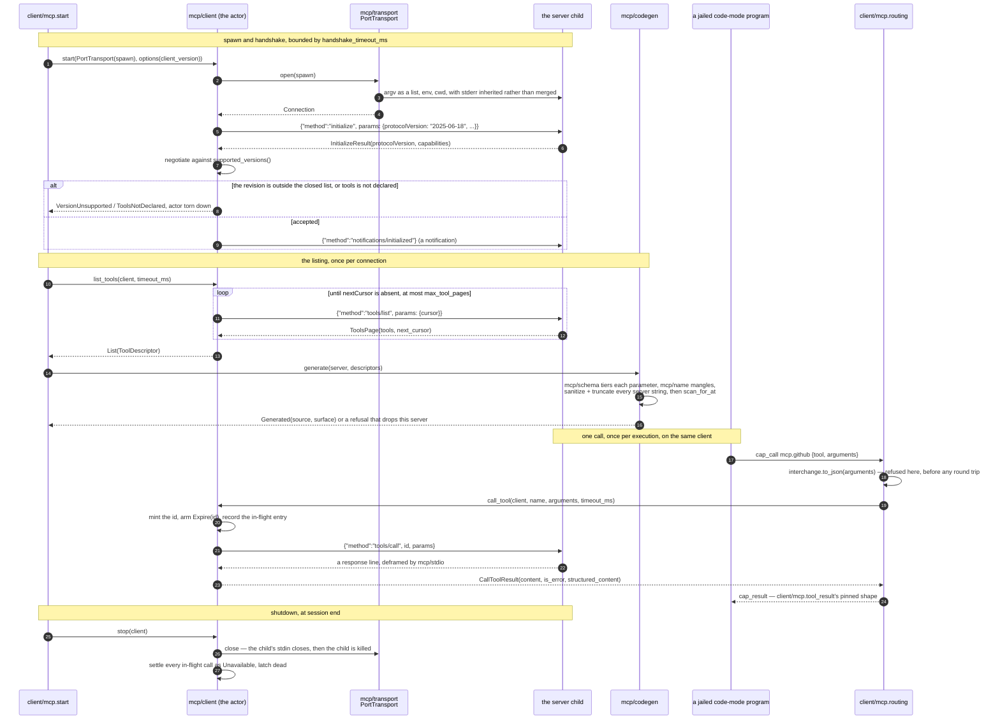

# mcp

An MCP server — Model Context Protocol — is somebody else's program,
speaking JSON-RPC 2.0 down a pipe, offering tools it would like a model
to call. This package is Loom's entire client side of that arrangement:
the protocol codecs, the actor that owns one server process, and the
generator that turns a server's tool listing into a Gleam module a
code-mode program can import. **Code mode** is what this package exists
to serve: a model writes a Gleam program, the harness vets it, compiles
it offline and runs it in a kernel jail, and one structured result comes
back. `docs/architecture/code-mode.md` is its account.

The package is phase-3 work for issue #106, and it stops at the package
boundary: reading `loom.toml`, starting a client per configured server,
and routing `mcp.<server>` capability calls are harness wiring — and that
wiring exists. `client/catalog` parses the `[mcp.<name>]` tables, and
`client/mcp` starts a client per configured server at boot, generates its
module, widens the workspace seam and answers its capability calls.
`docs/architecture/mcp.md` follows the whole path from one table to one
call.

One boundary belongs up front, because collapsing it is the commonest
misreading here. **This package generates Gleam source
text, and never compiles it.** `mcp/codegen.generate` renders a module
once per configured server at boot, in the harness VM, and the text is
held in memory from there. Compiling it happens somewhere else and later:
once per code-mode execution, inside that execution's jailed hermetic
build, and only for the servers the submitted program actually imported.
The arch doc's *Generated at boot, compiled per execution* section is the
one to read for that split, with the table and the ordering rules.

The package targets MCP revision 2025-06-18, the `initialize`-based
lifecycle, and accepts `2025-03-26` and `2024-11-05` as well. The
current revision, 2026-07-28, is stateless and has no `initialize` at
all; servers in the field speak the older lifecycle, so that is what v1
speaks.

## Where it sits

`mcp` sits on `core` and the BEAM and nothing else. One package in the
harness consumes it — `client`, in two places: `client/catalog` decodes the
`[mcp.<name>]` tables and `client/mcp` starts a client per configured
server, generates its module, widens the workspace seam and answers its
capability calls.

`mcp/interchange` hangs off nothing inside the package on purpose: it is
the translation `client/mcp` performs at the capability boundary, between
the msgpack a `cap_call` carries and the JSON a server is sent, and no
module here calls it.

## Boot side and call side

The generator runs once per server at boot and the client stays up for the
session. Those are two different paths through the same actor, and the
picture is easier to hold than the prose.

The two halves meet at one actor: `client/mcp` keeps the client it
hand-shook at boot, so the call path spawns nothing and enters no jail.

## One server, spawn to shutdown

Follow one configured server through its whole life.

Three details in that trace are load-bearing. The handshake failing tears
the actor down before `start` returns, so there is no half-started client
to reason about. `Expire(id)` is armed per call inside the actor, so a late
response for a forgotten id is dropped silently rather than answering a
caller that has moved on. And `stop` is fire-and-forget and idempotent:
calls made after it answer `Unavailable` in band, because a caller holding
a tool-call verdict must not die of a wedged client.

## MCP tools are modules, not tools

The obvious design is to register each MCP tool as a harness tool, so
`github.create_issue` appears in the model's tool list beside
`fs_read`. Loom does the opposite: a server becomes one generated Gleam
module, `cap/mcp/<server>`, and a code-mode program reaches its tools by
importing it.

Each function in that module is a **façade**: a doc comment, a typed
signature, and one call to `cap/internal/mcp.invoke`, which is where all
the marshaling lives. The generator chooses names and signatures and
nothing else, which is what keeps server-controlled text out of the code
that touches the wire.

Two things follow, and together they are the reason.

**Trust is granted per server.** Code mode's vetting lint bounds a
program's capabilities by its imports. A generic `cap/tools.invoke`
dispatcher would not falsify that theorem, but it would collapse what
the theorem discriminates: the bound becomes "the whole registry, for
every program". Allowlisting `cap/mcp/github` instead bounds the program
to the one server a human decided to trust — which is the granularity a
human actually reasons about, since nobody vets 300 tools one at a time.

**A module costs the same whatever the server's size.** The model reads
a rendered module surface — signatures and doc comments — rather than a
tool schema per tool, so a server with 300 tools costs roughly what a
server with 3 costs. That is why this package has no tool-search
machinery: code mode already solved discovery structurally, and the
remaining lever is operator-side server enablement.

## `tools/list` is attacker-controlled input

A server's listing arrives as JSON the harness did not write, and the
generator turns it into Gleam source the harness compiles and the
vetting allowlist admits. That is the sharp edge of the whole feature,
so the generator treats every string in a listing as hostile.

**Wire identity never bends.** Every generated body closes over the
original tool name and the original parameter names as escaped string
literals. `mcp/name` mangles names for the Gleam side — `createIssue`
becomes `create_issue_1a2b3c4d` — but the mangled name is a display
artifact, and renaming can never change what crosses the wire. Whenever
mangling changes anything at all, the result carries eight hex
characters of a digest of the original, so `createIssue` and
`create_issue` stay distinct rather than quietly becoming one function.
A residual collision after that is engineered rather than accidental,
and the generator refuses the whole server naming both originals instead
of repairing it.

**Server prose stays inside the comment line it was written into.**
`codegen.sanitize` replaces every control and direction-changing
codepoint with a space, and caps a tool description at 400 characters
and a parameter note at 120. Every comment line the generator emits
begins `/// `, and every line break comes from the generator's own word
wrap — never from the server's text, whose breaks the sanitizer already
flattened.

**A backstop proves the first two held.** After rendering, `scan_for_at`
walks the source and fails generation if a single `@` appears outside a
comment or a string literal. Generated code needs no attribute at all,
so a stray `@` means the sanitizer failed — and `@external` is exactly
the payload a hostile listing would want, since it is Gleam's one bridge
to arbitrary Erlang. The generator would rather refuse the server loudly
than hand the compiler an attribute.

Two ceilings and one degradation bound the rest. A listing of more than
256 tools refuses the server, and so does a rendered surface still past
64 KiB after truncation. A parameter label collision inside one tool
degrades that one function to its whole-value form and leaves the rest
of the server typed.

## Every schema settles, and no parameter is dropped

`mcp/schema` is the one place a tool's raw `inputSchema` is read, and it
never fails. It sorts each required parameter into one of three tiers.
A schema fitting the typed subset — `string`, `integer`, `number`,
`boolean`, or an array of those — becomes a typed Gleam argument. A
nested object, a `$ref`, an `anyOf`, a missing type, or a `required`
name with no `properties` entry becomes a required structured argument
carrying the reason. An unusable top level collapses the whole tool to
one argument holding the entire arguments map.

Optional parameters are never typed arguments. They travel through the
generated façade's single `options` argument, keyed by their original
wire name, and appear in the doc comment so the model knows they exist.

Measured against a plausible GitHub-shaped listing, 30 of 31 required
parameters land in tier 1. The design ruling's falsifier is written into
`codegen_test`: if mainstream servers push tier 2 past 25% of required
parameters, that is the trigger to widen the subset and generate nested
records.

## The transport is a seam, and spawning is only the primitive

`mcp/client` is written against `mcp/transport.Transport` and nothing
lower. `PortTransport` is the production mechanism — a child OS process
on an Erlang port, stdin and stdout as the wire, argv as a list so
nothing is shell-interpretable. `ChannelTransport` is the test seam: an
in-process peer that receives the connect, sees every outbound line, and
delivers inbound bytes through the same messages a port does, which is
why every client behaviour is provable without an OS process.

**Who may spawn a real server binary is decided elsewhere.** An unjailed
port spawn here is the primitive, not the final security posture; the
decision to run a server through the `loom-exec` helper inside a jail
belongs to the harness wiring that configures servers, and the seam is
what lets that land without rewriting the actor. Whether a server should
be jailed at all is an *open decision* rather than a deferred
implementation — nobody has designed it — and #109 is where the decision
goes.

The child's stderr is deliberately not merged into stdout. Merging would
interleave the server's diagnostics into the newline-delimited JSON-RPC
stream and corrupt framing, so stderr is inherited from the BEAM and the
server's complaints land on the harness's own.

## One peer, no restart, and nothing that kills a caller

The client actor owns one server for the session. A dead peer — the
process exited, a framing fault poisoned the line stream, the bytes
stopped being UTF-8 — settles every in-flight call as `Unavailable` and
latches the client dead; later calls answer `Unavailable` in band rather
than crashing anyone. Reconnection belongs to phase 5's LSP client
(#25), which needs exactly what this package already is: a supervised,
long-lived stdio peer.

Because this client declares an empty capabilities object, a
server-initiated request is answered in band with JSON-RPC's
method-not-found, and a server notification is decoded and dropped.
Every public call is a monitored send-and-select rather than
`process.call`, which panics on a timeout and on a dead callee: a caller
holding a tool-call verdict must not die of a wedged client. Each call
also carries its own deadline inside the actor, so an expired id is
forgotten and a late response for it is dropped silently.

## The modules

| Module | What it holds |
|---|---|
| `mcp/jsonrpc` | The JSON-RPC 2.0 envelope: request and notification encoders, and one total decoder for the three inbound shapes. |
| `mcp/protocol` | The five methods v1 speaks, version negotiation against a closed list, and the deliberately empty client capabilities. |
| `mcp/stdio` | Line framing both ways: a push buffer bounded at 16 MiB, and `frame` for the outbound side. |
| `mcp/transport` | The `Transport` seam, the `Spawn` spec, and `utf8_prefix`, which reassembles characters split across pipe chunks. |
| `mcp/client` | The actor: handshake, `list_tools` with bounded pagination, `call_tool`, `stop`, and the death latch. |
| `mcp/schema` | The three-tier reading of a raw `inputSchema` into a parameter plan. |
| `mcp/name` | Mangling a server-chosen name into a Gleam identifier, with the digest rule that keeps two originals distinct. |
| `mcp/codegen` | The generator: one `cap/mcp/<server>` module plus its rendered surface, and every refusal that stops one being written. |
| `mcp/interchange` | msgpack ↔ JSON between the capability wire and the MCP wire, total both ways: a msgpack integer always fits JSON, a JSON integer outside `[-2^63, 2^64 - 1]` fails the whole conversion rather than wrapping, a msgpack binary and a non-string map key are refused in an argument, and `NilValue` and `Null` are each other. |
| `mcp/internal/ffi_port` | The port externals over `mcp_ffi.erl` — this package's complete inventory of impurity. |

Paths are relative to `packages/mcp/src/` — `mcp/codegen` is
`packages/mcp/src/mcp/codegen.gleam`.

## What is deliberately absent

Resources, prompts, logging, progress, cancellation, completion, and the
2026-07-28 stateless mode are all refused for v1 rather than deferred by
accident: each is surface a hostile server could push data through, and
a tool-calling client needs none of it.

**Sampling, roots, and elicitation are absent for a stronger reason.**
Declaring `sampling` would let a server spend Loom's model; `roots`
would tell a server about the filesystem; `elicitation` would let a
server put questions to a human through the harness. The declared
capabilities object is therefore empty, and a test pins the emptiness so
that widening it is a deliberate, test-breaking act. Upstream deprecated
sampling and roots in 2026-07-28, so the refusal now has cover from the
specification itself.

`listChanged` decodes faithfully and is then ignored: this client lists
tools once per connection and subscribes to nothing. HTTP and SSE
transports are absent because a locally-spawned server speaks stdio, and
a spawned child process is what the jailing story attaches to. Restart
and reconnect supervision is absent for the reason above.

Every one of these is a filing rather than a floating obligation — #108
for HTTP and OAuth, #109 for the jail decision, #110 for an end-to-end
against a server from the wild, #111 for elicitation, #112 for
`listChanged`, #25 for restart supervision. `docs/architecture/mcp.md`
lists them together with the reversal trigger each one inherits.

## Running the tests

`make check-mcp` is the gate for this package — format check,
warning-free build, tests. `make test-mcp` runs the tests alone, and
`make lint-mcp` runs the house-rule lint over these sources.

Everything except the port-backed transport tests is deterministic and
in-process: the client suite drives the production actor against a
scripted fake server through the real `ChannelTransport` seam. The port
tests spawn `/bin/echo`, `/bin/cat` and `/bin/sh` to prove the FFI
writes, reads, delivers the exit status, and threads argv, env and the
working directory; on a host missing those binaries they print a loud
SKIP line rather than failing.

## Reading further

- [`CLAUDE.md`](CLAUDE.md) — the reference doc for changing this code:
  key types, real dependency edges, the client's traffic, and the
  invariants that break things when violated. Read it before editing.
- [`docs/architecture/mcp.md`](../../docs/architecture/mcp.md) — the
  subsystem end to end: one `[mcp.<name>]` table through boot, codegen
  and the router to one call. Go there rather than here for the three
  things this README deliberately does not restate: *Generated at boot,
  compiled per execution* (where each verb runs, and the filter and write
  between them), *A worked example: an issue triage pass* (a whole
  code-mode program over a generated `cap/mcp/github`), and the diagrams
  of boot, of one call, and of which region trusts what.
- [`docs/architecture/code-mode.md`](../../docs/architecture/code-mode.md)
  — the vetting theorem, the prelude, and what each layer confines.
- [`packages/cap/CLAUDE.md`](../cap/CLAUDE.md) — the other end of what
  this package generates for: `cap/mcp`'s result vocabulary and the
  `cap/internal/mcp.invoke` seam every generated façade calls.
- [`packages/client/CLAUDE.md`](../client/CLAUDE.md) —
  `client/protocol`, the house pattern for strict-envelope,
  tolerant-content wire codecs these decoders follow.
- [`docs/next.md`](../../docs/next.md) — the #106 design rulings, and
  what this work still owes. The hostile-`tools/list` corpus is built
  (`codegen_test`, `schema_test`); what remains is the jail decision
  (#109) and an end-to-end against a server from the wild (#110).
