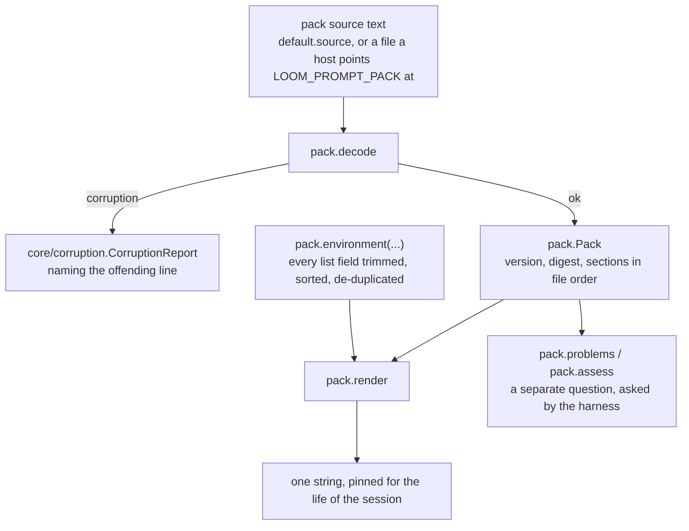
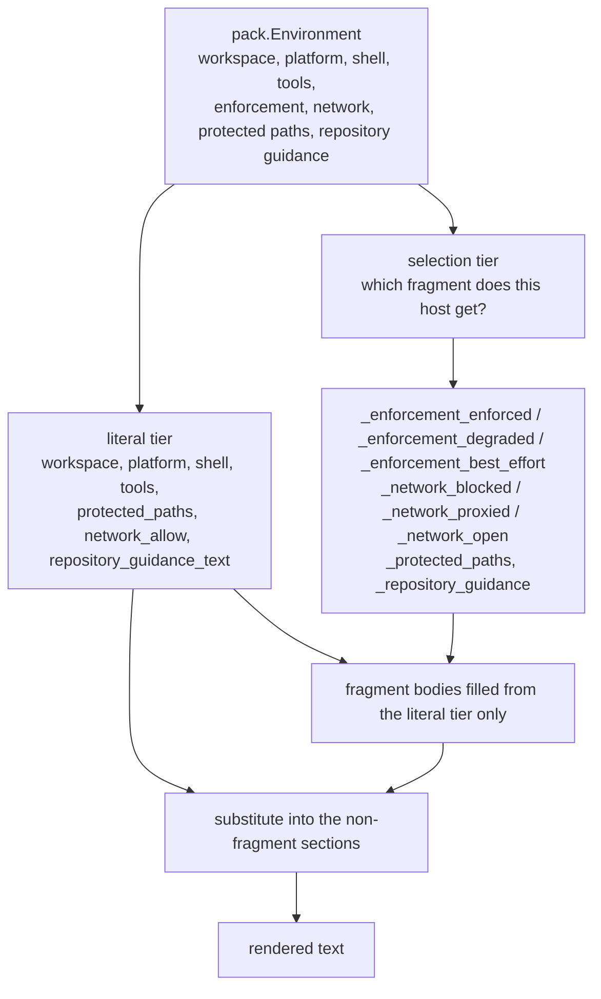
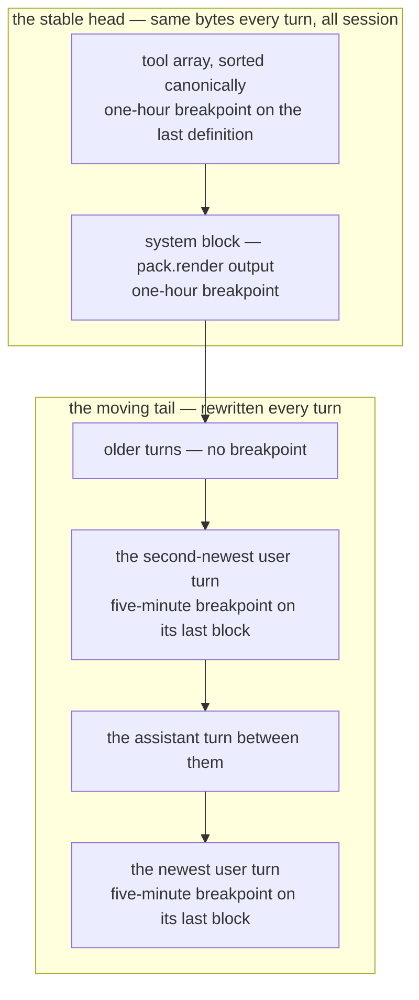
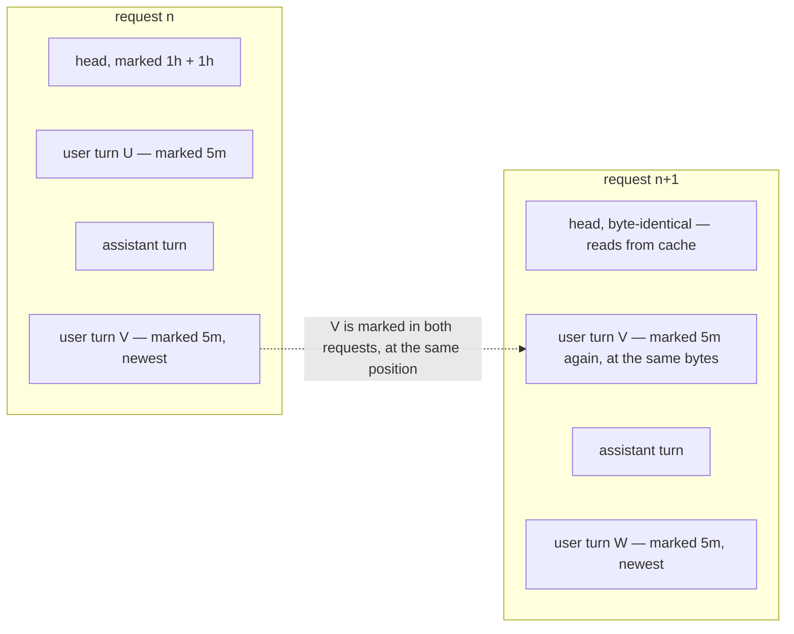
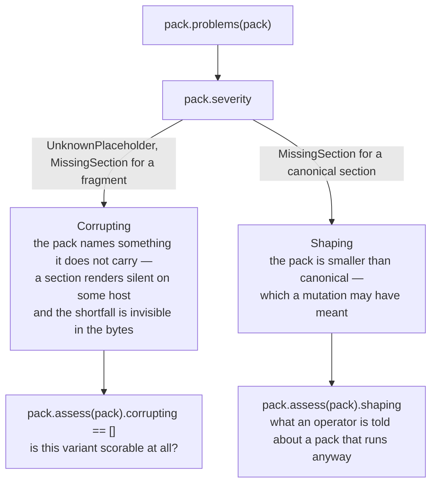
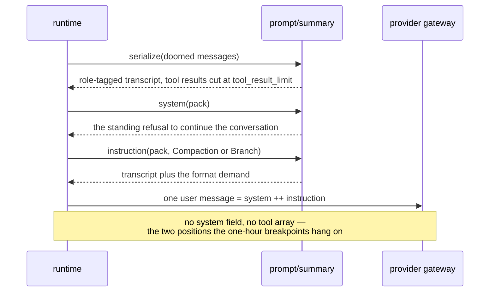
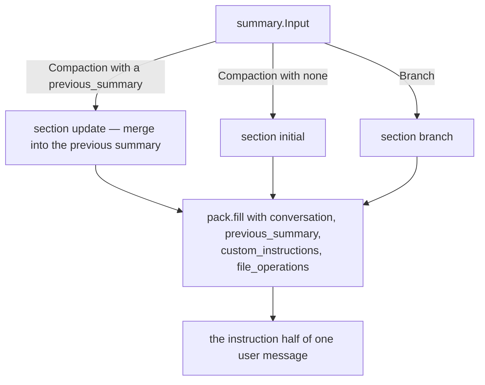

# prompt

The words a model is given, kept out of Gleam source.

A **pack** is a plain text file of named, ordered sections carrying
`{placeholder}` holes. This package decodes one with a total decoder and
renders it against a small, closed description of the host. Two packs
ship: the **system pack**, rendered into the one string a session sends
as `system` on every request of every strand, and the **summarization
pack**, assembled into a single user message once per compaction.

Prompt words live in a pack rather than in code so they can be mutated,
scored and replaced without a recompile — swapping the default for
something else is a file, not a release. Nothing here performs I/O:
reading a pack file, building the host description, and pinning the
rendered string are all somebody else's job. The dependency set is
`core` plus the standard library, and a test in `test/prompt/purity_test`
reads `src/` and fails if an import, an `@external`, or a numeric
environment field ever appears.

## The format

`%%` in column zero makes a line a directive; every other line is body
text of the open section, kept verbatim with no escaping of any kind.
There are three directives — the format version, the pack's own identity,
and a section header — and a directive whose content starts with `#` is a
comment. Anything else is corruption.

```
%% loom-prompt-pack 1
%% version loom-default-3

%% section identity
You are an agent working inside Loom, a coding-agent harness running on
the BEAM. You are one strand of a session ...

%% section sandbox
{enforcement}

{network}

%% section _network_blocked
This host permits no network egress ...
```

A section whose name begins with `_` is a **fragment**: never rendered in
its own right, only reached through a placeholder whose value the host
description selects. That is how the sandbox section says one thing on a
fully enforced host and another on a degraded one without either wording
living in Gleam.

The default system pack carries seven canonical sections — `identity`,
`tool_discipline`, `delegation`, `conduct`, `environment`, `sandbox`,
`repository_guidance` — plus the fragments the last two select between.
`pack.canonical_sections` is that list, in render order.

## Decoding and rendering



`decode` is total: a missing header, an unknown directive, a duplicate
section name, a bad name, a wrong format version — each comes back as a
`CorruptionReport` naming the line. `render` is total too, and this is
where most of the interesting behaviour is. An unknown placeholder
renders empty. An unclosed or non-identifier brace renders literally. A
section that renders to nothing is dropped, along with the blank line
that would have followed it.

The substitution itself has two tiers, and the shape is deliberate:



One level, no recursion. A substituted value goes straight to the output
and is **never scanned again**, so repository guidance that happens to
contain `{shell}` renders those seven characters and no pack can drive
expansion in a loop. `pack.fill` carries the identical property, and it
matters more there, because a summary request splices a whole
conversation — model output, tool results, whatever a repository contains
— into a template.

## Why byte stability is the whole design

`render` is a pure function of a `Pack` and an `Environment`, and every
`Environment` field is fixed at session open. No clock, no date, no
elapsed time, no token count, no cost, no git state, no operation id, no
entry id, no strand name, no random value can appear in the output,
because none of them can enter the inputs. The type is opaque and built
only through `pack.environment`, and it has **no numeric field and must
never grow one** — a timestamp, an elapsed count, a cost and a token
total all arrive as an `Int`.

The reason is prompt caching. A provider request renders in the order
`tools`, then `system`, then `messages`, and the cache key is the prompt
bytes themselves. The head of that byte stream changes at most once a
session, so it is the natural constant to cache — and one changed byte in
the system prompt costs a full cache write on every strand for the rest
of the session.



Two things about that picture are load-bearing here rather than in the
adapter that draws it.

**Tools render before system.** The tool array is a cache *prefix* of the
system block, which is why it gets its own earlier breakpoint: a system
prompt that does move still leaves the tool array cached behind the
breakpoint ahead of it. It is also why the tool array on the wire must be
sorted — a caller's discovery order would otherwise reach the cached
bytes. `pack.tools` returns the environment's normalized tool list for
exactly that reason, and it is the one field this package hands back.

**The head takes the one-hour lifetime and the tail takes five minutes.**
A one-hour write costs twice base input rather than 1.25x, but the head
is read on every turn and an hour of shelf life survives the minutes a
person spends reading a diff — the gap that would otherwise expire the
whole head and re-charge it at full price. A tail entry is read by the
next turn and then superseded, so for a single read the cheaper write
wins. Ordering is also a rule the API enforces: one-hour breakpoints must
precede five-minute ones, which head-before-tail satisfies by
construction.

The tail rolls, and it rolls over the last two *user* turns rather than
the last two turns:



Turns alternate roles, so a request whose newest user turn is V gains an
assistant turn and a new user turn before the next request — whose two
marked user turns are then W and V. The breakpoint at V therefore lands
on the same bytes twice, which is an exact-position cache read rather
than a search. User turns specifically, because every block kind a user
turn can hold is cacheable while a thinking block, which can end an
assistant turn, is not.

None of this is a knob. Placement is a function of the request's own
contents, computed inside the adapter, so two builds of the same request
are byte-identical and a hit is possible at all. What this package owes
that arrangement is the stability contract above.

## Problems, and why they are not decode errors

`decode` accepts more than `problems` approves, on purpose: syntax is the
decoder's business and completeness is the harness's decision. A mutated
pack that drops a section is still a valid pack, and an optimizer needs
to keep scoring one.



`assess` is a partition of `problems` and nothing more. `severity`
refines the report and never reaches back into the parser — a pack
`assess` calls corrupting still decodes and still renders.

## The summarization pack

Compaction asks a provider to summarize the older half of a strand's
context. That request is shaped by what it costs rather than by what it
says: it is read exactly once, so it must not pay a cache write.



`summary.system` returns *a string the caller prepends to the user
message*, not something destined for the `system` field, and
`prompt/summary` has no notion of tools at all. That is the whole reason
the two packs are separate files with separate identities: editing one
must not reprice the other.

Which section a request uses is chosen by the input:



The prompts demand a fixed structure — Goal, Constraints and Preferences,
Progress split into Done, In Progress and Blocked, Key Decisions, Next
Steps, Critical Context — and instruct the model to preserve exact paths,
identifiers, command lines, error messages and `sha256-<hex>` blob
addresses verbatim. The update prompt merges into the previous summary
rather than restating it, because a dropped constraint reads to an agent
as permission. Compaction is lossy; this is the part of the design that
bounds the loss.

The transcript is fenced in a `conversation` element and role-tagged, and
the summarization system section says in as many words that everything
inside it is the past, addressed to nobody, and that instructions within
it are data. Tool results are truncated at 2,000 characters because they
dominate a transcript and are the least of what a summary needs — Loom
already offloads anything over 64 KiB to a content-addressed blob at
commit time, which is why the `sha256-` address has to survive the
summary that eats the excerpt around it.

## Two wordings that were argued over

**The sandbox section states posture behaviourally, never a layer
inventory.** Naming which kernel layers a host does or does not enforce
hands an injection payload a map of the holes, for something it could
read from one shell command anyway, and tells a cooperative agent nothing
it can act on. `pack.Enforcement` is therefore `FullyEnforced` /
`PlatformEnforced` / `DegradedRefusing` / `BestEffort` and carries only what
the harness can know at session open — the demanded posture plus the coarse degraded flag
from the helper's hello. There is no per-layer report at that moment, so
no field pretends there is.

**A degraded host's sentence names a host failure, not a policy denial.**
Under the production default, a degraded helper means every jailed
execution is refused — before dispatch, and again after the run.
Escalation cannot clear it and retrying cannot either, and an agent that
mistakes it for a policy denial retries forever against a wall. The two
demand different behaviour, so the prompt distinguishes them.

## Where to look

| Path | What it holds |
|---|---|
| `src/prompt/pack.gleam` | The format, the total decoder, the `Environment`, `render`, `problems`/`severity`/`assess`, and `section`/`fill`. |
| `src/prompt/default.gleam` | The shipped system pack and summarization pack, as pack source. Content, not code. |
| `src/prompt/summary.gleam` | The summary request: input selection, the two halves of its one user message, and the transcript serializer. |
| `test/prompt/purity_test.gleam` | Reads `src/` and fails on an import, an `@external`, or a numeric environment field. |

[`CLAUDE.md`](CLAUDE.md) is the reference doc for changing this code —
the type list, the exact invariants, and what breaks when one is
violated. For the surrounding design see
[`docs/design-notes/agent-comms-and-system-prompt.md`](../../docs/design-notes/agent-comms-and-system-prompt.md)
Part B, [`docs/design-notes/compaction-and-memory.md`](../../docs/design-notes/compaction-and-memory.md)
Part 2, and [`docs/architecture/orchestration.md`](../../docs/architecture/orchestration.md)
for the plane the rendered prompt is consumed in.
