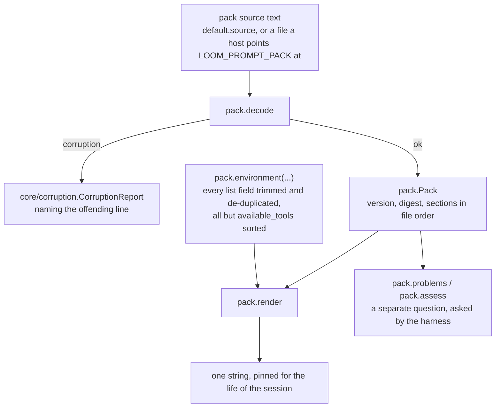
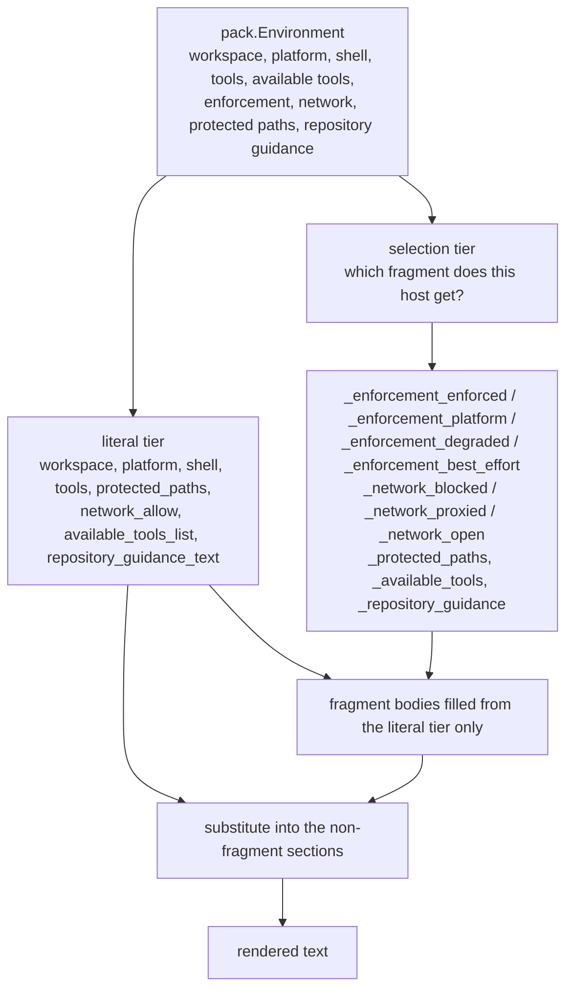
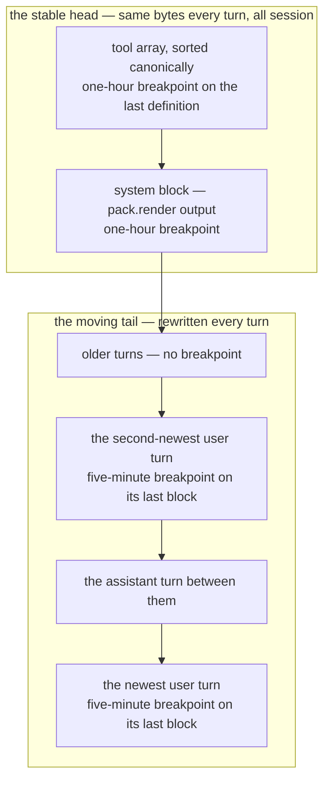
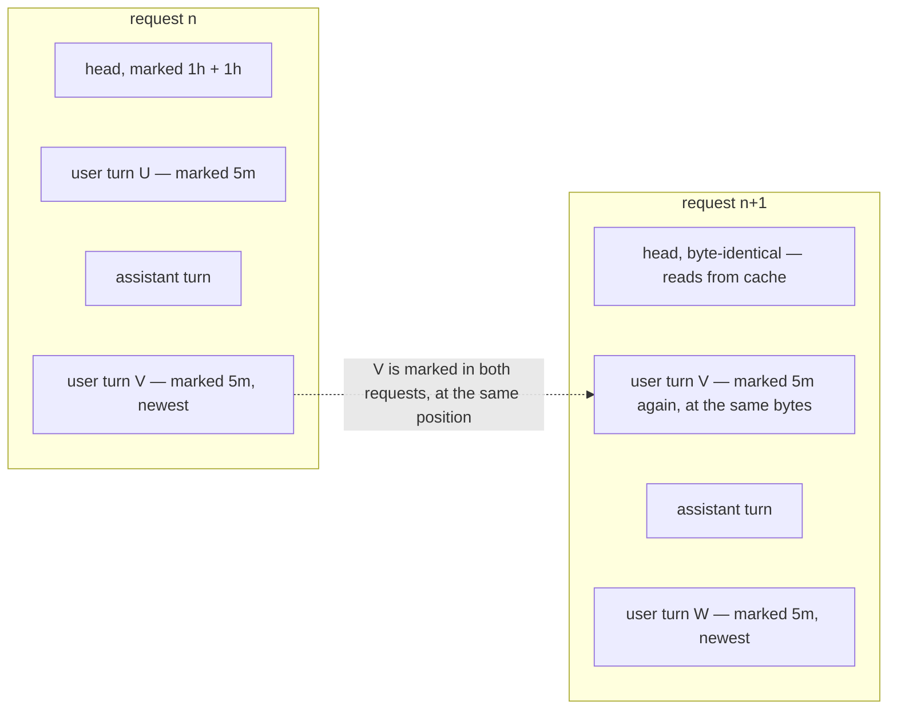
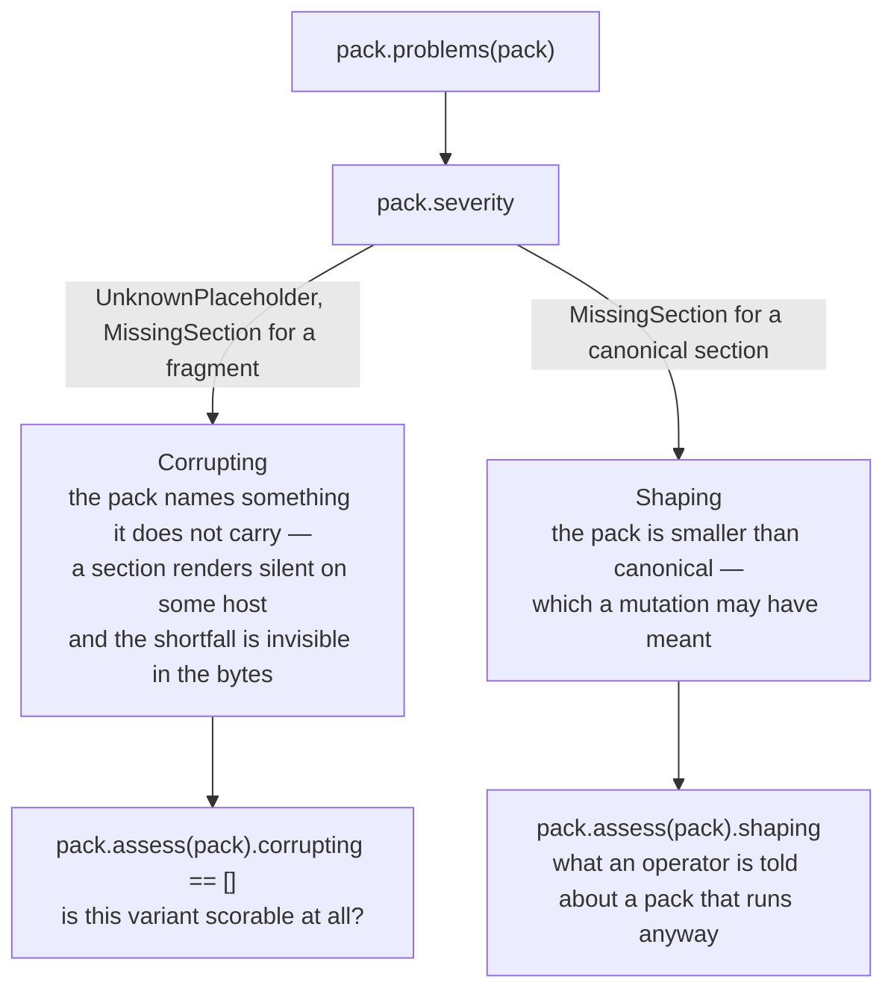

# prompt

The words a model is given, kept out of Gleam source.

A **pack** is a plain text file of named, ordered sections carrying
`{placeholder}` holes. This package decodes one with a total decoder and
renders it against a small, closed description of the host. One pack
ships: the **system pack**, rendered into the one string a session sends
as `system` on every request of every strand. (A summarization pack used
to ship beside it; compaction now carries the model's own notes across
the window boundary instead of asking a provider to summarize, so that
pack is gone.)

Prompt words live in a pack rather than in code so they can be mutated,
scored and replaced without a recompile — swapping the default for
something else is a file, not a release. Nothing here performs I/O:
reading a pack file, building the host description, and pinning the
rendered string are all somebody else's job, and the one caller that
does them is `client/system_prompt`. The dependency set is `core` plus
the standard library. `test/prompt/purity_test` reads `src/` and fails
on an import from outside `gleam/`, `core/` and `prompt/`, on a volatile
import such as `core/clock`, `core/ids` or `gleam/erlang`, on an
`@external`, or on a numeric `Environment` field.

Two rules hold that purity in place, and they overlap on purpose. The
purity test above protects byte stability, the property the rest of this
page is about. Lint rule R6 protects portability: `prompt` is one of the
four packages R6 holds to the portable subset, with `core`, `machine`
and `session_view`, so it may carry no `@external` of any target and no
`gleam_erlang` or `gleam_otp` in source or in `gleam.toml`. R6 gates
`make check` at error level. It keeps the package compilable to Gleam's
JavaScript target, which is enough to *decide but not act*: a JavaScript
host could render the same system prompt the server pins. It does not
put the harness in a browser, and no gate compiles `prompt` for
JavaScript today. The `simplifile` dev dependency is allowed, since R6
refuses only `gleam_erlang` and `gleam_otp` and `simplifile` has a
JavaScript target. `docs/gleam-style.md` Part IV §5 has the whole
argument.

## The format

`%%` in column zero makes a line a directive; every other line is body
text of the open section, kept verbatim with no escaping of any kind.
There are three directives — the format version, the pack's own identity,
and a section header — and a directive whose content starts with `#` is a
comment. Anything else is corruption.

```
%% loom-prompt-pack 1
%% version loom-default-9

%% section identity
You are an agent working inside Loom, a coding-agent harness running on
the BEAM. You are one strand of a session ...

%% section sandbox
{enforcement}

{network}

%% section _network_blocked
This host permits no network egress ...
```

A section whose name begins with `_` is a **fragment**: never rendered in
its own right, only reached through a placeholder whose value the host
description selects. That is how the sandbox section says one thing on a
fully enforced host and another on a degraded one without either wording
living in Gleam.

The default system pack carries eight canonical sections: `identity`,
`tool_discipline`, `available_tools`, `delegation`, `conduct`,
`environment`, `sandbox` and `repository_guidance`. It also carries the
ten fragments that `available_tools`, `sandbox` and `repository_guidance`
select between (`pack.required_fragments`). `pack.canonical_sections` is
the list of sections that `problems` checks a pack against; `render`
follows the pack's own file order.

## Decoding and rendering


```mermaid
flowchart TD
  SRC["pack source text<br/>default.source, or a file a host points LOOM_PROMPT_PACK at"]
  SRC --> DEC["pack.decode"]
  DEC -->|corruption| CR["core/corruption.CorruptionReport<br/>naming the offending line"]
  DEC -->|ok| PK["pack.Pack<br/>version, digest, sections in file order"]
  ENV["pack.environment(...)<br/>every list field trimmed and de-duplicated,<br/>all but available_tools sorted"]
  PK --> R["pack.render"]
  ENV --> R
  R --> OUT["one string, pinned for the life of the session"]
  PK --> PB["pack.problems / pack.assess<br/>a separate question, asked by the harness"]
```

`decode` is total: a missing header, an unknown directive, a duplicate
section name, a bad name, a wrong format version — each comes back as a
`CorruptionReport` naming the line. `render` is total too, and this is
where most of the interesting behaviour is. An unknown placeholder
renders empty. An unclosed or non-identifier brace renders literally. A
section that renders to nothing is dropped, along with the blank line
that would have followed it.

The substitution itself has two tiers, and the shape is deliberate:


```mermaid
flowchart TD
  E["pack.Environment<br/>workspace, platform, shell, tools, available tools,<br/>enforcement, network, protected paths, repository guidance"]
  E --> L["literal tier<br/>workspace, platform, shell, tools, protected_paths,<br/>network_allow, available_tools_list, repository_guidance_text"]
  E --> S["selection tier<br/>which fragment does this host get?"]
  S --> F["_enforcement_enforced / _enforcement_platform /<br/>_enforcement_degraded / _enforcement_best_effort<br/>_network_blocked / _network_proxied / _network_open<br/>_protected_paths, _available_tools, _repository_guidance"]
  L --> FF["fragment bodies filled from the literal tier only"]
  F --> FF
  L --> SUB["substitute into the non-fragment sections"]
  FF --> SUB
  SUB --> TXT["rendered text"]
```

One level, no recursion. A substituted value goes straight to the output
and is **never scanned again**, so repository guidance that happens to
contain `{shell}` renders those seven characters and no pack can drive
expansion in a loop. `pack.fill` carries the identical property, which is
what any caller splicing model output or tool results into a template
would depend on.

## Why byte stability is the whole design

`render` is a pure function of a `Pack` and an `Environment`, and every
`Environment` field is fixed at session open. No clock, no date, no
elapsed time, no token count, no cost, no git state, no operation id, no
entry id, no strand name, no random value can appear in the output,
because none of them can enter the inputs. The type is opaque and built
only through `pack.environment`, and it has **no numeric field and must
never grow one** — a timestamp, an elapsed count, a cost and a token
total all arrive as an `Int`.

The reason is prompt caching. A provider request renders in the order
`tools`, then `system`, then `messages`, and the cache key is the prompt
bytes themselves. The head of that byte stream changes at most once a
session, so it is the natural constant to cache — and one changed byte in
the system prompt costs a full cache write on every strand for the rest
of the session.


```mermaid
flowchart TD
  subgraph HEAD["the stable head — same bytes every turn, all session"]
    T["tool array, sorted canonically<br/>one-hour breakpoint on the last definition"]
    S["system block — pack.render output<br/>one-hour breakpoint"]
  end
  subgraph TAIL["the moving tail — rewritten every turn"]
    M["older turns — no breakpoint"]
    U1["the second-newest user turn<br/>five-minute breakpoint on its last block"]
    A["the assistant turn between them"]
    U2["the newest user turn<br/>five-minute breakpoint on its last block"]
  end
  T --> S --> M --> U1 --> A --> U2
```

Two things about that picture are load-bearing here rather than in the
adapter that draws it.

**Tools render before system.** The tool array is a cache *prefix* of the
system block, which is why it gets its own earlier breakpoint: a system
prompt that does move still leaves the tool array cached behind the
breakpoint ahead of it. It is also why the tool array on the wire must be
sorted — a caller's discovery order would otherwise reach the cached
bytes. `pack.tools` returns the environment's sorted tool list for
exactly that reason. (`pack.available_tools` is the only other field read
back, and it keeps the host's registration order, because it is prose
for a reader rather than a cache key.)

**The head takes the one-hour lifetime and the tail takes five minutes.**
A one-hour write costs twice base input rather than 1.25x, but the head
is read on every turn and an hour of shelf life survives the minutes a
person spends reading a diff — the gap that would otherwise expire the
whole head and re-charge it at full price. A tail entry is read by the
next turn and then superseded, so for a single read the cheaper write
wins. Ordering is also a rule the API enforces: one-hour breakpoints must
precede five-minute ones, which head-before-tail satisfies by
construction.

The tail rolls, and it rolls over the last two *user* turns rather than
the last two turns:


```mermaid
flowchart LR
  subgraph N["request n"]
    direction TB
    n0["head, marked 1h + 1h"]
    n1["user turn U — marked 5m"]
    n2["assistant turn"]
    n3["user turn V — marked 5m, newest"]
  end
  subgraph N2["request n+1"]
    direction TB
    m0["head, byte-identical — reads from cache"]
    m1["user turn V — marked 5m again, at the same bytes"]
    m2["assistant turn"]
    m3["user turn W — marked 5m, newest"]
  end
  n3 -.->|"V is marked in both requests, at the same position"| m1
```

Turns alternate roles, so a request whose newest user turn is V gains an
assistant turn and a new user turn before the next request — whose two
marked user turns are then W and V. The breakpoint at V therefore lands
on the same bytes twice, which is an exact-position cache read rather
than a search. User turns specifically, because every block kind a user
turn can hold is cacheable while a thinking block, which can end an
assistant turn, is not.

None of this is a knob. Placement is a function of the request's own
contents, computed inside the Anthropic adapter
(`provider/adapter/anthropic`), so two builds of the same request
are byte-identical and a hit is possible at all. What this package owes
that arrangement is the stability contract above.

## Problems, and why they are not decode errors

`decode` accepts more than `problems` approves, on purpose: syntax is the
decoder's business and completeness is the harness's decision. A mutated
pack that drops a section is still a valid pack, and an optimizer needs
to keep scoring one.


```mermaid
flowchart TD
  P["pack.problems(pack)"] --> SEV["pack.severity"]
  SEV -->|"UnknownPlaceholder, MissingSection for a fragment"| C["Corrupting<br/>the pack names something it does not carry —<br/>a section renders silent on some host<br/>and the shortfall is invisible in the bytes"]
  SEV -->|"MissingSection for a canonical section"| SH["Shaping<br/>the pack is smaller than canonical —<br/>which a mutation may have meant"]
  C --> A["pack.assess(pack).corrupting == []<br/>is this variant scorable at all?"]
  SH --> A2["pack.assess(pack).shaping<br/>what an operator is told about a pack that runs anyway"]
```

`assess` is a partition of `problems` and nothing more. `severity`
refines the report and never reaches back into the parser — a pack
`assess` calls corrupting still decodes and still renders.

## Two wordings that were argued over

**The sandbox section states posture behaviourally, never a layer
inventory.** Naming which kernel layers a host does or does not enforce
hands an injection payload a map of the holes, for something it could
read from one shell command anyway, and tells a cooperative agent nothing
it can act on. `pack.Enforcement` is therefore `FullyEnforced` /
`PlatformEnforced` / `DegradedRefusing` / `BestEffort` and carries only what
the harness can know at session open — the demanded posture plus the coarse degraded flag
from the helper's hello. There is no per-layer report at that moment, so
no field pretends there is.

**A degraded host's sentence names a host failure, not a policy denial.**
Under the production default, a degraded helper means every jailed
execution is refused — before dispatch, and again after the run.
Escalation cannot clear it and retrying cannot either, and an agent that
mistakes it for a policy denial retries forever against a wall. The two
demand different behaviour, so the prompt distinguishes them.

## Selected model profiles

Governed model profiles add prose to the stable base prompt. The native host
in `client/evolution` captures and admits their exact provider, model and API
identity. A new session pins the selected profile map; an existing or resumed
session retains its pinned bytes.

`provider/profile` composes that map only after each attempt's actual target
is resolved. Every retry starts from the unchanged base request. Reading,
approval and profile selection remain outside this pure package. See
[the evolution architecture](../../docs/architecture/evolution.md) for the
selection boundary and independent evaluation workflow.

## Where to look

The package is two modules.

| Path | What it holds |
|---|---|
| `src/prompt/pack.gleam` | The format, the total decoder and `encode`, the opaque `Environment`, `render`, `problems`/`severity`/`assess`, and `section`/`fill`. |
| `src/prompt/default.gleam` | `default.source`, the shipped system pack as pack source. Content, not code. |

## Tests

`make check-prompt` is the package gate: `gleam format --check`, a
warning-free build, and the EUnit suite through `scripts/test.sh`.
`make test-prompt` runs the tests alone, and `make lint-prompt` runs the
house lint, R6 included, over the package.

- `pack_test` covers the format: decoding, each refusal, `encode`, and
  the pieces `render` builds on.
- `render_test` covers substitution, fragment selection, the
  repository-guidance frame, and the byte-stability contract.
- `default_test` checks the shipped pack as content. It decodes with no
  `problems`, carries the canonical sections in design order, keeps its
  build-constant sections free of placeholders, states the sandbox
  posture behaviourally on every host, and has the delegation section
  state the facts about the `agent_*` tools that their schemas cannot
  carry.
- `purity_test` reads this package's own `src/` and fails on a forbidden
  import, an `@external`, or a numeric `Environment` field. It is the
  one test here that touches the filesystem, which is why `simplifile`
  is a dev dependency.

## Reading further

- [`CLAUDE.md`](CLAUDE.md) is the reference doc for changing this code:
  the type list, the exact invariants, and what breaks when one is
  violated.
- [`docs/architecture/prompt.md`](../../docs/architecture/prompt.md)
  describes how a request's prompt is assembled from this pack, project
  instructions, the tool array and skills, and what must stay stable for
  caching.
- [`docs/design-notes/agent-comms-and-system-prompt.md`](../../docs/design-notes/agent-comms-and-system-prompt.md)
  Part B is the design this package implements.
- [`docs/review/m5-agent-comms-judgment.md`](../../docs/review/m5-agent-comms-judgment.md)
  is the review whose judgment the sandbox wording follows.
- [`docs/architecture/compaction.md`](../../docs/architecture/compaction.md)
  and [`docs/design-notes/compaction-and-memory.md`](../../docs/design-notes/compaction-and-memory.md)
  Part 2 explain the notes-based checkpoint that replaced the
  summarization pack.
- [`docs/gleam-style.md`](../../docs/gleam-style.md) Part IV §5 and
  [`packages/lint/src/lint/portable.gleam`](../lint/src/lint/portable.gleam)
  state the portable-subset rule R6 enforces here.
