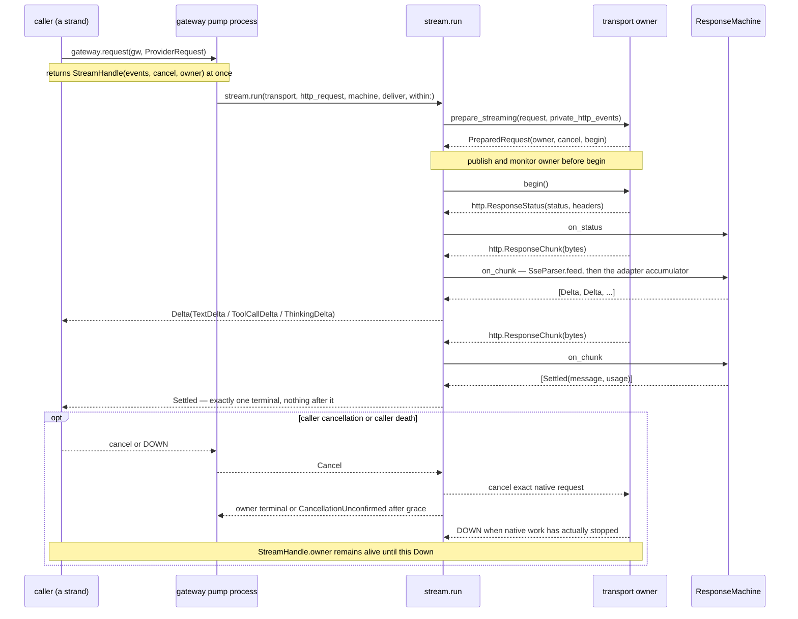
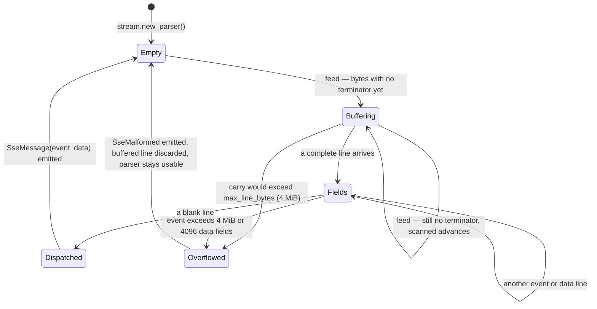
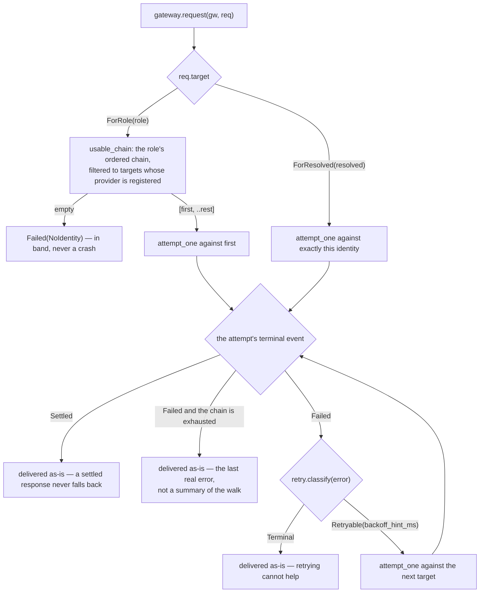
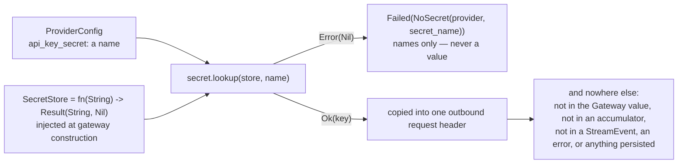

# provider

The model gateway: everything between "the strand wants an assistant
turn" and "a settled message and a usage row exist".

It is a typed registry of provider configurations and role routes, a pure
incremental parser for the server-sent-events framing every provider
streams over, two wire adapters, retry and overflow classification, and
one narrow seam through which an API key reaches an outbound header and
nowhere else. Everything above the raw HTTP chunk stream is pure Gleam —
the sans-io pattern — so the interesting parts are property-testable
without a socket or a process.

Three things are injected at construction and nothing else touches the
world: an HTTP transport, a secret store, and a clock. `provider/http`
ships `httpc_transport()` for production; the two FFI modules that drive
OTP's `httpc` in asynchronous streaming mode and read an environment
variable are the package's complete inventory of impurity.

## One request, arriving in parts

`gateway.request` returns immediately. The work happens on a pump process
it spawns, and the returned `StreamHandle` carries an event subject, an
idempotent cancellation capability, and the PID whose exit proves that the
whole request subtree has drained.

The contract the rest of the harness leans on is narrow enough to depend
on: **zero or more `Delta` events, then exactly one `Settled` or
`Failed`, and nothing after.** The tracked request runner enforces the at-most-once
delivery itself, dropping anything a machine emits past the first
terminal, so an adapter bug cannot double-settle. Deltas are ephemeral
display data and prove nothing about settlement — the settled message is
always the authority, and `stream.await_terminal` is the convenience that
collects both.

Cancellation uses the same single owner as settlement and fallback. The pump
monitors its direct consumer; the tracked runner monitors the active transport
owner; every fallback attempt has a fresh private HTTP subject. When cancel,
consumer death, or timeout wins, the transport cancellation capability runs
before the terminal-acknowledgement grace. Expiry reports
`CancellationUnconfirmed`; it does not kill the owner or claim native work is
gone. The public custodian remains alive until every adopted owner exits.
Production retains the exact OTP request id and calls
`httpc_handler:cancel/2` on its dedicated handler, then waits for that handler's
`Down`, so teardown stops external work instead of only dropping its late
answer. The public `httpc:cancel_request/1` route is only a conservative
fallback while handler identity is still being recovered. A deadline-bounded
global handler scan survives manager or handler-supervisor replacement and
cannot pin the native owner's cancellation mailbox on one connecting handler.
Both cancellation terminals stop the fallback walk.

The attempt timeout is one absolute deadline from transport start through
settlement, not an idle timeout refreshed by each chunk. A provider therefore
cannot keep an attempt, its monitors, and its billing path alive forever by
emitting deltas without a terminal event.

`ResponseMachine` is the seam each adapter fills: `init`, `on_status`,
`on_chunk`, `on_end`, `on_failure`, all pure. A body that ends without
ever settling is itself a disconnection, not a silent success, so
`run_loop` turns it into `Failed(StreamDisconnected)` rather than
returning nothing.

### The parser underneath

The framing parser is a fold — bytes in, events out, carry state threaded
— so feeding the same byte stream in any chunking yields the same events.
Chunk boundaries split lines and even split UTF-8 codepoints, which is
what the carry buffer is for.

Two properties are worth stating because they are defences, not
optimizations. The carry buffer never exceeds `max_line_bytes`, so a
hostile or broken proxy streaming a line that never terminates fails the
stream in band as a framing defect rather than exhausting memory. One event
is independently bounded to 4 MiB and 4096 `data:` fields, because empty fields
consume list cells without consuming payload bytes. The whole successful HTTP
response is capped at 16 MiB below the asynchronous event mailbox, so a peer
cannot queue past the budget or evade the per-event limits with an endless
sequence of small valid events. Complete events are accumulated in reverse and
restored once, keeping the fold linear. And every byte is scanned exactly once
— `feed` resumes past the prefix an
earlier feed already ruled out as terminator-free — so the same proxy
cannot drive quadratic re-scanning either.

Decoding posture here is deliberately asymmetric to the rest of Loom. A
`data:` payload must parse as JSON, and malformed data fails the stream
in band. But *fields* are read leniently: absent usage counters read as
zero, and unknown event and delta types are ignored, which is what
provider versioning policies prescribe. The total-decoder doctrine
governs boundaries Loom owns; strict decoding of a foreign vocabulary
breaks against real proxies and gains nothing. Counters are clamped into
`[0, 1e12]` at the read, so no number an untrusted proxy reports can
reach a settled message the durable planes cannot encode — saturation is
itself the record of the lie, and counters steer accounting and overflow
classification only, never a security decision.

## Routing: roles, chains, and when the walk happens

Durable state stores an identity — `{provider, model_id}` — not a role,
because re-dispatching a committed intent must reach the same model it
named. The two `RequestTarget` constructors are what make both directions
work.

`resolve(gw, role)` answers the same question without dispatching: the
first target in the role's chain whose provider is registered, which is
the identity the runtime commits before the effect window opens. Then
`request` resolves again at dispatch and walks — but **`ForResolved`
never walks at all**, which is exactly what recovery needs. A rate limit
must not turn a re-dispatched, already-committed intent into a request
against a different model.

Classification is where retry and overflow meet, and the order matters
more than either rule. An oversized request must *compact*, not retry
unchanged, so the state machine checks overflow before retryable error —
which is why the overflow patterns live beside the retry classifier here.
`retry.classify` calls transport failures, disconnects, 408/429/5xx, and
the transient-load error types retryable; every other 4xx, unmapped stop
reasons, malformed streams, and configuration errors terminal. An error
whose message matches the overflow patterns is *always* terminal, so a
context-limit failure dressed as a retryable status still reaches the
overflow path.

The adapter computes overflow itself, and the definition is written down
rather than implied: when reported input plus cache-read plus cache-write
tokens exceed the resolved model's context window and the output is
negligible — at most 64 tokens, so a real answer that merely tripped a
counter is never discarded — the response settles with stop reason
`error` carrying the canonical overflow message, raw stop reason
preserved.

Stop reasons map **totally**. Each adapter maps the vocabulary it knows
and answers `Error(Nil)` for anything else, which surfaces as
`Failed(UnmappedStopReason(raw))` in band. A provider that ships a new
stop reason tomorrow degrades to a readable error, never a crash.

## Secrets

Provider configuration holds a secret *name*, never a value.

**Secrets exist only in provider request memory.** The lookup has exactly
one call site — gateway dispatch — and the value goes straight into the
header of the request being built. A remote endpoint necessarily sees that
header and may reflect it, so the gateway removes the exact key from every
delta, settled assistant field, nested JSON value, and error before it can be
displayed, retried, or persisted. Diagnostic strings are byte-bounded in the
same pass. The checks cover both error and successful-response reflection.

Be honest about what ships: **`secret.env()` is the only real backend
today**, reading process environment variables. `from_list` is for tests
and `from_function` is arbitrary injection. The planned OS keychain
backends are follow-up FFI shims that slot into the same
`fn(name) -> Result(String, Nil)` seam without changing a single caller —
which is the whole reason the seam is a function type rather than a
module.

The same invariant reaches logs, but it is enforced one package over:
every field a telemetry record carries passes through
`telemetry/field.scrub`, which redacts by key name and by token shape.
See [`docs/architecture/effects.md`](../../docs/architecture/effects.md)
for that end of it.

## The two dialects

Two adapters live under `src/provider/adapter/`, one per wire dialect,
each supplying request construction, a response accumulator, a total
stop-reason mapping, and its own caching posture. Their `api_name`
constants are what durable state records.

The first is block-structured and streams named events. Its requests
carry four prompt-cache breakpoints, placed deterministically from the
request's own contents: two one-hour on the tool array and the system
block, two five-minute on the last block of each of the final two *user*
turns. Placement is adapter-local on purpose — **no caching knob crosses
the package boundary** — because two builds of the same `ProviderRequest`
must be byte-identical for a cache hit to be possible at all. That is
also why the system prompt goes out as a one-element block array rather
than a bare string: the string form renders identically but has nowhere
to hang a breakpoint. The arithmetic behind the four positions, and what
each one is paying for, is in
[`packages/prompt/README.md`](../prompt/README.md).

The second dialect **declares no breakpoints on purpose.** Its caching is
automatic and prefix-matched server-side, so the adapter owes it only a
stable prefix — system message first, fixed field order — and nothing
else. Its optional routing hint is not sent, because it needs a stable
session identifier no `ProviderRequest` field supplies.

One consequence is worth stating plainly: a rewritten prefix is a cost,
never a correctness problem. The cache key is the prompt bytes, so a
precise rewrite or a compaction cannot serve stale content. Breakpoints
at or after the changed position simply miss and are written again.
Nothing invalidates anything.

## Where to look

| Path | What it holds |
|---|---|
| `src/provider/gateway.gleam` | The registry and builder, `resolve`, `request`, the cancellable pump owner, and the fallback walk. |
| `src/provider/stream.gleam` | `StreamHandle`, `StreamEvent`, cancellation arbitration, the pure parser, `ResponseMachine`, and `run`. |
| `src/provider/model.gleam` | `Role`, `ResolvedModel`, `RequestTarget`, `ProviderRequest`, `ToolSpec` — the durable identity and the static model facts an adapter needs. |
| `src/provider/adapter/` | The two wire adapters: request construction, accumulation, stop-reason mapping, overflow, cache breakpoints. |
| `src/provider/retry.gleam` | `classify`, `backoff_ms`, and the overflow message patterns. |
| `src/provider/secret.gleam` | The lookup seam and its backends. |
| `src/provider/http.gleam` | The injected `RunningRequest` transport contract and `httpc_transport()`. |

[`CLAUDE.md`](CLAUDE.md) is the reference doc for changing this code. For
the plane this package sits in — the one door, the wire, the jail — read
[`docs/architecture/effects.md`](../../docs/architecture/effects.md);
"From WP-F" in [`docs/spec-gaps.md`](../../docs/spec-gaps.md) records
where the implementation refined the spec, including the quantified
"negligible output" and the deferred keychain backends.
