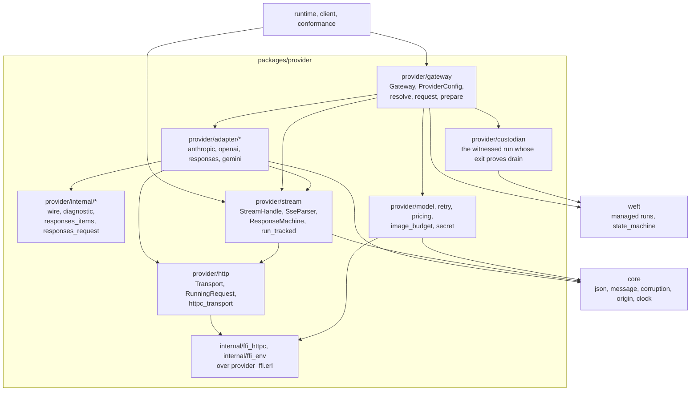
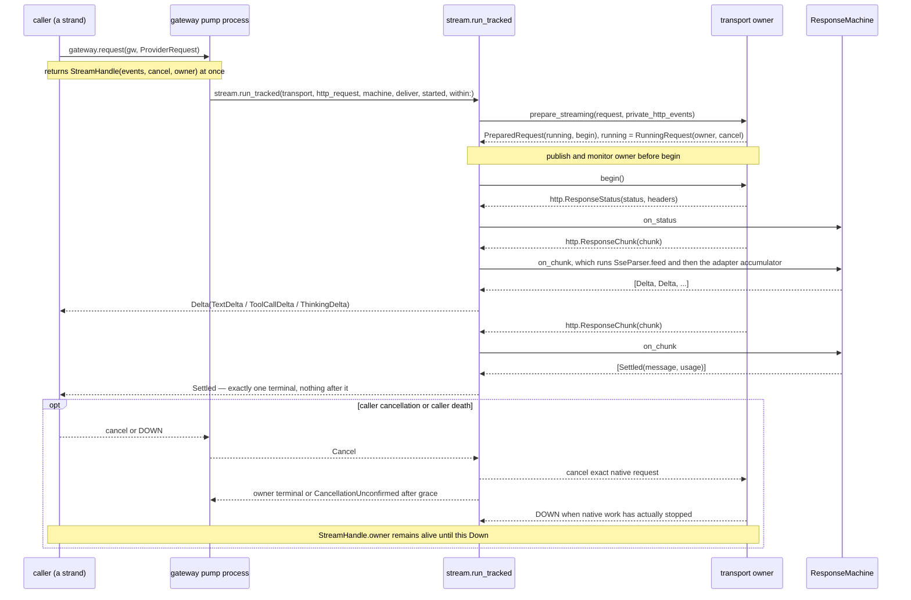
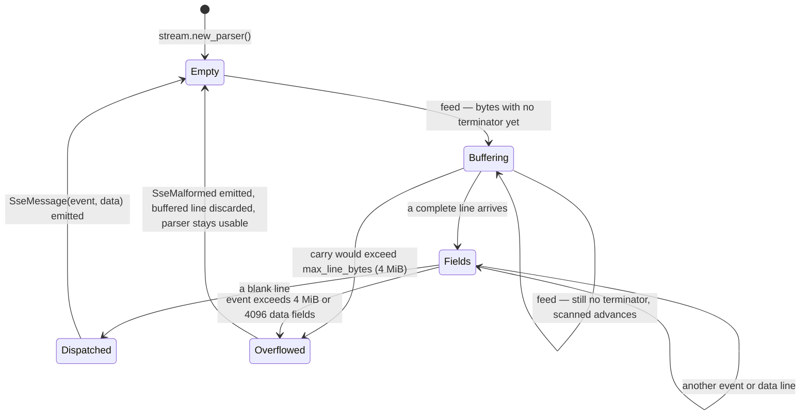
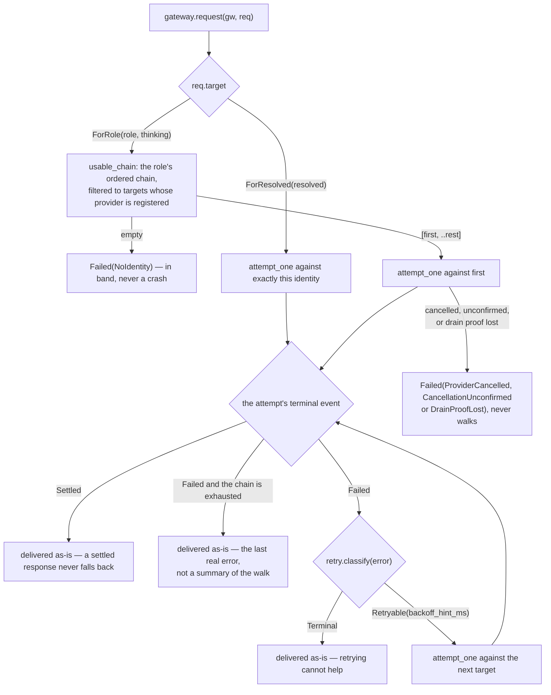
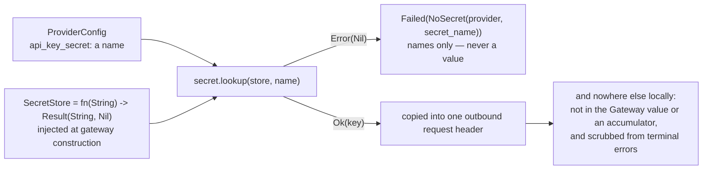

# provider

The model gateway: everything between "the strand wants an assistant
turn" and "a settled message and a usage row exist".

It is a typed registry of provider configurations and role routes, a pure
incremental parser for the server-sent-events framing every provider
streams over, four wire adapters, retry and overflow classification, the
image budget and pricing steps every attempt passes through, and one
narrow seam through which an API key reaches an outbound header and
nowhere else. Everything above the raw HTTP chunk stream is pure Gleam —
the sans-io pattern — so the interesting parts are property-testable
without a socket or a process.

It is a separate package because it is the one place Loom decodes a
vendor's wire format and holds a credential. Four vendors' request shapes,
stream events, stop reasons and error bodies are translated here into
`core`'s message types, so no package above this one parses provider JSON,
and an API key never leaves the request this package builds. Callers see
one contract, the `StreamHandle` of spec Part 1 §1.5: `runtime` consumes it
through its effect surface, and `client` builds the gateway from the
operator's model catalogue.

Three things are injected at construction and nothing else touches the
world: an HTTP transport, a secret store, and a clock. `provider/http`
ships `httpc_transport()` for production; the two FFI modules that drive
OTP's `httpc` in asynchronous streaming mode and read an environment
variable are the package's complete inventory of impurity.

## Where it sits

`provider` depends on `core`, `gleam_erlang` and `weft`, and nothing else
(`gleam.toml`). `runtime`, `client` and `conformance` depend on it. Inside
the package, `provider/gateway` is the only module that imports the
adapters, so the gateway alone chooses a dialect for a configured
endpoint.

```mermaid
graph TD
  subgraph pkg["packages/provider"]
    GW["provider/gateway<br/>Gateway, ProviderConfig,<br/>resolve, request, prepare"]
    CU["provider/custodian<br/>the witnessed run whose exit proves drain"]
    AD["provider/adapter/*<br/>anthropic, openai, responses, gemini"]
    IN["provider/internal/*<br/>wire, diagnostic,<br/>responses_items, responses_request"]
    ST["provider/stream<br/>StreamHandle, SseParser,<br/>ResponseMachine, run_tracked"]
    HT["provider/http<br/>Transport, RunningRequest,<br/>httpc_transport"]
    SMALL["provider/model, retry, pricing,<br/>image_budget, secret"]
    FFI["internal/ffi_httpc, internal/ffi_env<br/>over provider_ffi.erl"]
  end

  CORE["core<br/>json, message, corruption, origin, clock"]
  WEFT["weft<br/>managed runs, state_machine"]
  UP["runtime, client, conformance"]

  UP --> GW
  UP --> ST
  GW --> AD
  GW --> CU
  GW --> ST
  GW --> SMALL
  AD --> IN
  AD --> ST
  AD --> HT
  ST --> HT
  HT --> FFI
  SMALL --> FFI
  GW --> WEFT
  CU --> WEFT
  AD --> CORE
  ST --> CORE
  SMALL --> CORE
```

The `SMALL --> FFI` edge is `provider/secret`, whose `env()` backend reads
the process environment through `internal/ffi_env`.

## One request, arriving in parts

`gateway.request` returns immediately. The work happens on a pump process
it spawns, and the returned `StreamHandle` carries an event subject, an
idempotent cancellation capability, and the PID whose exit proves that the
whole request subtree has drained.

```mermaid
sequenceDiagram
  participant C as caller (a strand)
  participant G as gateway pump process
  participant R as stream.run_tracked
  participant T as transport owner
  participant M as ResponseMachine

  C->>G: gateway.request(gw, ProviderRequest)
  Note over C,G: returns StreamHandle(events, cancel, owner) at once
  G->>R: stream.run_tracked(transport, http_request, machine, deliver, started, within:)
  R->>T: prepare_streaming(request, private_http_events)
  T-->>R: PreparedRequest(running, begin), running = RunningRequest(owner, cancel)
  Note over R,T: publish and monitor owner before begin
  R->>T: begin()
  T-->>R: http.ResponseStatus(status, headers)
  R->>M: on_status
  T-->>R: http.ResponseChunk(chunk)
  R->>M: on_chunk, which runs SseParser.feed and then the adapter accumulator
  M-->>R: [Delta, Delta, ...]
  R-->>C: Delta(TextDelta / ToolCallDelta / ThinkingDelta)
  T-->>R: http.ResponseChunk(chunk)
  R->>M: on_chunk
  M-->>R: [Settled(message, usage)]
  R-->>C: Settled — exactly one terminal, nothing after it
  opt caller cancellation or caller death
    C-->>G: cancel or DOWN
    G-->>R: Cancel
    R-->>T: cancel exact native request
    R-->>G: owner terminal or CancellationUnconfirmed after grace
    T-->>R: DOWN when native work has actually stopped
    Note over C,T: StreamHandle.owner remains alive until this Down
  end
```

The participant `G` stands for three processes that `gateway.prepare`
starts: a `provider/custodian` run, a guard written as a
`weft/state_machine` over `gateway.Phase`, and a private pump that walks
the fallback chain. `run_tracked`'s `started`
callback is how the pump publishes each transport owner to the guard
before `begin` is granted. `CLAUDE.md` "Traffic" names every guard state.

The contract the rest of the harness leans on is narrow enough to depend
on: **zero or more `Delta` events, then exactly one `Settled` or
`Failed`, and nothing after.** `stream.run_tracked` enforces the at-most-once
delivery itself, dropping anything a machine emits past the first
terminal, so an adapter bug cannot double-settle. Deltas are ephemeral
display data and prove nothing about settlement — the settled message is
always the authority, and `stream.await_terminal` is the convenience that
collects both.

Cancellation uses the same single owner as settlement and fallback. The pump
monitors its direct consumer; `stream.run_tracked` monitors the active transport
owner; every fallback attempt has a fresh private HTTP subject. When cancel,
consumer death, or timeout wins, the transport cancellation capability runs
before the terminal-acknowledgement grace. Expiry reports
`CancellationUnconfirmed`; it does not kill the owner or claim native work is
gone. The public custodian remains alive until every adopted owner exits.
Production retains the exact OTP request id and calls
`httpc_handler:cancel/2` on its dedicated handler, then waits for that handler's
`Down`, so teardown stops external work instead of only dropping its late
answer. The public `httpc:cancel_request/1` route is only a conservative
fallback while handler identity is still being recovered. A deadline-bounded
global handler scan survives manager or handler-supervisor replacement and
cannot pin the native owner's cancellation mailbox on one connecting handler.
Both cancellation terminals stop the fallback walk.

The attempt timeout is one absolute deadline from transport start through
settlement, not an idle timeout refreshed by each chunk. A provider therefore
cannot keep an attempt, its monitors, and its billing path alive forever by
emitting deltas without a terminal event.

`ResponseMachine` is the seam each adapter fills: `init`, `on_status`,
`on_chunk`, `on_end`, `on_failure`, all pure. A body that ends without
ever settling is itself a disconnection, not a silent success, so
`run_loop` turns it into `Failed(StreamDisconnected)` rather than
returning nothing.

### The parser underneath

The framing parser is a fold — bytes in, events out, carry state threaded
— so feeding the same byte stream in any chunking yields the same events.
Chunk boundaries split lines and even split UTF-8 codepoints, which is
what the carry buffer is for. `SseParser` is one opaque record, so the
states below are conditions on its fields (`carry`, `scanned`,
`data_lines`) rather than constructors; the emitted values are the two
`SseEvent` constructors, `SseMessage` and `SseMalformed`.

```mermaid
stateDiagram-v2
  [*] --> Empty: stream.new_parser()
  Empty --> Buffering: feed — bytes with no terminator yet
  Buffering --> Buffering: feed — still no terminator, scanned advances
  Buffering --> Fields: a complete line arrives
  Fields --> Fields: another event or data line
  Fields --> Dispatched: a blank line
  Dispatched --> Empty: SseMessage(event, data) emitted
  Buffering --> Overflowed: carry would exceed max_line_bytes (4 MiB)
  Fields --> Overflowed: event exceeds 4 MiB or 4096 data fields
  Overflowed --> Empty: SseMalformed emitted, buffered line discarded, parser stays usable
```

Two properties are worth stating because they are defences, not
optimizations. The carry buffer never exceeds `max_line_bytes`, so a
hostile or broken proxy streaming a line that never terminates fails the
stream in band as a framing defect rather than exhausting memory. One event
is independently bounded to 4 MiB and 4096 `data:` fields, because empty fields
consume list cells without consuming payload bytes. The whole successful HTTP
response is capped at 16 MiB after transport delivery, so a peer cannot evade
the per-event limits with an endless sequence of small valid events. Complete
events accumulate in reverse and are restored once, keeping the fold linear.
Every byte is scanned exactly once — `feed` resumes past the prefix an
earlier feed already ruled out as terminator-free — so the same proxy
cannot drive quadratic re-scanning either. OTP `httpc` buffers non-200/206
bodies before delivery, so this typed cap does not claim to bound native error-
body memory; replacing or isolating that transport is separate hardening work.
Issue #147 owns that transport boundary.

Decoding posture here is deliberately asymmetric to the rest of Loom. A
`data:` payload must parse as JSON, and malformed data fails the stream
in band. But *fields* are read leniently: absent usage counters read as
zero, and unknown event and delta types are ignored, which is what
provider versioning policies prescribe. The total-decoder doctrine
governs boundaries Loom owns; strict decoding of a foreign vocabulary
breaks against real proxies and gains nothing. Counters are clamped into
`[0, 1e12]` at the read, so no number an untrusted proxy reports can
reach a settled message the durable planes cannot encode — saturation is
itself the record of the lie, and counters steer accounting and overflow
classification only, never a security decision.

## Routing: roles, chains, and when the walk happens

Durable state stores an identity — `{provider, model_id}` — not a role,
because re-dispatching a committed intent must reach the same model it
named. The two `RequestTarget` constructors are what make both directions
work.

```mermaid
flowchart TD
  REQ["gateway.request(gw, req)"] --> T{"req.target"}

  T -->|"ForRole(role, thinking)"| CH["usable_chain: the role's ordered chain,<br/>filtered to targets whose provider is registered"]
  CH -->|empty| NI["Failed(NoIdentity) — in band, never a crash"]
  CH -->|"[first, ..rest]"| A["attempt_one against first"]

  T -->|"ForResolved(resolved)"| ONE["attempt_one against exactly this identity"]
  ONE --> TERM

  A --> TERM{"the attempt's terminal event"}
  A -->|"cancelled, unconfirmed,<br/>or drain proof lost"| STOP["Failed(ProviderCancelled, CancellationUnconfirmed<br/>or DrainProofLost), never walks"]
  TERM -->|"Settled"| DONE["delivered as-is — a settled response never falls back"]
  TERM -->|"Failed and the chain is exhausted"| LAST["delivered as-is — the last real error,<br/>not a summary of the walk"]
  TERM -->|Failed| CL{"retry.classify(error)"}
  CL -->|Terminal| DONE2["delivered as-is — retrying cannot help"]
  CL -->|"Retryable(backoff_hint_ms)"| NEXT["attempt_one against the next target"]
  NEXT --> TERM
```

`ForRole.thinking` is applied to the whole chain before the first attempt
(`protocol-change/009`), so a fallback target is asked for the reasoning
budget the caller asked for rather than its own route row's level.

`resolve(gw, role)` answers the same question without dispatching: the
first target in the role's chain whose provider is registered, which is
the identity the runtime commits before the effect window opens. Then
`request` resolves again at dispatch and walks — but **`ForResolved`
never walks at all**, which is exactly what recovery needs. A rate limit
must not turn a re-dispatched, already-committed intent into a request
against a different model.

Classification is where retry and overflow meet, and the order matters
more than either rule. An oversized request must *compact*, not retry
unchanged, so the state machine checks overflow before retryable error —
which is why the overflow patterns live beside the retry classifier here.
`retry.classify` calls transport failures, disconnects, 408/429/5xx, and
the transient-load error types retryable; every other 4xx, unmapped stop
reasons, malformed streams, and configuration errors terminal. An error
whose message matches the overflow patterns is *always* terminal, so a
context-limit failure dressed as a retryable status still reaches the
overflow path.

Two rules keep a rate limit out of that terminal set, because the
overflow matcher works on free text and a throttled provider often
mentions tokens. **An HTTP 429 is never overflow**: the status is checked
before the overflow patterns, so a body such as "token limit exceeded for
this minute" is retried with its `retry-after` hint instead of being sent
to compaction. Every other status stays behind the overflow check, since
only a 429 says unambiguously that the request was rejected for its rate
rather than for its size. **A mid-stream `StreamError` whose message says
throttling is retryable whatever its error type**: an OpenAI-compatible
proxy may answer 200, open the stream, and then emit a chunk carrying an
`error` object with an unfamiliar `type` or none at all, so the message
vocabulary ("rate limit", "rate_limit", "too many requests",
"throttling", "429") decides it. The rule lives in the classifier, so it
covers the Anthropic and Gemini `StreamError` sites too.

The adapter computes overflow itself, and the definition is written down
rather than implied: when reported input plus cache-read plus cache-write
tokens exceed the resolved model's context window and the output is
negligible — at most 64 tokens, so a real answer that merely tripped a
counter is never discarded — the response settles with stop reason
`error` carrying the canonical overflow message, raw stop reason
preserved.

Stop reasons map **totally**. Each adapter maps the vocabulary it knows
and answers `Error(Nil)` for anything else, which surfaces as
`Failed(UnmappedStopReason(raw))` in band. A provider that ships a new
stop reason tomorrow degrades to a readable error, never a crash.

## Immutable model profiles

`provider/profile.Profile` contains approved prose for one exact provider,
model and API. It can append system instructions and tool descriptions;
registered names, argument schemas, requirements and replay metadata still
come from the base request. `client` owns approval and pins the selected map
when it assembles a new session.

The gateway composes a profile after resolving each attempt's actual target,
including fallback, vision and child-operation routes. A retry starts from
the unchanged base request rather than composing onto the previous attempt.
During governed evaluation, native aggregate budget admission runs before
credentials and transport are used. The host records actual profile identities
and composition digests for [governed evaluation](../../docs/architecture/evolution.md).

## Secrets

Provider configuration holds a secret *name*, never a value.

```mermaid
flowchart LR
  CFG["ProviderConfig<br/>api_key_secret: a name"] --> LK["secret.lookup(store, name)"]
  ST["SecretStore = fn(String) -> Result(String, Nil)<br/>injected at gateway construction"] --> LK
  LK -->|"Error(Nil)"| NS["Failed(NoSecret(provider, secret_name))<br/>names only — never a value"]
  LK -->|"Ok(key)"| HDR["copied into one outbound request header"]
  HDR --> X["and nowhere else locally:<br/>not in the Gateway value or an accumulator,<br/>and scrubbed from terminal errors"]
```

**Secrets exist only in provider request memory.** The lookup has exactly
one call site — gateway dispatch — and the value goes straight into the
header of the request being built. `ProviderError` carries secret names
and status codes and never headers or request values; terminal errors are
also scrubbed against the exact key. Successful response content remains
provider-controlled and can span streaming fragments, so this is not a
general secret-redaction boundary. The local-flow check is a grep-based
leak test over a full session fixture. Issue #148 owns stateful cross-fragment
redaction.

Be honest about what ships: **`secret.env()` is the only real backend
today**, reading process environment variables. `from_list` is for tests
and `from_function` is arbitrary injection. The planned OS keychain
backends are follow-up FFI shims that slot into the same
`fn(name) -> Result(String, Nil)` seam without changing a single caller —
which is the whole reason the seam is a function type rather than a
module.

The same invariant reaches logs, but it is enforced one package over:
every field a telemetry record carries passes through
`telemetry/field.scrub`, which redacts by key name and by token shape.
See [`docs/architecture/effects.md`](../../docs/architecture/effects.md)
for that end of it.

## The four dialects

Four adapters live under `src/provider/adapter/`, one per wire dialect.
Each supplies request construction, a `ResponseMachine`, a total
stop-reason mapping, and its own caching posture. The `ProviderConfig`
constructor an operator's catalogue produces selects the adapter, and the
adapter's `api_name` constant is what durable state records on a settled
message.

| Adapter | `ProviderConfig` | `api_name` | Stream framing |
|---|---|---|---|
| `adapter/anthropic` | `AnthropicProvider` | `anthropic-messages` | Named events, `message_start` through `message_stop`. |
| `adapter/openai` | `OpenAiCompatibleProvider` | `openai-completions` | Unnamed chunk documents, terminated by `[DONE]`. |
| `adapter/responses` | `OpenAiResponsesProvider` | `openai-responses` | Named item and part lifecycle events, then a terminal response object. |
| `adapter/gemini` | `GeminiProvider` | `gemini-generate-content` | Unnamed whole `GenerateContentResponse` documents, no terminator. |

Before any adapter runs, the gateway applies the attempt's image budget
(`provider/image_budget`), which turns the oldest historical images into
text placeholders once a request exceeds the endpoint's limit. After a
settlement, and before the fallback walk sees it, the gateway prices the
usage with the provider's rate card (`provider/pricing`). Adapters never
price anything: the same dialect is spoken by a first-party host, a
reseller and a local proxy at different prices.

The Anthropic dialect is block-structured and streams named events. Its
requests carry four prompt-cache breakpoints, placed deterministically
from the request's own contents: two one-hour on the tool array and the
system block, two five-minute on the last block of each of the final two
*user* turns. Placement is adapter-local on purpose — **no caching knob
crosses the package boundary** — because two builds of the same
`ProviderRequest` must be byte-identical for a cache hit to be possible
at all. That is also why the system prompt goes out as a one-element
block array rather than a bare string: the string form renders
identically but has nowhere to hang a breakpoint. The arithmetic behind
the four positions, and what each one is paying for, is in
[`packages/prompt/README.md`](../prompt/README.md).

The other three dialects **declare no breakpoints on purpose.** OpenAI
chat-completions and Gemini cache automatically, prefix-matched on the
server, so each adapter owes only a stable prefix: system content first,
fixed field order. The chat-completions adapter does not send the
optional `prompt_cache_key` routing hint, because it needs a stable
session identifier that no `ProviderRequest` field supplies.

The Responses dialect is stateless by construction. Every request posts
to `/responses` with `store: false` and carries the reconstructed history
itself, never `previous_response_id`, so the local transcript stays the
one owner of the conversation. Its encrypted reasoning items are opaque
replay data, stored once on the first thinking block of an item. ADR-012
records why subscription credentials are out of scope for this dialect.

Gemini has two quirks worth knowing before reading its adapter. It has no
tool-use finish reason, so a `STOP` on a response that carried a function
call settles as `ToolUse`. And any part may carry a `thoughtSignature`
that must be replayed with its block; a replayed call with no signature
carries the sentinel the API accepts in its place.

One consequence is worth stating plainly: a rewritten prefix is a cost,
never a correctness problem. The cache key is the prompt bytes, so a
precise rewrite or a compaction cannot serve stale content. Breakpoints
at or after the changed position simply miss and are written again.
Nothing invalidates anything.

## A tour of the modules

Read them in this order; paths are relative to `src/provider/`.

- `model.gleam`: `Role`, `ResolvedModel`, `RequestTarget`,
  `ProviderRequest` and `ToolSpec`, the durable identity
  (`{provider, model_id}`) plus the static facts an adapter needs.
- `stream.gleam`: the consumer contract (`StreamHandle`, `StreamEvent`,
  `Delta`, `ProviderError`), drain observation (`DrainWitness`,
  `DrainOutcome`), the pure `SseParser`, `ResponseMachine`, and
  `run_tracked`, which drives one attempt.
- `http.gleam`: the injected `Transport`, whose `prepare_streaming`
  returns a parked `PreparedRequest`, and `httpc_transport()` for
  production.
- `adapter/anthropic.gleam`, `adapter/openai.gleam`,
  `adapter/responses.gleam`, `adapter/gemini.gleam`: one dialect each, as
  in the table above.
- `internal/wire.gleam`: field readers shared by the adapters, including
  the usage-count clamp and `tool_arguments`, which settles a call whose
  arguments do not parse as a malformed-arguments call rather than failing
  the stream.
- `internal/responses_items.gleam` and `internal/responses_request.gleam`:
  the Responses item decoder and replay metadata, and request
  construction from reconstructed history.
- `internal/diagnostic.gleam`: the 64 KiB retained budget for a
  non-success body, byte-bounded diagnostic fields, and exact scrubbing of
  the request key from errors.
- `retry.gleam`: `classify`, `backoff_ms`, and the overflow message
  patterns.
- `image_budget.gleam`: `count` and `project`, the per-attempt image
  limit (`default_max_images`, eight).
- `pricing.gleam`: `Pricing`, one model's rate card in US dollars per
  million tokens, and `price`.
- `secret.gleam`: the `SecretStore` lookup seam and its backends.
- `custodian.gleam`: the weft witnessed run that adopts every owner a
  request starts; its pid is the public drain witness.
- `gateway.gleam`: the registry and builder (`new`, `add_provider`,
  `route`, `price`, `with_attempt_timeout`, `with_image_limit`),
  `resolve`, `request`, `prepare`, the request guard, and the fallback
  walk.

## How it is tested

`make check-provider` is the package gate: format check, warning-free
build, and the tests. `make test-provider` runs the tests alone, and
`make lint-provider` runs the house-rule lint over these sources.

No test touches a live provider. `test/provider/fixture.gleam` holds
recorded-style SSE transcripts, fixture transports that replay scripted
`HttpEvent`s, and a pure driver for response machines, so each adapter
suite (`test/provider/adapter/*_test.gleam`, `responses_test`,
`responses_request_test`) runs its machine without a process.
`stream_test` feeds SSE at every chunk boundary to check that chunking
never changes the events, and drives a terminator-less stream against the
carry bound. `gateway_test` pins routing, settlement, fallback and
cancellation order through fixture transports, and ends with the secret
leak scan over a full session fixture. `http_test` exercises the
production `httpc` owner against loopback peers, with
`test/provider_http_test_ffi.erl` to observe socket closure, so
cancellation is checked against a real socket without an external
network. `custodian_test`, `retry_test`, `pricing_test`,
`image_budget_test`, `failure_context_test` and `origin_projection_test`
cover their modules directly.

## Reading further

- [`CLAUDE.md`](CLAUDE.md) is the reference for changing this code:
  key types, the guard's states and timeouts, the wire vocabularies, and
  every invariant.
- [`docs/architecture/effects.md`](../../docs/architecture/effects.md)
  covers the plane this package sits in (the one door, the wire, the
  jail), and [`docs/architecture/models.md`](../../docs/architecture/models.md)
  covers the model catalogue that configures the gateway.
- [ADR-012](../../docs/adr/012-responses-and-subscription-boundaries.md)
  governs the Responses dialect and the deferred subscription support gate.
- Protocol changes that touch this package:
  [009](../../protocol-change/009-forrole-carries-thinking.md)
  (`ForRole.thinking`),
  [010](../../protocol-change/010-provider-stream-cancellation.md)
  (stream cancellation and the drain witness),
  [016](../../protocol-change/016-record-human-origin.md) (the author
  label every adapter projects onto a user turn), and
  [028](../../protocol-change/028-provider-failure-context.md)
  (`ProviderError.WithContext`).
- "From WP-F" in [`docs/spec-gaps.md`](../../docs/spec-gaps.md) records
  where the implementation refined the spec, including the quantified
  "negligible output" and the deferred keychain backends.
