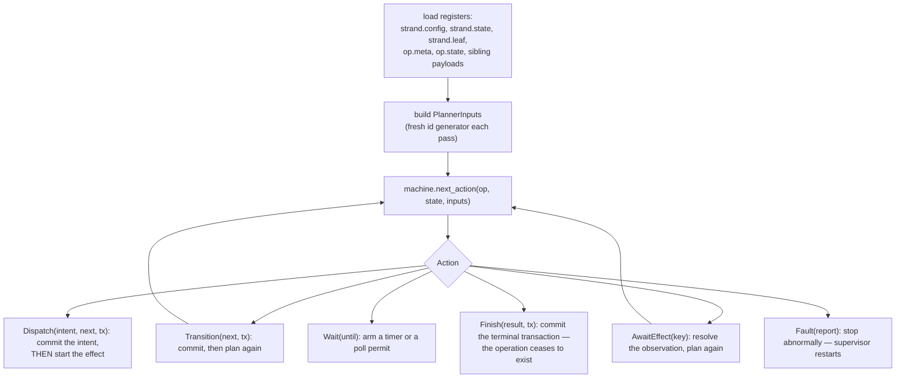
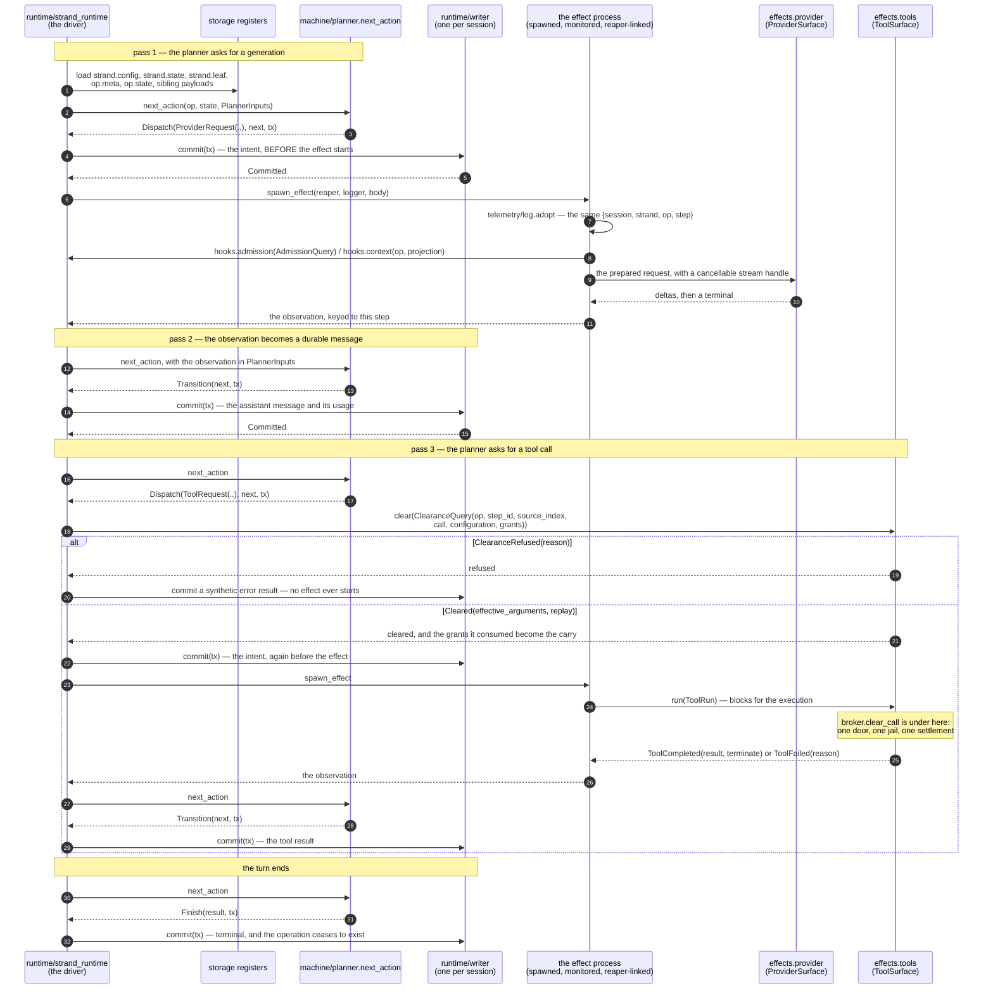

# runtime

`runtime` is the orchestration plane's live half: the OTP supervision
tree that turns an open session into a running one. It does not decide
anything — `machine/planner.next_action` does that, as a pure function —
`runtime` is what *performs* what the planner decided: one
`StorageWriter` owns the commit path for the whole session, one strand
driver per strand loads durable state, calls the planner, and acts on the
`Action` that comes back, against an injected effect seam
(`runtime/effects.Effects`) that tests, the simulation, and production
(`client/wiring`) each fill differently.

## The drive loop is the machine's contract, verbatim

Every pass of a strand driver is the same four steps, and this is the
whole of what "runtime drives machine" means:

The machine never learns anything the driver did not hand it, and the
driver never invents a transaction the machine did not build. `Dispatch`
is the one branch worth pausing on: the intent transaction commits
*before* the effect starts, which is the effect sandwich — a crash before
that commit means the effect never ran at all; a crash after the
settlement commit means it is fully recorded; a crash inside the window
leaves `op.state` saying `effect_pending`, which is exactly the state the
driver reloads and reports as an orphan.

## One turn, doorbell to commit

The flowchart above is one pass. A turn is several of them, and what the
passes share is that the driver never holds anything between them: every
pass reloads the registers, and the only carry is the clearance grants
that authorize the dispatch immediately following them.

The window between the two commits in each `Dispatch` is the effect
sandwich, and it is the only place a crash is ambiguous: `op.state` says
`effect_pending`, the replacement driver reloads it, and its incarnation's
`live` list is what separates an orphan from a live replay. The clearance
carry is scoped just as tightly — it belongs to one call, and the very next
planning pass either turns it into the dispatch it authorized or discards
it, so a clearance whose dispatch never happened cannot lend its grants to
a later one.

## Crash recovery and cold start are the same code

There is no separate recovery path to keep in sync with normal
operation. A cold open and a post-crash reboot both resolve to "list
`strand.*` in storage and start whatever driver each strand is missing" —
the **strand booter**, sitting fourth in the tree's rest-for-one order,
does exactly that on every boot.

```mermaid
stateDiagram-v2
    [*] --> TreeStarting: runtime/supervisor.start(config)
    TreeStarting --> RegistryUp: strand-name registry (survives writer/strand crashes)
    RegistryUp --> WriterUp: StorageWriter
    WriterUp --> FactoriesUp: primary + subagent StrandSupervisor factories<br/>(empty at this point)
    FactoriesUp --> Booting: strand booter starts
    Booting --> Booting: list strand.* registers,<br/>start_strand for each one found,<br/>routed to its own factory
    Booting --> Running: every known strand has a live driver
    Running --> Running: normal operation — drive loop, commits, doorbells
    Running --> Reboot: writer crash (rest-for-one restarts writer AND both factories)
    Running --> StrandRestart: one strand's driver crashes (only that strand restarts)
    Reboot --> Booting: factories restart empty; booter repopulates them
    StrandRestart --> Resume: the replacement re-reads op.state and resumes —<br/>same code as a fresh drive-loop pass
```

Because the registry sits *first* in the rest-for-one order, it survives
both a writer crash and a strand crash, so a replacement driver registers
under the exact same process name and stays addressable — doorbells
resolve through a lookup at ring time rather than caching a pid, and a
lost doorbell only costs latency: the periodic `PollTick` finds queued
work anyway.

A model-spawned subagent cannot take `main` down with it. The tree keeps
**two** strand factories — primary and subagent — and `Config.subagent`
decides by name alone which one a given strand starts under; the subagent
factory sits *after* the primary one in the rest-for-one order, so a
subagent's crash-loop restarts only itself and the booter.

## Effects are monitored, and a reaper bounds their lifetime

Every effect the driver dispatches — a provider request, a tool run, a
parked escalation call — is a process the driver `spawn`s and monitors
directly, and each driver incarnation also spawns its own **reaper**: a
small trapping process, linked to the driver, that every effect links to
at birth. The moment the driver dies, the reaper traps that exit, asks every
effect to stop, and remains alive until every effect and published provider
owner has exited. A session-local drain ledger remembers those reapers across
registry and driver restarts. A replacement driver publishes its own reaper
and waits for the ledger's original monitors to acknowledge every predecessor
before it recovers durable work. The initialized replacement can retain an
abort request while it waits, but it cannot dispatch an effect. That is what
makes the exclusivity gate and the "is this an orphan or a live replay"
decision sound: both read the incarnation-local `live` list, and neither would
mean anything if old work could overlap the next incarnation.

A tool effect which dies without reporting settles **in band** as a synthetic
tool error because the worker's exit proves that no tool process remains. A
provider effect death instead faults the strand. It may have descendants below
the worker, so fabricating a retryable transport result could start a second
request beside the first. The reaper cancels the published stream owner, the
replacement waits for that owner to drain, and only then may recovery retry.

Provider effects also own a cancellable stream handle. If the ordinary wait
deadline expires, the effect first cancels that handle and allows a bounded
acknowledgement grace before reporting the provider-authored terminal or
`CancellationUnconfirmed`. One scheduled timer bounds the whole grace, so a
stream of late deltas cannot renew it. An abort keeps that grace because a real
terminal, including its billed usage, may already be queued. Driver death has no
surviving terminal consumer: the effect requests cancellation and exits, while
the reaper's independent owner monitor holds the restart barrier until the
provider wrappers, fallback pump, transport receiver, and socket request have
all drained.

## Correlation travels as a value, through the spawn

`runtime/effects.spawn_effect` takes the step-scoped `telemetry/log.Logger`
as an argument, and the spawned body closes over it — Erlang `logger`'s
process metadata is *not* inherited across `spawn`, and the effect
sandwich is nothing but spawns, so a design that relied on inheritance
would lose correlation exactly where interleaved strands make it matter,
and lose it silently: the lines would still appear, just uncorrelated.
The spawned body also calls `telemetry/log.adopt`, which stamps the same
`{session, strand, op, step}` into that process's own `logger` metadata,
so an OTP crash report *about* the effect process — which this package
did not author and cannot route through the value — is still correlated
when it lands.

## The modules

| Module | What it holds |
|---|---|
| `runtime/api` | The session-facing surface: open/recover, prompt, steer, follow-up, abort, close, subagent creation, the `fact.*` blackboard, escalation decisions. |
| `runtime/supervisor` | `SessionTree` — the five-child rest-for-one tree — plus `shutdown`. |
| `runtime/strand_runtime` | The driver: the drive loop, doorbells, effect spawning, the reaper. |
| `runtime/writer` | The single commit-serializing actor and its `Committed` event fan-out. |
| `runtime/registry` | The strand-name registry: mint or return the process name a driver registers under. |
| `runtime/effects` | The injected effect seam: `Effects`, `RequestSpec`, `ToolRun`, `Clearance`. |
| `runtime/hooks` | The one seam production, tests, and the simulation all build `Effects.hooks` through; the compaction arithmetic. |
| `runtime/escalation` | The durable escalation record: `Status` (`Pending`/`Approved`/`Rejected`/`Consumed`) and `CallScope`. |
| `runtime/lineage` | The durable spawn ledger: parent edges, depth, deadlines, the reap mark. |

Paths are relative to `packages/runtime/src/` — `runtime/strand_runtime`
is `packages/runtime/src/runtime/strand_runtime.gleam`.

## Reading further

- [`CLAUDE.md`](CLAUDE.md) — the reference doc for changing this code:
  key types, real dependency edges, actor and register traffic, and the
  invariants that break things when violated. Read it before editing.
- [`docs/architecture/orchestration.md`](../../docs/architecture/orchestration.md)
  — the drive loop, the supervision tree, doorbells, the interleave
  harness.
- [`packages/machine/README.md`](../machine/README.md) — the pure
  planner this package drives, and the six-action vocabulary it returns.
- [`docs/architecture/simulation.md`](../../docs/architecture/simulation.md)
  — what the deterministic runner does to this tree.
- [`docs/spec-gaps.md`](../../docs/spec-gaps.md) — "From WP-E": crash
  semantics, boot seeding, close-as-crash, injected entropy.
