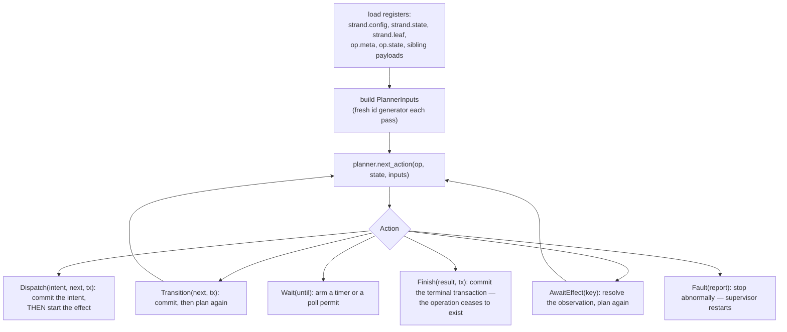
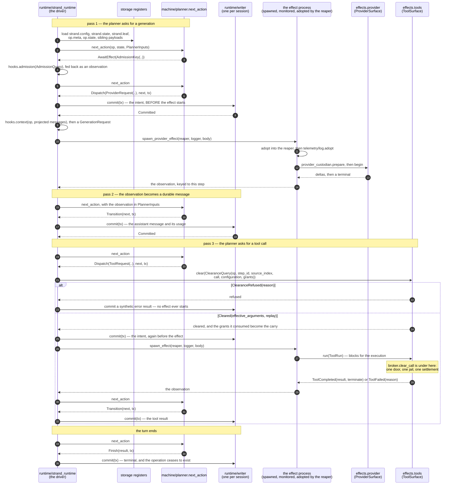
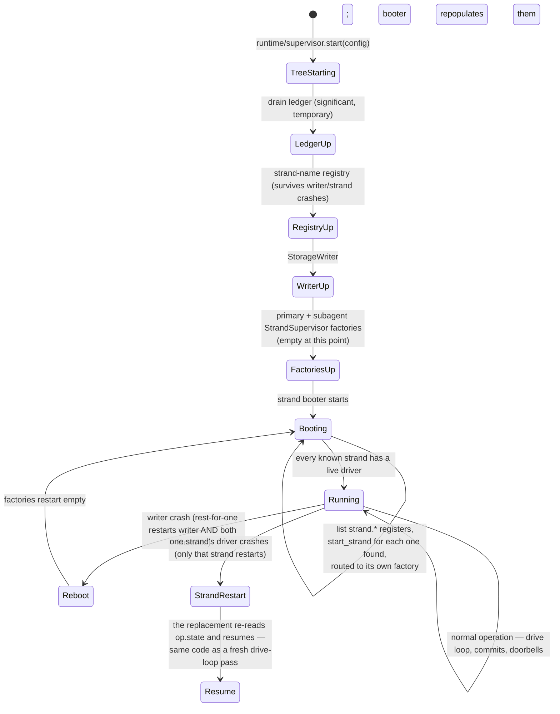
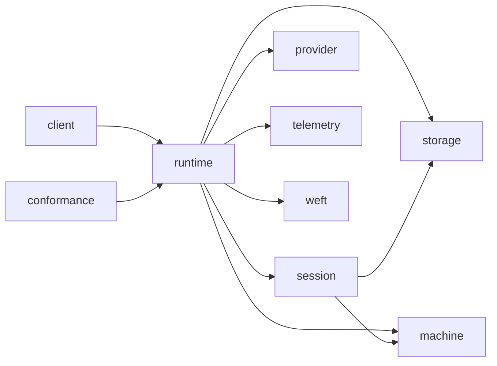

# runtime

`runtime` is the orchestration plane's live half: the OTP supervision
tree that turns an open session into a running one. It does not decide
anything — `machine/planner.next_action` does that, as a pure function —
`runtime` is what *performs* what the planner decided: one
`StorageWriter` owns the commit path for the whole session, one strand
driver per strand loads durable state, calls the planner, and acts on the
`Action` that comes back, against an injected effect seam
(`runtime/effects.Effects`) that tests, the simulation, and production
(`client/wiring`) each fill differently.

## The drive loop is the machine's contract, verbatim

Every pass of a strand driver is the same four steps, and this is the
whole of what "runtime drives machine" means:

```mermaid
flowchart TD
    A["load registers:<br/>strand.config, strand.state, strand.leaf,<br/>op.meta, op.state, sibling payloads"]
    B["build PlannerInputs<br/>(fresh id generator each pass)"]
    C["planner.next_action(op, state, inputs)"]
    D{"Action"}
    E1["Transition(next, tx): commit, then plan again"]
    E2["Dispatch(intent, next, tx): commit the intent,<br/>THEN start the effect"]
    E3["AwaitEffect(key): resolve the observation, plan again"]
    E4["Wait(until): arm a timer or a poll permit"]
    E5["Finish(result, tx): commit the terminal transaction —<br/>the operation ceases to exist"]
    E6["Fault(report): stop abnormally — supervisor restarts"]

    A --> B --> C --> D
    D --> E1 --> C
    D --> E2
    D --> E3 --> C
    D --> E4
    D --> E5
    D --> E6
```

The machine never learns anything the driver did not hand it, and the
driver never invents a transaction the machine did not build. `Dispatch`
is the one branch worth pausing on: the intent transaction commits
*before* the effect starts, which is the effect sandwich — a crash before
that commit means the effect never ran at all; a crash after the
settlement commit means it is fully recorded; a crash inside the window
leaves `op.state` saying `effect_pending`, which is exactly the state the
driver reloads and reports as an orphan.

## One turn, doorbell to commit

The flowchart above is one pass. A turn is several of them, and what the
passes share is that the driver never holds anything between them: every
pass reloads the registers, and the only carry is the clearance grants
that authorize the dispatch immediately following them.

```mermaid
sequenceDiagram
  autonumber
  participant D as runtime/strand_runtime<br/>(the driver)
  participant St as storage registers
  participant M as machine/planner.next_action
  participant W as runtime/writer<br/>(one per session)
  participant E as the effect process<br/>(spawned, monitored, adopted by the reaper)
  participant P as effects.provider<br/>(ProviderSurface)
  participant T as effects.tools<br/>(ToolSurface)

  Note over D,M: pass 1 — the planner asks for a generation
  D->>St: load strand.config, strand.state, strand.leaf,<br/>op.meta, op.state, sibling payloads
  D->>M: next_action(op, state, PlannerInputs)
  M-->>D: AwaitEffect(AdmissionKey(..))
  D->>D: hooks.admission(AdmissionQuery), fed back as an observation
  D->>M: next_action
  M-->>D: Dispatch(ProviderRequest(..), next, tx)
  D->>W: commit(tx) — the intent, BEFORE the effect starts
  W-->>D: Committed
  D->>D: hooks.context(op, projected messages), then a GenerationRequest
  D->>E: spawn_provider_effect(reaper, logger, body)
  E->>E: adopt into the reaper, then telemetry/log.adopt
  E->>P: provider_custodian.prepare, then begin
  P-->>E: deltas, then a terminal
  E-->>D: the observation, keyed to this step

  Note over D,W: pass 2 — the observation becomes a durable message
  D->>M: next_action, with the observation in PlannerInputs
  M-->>D: Transition(next, tx)
  D->>W: commit(tx) — the assistant message and its usage
  W-->>D: Committed

  Note over D,T: pass 3 — the planner asks for a tool call
  D->>M: next_action
  M-->>D: Dispatch(ToolRequest(..), next, tx)
  D->>T: clear(ClearanceQuery(op, step_id, source_index,<br/>call, configuration, grants))
  alt ClearanceRefused(reason)
    T-->>D: refused
    D->>W: commit a synthetic error result — no effect ever starts
  else Cleared(effective_arguments, replay)
    T-->>D: cleared, and the grants it consumed become the carry
    D->>W: commit(tx) — the intent, again before the effect
    D->>E: spawn_effect(reaper, logger, body)
    E->>T: run(ToolRun) — blocks for the execution
    Note over T: broker.clear_call is under here:<br/>one door, one jail, one settlement
    T-->>E: ToolCompleted(result, terminate) or ToolFailed(reason)
    E-->>D: the observation
    D->>M: next_action
    M-->>D: Transition(next, tx)
    D->>W: commit(tx) — the tool result
  end

  Note over D,W: the turn ends
  D->>M: next_action
  M-->>D: Finish(result, tx)
  D->>W: commit(tx) — terminal, and the operation ceases to exist
```

The window between the two commits in each `Dispatch` is the effect
sandwich, and it is the only place a crash is ambiguous: `op.state` says
`effect_pending`, the replacement driver reloads it, and its incarnation's
`live` list is what separates an orphan from a live replay. The clearance
carry is scoped just as tightly — it belongs to one call, and the very next
planning pass either turns it into the dispatch it authorized or discards
it, so a clearance whose dispatch never happened cannot lend its grants to
a later one.

## Crash recovery and cold start are the same code

There is no separate recovery path to keep in sync with normal
operation. A cold open and a post-crash reboot both resolve to "list
`strand.*` in storage and start whatever driver each strand is missing" —
the **strand booter**, the sixth and last child in the tree's
rest-for-one order, does exactly that on every boot.

```mermaid
stateDiagram-v2
    [*] --> TreeStarting: runtime/supervisor.start(config)
    TreeStarting --> LedgerUp: drain ledger (significant, temporary)
    LedgerUp --> RegistryUp: strand-name registry (survives writer/strand crashes)
    RegistryUp --> WriterUp: StorageWriter
    WriterUp --> FactoriesUp: primary + subagent StrandSupervisor factories<br/>(empty at this point)
    FactoriesUp --> Booting: strand booter starts
    Booting --> Booting: list strand.* registers,<br/>start_strand for each one found,<br/>routed to its own factory
    Booting --> Running: every known strand has a live driver
    Running --> Running: normal operation — drive loop, commits, doorbells
    Running --> Reboot: writer crash (rest-for-one restarts writer AND both factories)
    Running --> StrandRestart: one strand's driver crashes (only that strand restarts)
    Reboot --> Booting: factories restart empty; booter repopulates them
    StrandRestart --> Resume: the replacement re-reads op.state and resumes —<br/>same code as a fresh drive-loop pass
```

Because the registry sits before the writer in the rest-for-one order,
it survives both a writer crash and a strand crash, so a replacement
driver registers under the same reference address and stays
addressable. The addresses are `weft/registry.Address` values minted
once per strand, so repeated strand allocation creates no atoms.
Doorbells resolve through a lookup at ring time rather than caching a
pid, and a lost doorbell only costs latency: the periodic `PollTick`
finds queued work anyway.

The drain ledger (`runtime/internal/drain_registry`) sits before the
registry because it must outlive a registry restart. It records, per
logical strand, every effect reaper that has not yet exited, and a
replacement driver waits on that record before it recovers. It is a
significant temporary child: if it dies, the supervisor stops the whole
session rather than restarting it with an empty ownership history.

A model-spawned subagent cannot take `main` down with it. The tree keeps
**two** strand factories — primary and subagent — and `Config.subagent`
decides by name alone which one a given strand starts under; the subagent
factory sits *after* the primary one in the rest-for-one order, so a
subagent's crash-loop restarts only itself and the booter.

## Effects are monitored, and a reaper bounds their lifetime

Every effect the driver dispatches — a provider request, a tool run, a
parked escalation call — is a process the driver `spawn`s and monitors
directly, and each driver incarnation also starts its own **reaper**: a
weft witnessed run, linked to the driver, whose ledger every effect
adopts itself into before it runs. The moment the driver dies, the
reaper's scope traps that exit, asks every adopted effect to stop, and
remains alive until every effect and published provider owner has
exited. A session-local drain ledger remembers those reapers across
registry and driver restarts. A replacement driver publishes its own reaper
and waits for the ledger's original monitors to acknowledge every predecessor
before it recovers durable work. The initialized replacement can retain an
abort request while it waits, but it cannot dispatch an effect. That is what
makes the exclusivity gate and the "is this an orphan or a live replay"
decision sound: both read the incarnation-local `live` list, and neither would
mean anything if old work could overlap the next incarnation.

A tool effect which dies without reporting settles **in band** as a synthetic
tool error because the worker's exit proves that no tool process remains. A
provider effect death instead faults the strand. It may have descendants below
the worker, so fabricating a retryable transport result could start a second
request beside the first. The reaper cancels the published stream owner, the
replacement waits for that owner to drain, and only then may recovery retry.

Provider effects also own a cancellable stream handle. If the ordinary wait
deadline expires, the effect first cancels that handle and allows a bounded
acknowledgement grace before reporting the provider-authored terminal or
`CancellationUnconfirmed`. One scheduled timer bounds the whole grace, so a
stream of late deltas cannot renew it. An abort keeps that grace because a real
terminal, including its billed usage, may already be queued. Driver death has no
surviving terminal consumer: the effect requests cancellation and exits, while
the reaper's independent owner monitor holds the restart barrier until the
provider wrappers, fallback pump, transport receiver, and socket request have
all drained.

## Correlation travels as a value, through the spawn

The driver's `spawn_effect` and `spawn_provider_effect` (private to
`runtime/strand_runtime`) take the step-scoped `telemetry/log.Logger` as
an argument, and the spawned body closes over it — Erlang `logger`'s
process metadata is *not* inherited across `spawn`, and the effect
sandwich is nothing but spawns, so a design that relied on inheritance
would lose correlation exactly where interleaved strands make it matter,
and lose it silently: the lines would still appear, just uncorrelated.
The spawned body also calls `telemetry/log.adopt`, which stamps the same
`{session, strand, op, step}` into that process's own `logger` metadata,
so an OTP crash report *about* the effect process — which this package
did not author and cannot route through the value — is still correlated
when it lands.

## Evolution authority stays with the host

`runtime/api` reserves the `evolution/` fact namespace alongside other
host-owned namespaces. Ordinary model-facing fact writes cannot forge
approval, adoption or a pinned profile map. The evolution controller uses
the existing runtime and storage contracts; the machine's operation API
does not gain an authored-code loader.

`client/evolution` owns live generation replacement and its native worker
custody. The runtime continues the same conversation while that owner
serializes promoted invocations against activation. Read
[the evolution architecture](../../docs/architecture/evolution.md) for the
commit boundary and recovery rules.

## The modules

| Module | What it holds |
|---|---|
Read them in this order: the surface, the tree, the two actors that do
the work, then the seam and the durable records.

| Module | What it holds |
|---|---|
| `runtime/api` | The session-facing surface: `Runtime`, open/recover, prompt, steer, follow-up, abort, close, `drain`, subagent creation, the `fact.*` blackboard, escalation decisions, and `ApiError` (including `SessionStolen`). |
| `runtime/supervisor` | `SessionTree`, the six-child rest-for-one tree, plus `shutdown`. |
| `runtime/strand_runtime` | The driver: the drive loop, doorbells, effect spawning, the reaper. |
| `runtime/writer` | The single commit-serializing actor, lease renewal, and its `Committed` event fan-out to `Direct` and `Routed` subscribers. |
| `runtime/registry` | The strand-name registry: strand name to a reclaimable `weft/registry.Address`, plus the two factories' current handles. |
| `runtime/effects` | The injected effect seam: `Effects`, `RequestSpec`, `ToolRun`, `ClearanceQuery`, `Clearance`, `Hooks`. |
| `runtime/hooks` | The one seam production, tests, and the simulation all build `Effects.hooks` through; the compaction arithmetic. |
| `runtime/projection` | The branch scan a driver keeps between steps, and the pure `join` that extends it with new entries instead of rescanning. |
| `runtime/repeat_guard` | Clearance's rule for a tool call that has already failed with the same arguments: refuse at `refuse_after`, end the run at `end_after`. |
| `runtime/escalation` | The durable escalation record: `Status` (`Pending`/`Approved`/`Rejected`/`Consumed`) and `CallScope`. |
| `runtime/lineage` | The durable spawn ledger: parent edges, depth, deadlines, the reap mark. |
| `runtime/child_run` | Per-operation ownership, deadline and cancellation records for a run on a reusable child strand. |
| `runtime/async_execution` | The durable admission record for an execution whose satellite process is volatile; `Draining` fences new child runs. |
| `runtime/residency` | `hibernate_after_ms`, the one idle interval after which the session's actors hibernate. |
| `runtime/internal/drain_registry` | The drain ledger: every unexited reaper per logical strand, and the shutdown barrier. |
| `runtime/internal/provider_custodian` | One provider request as a parked owner plus a `begin` permit, run as a `weft/state_machine`. |
| `runtime/internal/ffi_sup` | The package's only two `@external`s: `terminate_supervisor` and `send_to_pid`. |

Paths are relative to `packages/runtime/src/`, so `runtime/strand_runtime`
is `packages/runtime/src/runtime/strand_runtime.gleam`.

The package imports `core`, `storage`, `session`, `machine`, `provider`
(the stream types a provider effect consumes) and `telemetry`, plus
`gleam_otp` and `weft` for its process machinery. Two packages build on
it: `client`, whose wiring fills `Effects` with the real gateway, broker
and tools, and `conformance`, whose simulation runner drives this tree.
The daemon (`loomd`) and its web view live in `client` and `web_view`,
not here. The daemon reaches this package through `client/serve`, which
starts each session with `api.open_published` and keeps an `api.Drain`
for it.

```mermaid
flowchart LR
    client --> runtime
    conformance --> runtime
    runtime --> session
    runtime --> machine
    runtime --> provider
    runtime --> telemetry
    runtime --> storage
    runtime --> weft
    session --> storage
    session --> machine
```

## How it is tested

The tests under `test/runtime/` start real session trees against
scripted effects (`test/support/fake.gleam`) and assert on what was
committed. They fall into four groups. The first covers the drive loop
and API: `api_test`, `multi_strand_test`, `parallel_tools_test`,
`doorbell_test` and `idle_poll_test`. The second covers crash and
restart: `recovery_test`, `restart_reap_test`, `drain_registry_test`,
`publication_test`, `shutdown_test`, `lease_theft_test`, and the M1
`cold_open_test`, a multi-turn SQLite session. The third covers the
durable records: `escalation_test`, `lineage_test` and `hooks_test`.
The fourth is `interleave_test`, which runs each scenario once to count
its commits and then once per commit boundary, killing the tree after
that commit (`test/support/harness.gleam`) and checking that recovery
converges.

Run the package gate, which is format check, warning-free build, and
tests, with `make check-runtime`.

## Reading further

- [`CLAUDE.md`](CLAUDE.md): the reference doc for changing this code, with
  key types, real dependency edges, actor and register traffic, and the
  invariants that break things when violated. Read it before editing.
- [`docs/architecture/orchestration.md`](../../docs/architecture/orchestration.md):
  the drive loop, the supervision tree, doorbells, the interleave
  harness.
- [`packages/machine/README.md`](../machine/README.md): the pure
  planner this package drives, and the six-action vocabulary it returns.
- [`docs/architecture/simulation.md`](../../docs/architecture/simulation.md):
  what the deterministic runner does to this tree.
- [`docs/spec-gaps.md`](../../docs/spec-gaps.md): "From WP-E": crash
  semantics, boot seeding, close-as-crash, injected entropy.
- [`docs/weft.md`](../../docs/weft.md): the process library behind the
  reaper, the registry addresses and the provider custodian.
- [`docs/architecture/daemon.md`](../../docs/architecture/daemon.md):
  the daemon that hosts these trees, one per open session.
- [`protocol-change/005-lease-lost-commit-error.md`](../../protocol-change/005-lease-lost-commit-error.md):
  why `api` reports a stolen lease as `SessionStolen`.
- [`protocol-change/008-canonical-session-id.md`](../../protocol-change/008-canonical-session-id.md):
  the session id `api.open` mints on a session that has none.
