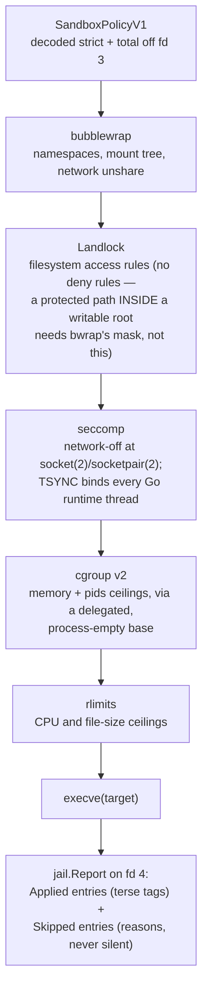
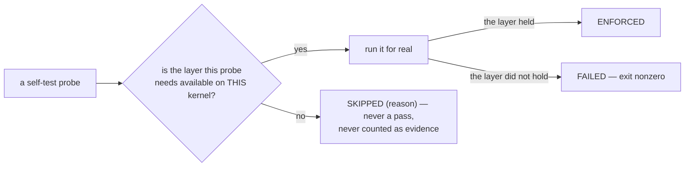
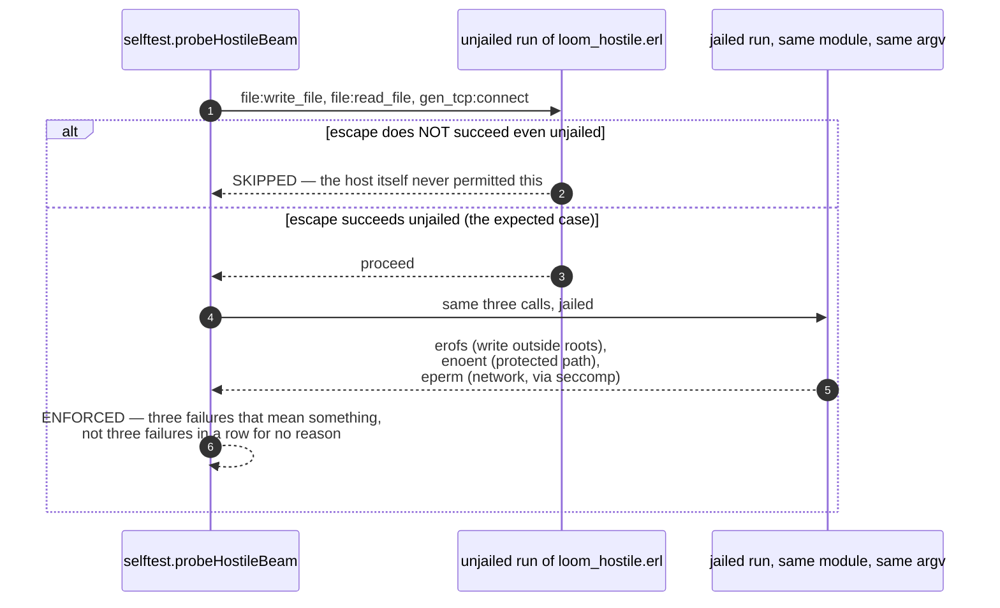

# sandbox

`sandbox` is `loom-exec`, the Go binary the broker spawns to actually run
an untrusted command. Everything upstream — policy composition, budget,
tokens — is bookkeeping; this package is where confinement is real or it
is nothing. It reads a `SandboxPolicyV1` strictly and totally off fd 3,
builds a jail with whatever the kernel actually offers, execs the target
inside it, and reports — honestly, every time — which layers actually
applied and which were skipped and why. It depends on no Loom package;
the frozen wire protocol (`packages/broker`'s `broker/framing`) is the
entire coupling.

Linux and macOS have native jails. Linux stacks bubblewrap, Landlock,
seccomp, cgroup v2, and rlimits. macOS uses a generated deny-default
Seatbelt profile plus the rlimits Darwin can actually enforce. Windows and
unknown targets remain unsupported; on those platforms the helper refuses to
serve rather than run with nothing enforcing the requested policy.

## The layers, and how they stack

A Linux execution passes through five independent kernel mechanisms, each
contributing something the others cannot:

On macOS, the helper wraps the same restrict-and-exec stage in the pinned
system `/usr/bin/sandbox-exec`. The generated profile grants read-only host
visibility, typed writable roots, a private mode-0700 scratch directory, and
AF_UNIX capability sockets; final subtractive rules hide protected logical
and resolved paths. Internet bind and outbound access exist only for
`NetworkFull`. Policy paths cross into SBPL as `-D` parameters, never as
interpolated profile source.

Darwin has no per-execution cgroup equivalent. A finite `RLIMIT_AS` is
attempted and explicitly skipped when the kernel rejects it. Because
`RLIMIT_NPROC` counts every process owned by the user, Loom installs it only
when the current user-wide process floor leaves a 16-process reserve below the
requested value; on a busy account it reports the omitted ceiling instead of
breaking every child fork. The reserve narrows an unavoidable race with
concurrent same-user forks. A strict enforcement demand rejects either skip.

**bwrap owns all namespace and mount work**, deliberately: the Go runtime
is multithreaded from its first instruction, and assembling namespaces
by hand in a multithreaded process is the exact tar pit `runc`'s
`nsexec.c` exists to work around. If bwrap is missing, the helper runs
degraded and says so in the report — it never builds namespaces itself.

**Restrict-then-exec is sound because the restrictions survive `execve`**:
Landlock domains and seccomp filters both persist across it and only ever
tighten on a child, never loosen. Landlock has no deny rules, which is
why a `protected` path sitting *inside* a writable root has to be masked
by bwrap (a tmpfs or a ro-bind shadow) rather than carved out at the
Landlock layer — attempting it there, without bwrap, is silently
unenforceable, and the report says so.

## Honesty is the theme: enforced, reported, or skipped — never assumed

A green self-test run means the probes that ran, passed. It never means
the platform this run happened on has the layers those probes needed.
That is the whole reason the report format has three words and not two:

`--self-test` runs nine probes against the live kernel: write outside
`writable_roots`, a protected-path write, a direct socket under network
off, an env var outside the allowlist, a fork bomb against the pids
limit, an output flood against the per-stream cap, an orphaned
grandchild reaped via the pgroup, an observed `setsid` escape reaped by the
platform lifecycle mechanism, and an unvetted `.beam` denied host write,
secret read, and network. That hostile `.beam` is the probe that matters most
for the confinement claim this whole package makes. `--allow-unenforced` is
reserved for one narrow case:
an *unsupported platform*, never a degraded one. A host missing one of its
native layers still enforces what remains and reports what it could not; a
build with no jail at all for its OS has a gap in Loom
itself, and that gap gets its own vocabulary — `platform-unsupported` in
`hello.features`, `skip:jail: …` leading every per-exec enforcement list,
`RESULT: UNSUPPORTED PLATFORM` from `--self-test`, and server mode
refusing to start without the flag.

The Darwin process-table tracker is a best-effort lifecycle backstop, not a
PID namespace. It reaches observed descendants that leave the process group,
but a rapid daemonizing double-fork can be reparented between samples, and no
stable handle makes the final birth check plus signal atomic. Output draining
is bounded even when an untracked descendant keeps a pipe open. Every Darwin
execution reports that limitation as
`skip:darwin-process-lifecycle`, which makes `FullEnforcement` refuse it.
Seatbelt follows the missed descendant across forks, so filesystem and network
confinement remain in force even though execution-lifetime cleanup is not
guaranteed.

## The hostile-`.beam` probe, and what "confined" actually means here

Three denials in a row look exactly the same whether the jail held or
the adversary simply never ran — a module that never loaded, a node that
never booted, a path that never existed all produce silence indistinguishable
from success. So the probe never reports containment on silence: the
adversary (`loom_hostile.erl`, a hand-written, never-vetted, never
compiled-by-`codemode` module) announces that it loaded and that it
finished, performs two effects the policy *allows* and reports them, and
— critically — the probe runs the identical module **unjailed first**. If
the escape does not succeed unjailed either, the probe skips rather than
claiming a jail held something the host never permitted anyway.

What this claims is narrower than "reaches nothing on the filesystem".
The jail's base view is `--ro-bind / /` with Landlock granting
`RODirs("/")`, so an unprotected host path stays *readable* from inside
the jail — `readable_roots` never narrows reads, only `protected` removes
them. The observed claim is exactly three things: an unvetted `.beam`
cannot write outside the writable roots, cannot see a protected path, and
cannot reach the network. Closing the gap between that and "reaches
nothing" is tracked as
`protocol-change/004-sandbox-policy-explicit-mounts.md`, not this probe.

## `signal` versus `code`, and why the cancel ladder addresses the payload

`loom-exec` waits on its *direct* child. Unjailed, that child is the
payload itself, so a TERM-killed payload reports `signal: 15, code:
143`. Jailed, the direct child is a bwrap **supervisor** — the OS
process-group leader, spawned `--die-with-parent`, with a second bwrap
acting as the PID namespace's own init below it and the payload below
that. The supervisor outlives the payload and relays a signalled payload
by *exiting* `128 + signal` rather than dying of it, so the identical
TERM-killed payload jailed reports `signal: 0, code: 143`. `signal`
therefore tells a caller whether a jail was engaged, never whether the
payload itself was signalled — read `code` for that, in both
environments.

That relay behaviour is also why the cancel ladder's TERM rung is
addressed to the payload alone (`jail.TermTargets`, selected from `/proc`
by pgid and `NSpid`) rather than to the whole process group: TERMing the
group hits the `--die-with-parent` supervisor, whose death immediately
SIGKILLs the namespace init and everything under it — collapsing a
2-second grace to under a millisecond, with the payload never actually
asked to stop. Only the KILL rung, after the grace expires, still takes
the whole group unconditionally. `packages/broker/CLAUDE.md` documents
the broker-side half of this same ladder.

## Where to look

| Path | What it holds |
|---|---|
| `cmd/loom-exec` | The binary: server mode, `--exec` (stage 2), `--self-test`, `--probe-socket`, `--probe-setsid`. |
| `internal/policy` | Strict, total, fail-closed `SandboxPolicyV1` decoding. |
| `internal/framing` | The helper side of the wire: `u32_be` length + msgpack. |
| `internal/server` | The one-execution-at-a-time frame loop. |
| `internal/jail` | `Request`, `Features`, `Report`, the bwrap argv builder, `PlatformSupport`, the cancel ladder (`cancel.go`). |
| `internal/cgroup` | Memory/pids ceiling distribution and delegated-base detection. |
| `internal/llock`, `internal/seccompf` | Landlock and seccomp, split by build tag so the module compiles for `GOOS=darwin`. |
| `internal/selftest` | The nine probes, the ENFORCED/SKIPPED/FAILED report, `loom_hostile.erl`. |

## Reading further

- [`CLAUDE.md`](CLAUDE.md) — the reference doc for changing this code:
  key types, real dependency edges, wire and fd traffic, and the
  invariants that break things when violated. Read it before editing.
- [`docs/architecture/effects.md`](../../docs/architecture/effects.md) —
  the threat model, Rule Zero, enforced versus reported.
- [`packages/broker/CLAUDE.md`](../broker/CLAUDE.md) — the other end of
  the wire, and the broker's own half of the cancel ladder.
- [`docs/spec-gaps.md`](../../docs/spec-gaps.md) — "From WP-H
  (`sandbox`)": policy source, `exec_start.limits`, output caps, hello
  ordering, degraded mode.
- `make selftest` probes the current kernel; `make e2e` runs the jailed
  acceptance against a freshly built helper.
