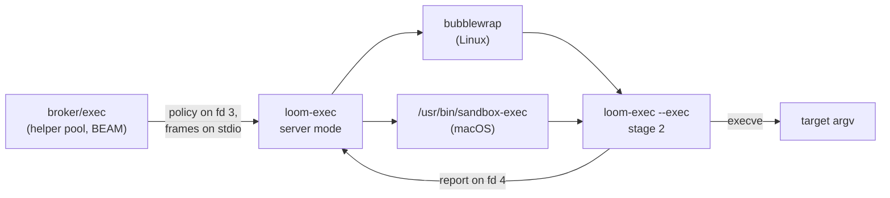
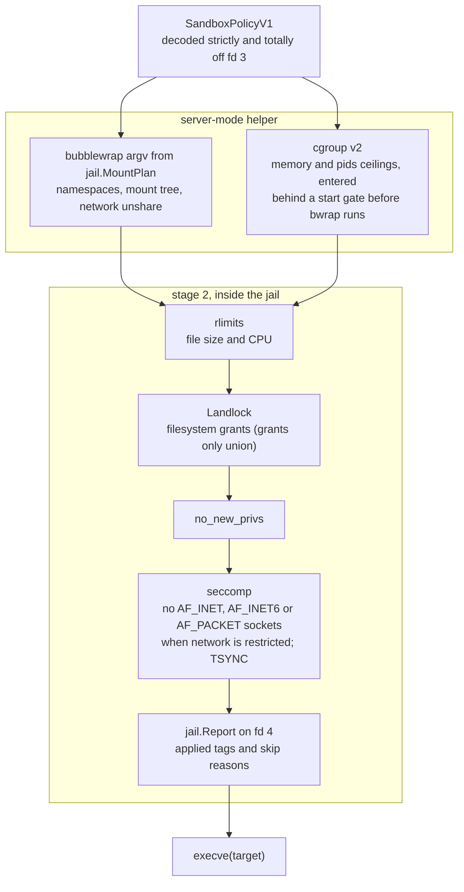
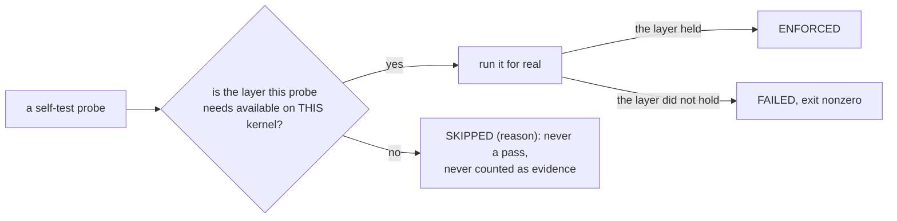
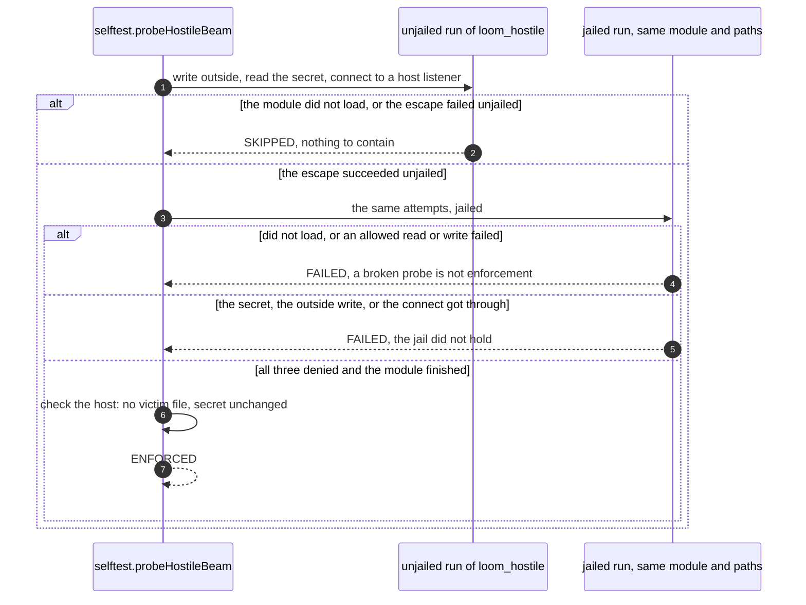

# sandbox

`sandbox` is `loom-exec`, the Go binary the broker spawns to run an
untrusted command. Everything upstream of it (policy composition, budget,
tokens) is bookkeeping; this package is where confinement is either real
or absent. It reads a `SandboxPolicyV1` strictly and totally off fd 3,
builds a jail from whatever the kernel offers, execs the target inside
it, and reports on every execution which layers applied and which were
skipped and why.

It is a separate package, and the tree's only Go module, because the jail
has to be built by something outside the BEAM: the Go runtime can drive
bubblewrap, Landlock and seccomp directly, and the harness VM must never
run model-influenced code (Rule Zero). It depends on no Loom package. The
frozen effect-plane wire protocol (`packages/broker`'s `broker/framing`
and `broker/policy`) is the entire coupling, and both sides pin it against
the golden frames in `protocol/msgpack-fixtures/`.

Linux and macOS have native jails. Linux stacks bubblewrap, Landlock,
seccomp, cgroup v2 and rlimits. macOS uses a generated deny-default
Seatbelt profile plus the rlimits Darwin can enforce. Windows and unknown
targets are unsupported; on those platforms the helper refuses to serve
rather than run with nothing enforcing the requested policy.

## Where it sits

```mermaid
flowchart LR
    broker["broker/exec<br/>(helper pool, BEAM)"]
    helper["loom-exec<br/>server mode"]
    bwrap["bubblewrap<br/>(Linux)"]
    sbx["/usr/bin/sandbox-exec<br/>(macOS)"]
    stage2["loom-exec --exec<br/>stage 2"]
    target["target argv"]

    broker -- "policy on fd 3,<br/>frames on stdio" --> helper
    helper --> bwrap --> stage2
    helper --> sbx --> stage2
    stage2 -- "report on fd 4" --> helper
    stage2 -- "execve" --> target
```

The helper serves one execution at a time; the broker's pool runs more
helpers for concurrency. Server mode spawns stage 2, which is `loom-exec`
re-executed inside the platform jail, and stage 2 restricts itself and
then replaces itself with the target.

## The layers, and how they stack

A Linux execution passes through five independent kernel mechanisms. Two
are applied from outside the jail by the server-mode helper, and the rest
by stage 2 on itself just before `execve`:

```mermaid
flowchart TD
    P["SandboxPolicyV1<br/>decoded strictly and totally off fd 3"]

    subgraph outside["server-mode helper"]
        BW["bubblewrap argv from jail.MountPlan<br/>namespaces, mount tree, network unshare"]
        CG["cgroup v2<br/>memory and pids ceilings, entered<br/>behind a start gate before bwrap runs"]
    end

    subgraph inside["stage 2, inside the jail"]
        RL["rlimits<br/>file size and CPU"]
        LL["Landlock<br/>filesystem grants (grants only union)"]
        NNP["no_new_privs"]
        SC["seccomp<br/>no AF_INET, AF_INET6 or AF_PACKET sockets<br/>when network is restricted; TSYNC"]
        REPORT["jail.Report on fd 4<br/>applied tags and skip reasons"]
    end

    EXEC["execve(target)"]

    P --> BW
    P --> CG
    BW --> RL --> LL --> NNP --> SC --> REPORT --> EXEC
    CG --> RL
```

The report on fd 4 is also the helper's witness that the outer jail
reached stage 2: the bwrap and mount claims are published only when it
arrives, and a missing report becomes a `skip:` entry, never silence.

**bwrap owns all namespace and mount work.** The Go runtime is
multithreaded from its first instruction, and assembling namespaces by
hand in a multithreaded process is the problem `runc`'s `nsexec.c` exists
to work around. The helper only composes an argv (pure data, golden-tested)
and stacks in-process restrictions on itself. If bwrap is missing, the
helper runs degraded and says so in the report; it never builds namespaces
itself.

**Restrict-then-exec is sound because the restrictions survive `execve`.**
Landlock domains and seccomp filters both persist across it and only ever
tighten on a child. Landlock has no deny rules, which is why a `protected`
path inside a writable root has to be masked by bwrap (a tmpfs or a
read-only bind shadow) rather than carved out at the Landlock layer.
Without bwrap that carve-out is unenforceable, and the report says so.

**The base view is an allowlist.** Since protocol-change/020, the jail's
root is an empty tmpfs plus a read-only bind of each entry in
`jail.SystemRoots` (on macOS, per-root read allows over
`DarwinSystemRoots`). `/home`, `/root`, `/Users` and `/var/tmp` are
absent, so the user's home directory reaches a jail only through the
policy's roots and mounts. A `readable_roots` entry of `/` rebinds the
whole host read-only and is reported as `base=host-view` rather than
`base=minimal`. `loomd`'s default session base does exactly that
(`--read-scope` selects workspace-only reads), so under the default an
unprotected host path is readable from inside the jail and `protected` is
what hides the rest.

On macOS, the helper wraps the same stage 2 in the pinned system
`/usr/bin/sandbox-exec`. The generated profile grants read access to the
system roots and the policy's own regions, typed writable roots, a private
mode-0700 scratch directory, and AF_UNIX capability sockets; final
subtractive rules hide protected logical and resolved paths. Internet bind
and outbound access exist only for `NetworkFull`. Policy paths cross into
the profile as `-D` parameters, never as interpolated profile source.

Darwin has no per-execution cgroup equivalent. A finite `RLIMIT_AS` is
attempted and explicitly skipped when the kernel rejects it. Because
`RLIMIT_NPROC` counts every process owned by the user, Loom installs it only
when the current user-wide process count leaves a 16-process reserve below
the requested value; on a busy account it reports the omitted ceiling
instead of breaking every child fork. A strict enforcement demand rejects
either skip.

## Enforced, reported, or skipped: never assumed

A green self-test run means the probes that ran, passed. It never means
the platform this run happened on has the layers those probes needed.
That is why the report has three words and not two:

```mermaid
flowchart LR
    Probe["a self-test probe"]
    Avail{"is the layer this probe<br/>needs available on THIS kernel?"}
    Run["run it for real"]
    Enforced["ENFORCED"]
    Failed["FAILED, exit nonzero"]
    Skipped["SKIPPED (reason): never a pass,<br/>never counted as evidence"]

    Probe --> Avail
    Avail -->|yes| Run
    Run -->|the layer held| Enforced
    Run -->|the layer did not hold| Failed
    Avail -->|no| Skipped
```

`--self-test` runs eleven probes against the live kernel: a write outside
`writable_roots`, a protected path masked from reads and writes, the
daemon's state root out of reach from a session jail, a host path outside
the mount plan unreadable, a direct socket under network off, an
environment variable outside the allowlist, a fork bomb against the pids
limit, an output flood against the per-stream cap, an orphaned grandchild
reaped through the process group, an observed `setsid` escape reaped by
the platform's lifecycle mechanism, and an unvetted `.beam` denied a host
write, a secret read and the network.

`--allow-unenforced` is reserved for an *unsupported platform*, never a
degraded one. A host missing one of its native layers still enforces what
remains and reports what it could not. A build with no jail at all for
its OS is a gap in Loom itself, and that gap has its own vocabulary:
`platform-unsupported` in `hello.features`, `skip:jail: …` leading every
per-execution enforcement list, `RESULT: UNSUPPORTED PLATFORM` from
`--self-test`, and server mode refusing to start without the flag.

The Darwin process-table tracker is a best-effort lifecycle backstop, not
a PID namespace. It reaches observed descendants that leave the process
group, but a rapid daemonizing double-fork can be reparented between
samples, and no stable handle makes the final identity check and the
signal atomic. Every Darwin execution therefore reports
`skip:darwin-process-lifecycle`, which makes `FullEnforcement` refuse it.
Seatbelt follows the missed descendant across forks, so filesystem and
network confinement remain in force even though cleanup at the end of the
execution is not guaranteed.

## The hostile-`.beam` probe

A module that never loaded, a node that never booted, and a path that
never existed all produce the same silence as containment. So the probe
never reports containment on silence. The adversary (`loom_hostile.erl`,
a hand-written module that `codemode` never vetted or compiled) announces
that it loaded and that it finished, and performs two effects the policy
allows. The probe also runs the identical module unjailed first: if the
escape does not succeed there, a denial inside the jail would prove
nothing, and the probe skips.

```mermaid
sequenceDiagram
    autonumber
    participant Probe as selftest.probeHostileBeam
    participant U as unjailed run of loom_hostile
    participant J as jailed run, same module and paths
    Probe->>U: write outside, read the secret, connect to a host listener
    alt the module did not load, or the escape failed unjailed
        U-->>Probe: SKIPPED, nothing to contain
    else the escape succeeded unjailed
        Probe->>J: the same attempts, jailed
        alt did not load, or an allowed read or write failed
            J-->>Probe: FAILED, a broken probe is not enforcement
        else the secret, the outside write, or the connect got through
            J-->>Probe: FAILED, the jail did not hold
        else all three denied and the module finished
            Probe->>Probe: check the host: no victim file, secret unchanged
            Probe-->>Probe: ENFORCED
        end
    end
```

The claim is exactly those three things: an unvetted `.beam` cannot write
outside the writable roots, cannot see a protected path, and cannot reach
the network. It does not claim the adversary reaches nothing on the
filesystem; the system roots are readable, and whether the rest of the
host is out of reach is the separate "host path outside the mount plan"
probe's claim.

## `signal` versus `code`, and why the cancel ladder addresses the payload

`loom-exec` waits on its *direct* child. Unjailed, that child is the
payload itself, so a TERM-killed payload reports `signal: 15, code: 143`.
Jailed, the direct child is a bwrap supervisor: the process-group leader,
spawned `--die-with-parent`, with a second bwrap as the PID namespace's
init below it and the payload below that. The supervisor outlives the
payload and relays a signalled payload by exiting with `128 + signal`, so
the same TERM-killed payload reports `signal: 0, code: 143`. `signal`
therefore tells a caller whether a jail was engaged; read `code` for how
the payload ended, and `cancelled` (protocol-change/006) for whether the
helper truncated it.

That structure is also why the cancel ladder's TERM rung is not sent to
the whole process group. TERMing the group hits the supervisor, whose
death SIGKILLs the namespace init and everything under it, collapsing the
2-second grace to under a millisecond. `jail.TermTargets` instead walks
parent links from the supervisor and selects everything at depth two or
more: the payload and whatever it spawned. Descent is used rather than
process-group membership because a payload can leave its group with
`setsid(2)` but cannot stop being its parent's child. A selection that is
empty, or that misses a live payload root read back from
`/proc/<pid>/task/<pid>/children`, falls back to the whole group, because
a TERM not sent is worse than one sent too widely. The KILL rung, after
the grace, takes the whole group unconditionally. `cancel.go` has the full
argument, and `packages/broker/README.md` the broker's half of the ladder.

## A tour of the code

Read in this order.

- `internal/policy`: `Policy`, the strict, total, fail-closed decode of
  `SandboxPolicyV1` at wire version 2, and the `Mount` vocabulary of
  protocol-change/004. An unknown version, field or type is an error.
- `internal/framing`: the helper side of the wire, `u32_be` length plus a
  msgpack map with keys `v`, `id`, `kind` and `body`.
- `internal/server`: the frame loop. Frames in on stdin, frames out on
  stdout, one execution at a time; a second `exec_start` gets `busy`.
- `internal/jail`: the jail. `Request`, `Features` and `Report` describe
  one execution, what the kernel offers, and what applied.
  `MountPlan` and `MountClass` order the bwrap argv (grants first, masks
  last, explicit mounts after both); `SystemRoots` is the base view;
  `SeatbeltPlan` is the Darwin profile; `PlatformFor` decides whether this
  build has a jail at all; `RunStage2` is stage 2; `TermTargets` is the
  cancel ladder's selection; `RunGitIdentityPublication` is the private
  `--publish-git-identity` mode of protocol-change/043.
- `internal/cgroup`: `DetectBase`, `Setup`, `Enter` and `Cleanup` for the
  memory and pids ceilings under a delegated, process-empty cgroup v2
  base (`--cgroup-base` or `LOOM_CGROUP_BASE`).
- `internal/llock`, `internal/seccompf`: Landlock rules and the socket
  filter, split by build tag so the module compiles for `GOOS=darwin`.
- `internal/selftest`: the eleven probes, the ENFORCED/SKIPPED/FAILED
  report, and `loom_hostile.erl`.
- `internal/testbin`: builds the real `loom-exec` for tests that spawn
  jails, since stage 2 re-executes the helper binary rather than the test
  binary.
- `cmd/loom-exec`: the binary. No argument is server mode; `--exec` is
  stage 2; `--self-test` runs the probes; `--probe-socket`,
  `--probe-setsid` and `--probe-fork` are the probes' internal witnesses;
  `--allow-unenforced` and `--cgroup-base DIR` are server-mode flags.

## How it is tested

`sandbox` is a Go module, not a Gleam package, and its gate runs through
Go:

- `make check-sandbox` runs `scripts/check.sh sandbox`: `gofmt -l`, then
  `go vet`, `go build` and `go test -timeout 10m ./...` in
  `packages/sandbox`. `make check` runs the same step. `make test-sandbox`
  does not exist; `scripts/test.sh` knows only the Gleam packages.
- `make sandbox-test` is the same vet, build and test without the format
  check. `make sandbox` builds `packages/sandbox/loom-exec`, which
  `make selftest`, `make e2e` and every `binaries`-dependent target use.
- `make selftest` runs `loom-exec --self-test` against this kernel and
  prints ENFORCED, SKIPPED or FAILED per probe.
- `make e2e` runs the `conformance` package, the jailed end-to-end through
  the broker against the freshly built helper, and `make e2e-codemode`
  does the same for a code-mode satellite.

The unit tests (`*_test.go` beside each file) cover the policy decoder
against the golden fixtures, the framing, the mount plan and bwrap argv,
the Seatbelt profile, the cgroup writes, and `TermTargets` over synthetic
process tables. The Linux jail tests (`internal/jail/integration_test.go`,
`evasion_test.go` and others) run real jails and
`t.Skip` when a layer is missing, and `go test` shows a skip only under
`-v`. CI's `jail (linux, go tests)` job therefore installs the layers,
runs `go test -v` over `internal/jail` and `internal/selftest`, and fails
on an undeclared skip; it also checks `--self-test` output against
`.github/enforcement-expectations`.

## Reading further

- [`CLAUDE.md`](CLAUDE.md): the reference for changing this code: key
  types, wire and fd traffic, and the invariants. Read it before editing.
- [`docs/architecture/effects.md`](../../docs/architecture/effects.md):
  the threat model, Rule Zero, enforced versus reported.
- [`packages/broker/README.md`](../broker/README.md): the other end of the
  wire, and the broker's half of the cancel ladder.
- [ADR-006](../../docs/adr/006-macos-seatbelt-boundary.md): the macOS
  Seatbelt boundary and its documented gaps.
- Protocol changes:
  [004](../../protocol-change/004-sandbox-policy-explicit-mounts.md)
  (explicit mounts), [006](../../protocol-change/006-exec-exit-cancelled.md)
  (`cancelled`), [014](../../protocol-change/014-helper-shutdown-witness.md)
  (shutdown witness), [017](../../protocol-change/017-exec-protocol-version.md)
  (exec protocol version), [020](../../protocol-change/020-minimal-jail-root.md)
  (minimal jail root), and
  [043](../../protocol-change/043-git-identity-publication.md) (Git
  identity publication).
- [`docs/spec-gaps.md`](../../docs/spec-gaps.md), "From WP-H
  (`sandbox`)": policy source, `exec_start.limits`, output caps, hello
  ordering, degraded mode.
