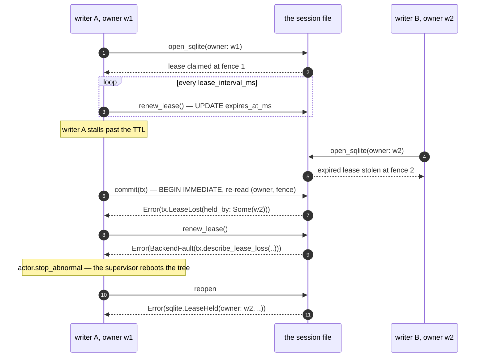
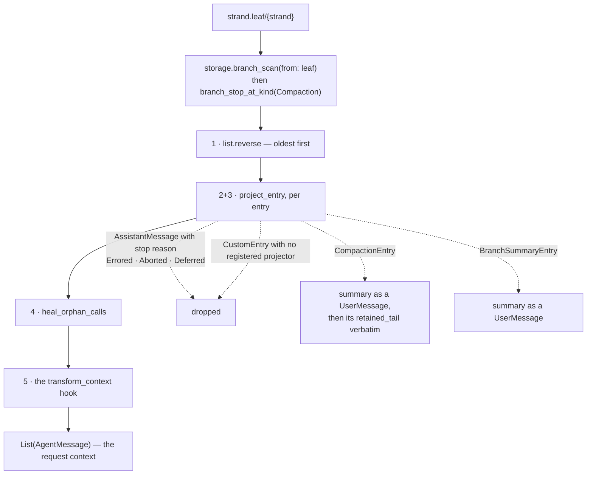
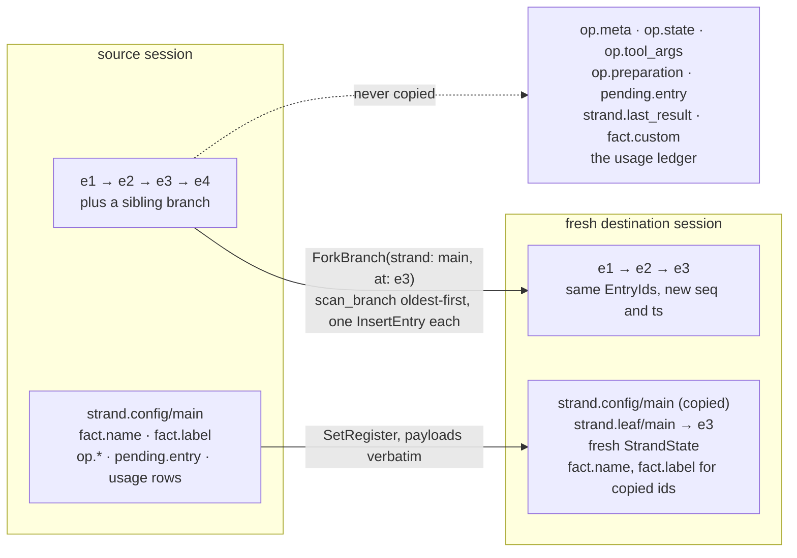

# session

`session` is the layer directly above `storage`. Storage stores rows and
answers queries; `session` is where those rows become a *session* — one
open handle with a writer lease under it, a strand's three registers
seeded on boot, the machine's register payloads read back as typed
values, and the branch scan turned into the message list a provider
request is built from.

It owns two modules and they answer two different questions.
`session/session` is everything *inside* one session: open it, seed it,
read it, project it. `session/repo` is everything *over* sessions — a
fork into a fresh destination, and the precise rewrite that is the only
sanctioned exception to "entries are never modified". Nothing here
decides anything about a model, a tool, or a sandbox; the layer above
does that, and the layer below has never heard of any of them.

## One session, one backend, erased

A `Session` is three fields:

```gleam
pub type Session {
  Session(
    store: Storage(Nil),
    renew_lease: fn() -> Result(Nil, StorageError),
    lease_interval_ms: Option(Int),
  )
}
```

The `Storage(Nil)` is the point. `storage.Storage(handle)` is a record of
functions closed over an opaque backend value; opening a session rebuilds
that record with every function closed over the *original* handle and
`Nil` in its place, so a session over SQLite and a session over memory
have the same type. Everything above this package — the runtime writer,
the client gateway, the conformance store — is written once and never
names a backend.

`open_memory` and `open_sqlite` are the two constructors.
`open_sqlite` runs `migration_chain()` under the open: an ordered list
of `sqlite.Migration` steps, each upgrading one storage version. The
chain is empty today because version 1 is the only version that has
existed; it exists as a seam so that the day a schema bump lands, the
question "what happens to files written by the previous build" already
has a place to be answered. A file from a *newer* build is refused
outright (`SqliteOpenFailed(sqlite.UnsupportedVersion(..))`) rather than
misread.

The other two fields are the lease.

## The writer lease, and the writer that lost it

Both backends are actors, so reads and writes on one session serialize
through one mailbox — inside the node, concurrency is handled by not
having any. Across OS processes an actor guarantees nothing, so the
SQLite backend keeps a `writer_lease` row: an owner, a monotonic fence,
and an expiry. `open_sqlite` claims it. `Session.renew_lease` renews it
without committing anything, and `lease_interval_ms` — a third of the
TTL, so a missed tick or two still leaves the lease alive — is the
timer the runtime's `StorageWriter` schedules itself on.

The interesting case is the one where renewal was too late.



Three things in that sequence are load-bearing. The fence is *bumped* on
a steal, so writer A is fenced out rather than merely stale — every
commit re-reads the `(owner, fence)` pair inside its own
`BEGIN IMMEDIATE` transaction and applies nothing when it does not
match. The refusal is a typed `core/tx.LeaseLost(held_by:)` and not a
string inside `Faulted`, because its remedy is the opposite of every
other commit failure's: reopen, never retry, and a caller that cannot
tell theft from a full disk cannot choose between them
(`protocol-change/005-lease-lost-commit-error.md`). And the read path
still has to flatten it — `StorageError` has no lease vocabulary — so
`renew_lease` reports `BackendFault(tx.describe_lease_loss(held_by))`,
which is what stops the writer, which is what makes the supervisor
re-run the open path, which re-acquires or refuses loudly.

`ensure_strand` flattens it the same way, for a different reason: it
runs before any supervision tree exists, so there is no tree to reboot
and nowhere for the value to go. Higher up, where a caller *can* act on
it, the distinction survives as a value — `runtime/api` maps it to
`SessionStolen(held_by:)`, which is deliberately not a `CommitFailed`.

A lease with no row at all reads back as `LeaseLost(held_by: None)`.
That is not a bug: a precise rewrite clears the table so the swapped-in
file starts unleased, and the conclusion for the old writer is the same.

## Boot seeding, and why it bypasses the writer

`ensure_strand` is the one call that makes a strand exist. It writes
three registers in one transaction — `strand.config`, `strand.leaf`
(seeded `None`, meaning the root), and a fresh `strand.state` with no
current operation — and guards all three with `Expect(..., seq: None)`,
which means *this cell must not exist*.

That CAS makes the call idempotent in both directions. An already-seeded
strand short-circuits before the commit, on the `strand.config` read. A
strand seeded concurrently by someone else loses the CAS, and
`StaleExpectation` is mapped to `Ok(Nil)` rather than an error — the
strand exists, which is what the caller asked for.

It is also the one commit in the system that does not go through
`runtime/writer`, because it runs before the supervision tree that
contains the writer has started. Every post-boot commit goes through the
writer, which is what makes "exactly one process commits to a session" a
structural claim.

## Every typed read carries the seq it was read at

Register payloads are stored by `core` as tagged JSON and decoded by
`machine/codec`. `session` is the seam between them: one accessor per
namespace, each returning a `Cell`.

```gleam
pub type Cell(payload) {
  Cell(seq: Seq, value: payload)
}
```

The seq is not incidental. Storage's `SeqExpectation` is a
compare-and-swap against the seq of the write that last set a cell, so
the `Cell` seq a caller read is exactly the input to the expectation it
must commit under. Dropping it and re-reading later is how lost updates
get in; returning it beside the value is how the type stops that being
an option.

The decode is total. A payload that does not decode comes back as
`SessionCorrupt(report)` — never a partial value, never a crash — and
the caller faults rather than continuing on a guess. `read_cell` is that
rule in six lines, and every accessor is one call to it with a different
codec.

## The projection

Before every generation the runtime needs the strand's context as a list
of `AgentMessage`s. That list is not stored anywhere: it is computed
from the branch, on demand, by `project`.



The scan stops **inclusively at the first compaction**, which is what
makes a compaction entry a real checkpoint rather than a hint: it
carries a complete copy of its retained tail, so reading past it would
be reading history it already replaced. That stop is also why the
projection's cost is bounded by the very thing it triggers.

Two of the five rules are worth stating plainly.

**Failed responses do not project.** An assistant message whose stop
reason is `Errored`, `Aborted`, or `Deferred` is dropped. A genuine
output-limit `Length` is *retained* — the model really did produce that
text, and truncating it out of the context would lose work. This is the
same rule that makes an overflow settlement harmless: `machine`
normalizes an overflow response to `error` at commit precisely so that
this drop rule removes it from every later context.

**Healing happens here, not at the fork.** A retained tool call whose
result appears nowhere later in the projected context — severed by a
fork boundary or a navigation — gets a synthetic `is_error` tool result
inserted directly after its assistant message, saying the outcome on
this branch is unknown. On a settled history it is a no-op, and that is
the property that matters: successive projections stay append-only, so
nothing has to be rewritten in the store to keep the conversation
well-formed.

`Projection` itself is opaque and built by `projection()` then
`with_projector(custom_type, ...)` and `with_transform(...)`. A custom
entry with no registered projector never enters context — the default
for an unknown application payload is to stay out of the model's view.
The transform is pi's `transform_context` hook: request-local, applied
last, never persisted. A `None` leaf projects to `[]` without invoking
it, since there is no request being constructed.

## A fork is a leaf pointing at an entry that already exists

Two different operations get called forking, and the difference is worth
being precise about.

**Fork in place** is one register write. Entries form a tree, a strand
is a name with a `strand.leaf` register, and pointing a second strand's
leaf at an existing entry gives you a second reader over one shared
tree. Nothing is copied and nothing is rewritten; the two strands
diverge as each appends, because two entries sharing a parent is all
branching ever is. `session` is where a leaf is first written and read
back (`ensure_strand` and `strand_leaf`, over `core/register`'s leaf
codec); `runtime/api.create_strand` is what performs the fork by seeding
a new strand's three registers with a `fork_point` as its leaf.

```mermaid
flowchart RL
    subgraph tree["one entry tree, shared"]
        e1["e1"]
        e2["e2"] -->|parent| e1
        e3["e3"] -->|parent| e2
        e4["e4"] -->|parent| e3
        f4["f4"] -->|parent| e2
    end
    LM["strand.leaf/main"] -.-> e4
    LS["strand.leaf/sub"] -.-> f4
    LR["strand.leaf/review"] -.-> e2
```



**`repo.fork`** is the other one: a copy of one coherent view of a
source session into a *fresh destination session*, as one atomic
destination transaction, with the source never touched.



The rules that shape it: **entry ids are preserved** but `seq` and `ts`
are re-stamped by the destination at its own commit, because those are
storage's word and the destination is a different store. **Register
payloads are copied verbatim** without decoding — a fork moves cells, it
does not interpret them. **The destination starts idle**: a fresh
`StrandState`, no operation registers, no pending payloads, and a cost
ledger at zero. And **the destination must be empty** — forking into a
session that already holds entries is refused with
`ForkDestinationNotEmpty`, because a fork must never splice two
histories together.

`ForkTree` copies everything instead: every entry, every strand's
configuration and leaf, every label. `ForkBranch` copies the ancestor
chain of one entry and labels only for the entries it copied.

Fork is defined over a *quiescent* source. Reads serialize through the
storage actor, but successive reads interleaved with a live writer's
commits could observe two half-states, so the caller — an admin surface,
never the harness hot path — must ensure nothing is committing.

## The precise rewrite

Entries are write-once. The one sanctioned exception is the precise
rewrite, and it exists for a single reason: erasing a leaked secret from
a transcript, provably, everywhere it can have reached.

A rewrite takes *two* transforms, and that is the whole design:

```gleam
pub type EntryRewrite =
  fn(Entry) -> Result(Option(Entry), CorruptionReport)

pub type ValueRewrite =
  fn(JsonValue) -> Result(Option(JsonValue), CorruptionReport)
```

`erase_text` and `erase_value` are the pair built from one needle.
`erase_text` works on the entry's *canonical JSON encoding*, so it
reaches every text an entry can carry — message blocks, thinking, tool
arguments, tool-result details, summaries, custom payloads, and the
retained-tail copies inside a compaction entry — and rewrites string
values only, leaving object keys alone because keys are structural. The
result is decoded back through `core/codec.decode_entry`, so a needle
that collides with structural vocabulary aborts the rewrite as
corruption instead of producing an unreadable store. `erase_value`
covers the stores an entry transform cannot reach: register payloads and
usage-details blobs, which is exactly where a secret also lives — a
queued pending message, a tool-arguments register, a frozen compaction
preparation.

The two backends differ in mechanism and agree on scope. `rewrite_sqlite`
delegates to `storage/sqlite.rewrite_into`, which holds the writer lease
for its whole duration under the reserved owner `"rewrite"`, retires the
WAL before the copy, works on a `VACUUM INTO` copy, vacuums it, and
replaces the original by atomic rename. `rewrite_memory` rebuilds the
session by replaying it into a fresh handle — and unlike a fork, it
retains *everything*: every register cell in every namespace (transformed,
not dropped) and every usage row. A rewrite erases content, not history.

`Ok(None)` from a transform means "leave this untouched", which is how
the rewrite counts what it actually changed. A transform that moves an
entry — changing its id, parent, or kind — is refused as corruption:
erasure is allowed to change what a row says, never where it sits.

## The modules

| Module | What it holds |
|---|---|
| `session/session` | `Session` and the two constructors, the migration chain, handle erasure, `ensure_strand`, the typed `Cell` accessors, and the whole projection pipeline. |
| `session/repo` | `fork` and its scopes, the `EntryRewrite`/`ValueRewrite` contracts, `erase_text`/`erase_value`, and the two rewrite drivers. |

Paths are relative to `packages/session/src/` — `session/repo` is
`packages/session/src/session/repo.gleam`.

## Reading further

- [`CLAUDE.md`](CLAUDE.md) — the reference doc for changing this code:
  key types, real dependency edges, commit and register traffic, and the
  invariants that break things when violated. Read it before editing.
- [`packages/storage/README.md`](../storage/README.md) — the store this
  package is one handle over: the three stores, the branch walk, the
  fenced lease, and the rewrite's file-level mechanics.
- [`docs/architecture/durability.md`](../../docs/architecture/durability.md)
  — the tree, branches, and strands the projection walks.
- [`docs/architecture/orchestration.md`](../../docs/architecture/orchestration.md)
  — where the projection sits in the drive loop.
- [`docs/architecture/compaction.md`](../../docs/architecture/compaction.md)
  — why a context scan stops at the first compaction, and what a
  compaction entry carries.
- [`protocol-change/005-lease-lost-commit-error.md`](../../protocol-change/005-lease-lost-commit-error.md)
  — why a stolen lease is a typed refusal.
- [`docs/spec-gaps.md`](../../docs/spec-gaps.md) — the recorded
  interpretations behind boot seeding, fork placement, healing, and what
  erasure leaves alone.
