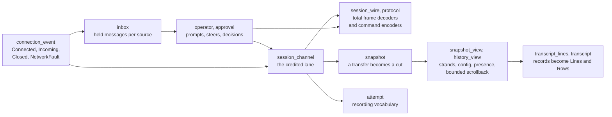
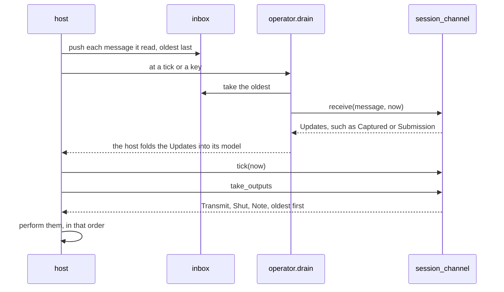

# session_view

`session_view` is the part of a Loom client that no host owns. It holds
the session lane that speaks the v2 conversation protocol, the total
decoders for what the daemon sends, snapshot adoption, the bounded
history window, the projection of a completed capture into transcript
lines, and what an operator's input becomes on the wire. Two hosts drive
it: the terminal (`packages/tui`) and the daemon's web view
(`packages/web_view`).

The package performs no I/O and holds no process. A host reads its own
mailbox, hands each message to the lane with the time it read, takes the
lane's outputs as data, and performs them. Where the lane has to name one
of the host's handles, it takes the handle as a type parameter:

```gleam
pub opaque type Channel(socket, recorder)

pub type Out(socket, recorder) {
  Transmit(socket: socket, frame: String)
  Shut(socket: socket)
  Note(recorder: recorder, event: attempt.Event)
}
```

The terminal fills those parameters with its websocket connection and its
recording; the web view fills them with a relay into the gateway and
`Nil`.

## Why it is a separate package

Two rules meet here.

**One home for session logic.** ADR-014 decided that the web view reuses
the terminal's engine and differs only in its view. What a frame means,
when to catch up, which lines a capture becomes, and what a reply settles
are decisions about the session, and each is made once, in this package.
A behaviour fixed here is fixed for both hosts, and session logic found in
`web_view` or duplicated in `tui` is a review finding.

**No host inside the engine.** Lint rule R6 holds `session_view` to the
same portable subset as `core`, `machine` and `prompt`: no `@external` of
any target, no import under `gleam/erlang` or `gleam/otp`, and no
`gleam_erlang` or `gleam_otp` in `gleam.toml`. For this package the point
is not the JavaScript target but the boundary: a socket, a clock, a
mailbox and a recording file each arrive as a BEAM-only import, so the
rule keeps whichever host is driving the lane out of it. The package
depends on `core`, `machine` and the standard library, and nothing else.

## The modules



An arrow reads "hands its values to" or "is built on". `operator.drain`
is the loop both hosts use to feed held messages to the lane, and
`operator.submit` and `operator.decide` are the only ways either host
turns input into a mutation.

## One reduction, as a host sees it



The lane never performs anything. Its transitions queue outputs, and each
output names the handle it acts on, so a frame decided against one socket
is written to that socket even if the host replaces the lane later in the
same step.

## A tour, in reading order

1. **`connection_event`.** `Message` is `Connected`, `Incoming(text)`,
   `Closed(reason)` or `NetworkFault(reason)`: what one conversation
   connection can tell its reader, as data. Each host maps its transport's
   events into it.
2. **`inbox`.** `Inbox(source, a)` holds what a host received from one
   source and has not reduced, oldest first, with the host's name for the
   source. `push` files behind what is held and `take` returns the oldest.
   Replacing a lane's inbox replaces the whole value, so nothing a replaced
   source delivered can reach a reducer afterwards.
3. **`session_wire` and `protocol`.** `session_wire.decode` splits a frame
   into a correlated reply, which must answer the one outstanding request
   exactly, or a push. `protocol` is the client's view of the ClientGateway
   event union and its command constructors. Durable entries decode
   through `core/codec`, the server's own total boundary.
4. **`session_channel`.** The lane. It moves through `AwaitingBegin`,
   `Receiving`, `Ready`, `AwaitingReply` and `Closed`; one request owns the
   wire at a time; a snapshot arrives chunk by chunk, one credit each, and
   becomes visible only at its end; an idle lane issues a credited
   `catch_up` every 250 ms. It can hold one unsent mutation behind a
   capture and send it exactly once, and a lost reply becomes
   `UnknownOutcome`, never a retry. It reports to the host as `Update`
   values, of which `Captured(cut, view, trigger)` is the only one that
   replaces what the host draws. `in_flight` says whether a request is
   out, which both hosts use to decide when to wake, and `can_mutate`
   refuses a mutation on an observer's attachment.
5. **`snapshot`, `snapshot_view` and `history_view`.** `snapshot` assembles
   a credited transfer into a validated cut (`Captured`), and the lane
   refuses a cut whose attachment is not the `Expected` session, epoch and
   incarnation it was started for. `snapshot_view`
   decodes the cut's metadata into strands, operations, configuration and
   presence. `history_view` keeps a bounded, pageable window of a strand's
   ancestry, separate from the live cut.
6. **`transcript_line`, `transcript_lines` and `transcript`.** A `Line` is a
   speaker and a text, before Markdown and wrapping. `transcript_lines`
   decides which lines a durable record, a stream or a tool call becomes,
   reading a `Presentation` record that each host fills rather than any
   host's model. `transcript.project` and `project_rows` run the same steps
   from one capture for a host that keeps no presentation state; each
   `Row` carries a key built from the durable sequence it came from, which
   a keyed view list can use.
7. **`operator` and `approval`.** `operator.submit` sends a `Prompt` or a
   `Steer`; `operator.decide` encodes `AllowOnce`, `AllowForSession` or
   `Deny` so that it echoes the drawn escalation's action digest, grants
   and sequence exactly; `operator.drawn` finds a pending record only by
   the identity and sequence it was drawn at. `approval` translates the
   stored escalation into what a decision must echo.
8. **The rest** are the pieces those decode or fold through: `attempt`
   (the recording vocabulary of one attachment attempt), `text_hygiene`
   (the terminal-safety pass every untrusted string goes through),
   `block_summary`, `advisor_history`, `advisor_pending`, `command`,
   `skills`, `composer`, `pasted_image`, `queued_input`, `context_view`,
   `file_read_view`, `goal_view`, `live_jobs`, `notes_view`,
   `stream_identity`, `todo_board`, `tool_activity` and `worktree_view`.
   Some have terminal-sounding names; each holds only the part that
   decides something about the session, and the editor, file read or
   drawing it serves stays in the host.

Paths are relative to `packages/session_view/src/`: `session_channel` is
`packages/session_view/src/session_view/session_channel.gleam`.

## How it is tested

- **In this package**, `make check-session_view` runs the tests in
  `test/`: the inbox's ordering (`inbox_test`), the operator's command arms
  and drain (`operator_test`), the projection (`transcript_test`), and the
  hygiene pass's prefix guarantee (`text_hygiene_test`).
- **The lane's invariants** are property-tested in
  `packages/tui/test/session_channel_property_test.gleam`, which drives it
  with generated sequences of frames, ticks and submissions and checks one
  request on the wire, no resent mutation and per-socket output order,
  with no socket at all.
- **The cross-process protocol** the lane takes part in is a P model in
  `protocol/models/terminal-attachment/`, whose invariants pair with those
  property tests.
- **Both hosts** exercise it end to end: the terminal's suites and replay
  goldens in `packages/tui`, and `client/web_view_parity_test`, which
  checks that the web view draws the same lines as the terminal for the
  same capture.
- **The boundary** is lint R6, which fails `make check` if the package
  gains an external or a BEAM-only dependency.

## Reading further

- [`CLAUDE.md`](CLAUDE.md): key types, dependency edges and invariants, in
  the form to read before changing this package.
- [The client engine and its hosts](../../docs/architecture/client.md#the-client-engine-and-its-hosts):
  where this package sits among the pure packages and the two hosts.
- [The terminal client](../../docs/architecture/terminal.md) and
  [the web view](../../docs/architecture/web-view.md): the two hosts.
- [ADR-013](../../docs/adr/013-tui-effects-as-values.md): why the lane's
  effects are values, and the phase 4 addendum that extracted this
  package.
- [ADR-014](../../docs/adr/014-second-runtime.md): one engine, two views.
- [The client protocol](../../docs/client-protocol.md): the wire the lane
  speaks.
