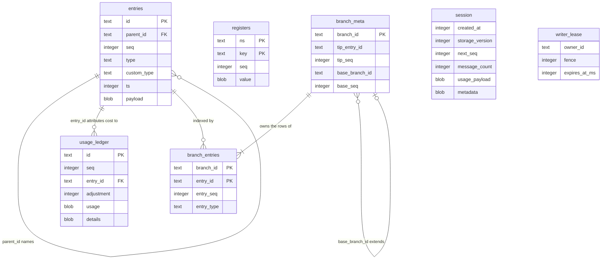
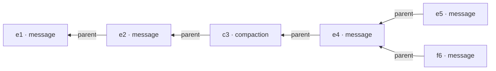
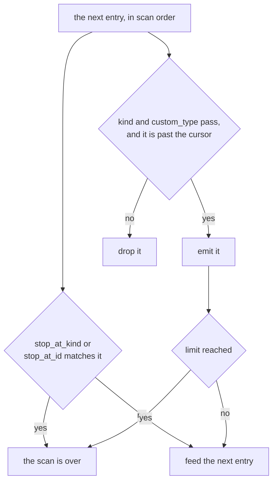
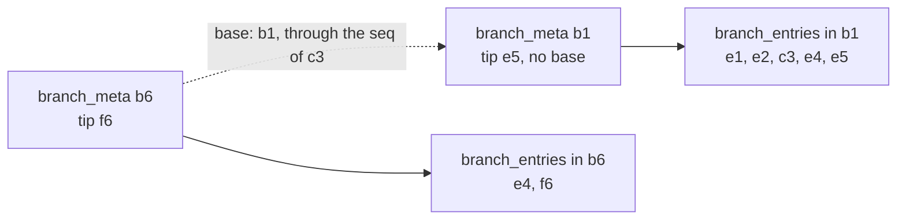
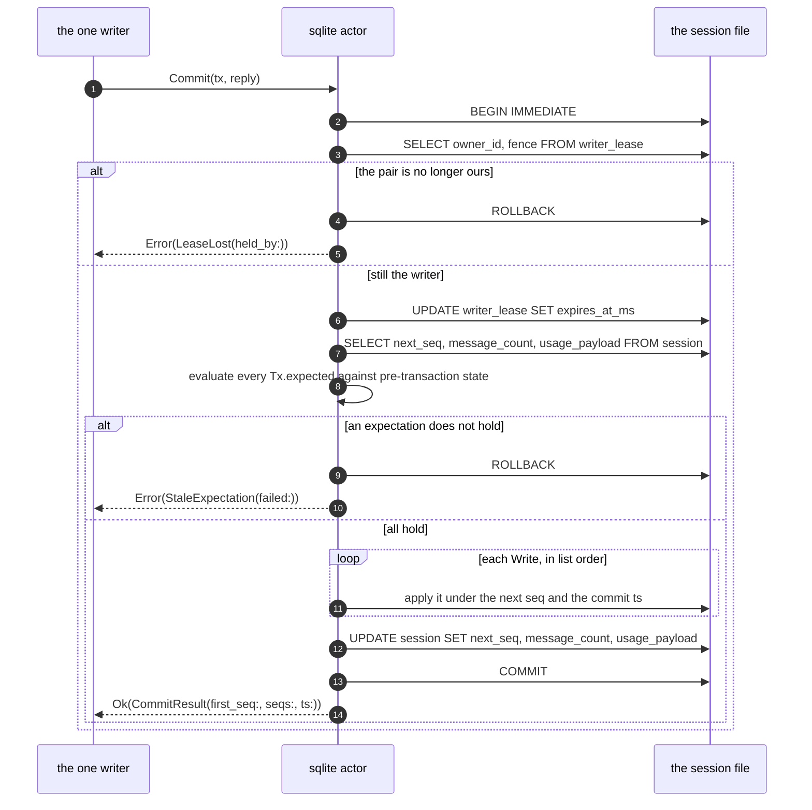

# storage

`storage` is one session's durable store behind a single backend-agnostic
handle. It stores rows and answers queries, and it decides nothing: no
model, no tool, and no sandbox is visible from here. Two backends ship —
`memory`, the storage model written as pure data inside an actor, and
`sqlite`, one database file per session — and one conformance suite
defines what "correct backend" means for both.

The handle is a record of functions closed over an opaque backend value,
so callers are written once:

```gleam
pub type Storage(handle) {
  Storage(
    handle: handle,
    commit: fn(handle, Tx) -> Result(CommitResult, CommitError),
    get_entries: ..., get_register: ..., list_registers: ...,
    scan_branch: ..., scan_entries: ..., scan_usage: ...,
    stats: ..., close: ...,
  )
}
```

`session` erases the handle type to `Storage(Nil)`, which is why nothing
above this package ever names a backend.

## Three stores, and one of them is mutable

Every durable payload lives in exactly one of three stores. **Entries**
are the conversation tree, write-once and never modified. **Registers**
are namespaced cells that a write replaces in place, with no history.
**Usage** is an append-only ledger of cost rows. Everything else that
looks like state — the session statistics, the SQLite branch index — is a
*projection*: derived, rebuildable, and wrong by definition whenever it
disagrees with the store it derives from.

In the SQLite backend that maps onto one file, and the file *is* the
session: corruption is confined to it, deleting a session is unlinking a
file, and moving one between machines is a copy.



Payloads are JSON blobs; the columns beside them are exactly the fields
queries filter and order on, so no plan ever decodes a payload to decide
whether it wants the row. The single `session` row carries both the seq
allocator and the statistics projection (and, in its `metadata` blob, the
rewrite generation counter), which is why every commit reads it before it
writes it.

## A branch is a walk, not a row

Entries form a tree. Each names its parent or is a root, and a parent that
does not exist is corruption rather than a dangling reference. Two entries
may share a parent — that is all branching is, and nothing is rewritten to
make room for it.



There is no "branch" object anywhere in the schema. A branch is the path
from an entry back to the root, computed on demand by `scan_branch`. Two
readers therefore see two different conversations over one shared tree:

| Query | What comes back |
|---|---|
| `branch_scan(from: e5) \|> branch_stop_at_kind(Compaction)` | `e5, e4, c3` |
| `branch_scan(from: f6) \|> branch_stop_at_kind(Compaction)` | `f6, e4, c3` |
| `branch_scan(from: f6)` | `f6, e4, c3, e2, e1` |

`stop_at_kind(Compaction)` is what the context projection uses, because a
`CompactionEntry` carries its own complete retained suffix — reading past
it would be reading history the compaction already replaced.

### The refinement pipeline

Both backends produce the ordered path differently (memory walks parent
pointers, SQLite streams index segments) and then feed it through one
shared pipeline, `storage/internal/branch.step`, one entry at a time.



The two decisions are independent, and that is the subtle part: the stop
truncates the path *before* the filter and the cursor see it. A scan never
runs past its stop to fill a page, so the compaction that ends a context
window ends the scan even when a `kind` filter would have dropped that
compaction from the results. A limit of zero or below returns no rows —
never "no limit" — because callers compute limits like `budget - consumed`
and a negative result must mean nothing is left.

### Why SQLite keeps a segmented index

Walking parent pointers is fine in memory and unacceptable in SQL, where
it costs one query per ancestor. So the SQLite backend maintains a private
index of **segments**: runs of the tree in `branch_entries`, each with a
`branch_meta` row naming its tip and, optionally, a **base** — another
segment and a seq through which that segment's rows count as this one's.



Diverging at `e4` copies rows back only as far as the newest compaction on
that path and links the base there. Bounding the copy at a compaction is
what stops the index growing quadratically with branching, and it is safe
precisely because a context scan stops at the first compaction anyway. A
scan from `f6` reads b6's rows down to c3's seq and then continues in b1.

Two rules keep that correct, and both are easy to get wrong: a base must
cover the anchor *within its own logical range* (the code satisfies this
by resolving the covering segment through a physical `branch_entries` row,
which always lies inside that segment's range), and the search for the
newest compaction must traverse the base chain rather than checking only
the newest physical segment. A cyclic base chain is reported as corruption
rather than looped over.

An index the query planner declines to use is not an optimization, so the
plan itself is contract. The segment page query reads
`FROM branch_entries b CROSS JOIN entries e ON e.id = b.entry_id`, and the
`CROSS JOIN` is load-bearing — it forces `branch_entries` to be the outer
loop. `sqlite.scan_branch_plan` exposes the `EXPLAIN QUERY PLAN` output
and the conformance suite fails the build on any `TEMP B-TREE FOR ORDER
BY` step or scan of `entries`.

## What a commit actually does

A transaction is an ordered list of writes plus a list of expectations,
applied all-or-none. Nothing is applied until everything has been checked,
and a refused commit consumes no seqs — a session that rejected a hundred
transactions is byte-for-byte the session that never saw them.



Three details in that sequence are not incidental. **`BEGIN IMMEDIATE`,
always** — allocating the seq range reads `session.next_seq` before
writing it, so every commit reads before it writes, and a deferred `BEGIN`
takes a read snapshot it may be unable to upgrade with no busy timeout
able to rescue it. **The lease check comes first**, so a fenced-out writer
applies nothing. And **expectations are evaluated before any write**,
which is what makes them compare-and-swap rather than a validation pass.

`SeqExpectation` is that CAS. Every register cell remembers the seq of the
write that last set it; `Expect(ns, key, Some(n))` means *this cell must
still be at seq n*, and `seq: None` means *this cell must not exist*. A
transaction with no writes and only expectations is legal — a bare
assertion about the world, committed like anything else.

## One writer, enforced twice

Inside the node, concurrency is handled by not having any. Both backends
are actors, so every commit and every read is a message to one process and
ordering is mailbox order. "Transactions on one session are serialized" is
structural, not a rule someone must remember.

Across OS processes an actor guarantees nothing, and write-ahead logging
happily lets two processes alternate writes to one file. The SQLite
backend therefore adds a **fenced lease**: a row naming the owner, a
monotonic fence, and an expiry. `open` claims it, refusing an unexpired
one with `LeaseHeld` and stealing an expired one with a *bumped* fence.
That bump is what makes the old holder harmless — every commit re-reads
the pair inside its own transaction, so a fenced-out writer that wakes up
and commits gets `tx.LeaseLost(held_by:)` and applies nothing. `close`
deletes only the writer's own pair, so a stale owner shutting down cannot
release its replacement's lease.

`LeaseLost` is a value rather than a `Faulted` reason string because its
remedy is the opposite of every other commit failure's: reopen, never
retry (`protocol-change/005`). The read path still has to flatten it,
since `StorageError` has no lease vocabulary — `renew_lease` reports
`BackendFault(tx.describe_lease_loss(..))`, which is what stops the
runtime's writer.

Opening runs in refuse-before-write order for the same reason. One
`BEGIN IMMEDIATE` admission transaction reads the stored version, refuses
a newer file (`UnsupportedVersion(found, supported)`), an older one the
caller's migration chain cannot reach, or a held lease — all with the file
byte-untouched — and only then claims the lease. Schema DDL, the migration
chain, and the WAL journal switch run after that, under the lease. The
same transaction serializes racing creators, so N concurrent opens of a
fresh path write exactly one catalog row and every loser gets an in-band
`OpenError`.

## Two backends, one definition of correct

`storage/memory` is the storage model as pure data: a `MemoryState` of
entries, a children index, registers, the ledger, the stats projection,
and the next seq. Every mutation is a pure function returning either a
fully applied successor state or an error and no state at all, which is
what makes all-or-none trivially true there. A thin actor wraps it to
provide the handle and thread the injected clock.

Neither backend's correctness is defined in prose. It is defined by
`conformance/storage_suite`, one suite parameterized over a backend
constructor and run against both: atomicity, seq ordering and legal gaps,
the shared id namespace, the full expectation matrix, branch scans across
every combination of stop, filter, cursor and limit, catch-up reads, close
idempotence, and statistics equal to the ledger sum after *every* commit.
Its hardest clause is a branching torture script: after every commit,
every entry ever written must scan to exactly its root path, tracked
independently by parent pointers. Three checks are SQLite-only, being
about the file rather than the model — the writer-lease duel, the
query-plan assertions, and the branch-index metadata invariants.

## The precise rewrite

Entries are write-once, and `sqlite.rewrite_into` is the sole sanctioned
exception — the mechanism behind erasing a leaked secret from a
transcript. It is offline by construction: an unexpired writer lease
refuses it with `RewriteLeaseHeld`, and the rewrite then claims and holds
the lease itself under the reserved owner `"rewrite"` for its whole
duration, re-verifying the claim immediately before the rename.

It works on a `VACUUM INTO` copy and only an atomic rename replaces the
original, so every failure path leaves the original's content untouched.
Leaving no erased bytes behind takes three further steps that are easy to
omit: the source's WAL is retired *before* the copy is taken (SQLite would
otherwise replay a matching WAL into the swapped-in file and resurrect the
erased text), the copy is vacuumed so replaced content does not survive in
free pages, and the leftover `-wal`/`-shm` siblings are unlinked after the
swap with failures propagated rather than discarded. Every rewrite bumps a
`generation` counter, which is how an external index learns its cursors
are invalid.

## The modules

| Module | What it holds |
|---|---|
| `storage/storage` | The backend-agnostic handle, the three scan query types and their builders, `StorageError`, the normative commit rules. |
| `storage/memory` | The pure `MemoryState` model plus its actor wrapper. |
| `storage/sqlite` | Schema, migrate-on-open, the fenced lease, the commit path, the segmented branch index, plan introspection, the precise rewrite. |
| `storage/internal/branch` | The shared incremental stop/filter/cursor/limit pipeline. |

Paths are relative to `packages/storage/src/` — `storage/sqlite` is
`packages/storage/src/storage/sqlite.gleam`.

## Reading further

- [`CLAUDE.md`](CLAUDE.md) — the reference doc for changing this code: key
  types, real dependency edges, actor and wire traffic, and the invariants
  that break things when violated. Read it before editing.
- [`docs/architecture/durability.md`](../../docs/architecture/durability.md)
  — the plane in full: the three stores, identity, the segmented index,
  query plans as contract, crash behaviour.
- [`docs/adr/002-sqlite-binding.md`](../../docs/adr/002-sqlite-binding.md)
  — why `sqlight`.
- [`protocol-change/005-lease-lost-commit-error.md`](../../protocol-change/005-lease-lost-commit-error.md)
  — why a stolen lease is a typed refusal.
