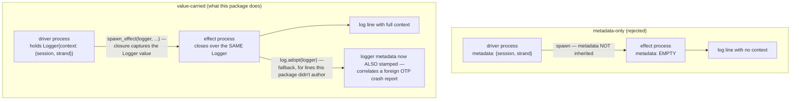
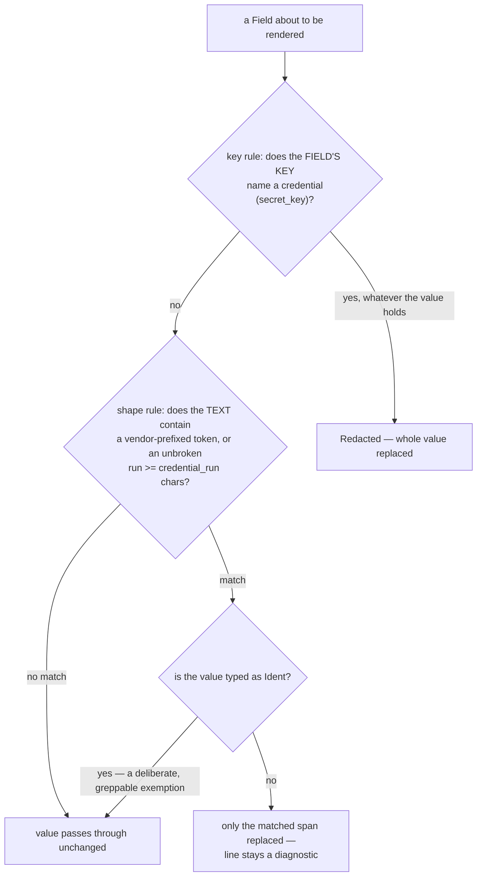
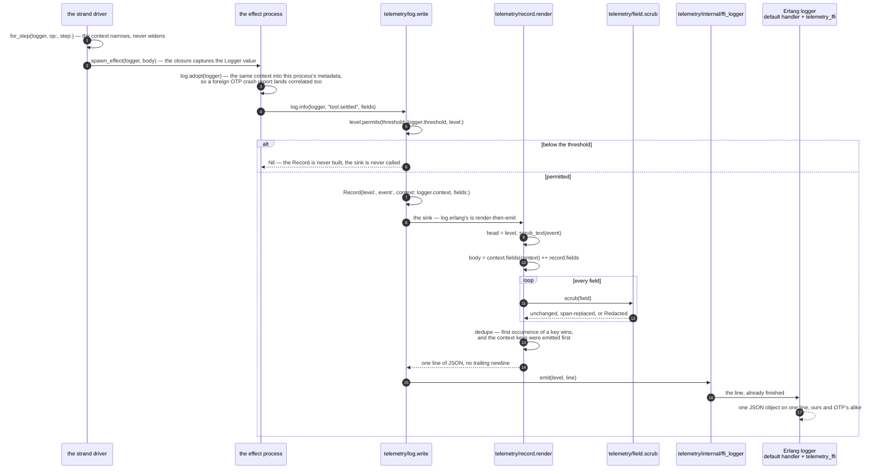

# telemetry

`telemetry` is structured logging, and precisely nothing else (spec
§3.4): one JSON line per event, emitted through Erlang's own `logger`,
carrying `{session, strand, op, step}` correlation on every line that
knows those coordinates. It is a leaf package over `core` alone, so
every impure package in the tree can depend on it without picking up
anything but the standard library — and it is deliberately
write-only. Nothing here reads a log line back, and nothing here may
ever be given authority over a durable row: the conversation store stays
the record, and the usage ledger stays the billing source of truth. A
package that was handed no logger uses `telemetry/log.discard()`, which
emits nothing — logging can never be the reason a library test needs a
running VM.

## Why correlation is a value, not `logger`'s process metadata

This is the one decision worth understanding before adding a call site
anywhere in the tree, because the obvious design is the wrong one, and
it fails silently.

Erlang `logger`'s process metadata is per-process and is **not**
inherited across `spawn`. Loom's effect sandwich is nothing but spawns —
every provider request, every tool run, every parked escalation call
happens on a fresh process `runtime/strand_runtime.spawn_effect` starts.
A metadata-only design would therefore lose correlation at exactly the
point interleaved strands make it matter, and the failure mode is
worse than a crash: the lines still appear, they just read as one
coherent story that never happened, because two strands' log lines land
uncorrelated in the same stream.

So the context rides in a `Logger` value that each call site already
holds by injection, and the compiler enforces the capture: the closure
handed to `spawn` cannot forget the value the way a process could forget
to re-read ambient state. `log.adopt` is the one concession to metadata,
and it is additive rather than the mechanism — it stamps the same
context into the spawned process's `logger` metadata too, purely so an
OTP crash report about *that* process (never authored by this package,
so never routed through the value) lands correlated instead of orphaned.
Our own lines never read metadata back.

## The two redaction rules, and why either alone has a hole

No log line may carry a token, an API key, or a capability token (spec
§3.3.4). One rule cannot catch every shape a secret arrives in, so
`telemetry/field` runs two independent ones:

The key rule catches a secret filed under an honest name regardless of
its shape. The shape rule catches a secret that leaked into free text
under an innocent key — an error message that echoes back an API key,
say — regardless of what the field was called. Neither alone is
sufficient: a key rule alone misses a credential pasted into a message
string; a shape rule alone misses a value that simply doesn't look like
any known credential shape. `Ident` is the typed opt-out from the shape
rule alone — a 32-character unbroken run is also what a loom-minted
digest looks like, so a value has to be deliberately marked `Ident` by an
author who knew what it was, and that mark cannot rescue a value whose
*key* already said "credential". `telemetry/redaction_test` plants a
provider key, a clearance token, and a channel token under both a
denylisted and an innocent key and greps the rendered bytes for all of
them.

## One event, call site to line

Both mechanisms above meet in one call. Follow a `tool.settled` from the
effect process that emits it to the byte stream it lands in.

Two properties of that trace are the reason it is shaped this way. The
threshold is consulted **before** the record is built, so a filtered-out
debug line costs an integer comparison and nothing else — which is why
`Logger` is opaque, since a caller that could reach the sink directly
could skip the check. And everything between `write` and `emit` is pure:
`render` takes no clock, no process and no handler, so the redaction rules
are testable by grepping plain bytes, and the formatter on the other side
of the FFI has nothing left to decide.

The sink is the seam. `log.erlang` renders and emits; `log.to_subject`
sends the `Record` itself to a test inbox, which is how the redaction
tests read fields back without a handler; `log.tee` runs two; and
`log.discard` is a sink that does nothing, which is what a package handed
no logger uses so that logging is never the reason a library test needs a
running VM.

## What else the invariants pin down

A log record carries no timestamp of its own — the handler stamps
`logger`'s own clock, because `core`'s injected `Clock` is threaded
through id minting, and a log call that consumed a step from it would
change what the system durably records for the sake of observing it.
Rendering (`telemetry/record.render`) is pure — no clock, no process, no
handler — which is what makes the redaction rules testable by grepping
plain bytes rather than standing up a VM. And only an entry point calls
`telemetry/handler.install`: a library that installed a handler would
silently reconfigure the VM of whatever embedded it.

## The modules

| Module | What it holds |
|---|---|
| `telemetry/level` | The four levels, `parse`, `permits`, the level policy (read its module doc before adding a call site). |
| `telemetry/context` | The four correlation slots, `merge`, `fields`. |
| `telemetry/field` | `Field`/`Value`, `scrub`/`scrub_text`, the two redaction rules as pure functions. |
| `telemetry/record` | One event, and its pure, total rendering to one JSON line. |
| `telemetry/log` | The injected `Logger` seam: `new`, `discard`, `scoped`/`for_strand`/`for_step`, `debug`/`info`/`warn`/`error`, `adopt`. |
| `telemetry/handler` | Boot-time installation and `LOOM_LOG_LEVEL` resolution. |

Paths are relative to `packages/telemetry/src/` — `telemetry/context` is
`packages/telemetry/src/telemetry/context.gleam`.

## Reading further

- [`CLAUDE.md`](CLAUDE.md) — the reference doc for changing this code:
  key types, real dependency edges, and the invariants that break things
  when violated. Read it before editing.
- [`docs/loom-implementation-spec.md`](../../docs/loom-implementation-spec.md)
  — §3.4, what this package exists for; §3.3.4, the secret invariant it
  enforces.
- [`docs/architecture/effects.md`](../../docs/architecture/effects.md) —
  where secrets are allowed to live, and why logs are not on that list.
- [`packages/runtime/CLAUDE.md`](../runtime/CLAUDE.md) — the injected
  logger threaded through the drive loop, and `spawn_effect`'s use of
  `log.adopt`.
- [`docs/spec-gaps.md`](../../docs/spec-gaps.md) — "From §3.4
  (`telemetry`)": the propagation decision, the level policy, and what
  was deliberately left as a seam (OpenTelemetry export).
