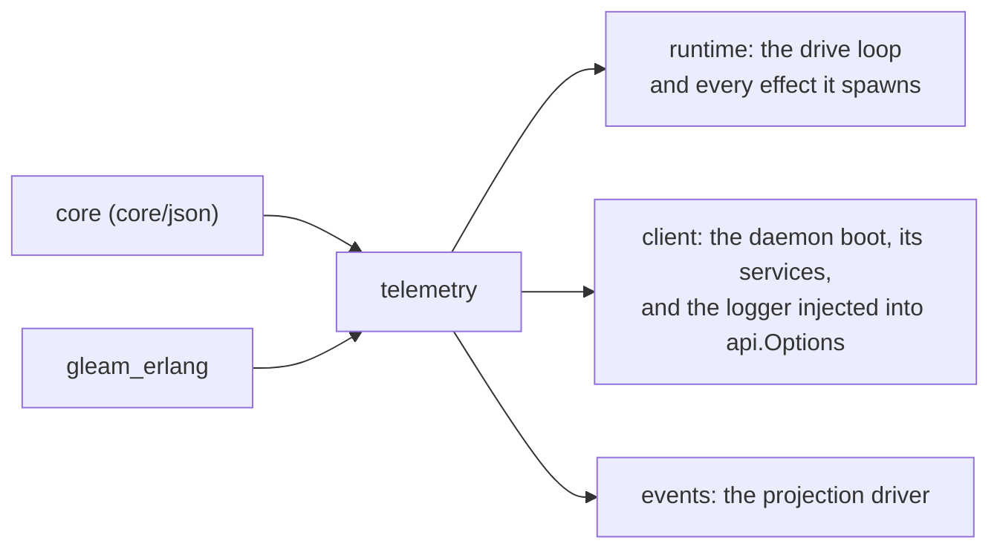
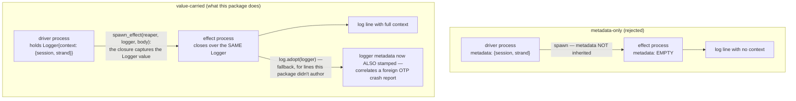
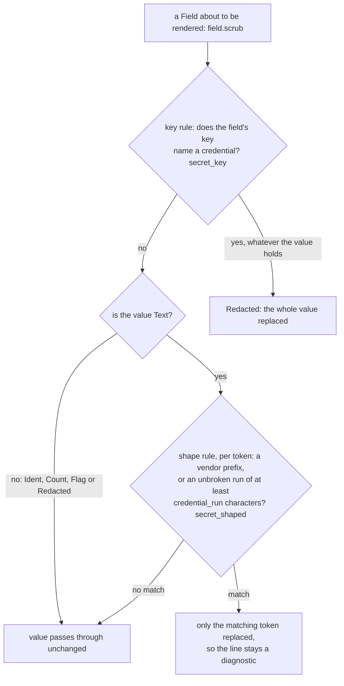
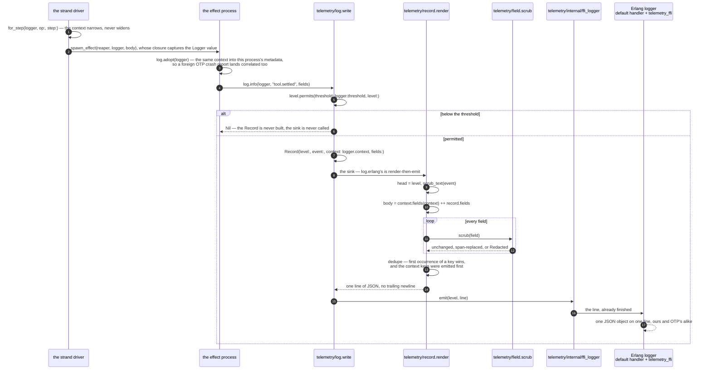

# telemetry

`telemetry` is structured logging and nothing else (spec §3.4): one JSON
line per event, emitted through Erlang's own `logger`, carrying
`{session, strand, op, step}` correlation on every line that knows those
coordinates. It is a separate package so that every impure package can
share one logging seam and one redaction rule without taking on anything
heavier. Its only dependencies are `core` (for the `core/json` serializer)
and `gleam_erlang` (for the `Subject` a test sink sends to), and it starts
no process.

The package is write-only. Nothing here reads a log line back, and no log
line may be given authority over a durable row: the conversation store
stays the record, and the usage ledger stays the billing source of truth.
A package that was handed no logger uses `telemetry/log.discard()`, which
emits nothing, so logging is never the reason a library test needs a
running VM.

```mermaid
flowchart LR
    core["core (core/json)"] --> telemetry
    gleam_erlang --> telemetry
    telemetry --> runtime["runtime: the drive loop<br/>and every effect it spawns"]
    telemetry --> client["client: the daemon boot, its services,<br/>and the logger injected into api.Options"]
    telemetry --> events["events: the projection driver"]
```

## Why correlation is a value, not `logger`'s process metadata

This is the one decision worth understanding before adding a call site
anywhere in the tree, because the obvious design is the wrong one, and
it fails silently.

Erlang `logger`'s process metadata is per-process and is **not**
inherited across `spawn`. Loom's effect sandwich is nothing but spawns:
every provider request, every tool run and every parked escalation call
happens on a fresh process that `runtime/strand_runtime` starts through
`spawn_effect` or `spawn_provider_effect`.
A metadata-only design would therefore lose correlation at exactly the
point interleaved strands make it matter, and the failure mode is
worse than a crash: the lines still appear, they just read as one
coherent story that never happened, because two strands' log lines land
uncorrelated in the same stream.

```mermaid
flowchart TD
    subgraph Wrong["metadata-only (rejected)"]
        D1["driver process<br/>metadata: {session, strand}"] -->|spawn — metadata NOT inherited| E1["effect process<br/>metadata: EMPTY"]
        E1 --> L1["log line with no context"]
    end
    subgraph Right["value-carried (what this package does)"]
        D2["driver process<br/>holds Logger{context: {session, strand}}"] -->|"spawn_effect(reaper, logger, body):<br/>the closure captures the Logger value"| E2["effect process<br/>closes over the SAME Logger"]
        E2 --> L2["log line with full context"]
        E2 -->|"log.adopt(logger) —<br/>fallback, for lines this package didn't author"| M2["logger metadata now ALSO stamped —<br/>correlates a foreign OTP crash report"]
    end
```

So the context rides in a `Logger` value that each call site already
holds by injection, and the compiler enforces the capture: the closure
handed to `spawn` cannot forget the value the way a process could forget
to re-read ambient state. `log.adopt` is the one concession to metadata,
and it is additive rather than the mechanism — it stamps the same
context into the spawned process's `logger` metadata too, purely so an
OTP crash report about *that* process (never authored by this package,
so never routed through the value) lands correlated instead of orphaned.
Our own lines never read metadata back.

## The two redaction rules, and why either alone has a hole

No log line may carry a token, an API key, or a capability token (spec
§3.3.4). One rule cannot catch every shape a secret arrives in, so
`telemetry/field` runs two independent ones:

```mermaid
flowchart TD
    F["a Field about to be rendered: field.scrub"]
    KR{"key rule: does the field's key<br/>name a credential? secret_key"}
    TX{"is the value Text?"}
    SR{"shape rule, per token: a vendor prefix,<br/>or an unbroken run of at least<br/>credential_run characters? secret_shaped"}
    OUT_R["Redacted: the whole value replaced"]
    OUT_S["only the matching token replaced,<br/>so the line stays a diagnostic"]
    OUT_OK["value passes through unchanged"]

    F --> KR
    KR -->|"yes, whatever the value holds"| OUT_R
    KR -->|no| TX
    TX -->|"no: Ident, Count, Flag or Redacted"| OUT_OK
    TX -->|yes| SR
    SR -->|no match| OUT_OK
    SR -->|match| OUT_S
```

The key rule catches a secret filed under an honest name regardless of
its shape. The shape rule catches a secret that leaked into free text
under an innocent key — an error message that echoes back an API key,
say — regardless of what the field was called. Neither alone is
sufficient: a key rule alone misses a credential pasted into a message
string; a shape rule alone misses a value that simply doesn't look like
any known credential shape. `Ident` is the typed opt-out from the shape
rule alone — a 32-character unbroken run is also what a loom-minted
digest looks like, so a value has to be deliberately marked `Ident` by an
author who knew what it was, and that mark cannot rescue a value whose
*key* already said "credential". `telemetry/redaction_test` plants a
provider key, a clearance token, and a channel token under both a
denylisted and an innocent key and greps the rendered bytes for all of
them.

## One event, call site to line

Both mechanisms above meet in one call. Follow a `tool.settled` from the
effect process that emits it to the byte stream it lands in.

```mermaid
sequenceDiagram
  autonumber
  participant D as the strand driver
  participant E as the effect process
  participant L as telemetry/log.write
  participant R as telemetry/record.render
  participant F as telemetry/field.scrub
  participant FFI as telemetry/internal/ffi_logger
  participant H as Erlang logger<br/>default handler + telemetry_ffi

  D->>D: for_step(logger, op:, step:) — the context narrows, never widens
  D->>E: spawn_effect(reaper, logger, body), whose closure captures the Logger value
  E->>E: log.adopt(logger) — the same context into this process's metadata,<br/>so a foreign OTP crash report lands correlated too
  E->>L: log.info(logger, "tool.settled", fields)
  L->>L: level.permits(threshold: logger.threshold, level:)
  alt below the threshold
    L-->>E: Nil — the Record is never built, the sink is never called
  else permitted
    L->>L: Record(level:, event:, context: logger.context, fields:)
    L->>R: the sink — log.erlang's is render-then-emit
    R->>R: head = level, scrub_text(event)
    R->>R: body = context.fields(context) ++ record.fields
    loop every field
      R->>F: scrub(field)
      F-->>R: unchanged, span-replaced, or Redacted
    end
    R->>R: dedupe — first occurrence of a key wins,<br/>and the context keys were emitted first
    R-->>L: one line of JSON, no trailing newline
    L->>FFI: emit(level, line)
    FFI->>H: the line, already finished
    H-->>H: one JSON object on one line, ours and OTP's alike
  end
```

Two properties of that trace are the reason it is shaped this way. The
threshold is consulted **before** the record is built, so a filtered-out
debug line costs an integer comparison and nothing else — which is why
`Logger` is opaque, since a caller that could reach the sink directly
could skip the check. And everything between `write` and `emit` is pure:
`render` takes no clock, no process and no handler, so the redaction rules
are testable by grepping plain bytes, and the formatter on the other side
of the FFI has nothing left to decide.

The `Sink` type, `fn(Record) -> Nil`, is where output is swapped.
`log.erlang` builds a logger whose sink renders and emits. `log.to_subject`
is a sink that sends the `Record` itself to a caller's subject, which is how
`log_test` reads records back without a handler. `log.tee` fans one record
out to two sinks, which is also where an OpenTelemetry exporter would
attach; none has been built. `log.discard` is a logger whose sink does
nothing.

## What else the invariants pin down

A log record carries no timestamp of its own. The handler stamps
`logger`'s own clock instead, because `core`'s injected `Clock` is threaded
through id minting, and a log call that consumed a step from it would
change what the system durably records for the sake of observing it. Only
an entry point calls `telemetry/handler.install`: a library that installed
a handler would silently reconfigure the VM of whatever embedded it.

## The modules

Read them in this order. Paths are relative to `src/`, so
`telemetry/context` is `src/telemetry/context.gleam`.

| Module | What it holds |
|---|---|
| `telemetry/level` | `Level` (`Debug`, `Info`, `Warning`, `Error`), `parse`, `permits`, `severity`, and the level policy in its module doc; read it before adding a call site. |
| `telemetry/context` | `Context`, the four optional correlation slots, with `merge` and `fields`. `with_op` clears the step. |
| `telemetry/field` | `Field` and `Value` (`Text`, `Ident`, `Count`, `Flag`, `Redacted`), and the two redaction rules as pure functions: `scrub`, `scrub_text`, `secret_key`, `secret_shaped`. |
| `telemetry/record` | `Record`, one event, and its pure, total rendering to one JSON line (`to_json`, `render`). |
| `telemetry/log` | The opaque `Logger` and the `Sink` type: `new`, `discard`, `erlang`, `to_subject`, `tee`, `scoped`/`for_strand`/`for_step`, `debug`/`info`/`warn`/`error`, `adopt` and `process_context`. |
| `telemetry/handler` | `install`, the boot-time handler installation, and `threshold_named`, the `LOOM_LOG_LEVEL` resolution. |
| `telemetry/internal/ffi_logger` and `telemetry_ffi.erl` | The only FFI: thin calls into OTP `logger`, plus the handler's `format/2`, which calls back into `field.scrub_text` for lines this package did not author. |

## How it is tested

Four test modules under `test/telemetry/`:

- `record_test` parses rendered lines back through `core/json` and checks
  their shape: level, event, the known context slots, and first-wins
  duplicate keys.
- `redaction_test` plants a provider key, a 64-hex clearance token and a
  43-character channel token, each under a denylisted key and under an
  innocent one, renders the records, and greps the bytes for every planted
  secret. It also checks that a loom-minted id survives, so a scrubber that
  erased everything would fail.
- `log_test` captures records through `log.to_subject`, checks the
  threshold, and pins the propagation decision: a spawned process that
  captured the `Logger` writes lines carrying the full context.
- `handler_test` drives `telemetry_ffi:format/2` directly through the
  test-only `support/internal/ffi_format`, so the handler's rendering of
  foreign lines is checked without installing a handler.

Run them with `make check-telemetry` (format, warning-free build and
tests) or `make test-telemetry` (tests only); `make lint-telemetry` runs
the house-rule lint.

## Reading further

- [`CLAUDE.md`](CLAUDE.md): the reference doc for changing this code:
  key types, real dependency edges, and the invariants that break things
  when violated. Read it before editing.
- [`docs/architecture/telemetry.md`](../../docs/architecture/telemetry.md):
  the package in the context of the three planes, and how it differs
  from the event bus.
- [`docs/loom-implementation-spec.md`](../../docs/loom-implementation-spec.md):
  §3.4, what this package exists for, and §3.3.4, the secret invariant it
  enforces.
- [`docs/architecture/effects.md`](../../docs/architecture/effects.md):
  where secrets are allowed to live, and why logs are not on that list.
- [`packages/runtime/CLAUDE.md`](../runtime/CLAUDE.md): the injected
  logger threaded through the drive loop, and the effect spawns' use of
  `log.adopt`.
- [`docs/spec-gaps.md`](../../docs/spec-gaps.md): "From §3.4
  (`telemetry`)": the propagation decision, the level policy, and what
  was deliberately left as a seam (OpenTelemetry export).

No ADR or protocol-change governs this package; its decisions are recorded
in the spec and in `docs/spec-gaps.md`.
