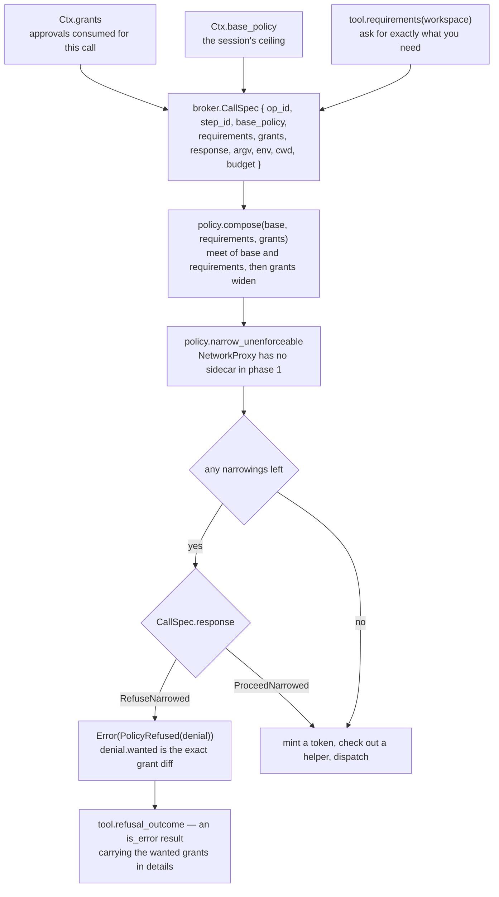
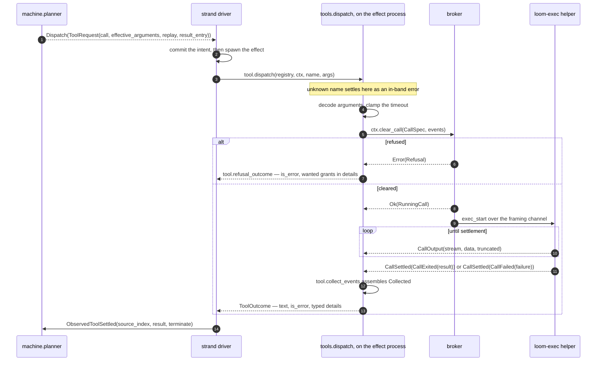
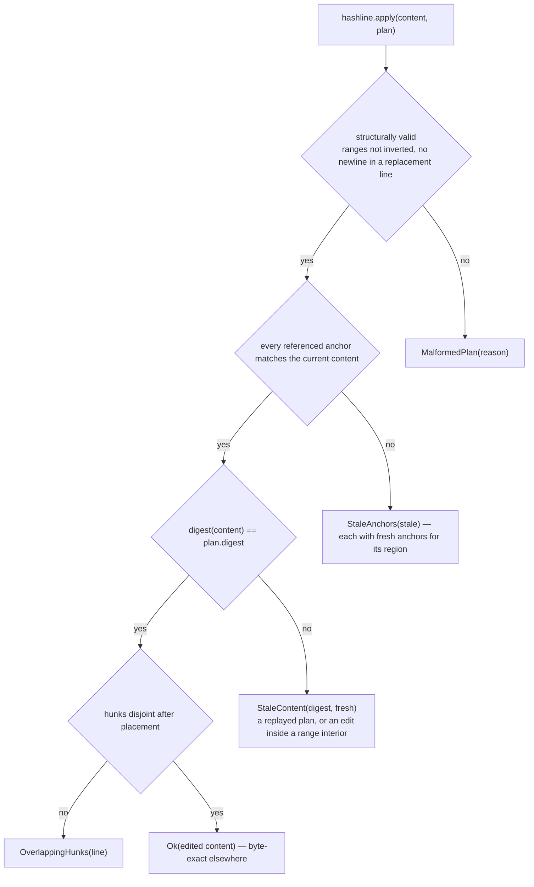

# tools

`tools` is the surface a model actually reaches for. It holds the core
tool set — `bash` and `grep` through the broker's jailed executor,
`fs_read` / `fs_write` / `fs_edit` harness-side with hashline anchoring
and workspace path discipline — plus the two families that are shells
over a seam: the six `agent_*` tools that reach the messaging plane, and
`code_mode`, through which a model submits a *program* instead of a
call.

One rule shapes everything below it: **tool failures are data**. Bad
arguments, a policy refusal, a dead sandbox helper, a stale edit anchor,
an unknown tool name — every one comes back as a structured `is_error`
result the model can read and react to. Nothing here crashes the strand,
and that is a structural claim rather than a discipline, because `run`
returns a `ToolOutcome` and has nowhere to put a failure except in one.

## A tool is a record

```gleam
pub type Tool {
  Tool(
    name: String,
    description: String,
    schema: JsonValue,
    replay: ReplaySafety,
    execution_mode: ExecutionMode,
    requirements: fn(String) -> SandboxPolicy,
    run: fn(Ctx, JsonValue) -> ToolOutcome,
  )
}
```

Three of those fields are contract rather than behaviour. `requirements`
is what the tool needs of the sandbox, stated as policy. `replay` is
whether re-executing an interrupted call is acceptable. `execution_mode`
is whether the call may overlap other calls. The runtime reads all three
without ever running the tool, which is what lets the harness make
decisions about a call before it has happened.

`Ctx` is every seam `run` may touch: the workspace root, the injected
clock, a `FileSystem` record of functions, the blob-overflow directory,
and `clear_call` — the broker seam every jailed execution flows through.
Production wires those to simplifile and a live broker; tests wire fakes,
and the tools cannot tell the difference.

`Ctx` also carries the driver's own durable coordinates — `strand`,
`op_id`, `step_id`, `source_index` — and *none* of them come from the
model's arguments. That is not tidiness. The agent tools are judged
against `Ctx.strand` and derive a spawned child's name from the other
three, so a value the model could invent here would let it claim an
identity or mint a second child on replay.

`Registry` is a name → `Tool` table and `dispatch` is total: an unknown
name yields the ordinary in-band unavailable-tool error with `details`
omitted, because the harness must not invent a value for a tool's typed
details contract.

## Declaring what you need

A tool does not ask the broker for permission; it *states what it
requires*, and the broker composes a policy from that statement together
with the session's base policy and any escalation grants a human
approved for this exact call.



Composition is most-restrictive-wins everywhere except grants: root
coverage intersects, the network lattice meets, per-field limits take
the minimum, environment allowlists intersect as exact strings — and
only then does an approved grant widen anything. So asking for more than
you need does not get you more; it gets you refused.

Every jailed tool passes `RefuseNarrowed`, which is what turns a
shortfall into a *repair brief*: the denial carries the exact grants that
were wanted, `tool.denial_to_json` renders them into the result's
`details`, and the runtime can raise an escalation from the recorded
result without re-deriving anything.

| Tool | Asks for |
|---|---|
| `bash` | workspace writable, `/` readable (interpreters and system libraries live outside the workspace), network off, env allowlist built from `Ctx.env` |
| `grep` | workspace readable, nothing writable, no env, network off |
| `fs_read` | workspace readable, nothing writable (declarative — it never clears a call) |
| `fs_write`, `fs_edit` | workspace readable and writable (declarative) |
| `agent_*` | nothing at all: no readable roots, no writable roots, no env, network off |
| `code_mode` | workspace writable and `/` readable — declaratively only; the build and the satellite are each cleared inside the pipeline against their own far narrower requirements |

The agent family asking for *nothing* is deliberate: those tools touch no
filesystem and spawn no process, so they compose with any session base
and can never be the reason a call is refused.

## A call's path to `Collected`



`collect_events` is the whole collection loop: receive `CallOutput`
chunks, split by stream, remember the helper's truncation flags, and stop
at the one `CallSettled` the broker guarantees. It is bounded — each
receive waits at most `waiting` milliseconds — and `Error(Nil)` means the
broker broke its exactly-one-settlement contract inside the window, at
which point the tool cancels and settles in band rather than blocking a
strand forever. `bash` sets that window to the execution timeout plus a
ten-second grace, so the tool always outwaits a broker that is still
settling honestly.

`Collected` is deliberately dumb — stdout, stderr, two truncation flags,
and the `CallOutcome` — because every tool renders it differently.
`bash` turns it into a body plus exit code, signal, wall time and
enforcement details; `grep` parses ripgrep's `--json` event stream out of
the same stdout into structured matches. Both then hand the body to the
blob overflow check.

## Two classes on every tool

| Tool | `replay` | `execution_mode` |
|---|---|---|
| `bash` | `Never` | `Exclusive` |
| `grep` | `Safe` | `Concurrent` |
| `fs_read` | `Safe` | `Concurrent` |
| `fs_write` | `Safe` | `Exclusive` |
| `fs_edit` | `Safe` | `Exclusive` |
| `agent_spawn` | `Safe` | `Exclusive` |
| `agent_send` | `Never` | `Exclusive` |
| `agent_wait`, `agent_note`, `agent_notes`, `agent_roster` | `Safe` | `Concurrent` |
| `code_mode` | `Never` | `Exclusive` |

**Replay safety** is consulted by crash recovery, not by the tool. The
machine persists the declared policy in the effect intent; when a driver
reloads an `effect_pending` call with no live effect behind it, a
`ReplayNever` call gets a synthesized interrupted result and a
`ReplaySafe` one is re-executed with the persisted arguments under the
same reserved result id — and only if the tool's *current* registration
still says safe, so demoting a tool takes effect on orphans immediately.

`Safe` is earned, never assumed. `grep` and `fs_read` are reads.
`fs_write` is idempotent — the same bytes to the same path. `fs_edit` is
digest-bound, which is the interesting one and has its own section below.
`agent_spawn` is safe because a child's name derives from persisted
coordinates, so a replay reconciles onto the same child instead of
minting a second; `agent_send` is not, because a send mints a fresh entry
id per admission and a replay would deliver twice.

**Execution mode** is a scheduling constraint the *loop* reads, and it is
consulted only under `tool_execution: Parallel` batch settings — under
the shipped sequential default there is never more than one live tool
effect, so the question does not arise. When it does arise, the rule is
`tool_may_start` in `runtime/strand_runtime`: an `Exclusive` tool starts
only when nothing else is running, and nothing starts beside a live
`Exclusive` one. The machine plans the batch either way; the mode only
decides whether the driver clears the next planned call now or parks
until the frontier is clear. Nothing about a fan-out story may rest on a
tool being `Concurrent`.

## Why an edit plan carries a digest

`fs_read` renders lines as `line:anchor|text`, where an anchor is the
first 8 hex of an FNV-1a 64 hash of the line's UTF-8 bytes. Anchors
depend on content alone: an unrelated edit never changes a line's anchor,
though it may change its number, which is why a `Ref` carries both and
`apply` checks both.

Per-line anchors alone cannot make "apply at most once" true. After a
delete, an *identical* sibling line — a blank line, a `}`, an `end` —
can shift into the removed position, and its anchor still matches, so
re-applying the same plan would succeed and eat another line. No per-line
scheme can tell that apart from "unchanged line". So a `Plan` carries the
`digest` of the exact content it was planned against, and `apply` checks
it.



Verification is complete before anything is touched, so partial
application never happens: any single stale reference rejects the whole
edit and comes back with fresh anchors for every region the plan touched,
which is enough to replan without another full read. A crash replay
therefore either repeats an edit that never landed — the pre-image is
intact and it applies exactly as intended — or fails in band as stale. It
cannot double-apply. The cost is deliberate: a concurrent edit far from
every hunk also rejects, buying one replan round trip for the
impossibility of silent double-application.

Anchors and digests are same-round-trip tokens. They are never stored
durably and are versioned by `anchor_version`, so the algorithm can
change without any protocol impact.

## Path discipline is the whole boundary

The `fs_*` tools run *in the harness*. They never pass through the broker
and never enter the kernel jail, so `resolve_real` is not defence in
depth — it is the only defence there is. It joins a relative path under
the workspace root and then walks both the root and the candidate
component by component through `read_link`, replacing each symlink with
its target and giving up after `max_link_follows` (40) hops, which is
also how a symlink loop becomes an in-band `Unresolvable` rather than a
hang. The resolved candidate must land under the equally-resolved root,
so neither `..` nor a symlink planted inside the workspace reaches
outside it.

## Large output does not go into the transcript

Output past `blob.overflow_threshold_bytes` (64 KiB) is written once to
the session's blob directory under a content-addressed name — SHA-256 of
the bytes — and the result carries `{ref, size, head_excerpt,
tail_excerpt}` with 2 KiB of each end. Content addressing makes the write
idempotent by construction: the same bytes always land at the same ref,
so replaying a `Safe` tool or re-running an identical command never
duplicates storage. `bash` and `grep` overflow; `fs_read` is exempt,
because windowed reads are already its bounding mechanism and anchors
hidden inside an elided blob would defeat hashline editing outright.

## Two seams that keep the graph acyclic

`agent_*` and `code_mode` look like tools and behave like tools, but
neither has any teeth of its own. Each is a thin wrapper over one call on
a record of closures declared here in plain data and filled in by whoever
can see a live runtime.

```gleam
pub type Agency {
  Agency(
    spawn: fn(Caller, SpawnRequest) -> Result(Spawned, Refusal),
    send: fn(Caller, String, String) -> Result(Delivery, Refusal),
    wait: fn(Caller, List(Handle), Int) -> Result(List(Waited), Refusal),
    note: fn(Caller, String, JsonValue) -> Result(Nil, Refusal),
    notes: fn(Caller, Option(String)) -> Result(List(#(String, JsonValue)), Refusal),
    roster: fn(Caller) -> Result(List(Peer), Refusal),
    max_wait_ms: Int,
  )
}
```

The seam exists because the dependency edges only run one way.
`codemode` already depends on `tools` — its capability router renders a
`tool.Collected` into a `cap_result` — so `tools` cannot import it back,
and `tools` depends on neither `runtime` nor `machine`, so the messaging
vocabulary cannot be imported either. Every type crossing both seams is
therefore *mirrored* here rather than imported, the same arrangement
`ToolOutcome` uses to mirror the broker's settlement shapes.

What this side does own is the model's half of each contract: the
schema, the published constants the description states (`max_wait_ms`,
`allowed_imports`, `serviced_caps`, `default_within_ms`, `max_within_ms`),
and the rendering. That last one is the point of `code_mode` in
particular: a vetting rejection lists every violation in one pass with
its rule, its offending construct, its byte span and the allowlist it was
judged against; compiler diagnostics cross verbatim. One round trip per
rule is exactly what in-band repair exists to avoid.

The rendering is also where a claim is *not* made. A code-mode result
hands back an `Enforcement` naming both jailed stages — the hermetic
build and the satellite node — as a record rather than a list, so neither
can go unmentioned, and each is either `Enforced` with its applied and
skipped layers in separate fields, or `Unreported` with the reason there
is no report. A tool result must never imply confinement that was not
applied.

## The modules

| Module | What it holds |
|---|---|
| `tools/tool` | `Tool`, `Ctx`, `ToolOutcome`, `Registry`, `dispatch`, the argument decoders and schema builders, `broker_runner`, `collect_events`/`Collected`, and the refusal/failure renderings. |
| `tools/bash` | The shell tool: `CallSpec` construction, timeout clamping, settlement rendering. |
| `tools/grep` | ripgrep under a read-only policy, with its `--json` event stream parsed into matches. |
| `tools/fs` | `fs_read` / `fs_write` / `fs_edit`, `resolve_real` path discipline, and the production `FileSystem`. |
| `tools/hashline` | The pure anchor/window/plan core: `anchor`, `digest`, `annotate`, `window`, `apply`, and the rejection vocabulary. |
| `tools/blob` | The overflow decision and the content-addressed write. |
| `tools/agent` | The six `agent_*` tools, the `Agency` seam, and the name and handle grammar. |
| `tools/codemode` | The `code_mode` tool and the `CodeMode` seam, including the mirrored pipeline vocabulary and the result rendering. |
| `tools/internal/ffi_hash`, `tools/internal/ffi_path` | SHA-256 for blob addressing, and the lstat-level `read_link` containment is built on. |

Paths are relative to `packages/tools/src/` — `tools/hashline` is
`packages/tools/src/tools/hashline.gleam`.

## Reading further

- [`CLAUDE.md`](CLAUDE.md) — the reference doc for changing this code:
  key types, real dependency edges, the policy each tool declares, and
  the invariants that break things when violated. Read it before
  editing.
- [`packages/broker/CLAUDE.md`](../broker/CLAUDE.md) — the far side of
  `clear_call`: composition, budget, tokens, the helper pool, the wire.
- [`docs/architecture/effects.md`](../../docs/architecture/effects.md) —
  the plane this package sits in, and "Tools with correctness teeth".
- [`docs/architecture/code-mode.md`](../../docs/architecture/code-mode.md)
  — the pipeline behind `code_mode` and what each of its layers confines.
- [`packages/codemode/CLAUDE.md`](../codemode/CLAUDE.md) — the far side
  of the code-mode seam.
- [`docs/spec-gaps.md`](../../docs/spec-gaps.md) — "From WP-I
  (`tools`)": the anchor hash choice, `execution_mode`,
  workspace-relative requirements, the `fs_read` overflow exemption, and
  the timeout ceiling.
