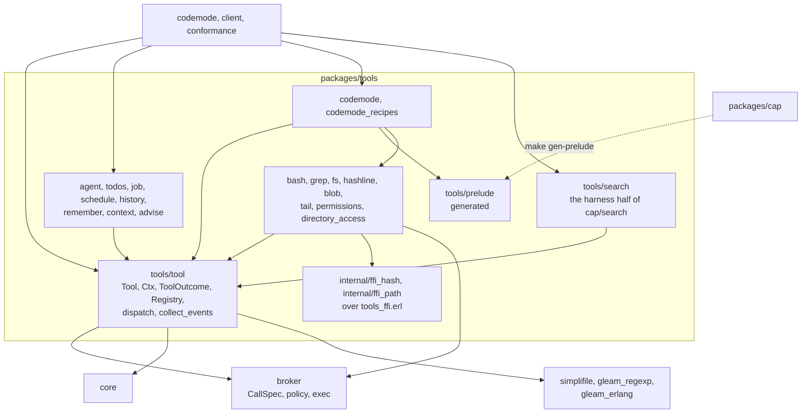
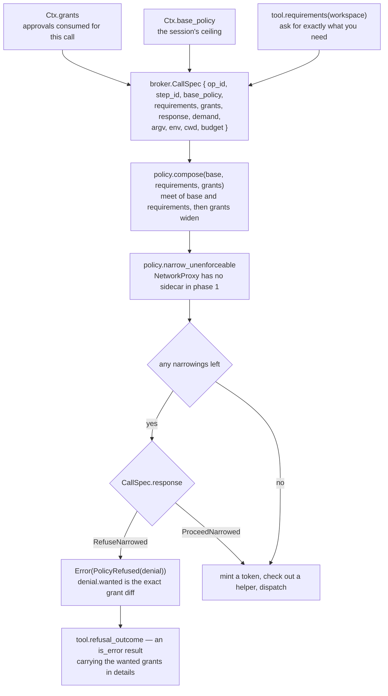
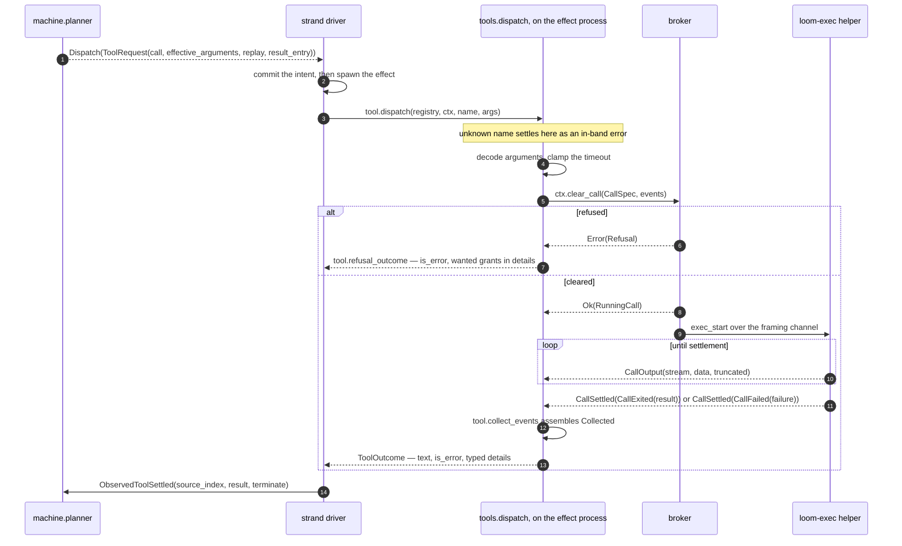
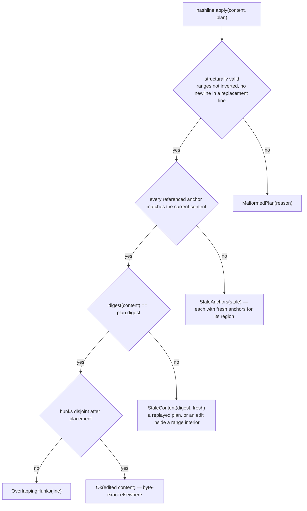

# tools

`tools` is the surface a model reaches for. It holds the core tool set:
`bash` and `grep`, which run through the broker's jailed executor, and
`fs_read`, `fs_write` and `fs_edit`, which run in the harness with
hashline anchoring and workspace path discipline. Every other tool here
is a shell over a seam, a record of closures this package declares and
the host (`client`) fills with something that can see a live runtime:

- the six `agent_*` tools and `todo`, over `agent.Agency`, the messaging
  plane;
- `job_poll`, `job_kill` and `job_send`, over `job.Jobs`, for the
  background jobs `bash` starts with `mode: "background"`;
- `schedule_create`, `schedule_list` and `schedule_cancel`, over
  `schedule.Schedules`;
- `history_search`, over `history.History`, the repository's full-text
  index;
- `remember`, over `remember.Memory`, and `context_remaining`, over
  `context.Context`;
- `advise`, over `advise.Advice`, the whole outward surface of an
  advisor strand;
- `code_mode`, over `codemode.CodeMode`, through which a model submits a
  *program* instead of a call.

The package is separate for two reasons. Every tool shares one contract
that the runtime reads without running the tool (the `Tool` record
below). And the package sits low in the dependency graph: it imports
`core` and `broker` and nothing that holds a live runtime, while
`codemode`, `client` and `conformance` import it. That ordering is why
each seam above is a record declared here rather than an import.


```mermaid
graph TD
  subgraph pkg["packages/tools"]
    TOOL["tools/tool<br/>Tool, Ctx, ToolOutcome, Registry,<br/>dispatch, collect_events"]
    CORE_T["bash, grep, fs, hashline, blob,<br/>tail, permissions, directory_access"]
    SEAMS["agent, todos, job, schedule, history,<br/>remember, context, advise"]
    CM["codemode, codemode_recipes"]
    PRE["tools/prelude<br/>generated"]
    SEARCH["tools/search<br/>the harness half of cap/search"]
    FFI["internal/ffi_hash, internal/ffi_path<br/>over tools_ffi.erl"]
  end

  CORE["core"]
  BROKER["broker<br/>CallSpec, policy, exec"]
  LIBS["simplifile, gleam_regexp,<br/>gleam_erlang"]
  CAP["packages/cap"]
  UP["codemode, client, conformance"]

  UP --> TOOL
  UP --> SEAMS
  UP --> CM
  UP --> SEARCH
  CORE_T --> TOOL
  SEAMS --> TOOL
  CM --> TOOL
  CM --> PRE
  CM --> CORE_T
  SEARCH --> TOOL
  CORE_T --> FFI
  TOOL --> BROKER
  CORE_T --> BROKER
  TOOL --> CORE
  TOOL --> LIBS
  CAP -.->|"make gen-prelude"| PRE
```

The dotted edge is not a dependency. `tools/prelude` is generated by
`make gen-prelude`, which runs `gleam export package-interface` over
`packages/cap` and renders its public surface into Gleam source; the
file is committed, and `make prelude-check` (run by `make check`) fails
when it and `packages/cap` disagree. Nothing in this package imports
`cap`. Edit `packages/cap` and regenerate; never edit `prelude.gleam` by
hand.

One rule shapes everything below it: **tool failures are data**. Bad
arguments, a policy refusal, a dead sandbox helper, a stale edit anchor,
an unknown tool name — every one comes back as a structured `is_error`
result the model can read and react to. Nothing here crashes the strand,
and that is a structural claim rather than a discipline, because `run`
returns a `ToolOutcome` and has nowhere to put a failure except in one.

## A tool is a record

```gleam
pub type Tool {
  Tool(
    name: String,
    description: String,
    prompt_snippet: Option(String),
    schema: JsonValue,
    replay: ReplaySafety,
    execution_mode: ExecutionMode,
    requirements: fn(String) -> SandboxPolicy,
    run: fn(Ctx, JsonValue) -> ToolOutcome,
  )
}
```

`prompt_snippet` is one line for the system prompt's index of available
tools; `None` leaves a tool out of that index without making it any less
callable. Three of the other fields are contract rather than behaviour.
`requirements` is what the tool needs of the sandbox, stated as policy.
`replay` is whether re-executing an interrupted call is acceptable.
`execution_mode` is whether the call may overlap other calls. The
runtime reads all three without ever running the tool, which is what
lets the harness make decisions about a call before it has happened.

`Ctx` is every seam `run` may touch: the workspace root, the session's
base policy, any explicit directory access and approved grants, the
constructed environment, the injected clock, a `FileSystem` record of
functions, the blob-overflow directory, and `clear_call`, the broker
seam every jailed execution flows through. Two more closures complete
it: `raise_refusal`, which asks the escalation plane about a refusal met
outside `clear_call` (code mode's clearances happen inside its own
pipeline), and `observe_output`, which receives a running execution's
rolling output tail after every chunk. Production wires these to
simplifile, a live broker and the event bus; tests wire fakes, and the
tools cannot tell the difference.

`Ctx` also carries the driver's own durable coordinates — `strand`,
`op_id`, `step_id`, `source_index` — and *none* of them come from the
model's arguments. That is not tidiness. The agent tools are judged
against `Ctx.strand` and derive a spawned child's name from the other
three, so a value the model could invent here would let it claim an
identity or mint a second child on replay.

`Registry` is a name → `Tool` table and `dispatch` is total: an unknown
name yields the ordinary in-band unavailable-tool error with `details`
omitted, because the harness must not invent a value for a tool's typed
details contract.

## Declaring what you need

A tool does not ask the broker for permission; it *states what it
requires*, and the broker composes a policy from that statement together
with the session's base policy and any escalation grants a human
approved for this exact call.


```mermaid
flowchart TD
    R["tool.requirements(workspace)<br/>ask for exactly what you need"]
    B["Ctx.base_policy<br/>the session's ceiling"]
    G["Ctx.grants<br/>approvals consumed for this call"]
    SPEC["broker.CallSpec { op_id, step_id, base_policy,<br/>requirements, grants, response, demand,<br/>argv, env, cwd, budget }"]
    C["policy.compose(base, requirements, grants)<br/>meet of base and requirements, then grants widen"]
    N["policy.narrow_unenforceable<br/>NetworkProxy has no sidecar in phase 1"]
    Q{"any narrowings left"}
    RESP{"CallSpec.response"}
    REF["Error(PolicyRefused(denial))<br/>denial.wanted is the exact grant diff"]
    RUN["mint a token, check out a helper, dispatch"]
    OUT["tool.refusal_outcome — an is_error result<br/>carrying the wanted grants in details"]

    R --> SPEC
    B --> SPEC
    G --> SPEC
    SPEC --> C --> N --> Q
    Q -->|no| RUN
    Q -->|yes| RESP
    RESP -->|RefuseNarrowed| REF --> OUT
    RESP -->|ProceedNarrowed| RUN
```

Composition is most-restrictive-wins everywhere except grants: root
coverage intersects, the network lattice meets, per-field limits take
the minimum, environment allowlists intersect as exact strings — and
only then does an approved grant widen anything. So asking for more than
you need does not get you more; it gets you refused.

Every jailed tool passes `RefuseNarrowed`, which is what turns a
shortfall into a *repair brief*: the denial carries the exact grants that
were wanted, `tool.denial_to_json` renders them into the result's
`details`, and the runtime can raise an escalation from the recorded
result without re-deriving anything.

| Tool | Asks for |
|---|---|
| `bash` | the workspace plus every writable and readable root and mount the session base already grants, the base's own network, and an env allowlist built from `Ctx.env`. Asking for the base's roots cannot widen past the base, and it is what lets a shell in a linked worktree reach the main repository's `.git`. |
| `grep` | workspace readable plus the base's readable roots, the base's mounts made read-only, nothing writable, only `PATH` in the environment, network off |
| `fs_read` | workspace readable, nothing writable (declarative: it never clears a call) |
| `fs_write`, `fs_edit` | workspace readable and writable (declarative) |
| `code_mode` | workspace writable and nothing else, declaratively only; the build and the satellite are each cleared inside the pipeline against their own requirements |
| `agent_*`, `todo`, `job_*`, `schedule_*`, `history_search`, `remember`, `context_remaining`, `advise` | nothing at all: no readable roots, no writable roots, no env, network off |

The seam tools asking for *nothing* is deliberate: they touch no
filesystem and spawn no process, so they compose with any session base
and can never be the reason a call is refused. A background job's own
command is cleared by the host under the job's identity, never under the
`job_*` call that polls it.

`bash` and `code_mode` also accept an optional `permissions` argument
(`readable_roots`, `writable_roots`, `network: "full"`). `tools/permissions`
decodes it, and `tool.authorize_policy` asks the escalation plane for the
missing grants before anything starts, so an approval binds to that one
invocation and never widens the session.

## A call's path to `Collected`


```mermaid
sequenceDiagram
    autonumber
    participant M as machine.planner
    participant D as strand driver
    participant T as tools.dispatch, on the effect process
    participant B as broker
    participant H as loom-exec helper

    M-->>D: Dispatch(ToolRequest(call, effective_arguments, replay, result_entry))
    D->>D: commit the intent, then spawn the effect
    D->>T: tool.dispatch(registry, ctx, name, args)
    Note over T: unknown name settles here as an in-band error
    T->>T: decode arguments, clamp the timeout
    T->>B: ctx.clear_call(CallSpec, events)
    alt refused
        B-->>T: Error(Refusal)
        T-->>D: tool.refusal_outcome — is_error, wanted grants in details
    else cleared
        B-->>T: Ok(RunningCall)
        B->>H: exec_start over the framing channel
        loop until settlement
            H-->>T: CallOutput(stream, data, truncated)
        end
        H-->>T: CallSettled(CallExited(result)) or CallSettled(CallFailed(failure))
        T->>T: tool.collect_events assembles Collected
        T-->>D: ToolOutcome — text, is_error, typed details
    end
    D->>M: ObservedToolSettled(source_index, result, terminate)
```

`collect_events` is the whole collection loop: receive `CallOutput`
chunks, split by stream, remember the helper's truncation flags, and stop
at the one `CallSettled` the broker guarantees. It is bounded — each
receive waits at most `waiting` milliseconds — and `Error(Nil)` means the
broker broke its exactly-one-settlement contract inside the window, at
which point the tool cancels and settles in band rather than blocking a
strand forever. `bash` sets that window to the execution timeout plus a
ten-second grace, so the tool always outwaits a broker that is still
settling honestly.

`Collected` is deliberately dumb — stdout, stderr, two truncation flags,
and the `CallOutcome` — because every tool renders it differently.
`bash` turns it into a body plus exit code, signal, wall time and
enforcement details; `grep` parses ripgrep's `--json` event stream out of
the same stdout into structured matches. Both then hand the body to the
blob overflow check.

## Two classes on every tool

| Tool | `replay` | `execution_mode` |
|---|---|---|
| `bash` | `Never` | `Exclusive` |
| `grep` | `Safe` | `Concurrent` |
| `fs_read` | `Safe` | `Concurrent` |
| `fs_write` | `Safe` | `Exclusive` |
| `fs_edit` | `Safe` | `Exclusive` |
| `agent_spawn` | `Safe` | `Exclusive` |
| `agent_send` | `Never` | `Exclusive` |
| `agent_wait`, `agent_note`, `agent_notes`, `agent_roster`, `todo` | `Safe` | `Concurrent` |
| `job_poll`, `job_kill`, `job_send` | `Never` | `Concurrent` |
| `schedule_create`, `schedule_cancel` | `Never` | `Exclusive` |
| `schedule_list`, `history_search`, `context_remaining` | `Safe` | `Concurrent` |
| `remember`, `advise` | `Never` | `Exclusive` |
| `code_mode` | `Never` | `Exclusive` |

**Replay safety** is consulted by crash recovery, not by the tool. The
machine persists the declared policy in the effect intent; when a driver
reloads an `effect_pending` call with no live effect behind it, a
`ReplayNever` call gets a synthesized interrupted result and a
`ReplaySafe` one is re-executed with the persisted arguments under the
same reserved result id — and only if the tool's *current* registration
still says safe, so demoting a tool takes effect on orphans immediately.

`Safe` is earned, never assumed. `grep` and `fs_read` are reads.
`fs_write` is idempotent — the same bytes to the same path. `fs_edit` is
digest-bound, which is the interesting one and has its own section below.
`agent_spawn` is safe because a child's name derives from persisted
coordinates, so a replay reconciles onto the same child instead of
minting a second; `agent_send` is not, because a send mints a fresh entry
id per admission and a replay would deliver twice.

**Execution mode** is a scheduling constraint the *loop* reads, and it is
consulted under `tool_execution: Parallel` batch settings — which is the
shipped default, so every declaration here is live rather than latent.
The rule is `tool_may_start` in `runtime/strand_runtime`: an `Exclusive`
tool starts only when nothing else is running, and nothing starts beside
a live `Exclusive` one. The machine plans the batch either way; the mode
only decides whether the driver clears the next planned call now or parks
until the frontier is clear. Still, nothing about a fan-out story may
rest on a tool being `Concurrent`: a session can set `tool_execution`
back to `sequential`, and one `Exclusive` call in a batch fences every
`Concurrent` sibling beside it.

## Why an edit plan carries a digest

`fs_read` renders lines as `line:anchor|text`, where an anchor is the
first 8 hex of an FNV-1a 64 hash of the line's UTF-8 bytes. Anchors
depend on content alone: an unrelated edit never changes a line's anchor,
though it may change its number, which is why a `Ref` carries both and
`apply` checks both.

Per-line anchors alone cannot make "apply at most once" true. After a
delete, an *identical* sibling line — a blank line, a `}`, an `end` —
can shift into the removed position, and its anchor still matches, so
re-applying the same plan would succeed and eat another line. No per-line
scheme can tell that apart from "unchanged line". So a `Plan` carries the
`digest` of the exact content it was planned against, and `apply` checks
it.


```mermaid
flowchart TD
    A["hashline.apply(content, plan)"]
    M{"structurally valid<br/>ranges not inverted, no newline in a replacement line"}
    S{"every referenced anchor matches the current content"}
    D{"digest(content) == plan.digest"}
    O{"hunks disjoint after placement"}
    OK["Ok(edited content) — byte-exact elsewhere"]

    A --> M
    M -->|no| E1["MalformedPlan(reason)"]
    M -->|yes| S
    S -->|no| E2["StaleAnchors(stale) — each with fresh anchors for its region"]
    S -->|yes| D
    D -->|no| E3["StaleContent(digest, fresh)<br/>a replayed plan, or an edit inside a range interior"]
    D -->|yes| O
    O -->|no| E4["OverlappingHunks(line)"]
    O -->|yes| OK
```

Verification is complete before anything is touched, so partial
application never happens: any single stale reference rejects the whole
edit and comes back with fresh anchors for every region the plan touched,
which is enough to replan without another full read. A crash replay
therefore either repeats an edit that never landed — the pre-image is
intact and it applies exactly as intended — or fails in band as stale. It
cannot double-apply. The cost is deliberate: a concurrent edit far from
every hunk also rejects, buying one replan round trip for the
impossibility of silent double-application.

Anchors and digests are same-round-trip tokens. They are never stored
durably and are versioned by `anchor_version`, so the algorithm can
change without any protocol impact.

## Path discipline is the whole boundary

The `fs_*` tools run *in the harness*. They never pass through the broker
and never enter the kernel jail, so `resolve_real` is not defence in
depth — it is the only defence there is. It joins a relative path under
the workspace root and then walks both the root and the candidate
component by component through `read_link`, replacing each symlink with
its target and giving up after `max_link_follows` (40) hops, which is
also how a symlink loop becomes an in-band `Unresolvable` rather than a
hang. The resolved candidate must land under the equally-resolved root,
so neither `..` nor a symlink planted inside the workspace reaches
outside it.

## Large output does not go into the transcript

Output past `blob.overflow_threshold_bytes` (64 KiB) is written once to
the session's blob directory under a content-addressed name — SHA-256 of
the bytes — and the result carries `{ref, size, head_excerpt,
tail_excerpt}` with 2 KiB of each end. Content addressing makes the write
idempotent by construction: the same bytes always land at the same ref,
so replaying a `Safe` tool or re-running an identical command never
duplicates storage. `bash` and `grep` overflow; `fs_read` is exempt,
because windowed reads are already its bounding mechanism and anchors
hidden inside an elided blob would defeat hashline editing outright.

## Seams that keep the graph acyclic

The seam tools look like tools and behave like tools, but none has any
teeth of its own. Each is a thin wrapper over one call on a record of
closures declared here in plain data and filled in by whoever can see a
live runtime. The messaging seam is the largest of them:

```gleam
pub type Agency {
  Agency(
    spawn: fn(Caller, SpawnRequest) -> Result(Spawned, Refusal),
    send: fn(Caller, String, String, Option(Int)) -> Result(Delivery, Refusal),
    wait: fn(Caller, List(Handle), Int) -> Result(List(Waited), Refusal),
    note: fn(Caller, String, JsonValue) -> Result(Nil, Refusal),
    notes: fn(Caller, Option(String)) ->
      Result(List(#(String, JsonValue)), Refusal),
    todos: fn(Caller, fn(Option(JsonValue)) -> Result(JsonValue, String)) ->
      Result(JsonValue, Refusal),
    roster: fn(Caller) -> Result(List(Peer), Refusal),
    max_wait_ms: Int,
    model_names: List(String),
  )
}
```

`client` fills each record: `client/agency` the `Agency`,
`client/codemode` the `CodeMode`, `client/jobtools` the `Jobs`,
`client/history` the `History`, and `client/memory` the `Memory`.

The seam exists because the dependency edges only run one way.
`codemode` already depends on `tools` — its capability router renders a
`tool.Collected` into a `cap_result` — so `tools` cannot import it back,
and `tools` depends on neither `runtime` nor `machine`, so the messaging
vocabulary cannot be imported either. Every type crossing both seams is
therefore *mirrored* here rather than imported, the same arrangement
`ToolOutcome` uses to mirror the broker's settlement shapes.

What this side does own is the model's half of each contract: the
schema, the published constants the description states (`max_wait_ms`,
`allowed_imports`, `serviced_caps`, `default_within_ms`, `max_within_ms`),
and the rendering. That last one is the point of `code_mode` in
particular: a vetting rejection lists every violation in one pass with
its rule, its offending construct, its byte span and the allowlist it was
judged against; compiler diagnostics cross verbatim. One round trip per
rule is exactly what in-band repair exists to avoid.

The rendering is also where a claim is *not* made. A code-mode result
hands back an `Enforcement` naming both jailed stages — the hermetic
build and the satellite node — as a record rather than a list, so neither
can go unmentioned, and each is either `Enforced` with its applied and
skipped layers in separate fields, or `Unreported` with the reason there
is no report. A tool result must never imply confinement that was not
applied.

## Evolution tools

`tools/evolution.Door` supplies five host callbacks: propose, test, inspect,
catalogue and invoke. `client/evolution` implements them; this package owns
their model-visible descriptions, argument schemas and rendering. The native
host adds the trace door and prompt-comparison wiring separately.

Discovery returns the complete callable schema with a candidate ID and
generation. Invocation must present both identities, so stale arguments
cannot silently reach a replacement implementation. None of these tools can
approve or select a candidate. Native controls and the live owner are
described in [the evolution architecture](../../docs/architecture/evolution.md).

## The modules

| Module | What it holds |
|---|---|
| `tools/tool` | `Tool`, `Ctx`, `ToolOutcome`, `Registry`, `dispatch`, `Declarations`, the argument decoders and schema builders, `broker_runner`, `collect_events`/`collect_observed`/`Collected`, `authorize_policy`, and the refusal/failure renderings. |
| `tools/tail` | A pure, bounded rolling window over one output stream with a byte cursor, shared by the foreground collector and `client/jobs`. |
| `tools/directory_access` | `Access`, the explicit roots added to the native workspace scope, kept separate from the jail's host read paths. |
| `tools/permissions` | The optional `permissions` argument on `bash` and `code_mode`, decoded into the grants an approval is asked for. |
| `tools/bash` | The shell tool: `CallSpec` construction, timeout clamping, settlement rendering. |
| `tools/grep` | ripgrep under a read-only policy, with its `--json` event stream parsed into matches. |
| `tools/fs` | `fs_read` / `fs_write` / `fs_edit`, `resolve_real` path discipline, and the production `FileSystem`. |
| `tools/hashline` | The pure anchor/window/plan core: `anchor`, `digest`, `annotate`, `window`, `apply`, and the rejection vocabulary. |
| `tools/blob` | The overflow decision and the content-addressed write, staged and renamed into place. |
| `tools/agent` | The six `agent_*` tools, the `Agency` seam, the result-schema contract, and the name and handle grammar. |
| `tools/todos` | The `todo` tool, registered beside the `agent_*` family; its board is the caller's own blackboard cell. |
| `tools/job` | `job_poll`, `job_kill`, `job_send`, the `Jobs` seam, and the `job://` read scheme. |
| `tools/schedule` | `schedule_create`, `schedule_list`, `schedule_cancel`, and the `Schedules` seam. |
| `tools/history` | `history_search` and the `History` seam, with the fence that quotes another session's text as data. |
| `tools/remember` | `remember` and the `Memory` seam. |
| `tools/context` | `context_remaining` and the `Context` seam. |
| `tools/advise` | `advise`, the `Advice` seam, and the three-point `Verdict`. |
| `tools/search` | The harness-side half of the `cap/search` capability: `glob`, `grep`, `stat` and `read_lines` over an already-contained region. Not a tool; the code-mode router calls it. |
| `tools/codemode` | The `code_mode` tool and the `CodeMode` seam, including the mirrored pipeline vocabulary, the seam offers, the `cap://` read scheme, and the result rendering. |
| `tools/codemode_recipes` | Complete program strings the `code_mode` description includes when their imports are offered. |
| `tools/prelude` | Generated by `make gen-prelude` from `packages/cap`: every capability-prelude module's public surface, rendered for the `code_mode` description. Do not edit. |
| `tools/internal/ffi_hash`, `tools/internal/ffi_path` | SHA-256 for blob addressing, and the lstat-level `read_link` containment is built on. |

Paths are relative to `packages/tools/src/` — `tools/hashline` is
`packages/tools/src/tools/hashline.gleam`.

## How it is tested

`make check-tools` is the package gate: format check, warning-free build,
and the tests. `make test-tools` runs the tests alone, and
`make lint-tools` runs the house-rule lint over these sources.

Nearly every suite is in-process. `test/support/fake_broker.gleam` stands
in for `clear_call`: it captures the `CallSpec` a tool built and replays a
scripted event sequence, so the `bash` and `grep` suites assert on the
requested policy and on the rendering of every settlement shape.
`test/support/memory_fs.gleam` is an in-memory `FileSystem` behind the
same record of functions production uses, which is how `fs_test` covers
path discipline and protected paths without a disk.
`hashline_test` is a property suite over a seeded generator
(`test/support/generate.gleam`). The seam tools are tested against
hand-built records (`agent_test`, `job_test`, `schedule_test`,
`history_test`, `advise_test`, `codemode_test` and the rest), and the
`*_size_test` files pin how much each seam's closures capture.

`integration_test` is the one end-to-end: it starts a real broker over the
real `loom-exec` helper `make sandbox` builds, and runs a command through
`bash`. It is feature-detected and skips, with its
reason, on a host that cannot run it.

## Reading further

- [`CLAUDE.md`](CLAUDE.md) — the reference doc for changing this code:
  key types, real dependency edges, the policy each tool declares, and
  the invariants that break things when violated. Read it before
  editing.
- [`packages/broker/CLAUDE.md`](../broker/CLAUDE.md) — the far side of
  `clear_call`: composition, budget, tokens, the helper pool, the wire.
- [`docs/architecture/effects.md`](../../docs/architecture/effects.md) —
  the plane this package sits in, and "Tools with correctness teeth".
- [`docs/architecture/code-mode.md`](../../docs/architecture/code-mode.md)
  — the pipeline behind `code_mode` and what each of its layers confines.
- [`packages/codemode/CLAUDE.md`](../codemode/CLAUDE.md) — the far side
  of the code-mode seam.
- [`docs/architecture/tools.md`](../../docs/architecture/tools.md)
  covers the tool surface as a whole, and
  [`docs/architecture/advisor.md`](../../docs/architecture/advisor.md) for
  the far side of `advise`.
- [`docs/spec-gaps.md`](../../docs/spec-gaps.md) — "From WP-I
  (`tools`)": the anchor hash choice, `execution_mode`,
  workspace-relative requirements, the `fs_read` overflow exemption, and
  the timeout ceiling.
- [ADR-005](../../docs/adr/005-budget-pooling-granularity.md) is why a
  `Concurrent` tool's declared budget must leave headroom in its batch's
  shared ledger.
- Protocol changes that shaped this package:
  [020](../../protocol-change/020-minimal-jail-root.md) (why `bash` asks
  for the base's readable roots rather than `/`),
  [031](../../protocol-change/031-tool-output-stream.md)
  (`observe_output`),
  [040](../../protocol-change/040-session-directory-access.md)
  (`directory_access` and the `permissions` argument),
  [045](../../protocol-change/045-code-mode-notes.md) (durable code-mode
  notes),
  [046](../../protocol-change/046-code-mode-utilities.md) (the default
  orchestration seam and `codemode_recipes`), and
  [048](../../protocol-change/048-async-collaboration.md) (the
  asynchronous `code_mode` modes).
