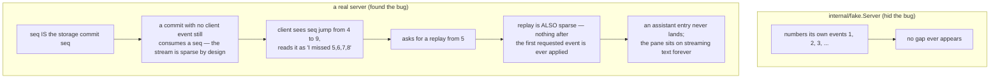

# tui

`loom-tui` is the terminal client for a live Loom session — a
`bubbletea` program that speaks the Part 1.6 websocket protocol and does
nothing else. It is a thin client in the strict sense: every fact it
shows came from a `snapshot` body or a subsequent event, nothing is
computed locally, and it holds no durable state of its own.
`packages/client` is the Gleam server on the other end; the two are
coupled only through the protocol and a set of golden fixtures both
sides decode and re-encode byte for byte.

## The pieces

```mermaid
flowchart LR
    Sock["websocket<br/>/v1/ws"]
    Client["internal/client.Client<br/>dial, reconnect, correlate replies"]
    Proto["internal/proto<br/>Command/Event codecs"]
    UI["internal/ui.Model<br/>pure Update, tea.Cmd for every send"]
    Fake["internal/fake.Server<br/>in-memory gateway, for tests and --demo"]

    Sock <--> Client
    Client <--> Proto
    Client -->|Messages()| UI
    UI -->|tea.Cmd| Client
    Fake -.->|substitutes for Sock in tests| Client
```

`internal/ui.Model.Update` is pure — no I/O happens inside it. Every
outbound command leaves as a `tea.Cmd` closure, which is what makes the
entire key-press-to-command interaction table-testable without a
terminal at all.

## Why the real end-to-end exists, and what the fake was hiding

Until recently the only end-to-end for this package ran the real
bubbletea model against `internal/fake.Server` — a fake gateway backed by
in-memory state that speaks the same protocol. A fake on one side of a
protocol proves that side's understanding of the fixture; it does not
prove the wire, and `packages/client/test/client/tui_e2e_test.gleam` now
drives the *real* `loom-tui` binary, in a real terminal under `tmux`,
against a real `client/serve.boot` server — only the model behind the
provider is scripted. That test found two bugs the fake could not have,
because the fake could not reproduce the condition either one depended
on.

**The event-sequence gap.** The client treated a gap in incoming event
sequence numbers as evidence it had missed something and asked the
server for a replay. But a gateway event's `seq` *is* the storage seq of
the commit that produced it (`protocol-change/006`), and commits that
write no client-visible event still consume seqs — so the stream is
*legitimately* sparse, and a forward jump carries no information at all.
The replay the client asked for was sparse for exactly the same reason,
so nothing after the first event it requested was ever applied.



The fix removes gap detection entirely for the write-once rows: an
`entry` or `usage` event at or below the last-seen seq is a duplicate
from resume overlap and is dropped; anything above it advances the
position, gap or not. `op_transition`, `escalation`, and `strand_result`
never move the position at all, gap or no gap — they are current
register state rather than a replayable log, and letting them advance
the position risks dropping a row event that arrives behind them.

**The tab-row miscount.** Smaller, and just as invisible against a fake:
the chrome height the layout reserved undercounted the tab row by one
line. `bubbletea` silently trims an oversized frame from the *top*, so
against a real terminal showing a strand, the status bar quietly
disappeared off the top of the frame. A fixed-size fake terminal buffer
never exercised the real trimming behavior, so nothing caught it.

Neither bug is reachable by construction from `internal/fake.Server`,
which is the argument for keeping an end-to-end with a fake on neither
side rather than trusting the fixture-pinned fake alone.

## Reconnection: resume, never restart — but only once

A dropped connection resumes from the client's last-seen seq rather than
re-subscribing from zero — but only after a full `snapshot` has been
applied at least once; before that, a reconnect re-subscribes from zero
because there is no established position to resume from. A full snapshot
resets the position to `next_seq - 1` (everything below it is already
reflected in the snapshot body); a resume snapshot resets nothing,
because its replay carries the original seqs. Backoff between attempts
is bounded, 100ms to 5s by default. In-flight requests fail loudly with
`ErrDisconnected` on a drop rather than hanging silently.

## Where to look

| Path | What it holds |
|---|---|
| `cmd/loom-tui` | The binary: `--addr`/`--session` for a real gateway, `--demo` for the in-process fake. |
| `internal/proto` | Hand-written protocol types, `DecodeCommand`/`DecodeEvent`, the golden fixtures under `testdata/`. `protocol.md` beside it is the normative body schema. |
| `internal/client` | The connection actor: dial, reconnect, catch-up, request/reply correlation. |
| `internal/ui` | The bubbletea model: pure `Update`, the `:models` picker, rendering. |
| `internal/fake` | The in-memory gateway used by this package's own tests and `--demo`. |

## Reading further

- [`internal/proto/protocol.md`](internal/proto/protocol.md) — the
  normative body schemas for every command and event.
- [`CLAUDE.md`](CLAUDE.md) — the reference doc for changing this code:
  key types, real dependency edges, wire traffic, and the invariants that
  break things when violated. Read it before editing.
- [`packages/client/CLAUDE.md`](../client/CLAUDE.md) — the Gleam gateway
  on the other end of the wire, and where its own e2e test lives.
- [`docs/architecture/orchestration.md`](../../docs/architecture/orchestration.md)
  — the session surface the protocol exposes.
