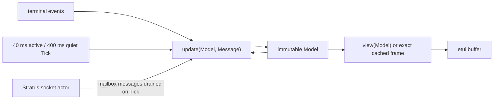
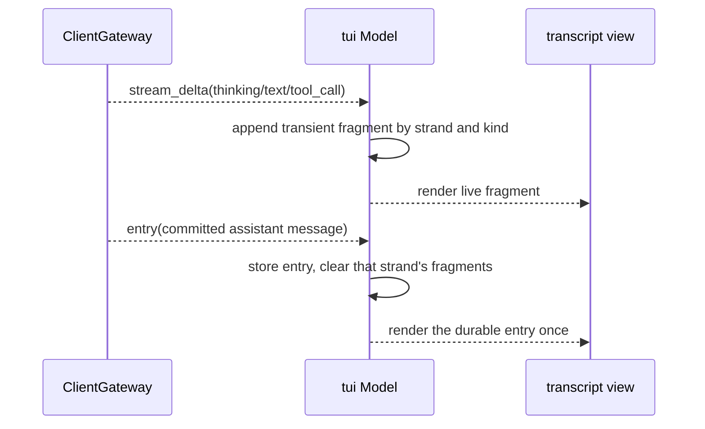

# tui

`tui` is Loom's shipped native terminal client. It receives keyboard
input in a real PTY,
attaches to the frozen ClientGateway websocket, follows a live session, and
renders Mork's CommonMark tree directly into etui spans.

`make tui-shipment` exports the compiled BEAM closure behind `bin/loom`;
`make dist` packages it separately from the server. The shipment does not
include ERTS, so the client host needs compatible Erlang/OTP 29 on `PATH`.

With `loomd` beside the launcher or on `PATH`, local use is simply:

```sh
cd ~/src/my-project
loom
```

The no-argument launcher remains a client of the frozen websocket protocol. It
maps the canonical workspace to private state under `~/.loom`, validates any
cached endpoint through an authenticated `subscribe`, and starts a detached
server only when no compatible endpoint exists. Concurrent launchers share an
operating-system lock, and the server survives terminal exit so later clients
reuse the same session. Workspace content is data, not launch authority: this
path neither loads `loom.toml` nor runs the server from the repository.
Implicit daemon discovery ignores relative `PATH` entries, and bearer tokens
stay below the private state root even when `--session-file` points elsewhere.

## One model owns the terminal

The etui loop carries one immutable `Model`. Keyboard events, websocket
messages, and periodic inbox drains all produce a new value; `view` only turns
that value into a buffer. No render function performs I/O, and no networking
process owns presentation state.



The socket is an actor because Stratus owns a live websocket connection. It
sends decoded text frames into the terminal loop's `Subject`; the loop drains
that mailbox without blocking whenever etui emits a tick. This boundary keeps
the mutable resource at the edge and leaves every visible decision in the
ordinary Gleam model.

## Durable rows and live fragments are different things

ClientGateway publishes both durable entries and transient stream fragments.
They may contain the same answer at different moments: fragments make the
answer visible while it is generated, then the committed assistant entry
becomes the authority. Combining both into one transcript would show the
answer twice when settlement arrives.

The model therefore keeps two collections. `records` holds entries decoded by
`core/codec`; `streams` holds newest-first text fragments keyed by strand and
stream kind. Durable record rows are wrapped once and cached by strand, width,
and detail mode. A stream revision rewraps only its live fragments. An incoming
entry clears that strand's fragments and adds only the new durable rows before
the next render. This is the same two-channel distinction the harness uses:
live output is useful feedback, but only a committed entry is conversation
history.



Reasoning and tool material stay subordinate to the answer. The normal view
uses one readable, bounded preview row for each; `Ctrl+G` or `/details` reveals the
full durable content. Page Up, Page Down, and the mouse wheel move backward and
forward through the wrapped transcript while the default position follows its
newest row. Speaker identity uses compact marks rather than repeating product
and role names beside every message.

## Commands are part of the visible language

Ordinary input is a prompt. An input beginning with `/` is a client command,
so the operator never has to remember a second punctuation dialect inherited
from another TUI. Typing `/` opens a filtered palette; Up and Down move the
selection and Tab completes it without submitting.

| Command | Effect |
|---|---|
| `/model` | Open the searchable model selector. |
| `/model <name>` | Select one catalogue entry directly. |
| `/agents` | Open the strand and sub-agent inspector. |
| `/notes` | Show the latest durable agent-note digest outside the operator transcript. |
| `/strand <name>` | Move the transcript to an existing strand. |
| `/fork <name>` | Fork the active strand through ClientGateway. |
| `/compact` | Request standalone compaction. |
| `/abort` | Abort the active strand operation. |
| `/details` | Expand or collapse reasoning and tool records. |
| `/clear` | Clear local, non-durable notices. |
| `/help` | Show the complete command map in the transcript pane. |
| `/quit` | Leave the client without changing the session. |

`/model` is a focused overlay rather than a prompt for an exact identifier. It
searches the configured name, provider dialect, and provider model ID; exact,
prefix, and substring matches outrank initials-style fuzzy matches. The
server's active routes are marked, but being active never lets a non-match
survive a search.

Press `F2` to inspect agents while retaining the current draft. `/agents`
opens the same workspace. The task roster shows accepted work, current activity,
recorded outcomes, and attention states. Arrows inspect another agent; only
Enter opens its transcript and changes the recipient. `n` visits the next
attention state, `a` opens that agent's exact pending approval, PgUp/PgDn scroll
the detail, and Escape returns to the conversation. The composer remains visible:
Tab moves from inspection into editing the existing recipient's draft, and
Escape returns to inspection. Its title names the recipient and actual Enter/Tab
behavior. `Shift+Tab` toggles the Studio rail when the terminal is wide enough;
Advisor has its own section and changes retain their observation status.

Drafts, attachments, and command history belong to a session and strand.
Reading windows and positions restore across strand switches within the current
session; a session change releases old history buffers. Opening another agent
restores that agent's editor; returning brings back the original draft. A
removed recipient stays unavailable until the operator chooses an available
strand, and its unsent text never falls back to another agent. Task and update
excerpts come from captured operation evidence. Missing evidence is unavailable;
a completed strand does not mean the session goal is complete.

Full advisor nudges remain visible in compact mode. Observed pending nudges are
labeled as not delivered and are scrollable without growing the composer. The
goal panel and advisor attribution retain their existing ownership.

The semantic palette uses readable secondary text without ANSI dim. Truecolor
terminals use a light palette when `COLORFGBG` reports background 7 or 15, and a
dark palette otherwise. Without a truecolor capability hint, Loom uses the
terminal's ANSI colors and default background. A nonempty `NO_COLOR` disables
color. Status labels and focus marks remain visible in every palette.

For repeatable native review without provider calls, run `gleam dev agents dark`
from this package; substitute `light`, `ansi`, or `plain` to check a palette.
These are illustrative decoded captures, not live provider sessions. Native
before/after frames and the implementation's validation limits are recorded in
[the agent workspace review](../../docs/design-notes/tui-agent-workspace.md).

The server's run-start note digest currently crosses the frozen entry schema as
an ordinary user-role message with a server-owned fenced preamble. The client
recognizes that exact envelope and withholds it from the normal transcript;
`/notes` is the explicit inspection surface. This convention is a projection
rule, not durable provenance. A future wire revision would need a distinct
machine-context tag to remove the string discriminator.

## Markdown remains data

Assistant text crosses two transformations before etui sees it. First,
`text_hygiene` replaces terminal controls, bidirectional controls, invisible
formatters, variation selectors, and tag characters with a visible replacement
glyph. Newlines survive only in the multiline path used by the block parser.
Then Mork parses the safe text into its public `Document` tree, and the adapter
maps that tree to etui lines and styles.

Fenced Gleam blocks receive lightweight token highlighting after Mork has
identified the block and its language. The highlighter splits the original
line into styled spans without rewriting its text, so indentation and invalid
syntax remain exactly as the model emitted them. Other fenced languages retain
the code-rail treatment without pretending that Loom has parsed them.

An unresolved `code_mode` call shows up to six fenced Gleam source rows.
Confirmed success shows a compact result summary; Ctrl+G or `/details` reveals
the complete submitted source and exact result. Code
rows bypass etui's prose word wrapper so leading indentation survives the
terminal projection. Its result is labelled separately from the sandbox
enforcement summary, so report values such as file counts cannot be mistaken
for client metadata.

Tool activity uses a call-and-result hierarchy rather than a flat stream of
JSON. Bash calls expose the command, structured patch calls render a bounded
unified diff, and failures retain a distinct mark and multiline diagnostics.
Long errors show an explicit Ctrl+G expansion hint after eight lines or 1,600
characters. Ordinary conversation has an open reading surface and a separate
composer; detailed token/cache accounting appears with the expanded view. Incremental tool-call JSON is
not rendered as text while it is incomplete, which prevents repeated partial
keys from bleeding together during streaming.

The prompt keeps its original editor state and submission bytes, but its view
wraps to terminal cells. It grows from one to four visible rows and then scrolls
with the cursor, so long instructions remain inspectable without consuming the
whole transcript.

The footer renders the authoritative usage ledger from ClientGateway: input,
output, cache-read, cache-write, and accumulated server-reported cost. The
client does not maintain a pricing table or estimate cost from model names.

There is no HTML render-and-reparse step and no ANSI intermediate. Raw HTML is
shown as quiet text, not interpreted. Links retain an OSC 8 destination through
etui's own span field, while model-authored escape bytes cannot become terminal
instructions. Leading `---` remains visible chat content rather than being
silently consumed as document frontmatter.

## Running the client

The dependency floor is Gleam 1.18 or newer and Erlang/OTP 29 or newer. From
this package, the self-contained interaction preview is:

```sh
gleam run -- --demo
```

The normal local path needs `loomd` beside the shipped launcher, named by
`--server` or `LOOM_SERVER`, or available on `PATH`:

```sh
gleam run
```

`--workspace`, `--session-file`, and `--state-dir` override the local defaults.
Automatic startup is supported on macOS and Linux. A remote or manually
managed server still uses its websocket address, session id, and bearer token.
A token file is preferred because it avoids placing the credential in shell
history or process arguments:

```sh
gleam run -- \
  --addr ws://127.0.0.1:8080/v1/ws \
  --session session \
  --token-file /path/to/session.db.token
```

Websocket setup is isolated in a monitored helper with a five-second deadline.
A dependency initialiser panic or a silent dial failure becomes a local startup
error instead of killing or hanging the terminal process. Once setup succeeds,
the socket actor is linked to the client again so runtime failures keep their
original supervision behavior.

The package has focused gates, and root `make check` runs both as part of the
repository-wide gate:

```sh
make check-tui
make lint-tui
```

The development-only benchmark first compares the old etui panel clear with
the border-only renderer over the same immutable buffer. It then replays forty
queued key events through an in-memory backend, comparing the old
one-event-per-frame policy with etui's bounded buffered loop. Run it more than
once on the same machine and runtime before comparing commits:

```sh
make bench-tui
```

The panel table reports milliseconds per invocation. The queued-input section
reports microseconds per forty-event burst for an exact cached frame and an
invalidated 200-by-50 Loom-style frame. It includes in-memory terminal setup
and cleanup on both paths; the bounded path also includes the public loop's
cleanup guard. Fixed lifecycle cost therefore obscures the tiny cached-frame
difference. It does not count real terminal bytes or input latency, which still
requires the pseudo-terminal workload in
`docs/performance.md`.

On the machine used for issue #114, an already-resolved warning-free build is
about 0.3 seconds. A clean build, including resolution and download of nineteen
packages, took 10.72 seconds; the compiler portion took 1.22 seconds. These are
measurements of the candidate package, not the full repository gate.

## Deliberate limitations

The current etui revision is pinned because the keyboard and raw-terminal
fixes exercised here are newer than its latest tagged release. The repository
now has a Gleam 1.18 and OTP 29 floor, but the client archive still does not
carry its own ERTS.

Two behavioral gaps matter more than polish. Approval must show a bounded,
sanitized action and echo the exact action plus grants required by
protocol-change/007. Reconnect must honor ClientGateway's sparse sequence
semantics, overlap durable replay safely, and fail in-flight requests rather
than leaving them suspended. The shipped client renders pending escalations but
does not approve them, and a dropped websocket ends the current connection.
Neither gap weakens the server's frozen protocol or approval enforcement.

Image drag and drop uses the accepted
[`protocol-change/011`](../../protocol-change/011-prompt-content-blocks.md)
`prompt_content` command, so an older gateway refuses the unknown command
instead of silently dropping image blocks. The client recognizes PNG, JPEG,
GIF, and WebP by magic bytes, keeps local paths off the wire, retains at most
four images and 20 MiB of raw image data per prompt, and bounds descriptor
opens and reads with a monitored one-second deadline.

## Where to look

| Path | What it holds |
|---|---|
| `src/tui.gleam` | The model, update loop, viewport, overlays, and command dispatch. |
| `src/tui/protocol.gleam` | Total ClientGateway event decoding and outbound command encoding. |
| `src/tui/connection.gleam` | The websocket-owning Stratus actor and terminal inbox. |
| `src/tui/markdown.gleam` | Mork `Document` to styled etui line rendering. |
| `src/tui/model_selector.gleam` | Search ranking, selection state, and modal rendering. |
| `src/tui/agents.gleam` | Stable inspection, role sections, and responsive task/detail rendering. |
| `src/tui/agent_activity.gleam` | Captured dependency waits and operation-owned recent tools. |
| `src/tui/text_hygiene.gleam` | The terminal-control boundary shared by every visible field. |
| `test/` | Command, selector, markdown, and text-hygiene regression tests. |

Read [`CLAUDE.md`](CLAUDE.md) before changing the package. It names the exact
dependency edges, traffic, and invariants that code must preserve. The broader
evaluation, including the visual references and adoption gates, lives in
[`docs/design-notes/etui-client.md`](../../docs/design-notes/etui-client.md).
The authoritative wire bodies remain in
[`packages/client/protocol.md`](../client/protocol.md).
The profiling workflow and the limits of the current render cache live in
[`docs/performance.md`](../../docs/performance.md).
